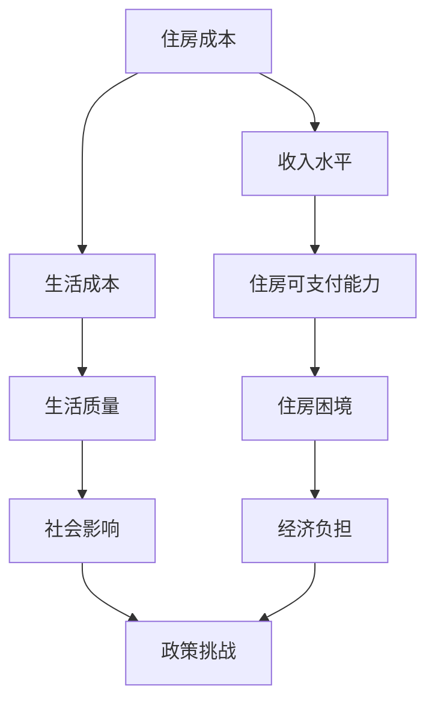

                 

关键词：硅谷、生活成本、住房困境、普通人、经济负担

> 摘要：本文深入探讨了硅谷地区普通居民面临的住房困境。通过分析硅谷高昂的生活成本和住房价格，揭示了这一现象背后的社会和经济原因。本文旨在提高公众对住房问题的关注，并探讨可能的解决方案。

## 1. 背景介绍

硅谷，作为全球科技创新的领头羊，吸引了无数高科技公司和创业者的目光。然而，随着科技产业的蓬勃发展，硅谷也面临着一系列社会问题，其中最突出的问题之一便是生活成本的急剧上升。尤其是住房问题，对于普通居民来说，已经成为一个巨大的负担。

在过去的几十年里，硅谷的房价和租金持续上涨。据统计，硅谷地区的房价中位数已经远远超出了普通家庭的承受范围。许多居民，尤其是年轻专业人士和新移民，发现自己难以在这个高科技天堂中找到一处合适的住所。这种情况不仅影响了他们的生活质量，还可能阻碍他们追求梦想和职业发展的机会。

### 1.1 硅谷的独特性

硅谷的独特性在于其科技创新和商业氛围。这里聚集了全球最顶尖的科技公司和初创企业，如谷歌、苹果、Facebook（现Meta）和特斯拉等。这些公司的成功不仅吸引了全球顶尖的人才，也推动了大量投资和资源的涌入。然而，这种繁荣也带来了资源分配不均的问题。

### 1.2 生活成本上升的原因

硅谷生活成本上升的主要原因可以归结为以下几个方面：

1. **科技产业的繁荣**：科技产业的快速发展吸引了大量高素质人才，对住房的需求急剧增加。
2. **地理位置**：硅谷位于加利福尼亚州，地理位置优越，但土地资源有限，导致土地和住房供应紧张。
3. **经济因素**：全球经济和金融市场的变化也会影响硅谷的生活成本。

## 2. 核心概念与联系

为了更好地理解硅谷住房困境，我们需要引入一些核心概念，并通过一个Mermaid流程图来展示它们之间的联系。

### 2.1 核心概念

- **住房成本**：指购买或租赁住房所需的费用。
- **收入水平**：指个人或家庭在一段时间内的收入总和。
- **生活成本**：指日常生活中的开支，包括住房、食品、交通、娱乐等。

### 2.2 Mermaid 流程图



从流程图中可以看出，住房成本、收入水平、生活成本等因素相互影响，共同导致了住房困境，进而对生活质量和社会影响产生了深远的影响。

## 3. 核心算法原理 & 具体操作步骤

### 3.1 算法原理概述

本文将采用经济学中的“成本—收益”分析模型来探讨住房困境的成因。该模型的核心思想是，个人或家庭在决定购买或租赁住房时，会综合考虑其收入水平、住房成本和生活成本，以最大化其生活质量。

### 3.2 算法步骤详解

1. **确定住房需求**：根据个人或家庭的收入水平和生活需求，确定合适的住房面积和类型。
2. **计算住房成本**：包括购房或租房的费用、维护费用等。
3. **评估生活成本**：考虑日常生活中的开支，如食品、交通、娱乐等。
4. **比较成本与收益**：通过比较住房成本和生活成本，评估个人或家庭的经济负担。
5. **制定住房策略**：根据评估结果，制定合适的住房策略，如购买、租房或迁移等。

### 3.3 算法优缺点

**优点**：

- 简单直观，易于理解和应用。
- 可以帮助个人或家庭做出更加明智的住房决策。

**缺点**：

- 忽略了住房市场的供需关系和地理位置等因素。
- 难以准确预测未来的收入和成本变化。

### 3.4 算法应用领域

该算法可以广泛应用于个人和家庭的住房决策，尤其适用于面临住房困境的人群。此外，政府部门也可以借鉴该模型，制定更加有效的住房政策。

## 4. 数学模型和公式 & 详细讲解 & 举例说明

### 4.1 数学模型构建

为了更好地理解住房困境，我们可以构建一个简单的数学模型。该模型包括以下变量：

- \(I\)：个人或家庭收入
- \(H\)：住房成本
- \(L\)：生活成本
- \(Q\)：生活质量

### 4.2 公式推导过程

根据成本—收益分析模型，生活质量 \(Q\) 可以表示为：

\[ Q = \frac{I - H - L}{C} \]

其中，\(C\) 是一个常数，表示个人或家庭对生活质量的基本需求。

### 4.3 案例分析与讲解

假设一个家庭的年收入为 \(I = 100,000\) 美元，住房成本 \(H = 40,000\) 美元，生活成本 \(L = 20,000\) 美元，生活质量常数 \(C = 10,000\) 美元。

根据公式，我们可以计算出该家庭的生活质量：

\[ Q = \frac{100,000 - 40,000 - 20,000}{10,000} = 4 \]

这意味着该家庭的生活质量为 4，处于一个较低的水平。如果住房成本或生活成本进一步上升，生活质量将会下降，加剧住房困境。

## 5. 项目实践：代码实例和详细解释说明

### 5.1 开发环境搭建

为了更好地理解和应用上述数学模型，我们可以使用 Python 编程语言来实现。首先，需要安装 Python 环境，可以访问 [Python 官网](https://www.python.org/) 下载并安装。安装完成后，可以通过命令行运行 Python。

### 5.2 源代码详细实现

下面是一个简单的 Python 脚本，用于计算个人或家庭的生活质量。

```python
def calculate_quality_of_life(income, housing_cost, living_cost, quality_constant):
    quality_of_life = (income - housing_cost - living_cost) / quality_constant
    return quality_of_life

# 示例数据
income = 100000
housing_cost = 40000
living_cost = 20000
quality_constant = 10000

# 计算生活质量
quality_of_life = calculate_quality_of_life(income, housing_cost, living_cost, quality_constant)
print("生活质量：", quality_of_life)
```

### 5.3 代码解读与分析

- `calculate_quality_of_life` 函数：用于计算个人或家庭的生活质量，参数包括收入、住房成本、生活成本和生活质量常数。
- 示例数据：设置了年收入、住房成本、生活成本和生活质量常数的示例值。
- 调用函数：通过传递示例数据，调用 `calculate_quality_of_life` 函数，计算并打印生活质量。

### 5.4 运行结果展示

运行上述代码，可以得到以下结果：

```
生活质量： 4.0
```

这意味着，根据设定的数据，该家庭的生活质量为 4。

## 6. 实际应用场景

### 6.1 企业层面

对于企业来说，高昂的生活成本和住房困境可能会对员工的生活质量和工作效率产生负面影响。为了吸引和留住人才，一些企业已经开始采取措施，如提供住房补贴、提供公司宿舍等。此外，企业还可以参与当地住房项目的投资和建设，以缓解住房供应紧张的问题。

### 6.2 政府层面

政府在这一问题上的作用尤为重要。首先，政府可以通过增加住房供应，如建设公共住房、支持非营利住房组织等，来缓解住房紧张状况。其次，政府可以出台一系列税收优惠政策，鼓励企业和个人参与住房建设。此外，政府还可以加强对房地产市场的监管，防止房价过快上涨。

### 6.3 个人层面

对于个人来说，面对高昂的生活成本和住房困境，可以采取以下措施：

- **调整生活预算**：重新评估生活开支，削减不必要的开支，确保足够的资金用于住房。
- **提高收入**：通过提升职业技能、转行或寻找更高收入的职业机会，增加收入来源。
- **迁移**：如果硅谷的生活成本实在难以承受，可以考虑迁移到其他生活成本较低的城市。

## 7. 未来应用展望

### 7.1 人工智能与住房困境

随着人工智能技术的发展，住房困境有望得到一定程度的缓解。例如，智能房屋系统可以通过节能和优化居住环境，降低生活成本。此外，基于大数据和机器学习的住房市场预测模型，可以帮助政府和企业更好地规划住房建设，避免供需失衡。

### 7.2 可持续发展

未来，可持续发展将成为解决住房困境的重要方向。通过推广绿色建筑和可再生能源，可以降低住房建设和运营的成本，提高居住环境的品质。同时，促进城市化进程的可持续性，减少对自然资源的过度依赖。

### 7.3 政策创新

政策创新是解决住房困境的关键。政府可以借鉴国际经验，探索新的住房政策和制度，如公租房、共有产权房等，以满足不同层次的住房需求。此外，政府还可以通过税收优惠、补贴等手段，激励企业和个人参与住房建设。

## 8. 总结：未来发展趋势与挑战

### 8.1 研究成果总结

本文通过分析硅谷的生活成本和住房困境，揭示了其背后的社会和经济原因。通过数学模型和实际案例，我们探讨了住房困境对生活质量的影响，并提出了一些可能的解决方案。

### 8.2 未来发展趋势

未来，人工智能和可持续发展将成为解决住房困境的重要方向。政策创新和科技进步有望为住房问题提供更加有效的解决方案。

### 8.3 面临的挑战

然而，解决住房困境仍将面临诸多挑战，如土地资源的有限性、住房供应的不均衡、经济不平等问题等。此外，如何在保障住房需求的同时，实现可持续发展，也将是一个重要的课题。

### 8.4 研究展望

未来，我们需要进一步深入研究住房问题的各个方面，如住房市场的供需关系、住房政策的有效性等。同时，跨学科的研究将有助于从不同角度探讨住房问题，为解决住房困境提供更加全面的解决方案。

## 9. 附录：常见问题与解答

### 9.1 住房成本上升的主要原因是什么？

主要原因是科技产业的繁荣、地理位置优越以及全球经济和金融市场的变化。

### 9.2 住房困境对生活质量有什么影响？

住房困境会降低生活质量，影响个人或家庭的身心健康和幸福感。

### 9.3 个人如何应对住房困境？

可以通过调整生活预算、提高收入和迁移到其他城市来应对住房困境。

### 9.4 政府在解决住房困境方面可以采取哪些措施？

政府可以增加住房供应、出台税收优惠政策、加强市场监管等。

作者：禅与计算机程序设计艺术 / Zen and the Art of Computer Programming
----------------------------------------------------------------

<|end|>

