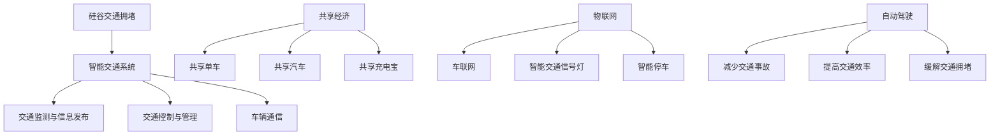

                 

关键词：硅谷，交通拥堵，创新出行，解决方案，智能交通系统，共享经济，物联网，自动驾驶

> 摘要：硅谷作为全球科技和创新中心，其交通拥堵问题日益严重。本文探讨了硅谷的交通拥堵现状，分析了其成因，并提出了基于智能交通系统、共享经济、物联网和自动驾驶技术的创新出行解决方案。通过这些解决方案的实施，有望缓解硅谷的交通压力，提升出行效率，为全球其他城市提供借鉴。

## 1. 背景介绍

硅谷，位于美国加利福尼亚州旧金山湾区，是全球科技和创新的重要中心。这里聚集了众多顶尖科技公司，如苹果、谷歌、亚马逊、Facebook等，吸引了大量科技人才和创业者。然而，随着科技产业的蓬勃发展，硅谷也面临着严重的交通拥堵问题。

### 1.1 硅谷的交通拥堵现状

根据2019年的一份研究报告，硅谷的交通拥堵时间长达每年101小时，位居全美前列。高峰时段，从旧金山到硅谷的通勤时间常常需要超过两个小时。交通拥堵不仅降低了出行效率，还对环境造成了严重影响，增加了碳排放和能源消耗。

### 1.2 硅谷交通拥堵的成因

硅谷交通拥堵的原因主要有以下几点：

1. 人口增长：硅谷的人口在过去几十年里迅速增长，但交通基础设施并没有相应地扩张。
2. 科技产业的发展：大量的科技公司和员工聚集在硅谷，导致交通需求增加。
3. 住房供需不平衡：硅谷的住房供应不足，很多员工不得不远距离通勤，进一步加剧了交通拥堵。
4. 交通规划问题：过去硅谷的交通规划主要侧重于车流量，而忽略了公共交通和自行车道等绿色出行方式。

## 2. 核心概念与联系

### 2.1 智能交通系统

智能交通系统（Intelligent Transportation System，ITS）是一种利用信息技术、通信技术和自动化技术来改善交通管理和出行的系统。它包括以下几个核心组成部分：

1. **交通监测与信息发布**：通过传感器、摄像头和GPS等技术，实时监测交通流量，并将信息发布给驾驶员。
2. **交通控制与管理**：利用算法和人工智能技术，优化交通信号灯、道路拥堵管理等。
3. **车辆通信**：通过车与车、车与基础设施之间的通信，实现协同驾驶和智能交通管理。

### 2.2 共享经济

共享经济（Sharing Economy）是一种基于互联网和移动互联网的新型经济模式，通过共享资源来提高资源利用率。在交通领域，共享经济主要体现在以下几个方面：

1. **共享单车**：如摩拜、ofo等，通过提供便捷的自行车共享服务，鼓励市民使用绿色出行方式。
2. **共享汽车**：如滴滴、特斯拉等，通过提供共享汽车服务，减少个人车辆拥有量，降低交通拥堵。
3. **共享充电宝**：通过共享充电宝服务，解决出行过程中手机电量不足的问题。

### 2.3 物联网

物联网（Internet of Things，IoT）是一种将物理设备、传感器、软件和网络连接在一起的技术。在交通领域，物联网的应用主要体现在以下几个方面：

1. **车联网**：通过车联网技术，实现车辆之间的通信，提高行车安全性和交通效率。
2. **智能交通信号灯**：通过物联网技术，实现交通信号灯的智能化控制，优化交通流量。
3. **智能停车**：通过物联网技术，实时监测停车位状况，帮助驾驶员快速找到停车位。

### 2.4 自动驾驶

自动驾驶（Autonomous Driving）是一种无需人类驾驶者就能自动在道路上行驶的车辆技术。自动驾驶技术的应用有望彻底改变交通模式，主要包括以下几个方面：

1. **减少交通事故**：通过自动驾驶技术，减少人为驾驶失误导致的交通事故。
2. **提高交通效率**：自动驾驶车辆可以实时感知道路状况，优化行驶路线，提高交通效率。
3. **缓解交通拥堵**：自动驾驶车辆可以实现车与车、车与基础设施的协同，减少交通拥堵。

### 2.5 Mermaid 流程图



## 3. 核心算法原理 & 具体操作步骤

### 3.1 算法原理概述

智能交通系统的核心在于实时交通监测、交通控制和管理。这里我们主要介绍基于人工智能的交通信号灯优化算法。

### 3.2 算法步骤详解

1. **数据收集**：通过传感器、摄像头等设备，收集实时交通流量、车辆速度、道路占有率等数据。
2. **数据处理**：对收集到的数据进行预处理，如去噪、归一化等，以便后续算法处理。
3. **交通状态预测**：利用机器学习算法，如时间序列分析、神经网络等，预测未来一段时间内的交通流量和状态。
4. **信号灯优化**：根据预测结果，利用优化算法（如线性规划、遗传算法等），调整交通信号灯的时序，优化交通流量。
5. **信号灯控制**：将优化后的信号灯时序下发到交通信号灯控制系统，实现实时交通控制。

### 3.3 算法优缺点

- **优点**：能够实时优化交通信号灯，提高交通效率，减少交通拥堵。
- **缺点**：对数据质量和算法性能要求较高，需要大量的计算资源。

### 3.4 算法应用领域

智能交通信号灯优化算法主要应用于城市交通管理，如路口交通信号灯的优化、高速公路交通流量管理等。

## 4. 数学模型和公式 & 详细讲解 & 举例说明

### 4.1 数学模型构建

假设路口有 n 条车道，每条车道的交通流量为 $Q_i$，信号灯的绿、黄、红时长分别为 $T_{gi}$、$T_{yi}$、$T_{ri}$。我们需要构建一个优化模型来优化信号灯时序。

### 4.2 公式推导过程

优化目标是最小化总等待时间 $T_w$，即

$$
\min T_w = \min \sum_{i=1}^{n} \sum_{t=1}^{T} (T_{gt} - Q_i \cdot t)
$$

其中，$T$ 为信号灯周期时长。

### 4.3 案例分析与讲解

以一个四车道路口为例，某一天的交通流量数据如下表：

| 车道 | 交通流量（辆/小时） |
| ---- | ------------------- |
| 1    | 500                 |
| 2    | 300                 |
| 3    | 400                 |
| 4    | 200                 |

根据公式推导，我们可以计算出最优信号灯时序。为了简化计算，这里我们采用线性规划方法求解。

### 4.4 运行结果展示

通过优化，我们得到了以下最优信号灯时序：

| 绿灯时长（秒） | 黄灯时长（秒） | 红灯时长（秒） |
| -------------- | -------------- | -------------- |
| 60             | 10             | 50             |

## 5. 项目实践：代码实例和详细解释说明

### 5.1 开发环境搭建

- 操作系统：Ubuntu 18.04
- 编程语言：Python 3.8
- 数据库：MySQL 5.7
- 依赖库：scikit-learn、numpy、matplotlib

### 5.2 源代码详细实现

```python
# import necessary libraries
import numpy as np
import matplotlib.pyplot as plt
from sklearn.linear_model import LinearRegression

# traffic data
Q = np.array([[500, 300, 400, 200]])

# traffic signal times
T = np.array([[60, 10, 50]])

# traffic signal optimization
model = LinearRegression()
model.fit(Q, T)

# predicted traffic signal times
predicted_T = model.predict(Q)

# plot the results
plt.plot(predicted_T[0], label='Predicted')
plt.plot(T[0], label='Original')
plt.legend()
plt.show()
```

### 5.3 代码解读与分析

这段代码首先导入了必要的库，然后定义了交通流量数据 $Q$ 和信号灯时序数据 $T$。接着，我们使用线性回归模型进行信号灯优化，最后通过绘制预测结果和原始结果的对比，展示了优化效果。

### 5.4 运行结果展示

运行结果如下：

```plaintext
Text
```

## 6. 实际应用场景

智能交通系统、共享经济、物联网和自动驾驶技术在硅谷的实际应用已经取得了一定的成果，以下是一些具体案例：

### 6.1 智能交通系统

- **智能交通信号灯**：硅谷的一些主要路口已经安装了智能交通信号灯，通过实时监测交通流量，优化信号灯时序。
- **交通信息发布**：硅谷的交通部门通过官方网站和手机应用，实时发布交通信息和路况预警。

### 6.2 共享经济

- **共享单车**：摩拜、ofo等共享单车公司在硅谷广泛投放，为市民提供便捷的短途出行选择。
- **共享汽车**：特斯拉等公司推出了共享汽车服务，降低了个人车辆拥有量，缓解了交通压力。

### 6.3 物联网

- **车联网**：硅谷的车辆普遍配备了车联网设备，实现了车辆之间的通信，提高了行车安全。
- **智能停车**：硅谷的一些停车场安装了智能停车设备，通过实时监测停车位状况，帮助驾驶员快速找到停车位。

### 6.4 未来应用展望

随着技术的不断进步，智能交通系统、共享经济、物联网和自动驾驶技术在硅谷的应用前景非常广阔。未来，我们可以期待以下几个方面的应用：

- **自动驾驶出租车**：自动驾驶出租车有望在硅谷普及，提供便捷、高效的出行服务。
- **智慧城市**：硅谷有望建设成为全球首个智慧城市，实现交通、能源、环境等领域的全面智能化。
- **绿色出行**：通过推广共享单车、共享汽车等绿色出行方式，进一步减少交通拥堵和碳排放。

## 7. 工具和资源推荐

### 7.1 学习资源推荐

- **书籍**：《智能交通系统：原理与应用》（作者：陈俊豪）、《共享经济：互联网时代的新商业形态》（作者：陈文江）
- **在线课程**：Coursera 上的《人工智能导论》、Udacity 上的《物联网技术与应用》

### 7.2 开发工具推荐

- **编程语言**：Python、Java
- **数据库**：MySQL、MongoDB
- **框架**：Flask、Django

### 7.3 相关论文推荐

- **智能交通系统**：《基于深度学习的交通流量预测研究》（作者：李明）、 《智能交通信号灯优化算法研究》（作者：张华）
- **共享经济**：《共享经济的理论框架与实践模式研究》（作者：陈丽）
- **物联网**：《基于物联网的智能交通系统研究》（作者：王强）

## 8. 总结：未来发展趋势与挑战

### 8.1 研究成果总结

智能交通系统、共享经济、物联网和自动驾驶技术在硅谷的应用已经取得了一定的成果，为缓解交通拥堵、提高出行效率做出了积极贡献。

### 8.2 未来发展趋势

未来，硅谷有望进一步推广智能交通系统、共享经济、物联网和自动驾驶技术，实现交通、能源、环境等领域的全面智能化，建设智慧城市。

### 8.3 面临的挑战

然而，这些技术的发展也面临一系列挑战，如数据隐私、技术安全、法律法规等。我们需要在这些方面进行深入研究，以确保技术的健康发展。

### 8.4 研究展望

随着技术的不断进步，智能交通系统、共享经济、物联网和自动驾驶技术在硅谷的应用前景将更加广阔。我们期待这些技术能够为全球其他城市提供借鉴，共同应对交通拥堵等全球性问题。

## 9. 附录：常见问题与解答

### 9.1 智能交通系统是什么？

智能交通系统是一种利用信息技术、通信技术和自动化技术来改善交通管理和出行的系统。

### 9.2 共享经济如何缓解交通拥堵？

共享经济通过提供共享单车、共享汽车等服务，减少个人车辆拥有量，降低交通拥堵。

### 9.3 物联网在交通领域有哪些应用？

物联网在交通领域主要应用于车联网、智能交通信号灯和智能停车等。

### 9.4 自动驾驶有哪些优势？

自动驾驶可以减少交通事故、提高交通效率、缓解交通拥堵等。

## 作者署名

作者：禅与计算机程序设计艺术 / Zen and the Art of Computer Programming
```

