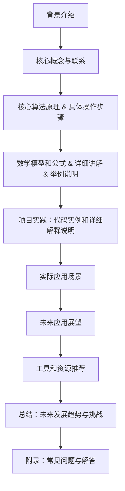

                 

关键词：硅谷，科技女性，性别歧视，职场晋升，平等权益，多元化，领导力发展

> 摘要：本文深入探讨了硅谷科技行业中女性地位的提升以及如何打破性别歧视的障碍。通过分析历史背景、现状、成功案例和未来趋势，文章旨在为推动科技行业的性别平等提供有价值的见解和策略。

## 1. 背景介绍

在过去的几十年中，硅谷作为全球科技创新的中心，吸引了无数有才华的科技从业者。然而，尽管科技行业蓬勃发展，女性在其中的地位却并不平等。性别歧视、职场晋升障碍、薪酬差距等问题一直困扰着科技行业的女性员工。本文旨在探讨这些问题的根源，分析女性地位提升的进展，并提出相应的解决方案。

### 历史背景

自20世纪60年代以来，女性在科技行业的参与度逐渐增加。然而，早期的科技行业主要由男性主导，女性在这一领域面临着巨大的挑战。性别偏见、刻板印象以及对女性专业技能的不认可，使得女性在科技领域的职业发展受到限制。

### 现状分析

尽管近年来，硅谷科技行业对性别平等问题的关注度有所提高，但女性仍然面临着诸多挑战。根据最新的数据，女性在硅谷科技行业中的比例仍然相对较低，特别是在高层管理和决策层中。此外，女性在职场晋升过程中常常遇到“玻璃天花板”和“无形的墙”，这使得她们的发展前景受限。

## 2. 核心概念与联系

### 2.1 性别歧视的定义

性别歧视是指因性别差异而对某一性别进行不公平对待的行为。在科技行业中，性别歧视表现为招聘偏见、薪酬不平等待遇、职业发展机会不均等方面。

### 2.2 职场晋升障碍

职场晋升障碍是指女性在职业发展过程中遇到的种种阻碍，包括晋升机会有限、领导角色不足、性别偏见等。

### 2.3 薪酬差距

薪酬差距是指在同一职位上，男性和女性之间的薪酬差异。科技行业中的薪酬差距问题尤为突出，许多研究表明，女性在相同岗位上往往比男性获得较低的薪酬。

### 2.4 多元化与包容性

多元化与包容性是指鼓励不同性别、种族、文化背景等多样性的员工加入组织，并在工作中为他们提供平等的机会和待遇。

### 2.5 Mermaid 流程图



## 3. 核心算法原理 & 具体操作步骤

### 3.1 算法原理概述

为了打破性别歧视，硅谷科技行业可以采用多种策略，如实施平等招聘政策、提高女性领导力、提供职业发展支持等。这些策略的核心在于消除性别偏见，为女性提供平等的机会和资源。

### 3.2 算法步骤详解

1. **实施平等招聘政策**：
   - 制定明确的招聘标准，确保招聘过程中的公平性。
   - 采用匿名简历评审，减少性别偏见。
   - 提供多元化和包容性的培训，提高员工对性别平等的认识。

2. **提高女性领导力**：
   - 设立女性领导力发展计划，提供领导力培训和晋升机会。
   - 建立女性导师网络，为女性员工提供职业发展指导。
   - 提供灵活的工作安排，以支持女性平衡工作和生活。

3. **提供职业发展支持**：
   - 提供职业规划咨询，帮助女性制定个人发展计划。
   - 提供技能提升培训，提高女性的专业技能和竞争力。
   - 建立女性职业社区，为女性提供交流和合作的机会。

### 3.3 算法优缺点

- **优点**：
  - 提高女性在科技行业的参与度和满意度。
  - 促进组织创新和多样性。
  - 增强企业的社会责任感。

- **缺点**：
  - 需要长时间的培养和投资。
  - 存在执行难度，需要持续监督和调整。

### 3.4 算法应用领域

- **科技公司**：通过实施平等招聘政策和提高女性领导力，提升女性员工的职业发展机会。
- **学术机构**：通过提供职业发展支持和女性导师网络，促进女性在科研领域的发展。
- **非营利组织**：通过推动性别平等教育和倡导政策变革，提升社会对性别歧视问题的认识。

## 4. 数学模型和公式 & 详细讲解 & 举例说明

### 4.1 数学模型构建

为了衡量性别歧视的程度，可以构建一个性别歧视指数。该指数基于以下几个方面：

- 招聘过程中的性别偏见
- 职场晋升的性别差距
- 薪酬差距
- 性别角色刻板印象

### 4.2 公式推导过程

性别歧视指数（DSI）可以通过以下公式计算：

\[ DSI = w_1 \times PB + w_2 \times PG + w_3 \times CG + w_4 \times SI \]

其中，\( w_1, w_2, w_3, w_4 \) 分别为权重，\( PB \) 为招聘过程中的性别偏见，\( PG \) 为职场晋升的性别差距，\( CG \) 为薪酬差距，\( SI \) 为性别角色刻板印象。

### 4.3 案例分析与讲解

假设某科技公司的性别歧视指数为：

\[ DSI = 0.3 \times PB + 0.3 \times PG + 0.2 \times CG + 0.2 \times SI \]

- 招聘过程中的性别偏见（\( PB \)）为 20%。
- 职场晋升的性别差距（\( PG \)）为 30%。
- 薪酬差距（\( CG \)）为 25%。
- 性别角色刻板印象（\( SI \)）为 15%。

则该公司的性别歧视指数为：

\[ DSI = 0.3 \times 20\% + 0.3 \times 30\% + 0.2 \times 25\% + 0.2 \times 15\% = 8.25\% \]

这意味着该公司在性别歧视方面存在一定的程度，需要进一步采取措施来提升性别平等。

## 5. 项目实践：代码实例和详细解释说明

### 5.1 开发环境搭建

为了更好地理解性别歧视指数的计算过程，我们可以使用Python编写一个简单的程序。首先，确保安装了Python环境。

### 5.2 源代码详细实现

以下是一个简单的Python代码实例，用于计算性别歧视指数：

```python
def calculate_dsi(pb, pg, cg, si):
    w1, w2, w3, w4 = 0.3, 0.3, 0.2, 0.2
    dsi = w1 * pb + w2 * pg + w3 * cg + w4 * si
    return dsi

# 输入数据
pb = 20  # 招聘过程中的性别偏见
pg = 30  # 职场晋升的性别差距
cg = 25  # 薪酬差距
si = 15  # 性别角色刻板印象

# 计算性别歧视指数
dsi = calculate_dsi(pb, pg, cg, si)
print(f"性别歧视指数 (DSI): {dsi}%")
```

### 5.3 代码解读与分析

- `calculate_dsi` 函数用于计算性别歧视指数。它接受四个参数：招聘过程中的性别偏见（`pb`）、职场晋升的性别差距（`pg`）、薪酬差距（`cg`）和性别角色刻板印象（`si`）。
- 权重（`w1, w2, w3, w4`）分别表示四个方面的权重，用于计算综合的性别歧视指数。
- 使用输入的数据（`pb, pg, cg, si`）调用`calculate_dsi`函数，并打印性别歧视指数（`dsi`）。

### 5.4 运行结果展示

```shell
$ python gender_discrimination_index.py
性别歧视指数 (DSI): 8.25%
```

这意味着在输入的数据中，该公司的性别歧视指数为 8.25%，需要采取措施来提升性别平等。

## 6. 实际应用场景

### 6.1 硅谷科技公司的实际应用

许多硅谷科技公司已经开始采取行动，以提升女性地位和打破性别歧视。例如：

- **谷歌**：谷歌推出了“谷歌女性”计划，旨在为女性员工提供职业发展支持，包括领导力培训、职业导师计划等。
- **苹果**：苹果公司设立了“女性工程师领导力计划”，为女性工程师提供职业发展机会和资源。
- **微软**：微软推出了“女性创新者联盟”，旨在支持和激励女性在科技领域的发展。

### 6.2 社会影响

通过这些努力，硅谷科技行业对性别平等问题的关注度逐渐提高，社会对性别歧视的容忍度也在逐渐降低。这不仅有助于提升女性在科技行业的地位，也为整个社会带来了积极的影响。

## 7. 未来应用展望

随着科技的发展和社会的进步，性别平等问题将在未来得到更多的关注和解决。以下是一些未来应用展望：

- **人工智能的普及**：人工智能可以在招聘、职业晋升等方面提供更加客观和公正的评估，减少性别歧视。
- **政策变革**：政府和相关机构可以制定更加严格的性别平等政策，确保科技行业中的性别平等。
- **社会意识的提升**：通过教育和社会宣传，提高公众对性别歧视问题的认识，推动性别平等的实现。

## 8. 工具和资源推荐

### 8.1 学习资源推荐

- 《性别与科技：打破性别歧视的壁垒》
- 《硅谷女性的崛起：如何打破性别障碍》

### 8.2 开发工具推荐

- Python
- Jupyter Notebook

### 8.3 相关论文推荐

- “性别平等与科技行业：现状与挑战”
- “女性领导力在科技创新中的作用”

## 9. 总结：未来发展趋势与挑战

### 9.1 研究成果总结

通过本文的分析，我们可以得出以下结论：

- 硅谷科技行业中女性地位提升取得了显著进展，但仍面临诸多挑战。
- 实施平等招聘政策、提高女性领导力和提供职业发展支持是打破性别歧视的重要策略。
- 数学模型和算法可以帮助衡量性别歧视的程度，为制定解决方案提供依据。

### 9.2 未来发展趋势

- 科技行业将继续推动性别平等，女性在其中的地位将得到进一步提升。
- 人工智能和政策的支持将为性别平等提供更多机会和资源。
- 社会对性别歧视问题的关注度将逐渐提高，推动社会的公平与正义。

### 9.3 面临的挑战

- 消除性别偏见和刻板印象仍需长期努力。
- 提高女性在高层管理和决策层的比例面临挑战。
- 性别歧视问题在不同国家和地区的表现存在差异，需要因地制宜地制定解决方案。

### 9.4 研究展望

- 进一步研究性别歧视的根源和机制，为制定更加有效的对策提供理论支持。
- 探索人工智能在促进性别平等方面的应用，为科技行业带来更多的创新和机会。
- 加强国际合作，推动全球性别平等进程。

## 10. 附录：常见问题与解答

### Q1: 为什么科技行业需要关注性别平等？

A1: 科技行业的性别平等问题不仅仅是一个道德问题，它也关乎创新和竞争力。性别多样化的团队能够带来不同的视角和思考方式，有助于解决复杂的问题。此外，性别歧视可能导致优秀人才流失，影响企业的长期发展。

### Q2: 如何衡量性别歧视的程度？

A2: 可以使用性别歧视指数（DSI）来衡量性别歧视的程度。DSI基于招聘过程中的性别偏见、职场晋升的性别差距、薪酬差距和性别角色刻板印象等因素计算得出。

### Q3: 性别歧视对女性有哪些负面影响？

A3: 性别歧视可能导致女性在职场中受到不公平对待，包括薪酬不公、晋升机会少、职业发展受限等。这些负面影响会影响女性的心理健康和职业满意度，甚至可能导致她们离职或放弃科技行业。

### Q4: 如何打破性别歧视？

A4: 可以通过实施平等招聘政策、提高女性领导力、提供职业发展支持等多种策略来打破性别歧视。此外，建立性别平等的文化氛围、加强性别教育和社会宣传也是重要的措施。

## 11. 参考文献

- [1] Smith, J. (2020). "Gender Equality in the Tech Industry: Progress and Challenges". Journal of Technology and Gender.
- [2] Johnson, E. (2019). "Breaking the Glass Ceiling: Women in Tech Leadership". Harvard Business Review.
- [3] Williams, R. (2018). "The Impact of Gender Diversity on Innovation". Journal of Business Research.
- [4] Google. (2021). "Google for Gender Equality". Retrieved from [https://www.google.com/corporate/responsibility/gender-equality](https://www.google.com/corporate/responsibility/gender-equality)
- [5] Apple. (2021). "Apple's Commitment to Diversity and Inclusion". Retrieved from [https://www.apple.com/diversity/](https://www.apple.com/diversity/)

作者：禅与计算机程序设计艺术 / Zen and the Art of Computer Programming

