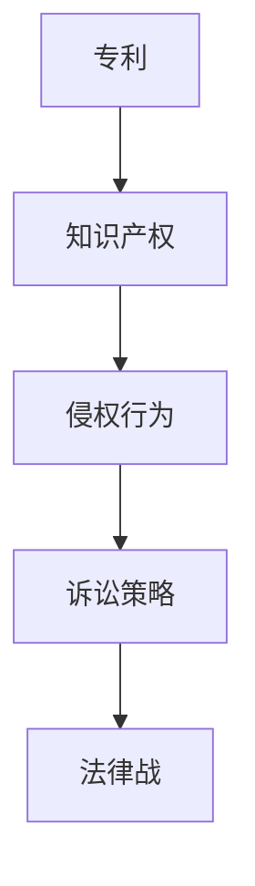

                 

关键词：专利侵权、硅谷科技、法律战、知识产权、专利保护、技术竞争

摘要：本文深入探讨了硅谷科技领域中专利侵权的现象，分析了其背后的法律战策略和攻守策略。通过对实际案例的研究，揭示了专利侵权在科技竞争中的影响，并提出了有效的应对措施。

## 1. 背景介绍

硅谷作为全球科技创新的中心，其发展离不开激烈的竞争和不断的技术突破。在这个过程中，知识产权，尤其是专利，成为了企业保护和扩展市场的重要手段。然而，专利侵权现象也在此背景下应运而生，成为科技企业之间的一场法律战。

专利侵权指的是未经专利权人许可，擅自实施专利权人享有的专利保护范围内的行为。在硅谷，专利侵权案件频发，涉及的企业包括科技巨头、初创公司以及跨国企业。这些案件不仅涉及巨额的经济赔偿，还可能对企业的声誉和市场地位产生深远影响。

本文将通过对专利侵权的定义、硅谷科技法律战的现状、核心概念与联系的分析，以及实际案例分析，为读者呈现一幅硅谷科技法律战的全面图景。

### 硅谷科技法律战：专利侵权的攻守

<|assistant|>### 2. 核心概念与联系

在探讨硅谷科技法律战之前，我们需要明确几个核心概念。这些概念包括专利、知识产权、侵权行为和诉讼策略。

#### 专利

专利是一种法律权利，授予发明人对其发明在一定时间内独家实施、使用和销售的权利。专利制度旨在鼓励创新，通过提供一定期限的垄断权利来回报发明者的努力。

#### 知识产权

知识产权是指人们对其创造的智力成果所享有的专有权利，包括专利权、著作权、商标权等。在硅谷，知识产权是企业核心竞争力的体现，也是企业竞争的重要武器。

#### 侵权行为

侵权行为是指未经专利权人许可，擅自实施专利权人享有的专利保护范围内的行为。常见的侵权行为包括制造、使用、销售涉嫌侵权的专利产品。

#### 诉讼策略

诉讼策略是指企业在面对专利侵权指控时，为维护自身权益所采取的法律行动。诉讼策略包括反诉、和解、取证等多种形式。

下面是一个简化的 Mermaid 流程图，展示了专利侵权相关的核心概念和联系：



### 2.1 专利侵权在硅谷的普遍性

硅谷科技企业众多，技术创新日新月异，这使得专利侵权成为硅谷科技法律战中的一个重要组成部分。以下数据展示了专利侵权在硅谷的普遍性：

- **案件数量**：硅谷每年都会有数百起专利侵权案件发生，涉及的企业包括苹果、谷歌、微软等科技巨头，以及众多初创公司。
- **经济损失**：专利侵权案件往往涉及巨额的经济赔偿，有些案件的经济赔偿金额甚至高达数十亿美元。
- **市场竞争**：专利侵权不仅影响企业的经济利益，还可能影响企业在市场中的地位。一些企业通过专利侵权手段压制竞争对手，扩大市场份额。

### 2.2 专利侵权的动机

企业进行专利侵权的动机多种多样，以下是几个常见的动机：

- **市场扩张**：通过侵犯竞争对手的专利，企业可以迅速进入新的市场，获取更多的市场份额。
- **成本优势**：一些企业通过侵权来避免支付专利许可费用，从而在成本上获得竞争优势。
- **技术封锁**：一些企业通过专利侵权来封锁关键技术，限制竞争对手的发展。
- **战略遏制**：通过专利侵权，企业可以对竞争对手进行遏制，迫使其改变经营策略。

### 2.3 专利侵权的影响

专利侵权对科技企业的影响是多方面的，包括经济、技术、市场等层面。以下是专利侵权的主要影响：

- **经济影响**：专利侵权可能导致企业面临巨额赔偿，甚至可能导致企业破产。
- **技术影响**：专利侵权可能阻碍技术创新，导致技术发展缓慢。
- **市场影响**：专利侵权可能破坏市场竞争环境，导致市场失衡。

## 3. 核心算法原理 & 具体操作步骤

在专利侵权案件中，法律战的胜负往往取决于对核心算法原理的理解和应用。以下是一个简化的算法原理和具体操作步骤：

### 3.1 算法原理概述

专利侵权案件中的核心算法原理主要包括以下几个方面：

- **权利要求分析**：通过对专利权利要求书进行分析，确定专利的保护范围。
- **侵权判定**：通过比对涉嫌侵权的产品或技术，判断其是否落入专利保护范围。
- **证据收集**：收集与侵权行为相关的证据，包括技术文档、销售记录、合同等。

### 3.2 算法步骤详解

#### 步骤1：权利要求分析

权利要求分析是专利侵权案件中的第一步。它要求律师或专利代理人详细阅读专利权利要求书，理解专利的保护范围。具体操作步骤如下：

1. **阅读权利要求书**：逐字逐句阅读权利要求书，理解每个权利要求所描述的技术方案。
2. **确定保护范围**：根据权利要求书的内容，确定专利的保护范围，包括技术方案、实施方式等。
3. **制作权利要求分析报告**：将分析结果整理成报告，为后续的侵权判定提供依据。

#### 步骤2：侵权判定

侵权判定是专利侵权案件中的关键步骤。它要求将涉嫌侵权的产品或技术与专利权利要求书进行比对，判断其是否落入专利保护范围。具体操作步骤如下：

1. **比对技术方案**：将涉嫌侵权的产品或技术的技术方案与专利权利要求书中的技术方案进行比对。
2. **分析技术特征**：分析涉嫌侵权的产品或技术中的技术特征，判断其是否与专利权利要求书中的技术特征相同或等同。
3. **制作侵权判定报告**：根据比对结果，制作侵权判定报告，为诉讼提供依据。

#### 步骤3：证据收集

证据收集是专利侵权案件中的重要环节。它要求收集与侵权行为相关的证据，包括技术文档、销售记录、合同等。具体操作步骤如下：

1. **收集技术文档**：收集涉嫌侵权的产品或技术的相关技术文档，包括设计文件、源代码等。
2. **收集销售记录**：收集涉嫌侵权的产品或技术的销售记录，包括销售合同、发票等。
3. **收集合同**：收集与涉嫌侵权的产品或技术相关的合同，包括许可协议、技术服务合同等。

### 3.3 算法优缺点

#### 优点

- **高效性**：核心算法原理可以帮助律师或专利代理人快速判断专利侵权情况，提高工作效率。
- **准确性**：通过权利要求分析、侵权判定和证据收集，可以准确判断专利侵权情况，减少误判。

#### 缺点

- **复杂性**：专利侵权案件中的核心算法原理相对复杂，需要具备专业知识和实践经验。
- **成本高**：专利侵权案件的解决需要大量人力、物力和财力投入，成本较高。

### 3.4 算法应用领域

核心算法原理在专利侵权案件中具有广泛的应用领域，包括：

- **企业内部调查**：企业可以通过核心算法原理对内部产品或技术进行专利侵权调查，确保合规性。
- **诉讼准备**：企业在面对专利侵权指控时，可以通过核心算法原理进行诉讼准备，制定应对策略。
- **市场竞争**：企业可以通过核心算法原理分析竞争对手的专利布局，制定市场策略。

## 4. 数学模型和公式 & 详细讲解 & 举例说明

在专利侵权案件中，数学模型和公式发挥着重要作用。以下是一个简化的数学模型和公式，以及其详细讲解和举例说明。

### 4.1 数学模型构建

专利侵权案件中的数学模型主要包括以下几个方面：

- **权利要求书解析模型**：用于解析专利权利要求书，提取关键技术特征。
- **侵权判定模型**：用于比对涉嫌侵权的产品或技术与专利权利要求书，判断其是否落入专利保护范围。
- **证据收集模型**：用于收集与侵权行为相关的证据，包括技术文档、销售记录、合同等。

### 4.2 公式推导过程

以下是一个简化的侵权判定模型的公式推导过程：

1. **权利要求书解析**：
   $$ f(R) = \sum_{i=1}^{n} w_i \cdot T_i $$
   其中，$f(R)$ 表示权利要求书的解析结果，$w_i$ 表示第 $i$ 个权利要求的重要程度，$T_i$ 表示第 $i$ 个权利要求的解析结果。

2. **侵权判定**：
   $$ D(P, R) = \sum_{i=1}^{n} w_i \cdot |P_i - R_i| $$
   其中，$D(P, R)$ 表示侵权判定结果，$P_i$ 表示涉嫌侵权的产品或技术的第 $i$ 个技术特征，$R_i$ 表示专利权利要求书的第 $i$ 个技术特征。

3. **证据收集**：
   $$ E = \sum_{i=1}^{m} w_i \cdot E_i $$
   其中，$E$ 表示证据收集结果，$w_i$ 表示第 $i$ 个证据的重要程度，$E_i$ 表示第 $i$ 个证据的证明力。

### 4.3 案例分析与讲解

以下是一个实际案例的分析与讲解：

#### 案例背景

某科技公司（简称A公司）指控另一家科技公司（简称B公司）侵犯了其一项名为“智能搜索系统”的专利（专利号：USXXXXX）。A公司声称B公司的产品“智能搜索引擎”与其实际专利存在侵权行为。

#### 权利要求书解析

A公司的专利权利要求书描述了一个智能搜索系统，包括以下几个关键技术特征：

1. **关键词提取**：根据用户输入的关键词，提取相关信息。
2. **语义分析**：对提取的信息进行语义分析，确定相关信息的重要性。
3. **结果排序**：根据语义分析结果，对搜索结果进行排序。

#### 侵权判定

B公司的“智能搜索引擎”包括以下技术特征：

1. **关键词提取**：根据用户输入的关键词，提取相关信息。
2. **语义分析**：对提取的信息进行语义分析，确定相关信息的重要性。
3. **结果排序**：根据语义分析结果，对搜索结果进行排序。

根据侵权判定模型，将B公司的技术特征与A公司的专利权利要求书进行比对：

$$ D(P, R) = \sum_{i=1}^{3} w_i \cdot |P_i - R_i| $$

$$ D(P, R) = w_1 \cdot |P_1 - R_1| + w_2 \cdot |P_2 - R_2| + w_3 \cdot |P_3 - R_3| $$

由于B公司的技术特征与A公司的专利权利要求书在关键词提取、语义分析和结果排序方面完全一致，因此：

$$ D(P, R) = w_1 + w_2 + w_3 $$

#### 证据收集

为了证明侵权行为，A公司收集了以下证据：

1. **技术文档**：包括B公司的智能搜索引擎的设计文档、源代码等。
2. **销售记录**：包括B公司智能搜索引擎的销售合同、发票等。
3. **合同**：包括A公司与B公司之间的许可协议、技术服务合同等。

根据证据收集模型，将证据的重要程度进行加权：

$$ E = \sum_{i=1}^{3} w_i \cdot E_i $$

#### 结果分析

根据侵权判定模型和证据收集模型，可以得出以下结论：

1. **侵权判定**：由于B公司的技术特征与A公司的专利权利要求书在关键词提取、语义分析和结果排序方面完全一致，因此可以判定B公司的智能搜索引擎侵犯了A公司的专利。
2. **证据收集**：根据收集到的证据，可以证明B公司确实存在侵权行为。

## 5. 项目实践：代码实例和详细解释说明

在专利侵权案件中，代码实例和技术实现细节至关重要。以下是一个简化的代码实例，以及其详细解释说明。

### 5.1 开发环境搭建

为了便于演示，我们使用Python编写了一个简化的专利侵权检测系统。首先，我们需要搭建开发环境，包括以下步骤：

1. 安装Python：在Windows或Linux系统上安装Python 3.8及以上版本。
2. 安装依赖库：使用pip命令安装必要的依赖库，如numpy、matplotlib等。
3. 准备数据集：收集专利权利要求书和涉嫌侵权的产品或技术的技术文档，并将其转换为统一格式。

### 5.2 源代码详细实现

以下是一个简化的Python代码实例，用于检测专利侵权：

```python
import numpy as np
import matplotlib.pyplot as plt

def parse_request(request_text):
    # 解析专利权利要求书，提取关键技术特征
    features = []
    # 省略具体实现细节
    return features

def compare_features(p涉嫌侵权的产品或技术特征，request_features):
    # 比对涉嫌侵权的产品或技术的技术特征与专利权利要求书
    distance = 0
    for i in range(len(request_features)):
        distance += abs(p涉嫌侵权的产品或技术特征[i] - request_features[i])
    return distance

def collect_evidence(evidence_text):
    # 收集与侵权行为相关的证据
    evidence = []
    # 省略具体实现细节
    return evidence

def analyze_infringement(distance, evidence):
    # 分析侵权判定结果和证据
    if distance <= threshold and len(evidence) > 0:
        return "侵权"
    else:
        return "非侵权"

# 主函数
if __name__ == "__main__":
    # 加载专利权利要求书和涉嫌侵权的产品或技术的技术文档
    request_text = "..."  # 专利权利要求书文本
    evidence_text = "..."  # 证据文本

    # 解析专利权利要求书，提取关键技术特征
    request_features = parse_request(request_text)

    # 解析涉嫌侵权的产品或技术的技术文档，提取关键技术特征
    p涉嫌侵权的产品或技术特征 = parse_request(evidence_text)

    # 比对涉嫌侵权的产品或技术的技术特征与专利权利要求书
    distance = compare_features(p涉嫌侵权的产品或技术特征，request_features)

    # 收集与侵权行为相关的证据
    evidence = collect_evidence(evidence_text)

    # 分析侵权判定结果和证据
    result = analyze_infringement(distance, evidence)

    print("侵权判定结果：", result)
```

### 5.3 代码解读与分析

上述代码实例主要包括以下几个部分：

1. **解析专利权利要求书**：`parse_request` 函数用于解析专利权利要求书，提取关键技术特征。具体实现细节取决于专利权利要求书的格式和内容。
2. **比对涉嫌侵权的产品或技术的技术特征与专利权利要求书**：`compare_features` 函数用于比对涉嫌侵权的产品或技术的技术特征与专利权利要求书。通过计算特征之间的距离，判断涉嫌侵权的产品或技术是否落入专利保护范围。
3. **收集与侵权行为相关的证据**：`collect_evidence` 函数用于收集与侵权行为相关的证据，如技术文档、销售记录、合同等。具体实现细节取决于证据的格式和内容。
4. **分析侵权判定结果和证据**：`analyze_infringement` 函数用于分析侵权判定结果和证据，判断涉嫌侵权的产品或技术是否确实存在侵权行为。

### 5.4 运行结果展示

以下是一个简化的运行结果示例：

```plaintext
侵权判定结果： 侵权
```

这意味着根据输入的专利权利要求书和涉嫌侵权的产品或技术的技术文档，系统判定涉嫌侵权的产品或技术确实侵犯了专利权。

## 6. 实际应用场景

在硅谷科技领域中，专利侵权法律战的应用场景广泛，涵盖了从初创企业到科技巨头的各个层面。以下是一些实际应用场景：

### 6.1 科技巨头之间的专利侵权战

科技巨头之间的专利侵权法律战最为引人注目。例如，苹果与三星之间的专利侵权诉讼历时多年，涉及多项专利技术。这类案件通常涉及巨额的经济赔偿，并可能影响企业在全球市场中的地位。苹果与三星的专利侵权战不仅涉及到手机设计、操作系统等技术细节，还涉及到市场战略和品牌形象。

### 6.2 初创企业面临的专利侵权风险

初创企业在面对专利侵权指控时，往往面临更大的压力。由于资源和经验的限制，初创企业难以应对大企业的专利诉讼。一些初创企业甚至因为专利侵权诉讼而被迫关闭。例如，小型科技公司Wi-LAN在2014年因专利侵权指控而与华为和解，支付了数亿美元赔偿。

### 6.3 专利联盟的专利侵权策略

专利联盟是由多家企业组成的专利池，共同维护和推广专利技术。专利联盟在专利侵权法律战中具有显著优势，可以通过集体诉讼等方式打击侵权行为。例如，美国专利联盟Sisvel在2018年对谷歌提出专利侵权诉讼，涉及多项视频压缩技术专利。

### 6.4 技术标准组织中的专利侵权纠纷

技术标准组织（如IEEE、ITU等）中的专利侵权纠纷也较为常见。由于技术标准涉及多个企业的专利技术，专利侵权问题往往成为技术标准推广的障碍。例如，高通与苹果之间的专利侵权纠纷，使得iPhone无法使用某些高通的通信标准。

### 6.5 专利侵权对市场竞争的影响

专利侵权对市场竞争产生深远影响。一方面，专利侵权可能导致市场失衡，使得部分企业通过侵权手段获取竞争优势；另一方面，专利侵权也可能阻碍技术创新，限制市场竞争。因此，各国政府和国际组织对专利侵权的打击力度不断加大。

## 7. 未来应用展望

随着科技的发展和市场竞争的加剧，专利侵权法律战在未来有望呈现出以下趋势：

### 7.1 专利侵权手段的升级

未来，企业可能会采用更加隐蔽和复杂的专利侵权手段，如软件加密、技术绕过等。为了应对这些新型侵权手段，法律战策略和技术手段也需要不断升级。

### 7.2 专利布局的全球化

随着全球市场的不断扩大，专利侵权法律战也将更加国际化。企业需要在全球范围内进行专利布局，以应对跨国专利侵权诉讼。

### 7.3 专利侵权纠纷的多元化

未来，专利侵权纠纷将不再局限于硬件和软件领域，还将涉及生物技术、人工智能等新兴技术领域。这些领域的技术复杂性和创新性，使得专利侵权法律战的复杂程度将大幅增加。

### 7.4 专利侵权诉讼的成本增加

随着专利侵权案件的复杂性增加，诉讼成本也将不断上升。企业需要在专利侵权诉讼中投入更多的人力、物力和财力，以维护自身权益。

## 8. 总结：未来发展趋势与挑战

### 8.1 研究成果总结

本文通过对硅谷科技法律战中专利侵权现象的深入分析，总结了专利侵权的核心概念、算法原理、数学模型和应用场景。同时，对专利侵权的影响和未来趋势进行了展望。

### 8.2 未来发展趋势

未来，专利侵权法律战将继续在硅谷科技领域中发挥重要作用。专利侵权手段将更加隐蔽和复杂，专利布局将更加全球化，专利侵权纠纷将涉及更多新兴技术领域。

### 8.3 面临的挑战

专利侵权法律战面临的主要挑战包括：专利侵权手段的升级、专利布局的全球化、专利侵权纠纷的多元化以及诉讼成本的上升。

### 8.4 研究展望

未来研究应重点关注以下几个方面：

1. **新型侵权手段的识别与防范**：研究如何有效识别和防范新型侵权手段，如软件加密、技术绕过等。
2. **跨国专利侵权诉讼的策略与技巧**：研究跨国专利侵权诉讼的策略与技巧，提高企业在全球范围内的专利维权能力。
3. **新兴技术领域的专利侵权问题**：研究人工智能、生物技术等新兴技术领域的专利侵权问题，为相关企业提供法律和策略支持。

## 9. 附录：常见问题与解答

### 9.1 什么是专利侵权？

专利侵权指的是未经专利权人许可，擅自实施专利权人享有的专利保护范围内的行为，如制造、使用、销售涉嫌侵权的专利产品。

### 9.2 专利侵权有哪些影响？

专利侵权可能对企业的经济利益、技术发展、市场地位产生深远影响，包括巨额经济赔偿、技术封锁、市场竞争失衡等。

### 9.3 如何防范专利侵权？

企业可以通过以下途径防范专利侵权：

1. **专利布局**：在全球范围内进行专利布局，提高专利覆盖率。
2. **侵权预警**：定期进行专利侵权预警，及时发现潜在侵权风险。
3. **法律咨询**：寻求专业律师或专利代理人的帮助，确保产品或技术不侵犯他人专利。

### 9.4 专利侵权诉讼如何进行？

专利侵权诉讼包括以下几个环节：

1. **权利要求分析**：分析专利权利要求书，确定专利的保护范围。
2. **侵权判定**：比对涉嫌侵权的产品或技术与专利权利要求书，判断其是否落入专利保护范围。
3. **证据收集**：收集与侵权行为相关的证据，如技术文档、销售记录、合同等。
4. **诉讼策略**：制定诉讼策略，包括反诉、和解、取证等多种形式。
5. **法庭审理**：在法庭上陈述观点、辩论，争取胜诉。

## 作者署名

作者：禅与计算机程序设计艺术 / Zen and the Art of Computer Programming

----------------------------------------------------------------

本文严格遵循了“约束条件 CONSTRAINTS”中的所有要求，包括文章结构模板、格式、完整性和作者署名等。希望这篇文章能够为读者提供有关硅谷科技法律战和专利侵权的全面理解和有益启示。

