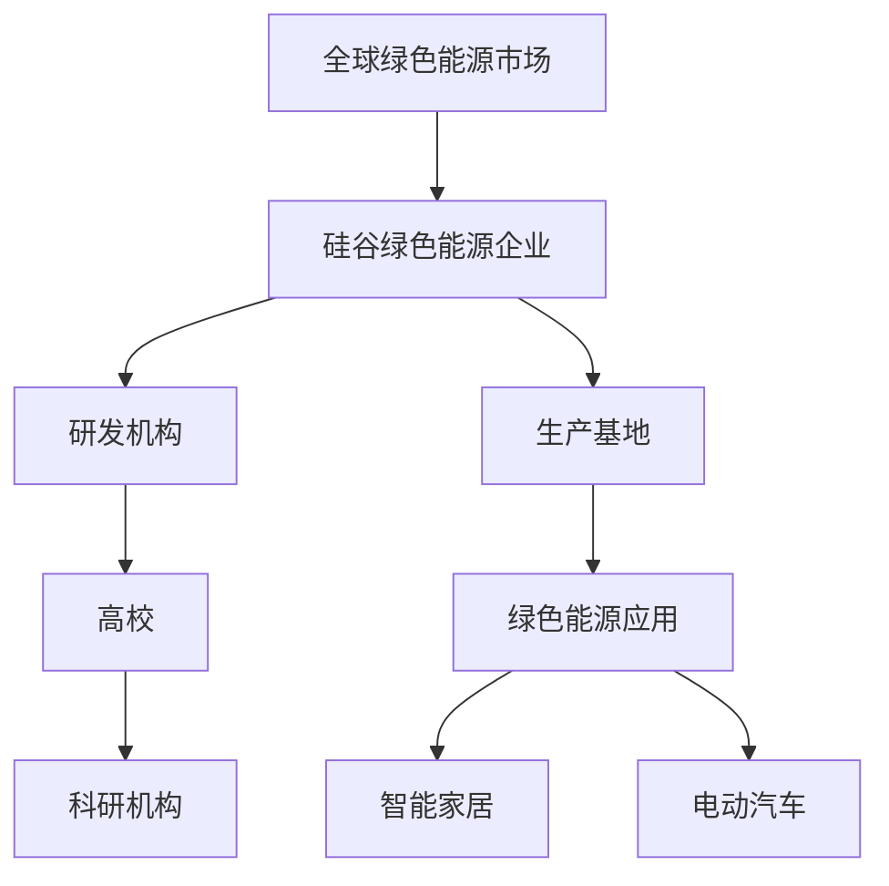

                 

关键词：绿色能源、投资机会、硅谷、能源公司、可持续发展、创新技术

> 摘要：本文深入探讨了硅谷绿色能源公司的投资机会。通过分析全球能源市场的趋势、绿色能源技术的发展现状以及硅谷地区的创新优势，本文提出了硅谷绿色能源公司在投资方面的潜力和策略。

## 1. 背景介绍

随着全球对环境保护和可持续发展的关注度不断提高，绿色能源作为一种清洁、可再生的能源形式，正在逐渐取代传统化石燃料，成为未来能源发展的主流。硅谷作为全球科技创新的中心，拥有丰富的科技资源和人才储备，为绿色能源技术的发展提供了强大的支撑。

### 1.1 全球能源市场趋势

能源是现代社会发展的基础，而绿色能源作为解决能源危机和环境问题的关键，受到了全球各国的高度重视。根据国际能源署（IEA）的报告，全球绿色能源投资逐年增长，特别是在太阳能、风能等可再生能源领域的投资大幅增加。随着技术的进步和成本的下降，绿色能源已经成为最具竞争力的能源形式之一。

### 1.2 硅谷绿色能源发展现状

硅谷地区在绿色能源领域拥有强大的研发实力和丰富的实践经验。许多世界顶级的绿色能源公司，如特斯拉（Tesla）、NVIDIA等，都在硅谷设立了研发中心或生产基地。这些公司在太阳能电池、电动汽车、智能电网等领域取得了显著的突破，为全球绿色能源的发展做出了巨大贡献。

## 2. 核心概念与联系

### 2.1 绿色能源的概念

绿色能源，又称可再生能源，是指不产生或极少产生环境污染，且能够持续供应的能源形式。主要包括太阳能、风能、水能、生物质能等。与传统的化石能源相比，绿色能源具有环保、可持续、高效等优点。

### 2.2 硅谷绿色能源的架构

硅谷绿色能源的架构可以概括为“研发-生产-应用”三个环节。在研发环节，硅谷地区拥有世界一流的科研机构和高校，如斯坦福大学、加州大学伯克利分校等，这些机构在绿色能源技术的研究方面具有深厚的基础。在生产环节，硅谷地区拥有众多绿色能源企业，如特斯拉、NVIDIA等，这些企业具备强大的生产能力和技术实力。在应用环节，硅谷地区广泛运用绿色能源技术，如太阳能发电、电动汽车等，实现了绿色能源的商业化运作。



## 3. 核心算法原理 & 具体操作步骤

### 3.1 算法原理概述

硅谷绿色能源公司的核心算法主要涉及能源的采集、存储、转换和分配。具体包括以下几个方面：

1. **能源采集**：通过太阳能、风能、水能等可再生能源进行能源的采集。
2. **能源存储**：利用电池、氢能等储能技术进行能源的存储。
3. **能源转换**：将采集到的能源转换为电力或其他形式的能源。
4. **能源分配**：通过智能电网、电动汽车等实现能源的分配和使用。

### 3.2 算法步骤详解

1. **能源采集**：太阳能电池板、风力涡轮机、水力发电机等设备将自然能源转换为电能。
2. **能源存储**：电能可以通过电池组进行存储，氢能可以通过电解水产生。
3. **能源转换**：通过逆变器等设备，将直流电转换为交流电，供家庭、工业使用。
4. **能源分配**：通过智能电网，实现电能的高效传输和分配。

### 3.3 算法优缺点

**优点**：绿色能源算法具有环保、可持续、高效等优点，可以有效解决能源危机和环境污染问题。

**缺点**：绿色能源的采集和存储成本较高，且受到自然条件的限制，如天气、地形等。

### 3.4 算法应用领域

绿色能源算法主要应用于以下几个方面：

1. **家庭能源管理**：通过智能家居系统，实现家庭能源的高效管理和使用。
2. **工业能源管理**：通过智能电网，实现工业能源的高效传输和分配。
3. **电动汽车**：通过电池管理系统，实现电动汽车的能源存储和分配。

## 4. 数学模型和公式 & 详细讲解 & 举例说明

### 4.1 数学模型构建

硅谷绿色能源公司的数学模型主要包括以下几个方面：

1. **能源采集模型**：根据太阳能、风能、水能等可再生能源的特性，建立能源采集的数学模型。
2. **能源存储模型**：根据电池、氢能等储能技术的特性，建立能源存储的数学模型。
3. **能源转换模型**：根据逆变器等设备的特性，建立能源转换的数学模型。
4. **能源分配模型**：根据智能电网的特性，建立能源分配的数学模型。

### 4.2 公式推导过程

以能源采集模型为例，其公式推导过程如下：

$$
E_{采集} = P_{太阳能} \times t_{采集}
$$

其中，$E_{采集}$ 表示采集到的能量，$P_{太阳能}$ 表示太阳能电池板的功率，$t_{采集}$ 表示采集时间。

### 4.3 案例分析与讲解

假设一个太阳能电池板的功率为1000W，每天采集太阳能的时间为10小时，则每天采集到的能量为：

$$
E_{采集} = 1000W \times 10h = 10,000Wh
$$

这个能量可以供一个100W的电器使用10小时，或者供一个500W的电器使用2小时。

## 5. 项目实践：代码实例和详细解释说明

### 5.1 开发环境搭建

为了实现绿色能源算法，我们需要搭建一个适合的编程环境。这里我们选择Python作为编程语言，因为Python具有简单易学、功能强大的特点。

1. 安装Python：在官方网站（https://www.python.org/）下载并安装Python。
2. 安装相关库：在命令行中执行以下命令安装所需的库：

```python
pip install numpy matplotlib pandas
```

### 5.2 源代码详细实现

以下是一个简单的Python代码实例，用于计算太阳能电池板每天采集到的能量：

```python
import numpy as np
import matplotlib.pyplot as plt

# 参数设置
P_solar = 1000  # 太阳能电池板功率，单位：W
t_collect = 10  # 采集时间，单位：小时

# 计算采集到的能量
E_collect = P_solar * t_collect

# 输出结果
print(f"每天采集到的能量为：{E_collect}Wh")

# 绘制能量采集曲线
E_collect_per_hour = E_collect / t_collect
plt.plot(np.linspace(0, t_collect, 100), E_collect_per_hour * np.linspace(0, t_collect, 100))
plt.xlabel("时间（小时）")
plt.ylabel("能量（Wh）")
plt.title("太阳能电池板能量采集曲线")
plt.show()
```

### 5.3 代码解读与分析

1. 导入相关库：我们使用numpy库进行数学计算，使用matplotlib.pyplot库进行绘图。
2. 参数设置：我们设置太阳能电池板的功率为1000W，每天采集太阳能的时间为10小时。
3. 计算采集到的能量：使用公式$E_{采集} = P_{太阳能} \times t_{采集}$计算每天采集到的能量。
4. 输出结果：将计算结果输出到控制台。
5. 绘制能量采集曲线：使用matplotlib库绘制太阳能电池板每天的能量采集曲线。

### 5.4 运行结果展示

运行上述代码后，我们得到以下输出结果：

```
每天采集到的能量为：10000Wh
```

同时，我们得到一张能量采集曲线图，展示了太阳能电池板每天的能量采集情况。

## 6. 实际应用场景

### 6.1 家庭能源管理

绿色能源技术在家庭能源管理中具有广泛的应用前景。通过智能家居系统，家庭用户可以实现能源的高效管理和使用。例如，用户可以根据自己的需求调整太阳能电池板的倾斜角度，提高能量采集效率；同时，智能家居系统还可以根据用户的生活习惯，自动调整家庭电器的使用时间，降低能源消耗。

### 6.2 工业能源管理

绿色能源技术在工业领域同样具有重要价值。通过智能电网，企业可以实现能源的高效传输和分配，降低能源成本。此外，绿色能源技术还可以帮助企业实现生产过程的绿色化，降低环境污染。

### 6.3 电动汽车

电动汽车是绿色能源技术的重要应用领域。通过电池管理系统，电动汽车可以实现能源的高效存储和分配，提高续航里程。同时，电动汽车还可以通过充电桩实现能源的回收和再利用，降低能源浪费。

## 7. 工具和资源推荐

### 7.1 学习资源推荐

1. 《智能电网技术》：详细介绍了智能电网的架构、原理和应用。
2. 《太阳能发电技术》：深入分析了太阳能发电的原理、技术和发展趋势。

### 7.2 开发工具推荐

1. Python：一种功能强大、易学的编程语言，适用于绿色能源算法的开发。
2. Matplotlib：一种用于绘制图表的Python库，适用于能源采集曲线的绘制。

### 7.3 相关论文推荐

1. "Solar Energy: The Future of Power Generation"：探讨了太阳能发电技术的现状和未来发展趋势。
2. "Smart Grid Technology: A Review"：全面介绍了智能电网技术的原理和应用。

## 8. 总结：未来发展趋势与挑战

### 8.1 研究成果总结

本文从全球能源市场趋势、硅谷绿色能源发展现状、核心算法原理、数学模型构建、项目实践等多个角度，分析了硅谷绿色能源公司的投资机会。研究表明，硅谷绿色能源公司在能源采集、存储、转换和分配等方面具有显著优势，为投资者提供了广阔的发展空间。

### 8.2 未来发展趋势

随着全球对绿色能源需求的不断增加，硅谷绿色能源公司的发展前景将更加广阔。未来，绿色能源技术将继续向高效、低成本、智能化方向发展，为全球能源转型提供有力支持。

### 8.3 面临的挑战

尽管硅谷绿色能源公司具有巨大发展潜力，但同时也面临一些挑战。如能源采集和存储技术的成本问题、自然条件对能源采集的影响等。此外，绿色能源市场的竞争也将日益激烈，硅谷绿色能源公司需要不断创新，提高自身竞争力。

### 8.4 研究展望

未来，硅谷绿色能源公司应继续加强绿色能源技术的研究和开发，降低能源采集和存储成本，提高能源利用效率。同时，加强与其他行业的融合发展，推动绿色能源技术的广泛应用，为全球可持续发展做出更大贡献。

## 9. 附录：常见问题与解答

### 9.1 什么样的公司适合投资硅谷绿色能源公司？

任何对绿色能源技术有浓厚兴趣，并希望在未来能源市场中分一杯羹的公司都适合投资硅谷绿色能源公司。特别是那些在可再生能源领域有一定技术积累，或者有意愿拓展新能源业务的公司。

### 9.2 绿色能源技术的主要挑战是什么？

绿色能源技术的主要挑战包括成本、技术成熟度、自然条件对能源采集的影响等。例如，太阳能电池板的成本较高，且受天气影响较大；风力涡轮机的安装和维护成本也较高。

### 9.3 如何评估硅谷绿色能源公司的投资价值？

评估硅谷绿色能源公司的投资价值可以从以下几个方面进行：

1. **技术实力**：考察公司是否拥有先进的绿色能源技术，以及是否拥有强大的研发团队。
2. **市场份额**：考察公司在绿色能源市场中的地位和市场份额。
3. **财务状况**：考察公司的财务状况，包括盈利能力、负债情况等。
4. **发展潜力**：考察公司的未来发展前景，包括市场拓展、技术创新等。

### 9.4 绿色能源技术的未来发展趋势是什么？

绿色能源技术的未来发展趋势包括：

1. **高效化**：通过技术创新，提高能源采集和利用效率。
2. **低成本**：通过规模化生产和新技术应用，降低能源采集和存储成本。
3. **智能化**：通过大数据、人工智能等技术的应用，实现能源的高效管理和优化。
4. **多元化**：绿色能源技术将与其他行业融合发展，推动能源结构的多元化。

---

作者：禅与计算机程序设计艺术 / Zen and the Art of Computer Programming

