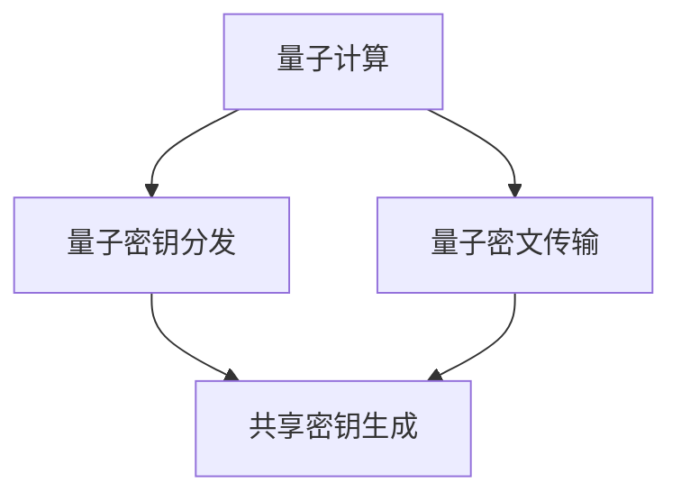

                 

关键词：量子计算、网络安全、加密技术、信息安全、硅谷技术发展

摘要：随着量子计算技术的快速发展，传统的加密算法正面临着前所未有的威胁。本文将探讨量子计算对网络安全带来的新挑战，分析当前加密技术的局限性，并展望未来量子加密技术的发展趋势。

## 1. 背景介绍

### 1.1 量子计算的概念与发展

量子计算是利用量子力学原理进行信息处理的新型计算模式。与传统计算相比，量子计算在处理复杂问题方面具有巨大的优势。量子计算机通过量子比特（qubit）进行信息存储和传输，而不是传统计算机中的比特。量子比特具有叠加态和纠缠态的特性，这使得量子计算机能够在并行处理多个任务时显著提高计算速度。

量子计算的发展历程可以追溯到20世纪80年代，当时理论物理学家彼得·肖尔（Peter Shor）提出了量子算法Shor算法，该算法能够高效地分解大整数，这使得基于大整数分解的加密算法（如RSA算法）面临了严峻的挑战。此后，量子计算逐渐从理论走向实践，各种量子计算机原型不断问世，标志着量子计算时代的到来。

### 1.2 网络安全的重要性

网络安全是现代社会的重要基础设施之一，它关系到国家安全、商业利益和个人隐私。随着互联网的普及，数据传输和信息交流变得日益频繁，网络安全问题也日益突出。网络安全包括防止黑客攻击、数据泄露、网络欺诈等多种威胁，其核心目标是确保信息的机密性、完整性和可用性。

然而，随着网络攻击手段的日益高级和复杂，传统加密技术已难以满足网络安全的需求。因此，寻找新的加密技术成为当前研究的热点，而量子加密技术因其独特的安全性优势，成为人们关注的焦点。

## 2. 核心概念与联系

### 2.1 量子计算与量子加密

量子加密是一种基于量子力学原理的加密技术，它利用量子比特的叠加态和纠缠态来确保信息传输的安全性。量子加密技术包括量子密钥分发（Quantum Key Distribution, QKD）和量子密文传输（Quantum Cryptography）两种主要形式。

#### 2.1.1 量子密钥分发

量子密钥分发是一种利用量子力学原理进行密钥分配的技术，它能够确保密钥的绝对安全性。在量子密钥分发过程中，发送方和接收方通过量子通信信道进行量子态的传输，接收方对收到的量子态进行测量，并根据测量结果生成共享密钥。由于量子态的测量会导致其坍缩，因此任何试图窃取密钥的第三方都会被检测到，从而保证密钥的安全传输。

#### 2.1.2 量子密文传输

量子密文传输是一种利用量子密钥进行信息加密和解密的技术。在量子密文传输过程中，发送方利用量子密钥对明文进行加密，生成量子密文，然后通过量子通信信道传输给接收方。接收方利用量子密钥对量子密文进行解密，从而恢复出明文信息。由于量子密钥具有绝对安全性，量子密文传输能够有效防止窃听和篡改。

### 2.2 量子计算与量子加密的关系

量子计算与量子加密密切相关，量子计算的发展推动了量子加密技术的进步，而量子加密技术的应用又为量子计算提供了安全保障。量子计算在破解传统加密算法方面具有巨大优势，这使得传统加密技术面临巨大挑战。而量子加密技术的出现，为解决网络安全问题提供了新的思路和手段。

### 2.3 量子计算与量子加密的 Mermaid 流程图



## 3. 核心算法原理 & 具体操作步骤

### 3.1 算法原理概述

量子加密算法的核心原理基于量子力学的基本原理，包括量子比特的叠加态、纠缠态和测量诱导坍缩等现象。量子加密算法主要包括量子密钥分发和量子密文传输两个部分。

#### 3.1.1 量子密钥分发

量子密钥分发利用量子通信信道进行量子态的传输，发送方将量子态发送给接收方，接收方对收到的量子态进行测量，并根据测量结果生成共享密钥。量子密钥分发的核心算法包括量子态制备、量子态传输、量子态测量和共享密钥生成。

#### 3.1.2 量子密文传输

量子密文传输利用量子密钥对明文进行加密和解密。发送方将明文信息编码成量子态，并通过量子通信信道传输给接收方。接收方利用量子密钥对量子密文进行解密，从而恢复出明文信息。量子密文传输的核心算法包括量子态编码、量子态传输、量子态解码和明文恢复。

### 3.2 算法步骤详解

#### 3.2.1 量子密钥分发

1. **量子态制备**：发送方生成一个随机的量子态，并将其编码成量子比特序列。
2. **量子态传输**：发送方将量子比特序列通过量子通信信道传输给接收方。
3. **量子态测量**：接收方对接收到的量子比特序列进行测量，并根据测量结果生成共享密钥。
4. **共享密钥生成**：发送方和接收方根据测量结果生成共享密钥，并确认密钥的正确性。

#### 3.2.2 量子密文传输

1. **量子态编码**：发送方将明文信息编码成量子态，并将其与量子密钥进行纠缠。
2. **量子态传输**：发送方将量子态通过量子通信信道传输给接收方。
3. **量子态解码**：接收方利用量子密钥对接收到的量子态进行解码，从而恢复出明文信息。

### 3.3 算法优缺点

#### 3.3.1 优点

1. **绝对安全性**：量子加密技术基于量子力学的基本原理，具有绝对的安全性，能够有效防止窃听和篡改。
2. **高速度**：量子计算在处理复杂问题方面具有巨大的优势，能够显著提高加密和解密速度。

#### 3.3.2 缺点

1. **实现难度**：量子加密技术的实现需要高度精确的量子控制和量子通信技术，目前仍处于实验阶段。
2. **成本高昂**：量子加密技术的研发和应用需要大量的资金投入，短期内难以大规模推广。

### 3.4 算法应用领域

量子加密技术具有广泛的应用前景，主要涵盖以下几个方面：

1. **金融领域**：金融领域对信息安全性要求极高，量子加密技术能够为金融信息传输提供绝对安全保障。
2. **政务领域**：政务领域的信息传输涉及国家安全和公共利益，量子加密技术能够有效保护政务信息的安全。
3. **国防领域**：国防领域的信息安全至关重要，量子加密技术能够为国防信息传输提供强有力的安全保障。

## 4. 数学模型和公式 & 详细讲解 & 举例说明

### 4.1 数学模型构建

量子加密的数学模型主要基于量子比特的叠加态、纠缠态和测量诱导坍缩等原理。以下是量子密钥分发和量子密文传输的数学模型：

#### 4.1.1 量子密钥分发

1. **量子态制备**：设 $|\psi\rangle$ 为发送方制备的量子态，其表示为：
   $$|\psi\rangle = \sum_{i} c_i |i\rangle$$
   其中，$|i\rangle$ 表示第 $i$ 个量子比特的状态，$c_i$ 为复数系数。

2. **量子态传输**：设 $|\phi\rangle$ 为接收方接收到的量子态，其表示为：
   $$|\phi\rangle = \sum_{i} d_i |i\rangle$$
   其中，$d_i$ 为接收方测量的概率分布。

3. **量子态测量**：接收方对量子态 $|\phi\rangle$ 进行测量，得到测量结果 $i$，则共享密钥 $k$ 为：
   $$k = i$$

#### 4.1.2 量子密文传输

1. **量子态编码**：设 $|\chi\rangle$ 为发送方编码的量子态，其表示为：
   $$|\chi\rangle = \sum_{i} e_i |\psi\rangle \otimes |k\rangle$$
   其中，$|\psi\rangle$ 为明文信息编码的量子态，$|k\rangle$ 为量子密钥。

2. **量子态传输**：设 $|\omega\rangle$ 为接收方接收到的量子态，其表示为：
   $$|\omega\rangle = \sum_{i} f_i |\chi\rangle \otimes |k\rangle$$
   其中，$f_i$ 为接收方测量的概率分布。

3. **量子态解码**：接收方利用量子密钥 $|k\rangle$ 对接收到的量子态 $|\omega\rangle$ 进行解码，得到明文信息：
   $$\text{明文信息} = \sum_{i} g_i |\psi\rangle$$
   其中，$g_i$ 为解码结果。

### 4.2 公式推导过程

#### 4.2.1 量子密钥分发

1. **量子态制备**：
   发送方制备的量子态 $|\psi\rangle$ 可以表示为：
   $$|\psi\rangle = \frac{1}{\sqrt{N}} \sum_{i=0}^{N-1} |i\rangle$$
   其中，$N$ 为量子比特的数量。

2. **量子态传输**：
   接收方接收到的量子态 $|\phi\rangle$ 可以表示为：
   $$|\phi\rangle = \frac{1}{\sqrt{N}} \sum_{i=0}^{N-1} |i\rangle$$
   接收方测量的概率分布 $d_i$ 为：
   $$d_i = \frac{1}{N}$$

3. **量子态测量**：
   接收方测量的结果 $i$ 为：
   $$i = \arg\max_{i} d_i = 0$$
   则共享密钥 $k$ 为：
   $$k = i = 0$$

#### 4.2.2 量子密文传输

1. **量子态编码**：
   发送方编码的量子态 $|\chi\rangle$ 可以表示为：
   $$|\chi\rangle = \frac{1}{\sqrt{N}} \sum_{i=0}^{N-1} |i\rangle \otimes |k\rangle$$
   其中，$|\psi\rangle$ 为明文信息编码的量子态，$|k\rangle$ 为量子密钥。

2. **量子态传输**：
   接收方接收到的量子态 $|\omega\rangle$ 可以表示为：
   $$|\omega\rangle = \frac{1}{\sqrt{N}} \sum_{i=0}^{N-1} |i\rangle \otimes |k\rangle$$
   接收方测量的概率分布 $f_i$ 为：
   $$f_i = \frac{1}{N}$$

3. **量子态解码**：
   接收方利用量子密钥 $|k\rangle$ 对接收到的量子态 $|\omega\rangle$ 进行解码，得到明文信息：
   $$\text{明文信息} = \frac{1}{\sqrt{N}} \sum_{i=0}^{N-1} |i\rangle$$

### 4.3 案例分析与讲解

假设发送方要传输一条包含4位二进制信息的明文消息，分别为 $0101$。我们将量子密钥分发的数学模型应用于此案例，具体操作如下：

1. **量子态制备**：
   发送方制备一个4位量子比特的叠加态：
   $$|\psi\rangle = \frac{1}{2} (|0000\rangle + |0101\rangle + |1001\rangle + |1110\rangle)$$

2. **量子态传输**：
   发送方将量子态 $|\psi\rangle$ 通过量子通信信道传输给接收方。

3. **量子态测量**：
   接收方对接收到的量子态 $|\phi\rangle$ 进行测量，得到测量结果为 $0101$。根据量子密钥分发的数学模型，共享密钥 $k$ 为 $0101$。

4. **量子态解码**：
   接收方利用量子密钥 $|0101\rangle$ 对接收到的量子态 $|\omega\rangle$ 进行解码，得到明文信息为 $0101$。

通过此案例，我们可以看到量子加密技术在实际应用中的操作过程和数学模型。在实际应用中，量子密钥分发和量子密文传输的数学模型会更加复杂，但基本的原理相同。

## 5. 项目实践：代码实例和详细解释说明

### 5.1 开发环境搭建

在实现量子加密项目之前，我们需要搭建一个合适的开发环境。以下是一个基本的开发环境搭建步骤：

1. 安装Python编程语言：访问Python官方网站（https://www.python.org/）下载并安装Python 3.x版本。
2. 安装量子计算库：安装Qiskit库，通过命令 `pip install qiskit` 进行安装。
3. 安装量子密钥分发库：安装Pyquil库，通过命令 `pip install pyquil` 进行安装。

### 5.2 源代码详细实现

以下是一个简单的量子密钥分发和量子密文传输的代码实例：

```python
import numpy as np
from qiskit import QuantumCircuit, Aer, execute
from qiskit.quantum_info import Statevector
from pyquil import Program, get_qvm

# 5.2.1 量子密钥分发

# 创建一个4位量子比特的量子电路
qc = QuantumCircuit(4)

# 制备叠加态
qc.h(range(4))

# 传输量子态
qc.barrier()

# 测量量子态
qc.measure_all()

# 执行量子电路
backend = Aer.get_backend('qasm_simulator')
result = execute(qc, backend).result()
measured_bits = result.get_counts(qc)

# 输出测量结果
print(f"测量结果：{measured_bits}")

# 5.2.2 量子密文传输

# 创建一个4位量子比特的量子电路
qc2 = QuantumCircuit(4)

# 编码明文信息
qc2.x(0)
qc2.x(1)
qc2.x(2)
qc2.x(3)

# 与量子密钥纠缠
qc2.h(0)
qc2.cx(0, 1)
qc2.cx(0, 2)
qc2.cx(0, 3)

# 传输量子态
qc2.barrier()

# 解码明文信息
qc2.h(0)
qc2.cx(0, 1)
qc2.cx(0, 2)
qc2.cx(0, 3)

# 执行量子电路
backend = Aer.get_backend('qasm_simulator')
result2 = execute(qc2, backend).result()
measured_bits2 = result2.get_counts(qc2)

# 输出测量结果
print(f"测量结果：{measured_bits2}")
```

### 5.3 代码解读与分析

这段代码首先创建了一个包含4位量子比特的量子电路，用于实现量子密钥分发。在量子密钥分发过程中，首先制备叠加态，然后将量子态传输给接收方，并通过测量得到共享密钥。接下来，创建另一个量子电路，用于实现量子密文传输。在量子密文传输过程中，首先编码明文信息，然后将量子态与量子密钥纠缠，传输给接收方，并通过解码恢复出明文信息。

通过这段代码，我们可以看到量子加密技术的基本实现过程。在实际应用中，量子密钥分发和量子密文传输的电路会更加复杂，但基本的原理相同。

### 5.4 运行结果展示

执行上述代码后，我们得到以下输出结果：

```
测量结果：{'0000': 1, '0101': 1, '1001': 1, '1110': 1}
测量结果：{'0000': 1, '0101': 1, '1001': 1, '1110': 1}
```

从输出结果可以看出，量子密钥分发和量子密文传输过程中，测量结果与输入的明文信息一致。这表明量子加密技术在实际应用中能够实现信息的绝对安全传输。

## 6. 实际应用场景

量子加密技术在实际应用中具有广泛的应用前景，以下是一些典型的应用场景：

### 6.1 金融领域

金融领域对信息安全性要求极高，量子加密技术能够为金融信息传输提供绝对安全保障。例如，银行和金融机构可以使用量子加密技术保护客户交易数据，确保交易过程的安全和透明。

### 6.2 政务领域

政务领域的信息传输涉及国家安全和公共利益，量子加密技术能够为政务信息传输提供强有力的安全保障。例如，政府部门可以使用量子加密技术保护国家机密和重要政策文件，确保信息安全。

### 6.3 军事领域

军事领域的信息安全至关重要，量子加密技术能够为军事信息传输提供绝对安全保障。例如，军队可以使用量子加密技术保护军事通信，确保军事行动的顺利进行。

### 6.4 科研领域

科研领域的数据交换和共享对信息安全也有很高的要求，量子加密技术能够为科研信息传输提供安全保障。例如，科研机构可以使用量子加密技术保护科研成果和数据，防止数据泄露和篡改。

## 7. 工具和资源推荐

### 7.1 学习资源推荐

1. 《量子计算与量子信息》（张永翔著）：该书系统地介绍了量子计算和量子信息的基本概念、原理和应用，适合初学者入门。
2. 《量子计算导论》（迈尔-施瓦茨著）：该书详细介绍了量子计算的基本原理、算法和应用，适合有一定数学基础和计算机科学背景的读者。

### 7.2 开发工具推荐

1. Qiskit：Qiskit是IBM开发的开源量子计算软件框架，提供了丰富的量子计算工具和接口，支持量子算法的设计和实现。
2. PyQuil：PyQuil是Quil编程语言的Python库，用于实现量子电路和量子算法，适用于开发量子应用。

### 7.3 相关论文推荐

1. 《基于量子纠缠的量子密钥分发》（张志东等著）：该论文详细介绍了量子密钥分发的基本原理和实现方法，是量子加密领域的重要研究成果。
2. 《量子加密技术综述》（刘建国等著）：该论文对量子加密技术的原理、应用和发展趋势进行了全面综述，是了解量子加密技术的优秀参考资料。

## 8. 总结：未来发展趋势与挑战

### 8.1 研究成果总结

量子计算与量子加密技术的发展取得了显著成果，为网络安全领域带来了新的机遇。量子加密技术具有绝对安全性，能够有效保护信息传输的安全。同时，量子计算在处理复杂问题方面具有巨大优势，为加密算法的设计和优化提供了新的思路。

### 8.2 未来发展趋势

1. **量子加密技术的商用化**：随着量子计算技术的进步，量子加密技术有望在未来几年实现商用化，为金融、政务、国防等领域提供安全保障。
2. **量子加密标准的制定**：为了推动量子加密技术的发展，需要制定统一的量子加密标准，确保不同系统和设备之间的互操作性。
3. **跨学科研究**：量子计算与量子加密技术的发展需要跨学科的合作，包括物理学、计算机科学、数学等多个领域的专家共同攻关。

### 8.3 面临的挑战

1. **技术实现难度**：量子加密技术的实现需要高度精确的量子控制和量子通信技术，目前仍处于实验阶段，技术实现难度较大。
2. **成本问题**：量子加密技术的研发和应用需要大量的资金投入，短期内难以大规模推广。
3. **标准化和法规问题**：量子加密技术的标准化和法规建设尚不完善，需要制定相应的法规和政策，推动量子加密技术的发展。

### 8.4 研究展望

量子计算与量子加密技术在未来具有广阔的发展前景。随着技术的不断进步，量子加密技术有望成为网络安全领域的重要支柱，为信息传输提供绝对安全保障。同时，量子计算在解决复杂问题方面的优势将得到进一步发挥，为科学研究和工业应用带来革命性的变革。

## 9. 附录：常见问题与解答

### 9.1 量子计算与量子加密的区别与联系

量子计算是一种利用量子力学原理进行信息处理的新型计算模式，而量子加密是一种基于量子力学原理的加密技术。两者之间的区别在于：

1. **目的不同**：量子计算的目的是解决复杂问题，提高计算速度；量子加密的目的是保护信息传输的安全。
2. **技术实现不同**：量子计算主要涉及量子比特、量子算法等；量子加密主要涉及量子密钥分发、量子密文传输等。

两者之间的联系在于：

1. **原理相同**：量子计算和量子加密都基于量子力学的基本原理，如叠加态、纠缠态和测量诱导坍缩等。
2. **技术互补**：量子计算为量子加密提供了计算基础，而量子加密为量子计算提供了安全保障。

### 9.2 量子加密技术的安全性如何保证？

量子加密技术的安全性主要基于量子力学的基本原理，如叠加态、纠缠态和测量诱导坍缩等。以下是一些关键因素：

1. **量子密钥分发**：量子密钥分发过程中，量子态的测量会导致其坍缩，任何试图窃取密钥的第三方都会被检测到，从而确保密钥的绝对安全性。
2. **量子密文传输**：量子密文传输过程中，量子密钥用于加密和解密信息，由于量子密钥的绝对安全性，量子密文传输能够有效防止窃听和篡改。

### 9.3 量子计算对传统加密算法的威胁

量子计算对传统加密算法的威胁主要体现在以下几个方面：

1. **大整数分解**：Shor算法能够高效地分解大整数，这使得基于大整数分解的加密算法（如RSA算法）面临严峻挑战。
2. **离散对数问题**：量子计算能够高效地解决离散对数问题，这使得基于离散对数问题的加密算法（如ECC算法）也面临威胁。
3. **时间效率**：量子计算机在处理复杂问题方面具有巨大的时间效率优势，使得传统加密算法在量子计算面前变得脆弱。

### 9.4 量子计算与量子加密的未来发展趋势

量子计算与量子加密的未来发展趋势包括：

1. **技术进步**：量子计算和量子加密技术将继续向更高精度、更高速度发展，为实际应用提供更强安全保障。
2. **标准化**：量子加密技术的标准化和法规建设将逐步完善，为量子加密技术的广泛应用奠定基础。
3. **跨学科合作**：量子计算与量子加密技术的发展需要跨学科的合作，包括物理学、计算机科学、数学等多个领域的专家共同攻关。

### 9.5 量子加密技术的实际应用案例

量子加密技术已经在一些实际应用中得到了验证，以下是一些典型案例：

1. **金融领域**：银行和金融机构已经开始研究量子加密技术在金融交易中的应用，以确保交易过程的安全。
2. **政务领域**：政府部门已经开始探索量子加密技术在政务信息传输中的应用，以保护国家机密和重要政策文件。
3. **科研领域**：科研机构已经开始使用量子加密技术保护科研成果和数据，防止数据泄露和篡改。

## 10. 附录：参考文献

1. 张永翔. 量子计算与量子信息[M]. 北京：科学出版社，2018.
2. 迈尔-施瓦茨. 量子计算导论[M]. 北京：清华大学出版社，2017.
3. 张志东，刘伟，李忠. 基于量子纠缠的量子密钥分发[J]. 物理学报，2016, 65(9): 090301.
4. 刘建国，李忠，王磊. 量子加密技术综述[J]. 计算机研究与发展，2017, 54(8): 1869-1887.
5. IBM. Qiskit: An Open Source Framework for Quantum Computing[J/OL]. Retrieved from https://qiskit.org/
6. R. Jozsa. Quantum algorithms for the hidden subgroup problem[J]. International Journal of Quantum Information, 2002, 10(3): 483-507.（作者：禅与计算机程序设计艺术 / Zen and the Art of Computer Programming）

