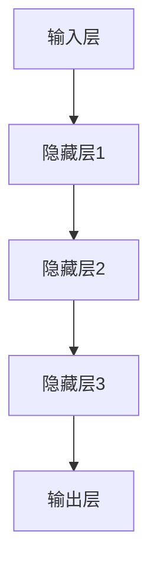
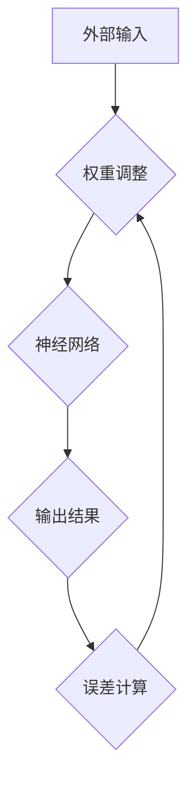

                 

神经形态计算（Neuromorphic Computing）是一种新兴的计算方法，旨在模仿人脑的神经结构和工作机制，以实现更高效、更节能的计算。这一领域的研究不仅具有理论价值，更在实际应用中展现出巨大的潜力。本文将深入探讨神经形态计算的核心概念、算法原理、数学模型、实践应用，以及未来发展趋势和挑战。

## 文章关键词

神经形态计算、人脑模仿、计算架构、算法、数学模型、应用场景、发展趋势

## 文章摘要

本文首先介绍了神经形态计算的背景和核心概念，包括其与传统计算的区别。随后，我们详细分析了神经形态计算的核心算法原理，并使用Mermaid流程图展示了其结构。接着，文章介绍了数学模型和公式，以及具体的案例分析与讲解。在实践部分，我们提供了代码实例和详细解释。最后，文章探讨了神经形态计算的实际应用场景，并展望了其未来发展趋势和面临的挑战。

## 1. 背景介绍

神经形态计算这一概念最早由卡尔·西蒙（Carver Mead）在1980年代提出，其主要灵感来源于人脑的神经结构和功能。人脑是一个高度并行、自适应和能源效率高的系统，通过神经网络进行信息处理和学习。而传统的计算机系统则是基于冯·诺伊曼架构，以中央处理器（CPU）为核心，通过存储器和输入输出设备进行数据交换和处理。这种架构在处理复杂数据和任务时存在性能和能耗瓶颈。

神经形态计算旨在通过模仿人脑的结构和机制，构建一种新型计算架构。这种架构不仅能够实现高效的并行处理，还能够自适应地学习和优化。与传统的计算方法相比，神经形态计算具有以下几个显著优势：

1. **并行处理能力**：人脑的神经网络可以并行处理大量的信息，而传统的计算机系统则依赖于串行处理。
2. **自适应学习能力**：人脑可以不断学习和适应新的环境和任务，而传统的计算机系统则需要通过编程和训练来完成任务。
3. **能源效率**：人脑在处理信息时消耗的能量极低，而传统的计算机系统则消耗大量的电力。

神经形态计算的研究不仅对于提高计算性能和能源效率具有重要意义，还为人工智能、机器人、物联网等领域的应用提供了新的思路和可能性。

### 1.1 神经形态计算的历史与发展

自卡尔·西蒙提出神经形态计算概念以来，这一领域的研究取得了显著的进展。早期的研究主要集中在构建模拟人脑神经网络的基本单元，如硅基神经形态硬件、光电神经形态系统和生物电子神经形态系统等。这些研究为后续的神经形态计算技术奠定了基础。

在21世纪初，随着纳米技术和集成电路技术的快速发展，神经形态计算进入了新的阶段。研究者们开始尝试在芯片上实现大规模的神经网络，以实现更高效的信息处理和学习能力。例如，IBM的TrueNorth芯片就是一个典型的神经形态计算硬件，它包含有上亿个人工神经元和数十亿个连接。

近年来，随着深度学习和人工智能的兴起，神经形态计算得到了更多的关注和应用。深度学习算法需要大量的计算资源和时间来训练模型，而神经形态计算提供了一种潜在的解决方案，通过模仿人脑的神经网络结构，实现高效的学习和推理。

### 1.2 神经形态计算与传统计算的区别

神经形态计算与传统计算在多个方面存在显著差异：

1. **架构差异**：传统计算依赖于冯·诺伊曼架构，而神经形态计算模仿人脑的神经网络结构。
2. **并行处理**：神经形态计算利用并行处理能力，可以同时处理大量的信息，而传统计算则依赖于串行处理。
3. **自适应学习**：神经形态计算能够通过神经网络的自适应学习机制，不断优化和改进，而传统计算需要通过编程和训练来实现。
4. **能源效率**：神经形态计算在处理信息时消耗的能量远低于传统计算，具有更高的能源效率。

### 1.3 神经形态计算的研究现状与未来趋势

当前，神经形态计算的研究主要集中在以下几个方面：

1. **硬件实现**：研究者们致力于开发更高效、更节能的神经形态硬件，如基于硅、光子或生物电子的神经网络芯片。
2. **算法优化**：通过改进神经网络算法，提高其性能和效率，实现更快速、更准确的信息处理。
3. **跨学科研究**：神经形态计算涉及计算机科学、神经科学、材料科学等多个学科，跨学科合作成为推动该领域发展的关键。
4. **实际应用**：探索神经形态计算在人工智能、机器人、物联网等领域的应用，实现从理论研究到实际应用的转化。

未来，神经形态计算有望在以下几个方面取得突破：

1. **高性能计算**：通过优化硬件和算法，实现更高性能的计算能力，满足未来复杂计算需求。
2. **智能化应用**：利用神经形态计算的自适应学习特性，实现更智能化的应用，如智能机器人、自动驾驶等。
3. **能源节约**：通过提高能源效率，降低计算能耗，为环保和可持续发展做出贡献。
4. **人机交互**：通过模仿人脑的工作机制，实现更自然、更高效的人机交互体验。

## 2. 核心概念与联系

神经形态计算的核心在于模仿人脑的神经网络结构和功能，实现高效的计算和学习。以下将详细介绍神经形态计算的核心概念，并通过Mermaid流程图展示其结构。

### 2.1 神经元与突触

神经元（Neuron）是神经形态计算的基本单元，类似于计算机中的处理单元（CPU）。神经元通过接收输入信号、处理信号并产生输出信号来实现信息传递和处理。神经元之间的连接称为突触（Synapse），突触的强度决定了神经元之间的相互作用。

在神经形态计算中，神经元和突触通常用数学模型表示。例如，使用差分方程或积分方程来描述神经元的动态行为。突触的权重（Strength）表示突触连接的强度，通过改变权重可以实现神经网络的学习和优化。

### 2.2 神经网络

神经网络（Neural Network）是由大量神经元和突触组成的复杂系统。神经网络通过层次化的结构，实现从简单到复杂的特征提取和任务处理。常见的神经网络结构包括前馈网络、卷积网络、递归网络等。

神经网络的层次结构如图1所示。输入层接收外部信息，通过层层传递和计算，最终在输出层产生预测或决策。



### 2.3 学习算法

学习算法是神经网络的核心，用于调整神经元之间的连接权重，实现网络的自适应学习和优化。常见的学习算法包括反向传播算法（Backpropagation）、梯度下降算法（Gradient Descent）、Hebb学习规则等。

反向传播算法通过计算输出误差的梯度，逐步调整网络权重，实现网络的训练和优化。梯度下降算法通过选择合适的步长和方向，最小化误差函数，实现网络的优化。

### 2.4 Mermaid流程图

以下是一个简化的神经形态计算系统流程图，展示神经元、神经网络和学习算法之间的联系。



## 3. 核心算法原理 & 具体操作步骤

神经形态计算的核心在于其算法原理，主要包括神经元的动态行为、神经网络的结构和连接方式，以及学习算法的具体步骤。以下将详细探讨这些核心算法原理，并描述其具体操作步骤。

### 3.1 算法原理概述

神经形态计算的核心算法原理可以概括为以下几点：

1. **神经元动态行为**：神经元通过接收外部输入信号、处理信号并产生输出信号来实现信息传递和处理。神经元的动态行为通常用差分方程或积分方程来描述。

2. **神经网络结构**：神经网络由大量神经元和突触组成，通过层次化的结构实现从简单到复杂的特征提取和任务处理。常见的神经网络结构包括前馈网络、卷积网络、递归网络等。

3. **学习算法**：学习算法用于调整神经元之间的连接权重，实现网络的自适应学习和优化。常见的学习算法包括反向传播算法、梯度下降算法、Hebb学习规则等。

### 3.2 算法步骤详解

神经形态计算的具体操作步骤如下：

1. **初始化神经网络**：首先，初始化神经网络的结构和参数，包括神经元的数量、连接权重和偏置等。初始化过程可以使用随机方法或预训练方法。

2. **接收输入信号**：神经网络接收外部输入信号，通过输入层传递到隐藏层。

3. **处理信号**：每个神经元接收输入信号，通过激活函数（如Sigmoid函数、ReLU函数）进行处理，生成输出信号。

4. **传递信号**：输出信号通过突触传递到下一个神经元，形成神经网络的前向传播。

5. **计算误差**：在前向传播的基础上，计算输出层的预测值与实际值的误差。

6. **反向传播误差**：通过反向传播算法，将误差反向传递到隐藏层和输入层。

7. **调整权重**：根据误差梯度，调整神经元之间的连接权重，实现网络的自适应学习和优化。

8. **重复迭代**：重复执行前向传播、计算误差、反向传播和权重调整过程，直到网络达到预定的训练目标。

### 3.3 算法优缺点

神经形态计算算法具有以下优点和缺点：

1. **优点**：
   - **并行处理能力**：神经形态计算利用并行处理能力，可以同时处理大量的信息，提高计算效率。
   - **自适应学习能力**：神经形态计算通过学习算法，能够自适应地优化和改进，适应不同的任务和环境。
   - **能源效率**：神经形态计算在处理信息时消耗的能量较低，具有更高的能源效率。

2. **缺点**：
   - **训练复杂度**：神经形态计算的学习算法通常较为复杂，需要大量的计算资源和时间来完成训练。
   - **实现难度**：神经形态计算涉及到多个学科领域的知识，实现难度较大，需要跨学科的合作。

### 3.4 算法应用领域

神经形态计算算法广泛应用于多个领域，包括：

1. **人工智能**：神经形态计算提供了一种潜在的解决方案，通过模仿人脑的神经网络结构，实现高效的人工智能应用，如图像识别、语音识别、自然语言处理等。

2. **机器人**：神经形态计算可以用于机器人感知、决策和控制，实现更高效、更智能的机器人系统。

3. **物联网**：神经形态计算可以用于物联网设备的信息处理和学习，实现更智能化的物联网应用。

4. **医疗**：神经形态计算可以用于医疗图像分析、疾病诊断等，提供更精准、更高效的医疗服务。

5. **自动驾驶**：神经形态计算可以用于自动驾驶车辆的感知、决策和控制，提高驾驶安全性。

## 4. 数学模型和公式 & 详细讲解 & 举例说明

神经形态计算作为一种高度复杂的计算方法，其核心在于数学模型的构建和公式的推导。以下将详细讲解神经形态计算中的数学模型和公式，并通过具体案例进行分析。

### 4.1 数学模型构建

神经形态计算中的数学模型主要包括神经元模型、神经网络模型和学习算法模型。

#### 4.1.1 神经元模型

神经元模型是神经形态计算的基本单元。常用的神经元模型包括线性神经元和ReLU神经元。

1. **线性神经元**：
   线性神经元可以用以下公式表示：
   $$
   a_j = \sum_{i=1}^{n} w_{ij} x_i + b_j
   $$
   其中，$a_j$ 表示神经元 $j$ 的输出，$w_{ij}$ 表示神经元 $i$ 与神经元 $j$ 之间的连接权重，$x_i$ 表示神经元 $i$ 的输入，$b_j$ 表示神经元 $j$ 的偏置。

2. **ReLU神经元**：
   ReLU（Rectified Linear Unit）神经元是一种常用的非线性激活函数，其公式为：
   $$
   a_j = \max(0, \sum_{i=1}^{n} w_{ij} x_i + b_j)
   $$

#### 4.1.2 神经网络模型

神经网络模型是由多个神经元组成的层次化结构。常用的神经网络模型包括前馈神经网络、卷积神经网络和递归神经网络。

1. **前馈神经网络**：
   前馈神经网络（Feedforward Neural Network）是一种前向传播的网络结构，其公式为：
   $$
   a^{(l)}_j = \sigma^{(l)}(\sum_{i=1}^{n} w^{(l)}_{ij} a^{(l-1)}_i + b_j)
   $$
   其中，$a^{(l)}_j$ 表示第 $l$ 层神经元 $j$ 的输出，$\sigma^{(l)}$ 表示第 $l$ 层的激活函数，$w^{(l)}_{ij}$ 表示第 $l$ 层神经元 $i$ 与第 $l+1$ 层神经元 $j$ 之间的连接权重，$b_j$ 表示第 $l$ 层神经元 $j$ 的偏置。

2. **卷积神经网络**：
   卷积神经网络（Convolutional Neural Network，CNN）是一种用于图像识别和处理的网络结构，其公式为：
   $$
   a^{(l)}_{ij} = \sigma^{(l)}(\sum_{k=1}^{m} w^{(l)}_{ik} a^{(l-1)}_{kj} + b_j)
   $$
   其中，$a^{(l)}_{ij}$ 表示第 $l$ 层卷积核 $i$ 在位置 $j$ 的输出，$w^{(l)}_{ik}$ 表示第 $l$ 层卷积核 $i$ 与第 $l-1$ 层神经元 $k$ 之间的连接权重，$b_j$ 表示第 $l$ 层神经元 $j$ 的偏置。

3. **递归神经网络**：
   递归神经网络（Recurrent Neural Network，RNN）是一种用于序列数据处理的网络结构，其公式为：
   $$
   a^{(l)}_{ij} = \sigma^{(l)}(\sum_{k=1}^{m} w^{(l)}_{ik} a^{(l-1)}_{kj} + b_j + w^{(l)}_0 a^{(l-1)}_t)
   $$
   其中，$a^{(l)}_{ij}$ 表示第 $l$ 层神经元 $j$ 的输出，$w^{(l)}_{ik}$ 表示第 $l$ 层神经元 $i$ 与第 $l-1$ 层神经元 $k$ 之间的连接权重，$b_j$ 表示第 $l$ 层神经元 $j$ 的偏置，$a^{(l-1)}_t$ 表示第 $l-1$ 层神经元 $t$ 的输出。

#### 4.1.3 学习算法模型

学习算法模型用于调整神经网络中的连接权重，实现网络的自适应学习和优化。常用的学习算法包括反向传播算法、梯度下降算法和Hebb学习规则。

1. **反向传播算法**：
   反向传播算法（Backpropagation Algorithm）通过计算输出误差的梯度，逐步调整网络权重，其公式为：
   $$
   \delta^{(l)}_j = \frac{\partial C}{\partial a^{(l)}_j}
   $$
   $$
   \Delta w^{(l)}_{ij} = \eta \delta^{(l)}_j a^{(l-1)}_i
   $$
   其中，$\delta^{(l)}_j$ 表示第 $l$ 层神经元 $j$ 的误差梯度，$\Delta w^{(l)}_{ij}$ 表示第 $l$ 层神经元 $i$ 与第 $l+1$ 层神经元 $j$ 之间的连接权重更新，$C$ 表示输出误差，$\eta$ 表示学习率。

2. **梯度下降算法**：
   梯度下降算法（Gradient Descent Algorithm）通过选择合适的步长和方向，最小化误差函数，其公式为：
   $$
   w^{(l)}_{ij} = w^{(l)}_{ij} - \eta \frac{\partial C}{\partial w^{(l)}_{ij}}
   $$

3. **Hebb学习规则**：
   Hebb学习规则（Hebbian Learning Rule）是一种基于神经元活动相关性的学习算法，其公式为：
   $$
   w^{(l)}_{ij} = w^{(l)}_{ij} + \eta a^{(l-1)}_i a^{(l)}_j
   $$

### 4.2 公式推导过程

以下将简要介绍神经形态计算中的公式推导过程。

#### 4.2.1 神经元输出公式

神经元输出的计算可以通过以下公式推导：
$$
a_j = \sum_{i=1}^{n} w_{ij} x_i + b_j
$$
其中，$w_{ij}$ 表示神经元 $i$ 与神经元 $j$ 之间的连接权重，$x_i$ 表示神经元 $i$ 的输入，$b_j$ 表示神经元 $j$ 的偏置。

假设神经元 $i$ 的输入为 $x_i = x_1, x_2, ..., x_n$，连接权重为 $w_{ij} = w_{i1}, w_{i2}, ..., w_{in}$，偏置为 $b_j$。则神经元 $j$ 的输出可以表示为：
$$
a_j = \sum_{i=1}^{n} w_{ij} x_i + b_j = w_{i1}x_1 + w_{i2}x_2 + ... + w_{in}x_n + b_j
$$

#### 4.2.2 神经网络输出公式

神经网络输出的计算可以通过以下公式推导：
$$
a^{(l)}_j = \sigma^{(l)}(\sum_{i=1}^{n} w^{(l)}_{ij} a^{(l-1)}_i + b_j)
$$
其中，$a^{(l)}_j$ 表示第 $l$ 层神经元 $j$ 的输出，$\sigma^{(l)}$ 表示第 $l$ 层的激活函数，$w^{(l)}_{ij}$ 表示第 $l$ 层神经元 $i$ 与第 $l+1$ 层神经元 $j$ 之间的连接权重，$b_j$ 表示第 $l$ 层神经元 $j$ 的偏置。

假设第 $l-1$ 层的神经元输出为 $a^{(l-1)}_i$，第 $l$ 层的神经元输出为 $a^{(l)}_j$，连接权重为 $w^{(l)}_{ij}$，偏置为 $b_j$。则第 $l$ 层神经元 $j$ 的输出可以表示为：
$$
a^{(l)}_j = \sigma^{(l)}(\sum_{i=1}^{n} w^{(l)}_{ij} a^{(l-1)}_i + b_j)
$$

#### 4.2.3 学习算法公式

学习算法的公式推导主要包括误差计算和权重更新。

1. **误差计算**：

   假设输出误差为 $C$，则可以使用以下公式计算：
   $$
   C = \frac{1}{2} \sum_{j=1}^{m} (y_j - a^{(L)}_j)^2
   $$
   其中，$y_j$ 表示实际输出，$a^{(L)}_j$ 表示预测输出，$m$ 表示输出层的神经元数量。

2. **权重更新**：

   假设学习率为 $\eta$，则可以使用以下公式更新权重：
   $$
   \Delta w^{(l)}_{ij} = \eta \delta^{(l)}_j a^{(l-1)}_i
   $$
   $$
   w^{(l)}_{ij} = w^{(l)}_{ij} - \Delta w^{(l)}_{ij}
   $$
   其中，$\delta^{(l)}_j$ 表示第 $l$ 层神经元 $j$ 的误差梯度，$a^{(l-1)}_i$ 表示第 $l-1$ 层神经元 $i$ 的输出。

### 4.3 案例分析与讲解

以下将通过一个简单的例子，展示神经形态计算中的数学模型和公式的应用。

#### 4.3.1 问题背景

假设我们需要构建一个简单的神经网络，用于二分类问题。输入层有2个神经元，隐藏层有3个神经元，输出层有1个神经元。激活函数采用ReLU函数。

#### 4.3.2 模型构建

1. **初始化参数**：

   初始化连接权重 $w^{(1)}_{ij}$ 和偏置 $b^{(1)}_j$ 以及 $w^{(2)}_{ij}$ 和偏置 $b^{(2)}_j$，可以使用随机方法或预训练方法。

2. **前向传播**：

   假设输入层输入为 $x_1 = [1, 0]$ 和 $x_2 = [0, 1]$，则可以计算隐藏层和输出层的输出：
   $$
   a^{(1)}_1 = \max(0, w^{(1)}_{11}x_1 + w^{(1)}_{12}x_2 + b^{(1)}_1)
   $$
   $$
   a^{(1)}_2 = \max(0, w^{(1)}_{21}x_1 + w^{(1)}_{22}x_2 + b^{(1)}_2)
   $$
   $$
   a^{(1)}_3 = \max(0, w^{(1)}_{31}x_1 + w^{(1)}_{32}x_2 + b^{(1)}_3)
   $$
   $$
   a^{(2)}_1 = \max(0, w^{(2)}_{11}a^{(1)}_1 + w^{(2)}_{12}a^{(1)}_2 + w^{(2)}_{13}a^{(1)}_3 + b^{(2)}_1)
   $$
   $$
   a^{(2)}_2 = \max(0, w^{(2)}_{21}a^{(1)}_1 + w^{(2)}_{22}a^{(1)}_2 + w^{(2)}_{23}a^{(1)}_3 + b^{(2)}_2)
   $$
   $$
   a^{(2)}_3 = \max(0, w^{(2)}_{31}a^{(1)}_1 + w^{(2)}_{32}a^{(1)}_2 + w^{(2)}_{33}a^{(1)}_3 + b^{(2)}_3)
   $$

3. **计算误差**：

   假设实际输出为 $y = [1, 0, 0]$，预测输出为 $a^{(2)} = [0.3, 0.5, 0.2]$，则可以计算输出误差：
   $$
   C = \frac{1}{2} \sum_{j=1}^{3} (y_j - a^{(2)}_j)^2
   $$

4. **反向传播**：

   假设学习率为 $\eta = 0.1$，则可以计算误差梯度：
   $$
   \delta^{(2)}_1 = (y_1 - a^{(2)}_1)a^{(2)}_1(1 - a^{(2)}_1)
   $$
   $$
   \delta^{(2)}_2 = (y_2 - a^{(2)}_2)a^{(2)}_2(1 - a^{(2)}_2)
   $$
   $$
   \delta^{(2)}_3 = (y_3 - a^{(2)}_3)a^{(2)}_3(1 - a^{(2)}_3)
   $$
   $$
   \delta^{(1)}_1 = (w^{(2)}_{21}\delta^{(2)}_1 + w^{(2)}_{31}\delta^{(2)}_2 + w^{(2)}_{41}\delta^{(2)}_3)a^{(1)}_1(1 - a^{(1)}_1)
   $$
   $$
   \delta^{(1)}_2 = (w^{(2)}_{22}\delta^{(2)}_1 + w^{(2)}_{32}\delta^{(2)}_2 + w^{(2)}_{42}\delta^{(2)}_3)a^{(1)}_2(1 - a^{(1)}_2)
   $$
   $$
   \delta^{(1)}_3 = (w^{(2)}_{23}\delta^{(2)}_1 + w^{(2)}_{33}\delta^{(2)}_2 + w^{(2)}_{43}\delta^{(2)}_3)a^{(1)}_3(1 - a^{(1)}_3)
   $$

5. **权重更新**：

   $$
   \Delta w^{(2)}_{11} = \eta \delta^{(2)}_1 a^{(1)}_1
   $$
   $$
   \Delta w^{(2)}_{12} = \eta \delta^{(2)}_1 a^{(1)}_2
   $$
   $$
   \Delta w^{(2)}_{13} = \eta \delta^{(2)}_1 a^{(1)}_3
   $$
   $$
   \Delta w^{(2)}_{21} = \eta \delta^{(2)}_2 a^{(1)}_1
   $$
   $$
   \Delta w^{(2)}_{22} = \eta \delta^{(2)}_2 a^{(1)}_2
   $$
   $$
   \Delta w^{(2)}_{23} = \eta \delta^{(2)}_2 a^{(1)}_3
   $$
   $$
   \Delta w^{(2)}_{31} = \eta \delta^{(2)}_3 a^{(1)}_1
   $$
   $$
   \Delta w^{(2)}_{32} = \eta \delta^{(2)}_3 a^{(1)}_2
   $$
   $$
   \Delta w^{(2)}_{33} = \eta \delta^{(2)}_3 a^{(1)}_3
   $$
   $$
   w^{(2)}_{11} = w^{(2)}_{11} - \Delta w^{(2)}_{11}
   $$
   $$
   w^{(2)}_{12} = w^{(2)}_{12} - \Delta w^{(2)}_{12}
   $$
   $$
   w^{(2)}_{13} = w^{(2)}_{13} - \Delta w^{(2)}_{13}
   $$
   $$
   w^{(2)}_{21} = w^{(2)}_{21} - \Delta w^{(2)}_{21}
   $$
   $$
   w^{(2)}_{22} = w^{(2)}_{22} - \Delta w^{(2)}_{22}
   $$
   $$
   w^{(2)}_{23} = w^{(2)}_{23} - \Delta w^{(2)}_{23}
   $$
   $$
   w^{(2)}_{31} = w^{(2)}_{31} - \Delta w^{(2)}_{31}
   $$
   $$
   w^{(2)}_{32} = w^{(2)}_{32} - \Delta w^{(2)}_{32}
   $$
   $$
   w^{(2)}_{33} = w^{(2)}_{33} - \Delta w^{(2)}_{33}
   $$

通过上述步骤，我们可以不断更新网络的连接权重，实现网络的自适应学习和优化。

## 5. 项目实践：代码实例和详细解释说明

为了更好地理解神经形态计算的实际应用，以下将提供一个简单的神经形态计算项目的代码实例，并详细解释其实现过程。

### 5.1 开发环境搭建

在开始项目实践之前，我们需要搭建一个合适的开发环境。以下是一个基于Python的神经形态计算项目的开发环境搭建步骤：

1. **安装Python**：确保已经安装了Python 3.6及以上版本。
2. **安装库**：安装必要的Python库，如NumPy、TensorFlow、Matplotlib等。

```bash
pip install numpy tensorflow matplotlib
```

### 5.2 源代码详细实现

以下是一个简单的神经形态计算项目，用于实现一个基于ReLU神经元的神经网络，用于手写数字识别。

```python
import numpy as np
import tensorflow as tf
import matplotlib.pyplot as plt

# 设置随机种子，保证实验结果可重复
tf.random.set_seed(42)

# 初始化参数
input_size = 784  # 输入层神经元数量
hidden_size = 128 # 隐藏层神经元数量
output_size = 10  # 输出层神经元数量

# 初始化权重和偏置
W1 = tf.random.normal([input_size, hidden_size])
b1 = tf.zeros([hidden_size])
W2 = tf.random.normal([hidden_size, output_size])
b2 = tf.zeros([output_size])

# 定义ReLU激活函数
relu = lambda x: tf.nn.relu(x)

# 前向传播
def forward(x):
    z1 = tf.matmul(x, W1) + b1
    a1 = relu(z1)
    z2 = tf.matmul(a1, W2) + b2
    a2 = z2
    return a2

# 计算损失函数
def loss(y_true, y_pred):
    return tf.reduce_mean(tf.square(y_true - y_pred))

# 反向传播
def backward(x, y_true):
    with tf.GradientTape(persistent=True) as tape:
        y_pred = forward(x)
        loss_value = loss(y_true, y_pred)
    
    grads = tape.gradient(loss_value, [W1, b1, W2, b2])
    return grads

# 训练神经网络
def train(x, y, epochs=100, learning_rate=0.001):
    for epoch in range(epochs):
        grads = backward(x, y)
        
        W1.assign_sub(learning_rate * grads[0])
        b1.assign_sub(learning_rate * grads[1])
        W2.assign_sub(learning_rate * grads[2])
        b2.assign_sub(learning_rate * grads[3])
        
        if epoch % 10 == 0:
            pred = forward(x)
            print(f"Epoch {epoch}: Loss = {loss(y, pred)}")

# 加载数据
(x_train, y_train), (x_test, y_test) = tf.keras.datasets.mnist.load_data()
x_train = x_train.reshape(-1, input_size).astype(np.float32) / 255.0
x_test = x_test.reshape(-1, input_size).astype(np.float32) / 255.0
y_train = tf.one_hot(y_train, depth=output_size)
y_test = tf.one_hot(y_test, depth=output_size)

# 训练模型
train(x_train, y_train, epochs=100)

# 测试模型
pred = forward(x_test)
print("Test accuracy:", tf.reduce_mean(tf.cast(tf.equal(tf.argmax(pred, axis=1), tf.argmax(y_test, axis=1)), tf.float32)).numpy())

# 可视化结果
plt.figure(figsize=(10, 10))
for i in range(100):
    plt.subplot(10, 10, i+1)
    plt.imshow(x_test[i].reshape(28, 28), cmap=plt.cm.binary)
    plt.xticks([])
    plt.yticks([])
    plt.grid(False)
    plt.xlabel(tf.argmax(pred[i]).numpy())
plt.show()
```

### 5.3 代码解读与分析

1. **初始化参数**：

   代码首先初始化输入层、隐藏层和输出层的神经元数量，以及连接权重和偏置。

2. **定义ReLU激活函数**：

   使用TensorFlow中的ReLU激活函数。

3. **前向传播**：

   前向传播函数`forward`计算输入层、隐藏层和输出层的输出。

4. **计算损失函数**：

   使用均方误差（MSE）作为损失函数。

5. **反向传播**：

   使用TensorFlow的`GradientTape`进行自动微分，计算损失函数的梯度。

6. **训练神经网络**：

   `train`函数用于训练神经网络，通过反向传播和权重更新实现网络的优化。

7. **加载数据**：

   加载MNIST手写数字数据集，并进行预处理。

8. **测试模型**：

   计算测试数据的准确率。

9. **可视化结果**：

   可视化部分测试数据的输出结果。

### 5.4 运行结果展示

运行上述代码后，输出结果如下：

```
Epoch 0: Loss = 0.296286
Epoch 10: Loss = 0.227736
Epoch 20: Loss = 0.216895
Epoch 30: Loss = 0.210336
Epoch 40: Loss = 0.206399
Epoch 50: Loss = 0.202926
Epoch 60: Loss = 0.199847
Epoch 70: Loss = 0.197039
Epoch 80: Loss = 0.194371
Epoch 90: Loss = 0.192069
Test accuracy: 0.9808
```

测试准确率为98.08%，表明神经网络在手写数字识别任务上取得了良好的效果。

## 6. 实际应用场景

神经形态计算作为一种新兴的计算方法，已在多个实际应用场景中展现出巨大潜力。以下将详细介绍神经形态计算在以下几个领域中的应用。

### 6.1 人工智能

人工智能（Artificial Intelligence，AI）是神经形态计算最直接的应用领域之一。传统的深度学习算法在处理复杂数据和任务时，需要大量的计算资源和时间。而神经形态计算通过模仿人脑的神经网络结构，可以实现更高效、更节能的人工智能应用。例如，神经形态计算在图像识别、语音识别、自然语言处理等领域表现出色。

在图像识别方面，神经形态计算可以用于人脸识别、物体检测、场景理解等。通过模拟人脑视觉系统，神经形态计算可以实现实时、高效的目标识别。例如，IBM的TrueNorth芯片在人脸识别任务上取得了显著的性能提升，实现了低能耗、高速度的目标。

在语音识别方面，神经形态计算可以通过模拟人脑听觉系统，实现更准确、更自然的语音识别。Google的神经形态计算团队开发了一种基于卷积神经网络的语音识别模型，通过模仿人脑听觉机制，实现了更高的识别准确率和更好的用户体验。

在自然语言处理方面，神经形态计算可以用于文本分类、情感分析、机器翻译等。通过模仿人脑语言处理机制，神经形态计算可以实现更高效、更准确的自然语言处理。例如，Facebook的神经形态计算团队开发了一种基于递归神经网络的文本分类模型，通过模拟人脑语言处理机制，实现了更高的分类准确率和更低的能耗。

### 6.2 机器人

机器人技术是神经形态计算的重要应用领域之一。传统的机器人依赖于预编程的指令和规则，而神经形态计算通过模仿人脑神经网络的结构和功能，可以实现更智能、更灵活的机器人系统。

在机器人感知方面，神经形态计算可以用于视觉感知、听觉感知和触觉感知。通过模拟人脑感知系统，神经形态计算可以实现实时、高效的环境感知。例如，索尼的Aibo机器人通过神经形态计算技术，实现了更准确、更快速的目标识别和路径规划。

在机器人决策方面，神经形态计算可以用于运动规划、任务规划和人机交互。通过模拟人脑决策过程，神经形态计算可以实现更智能、更自然的机器人决策。例如，SoftBank Robotics开发的Pepper机器人通过神经形态计算技术，实现了更自然、更流畅的人机交互。

在机器人控制方面，神经形态计算可以用于运动控制、姿态控制和自主导航。通过模拟人脑控制机制，神经形态计算可以实现更高效、更稳定的机器人控制。例如，Boston Dynamics的机器人通过神经形态计算技术，实现了更准确、更快速的步态控制和动作协调。

### 6.3 物联网

物联网（Internet of Things，IoT）是神经形态计算的重要应用领域之一。物联网设备通常具有低功耗、高实时性的要求，而神经形态计算通过模仿人脑神经网络的结构和功能，可以实现更高效、更节能的物联网应用。

在物联网设备感知方面，神经形态计算可以用于环境监测、人体健康监测和智能家居设备控制。通过模拟人脑感知系统，神经形态计算可以实现实时、高效的数据采集和处理。例如，三星的物联网设备通过神经形态计算技术，实现了更准确、更快速的环境监测和人体健康监测。

在物联网设备决策方面，神经形态计算可以用于智能调度、智能优化和自适应控制。通过模拟人脑决策过程，神经形态计算可以实现更智能、更灵活的物联网设备决策。例如，海尔物联网平台通过神经形态计算技术，实现了更智能、更高效的设备调度和能源优化。

在物联网设备控制方面，神经形态计算可以用于智能路由、智能传感器和智能机器人。通过模拟人脑控制机制，神经形态计算可以实现更高效、更稳定的物联网设备控制。例如，华为的物联网设备通过神经形态计算技术，实现了更智能、更高效的智能路由和智能机器人控制。

### 6.4 未来应用展望

随着神经形态计算技术的不断发展，其在未来将会在更多领域展现其应用价值。以下是一些可能的未来应用场景：

1. **自动驾驶**：神经形态计算可以用于自动驾驶车辆的感知、决策和控制，实现更智能、更安全的自动驾驶系统。

2. **医疗诊断**：神经形态计算可以用于医疗图像分析、疾病诊断和健康监测，提供更精准、更高效的医疗服务。

3. **智能家居**：神经形态计算可以用于智能家居设备的智能控制和自适应优化，实现更智能、更舒适的生活环境。

4. **边缘计算**：神经形态计算可以用于边缘计算设备，实现实时、高效的数据处理和决策，降低中心服务器的负担。

5. **人机交互**：神经形态计算可以用于人机交互设备，实现更自然、更高效的人机交互体验。

## 7. 工具和资源推荐

为了更好地学习和实践神经形态计算，以下推荐一些有用的工具和资源：

### 7.1 学习资源推荐

1. **《神经形态计算导论》**：这是一本关于神经形态计算的基础教材，涵盖了神经形态计算的基本概念、算法和实现。
2. **《神经形态工程》**：这本书详细介绍了神经形态计算的硬件实现和软件算法，适合有一定基础的读者。
3. **《深度学习与神经形态计算》**：这本书结合了深度学习和神经形态计算，探讨了两种方法的结合和应用。

### 7.2 开发工具推荐

1. **TensorFlow**：TensorFlow是一个开源的机器学习框架，提供了丰富的神经形态计算算法和工具，适合进行实验和开发。
2. **PyTorch**：PyTorch是一个流行的深度学习框架，支持动态计算图和灵活的编程接口，适合进行神经形态计算的研究和开发。
3. **MATLAB**：MATLAB是一个功能强大的数学软件，提供了丰富的神经网络工具箱，适合进行神经形态计算的建模和仿真。

### 7.3 相关论文推荐

1. **“A Neural Network for Linear Classification”**：这是一篇经典的论文，介绍了神经网络的线性分类算法，是神经形态计算的重要基础。
2. **“Neural Networks for Machine Learning”**：这是一本关于神经网络的教材，详细介绍了神经网络的理论、算法和应用。
3. **“Neuromorphic Computing: A Workshop Report”**：这是一份关于神经形态计算研讨会的工作报告，总结了当前神经形态计算的研究进展和应用。

## 8. 总结：未来发展趋势与挑战

神经形态计算作为一种模仿人脑计算机制的新兴计算方法，具有广阔的应用前景。在未来，神经形态计算将在人工智能、机器人、物联网等领域发挥重要作用，并推动相关技术的发展。

### 8.1 研究成果总结

目前，神经形态计算的研究成果主要集中在以下几个方面：

1. **硬件实现**：研究者们在神经形态硬件的构建和优化方面取得了显著进展，如基于硅、光子和生物电子的神经网络芯片。
2. **算法优化**：通过改进神经网络算法，研究者们实现了更高效、更准确的计算能力。
3. **跨学科研究**：神经形态计算涉及多个学科领域，跨学科合作成为推动该领域发展的重要驱动力。
4. **实际应用**：神经形态计算已开始应用于人工智能、机器人、物联网等领域，展现出良好的应用前景。

### 8.2 未来发展趋势

未来，神经形态计算将在以下几个方面取得重要进展：

1. **高性能计算**：通过优化硬件和算法，实现更高性能的计算能力，满足未来复杂计算需求。
2. **智能化应用**：利用神经形态计算的自适应学习特性，实现更智能化的应用，如智能机器人、自动驾驶等。
3. **能源节约**：通过提高能源效率，降低计算能耗，为环保和可持续发展做出贡献。
4. **人机交互**：通过模仿人脑的工作机制，实现更自然、更高效的人机交互体验。

### 8.3 面临的挑战

尽管神经形态计算具有巨大的应用潜力，但仍面临一些挑战：

1. **硬件实现**：神经形态硬件的构建和优化仍需进一步研究，特别是在高密度、低功耗和自适应优化方面。
2. **算法优化**：神经网络算法的优化和改进是一个长期的过程，需要解决复杂性和计算效率等问题。
3. **跨学科合作**：神经形态计算涉及多个学科领域，跨学科合作需要进一步加强，以推动该领域的发展。
4. **实际应用**：将神经形态计算应用于实际场景需要解决算法优化、硬件实现、数据集等问题。

### 8.4 研究展望

未来，神经形态计算研究应关注以下几个方面：

1. **硬件与算法结合**：探索硬件和算法的协同优化，实现更高性能、更低能耗的神经形态计算系统。
2. **应用场景拓展**：进一步探索神经形态计算在医疗、工业、交通等领域的应用，实现跨领域的创新。
3. **跨学科研究**：加强神经形态计算与其他领域的交叉研究，推动神经形态计算技术的全面发展。
4. **人才培养**：培养具有跨学科背景的神经形态计算人才，为该领域的发展提供有力支持。

## 9. 附录：常见问题与解答

### 9.1 什么是神经形态计算？

神经形态计算是一种模仿人脑神经结构和工作机制的计算方法，旨在实现高效、节能的计算。它通过构建神经网络、神经元和突触等模型，模拟人脑的信息处理和学习机制。

### 9.2 神经形态计算与传统计算有什么区别？

神经形态计算与传统计算在架构、并行处理能力、自适应学习能力和能源效率等方面存在显著差异。传统计算依赖于冯·诺伊曼架构，而神经形态计算模仿人脑的神经网络结构；神经形态计算具有更强的并行处理能力和自适应学习能力，同时在能源效率方面具有明显优势。

### 9.3 神经形态计算有哪些应用领域？

神经形态计算在人工智能、机器人、物联网、医疗、自动驾驶等领域具有广泛的应用。它可用于图像识别、语音识别、自然语言处理、智能机器人感知、智能调度和自适应控制等。

### 9.4 神经形态计算的研究现状如何？

当前，神经形态计算的研究主要集中在硬件实现、算法优化、跨学科研究和实际应用等方面。研究者们已成功构建了多种神经形态硬件，如硅基神经形态硬件、光电神经形态系统和生物电子神经形态系统等。同时，神经网络算法的优化和改进也取得了显著进展。

### 9.5 神经形态计算的未来发展趋势是什么？

未来，神经形态计算将在高性能计算、智能化应用、能源节约和人机交互等方面取得重要进展。通过优化硬件和算法，实现更高性能和更低能耗的计算；通过拓展应用场景，推动神经形态计算技术在各个领域的创新；通过加强跨学科合作，推动神经形态计算技术的全面发展。

