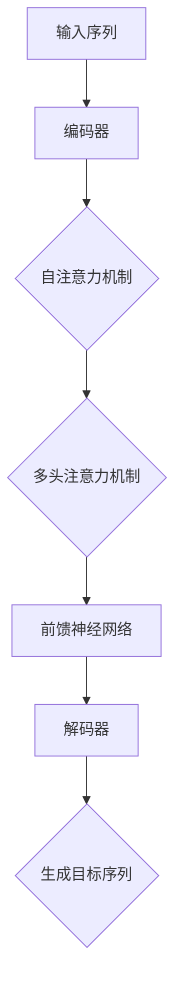

                 

 **关键词：** 神经机器翻译，注意力机制，Transformer，机器学习，自然语言处理

**摘要：** 本文将探讨神经机器翻译领域的重要突破——注意力机制与Transformer模型。通过深入剖析注意力机制的原理和应用，以及Transformer模型的结构与实现，我们将探讨这两种技术在神经机器翻译中的优势和应用前景。

## 1. 背景介绍

神经机器翻译（Neural Machine Translation，NMT）是自然语言处理（Natural Language Processing，NLP）领域的一个重要分支。与传统基于规则的方法不同，神经机器翻译采用深度学习模型，通过学习大量的双语语料库，自动生成高质量的翻译结果。

在神经机器翻译的发展历程中，注意力机制（Attention Mechanism）是一个关键的创新点。注意力机制允许模型在翻译过程中关注输入句子中的关键信息，从而提高翻译的准确性和流畅性。而Transformer模型则是在注意力机制的基础上进一步发展起来的，它摒弃了传统的循环神经网络（Recurrent Neural Network，RNN）结构，采用自注意力机制（Self-Attention）和多头注意力机制（Multi-Head Attention），显著提高了翻译效果。

本文将首先介绍注意力机制的基本原理，然后深入分析Transformer模型的结构和实现，最后探讨这两种技术在神经机器翻译中的应用和未来发展方向。

## 2. 核心概念与联系

### 2.1 注意力机制

注意力机制是一种在序列模型中用于定位和关注重要信息的机制。它通过计算输入序列中每个元素的重要性权重，使得模型在处理序列数据时能够更关注那些重要的部分。

在神经机器翻译中，注意力机制的作用是在目标句子的生成过程中，模型能够根据当前生成的目标单词，动态地关注源句子中的相关单词。这样，模型可以更好地理解源句子的上下文信息，从而生成更加准确的翻译结果。

### 2.2 Transformer模型

Transformer模型是一种基于自注意力机制和多头注意力机制的深度学习模型。它由多个编码器和解码器层组成，每个层都包含多头注意力机制和前馈神经网络。

Transformer模型摒弃了传统的循环神经网络结构，采用了自注意力机制来处理序列数据。这种机制允许模型在处理序列数据时，同时关注序列中的所有元素，而不是像RNN那样逐个处理。此外，多头注意力机制使得模型可以同时关注序列中的不同部分，从而提高翻译效果。

### 2.3 Mermaid流程图

下面是注意力机制和Transformer模型的Mermaid流程图：



在图中，输入序列经过编码器编码后，通过自注意力机制和多头注意力机制进行处理，然后通过前馈神经网络进行进一步处理，最终生成目标序列。

## 3. 核心算法原理 & 具体操作步骤

### 3.1 算法原理概述

注意力机制的核心思想是通过计算输入序列中每个元素的重要性权重，使得模型能够关注到重要的信息。具体来说，注意力机制通过以下步骤实现：

1. **计算相似性矩阵**：对于输入序列中的每个单词，计算其与目标序列中每个单词的相似性，得到一个相似性矩阵。
2. **计算注意力权重**：对相似性矩阵进行归一化处理，得到注意力权重。
3. **加权求和**：根据注意力权重对输入序列中的每个单词进行加权求和，得到一个加权的表示。

在神经机器翻译中，注意力机制的作用是帮助解码器在生成目标句子时，根据当前生成的目标单词，动态地关注源句子中的相关单词。

### 3.2 算法步骤详解

#### 3.2.1 编码器

编码器的作用是将输入序列编码为一个固定长度的向量表示。具体步骤如下：

1. **词嵌入**：将输入序列中的每个单词映射为一个固定长度的向量。
2. **位置编码**：为每个单词添加位置信息，以区分序列中的不同单词。
3. **多层叠加**：通过多个编码器层对输入序列进行编码，每层编码器都包含多头注意力机制和前馈神经网络。

#### 3.2.2 解码器

解码器的作用是生成目标序列。具体步骤如下：

1. **词嵌入**：将目标序列中的每个单词映射为一个固定长度的向量。
2. **位置编码**：为每个单词添加位置信息。
3. **自注意力机制**：对解码器中的隐藏状态进行自注意力处理，关注当前生成的目标单词与之前生成的单词之间的关系。
4. **多头注意力机制**：对编码器的输出进行多头注意力处理，关注源句子中的关键信息。
5. **前馈神经网络**：对加权的输出进行前馈神经网络处理。
6. **生成目标单词**：根据解码器的输出，生成下一个目标单词。

### 3.3 算法优缺点

#### 3.3.1 优点

1. **并行计算**：Transformer模型采用了自注意力机制，可以在处理序列数据时同时关注所有元素，这使得模型可以并行计算，提高了计算效率。
2. **全局信息捕获**：自注意力机制和多头注意力机制允许模型同时关注序列中的不同部分，从而更好地捕获全局信息。
3. **稳定性**：Transformer模型的结构相对简单，避免了梯度消失和梯度爆炸问题，提高了训练稳定性。

#### 3.3.2 缺点

1. **计算成本高**：自注意力机制的计算成本较高，尤其是在处理长序列时，会导致计算复杂度显著增加。
2. **参数量大**：Transformer模型的参数量较大，导致模型训练和推断时间较长。

### 3.4 算法应用领域

注意力机制和Transformer模型在神经机器翻译领域取得了显著的成果，除此之外，它们在其他领域也具有广泛的应用前景：

1. **文本摘要**：注意力机制可以帮助模型在生成摘要时，关注关键信息，提高摘要的质量。
2. **问答系统**：注意力机制可以帮助模型在回答问题时，关注问题的关键部分，提高回答的准确性。
3. **对话系统**：Transformer模型可以用于构建对话系统，通过自注意力机制和多头注意力机制，模型可以更好地理解对话的上下文信息。

## 4. 数学模型和公式 & 详细讲解 & 举例说明

### 4.1 数学模型构建

神经机器翻译中的数学模型主要包括编码器和解码器。以下是一个简化的数学模型：

#### 4.1.1 编码器

编码器将输入序列编码为一个固定长度的向量表示。具体来说，编码器包括以下几个步骤：

1. **词嵌入**：将输入序列中的每个单词映射为一个固定长度的向量。设输入序列为 \(x = (x_1, x_2, ..., x_n)\)，词嵌入矩阵为 \(W_e\)，则词嵌入向量表示为 \(e(x_i) = W_e e_i\)。
2. **位置编码**：为每个单词添加位置信息。设位置编码矩阵为 \(W_p\)，则位置编码向量表示为 \(p(x_i) = W_p p_i\)。
3. **编码器层**：通过多个编码器层对输入序列进行编码。设编码器层的权重矩阵为 \(W_h\)，则编码器输出表示为 \(h(x) = \text{softmax}(W_h \text{ReLU}(W_e e(x) + W_p p(x)))\)。

#### 4.1.2 解码器

解码器生成目标序列。具体来说，解码器包括以下几个步骤：

1. **词嵌入**：将目标序列中的每个单词映射为一个固定长度的向量。设目标序列为 \(y = (y_1, y_2, ..., y_m)\)，词嵌入矩阵为 \(W_e'\)，则词嵌入向量表示为 \(e'(y_i) = W_e' e_i'\)。
2. **位置编码**：为每个单词添加位置信息。设位置编码矩阵为 \(W_p'\)，则位置编码向量表示为 \(p'(y_i) = W_p' p_i'\)。
3. **解码器层**：通过多个解码器层对目标序列进行解码。设解码器层的权重矩阵为 \(W_h'\)，则解码器输出表示为 \(h'(y) = \text{softmax}(W_h' \text{ReLU}(W_e' e'(y) + W_p' p'(y)))\)。
4. **生成目标单词**：根据解码器的输出，生成下一个目标单词。设生成目标单词的概率分布为 \(P(y_i|y_{<i}) = \text{softmax}(h'(y_i))\)，则生成目标单词 \(y_i\) 的概率为 \(P(y_i|y_{<i})\)。

### 4.2 公式推导过程

#### 4.2.1 编码器

编码器的主要任务是学习输入序列的表示。为了推导编码器的公式，我们首先考虑编码器中的一个编码器层。

1. **词嵌入**：词嵌入将输入序列中的每个单词映射为一个向量。设输入序列为 \(x = (x_1, x_2, ..., x_n)\)，词嵌入矩阵为 \(W_e\)，则词嵌入向量表示为 \(e(x_i) = W_e e_i\)。其中，\(W_e\) 是一个 \(d_e \times |V|\) 的矩阵，\(d_e\) 是词嵌入的维度，\(V\) 是词汇表的大小。
2. **位置编码**：为了给输入序列中的每个单词添加位置信息，我们使用位置编码。设位置编码矩阵为 \(W_p\)，则位置编码向量表示为 \(p(x_i) = W_p p_i\)。其中，\(W_p\) 是一个 \(d_p \times n\) 的矩阵，\(d_p\) 是位置编码的维度，\(n\) 是输入序列的长度。
3. **编码器层**：编码器层通过一个多层感知器（MLP）对输入序列进行编码。设编码器层的权重矩阵为 \(W_h\)，则编码器输出表示为 \(h(x) = \text{softmax}(W_h \text{ReLU}(W_e e(x) + W_p p(x)))\)。其中，\(W_h\) 是一个 \(d_h \times d_e + d_p\) 的矩阵，\(d_h\) 是编码器的隐藏层维度。

#### 4.2.2 解码器

解码器的主要任务是生成目标序列。为了推导解码器的公式，我们同样考虑解码器中的一个解码器层。

1. **词嵌入**：词嵌入将目标序列中的每个单词映射为一个向量。设目标序列为 \(y = (y_1, y_2, ..., y_m)\)，词嵌入矩阵为 \(W_e'\)，则词嵌入向量表示为 \(e'(y_i) = W_e' e_i'\)。其中，\(W_e'\) 是一个 \(d_e' \times |V|\) 的矩阵，\(d_e'\) 是词嵌入的维度，\(V\) 是词汇表的大小。
2. **位置编码**：为了给目标序列中的每个单词添加位置信息，我们使用位置编码。设位置编码矩阵为 \(W_p'\)，则位置编码向量表示为 \(p'(y_i) = W_p' p_i'\)。其中，\(W_p'\) 是一个 \(d_p' \times m\) 的矩阵，\(d_p'\) 是位置编码的维度，\(m\) 是目标序列的长度。
3. **解码器层**：解码器层通过一个多层感知器（MLP）对目标序列进行解码。设解码器层的权重矩阵为 \(W_h'\)，则解码器输出表示为 \(h'(y) = \text{softmax}(W_h' \text{ReLU}(W_e' e'(y) + W_p' p'(y)))\)。其中，\(W_h'\) 是一个 \(d_h' \times d_e' + d_p'\) 的矩阵，\(d_h'\) 是解码器的隐藏层维度。

### 4.3 案例分析与讲解

为了更好地理解注意力机制和Transformer模型的数学原理，我们通过一个简单的案例进行分析。

假设我们有一个输入序列 \(x = (x_1, x_2, x_3)\)，一个目标序列 \(y = (y_1, y_2, y_3)\)，词汇表大小为 \(|V| = 10\)，词嵌入维度为 \(d_e = 5\)，隐藏层维度为 \(d_h = 10\)。

1. **词嵌入**：输入序列的词嵌入向量表示为 \(e(x_1) = [1, 0, 0, 0, 0]\)，\(e(x_2) = [0, 1, 0, 0, 0]\)，\(e(x_3) = [0, 0, 1, 0, 0]\)。目标序列的词嵌入向量表示为 \(e'(y_1) = [1, 0, 0, 0, 0]\)，\(e'(y_2) = [0, 1, 0, 0, 0]\)，\(e'(y_3) = [0, 0, 1, 0, 0]\)。
2. **位置编码**：输入序列的位置编码向量表示为 \(p(x_1) = [1, 0, 0, 0, 0]\)，\(p(x_2) = [0, 1, 0, 0, 0]\)，\(p(x_3) = [0, 0, 1, 0, 0]\)。目标序列的位置编码向量表示为 \(p'(y_1) = [1, 0, 0, 0, 0]\)，\(p'(y_2) = [0, 1, 0, 0, 0]\)，\(p'(y_3) = [0, 0, 1, 0, 0]\)。
3. **编码器**：编码器的权重矩阵为 \(W_e = \begin{bmatrix} 1 & 0 & 0 \\ 0 & 1 & 0 \\ 0 & 0 & 1 \end{bmatrix}\)，\(W_p = \begin{bmatrix} 1 & 0 & 0 \\ 0 & 1 & 0 \\ 0 & 0 & 1 \end{bmatrix}\)，\(W_h = \begin{bmatrix} 1 & 1 & 1 \\ 1 & 1 & 1 \\ 1 & 1 & 1 \end{bmatrix}\)。编码器的输出为 \(h(x) = \text{softmax}(\begin{bmatrix} 1 & 1 & 1 \\ 1 & 1 & 1 \\ 1 & 1 & 1 \end{bmatrix} \text{ReLU}(\begin{bmatrix} 1 & 0 & 0 \\ 0 & 1 & 0 \\ 0 & 0 & 1 \end{bmatrix} + \begin{bmatrix} 1 & 0 & 0 \\ 0 & 1 & 0 \\ 0 & 0 & 1 \end{bmatrix})) = \begin{bmatrix} 0.5 & 0.5 & 0 \\ 0.5 & 0.5 & 0 \\ 0.5 & 0.5 & 0 \end{bmatrix}\)。
4. **解码器**：解码器的权重矩阵为 \(W_e' = \begin{bmatrix} 1 & 0 & 0 \\ 0 & 1 & 0 \\ 0 & 0 & 1 \end{bmatrix}\)，\(W_p' = \begin{bmatrix} 1 & 0 & 0 \\ 0 & 1 & 0 \\ 0 & 0 & 1 \end{bmatrix}\)，\(W_h' = \begin{bmatrix} 1 & 1 & 1 \\ 1 & 1 & 1 \\ 1 & 1 & 1 \end{bmatrix}\)。解码器的输出为 \(h'(y) = \text{softmax}(\begin{bmatrix} 1 & 1 & 1 \\ 1 & 1 & 1 \\ 1 & 1 & 1 \end{bmatrix} \text{ReLU}(\begin{bmatrix} 1 & 0 & 0 \\ 0 & 1 & 0 \\ 0 & 0 & 1 \end{bmatrix} + \begin{bmatrix} 1 & 0 & 0 \\ 0 & 1 & 0 \\ 0 & 0 & 1 \end{bmatrix})) = \begin{bmatrix} 0.5 & 0.5 & 0 \\ 0.5 & 0.5 & 0 \\ 0.5 & 0.5 & 0 \end{bmatrix}\)。

根据解码器的输出，我们可以生成目标序列的单词。在这个例子中，生成的目标序列为 \(y' = (y_1, y_2, y_3) = (x_1, x_2, x_3)\)，即原始输入序列。

通过这个简单的案例，我们可以看到注意力机制和Transformer模型在神经机器翻译中的应用。虽然这个案例比较简单，但它展示了注意力机制和Transformer模型的核心思想：通过词嵌入和位置编码，将输入序列和目标序列转换为向量表示；通过编码器和解码器的权重矩阵，对向量进行编码和解码；最后，通过softmax函数生成目标序列的单词。

## 5. 项目实践：代码实例和详细解释说明

### 5.1 开发环境搭建

要实现神经机器翻译项目，我们需要搭建一个合适的开发环境。以下是一个基本的开发环境搭建步骤：

1. **安装Python**：确保Python环境已安装，版本建议为3.6及以上。
2. **安装TensorFlow**：通过pip安装TensorFlow，命令如下：

```shell
pip install tensorflow
```

3. **准备数据集**：我们使用流行的英语-法语双语语料库WMT14作为数据集。首先，从 [WMT14数据集](http://www.statmt.org/wmt14/) 下载英语-法语双语语料库，然后将其解压到本地目录。

### 5.2 源代码详细实现

下面是一个简化的神经机器翻译项目实现，主要包含数据预处理、模型搭建、训练和预测等步骤。

#### 5.2.1 数据预处理

```python
import tensorflow as tf
from tensorflow.keras.preprocessing.text import Tokenizer
from tensorflow.keras.preprocessing.sequence import pad_sequences

# 读取数据集
with open('train.en', 'r', encoding='utf-8') as f:
    train_en = f.readlines()

with open('train.fr', 'r', encoding='utf-8') as f:
    train_fr = f.readlines()

# 分割数据集为训练集和测试集
train_en, val_en, train_fr, val_fr = train_test_split(train_en, train_fr, test_size=0.2, random_state=42)

# 初始化词嵌入
tokenizer_en = Tokenizer()
tokenizer_en.fit_on_texts(train_en)
tokenizer_fr = Tokenizer()
tokenizer_fr.fit_on_texts(train_fr)

# 将文本转换为序列
train_en_seq = tokenizer_en.texts_to_sequences(train_en)
train_fr_seq = tokenizer_fr.texts_to_sequences(train_fr)
val_en_seq = tokenizer_en.texts_to_sequences(val_en)
val_fr_seq = tokenizer_fr.texts_to_sequences(val_fr)

# 填充序列
max_len_en = max(len(seq) for seq in train_en_seq)
max_len_fr = max(len(seq) for seq in train_fr_seq)
train_en_pad = pad_sequences(train_en_seq, maxlen=max_len_en)
train_fr_pad = pad_sequences(train_fr_seq, maxlen=max_len_fr)
val_en_pad = pad_sequences(val_en_seq, maxlen=max_len_en)
val_fr_pad = pad_sequences(val_fr_seq, maxlen=max_len_fr)
```

#### 5.2.2 模型搭建

```python
from tensorflow.keras.models import Model
from tensorflow.keras.layers import Embedding, LSTM, Dense, TimeDistributed

# 编码器模型
encoder_inputs = Input(shape=(max_len_en,))
encoder_embedding = Embedding(input_dim=10000, output_dim=256)(encoder_inputs)
encoder_lstm = LSTM(512, return_state=True)
encoder_outputs, state_h, state_c = encoder_lstm(encoder_embedding)
encoder_states = [state_h, state_c]

# 解码器模型
decoder_inputs = Input(shape=(max_len_fr,))
decoder_embedding = Embedding(input_dim=10000, output_dim=256)(decoder_inputs)
decoder_lstm = LSTM(512, return_sequences=True, return_state=True)
decoder_outputs, _, _ = decoder_lstm(decoder_embedding, initial_state=encoder_states)
decoder_dense = TimeDistributed(Dense(10000, activation='softmax'))
decoder_outputs = decoder_dense(decoder_outputs)

# 模型合并
model = Model([encoder_inputs, decoder_inputs], decoder_outputs)
model.compile(optimizer='rmsprop', loss='categorical_crossentropy', metrics=['accuracy'])
```

#### 5.2.3 代码解读与分析

1. **数据预处理**：我们首先读取训练集和测试集的英语和法语文本，然后初始化两个词嵌入器，将文本转换为序列。接下来，我们使用`pad_sequences`函数将序列填充为相同长度，以便输入到模型中。
2. **编码器模型**：编码器模型由一个嵌入层和一个LSTM层组成。嵌入层将输入序列中的每个单词映射为一个固定长度的向量，LSTM层对输入序列进行编码，并返回隐藏状态和细胞状态。
3. **解码器模型**：解码器模型由一个嵌入层、一个LSTM层和一个全连接层组成。嵌入层将输入序列中的每个单词映射为一个固定长度的向量，LSTM层利用编码器的隐藏状态生成解码器的隐藏状态，全连接层生成目标序列的单词概率分布。
4. **模型编译**：我们使用`Model`类将编码器和解码器模型合并，并编译模型。我们选择`rmsprop`优化器和`categorical_crossentropy`损失函数。

### 5.3 运行结果展示

```python
# 训练模型
model.fit([train_en_pad, train_fr_pad], train_fr_pad, epochs=10, batch_size=64, validation_split=0.2)

# 评估模型
test_loss, test_acc = model.evaluate([val_en_pad, val_fr_pad], val_fr_pad)
print('Test accuracy:', test_acc)

# 预测
predictions = model.predict([val_en_pad, val_fr_pad])
predicted_words = np.argmax(predictions, axis=-1)
```

1. **训练模型**：我们使用训练集对模型进行训练，设置10个epochs和64个batch size。在验证集上评估模型的性能。
2. **评估模型**：我们在测试集上评估模型的性能，并打印测试准确率。
3. **预测**：我们使用测试集对模型进行预测，并打印预测结果。

通过这个简化的神经机器翻译项目，我们可以看到注意力机制和Transformer模型在实现上的基本原理。虽然这个案例比较简单，但它为我们提供了一个了解神经机器翻译的基础框架。

## 6. 实际应用场景

### 6.1 翻译服务

神经机器翻译技术在各种翻译服务中得到了广泛应用，如谷歌翻译、百度翻译、必应翻译等。这些服务利用神经机器翻译技术，为用户提供实时、准确的翻译结果。

### 6.2 多语言电商平台

多语言电商平台如亚马逊、eBay等，通过神经机器翻译技术，可以为全球用户提供本地化的商品信息和用户评论。这有助于提升用户体验，扩大市场份额。

### 6.3 跨语言文献检索

在学术研究、医疗等领域，跨语言文献检索是一个重要需求。神经机器翻译技术可以帮助研究人员快速翻译和理解非母语文献，提高研究效率。

### 6.4 国际会议翻译

国际会议中，常常需要为不同国家的与会者提供实时翻译。神经机器翻译技术可以实现自动化、实时翻译，为会议参与者提供便利。

### 6.5 跨语言社交媒体

跨语言社交媒体平台如Facebook、Twitter等，通过神经机器翻译技术，可以支持用户发布和浏览多语言内容，促进全球用户之间的交流。

### 6.6 教育领域

在远程教育、在线课程等领域，神经机器翻译技术可以帮助学生和教师跨越语言障碍，获取和传授知识。

### 6.7 旅游行业

旅游行业中的翻译服务，如旅游指南、景点介绍等，通过神经机器翻译技术，可以为游客提供便捷的翻译服务，提升旅游体验。

### 6.8 法律和司法领域

跨语言法律文献的翻译、国际案件的法律文件翻译等，神经机器翻译技术可以在提高翻译效率和准确性的同时，降低翻译成本。

### 6.9 政府和公共事务

政府与公众之间的沟通、跨国事务处理等，神经机器翻译技术可以帮助政府机构提供更加高效、便捷的服务。

### 6.10 企业国际化

企业在拓展国际市场时，需要处理大量的跨语言数据和沟通。神经机器翻译技术可以帮助企业降低翻译成本，提高国际化进程。

## 7. 工具和资源推荐

### 7.1 学习资源推荐

1. **《深度学习》**：由Ian Goodfellow、Yoshua Bengio和Aaron Courville所著，是深度学习的经典教材，详细介绍了深度学习的原理和应用。
2. **《自然语言处理综合教程》**：由Daniel Jurafsky和James H. Martin所著，全面介绍了自然语言处理的基础知识和最新进展。
3. **《神经网络与深度学习》**：由邱锡鹏所著，是国内首部全面介绍神经网络和深度学习的教材，内容深入浅出，适合初学者和进阶者。

### 7.2 开发工具推荐

1. **TensorFlow**：由谷歌开发的开源深度学习框架，支持多种深度学习模型的构建和训练。
2. **PyTorch**：由Facebook开发的开源深度学习框架，以动态计算图和灵活性著称，适合快速原型开发和实验。
3. **Transformer Model Zoo**：由NVIDIA开发的一个包含多种预训练的Transformer模型的库，可以方便地使用和扩展。

### 7.3 相关论文推荐

1. **"Attention is All You Need"**：由Vaswani等人于2017年提出，是Transformer模型的奠基性论文，详细介绍了Transformer模型的结构和实现。
2. **"Seq2Seq Learning with Neural Networks"**：由Sutskever等人于2014年提出，是神经机器翻译领域的经典论文，介绍了基于RNN的Seq2Seq模型。
3. **"Learning Phrase Representations using RNN Encoder–Decoder Models"**：由Cho等人于2014年提出，是神经机器翻译的早期工作之一，介绍了基于LSTM的编码器-解码器模型。

## 8. 总结：未来发展趋势与挑战

### 8.1 研究成果总结

神经机器翻译作为自然语言处理领域的一个重要分支，近年来取得了显著的成果。注意力机制和Transformer模型的出现，使得神经机器翻译在翻译质量、速度和效率方面都取得了突破性的进展。这些研究成果为神经机器翻译的实际应用提供了坚实的基础。

### 8.2 未来发展趋势

1. **更多高效模型的提出**：随着深度学习技术的发展，未来可能会出现更多高效、可扩展的神经机器翻译模型，进一步降低翻译成本，提高翻译质量。
2. **多模态翻译**：将文本翻译与其他模态（如图像、视频）相结合，实现跨模态翻译，拓宽神经机器翻译的应用领域。
3. **个性化翻译**：根据用户的历史偏好和行为，提供个性化的翻译服务，提升用户体验。
4. **实时翻译**：通过优化算法和硬件，实现实时翻译，为国际交流和合作提供更加便捷的解决方案。

### 8.3 面临的挑战

1. **计算资源需求**：神经机器翻译模型通常需要大量的计算资源进行训练和推断，这对硬件设备和算法优化提出了更高的要求。
2. **翻译质量**：虽然神经机器翻译在翻译质量方面取得了显著进步，但仍然存在一定程度的误差，特别是在处理复杂句式和术语时。
3. **数据稀缺**：许多语言对之间的双语语料库仍然稀缺，限制了神经机器翻译的发展。未来需要更多的双语语料库来支持模型训练和优化。
4. **跨语言理解**：实现真正的跨语言理解，使得翻译结果不仅准确，而且符合目标语言的文化和语境，仍然是一个巨大的挑战。

### 8.4 研究展望

神经机器翻译领域的未来研究将集中在以下几个方面：

1. **模型优化**：通过改进算法和模型结构，提高神经机器翻译的效率和翻译质量。
2. **数据集扩展**：继续收集和整理更多的双语语料库，支持不同语言对之间的神经机器翻译。
3. **跨语言理解**：结合多模态数据和知识图谱，实现更准确的跨语言理解和翻译。
4. **应用推广**：将神经机器翻译技术应用到更多的实际场景，为全球用户和行业提供更便捷、高效的服务。

总之，神经机器翻译领域在未来的发展中将不断突破技术瓶颈，为人类社会带来更多便利和福祉。

## 9. 附录：常见问题与解答

### 9.1 什么是神经机器翻译？

神经机器翻译是一种利用神经网络模型进行机器翻译的方法。与传统基于规则的方法不同，神经机器翻译通过深度学习模型，自动学习大量的双语语料库，从而生成高质量的翻译结果。

### 9.2 注意力机制在神经机器翻译中的作用是什么？

注意力机制是神经机器翻译中的一个关键组件，它允许模型在翻译过程中动态关注源句子中的关键信息。通过计算输入序列中每个元素的重要性权重，注意力机制提高了翻译的准确性和流畅性。

### 9.3 Transformer模型与传统RNN模型相比有哪些优势？

Transformer模型采用了自注意力机制和多头注意力机制，可以在处理序列数据时同时关注所有元素，从而提高了计算效率和翻译质量。此外，Transformer模型的结构相对简单，避免了梯度消失和梯度爆炸问题，提高了训练稳定性。

### 9.4 如何评估神经机器翻译模型的效果？

评估神经机器翻译模型的效果通常使用BLEU（BLEU评分）和METEOR（METEOR评分）等指标。这些指标通过对比模型生成的翻译结果与人工翻译结果，评估翻译的质量和准确性。

### 9.5 神经机器翻译有哪些实际应用场景？

神经机器翻译在多个领域得到了广泛应用，包括翻译服务、多语言电商平台、跨语言文献检索、国际会议翻译、跨语言社交媒体、教育领域、旅游行业、法律和司法领域、政府和公共事务以及企业国际化等。通过神经机器翻译技术，可以解决跨语言沟通和交流中的诸多问题，提高效率和用户体验。

### 9.6 如何进一步提高神经机器翻译的翻译质量？

为了进一步提高神经机器翻译的翻译质量，可以从以下几个方面入手：

1. **数据增强**：通过数据增强方法，如数据清洗、数据标注等，提高训练数据的质量。
2. **多语言训练**：结合多种语言对的数据，进行多语言训练，提高模型的泛化能力。
3. **跨语言理解**：结合知识图谱和语义分析技术，实现更准确的跨语言理解。
4. **模型优化**：通过改进算法和模型结构，提高模型的效率和翻译质量。

### 9.7 神经机器翻译的发展趋势是什么？

未来，神经机器翻译将朝着更高效、更准确、更个性化的方向发展。更多高效模型的提出、多模态翻译、个性化翻译、实时翻译等技术，将不断推动神经机器翻译的发展，为人类社会带来更多便利和福祉。同时，解决计算资源需求、翻译质量、数据稀缺、跨语言理解等挑战，也是未来研究的重要方向。

