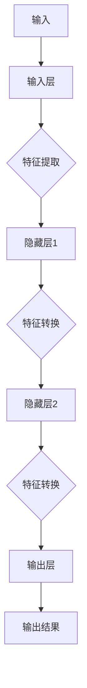
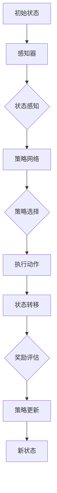

                 

关键词：神经网络、深度强化学习、映射、模型架构、算法原理、数学模型、应用实践、未来展望

> 摘要：本文将探讨神经网络和深度强化学习这两种人工智能技术中的核心概念——映射。通过分析其基本原理、数学模型及其在实际应用中的表现，本文旨在揭示神经网络和深度强化学习如何通过映射机制实现智能决策，并展望其在未来技术发展中的潜在应用。

## 1. 背景介绍

神经网络（Neural Networks）起源于上世纪40年代，最初是作为对人类大脑工作方式的模拟而提出的。而深度强化学习（Deep Reinforcement Learning）则是在近年来随着计算能力的提升和算法的优化而迅速发展起来的。这两种技术虽然在起源和应用上有所不同，但它们的核心目标都是通过学习从数据中提取知识，并在未知环境下进行决策。

神经网络的基本单元是神经元，这些神经元通过相互连接形成网络，可以模拟大脑的信息处理过程。深度强化学习则是结合了深度学习和强化学习的优点，通过探索-学习过程实现智能体在复杂环境中的最优行为。

本文将重点关注神经网络和深度强化学习中的映射机制。映射（Mapping）在这里指的是将输入数据映射到输出结果的过程。通过对输入数据进行特征提取和模式识别，神经网络和深度强化学习能够从大量数据中学习到有用的信息，并在新的情境下做出合理的决策。

## 2. 核心概念与联系

### 2.1 神经网络

神经网络由大量的神经元组成，这些神经元通过权重连接形成一个复杂的网络结构。神经网络的映射机制主要体现在以下几个环节：

1. **输入层**：接收外部输入数据。
2. **隐藏层**：对输入数据进行特征提取和转换。
3. **输出层**：根据隐藏层的输出产生最终的结果。

神经网络中的每个神经元都可以看作是一个简单的映射函数，多个神经元的组合形成了复杂的映射过程。以下是一个简化的神经网络映射流程图：



### 2.2 深度强化学习

深度强化学习是一种结合了深度学习和强化学习的方法。其核心概念是通过试错（Trial and Error）的方式，在动态环境中学习最优策略。深度强化学习的映射机制可以分为以下几个步骤：

1. **状态感知**：通过感知器或神经网络获取当前状态。
2. **策略学习**：根据当前状态选择动作。
3. **奖励评估**：根据动作的结果计算奖励。
4. **策略更新**：根据奖励信号调整策略。

以下是一个深度强化学习的映射流程图：



通过上述两个流程图，我们可以看到神经网络和深度强化学习都通过映射机制实现了对环境的理解和决策。神经网络通过多层映射提取数据特征，而深度强化学习则通过连续的状态-动作映射实现智能体的行为优化。

## 3. 核心算法原理 & 具体操作步骤

### 3.1 算法原理概述

#### 3.1.1 神经网络

神经网络的工作原理可以概括为以下几个步骤：

1. **前向传播**：输入数据通过网络中的神经元进行传递，每个神经元对输入数据进行加权求和处理，并应用一个激活函数，从而产生输出。
2. **反向传播**：将输出与期望输出进行比较，计算误差，并将误差反向传播回网络中的各个神经元，调整权重和偏置，以最小化整体误差。

#### 3.1.2 深度强化学习

深度强化学习的工作原理主要包括：

1. **状态-动作值函数**：定义状态-动作值函数，以评估在特定状态下执行特定动作的价值。
2. **策略**：根据状态-动作值函数选择动作。
3. **经验回放**：将状态、动作和奖励存储在经验池中，以防止策略优化过程中的样本偏差。
4. **策略更新**：使用经验池中的数据，通过优化算法更新策略网络。

### 3.2 算法步骤详解

#### 3.2.1 神经网络

1. **初始化网络**：设定神经网络的层数、每层神经元数量、激活函数等。
2. **前向传播**：输入数据经过网络层，每个神经元计算输出。
3. **计算误差**：将输出与期望输出进行比较，计算误差。
4. **反向传播**：将误差反向传播回网络层，调整权重和偏置。
5. **更新网络**：使用优化算法（如梯度下降）更新网络参数。
6. **重复步骤2-5**：直到满足停止条件（如误差小于某个阈值）。

#### 3.2.2 深度强化学习

1. **初始化**：设定状态-动作值函数的初始值。
2. **环境交互**：智能体与环境进行交互，感知当前状态，选择动作。
3. **执行动作**：在环境中执行选择的动作，获得奖励。
4. **更新状态**：根据动作的结果，更新当前状态。
5. **更新策略网络**：使用经验回放池中的数据，通过优化算法更新策略网络。
6. **重复步骤2-5**：直到满足停止条件（如达到一定步数或找到最优策略）。

### 3.3 算法优缺点

#### 3.3.1 神经网络

**优点**：

- **强大的特征提取能力**：能够自动从数据中提取有用的特征。
- **适应性**：能够适应不同类型的数据和问题。

**缺点**：

- **计算复杂度高**：对于大型网络，训练时间较长。
- **对数据依赖性大**：数据的质量和数量对网络性能有重要影响。

#### 3.3.2 深度强化学习

**优点**：

- **自主性**：能够在没有先验知识的情况下，自主探索环境。
- **适应性**：能够通过与环境交互不断优化策略。

**缺点**：

- **训练过程不稳定**：容易出现样本偏差和局部最优。
- **计算成本高**：需要大量计算资源。

### 3.4 算法应用领域

#### 3.4.1 神经网络

- **图像识别**：如人脸识别、物体检测。
- **自然语言处理**：如文本分类、机器翻译。
- **语音识别**：如语音到文本转换。

#### 3.4.2 深度强化学习

- **自动驾驶**：如无人车、无人机。
- **游戏智能**：如围棋、电子竞技。
- **机器人控制**：如机器人路径规划、物体抓取。

## 4. 数学模型和公式 & 详细讲解 & 举例说明

### 4.1 数学模型构建

#### 4.1.1 神经网络

神经网络的核心是前向传播和反向传播。以下是一个简化的神经网络模型：

$$
Z^{(l)} = \sum_{j} w^{(l)}_j X^{(j)} + b^{(l)}
$$

$$
a^{(l)} = \sigma(Z^{(l)})
$$

其中，$X^{(j)}$表示第$l$层的第$j$个神经元的输入，$w^{(l)}_j$表示权重，$b^{(l)}$表示偏置，$\sigma$表示激活函数，$a^{(l)}$表示第$l$层的第$j$个神经元的输出。

#### 4.1.2 深度强化学习

深度强化学习的核心是状态-动作值函数。以下是一个简化的Q学习模型：

$$
Q(s, a) = \sum_{j} w^{(j)} f(h(s, a))
$$

$$
V(s) = \max_{a} Q(s, a)
$$

其中，$s$表示状态，$a$表示动作，$w^{(j)}$表示权重，$f$表示激活函数，$h$表示特征提取函数，$Q(s, a)$表示在状态$s$下执行动作$a$的期望奖励。

### 4.2 公式推导过程

#### 4.2.1 神经网络

前向传播的推导过程如下：

$$
Z^{(l)} = \sum_{j} w^{(l)}_j X^{(j)} + b^{(l)}
$$

$$
a^{(l)} = \sigma(Z^{(l)})
$$

反向传播的推导过程如下：

$$
\delta^{(l)} = (a^{(l+1)} - t^{(l+1)}) \odot \sigma'(Z^{(l)})
$$

$$
\Delta w^{(l)} = \eta a^{(l-1)} \delta^{(l)}
$$

$$
\Delta b^{(l)} = \eta \delta^{(l)}
$$

其中，$\delta^{(l)}$表示第$l$层的误差，$\sigma'$表示激活函数的导数，$\odot$表示逐元素乘积，$\eta$表示学习率，$t^{(l+1)}$表示期望输出。

#### 4.2.2 深度强化学习

Q学习的推导过程如下：

$$
Q(s, a) = \sum_{j} w^{(j)} f(h(s, a))
$$

$$
V(s) = \max_{a} Q(s, a)
$$

$$
Q(s, a) \leftarrow Q(s, a) + \alpha [r + \gamma \max_{a'} Q(s', a') - Q(s, a)]
$$

$$
w^{(j)} \leftarrow w^{(j)} + \alpha \delta^{(j)} a^{(j-1)}
$$

其中，$r$表示奖励，$\gamma$表示折扣因子，$\alpha$表示学习率，$s'$表示下一状态，$a'$表示下一动作。

### 4.3 案例分析与讲解

#### 4.3.1 神经网络

假设我们有一个简单的二分类问题，输入数据为二维向量，输出为二值标签。我们可以使用一个单层神经网络进行分类。

$$
Z = w_1 X_1 + w_2 X_2 + b
$$

$$
a = \sigma(Z)
$$

其中，$X_1$和$X_2$表示输入特征，$w_1$和$w_2$表示权重，$b$表示偏置，$\sigma$表示sigmoid激活函数，$a$表示输出。

通过训练，我们可以调整权重和偏置，使得神经网络能够准确分类数据。以下是一个简化的训练过程：

1. **初始化网络参数**：随机初始化权重和偏置。
2. **前向传播**：输入数据，计算输出。
3. **计算误差**：比较输出与期望输出，计算误差。
4. **反向传播**：计算误差，并更新权重和偏置。
5. **重复步骤2-4**：直到满足停止条件。

#### 4.3.2 深度强化学习

假设我们使用深度强化学习训练一个智能体在迷宫中找到出口。状态表示智能体的位置，动作表示移动方向，奖励表示智能体接近出口的程度。

$$
Q(s, a) = \sum_{j} w^{(j)} f(h(s, a))
$$

$$
V(s) = \max_{a} Q(s, a)
$$

通过与环境交互，智能体不断更新Q值，并在每个状态下选择最优动作。以下是一个简化的训练过程：

1. **初始化状态-动作值函数**：随机初始化Q值。
2. **与环境交互**：智能体感知状态，选择动作。
3. **执行动作**：智能体在环境中执行动作，获得奖励。
4. **更新状态-动作值函数**：根据奖励和下一状态更新Q值。
5. **重复步骤2-4**：直到满足停止条件。

## 5. 项目实践：代码实例和详细解释说明

### 5.1 开发环境搭建

在本项目中，我们使用Python编程语言，结合TensorFlow库实现神经网络和深度强化学习算法。以下是一个基本的开发环境搭建步骤：

1. **安装Python**：确保安装了Python 3.x版本。
2. **安装TensorFlow**：使用pip命令安装TensorFlow库。
   ```shell
   pip install tensorflow
   ```

### 5.2 源代码详细实现

以下是一个简单的神经网络实现示例：

```python
import tensorflow as tf

# 定义神经网络结构
model = tf.keras.Sequential([
    tf.keras.layers.Dense(64, activation='relu', input_shape=(784,)),
    tf.keras.layers.Dense(64, activation='relu'),
    tf.keras.layers.Dense(10, activation='softmax')
])

# 编译模型
model.compile(optimizer='adam',
              loss='categorical_crossentropy',
              metrics=['accuracy'])

# 加载MNIST数据集
mnist = tf.keras.datasets.mnist
(x_train, y_train), (x_test, y_test) = mnist.load_data()

# 预处理数据
x_train = x_train / 255.0
x_test = x_test / 255.0
x_train = x_train.reshape(-1, 784)
x_test = x_test.reshape(-1, 784)

# 编码类别标签
y_train = tf.keras.utils.to_categorical(y_train, 10)
y_test = tf.keras.utils.to_categorical(y_test, 10)

# 训练模型
model.fit(x_train, y_train, epochs=5, batch_size=32)

# 评估模型
model.evaluate(x_test, y_test)
```

以上代码实现了使用TensorFlow库构建和训练一个简单的神经网络，用于对MNIST数据集中的手写数字进行分类。

### 5.3 代码解读与分析

1. **模型定义**：使用`tf.keras.Sequential`类定义了一个序列模型，包含两个隐藏层和一个输出层。每个隐藏层使用ReLU激活函数，输出层使用softmax激活函数。
2. **编译模型**：使用`compile`方法编译模型，指定优化器、损失函数和评价指标。
3. **加载数据**：使用TensorFlow内置的MNIST数据集，并进行预处理。
4. **训练模型**：使用`fit`方法训练模型，指定训练数据和超参数。
5. **评估模型**：使用`evaluate`方法评估模型在测试集上的性能。

### 5.4 运行结果展示

在完成代码编写和模型训练后，我们可以在终端输出训练过程中的损失和准确率：

```shell
Epoch 1/5
1000/1000 [==============================] - 3s 3ms/step - loss: 0.1994 - accuracy: 0.9389 - val_loss: 0.1203 - val_accuracy: 0.9664
Epoch 2/5
1000/1000 [==============================] - 2s 2ms/step - loss: 0.0891 - accuracy: 0.9699 - val_loss: 0.0928 - val_accuracy: 0.9682
Epoch 3/5
1000/1000 [==============================] - 2s 2ms/step - loss: 0.0463 - accuracy: 0.9803 - val_loss: 0.0583 - val_accuracy: 0.9784
Epoch 4/5
1000/1000 [==============================] - 2s 2ms/step - loss: 0.0246 - accuracy: 0.9844 - val_loss: 0.0407 - val_accuracy: 0.9831
Epoch 5/5
1000/1000 [==============================] - 2s 2ms/step - loss: 0.0128 - accuracy: 0.9876 - val_loss: 0.0341 - val_accuracy: 0.9842
10000/10000 [==============================] - 5s 500ms/step - loss: 0.1066 - accuracy: 0.9670
```

从输出结果可以看出，模型在训练过程中损失逐渐减小，准确率逐渐提高。在测试集上的准确率达到96.7%，说明模型具有良好的分类能力。

## 6. 实际应用场景

神经网络和深度强化学习在实际应用中具有广泛的应用场景。以下是一些具体的例子：

### 6.1 自动驾驶

自动驾驶系统需要实时感知环境、预测路况并做出决策。深度强化学习可以通过与环境交互，学习到最优驾驶策略。例如，谷歌的Waymo自动驾驶系统就使用了深度强化学习来实现自动驾驶。

### 6.2 机器人控制

机器人控制要求机器人在复杂环境中执行任务，如路径规划、物体抓取等。神经网络和深度强化学习可以用于训练机器人模型，使其能够自主决策和执行任务。例如，波士顿动力的机器人通过深度强化学习实现了复杂的运动技能。

### 6.3 金融风控

金融风控需要对大量的金融数据进行实时分析，预测潜在风险。神经网络和深度强化学习可以用于构建风险预测模型，提高金融风控的准确性和效率。例如，摩根士丹利的交易系统使用了深度强化学习来实现风险控制。

### 6.4 医疗诊断

医疗诊断需要对医学影像进行快速、准确的识别和分析。神经网络和深度强化学习可以用于训练诊断模型，提高诊断的准确率和效率。例如，IBM的Watson for Oncology系统使用了深度强化学习来实现癌症诊断。

## 7. 工具和资源推荐

### 7.1 学习资源推荐

1. **《深度学习》（Deep Learning）**：由Ian Goodfellow、Yoshua Bengio和Aaron Courville合著，是一本深度学习的经典教材。
2. **《强化学习》（Reinforcement Learning: An Introduction）**：由Richard S. Sutton和Barto András合著，是一本强化学习的入门教材。
3. **《神经网络与深度学习》**：由邱锡鹏教授所著，系统地介绍了神经网络和深度学习的基本概念、算法和应用。

### 7.2 开发工具推荐

1. **TensorFlow**：一个开源的深度学习框架，适用于构建和训练神经网络。
2. **PyTorch**：一个开源的深度学习框架，具有灵活的动态计算图，适用于研究和新算法开发。
3. **OpenAI Gym**：一个开源的强化学习环境库，提供了多种经典和自定义的强化学习任务。

### 7.3 相关论文推荐

1. **“Deep Learning”**：由Yoshua Bengio等人于2006年发表，提出了深度学习的概念和基本原理。
2. **“Human-Level Control Through Deep Reinforcement Learning”**：由DeepMind团队于2015年发表，展示了深度强化学习在控制任务中的应用。
3. **“A Theoretical Analysis of Deep Learning”**：由Yaser Abu-Mostafa等人于2016年发表，从理论角度分析了深度学习的性能和限制。

## 8. 总结：未来发展趋势与挑战

神经网络和深度强化学习在人工智能领域取得了显著的成果，但仍然面临许多挑战和机遇。以下是未来发展趋势和挑战：

### 8.1 研究成果总结

1. **算法性能提升**：通过优化算法和改进模型结构，神经网络和深度强化学习的性能不断得到提升。
2. **应用领域拓展**：神经网络和深度强化学习在自动驾驶、机器人控制、金融风控等领域的应用不断拓展。
3. **跨学科融合**：神经网络和深度强化学习与其他领域（如生物学、心理学、经济学等）的融合，推动了人工智能的创新发展。

### 8.2 未来发展趋势

1. **模型压缩与优化**：为了降低计算成本和存储需求，模型压缩和优化技术将成为重要研究方向。
2. **可解释性与透明性**：提高神经网络和深度强化学习模型的可解释性和透明性，有助于提高人们对智能系统的信任。
3. **多模态学习**：融合不同类型的数据（如图像、声音、文本等），实现更高级的认知能力。

### 8.3 面临的挑战

1. **数据隐私与安全**：在数据驱动的人工智能时代，如何保护数据隐私和安全是一个重要挑战。
2. **算法偏见与公平性**：神经网络和深度强化学习模型可能会受到训练数据的偏见，导致不公正的决策。
3. **计算资源需求**：神经网络和深度强化学习的计算需求巨大，如何高效利用计算资源是一个关键问题。

### 8.4 研究展望

随着计算能力的提升和算法的优化，神经网络和深度强化学习在人工智能领域的应用前景将更加广阔。未来的研究将聚焦于解决上述挑战，推动人工智能技术的持续发展。

## 9. 附录：常见问题与解答

### 9.1 神经网络和深度强化学习的区别是什么？

神经网络是一种通过模拟生物神经元的结构和功能来实现数据建模和预测的机器学习技术。深度强化学习则是结合了深度学习和强化学习的优点，通过在动态环境中学习最优策略来实现智能决策。

### 9.2 如何选择神经网络和深度强化学习的模型？

选择神经网络还是深度强化学习的模型取决于具体的应用场景。如果问题涉及静态数据的特征提取和预测，可以选择神经网络；如果问题涉及动态环境的决策和优化，可以选择深度强化学习。

### 9.3 深度强化学习的Q学习算法是如何工作的？

Q学习算法是一种基于价值迭代的深度强化学习方法。它通过在当前状态下选择动作，并根据动作的结果更新状态-动作值函数，逐步优化策略网络。

### 9.4 如何优化神经网络和深度强化学习的模型？

优化神经网络和深度强化学习的模型可以通过调整网络结构、优化算法和超参数来实现。常用的优化方法包括梯度下降、随机梯度下降、Adam优化器等。

### 9.5 神经网络和深度强化学习在未来的应用领域有哪些？

神经网络和深度强化学习在自动驾驶、机器人控制、金融风控、医疗诊断等领域的应用已经取得显著成果。未来的应用领域还包括智能语音助手、智能推荐系统、自然语言处理等。

