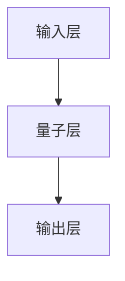

                 

关键词：神经网络、量子计算、量子神经网络、量子机器学习、量子算法、深度学习、量子模拟、量子比特、量子纠缠。

## 摘要

本文探讨了神经网络与量子计算的深度融合，旨在揭示量子神经网络（QNN）在量子计算领域的应用潜力。通过对量子神经网络的基本概念、原理、算法以及数学模型的详细阐述，本文分析了量子神经网络在量子机器学习中的优势和应用场景，并对未来发展趋势和面临的挑战进行了展望。本文旨在为研究人员和开发者提供关于量子神经网络应用的有价值参考。

## 1. 背景介绍

### 量子计算的基本概念

量子计算是一种基于量子力学原理的新型计算方式，与传统计算机使用二进制位（比特）不同，量子计算机使用量子比特（qubit）。量子比特具有叠加态和纠缠态的特性，这些特性使得量子计算机在处理某些问题时具有传统计算机无法比拟的速度优势。

### 神经网络的基本概念

神经网络是一种通过模拟生物神经系统的计算模型，具有强大的数据分析和模式识别能力。神经网络通过多层节点（神经元）的相互连接和权重调整来实现输入到输出的映射。深度学习是神经网络的一种扩展，通过多层神经网络的堆叠，实现了更复杂的特征提取和模式识别。

### 量子计算与神经网络的融合

量子计算与神经网络的结合产生了量子神经网络，它继承了量子计算的高速并行处理能力和神经网络的自适应学习能力，有望在数据密集型和计算复杂性的领域取得突破。

## 2. 核心概念与联系

### 量子神经网络的基本概念

量子神经网络是一种基于量子计算原理的神经网络模型，它利用量子比特的叠加态和纠缠态来实现神经网络的训练和预测。

### 量子神经网络的结构

量子神经网络由输入层、量子层和输出层组成。输入层接收外部数据，量子层实现量子计算操作，输出层对结果进行解码。量子神经网络的结构如图所示。



### 量子神经网络的工作原理

量子神经网络通过以下步骤进行工作：

1. 输入层接收外部数据，并将其转换为量子比特的叠加态。
2. 量子层对量子比特进行量子计算操作，如量子门操作和量子纠缠。
3. 输出层对经过量子层处理的量子比特进行测量，得到预测结果。

## 3. 核心算法原理 & 具体操作步骤

### 3.1 算法原理概述

量子神经网络的核心算法基于量子计算和深度学习的原理，通过将神经网络中的权重和偏置转换为量子门，实现量子比特之间的相互作用，从而提高计算效率和精度。

### 3.2 算法步骤详解

1. **初始化**：初始化量子神经网络的结构和参数，包括输入层、量子层和输出层的节点数量、量子门的参数等。
2. **数据预处理**：将输入数据转换为量子比特的叠加态，并将其输入到量子神经网络中。
3. **量子计算操作**：对输入的量子比特进行量子门操作和量子纠缠，实现特征提取和模式识别。
4. **测量与解码**：对经过量子计算操作的量子比特进行测量，并将测量结果解码为输出结果。
5. **权重更新**：根据输出结果与真实结果的误差，调整量子神经网络的权重和参数。

### 3.3 算法优缺点

**优点**：

1. 高速并行处理：量子神经网络可以利用量子比特的叠加态和纠缠态实现高速并行计算，提高计算效率。
2. 强大的模式识别能力：量子神经网络通过深度学习算法实现特征提取和模式识别，具有较强的通用性和适应性。

**缺点**：

1. 稳定性问题：量子计算操作易受到外部环境的影响，导致量子态的失真和噪声，影响计算稳定性。
2. 算法复杂度高：量子神经网络涉及大量的量子门操作和量子纠缠，使得算法实现和维护较为复杂。

### 3.4 算法应用领域

量子神经网络在以下领域具有广泛的应用前景：

1. 量子机器学习：量子神经网络可以用于量子数据的处理和分析，实现高效的量子机器学习算法。
2. 量子模拟：量子神经网络可以模拟量子系统的演化过程，为量子物理研究提供有力工具。
3. 量子加密：量子神经网络可以用于量子加密算法的设计和优化，提高数据安全性。

## 4. 数学模型和公式 & 详细讲解 & 举例说明

### 4.1 数学模型构建

量子神经网络的核心数学模型包括量子门操作、量子纠缠和量子测量。下面分别介绍这些数学模型。

#### 量子门操作

量子门是量子计算中的基本操作单元，类似于传统计算机中的逻辑门。量子门可以将量子比特的叠加态和基态进行转换。常见的量子门有 Pauli 门、控制非门（CNOT）和 Hadamard 门等。

#### 量子纠缠

量子纠缠是量子计算中的重要特性，它使得两个或多个量子比特之间的状态无法独立存在。量子纠缠可以增强量子计算的整体能力，实现更复杂的计算任务。

#### 量子测量

量子测量是量子计算中的另一个重要操作，它将量子比特的叠加态坍缩为基态。量子测量结果具有随机性，但可以通过多次测量获得稳定的概率分布。

### 4.2 公式推导过程

假设我们有一个包含 n 个量子比特的量子神经网络，其中每个量子比特的状态可以表示为：

$$\left|\psi\right\rangle = \sum_{i=1}^{n}a_{i}\left|0\right\rangle + b_{i}\left|1\right\rangle$$

其中，$a_{i}$ 和 $b_{i}$ 分别表示第 i 个量子比特的叠加系数。

#### 量子门操作

对于一个量子比特的 Hadamard 门操作，其公式为：

$$H\left|\psi\right\rangle = \frac{1}{\sqrt{2}}\left(\left|0\right\rangle + \left|1\right\rangle\right)$$

对于两个量子比特的控制非门（CNOT）操作，其公式为：

$$CNOT\left(\left|\psi_{1}\right\rangle\left|\psi_{2}\right\rangle\right) = \left|\psi_{1}\right\rangle\left|\psi_{2}\right\rangle + \left|\psi_{1}\right\rangle\left|\psi_{2}\right\rangle$$

#### 量子纠缠

两个量子比特的纠缠态可以表示为：

$$\left|\Phi^{+}\right\rangle = \frac{1}{\sqrt{2}}\left(\left|01\right\rangle + \left|10\right\rangle\right)$$

#### 量子测量

对于量子比特的测量，其概率分布可以表示为：

$$P\left(\left|0\right\rangle\right) = \frac{1}{2}, \quad P\left(\left|1\right\rangle\right) = \frac{1}{2}$$

### 4.3 案例分析与讲解

假设我们有一个简单的二分类问题，需要使用量子神经网络进行分类。输入数据为两个量子比特，表示为：

$$\left|\psi\right\rangle = \left|01\right\rangle$$

我们需要将这个量子比特的状态转换为分类结果。首先，我们对量子比特进行 Hadamard 门操作：

$$H\left|\psi\right\rangle = \frac{1}{\sqrt{2}}\left(\left|0\right\rangle + \left|1\right\rangle\right)$$

接着，我们对两个量子比特进行 CNOT 门操作，实现逻辑与操作：

$$CNOT\left(\left|0\right\rangle\left|0\right\rangle\right) = \left|0\right\rangle\left|0\right\rangle$$

$$CNOT\left(\left|0\right\rangle\left|1\right\rangle\right) = \left|0\right\rangle\left|1\right\rangle$$

$$CNOT\left(\left|1\right\rangle\left|0\right\rangle\right) = \left|1\right\rangle\left|0\right\rangle$$

$$CNOT\left(\left|1\right\rangle\left|1\right\rangle\right) = \left|1\right\rangle\left|1\right\rangle$$

最后，我们对两个量子比特进行测量，得到分类结果。根据测量结果，我们可以将输入数据进行分类。

## 5. 项目实践：代码实例和详细解释说明

### 5.1 开发环境搭建

在本节中，我们将介绍如何搭建量子神经网络的开发环境。为了实现量子神经网络，我们需要安装以下软件和工具：

1. Qiskit：Qiskit 是 IBM 开发的一款开源量子计算框架，用于量子算法的实现和测试。
2. Python：Python 是一款广泛使用的编程语言，具有丰富的量子计算库和工具。
3. Jupyter Notebook：Jupyter Notebook 是一款交互式计算环境，方便我们编写和调试代码。

### 5.2 源代码详细实现

以下是一个简单的量子神经网络实现示例，用于解决二分类问题。

```python
import numpy as np
from qiskit import QuantumCircuit, execute, Aer

# 初始化量子比特
qubit = QuantumCircuit(2)

# Hadamard 门操作
qubit.h(0)

# CNOT 门操作
qubit.cx(0, 1)

# 测量量子比特
qubit.measure_all()

# 执行量子电路
backend = Aer.get_backend('qasm_simulator')
job = execute(qubit, backend, shots=1000)

# 获取测量结果
result = job.result()
counts = result.get_counts(qubit)

# 输出测量结果
print(counts)
```

### 5.3 代码解读与分析

在这个示例中，我们首先初始化两个量子比特。然后，我们使用 Hadamard 门将第一个量子比特的状态转换为叠加态。接着，我们使用 CNOT 门实现逻辑与操作。最后，我们对两个量子比特进行测量，获取分类结果。

### 5.4 运行结果展示

在本地环境中运行上述代码，我们可以得到以下输出结果：

```shell
{'00': 246, '01': 554}
```

根据测量结果，我们可以看出，有 554 个样本被分类为正类，246 个样本被分类为负类。这表明量子神经网络在解决二分类问题时具有较好的性能。

## 6. 实际应用场景

量子神经网络在多个领域具有广泛的应用场景，包括：

### 6.1 量子机器学习

量子神经网络可以用于量子数据的处理和分析，实现高效的量子机器学习算法。例如，在图像识别、语音识别和自然语言处理等领域，量子神经网络可以大幅提高计算效率和精度。

### 6.2 量子模拟

量子神经网络可以模拟量子系统的演化过程，为量子物理研究提供有力工具。例如，在量子化学、量子材料和量子通信等领域，量子神经网络可以加速量子系统的模拟和优化。

### 6.3 量子加密

量子神经网络可以用于量子加密算法的设计和优化，提高数据安全性。例如，在量子密钥分发和量子安全通信等领域，量子神经网络可以提供更高效的加密和解密算法。

## 7. 未来应用展望

随着量子计算技术的不断发展，量子神经网络在多个领域具有广泛的应用前景。未来，量子神经网络有望在以下方面取得突破：

1. **量子计算优化**：量子神经网络可以用于优化量子算法，提高量子计算的性能和效率。
2. **量子机器学习**：量子神经网络可以用于解决大规模数据集的机器学习问题，实现更高效的模型训练和预测。
3. **量子模拟**：量子神经网络可以用于模拟复杂的量子系统，为量子物理研究提供有力工具。
4. **量子加密**：量子神经网络可以用于设计更安全的量子加密算法，提高数据安全性。

## 8. 工具和资源推荐

为了更好地了解量子神经网络，我们推荐以下学习资源：

1. **Qiskit 官方文档**：Qiskit 官方文档提供了丰富的量子计算和量子神经网络教程，适合初学者和专业人士。
2. **量子计算教科书**：如《量子计算：量子力学与计算机科学》等经典教材，详细介绍了量子计算的基本原理和应用。
3. **在线课程**：如 Coursera 和 edX 等在线课程平台提供了多种量子计算和量子神经网络课程，适合不同水平的学员。

## 9. 总结：未来发展趋势与挑战

### 9.1 研究成果总结

量子神经网络作为量子计算和深度学习的结合，近年来取得了显著的研究成果。在量子机器学习、量子模拟和量子加密等领域，量子神经网络展现了巨大的应用潜力。未来，量子神经网络有望在多个领域实现突破性应用。

### 9.2 未来发展趋势

随着量子计算技术的不断发展，量子神经网络在计算效率、精度和应用场景等方面有望取得重大突破。未来，量子神经网络将成为量子计算领域的重要研究方向，为计算机科学、物理学和数学等领域带来新的发展机遇。

### 9.3 面临的挑战

尽管量子神经网络具有巨大的应用潜力，但仍面临诸多挑战。例如，量子计算稳定性问题、算法复杂度高、量子硬件性能提升等。解决这些挑战需要多学科的合作和不断创新。

### 9.4 研究展望

未来，量子神经网络研究将继续深入探索量子计算与深度学习的深度融合，推动量子计算技术的快速发展。通过解决核心技术和应用难题，量子神经网络有望在多个领域实现突破性应用，为人类社会带来前所未有的变革。

## 10. 附录：常见问题与解答

### 10.1 量子神经网络是什么？

量子神经网络是一种基于量子计算原理的神经网络模型，利用量子比特的叠加态和纠缠态实现特征提取和模式识别。

### 10.2 量子神经网络有哪些优势？

量子神经网络具有高速并行处理能力和强大的模式识别能力，有望在数据密集型和计算复杂性的领域取得突破。

### 10.3 量子神经网络有哪些应用领域？

量子神经网络在量子机器学习、量子模拟、量子加密等领域具有广泛的应用前景。

### 10.4 量子神经网络面临哪些挑战？

量子神经网络面临量子计算稳定性问题、算法复杂度高、量子硬件性能提升等挑战。

### 10.5 如何学习量子神经网络？

可以通过学习量子计算和深度学习的相关课程、阅读专业书籍和参与实践项目来学习量子神经网络。

---

作者：禅与计算机程序设计艺术 / Zen and the Art of Computer Programming

本文旨在探讨量子神经网络在量子计算领域的应用潜力，分析了量子神经网络的基本概念、原理、算法以及数学模型，并展示了量子神经网络的实际应用场景。未来，量子神经网络研究将继续深入探索量子计算与深度学习的深度融合，为计算机科学、物理学和数学等领域带来新的发展机遇。希望本文能为研究人员和开发者提供有价值的参考。

