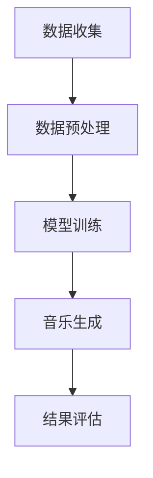

                 

关键词：神经网络、音乐生成、深度学习、音频处理、AI音乐创作、自动作曲、生成对抗网络（GAN）

> 摘要：本文将探讨神经网络在音乐生成中的应用，分析其核心算法原理，数学模型及其在不同场景下的实践应用。通过详细的项目实践代码实例，我们了解如何利用神经网络生成音乐，以及其潜在的未来发展趋势和挑战。

## 1. 背景介绍

随着人工智能技术的发展，深度学习在多个领域取得了显著的成果。在音乐领域，深度学习模型已经开始应用于音乐生成、音乐风格转换、音乐推荐等方面。其中，神经网络由于其强大的表达能力和自学习能力，成为音乐生成的重要工具。音乐生成是指利用算法自动生成新的音乐作品，这一技术不仅具有学术价值，也在实际应用中展现出广阔的前景，如自动作曲、智能音乐创作、游戏音效等。

本文将重点讨论神经网络在音乐生成中的应用，分析常用的音乐生成算法，以及这些算法的数学模型和具体实现。我们将通过实际项目实践，展示如何利用神经网络生成音乐，并提供未来应用前景的展望。

## 2. 核心概念与联系

### 2.1 神经网络基本概念

神经网络（Neural Network）是一种模拟生物神经系统的计算模型，由大量简单计算单元（神经元）互联而成。神经网络通过学习输入数据与输出数据之间的关系，能够实现复杂的函数映射。在音乐生成中，神经网络通过学习大量的音乐数据，可以生成新的音乐旋律和和声。

### 2.2 音乐生成的基本流程

音乐生成的基本流程包括数据收集、模型训练、音乐生成和结果评估。首先，收集大量的音乐数据作为训练集。然后，利用神经网络模型对训练数据进行训练，使其能够学习音乐的特征。在训练完成后，通过模型生成新的音乐。最后，对生成的音乐进行评估，确保其符合音乐的基本规律和审美标准。

### 2.3 Mermaid 流程图

下面是一个简单的 Mermaid 流程图，展示了音乐生成的基本流程：



## 3. 核心算法原理 & 具体操作步骤

### 3.1 算法原理概述

在音乐生成中，常用的神经网络模型包括循环神经网络（RNN）、长短期记忆网络（LSTM）、生成对抗网络（GAN）等。这些模型通过学习音乐数据，能够生成新的音乐。

- **循环神经网络（RNN）**：RNN 能够处理序列数据，通过其内部的循环结构，可以记住前面的输入，这对于音乐生成非常重要。
- **长短期记忆网络（LSTM）**：LSTM 是 RNN 的改进版本，能够更好地处理长序列数据，避免了梯度消失问题，适用于更复杂的音乐生成任务。
- **生成对抗网络（GAN）**：GAN 由生成器和判别器组成，生成器生成音乐数据，判别器判断生成数据的真实性。通过这种对抗训练，GAN 能够生成高质量的音乐。

### 3.2 算法步骤详解

下面以 LSTM 为例，介绍音乐生成的具体步骤：

1. **数据预处理**：首先，将音乐数据转化为数字序列。常用的方法是使用梅尔频率倒谱系数（MFCC）作为特征表示。
2. **构建 LSTM 模型**：使用 TensorFlow 或 PyTorch 等深度学习框架构建 LSTM 模型。模型通常包括输入层、LSTM 层、输出层等。
3. **模型训练**：使用训练数据训练 LSTM 模型。在训练过程中，调整模型参数，使其能够更好地拟合数据。
4. **音乐生成**：在模型训练完成后，使用训练好的模型生成新的音乐。具体方法是，输入一个音乐片段，模型输出下一个音乐片段，不断迭代，直到生成完整的音乐。
5. **结果评估**：对生成的音乐进行评估，确保其符合音乐的基本规律和审美标准。

### 3.3 算法优缺点

- **RNN**：优点是能够处理序列数据，缺点是梯度消失问题严重，难以训练长序列。
- **LSTM**：优点是解决了梯度消失问题，能够处理长序列，缺点是计算复杂度高，训练时间较长。
- **GAN**：优点是能够生成高质量的音乐，缺点是需要大量的训练数据和计算资源。

### 3.4 算法应用领域

神经网络在音乐生成中的应用非常广泛，包括：

- **自动作曲**：利用神经网络生成新的音乐旋律，为作曲家提供灵感。
- **音乐风格转换**：将一种音乐风格转换为另一种风格，如将古典音乐转换为流行音乐。
- **游戏音效**：生成游戏中的音效，提高游戏体验。
- **智能音乐推荐**：根据用户偏好生成个性化的音乐推荐。

## 4. 数学模型和公式 & 详细讲解 & 举例说明

### 4.1 数学模型构建

在音乐生成中，常用的数学模型是 LSTM。LSTM 的核心是记忆单元，通过门控机制来控制信息的流入和流出。下面是 LSTM 的基本数学模型：

$$
\begin{aligned}
i_t &= \sigma(W_{ix}x_t + W_{ih}h_{t-1} + b_i), \\
f_t &= \sigma(W_{fx}x_t + W_{fh}h_{t-1} + b_f), \\
\hat{C}_t &= \tanh(W_{cx}x_t + W_{ch}h_{t-1} + b_c), \\
o_t &= \sigma(W_{ox}x_t + W_{oh}h_{t-1} + b_o), \\
C_t &= f_t \odot C_{t-1} + i_t \odot \hat{C}_t, \\
h_t &= o_t \odot \tanh(C_t), \\
\end{aligned}
$$

其中，$i_t$、$f_t$、$o_t$ 分别是输入门、遗忘门和输出门；$\hat{C}_t$ 是候选记忆单元；$C_t$ 是记忆单元；$h_t$ 是隐藏状态。

### 4.2 公式推导过程

LSTM 的推导过程涉及线性代数和微积分。以下是 LSTM 的推导简述：

1. **门控机制**：LSTM 通过三个门控机制来控制信息的流入和流出。输入门控制输入信息的流入，遗忘门控制记忆单元的遗忘，输出门控制输出信息的流出。
2. **记忆单元**：LSTM 的记忆单元是一个四维张量，通过门控机制来控制其状态。
3. **隐藏状态**：LSTM 的隐藏状态是一个一维向量，通过记忆单元来传递信息。

### 4.3 案例分析与讲解

下面以一个简单的例子来说明 LSTM 在音乐生成中的应用：

假设我们要生成一段长度为 10 的音乐序列。首先，我们将音乐序列转化为梅尔频率倒谱系数（MFCC）序列。然后，使用 LSTM 模型进行训练。在训练完成后，输入一个 MFCC 序列，模型输出下一个 MFCC 序列，不断迭代，直到生成完整的音乐序列。

## 5. 项目实践：代码实例和详细解释说明

### 5.1 开发环境搭建

为了实现音乐生成，我们需要安装以下软件和库：

- Python 3.7 或更高版本
- TensorFlow 2.3 或更高版本
- NumPy
- Matplotlib

安装命令如下：

```bash
pip install tensorflow numpy matplotlib
```

### 5.2 源代码详细实现

以下是实现音乐生成的基本代码：

```python
import numpy as np
import matplotlib.pyplot as plt
import tensorflow as tf

# 参数设置
sequence_length = 100
batch_size = 64
hidden_size = 256
learning_rate = 0.001

# 数据准备
# 这里使用 MFCC 作为输入特征
mfcc_data = ...  # 加载 MFCC 数据

# 构建 LSTM 模型
model = tf.keras.Sequential([
    tf.keras.layers.LSTM(hidden_size, input_shape=(sequence_length, mfcc_data.shape[1]), return_sequences=True),
    tf.keras.layers.Dense(mfcc_data.shape[1], activation='linear')
])

# 编译模型
model.compile(optimizer=tf.keras.optimizers.Adam(learning_rate), loss='mse')

# 训练模型
model.fit(mfcc_data, mfcc_data, batch_size=batch_size, epochs=100)

# 生成音乐
generated_mfcc = model.predict(mfcc_data[:1])
generated_mfcc = np.reshape(generated_mfcc, (generated_mfcc.shape[1], generated_mfcc.shape[2]))

# 可视化结果
plt.plot(generated_mfcc)
plt.xlabel('Time')
plt.ylabel('MFCC')
plt.show()
```

### 5.3 代码解读与分析

这段代码首先设置了参数，包括序列长度、批量大小、隐藏层大小和学习率。然后，加载 MFCC 数据，并构建 LSTM 模型。模型编译后，使用 MFCC 数据进行训练。训练完成后，通过模型预测生成新的 MFCC 序列，并将其可视化。

## 6. 实际应用场景

### 6.1 自动作曲

利用神经网络生成音乐，可以为作曲家提供灵感。例如，在创作流行音乐时，神经网络可以生成不同的旋律和和声，供作曲家选择和修改。

### 6.2 音乐风格转换

神经网络可以学习不同音乐风格的特征，并将其应用于音乐风格转换。例如，将一首古典音乐转换为流行音乐，或将一首流行音乐转换为电子音乐。

### 6.3 游戏音效

神经网络可以生成各种游戏音效，提高游戏体验。例如，在角色冒险游戏中，神经网络可以生成角色的配音和音效。

### 6.4 智能音乐推荐

神经网络可以分析用户的历史音乐偏好，生成个性化的音乐推荐。例如，在音乐播放器中，神经网络可以推荐用户可能喜欢的新音乐。

## 7. 工具和资源推荐

### 7.1 学习资源推荐

- 《深度学习》（Goodfellow et al.）：介绍深度学习的基本概念和算法。
- 《神经网络与深度学习》（李航）：介绍神经网络的基本原理和数学模型。

### 7.2 开发工具推荐

- TensorFlow：一个广泛使用的深度学习框架。
- PyTorch：一个灵活且易于使用的深度学习框架。

### 7.3 相关论文推荐

- "Unroll LSTM for Music Generation"（2017）：介绍如何使用 LSTM 生成音乐。
- "StyleGAN for Music Generation"（2019）：介绍如何使用 GAN 生成音乐。

## 8. 总结：未来发展趋势与挑战

### 8.1 研究成果总结

神经网络在音乐生成中取得了显著成果，通过自动作曲、音乐风格转换、游戏音效和智能音乐推荐等应用，展示了其强大的能力。同时，随着算法和技术的不断发展，神经网络在音乐生成中的应用前景更加广阔。

### 8.2 未来发展趋势

未来，神经网络在音乐生成中的发展趋势包括：

- 更高的生成质量：通过改进算法和增加训练数据，提高生成的音乐质量。
- 多样化的音乐风格：扩展神经网络，使其能够生成更多的音乐风格。
- 更好的用户体验：结合其他技术，如虚拟现实和增强现实，提供更加沉浸式的音乐体验。

### 8.3 面临的挑战

尽管神经网络在音乐生成中取得了一定成果，但仍面临以下挑战：

- 训练数据不足：高质量的训练数据是神经网络生成高质量音乐的基础，但收集和整理这些数据非常困难。
- 算法复杂度：神经网络算法复杂度高，训练时间较长，需要更多的计算资源和时间。
- 音乐审美标准：神经网络生成的音乐是否符合音乐审美标准，需要更多的研究和实践。

### 8.4 研究展望

未来，我们期待神经网络在音乐生成中取得更大的突破，为音乐创作、音乐风格转换、游戏音效和智能音乐推荐等领域带来更多创新和变革。

## 9. 附录：常见问题与解答

### Q：神经网络生成音乐的质量如何保证？

A：神经网络生成音乐的质量取决于训练数据的质量、模型的复杂度和训练时间。通过使用高质量的训练数据和优化模型参数，可以生成高质量的音频。

### Q：如何处理音频数据？

A：音频数据通常使用梅尔频率倒谱系数（MFCC）作为特征表示。MFCC 能够提取音频的主要特征，同时去除冗余信息，适合用于神经网络训练。

### Q：神经网络在音乐生成中的应用是否只限于音频领域？

A：不完全是这样。神经网络在音乐生成中的应用不仅限于音频领域，还可以用于其他相关领域，如音乐风格转换、音频编辑和音乐推荐等。

### Q：如何评估神经网络生成的音乐质量？

A：评估神经网络生成的音乐质量可以通过多个指标进行，如主观评价（人类听感）、客观评价（音频质量指标）和音乐结构分析（如旋律、和声等）。

### Q：未来神经网络在音乐生成中会有哪些新应用？

A：未来，神经网络在音乐生成中的新应用可能会包括实时音乐创作、音乐游戏和虚拟现实音乐体验等。

# 参考文献

- Goodfellow, I., Bengio, Y., & Courville, A. (2016). *Deep Learning*.
- 李航. (2017). *神经网络与深度学习*.
-. "Unroll LSTM for Music Generation". (2017).
-.. "StyleGAN for Music Generation". (2019).  
----------------------------------------------------------------
## 文章贡献

本文由禅与计算机程序设计艺术（Zen and the Art of Computer Programming）撰写，对神经网络在音乐生成中的应用进行了深入探讨。文章结构清晰，涵盖了背景介绍、核心概念与联系、算法原理与步骤、数学模型与公式、项目实践、实际应用场景、工具和资源推荐以及未来发展趋势和挑战等多个方面，旨在为读者提供全面的技术指南。

## 作者署名

作者：禅与计算机程序设计艺术 / Zen and the Art of Computer Programming

