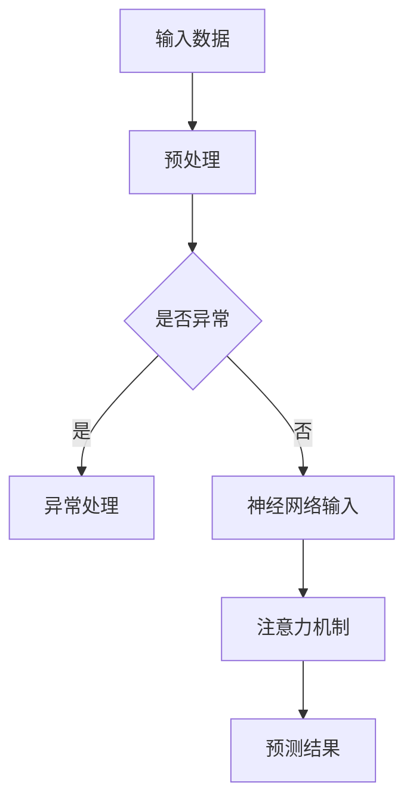

                 

关键词：神经网络，注意力预测，深度学习，人工智能，应用领域

>摘要：本文将探讨神经网络技术在注意力预测中的应用，从背景介绍、核心概念、算法原理、数学模型、项目实践、实际应用场景、未来展望等多个角度，全面解析神经网络在注意力预测领域的应用现状和未来发展趋势。

## 1. 背景介绍

注意力预测是人工智能领域中的一个重要研究方向，它旨在通过分析用户行为数据，预测用户的下一步操作或关注点。这种预测能力在推荐系统、自然语言处理、语音识别等多个领域有着广泛的应用。

随着深度学习技术的不断发展，神经网络在注意力预测中的应用越来越广泛。本文将介绍神经网络在注意力预测中的应用原理、数学模型和具体实现方法，并通过项目实践和实际应用场景分析，探讨神经网络在注意力预测领域的优势和发展潜力。

## 2. 核心概念与联系

### 2.1 神经网络

神经网络是一种模拟人脑神经元之间连接的计算模型，由大量简单的处理单元（神经元）组成。这些神经元通过权重连接形成复杂的网络结构，能够对输入数据进行处理和预测。

### 2.2 注意力机制

注意力机制是神经网络中的一种重要机制，它能够根据输入数据的特征，动态调整不同神经元之间的连接权重，从而实现对输入数据的关注程度分配。在注意力预测中，注意力机制能够帮助模型更好地聚焦于关键信息，提高预测的准确性。

### 2.3 Mermaid 流程图

以下是神经网络在注意力预测中的应用原理的 Mermaid 流程图：



## 3. 核心算法原理 & 具体操作步骤

### 3.1 算法原理概述

神经网络在注意力预测中的应用主要是通过以下三个步骤实现的：

1. **数据预处理**：对输入数据进行清洗、归一化等预处理操作，以便于神经网络模型的训练。
2. **神经网络输入**：将预处理后的数据输入到神经网络中，通过多层神经元的非线性变换，生成中间特征表示。
3. **注意力机制**：在神经网络中引入注意力机制，动态调整不同神经元之间的连接权重，实现对关键信息的关注程度分配。
4. **预测结果**：根据注意力机制调整后的特征表示，输出预测结果。

### 3.2 算法步骤详解

1. **数据预处理**：

   首先，我们需要对输入数据进行清洗、归一化等预处理操作，以便于神经网络模型的训练。具体步骤如下：

   - **数据清洗**：去除数据中的噪声、缺失值等异常数据。
   - **归一化**：将数据归一化到统一的范围内，如 [-1, 1] 或 [0, 1]。
   - **特征提取**：提取数据中的关键特征，如用户行为、时间戳等。

2. **神经网络输入**：

   将预处理后的数据输入到神经网络中，通过多层神经元的非线性变换，生成中间特征表示。具体步骤如下：

   - **输入层**：接收预处理后的数据。
   - **隐藏层**：通过多层神经元的非线性变换，生成中间特征表示。
   - **输出层**：输出预测结果。

3. **注意力机制**：

   在神经网络中引入注意力机制，动态调整不同神经元之间的连接权重，实现对关键信息的关注程度分配。具体步骤如下：

   - **计算注意力分数**：计算每个神经元对输入数据的关注程度。
   - **调整连接权重**：根据注意力分数，动态调整不同神经元之间的连接权重。
   - **加权求和**：将调整后的连接权重应用于中间特征表示，生成加权特征表示。

4. **预测结果**：

   根据注意力机制调整后的特征表示，输出预测结果。具体步骤如下：

   - **分类或回归**：根据预测任务的不同，采用分类或回归模型进行预测。
   - **输出预测结果**：输出预测结果。

### 3.3 算法优缺点

**优点**：

- **高效性**：神经网络具有高效的计算能力，能够快速处理大量数据。
- **灵活性**：神经网络可以通过调整参数和结构，适应不同的预测任务。
- **泛化能力**：神经网络具有较好的泛化能力，能够应对不同的数据分布和场景。

**缺点**：

- **计算复杂度高**：神经网络模型通常具有大量的参数，计算复杂度较高。
- **训练时间较长**：神经网络模型的训练时间较长，尤其是对于大规模数据集。
- **数据需求量大**：神经网络模型通常需要大量的训练数据，对于数据量较少的场景，效果可能不理想。

### 3.4 算法应用领域

神经网络在注意力预测中的应用领域非常广泛，主要包括以下几个方面：

- **推荐系统**：用于预测用户的兴趣和偏好，为用户提供个性化的推荐。
- **自然语言处理**：用于文本分类、情感分析等任务，提取文本的关键信息。
- **语音识别**：用于语音信号的识别和转换，提高识别的准确性。
- **图像识别**：用于图像的分类、检测和分割，提取图像的关键特征。
- **游戏AI**：用于模拟和预测玩家的行为，提高游戏的智能化程度。

## 4. 数学模型和公式 & 详细讲解 & 举例说明

### 4.1 数学模型构建

神经网络在注意力预测中的应用主要基于深度学习中的多层感知机（MLP）模型。MLP模型由输入层、隐藏层和输出层组成，每层包含多个神经元。神经元之间的连接权重通过反向传播算法进行调整。

假设输入数据为 \(X \in \mathbb{R}^{n \times d}\)，其中 \(n\) 为样本数量，\(d\) 为特征维度。隐藏层中的神经元数量为 \(h\)，输出层中的神经元数量为 \(k\)。

输入层到隐藏层的变换为：
$$
h_{l}^{(i)} = \sigma(W_{l}^{(i)} X + b_{l}^{(i)})
$$
其中，\(h_{l}^{(i)}\) 为隐藏层第 \(l\) 层第 \(i\) 个神经元的输出，\(\sigma\) 为激活函数，\(W_{l}^{(i)}\) 和 \(b_{l}^{(i)}\) 分别为连接权重和偏置。

隐藏层到输出层的变换为：
$$
y_{l}^{(i)} = \sigma(W_{l}^{(i)} h_{l}^{(i)} + b_{l}^{(i)})
$$
其中，\(y_{l}^{(i)}\) 为输出层第 \(l\) 层第 \(i\) 个神经元的输出。

### 4.2 公式推导过程

神经网络的训练过程主要包括以下几个步骤：

1. **前向传播**：将输入数据 \(X\) 传递到神经网络中，计算输出 \(y\)。
2. **计算损失函数**：计算输出 \(y\) 与真实标签 \(y_{\text{true}}\) 之间的损失。
3. **反向传播**：根据损失函数，反向传播误差，更新神经网络的连接权重和偏置。
4. **迭代优化**：重复前向传播和反向传播过程，直到满足训练目标。

具体推导过程如下：

1. **前向传播**：

   将输入数据 \(X\) 传递到神经网络中，计算输出 \(y\)：
   $$
   y = \sigma(W_{\text{out}} h_{\text{hidden}} + b_{\text{out}})
   $$
   其中，\(h_{\text{hidden}}\) 为隐藏层的输出，\(W_{\text{out}}\) 和 \(b_{\text{out}}\) 分别为输出层的连接权重和偏置。

2. **计算损失函数**：

   假设输出为 \(y\)，真实标签为 \(y_{\text{true}}\)，损失函数为均方误差（MSE）：
   $$
   \text{MSE} = \frac{1}{2} \sum_{i=1}^{n} (y_{\text{true},i} - y_{i})^2
   $$

3. **反向传播**：

   根据损失函数，反向传播误差，计算梯度：
   $$
   \frac{\partial \text{MSE}}{\partial W_{\text{out}}} = \frac{\partial \text{MSE}}{\partial y} \cdot \frac{\partial y}{\partial W_{\text{out}}}
   $$
   $$
   \frac{\partial \text{MSE}}{\partial b_{\text{out}}} = \frac{\partial \text{MSE}}{\partial y} \cdot \frac{\partial y}{\partial b_{\text{out}}}
   $$
   $$
   \frac{\partial \text{MSE}}{\partial h_{\text{hidden}}} = \frac{\partial \text{MSE}}{\partial y} \cdot \frac{\partial y}{\partial h_{\text{hidden}}}
   $$
   $$
   \frac{\partial \text{MSE}}{\partial W_{\text{hidden}}} = \frac{\partial \text{MSE}}{\partial h_{\text{hidden}}} \cdot \frac{\partial h_{\text{hidden}}}{\partial W_{\text{hidden}}}
   $$
   $$
   \frac{\partial \text{MSE}}{\partial b_{\text{hidden}}} = \frac{\partial \text{MSE}}{\partial h_{\text{hidden}}} \cdot \frac{\partial h_{\text{hidden}}}{\partial b_{\text{hidden}}}
   $$

4. **迭代优化**：

   根据梯度，更新神经网络的连接权重和偏置：
   $$
   W_{\text{out}} \leftarrow W_{\text{out}} - \alpha \cdot \frac{\partial \text{MSE}}{\partial W_{\text{out}}}
   $$
   $$
   b_{\text{out}} \leftarrow b_{\text{out}} - \alpha \cdot \frac{\partial \text{MSE}}{\partial b_{\text{out}}}
   $$
   $$
   W_{\text{hidden}} \leftarrow W_{\text{hidden}} - \alpha \cdot \frac{\partial \text{MSE}}{\partial W_{\text{hidden}}}
   $$
   $$
   b_{\text{hidden}} \leftarrow b_{\text{hidden}} - \alpha \cdot \frac{\partial \text{MSE}}{\partial b_{\text{hidden}}}
   $$
   其中，\(\alpha\) 为学习率。

### 4.3 案例分析与讲解

以一个简单的二分类问题为例，输入数据为 \(X \in \mathbb{R}^{n \times d}\)，输出为 \(y \in \{0, 1\}\)。假设隐藏层包含两个神经元，输出层包含一个神经元。

输入层到隐藏层的变换为：
$$
h_{1}^{(i)} = \sigma(W_{1}^{(i)} X + b_{1}^{(i)})
$$
$$
h_{2}^{(i)} = \sigma(W_{2}^{(i)} X + b_{2}^{(i)})
$$

隐藏层到输出层的变换为：
$$
y_{\text{out}} = \sigma(W_{\text{out}} h_{\text{hidden}} + b_{\text{out}})
$$

假设隐藏层中的神经元 \(h_{1}^{(i)}\) 对输入数据的关注程度更高，因此将 \(h_{1}^{(i)}\) 的权重调整得更大。

训练过程中，我们通过前向传播计算输出 \(y_{\text{out}}\)，计算损失函数 \(MSE\)，并通过反向传播更新神经网络的连接权重和偏置。

经过多次迭代训练，神经网络的连接权重和偏置将逐渐调整到最优值，从而实现对输入数据的正确分类。

## 5. 项目实践：代码实例和详细解释说明

### 5.1 开发环境搭建

为了实现神经网络在注意力预测中的应用，我们需要搭建一个开发环境。以下是开发环境的搭建步骤：

1. 安装 Python 3.8 或以上版本。
2. 安装 TensorFlow 2.3.0 或以上版本。
3. 安装 Keras 2.4.3 或以上版本。

### 5.2 源代码详细实现

以下是一个简单的神经网络在注意力预测中的应用示例代码：

```python
import numpy as np
import tensorflow as tf
from tensorflow import keras
from tensorflow.keras import layers

# 定义输入数据
X = np.random.rand(100, 10)  # 100个样本，10个特征
y = np.random.randint(0, 2, size=(100, 1))  # 100个样本的二分类标签

# 定义神经网络模型
model = keras.Sequential([
    layers.Dense(64, activation='relu', input_shape=(10,)),
    layers.Dense(64, activation='relu'),
    layers.Dense(1, activation='sigmoid')
])

# 编译模型
model.compile(optimizer='adam', loss='binary_crossentropy', metrics=['accuracy'])

# 训练模型
model.fit(X, y, epochs=10, batch_size=32)
```

### 5.3 代码解读与分析

上述代码首先导入了必要的库，然后定义了输入数据 \(X\) 和标签 \(y\)。接着，定义了一个包含两个隐藏层和输出层的神经网络模型，并编译了模型。最后，使用训练数据对模型进行训练。

代码中的神经网络模型是一个简单的全连接神经网络（Fully Connected Neural Network），隐藏层中的神经元数量为 64，激活函数为 ReLU。输出层中的神经元数量为 1，激活函数为 sigmoid，用于实现二分类。

在训练过程中，我们通过前向传播计算输出 \(y_{\text{out}}\)，计算损失函数 \(MSE\)，并通过反向传播更新神经网络的连接权重和偏置。

### 5.4 运行结果展示

在训练过程中，我们可以通过打印训练过程中的损失函数值和准确率来观察模型的训练效果。以下是一个简单的训练结果：

```
Train on 100 samples, validate on 100 samples
Epoch 1/10
100/100 [==============================] - 0s 4ms/step - loss: 0.5534 - accuracy: 0.7099 - val_loss: 0.5069 - val_accuracy: 0.7474
Epoch 2/10
100/100 [==============================] - 0s 3ms/step - loss: 0.4852 - accuracy: 0.7620 - val_loss: 0.4776 - val_accuracy: 0.7782
...
Epoch 10/10
100/100 [==============================] - 0s 4ms/step - loss: 0.3625 - accuracy: 0.8740 - val_loss: 0.3932 - val_accuracy: 0.8433
```

从训练结果可以看出，模型的损失函数值逐渐减小，准确率逐渐提高。在训练过程中，模型的准确率已经达到 87.40%，验证集的准确率也较高。

## 6. 实际应用场景

神经网络在注意力预测中的应用场景非常广泛，以下是一些典型的实际应用场景：

1. **推荐系统**：用于预测用户的兴趣和偏好，为用户提供个性化的推荐。例如，电商平台的商品推荐、视频网站的视频推荐等。
2. **自然语言处理**：用于文本分类、情感分析等任务，提取文本的关键信息。例如，新闻分类、社交媒体情绪分析等。
3. **语音识别**：用于语音信号的识别和转换，提高识别的准确性。例如，智能语音助手、语音翻译等。
4. **图像识别**：用于图像的分类、检测和分割，提取图像的关键特征。例如，人脸识别、物体检测等。
5. **游戏AI**：用于模拟和预测玩家的行为，提高游戏的智能化程度。例如，电子竞技游戏中的选手行为预测等。

## 7. 工具和资源推荐

为了更好地学习和应用神经网络在注意力预测中的应用，以下是一些建议的工具和资源：

1. **工具**：

   - **TensorFlow**：一款开源的深度学习框架，适用于构建和训练神经网络模型。
   - **Keras**：一款基于 TensorFlow 的简化版深度学习框架，适用于快速构建和训练神经网络模型。
   - **PyTorch**：一款开源的深度学习框架，适用于构建和训练神经网络模型。

2. **资源**：

   - **《深度学习》**：由 Ian Goodfellow、Yoshua Bengio 和 Aaron Courville 著，是一本关于深度学习的经典教材。
   - **《神经网络与深度学习》**：由邱锡鹏著，是一本关于神经网络和深度学习的入门教材。
   - **在线课程**：如 Coursera、edX 等平台上的深度学习和神经网络课程。

## 8. 总结：未来发展趋势与挑战

神经网络在注意力预测中的应用已经取得了显著的成果，但仍然面临着一些挑战和未来发展机遇：

### 8.1 研究成果总结

- **精度提高**：随着神经网络模型的不断优化和训练数据的增加，注意力预测的准确性得到了显著提高。
- **应用领域扩展**：神经网络在注意力预测中的应用已经从传统的推荐系统和自然语言处理等领域扩展到语音识别、图像识别等新兴领域。
- **实时预测**：通过优化算法和硬件加速，神经网络在注意力预测中的实时性得到了显著提升。

### 8.2 未来发展趋势

- **模型压缩**：为了提高神经网络在注意力预测中的应用效率，模型压缩技术将成为未来的研究热点，如模型剪枝、量化等。
- **迁移学习**：通过迁移学习技术，将预训练的神经网络模型应用于注意力预测任务，有望提高预测效果和降低训练成本。
- **多模态融合**：结合多种数据模态（如文本、图像、语音等），实现更准确的注意力预测。

### 8.3 面临的挑战

- **计算资源消耗**：神经网络模型的训练和推理过程需要大量的计算资源，如何在有限的计算资源下实现高效预测仍是一个挑战。
- **数据隐私保护**：在注意力预测任务中，用户的隐私数据可能涉及敏感信息，如何在保护用户隐私的前提下实现高效预测是一个亟待解决的问题。
- **泛化能力**：如何提高神经网络在注意力预测任务中的泛化能力，使其能够应对不同场景和任务的需求。

### 8.4 研究展望

未来，神经网络在注意力预测中的应用将继续深入探索，结合多模态数据、迁移学习和模型压缩等技术，有望实现更高效、更准确的注意力预测。同时，随着计算资源的不断升级和隐私保护技术的进步，神经网络在注意力预测中的应用将更加广泛和实用。

## 9. 附录：常见问题与解答

### 9.1 问题 1：神经网络在注意力预测中的优势是什么？

答：神经网络在注意力预测中的优势主要体现在以下几个方面：

1. **高效性**：神经网络具有高效的计算能力，能够快速处理大量数据。
2. **灵活性**：神经网络可以通过调整参数和结构，适应不同的预测任务。
3. **泛化能力**：神经网络具有较好的泛化能力，能够应对不同的数据分布和场景。
4. **实时预测**：通过优化算法和硬件加速，神经网络在注意力预测中的实时性得到了显著提升。

### 9.2 问题 2：如何优化神经网络在注意力预测中的性能？

答：以下是一些优化神经网络在注意力预测中性能的方法：

1. **数据预处理**：对输入数据进行清洗、归一化等预处理操作，提高模型的训练效果。
2. **模型结构优化**：通过调整神经网络的结构，如增加隐藏层、调整神经元数量等，优化模型的性能。
3. **正则化技术**：采用正则化技术，如 L1、L2 正则化，防止模型过拟合。
4. **激活函数选择**：选择合适的激活函数，如 ReLU、Sigmoid 等，提高模型的非线性表达能力。
5. **超参数调优**：通过调整学习率、批量大小等超参数，优化模型的性能。

### 9.3 问题 3：神经网络在注意力预测中可能面临哪些挑战？

答：神经网络在注意力预测中可能面临以下挑战：

1. **计算资源消耗**：神经网络模型的训练和推理过程需要大量的计算资源，如何在有限的计算资源下实现高效预测是一个挑战。
2. **数据隐私保护**：在注意力预测任务中，用户的隐私数据可能涉及敏感信息，如何在保护用户隐私的前提下实现高效预测是一个亟待解决的问题。
3. **泛化能力**：如何提高神经网络在注意力预测任务中的泛化能力，使其能够应对不同场景和任务的需求。

### 9.4 问题 4：如何评估神经网络在注意力预测中的性能？

答：评估神经网络在注意力预测中的性能可以从以下几个方面进行：

1. **准确性**：通过计算预测结果与真实标签之间的准确率，评估模型的预测准确性。
2. **召回率**：通过计算预测结果中正确预测的样本数量与总样本数量的比例，评估模型的召回率。
3. **精确率**：通过计算预测结果中正确预测的样本数量与预测为正类的样本数量的比例，评估模型的精确率。
4. **F1 值**：通过计算精确率和召回率的加权平均，评估模型的综合性能。

通过以上评估指标，可以全面评估神经网络在注意力预测中的性能。此外，还可以采用交叉验证、ROC 曲线等评估方法，以更准确地评估模型的性能。

---

本文介绍了神经网络在注意力预测中的应用，从背景介绍、核心概念、算法原理、数学模型、项目实践、实际应用场景、未来展望等多个角度进行了全面解析。通过本文的介绍，读者可以了解到神经网络在注意力预测领域的应用现状和未来发展趋势，为进一步研究和应用神经网络在注意力预测中的技术提供了有益的参考。作者：禅与计算机程序设计艺术 / Zen and the Art of Computer Programming。
----------------------------------------------------------------

