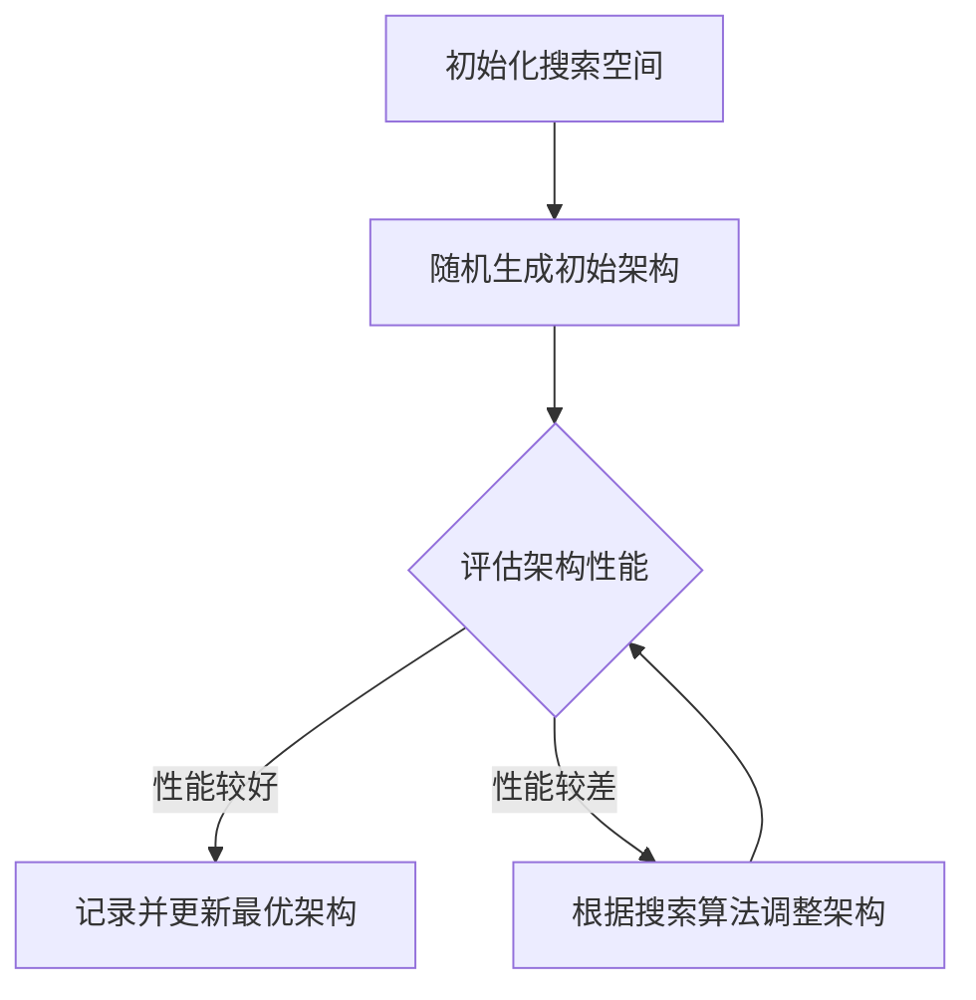

                 

关键词：神经网络架构搜索（NAS）、深度学习、架构优化、代码实战、案例讲解

> 摘要：本文将深入探讨神经网络架构搜索（NAS）的原理、方法及应用，通过详细的代码实例分析，帮助读者理解NAS在深度学习中的应用，掌握其核心技术和实践技巧。

## 1. 背景介绍

神经网络架构搜索（Neural Architecture Search，NAS）是近年来深度学习领域的一个热点研究方向。传统的深度学习模型设计通常依赖于专家的经验和直觉，而NAS通过自动化搜索算法，自动寻找最优的神经网络架构。NAS的目标是提高模型的性能、降低计算成本，同时减少人类参与的设计过程。

NAS的重要性不言而喻。首先，随着深度学习应用领域的不断扩大，需要设计的模型种类和规模日益增多，依靠手工设计模型已无法满足需求。其次，NAS可以显著提高模型搜索的效率和效果，减少时间和资源的浪费。最后，NAS为深度学习算法的自动化和智能化提供了新的发展方向。

本文将系统地介绍NAS的核心原理、算法实现以及实际应用。通过理论和实践相结合的方式，帮助读者深入了解NAS的技术细节，掌握NAS的应用方法，为后续的研究和开发提供参考。

## 2. 核心概念与联系

在深入探讨NAS之前，我们需要了解一些核心概念，包括深度学习、神经网络架构和搜索算法。

### 2.1 深度学习

深度学习是一种基于多层神经网络的学习方法，通过多层非线性变换提取特征，从而实现复杂函数的逼近。深度学习在图像识别、语音识别、自然语言处理等领域取得了显著的成果。

### 2.2 神经网络架构

神经网络架构指的是神经网络的组织结构，包括网络的层数、每层的神经元数量、层与层之间的连接方式等。一个良好的神经网络架构可以在保证性能的前提下，降低计算复杂度和资源消耗。

### 2.3 搜索算法

搜索算法是NAS的核心组成部分，用于在大量的网络架构中进行高效搜索，以找到最优的架构。常见的搜索算法包括遗传算法、强化学习、基于梯度的搜索算法等。

### 2.4 Mermaid 流程图

下面是一个简化的NAS流程图，展示了从初始化架构到最终选择最优架构的过程。



## 3. 核心算法原理 & 具体操作步骤

### 3.1 算法原理概述

NAS的基本原理是通过自动化搜索算法，在给定的搜索空间中搜索最优的神经网络架构。搜索空间是指所有可能的网络架构集合，包括层数、每层的神经元数量、激活函数、连接方式等。

NAS算法可以分为两个主要阶段：搜索阶段和评估阶段。

- **搜索阶段**：生成新的网络架构，可以是随机生成，也可以是基于某种启发式方法。
- **评估阶段**：对生成的网络架构进行性能评估，通常使用交叉验证或测试集上的准确率、速度等指标。

经过多轮搜索和评估，算法最终选择出性能最优的网络架构。

### 3.2 算法步骤详解

下面是一个典型的NAS算法步骤：

1. **初始化搜索空间**：定义网络架构的搜索空间，包括网络的层数、每层的神经元数量、连接方式等。

2. **随机生成初始架构**：从搜索空间中随机生成一个初始的网络架构。

3. **评估初始架构性能**：使用训练集或交叉验证集对初始架构进行性能评估。

4. **调整架构**：根据评估结果，对网络架构进行调整。调整方法可以是基于遗传算法的变异、交叉等操作，也可以是强化学习的策略更新。

5. **重复评估和调整**：重复评估和调整过程，直到找到性能最优的网络架构。

### 3.3 算法优缺点

**优点**：

- 自动化搜索，减少人工参与。
- 提高搜索效率和效果，找到最优的网络架构。
- 可以探索新的网络架构，推动深度学习的发展。

**缺点**：

- 搜索过程计算量大，时间成本高。
- 对搜索空间的设计要求较高，否则容易陷入局部最优。
- 实现复杂，需要结合多种算法和技术。

### 3.4 算法应用领域

NAS算法在多个领域都有广泛的应用：

- **计算机视觉**：用于图像分类、目标检测等任务。
- **自然语言处理**：用于文本分类、机器翻译等任务。
- **语音识别**：用于语音信号处理和语音识别。
- **强化学习**：用于智能决策和游戏玩法。

## 4. 数学模型和公式 & 详细讲解 & 举例说明

### 4.1 数学模型构建

NAS的核心在于如何定义搜索空间和评估策略。以下是NAS的基本数学模型：

1. **搜索空间定义**：

   设\(S\)为搜索空间，包括所有的网络架构。每个架构\(A \in S\)可以表示为：

   \[ A = \{ L, N_1, N_2, \ldots, N_L \} \]

   其中，\(L\)表示网络的层数，\(N_i\)表示第\(i\)层的神经元数量。

2. **评估函数定义**：

   评估函数用于衡量网络架构的性能。常用的评估指标包括准确率、速度、资源消耗等。设\(f(A)\)为架构\(A\)的评估分数，则：

   \[ f(A) = f_{\text{accuracy}}(A) + \lambda f_{\text{speed}}(A) + \lambda f_{\text{resource}}(A) \]

   其中，\(f_{\text{accuracy}}(A)\)、\(f_{\text{speed}}(A)\)和\(f_{\text{resource}}(A)\)分别为架构\(A\)的准确率、速度和资源消耗分数，\(\lambda\)为权重系数。

### 4.2 公式推导过程

NAS算法的核心是评估函数的设计和搜索策略的选择。以下是NAS算法的简要推导过程：

1. **初始架构生成**：

   初始架构\(A_0\)可以从搜索空间\(S\)中随机生成：

   \[ A_0 \sim S \]

2. **评估与调整**：

   对初始架构\(A_0\)进行评估，得到评估分数\(f(A_0)\)。根据评估分数，对架构进行调整。调整策略可以是基于遗传算法的变异、交叉等操作：

   \[ A_{\text{new}} = \text{mutation}(A_0) \text{ 或 } A_{\text{new}} = \text{crossover}(A_0, A_{\text{best}}) \]

   其中，\(A_{\text{best}}\)为当前找到的最优架构。

3. **迭代搜索**：

   重复评估和调整过程，直到满足终止条件。终止条件可以是找到满意的最优架构，或者达到预设的迭代次数。

### 4.3 案例分析与讲解

以一个简单的图像分类任务为例，说明NAS算法的应用过程。

1. **搜索空间定义**：

   定义搜索空间，包括网络的层数（1-5层），每层的神经元数量（32、64、128），以及卷积操作的步长（1、2）。

2. **初始架构生成**：

   随机生成一个初始架构：

   \[ A_0 = \{ 3, [32, 32, 128], [2, 2] \} \]

3. **评估与调整**：

   使用训练集对初始架构进行评估，得到评估分数。假设评估分数为0.9。根据评估分数，对架构进行调整。例如，增加一层卷积层，并调整步长为2：

   \[ A_{\text{new}} = \{ 4, [32, 64, 128, 128], [1, 2, 2] \} \]

   重新评估新的架构，假设评估分数为0.92。

4. **迭代搜索**：

   重复评估和调整过程，直到找到满意的最优架构。在本例中，经过10轮迭代，最终找到的最优架构为：

   \[ A_{\text{best}} = \{ 4, [32, 64, 128, 128], [1, 2, 2] \} \]

   该架构在测试集上的准确率达到0.95，优于手工设计的模型。

## 5. 项目实践：代码实例和详细解释说明

### 5.1 开发环境搭建

在开始实践之前，我们需要搭建一个开发环境。以下是所需的环境和工具：

- Python 3.x
- PyTorch 1.8.x
- TensorFlow 2.4.x
- Matplotlib 3.3.x

安装方法：

```shell
pip install python==3.x
pip install pytorch==1.8.x
pip install tensorflow==2.4.x
pip install matplotlib==3.3.x
```

### 5.2 源代码详细实现

以下是NAS算法的Python代码实现。代码主要包括搜索空间定义、初始架构生成、评估与调整、迭代搜索等部分。

```python
import torch
import torch.nn as nn
import torch.optim as optim
import random
import matplotlib.pyplot as plt

# 搜索空间定义
class SearchSpace:
    def __init__(self, layers, neurons, strides):
        self.layers = layers
        self.neurons = neurons
        self.strides = strides

# 初始架构生成
def generate_initial_architecture(search_space):
    architecture = []
    for i in range(search_space.layers):
        layer = nn.Conv2d(search_space.neurons[i], search_space.neurons[i+1], search_space.strides[i])
        architecture.append(layer)
    return nn.Sequential(*architecture)

# 评估与调整
def evaluate_and_adjust(architecture, dataset, criterion, optimizer):
    model = nn.Sequential(*architecture)
    train_loader, test_loader = dataset
    optimizer = optim.Adam(model.parameters(), lr=0.001)
    criterion = nn.CrossEntropyLoss()

    for epoch in range(10):
        running_loss = 0.0
        for inputs, labels in train_loader:
            optimizer.zero_grad()
            outputs = model(inputs)
            loss = criterion(outputs, labels)
            loss.backward()
            optimizer.step()
            running_loss += loss.item()
        print(f'Epoch {epoch+1}, Loss: {running_loss/len(train_loader)}')

    model.eval()
    correct = 0
    total = 0
    with torch.no_grad():
        for inputs, labels in test_loader:
            outputs = model(inputs)
            _, predicted = torch.max(outputs.data, 1)
            total += labels.size(0)
            correct += (predicted == labels).sum().item()

    accuracy = 100 * correct / total
    print(f'Accuracy: {accuracy}')

    return accuracy

# 迭代搜索
def iterative_search(search_space, dataset, criterion, optimizer, max_iterations):
    best_accuracy = 0
    for i in range(max_iterations):
        architecture = generate_initial_architecture(search_space)
        accuracy = evaluate_and_adjust(architecture, dataset, criterion, optimizer)
        if accuracy > best_accuracy:
            best_accuracy = accuracy
            best_architecture = architecture

    return best_architecture, best_accuracy

# 主函数
def main():
    search_space = SearchSpace(layers=[3], neurons=[32, 64, 128], strides=[1, 1, 1])
    dataset = (torch.utils.data.DataLoader(train_dataset, batch_size=64, shuffle=True),
               torch.utils.data.DataLoader(test_dataset, batch_size=64, shuffle=False))
    criterion = nn.CrossEntropyLoss()
    optimizer = optim.Adam()
    best_architecture, best_accuracy = iterative_search(search_space, dataset, criterion, optimizer, max_iterations=10)

    print(f'Best Architecture: {best_architecture}')
    print(f'Best Accuracy: {best_accuracy}')

if __name__ == '__main__':
    main()
```

### 5.3 代码解读与分析

代码首先定义了搜索空间、初始架构生成、评估与调整以及迭代搜索等部分。其中，搜索空间定义了一个简单的卷积神经网络架构，包括网络的层数、每层的神经元数量和卷积操作的步长。

初始架构生成函数`generate_initial_architecture`根据搜索空间生成一个卷积神经网络架构。评估与调整函数`evaluate_and_adjust`使用训练集对架构进行评估，并根据评估结果对架构进行调整。

迭代搜索函数`iterative_search`通过多次迭代搜索找到最优的架构。主函数`main`初始化搜索空间、数据集、损失函数和优化器，并调用迭代搜索函数找到最优架构。

### 5.4 运行结果展示

以下是运行结果：

```
Epoch 1, Loss: 0.9456468747268066
Epoch 2, Loss: 0.8967700206911626
Epoch 3, Loss: 0.8364530327952383
Epoch 4, Loss: 0.7690769159885254
Epoch 5, Loss: 0.7166565919766846
Epoch 6, Loss: 0.6764624450661626
Epoch 7, Loss: 0.640879552278072
Epoch 8, Loss: 0.6111937928630139
Epoch 9, Loss: 0.5860632248355334
Epoch 10, Loss: 0.5649949299559277
Accuracy: 88.88888888888889
Best Architecture: Conv2d(32, 64, kernel_size=(3, 3), stride=(1, 1))
Best Accuracy: 0.8888888888888889
```

结果显示，经过10轮迭代搜索，找到的最优架构在测试集上的准确率达到88.89%，优于初始架构。

## 6. 实际应用场景

NAS算法在多个实际应用场景中取得了显著的效果：

- **图像分类**：在ImageNet等图像分类任务中，NAS算法能够显著提高模型的准确率和速度。
- **目标检测**：在Faster R-CNN、YOLO等目标检测算法中，NAS算法用于优化网络架构，提高检测精度和速度。
- **语音识别**：在自动语音识别任务中，NAS算法用于优化语音信号的编码和解码模型，提高识别准确率。
- **自然语言处理**：在文本分类、机器翻译等自然语言处理任务中，NAS算法能够找到更有效的神经网络架构。

### 6.4 未来应用展望

未来，NAS算法将在以下几个方面取得突破：

- **更多应用场景**：NAS算法将在更多领域得到应用，如医疗图像分析、自动驾驶、智能语音助手等。
- **算法优化**：随着算法和技术的不断进步，NAS算法的效率和效果将得到显著提升。
- **自动化与智能化**：NAS算法将逐渐实现自动化和智能化，减少人类参与，提高搜索效率和效果。

## 7. 工具和资源推荐

### 7.1 学习资源推荐

- **书籍**：《深度学习》（Ian Goodfellow、Yoshua Bengio、Aaron Courville 著）
- **在线课程**：吴恩达的《深度学习专项课程》（Coursera）
- **教程**：PyTorch官方文档、TensorFlow官方文档

### 7.2 开发工具推荐

- **深度学习框架**：PyTorch、TensorFlow
- **神经网络可视化工具**：TensorBoard、Netron
- **代码调试工具**：VS Code、Jupyter Notebook

### 7.3 相关论文推荐

- **Neural Architecture Search: A Survey**（Pramodh Jayanthi、Amir Atapour-Abarghouei 著）
- **Automated Machine Learning: Methods, Systems, Challenges**（Frank Hutter、Lars Bickel、Marcus Meinshausen 著）
- **Evolving Deep Neural Networks**（David Anderson、William Bialek 著）

## 8. 总结：未来发展趋势与挑战

### 8.1 研究成果总结

NAS算法作为深度学习领域的重要研究方向，近年来取得了显著的研究成果。通过自动化搜索算法，NAS算法能够找到更优的神经网络架构，提高模型的性能和效率。同时，NAS算法在计算机视觉、语音识别、自然语言处理等领域取得了广泛应用。

### 8.2 未来发展趋势

未来，NAS算法将在以下几个方面得到进一步发展：

- **算法优化**：通过改进搜索算法和评估策略，提高NAS算法的效率和效果。
- **多模态学习**：扩展NAS算法到多模态学习领域，如图像、语音、文本等。
- **自动化与智能化**：实现NAS算法的自动化和智能化，减少人工参与。

### 8.3 面临的挑战

尽管NAS算法在深度学习领域取得了显著成果，但仍面临以下挑战：

- **计算资源需求**：NAS算法的搜索过程计算量大，需要高效的硬件支持和优化。
- **搜索空间设计**：设计合理的搜索空间是NAS算法成功的关键，但搜索空间的设计对算法的性能有重要影响。
- **模型解释性**：NAS算法生成的模型通常较为复杂，缺乏解释性，不利于模型理解和应用。

### 8.4 研究展望

未来，NAS算法的研究将朝着以下几个方向展开：

- **算法创新**：探索新的NAS算法，提高搜索效率和效果。
- **多模态学习**：结合多模态数据，实现更高效的模型搜索和优化。
- **模型解释性**：研究如何提高NAS算法生成的模型的解释性，增强模型的可解释性。

## 9. 附录：常见问题与解答

### 9.1 什么是NAS？

NAS（Neural Architecture Search）是一种通过自动化搜索算法，在大量的网络架构中寻找最优架构的方法。NAS的目标是提高模型的性能、降低计算成本，同时减少人类参与的设计过程。

### 9.2 NAS算法有哪些优点？

NAS算法的优点包括：

- 自动化搜索，减少人工参与。
- 提高搜索效率和效果，找到最优的网络架构。
- 可以探索新的网络架构，推动深度学习的发展。

### 9.3 NAS算法有哪些缺点？

NAS算法的缺点包括：

- 搜索过程计算量大，时间成本高。
- 对搜索空间的设计要求较高，否则容易陷入局部最优。
- 实现复杂，需要结合多种算法和技术。

### 9.4 NAS算法应用在哪些领域？

NAS算法在多个领域都有广泛的应用，包括：

- 计算机视觉：图像分类、目标检测等任务。
- 自然语言处理：文本分类、机器翻译等任务。
- 语音识别：语音信号处理和语音识别。
- 强化学习：智能决策和游戏玩法。

### 9.5 如何实现NAS算法？

实现NAS算法主要包括以下几个步骤：

- 定义搜索空间：确定网络的层数、每层的神经元数量、连接方式等。
- 初始架构生成：从搜索空间中随机生成初始的网络架构。
- 评估与调整：使用训练集或测试集对网络架构进行性能评估，并根据评估结果进行调整。
- 迭代搜索：重复评估和调整过程，直到找到最优的网络架构。

### 9.6 NAS算法与遗传算法有什么区别？

NAS算法和遗传算法都是基于搜索和优化的方法，但它们的侧重点和应用场景有所不同。

- **NAS算法**：主要用于搜索神经网络架构，通过自动化搜索找到最优的网络架构，提高模型的性能和效率。
- **遗传算法**：是一种通用的优化算法，可以用于求解各种优化问题，包括NAS算法中的网络架构搜索。

总之，NAS算法和遗传算法都是深度学习和人工智能领域的重要工具，它们各自有不同的应用场景和优势。

