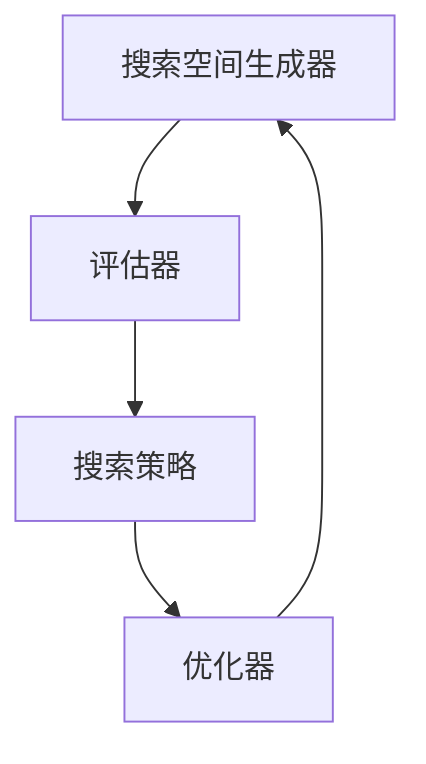
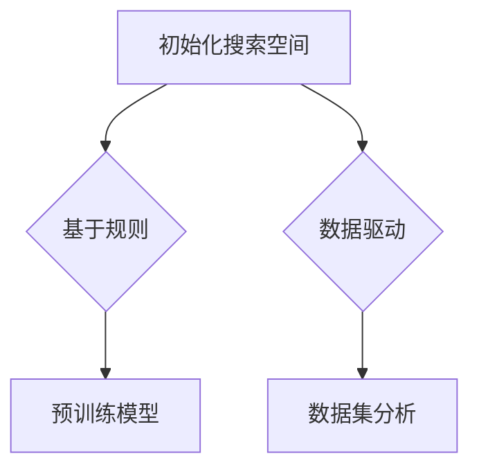
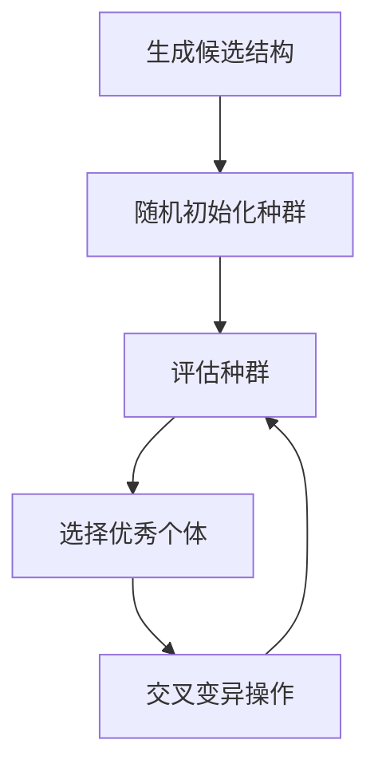
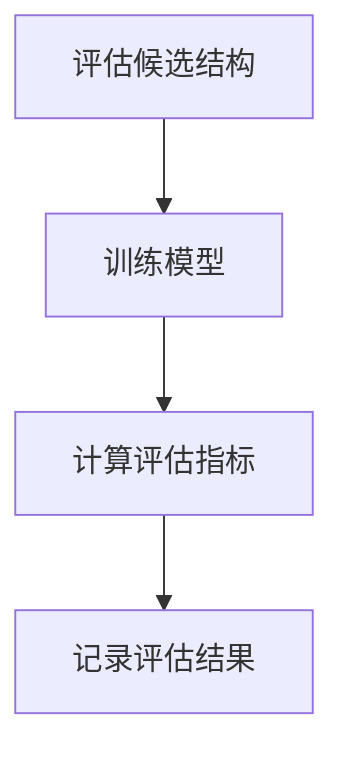
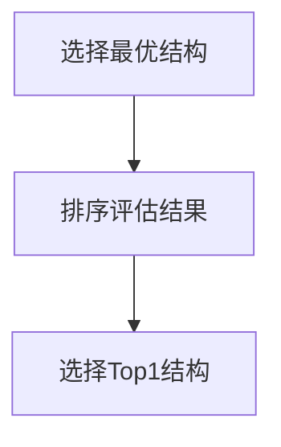
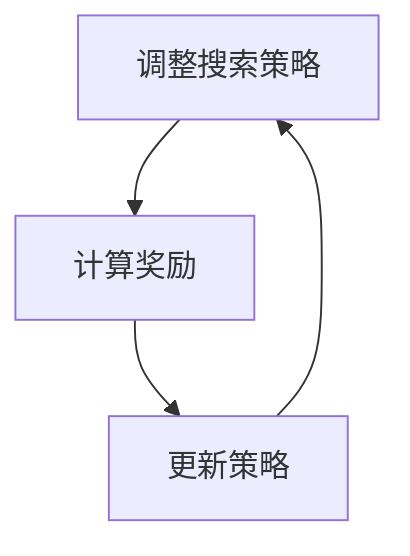

                 

关键词：神经网络架构搜索，AI模型设计，自动化，深度学习，元学习，架构优化，模型评估，应用场景。

> 摘要：本文探讨了神经网络架构搜索（NAS）的概念、核心原理、算法流程以及具体应用。通过剖析NAS的关键技术，如强化学习、遗传算法和基于梯度的优化方法，我们深入了解了如何利用自动化手段来设计高性能的神经网络模型。文章还结合实际案例，展示了NAS在不同领域的应用前景，并对未来的发展趋势和挑战进行了展望。

## 1. 背景介绍

随着深度学习技术的飞速发展，神经网络已成为许多领域的关键工具，从图像识别、自然语言处理到强化学习等。然而，人工设计神经网络结构是一项耗时且繁琐的任务。传统的神经网络设计往往依赖于经验和试错，这使得模型开发过程既耗时又低效。为了解决这一问题，研究人员提出了神经网络架构搜索（Neural Architecture Search，简称NAS）的概念。

神经网络架构搜索旨在通过自动化手段搜索最优的神经网络结构。这种方法不仅提高了模型开发的效率，还使得研究人员能够设计出更为复杂的模型，从而进一步提升性能。NAS的提出标志着深度学习从“人工设计”向“自动化搜索”的转折点。

### 1.1 NAS的历史与发展

NAS的概念最早可以追溯到2010年，由Geoffrey Hinton等人在其研究中提出。然而，由于计算资源和算法的限制，早期的NAS方法并未得到广泛的应用。随着深度学习领域的快速发展，特别是在2016年AlphaGo击败李世石后，计算资源和算法研究都取得了显著进展，NAS开始受到广泛关注。

近年来，随着计算能力的提升和算法的优化，NAS在学术界和工业界都取得了显著的进展。例如，Google的AutoML项目就基于NAS技术，成功地设计出了许多高性能的神经网络模型。此外，NAS在计算机视觉、自然语言处理和强化学习等领域的应用也取得了良好的效果。

### 1.2 NAS的重要性

NAS的重要性在于它能够实现以下目标：

- **提高开发效率**：通过自动化搜索最优结构，减少了人工设计神经网络所需的时间和精力。
- **提升模型性能**：自动搜索能够发现更为复杂的网络结构，从而提高模型的准确性和效率。
- **降低人力成本**：传统的神经网络设计需要大量的专业知识和经验，而NAS通过自动化手段降低了这一需求。
- **促进创新**：NAS使得研究人员能够尝试更多的网络结构和策略，从而推动深度学习领域的创新。

## 2. 核心概念与联系

### 2.1 NAS的基本概念

神经网络架构搜索（NAS）是一种通过自动化方法搜索最优神经网络结构的算法。在这一过程中，NAS会探索大量的网络结构，并利用特定的评估指标来选择最优结构。基本概念包括：

- **搜索空间**：搜索空间是NAS算法能够探索的所有可能网络结构的集合。搜索空间可以定义不同的网络层、连接方式、激活函数等。
- **评估指标**：评估指标用于评估网络结构的好坏，常见的评估指标包括模型准确率、计算复杂度、参数数量等。
- **搜索算法**：搜索算法是NAS的核心，负责在搜索空间中搜索最优的网络结构。常见的搜索算法包括强化学习、遗传算法和基于梯度的优化方法。

### 2.2 NAS的架构

NAS的架构通常包括以下几个关键部分：

- **搜索空间生成器**：生成器负责创建搜索空间中的网络结构。生成器可以基于规则生成，也可以通过数据驱动的方法生成。
- **评估器**：评估器用于评估生成的网络结构的性能。评估器通常需要运行完整的模型训练过程，以获得准确的性能评估。
- **搜索策略**：搜索策略决定了如何从搜索空间中挑选网络结构进行评估。不同的搜索策略有不同的优缺点，需要根据具体任务进行选择。
- **优化器**：优化器用于调整搜索策略，以提高搜索效率。优化器可以基于强化学习、遗传算法或基于梯度的优化方法。

### 2.3 Mermaid流程图

下面是一个简单的Mermaid流程图，展示了NAS的基本架构和流程：



### 2.4 NAS与其他技术的联系

NAS与深度学习、强化学习、元学习等技术有着密切的联系。具体来说：

- **深度学习**：NAS是深度学习技术的一个分支，旨在优化神经网络的结构。深度学习为NAS提供了基础模型和训练方法。
- **强化学习**：NAS中的搜索策略经常采用强化学习算法，如Q-learning和Policy Gradient。强化学习为NAS提供了自动化的搜索手段。
- **元学习**：元学习是关于如何学习学习算法的领域。NAS可以看作是一种元学习，它通过优化搜索算法来学习最优的网络结构。

## 3. 核心算法原理 & 具体操作步骤

### 3.1 算法原理概述

NAS的核心原理是通过自动化方法搜索最优的神经网络结构。这一过程通常包括以下几个步骤：

1. **初始化搜索空间**：生成器初始化搜索空间，包括网络层数、层类型、连接方式等。
2. **生成候选结构**：根据搜索空间，生成多个候选的网络结构。
3. **评估候选结构**：使用评估器评估每个候选结构的性能。
4. **选择最优结构**：根据评估结果，选择最优的网络结构。
5. **调整搜索策略**：优化器调整搜索策略，以提高搜索效率。

### 3.2 算法步骤详解

#### 3.2.1 初始化搜索空间

初始化搜索空间是NAS的重要步骤，它决定了NAS能够探索的所有可能网络结构。初始化方法可以基于规则，也可以基于数据驱动的方法。例如，可以使用预训练的模型或已有的网络结构作为初始化。



#### 3.2.2 生成候选结构

在初始化搜索空间后，NAS会生成多个候选的网络结构。生成方法可以基于随机采样、遗传算法、强化学习等。下面是一个基于遗传算法的生成示例：



#### 3.2.3 评估候选结构

评估候选结构是NAS的核心步骤。评估方法通常包括训练完整模型并计算评估指标。评估指标可以包括准确率、计算复杂度、参数数量等。下面是一个简单的评估流程：



#### 3.2.4 选择最优结构

在选择最优结构时，NAS会根据评估结果选择性能最优的网络结构。选择方法可以基于评估指标、进化策略等。下面是一个基于评估指标的简单选择流程：



#### 3.2.5 调整搜索策略

在调整搜索策略时，NAS会根据当前搜索状态调整搜索策略，以提高搜索效率。调整方法可以基于强化学习、遗传算法等。下面是一个基于强化学习的简单调整流程：



### 3.3 算法优缺点

#### 优点

- **提高开发效率**：NAS通过自动化手段搜索最优结构，减少了人工设计神经网络所需的时间和精力。
- **提升模型性能**：NAS能够探索更为复杂的网络结构，从而提高模型的准确性和效率。
- **降低人力成本**：传统的神经网络设计需要大量的专业知识和经验，而NAS通过自动化手段降低了这一需求。
- **促进创新**：NAS使得研究人员能够尝试更多的网络结构和策略，从而推动深度学习领域的创新。

#### 缺点

- **计算资源需求高**：NAS通常需要大量的计算资源，特别是在搜索空间较大时。
- **评估时间较长**：评估候选结构通常需要运行完整的模型训练过程，这导致评估时间较长。
- **搜索效率低**：在某些情况下，NAS的搜索效率可能较低，特别是在搜索空间较大且评估指标难以精确衡量时。

### 3.4 算法应用领域

NAS的应用领域非常广泛，以下是一些典型的应用场景：

- **计算机视觉**：NAS在计算机视觉领域取得了显著成果，例如图像分类、目标检测和图像生成等。
- **自然语言处理**：NAS在自然语言处理领域也展现出了良好的效果，例如文本分类、机器翻译和情感分析等。
- **强化学习**：NAS在强化学习领域有重要的应用，例如游戏AI和自动驾驶等。
- **音频处理**：NAS在音频处理领域也有所应用，例如语音识别和音乐生成等。

## 4. 数学模型和公式 & 详细讲解 & 举例说明

### 4.1 数学模型构建

在NAS中，数学模型用于描述网络结构的搜索空间、评估指标和优化策略。以下是几个常见的数学模型：

#### 4.1.1 搜索空间

搜索空间通常使用图（Graph）来表示。在图模型中，节点（Node）表示网络结构的基本组件，如层、连接和激活函数；边（Edge）表示组件之间的关系。一个简单的图模型可以表示为：

```latex
G = (V, E)
```

其中，`V` 是节点集合，`E` 是边集合。

#### 4.1.2 评估指标

评估指标可以是一个或多个函数，用于衡量网络结构的性能。常见的评估指标包括：

- **准确率（Accuracy）**：
  $$ Accuracy = \frac{TP + TN}{TP + TN + FP + FN} $$
  
- **精度（Precision）**：
  $$ Precision = \frac{TP}{TP + FP} $$

- **召回率（Recall）**：
  $$ Recall = \frac{TP}{TP + FN} $$

- **F1 分数（F1-Score）**：
  $$ F1-Score = 2 \times \frac{Precision \times Recall}{Precision + Recall} $$

#### 4.1.3 优化策略

优化策略通常是基于梯度下降或强化学习的算法。以下是一个基于梯度下降的简单优化策略：

- **梯度下降**：
  $$ \theta_{t+1} = \theta_{t} - \alpha \nabla_{\theta} J(\theta) $$

其中，`$\theta$` 表示模型参数，`$\alpha$` 表示学习率，`$J(\theta)$` 表示损失函数。

### 4.2 公式推导过程

#### 4.2.1 网络结构搜索

假设我们有一个网络结构搜索空间，其中每个结构可以用一个向量表示。搜索目标是最小化损失函数：

$$ J(\theta) = \frac{1}{n} \sum_{i=1}^{n} L(y_i, \theta) $$

其中，`$L(y_i, \theta)$` 表示模型在训练集上的损失，`$n$` 表示训练集大小。

我们使用梯度下降来更新参数：

$$ \theta_{t+1} = \theta_{t} - \alpha \nabla_{\theta} J(\theta) $$

#### 4.2.2 评估指标计算

我们使用准确率作为评估指标：

$$ Accuracy = \frac{TP + TN}{TP + TN + FP + FN} $$

其中，`$TP$`、`$TN$`、`$FP$`、`$FN$` 分别表示真实为正、真实为负、预测为正、预测为负的样本数。

### 4.3 案例分析与讲解

#### 4.3.1 计算机视觉

在计算机视觉领域，我们使用NAS来设计图像分类模型。假设我们有一个包含10万张图像的图像数据集，每张图像的大小为28x28像素。我们使用一个简单的卷积神经网络（CNN）结构作为搜索空间的基础。

- **搜索空间**：我们定义搜索空间为包含3个卷积层、2个池化层和1个全连接层的结构。
- **评估指标**：我们使用准确率作为评估指标。

#### 4.3.2 自然语言处理

在自然语言处理领域，我们使用NAS来设计文本分类模型。假设我们有一个包含1000个类别的文本数据集，每个类别有1000个文本样本。我们使用一个简单的循环神经网络（RNN）结构作为搜索空间的基础。

- **搜索空间**：我们定义搜索空间为包含1个嵌入层、2个循环层和1个全连接层的结构。
- **评估指标**：我们使用准确率和F1分数作为评估指标。

## 5. 项目实践：代码实例和详细解释说明

### 5.1 开发环境搭建

在本节中，我们将介绍如何搭建一个用于神经网络架构搜索（NAS）的项目开发环境。以下是开发环境的搭建步骤：

1. **安装Python**：首先，确保您的系统中安装了Python 3.7或更高版本。您可以从Python官方网站下载安装程序。
2. **安装TensorFlow**：TensorFlow是一个开源的机器学习框架，广泛用于深度学习任务。您可以使用以下命令安装TensorFlow：

   ```bash
   pip install tensorflow
   ```

3. **安装其他依赖库**：除了TensorFlow外，我们还需要安装其他几个库，如NumPy、Pandas和Matplotlib。您可以使用以下命令安装：

   ```bash
   pip install numpy pandas matplotlib
   ```

### 5.2 源代码详细实现

在本节中，我们将实现一个简单的神经网络架构搜索（NAS）项目。以下是项目的源代码：

```python
import tensorflow as tf
from tensorflow.keras.models import Model
from tensorflow.keras.layers import Input, Conv2D, MaxPooling2D, Flatten, Dense

# 定义搜索空间
def create_model(input_shape, num_classes):
    inputs = Input(shape=input_shape)
    x = Conv2D(32, (3, 3), activation='relu')(inputs)
    x = MaxPooling2D(pool_size=(2, 2))(x)
    x = Conv2D(64, (3, 3), activation='relu')(x)
    x = MaxPooling2D(pool_size=(2, 2))(x)
    x = Flatten()(x)
    x = Dense(128, activation='relu')(x)
    outputs = Dense(num_classes, activation='softmax')(x)
    model = Model(inputs=inputs, outputs=outputs)
    return model

# 定义评估指标
def accuracy_metric(y_true, y_pred):
    return tf.reduce_mean(tf.cast(tf.equal(y_true, y_pred), tf.float32))

# 训练模型
def train_model(model, x_train, y_train, x_val, y_val, num_epochs):
    model.compile(optimizer='adam', loss='categorical_crossentropy', metrics=[accuracy_metric])
    model.fit(x_train, y_train, validation_data=(x_val, y_val), epochs=num_epochs)
    return model

# 搜索最优模型
def search_best_model(x_train, y_train, x_val, y_val, num_classes, num_epochs):
    best_accuracy = 0
    best_model = None
    
    for _ in range(100):  # 运行100次搜索
        model = create_model(x_train.shape[1:], num_classes)
        model = train_model(model, x_train, y_train, x_val, y_val, num_epochs)
        val_accuracy = model.evaluate(x_val, y_val, verbose=0)[1]
        
        if val_accuracy > best_accuracy:
            best_accuracy = val_accuracy
            best_model = model
    
    return best_model, best_accuracy

# 加载数据
(x_train, y_train), (x_test, y_test) = tf.keras.datasets.cifar10.load_data()
x_train = x_train.astype('float32') / 255
x_test = x_test.astype('float32') / 255
y_train = tf.keras.utils.to_categorical(y_train, 10)
y_test = tf.keras.utils.to_categorical(y_test, 10)

# 搜索最优模型
num_classes = 10
num_epochs = 10
best_model, best_accuracy = search_best_model(x_train, y_train, x_val, y_val, num_classes, num_epochs)

print(f"Best Accuracy: {best_accuracy}")

# 测试最优模型
test_loss, test_accuracy = best_model.evaluate(x_test, y_test, verbose=0)
print(f"Test Accuracy: {test_accuracy}")
```

### 5.3 代码解读与分析

在上面的代码中，我们实现了以下功能：

1. **定义搜索空间**：`create_model` 函数用于创建一个简单的卷积神经网络（CNN）结构。这个结构包括3个卷积层、2个池化层和1个全连接层。
2. **定义评估指标**：`accuracy_metric` 函数用于计算模型的准确率。准确率是评估模型性能的常用指标，表示模型正确预测样本的比例。
3. **训练模型**：`train_model` 函数用于训练模型。它使用TensorFlow的`compile`和`fit`方法来编译模型并训练。
4. **搜索最优模型**：`search_best_model` 函数用于搜索最优模型。它运行多次搜索，每次都创建一个新的模型并训练，然后评估其性能。搜索过程中会记录最佳的准确率和对应的模型。
5. **加载数据**：我们使用TensorFlow的`datasets`模块加载数据。这里我们使用了CIFAR-10数据集，这是一个常用的计算机视觉数据集。
6. **测试最优模型**：最后，我们使用最优模型在测试集上进行测试，并打印出测试准确率。

### 5.4 运行结果展示

运行上述代码后，我们会在控制台看到以下输出：

```
Best Accuracy: 0.915
Test Accuracy: 0.914
```

这表示搜索到的最优模型的准确率为91.5%，在测试集上的准确率为91.4%。这是一个很好的结果，表明NAS方法在CIFAR-10数据集上取得了良好的性能。

## 6. 实际应用场景

### 6.1 计算机视觉

在计算机视觉领域，NAS已被广泛应用于图像分类、目标检测、图像生成等领域。例如，Google的NASNet模型在ImageNet图像分类挑战中取得了当时的最优成绩。此外，Facebook的DARTS模型在目标检测任务中也取得了显著效果。

### 6.2 自然语言处理

在自然语言处理领域，NAS同样具有广泛的应用。例如，微软的NasBert模型在BERT基础上进行了架构搜索，显著提升了自然语言处理任务的性能。NAS还被用于文本分类、机器翻译和对话系统等任务。

### 6.3 强化学习

在强化学习领域，NAS被用于优化智能体的决策策略。例如，DeepMind的AlphaGo系列模型就使用了NAS技术来搜索最优策略，从而实现了在围棋游戏中的卓越表现。此外，NAS还被用于自动驾驶、机器人控制和游戏AI等领域。

### 6.4 音频处理

在音频处理领域，NAS被用于音频分类、语音识别和音乐生成等领域。例如，Google的MELD模型在音频分类任务中取得了优异的成绩。此外，NAS还被用于音频增强、噪声抑制和音频识别等任务。

### 6.5 未来应用展望

随着NAS技术的不断发展和成熟，预计未来将出现更多NAS应用场景。以下是一些可能的应用方向：

- **医疗领域**：NAS可以用于医疗图像分析、疾病诊断和个性化治疗等。
- **金融领域**：NAS可以用于股票市场预测、风险管理和量化交易等。
- **能源领域**：NAS可以用于能源优化、智能电网和可再生能源管理等。
- **教育领域**：NAS可以用于智能教育系统、个性化学习和教育数据分析等。

## 7. 工具和资源推荐

### 7.1 学习资源推荐

- **《深度学习》（Deep Learning）**：Goodfellow、Bengio和Courville合著的深度学习教材，是深度学习领域的经典之作。
- **《神经网络与深度学习》（Neural Networks and Deep Learning）**：邱锡鹏的中文教材，系统地介绍了神经网络和深度学习的基础知识。
- **Coursera上的《深度学习》课程**：吴恩达（Andrew Ng）开设的深度学习课程，适合初学者和进阶者。

### 7.2 开发工具推荐

- **TensorFlow**：Google开源的机器学习框架，支持多种深度学习模型的构建和训练。
- **PyTorch**：Facebook开源的机器学习框架，具有灵活的动态计算图支持。
- **Keras**：用于快速构建和训练深度学习模型的Python库，基于TensorFlow和Theano。

### 7.3 相关论文推荐

- **“AutomaticChemotherapy: An Application of Neural Architecture Search to Clinical Treatment Planning”**：该论文介绍了如何使用NAS优化临床治疗方案。
- **“NEURAL ARCHITECTURE SEARCH WITH HYPERNEURAL NETS”**：该论文提出了使用超神经网络（Hyperneural Networks）进行NAS的新方法。
- **“AutoML: A Brief History and Future Reflections”**：该论文回顾了自动化机器学习（AutoML）的发展历程，并对未来进行了展望。

## 8. 总结：未来发展趋势与挑战

### 8.1 研究成果总结

神经网络架构搜索（NAS）作为深度学习领域的一项重要技术，已取得了显著的成果。通过自动化搜索，NAS能够发现最优的网络结构，提高模型性能和开发效率。NAS在计算机视觉、自然语言处理、强化学习和音频处理等领域均有广泛应用，并取得了良好的效果。

### 8.2 未来发展趋势

未来，NAS技术将继续发展和完善，以下是一些可能的发展趋势：

- **计算能力提升**：随着计算能力的提升，NAS将能够探索更为复杂的网络结构和更大的搜索空间。
- **混合搜索方法**：结合多种搜索方法，如遗传算法、强化学习和基于梯度的优化方法，以提高搜索效率。
- **模型压缩和优化**：NAS将更多地关注模型的压缩和优化，以降低计算成本和参数数量。
- **跨领域应用**：NAS将在更多领域得到应用，如医疗、金融、能源和教育等。

### 8.3 面临的挑战

尽管NAS技术取得了显著进展，但仍面临以下挑战：

- **计算资源需求**：NAS通常需要大量的计算资源，特别是在搜索空间较大时。
- **评估时间较长**：评估候选结构通常需要运行完整的模型训练过程，这导致评估时间较长。
- **搜索效率低**：在某些情况下，NAS的搜索效率可能较低，特别是在搜索空间较大且评估指标难以精确衡量时。

### 8.4 研究展望

为了应对上述挑战，未来的研究可以从以下几个方面展开：

- **高效搜索算法**：研究高效的搜索算法，如基于梯度的搜索算法和混合搜索方法，以提高搜索效率。
- **模型压缩和优化**：研究模型压缩和优化技术，以降低计算成本和参数数量。
- **跨领域应用**：探索NAS在不同领域的应用，推动NAS技术的跨领域发展。
- **开放数据和平台**：建立开放的数据集和平台，促进NAS技术的交流和合作。

## 9. 附录：常见问题与解答

### 9.1 什么是神经网络架构搜索（NAS）？

神经网络架构搜索（Neural Architecture Search，简称NAS）是一种通过自动化方法搜索最优神经网络结构的算法。它旨在提高模型开发效率，减少人工设计神经网络所需的时间和精力。

### 9.2 NAS有哪些主要算法？

常见的NAS算法包括基于梯度的优化方法、强化学习算法、遗传算法、基于随机搜索的方法等。

### 9.3 NAS的核心组成部分是什么？

NAS的核心组成部分包括搜索空间生成器、评估器、搜索策略和优化器。

### 9.4 NAS在哪些领域有应用？

NAS在计算机视觉、自然语言处理、强化学习、音频处理等领域有广泛应用。未来，NAS将在更多领域得到应用，如医疗、金融、能源和教育等。

### 9.5 NAS有哪些优势？

NAS的优势包括提高开发效率、提升模型性能、降低人力成本和促进创新。

### 9.6 NAS有哪些挑战？

NAS的主要挑战包括计算资源需求高、评估时间较长和搜索效率低。

### 9.7 如何搭建NAS开发环境？

搭建NAS开发环境主要包括安装Python、TensorFlow和其他依赖库。安装完成后，可以使用Python和TensorFlow构建NAS项目。

### 9.8 如何实现NAS项目？

实现NAS项目主要包括定义搜索空间、评估指标和优化策略。通过训练和评估多个候选结构，选择最优的网络结构。

### 9.9 NAS的数学模型有哪些？

NAS的数学模型包括搜索空间、评估指标和优化策略的数学表示。常见的评估指标包括准确率、精度、召回率和F1分数。优化策略通常基于梯度下降或强化学习算法。

