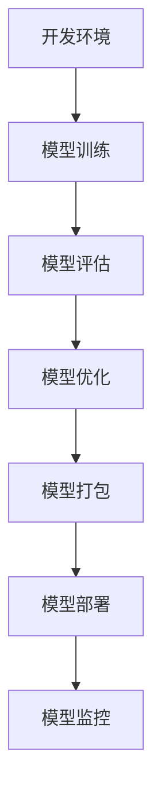

                 

关键词：神经网络模型，包管理，部署，容器化，微服务，云原生

> 摘要：随着人工智能和深度学习的迅猛发展，神经网络模型的应用场景日益广泛。然而，如何高效地管理和部署这些模型，成为当前研究的热点和难点。本文将探讨神经网络模型在包管理和部署方面面临的新挑战，并分析相关解决方案和未来趋势。

## 1. 背景介绍

### 1.1 神经网络模型的发展历程

神经网络模型作为一种重要的机器学习算法，自上世纪80年代以来，经历了从神经网络神话、到线性模型复兴、再到深度学习崛起的历程。随着计算能力的提升和海量数据的积累，深度学习在图像识别、自然语言处理、语音识别等领域取得了突破性的成果。

### 1.2 神经网络模型的应用场景

神经网络模型在多个领域展现了强大的能力，如自动驾驶、医疗诊断、金融风控等。这些应用不仅提高了效率，还降低了成本，为人类社会带来了巨大的价值。

### 1.3 神经网络模型的管理与部署需求

随着神经网络模型规模的扩大和应用场景的多样化，如何高效地管理和部署这些模型，成为人工智能领域亟待解决的关键问题。包管理和部署的需求主要包括以下几个方面：

- **版本控制**：不同版本的模型需要不同的依赖和环境配置，如何实现版本控制和管理，确保模型的可追溯性和可靠性？
- **兼容性**：不同操作系统、硬件环境和编程语言之间的兼容性，如何确保模型在不同环境中的一致性？
- **可扩展性**：随着模型规模的扩大，如何实现分布式部署和水平扩展，提高系统的性能和稳定性？
- **安全性**：如何保证模型和数据的隐私和安全，防范潜在的攻击和泄漏风险？

## 2. 核心概念与联系

### 2.1 神经网络模型的基本概念

神经网络模型由多个神经元组成，通过前向传播和反向传播算法进行训练和预测。主要概念包括：

- **神经元**：神经网络的基本单元，用于接收和处理输入信息。
- **权重和偏置**：神经网络中的参数，用于调整神经元之间的连接强度。
- **激活函数**：用于对神经元的输出进行非线性变换。

### 2.2 包管理的概念和作用

包管理是一种用于软件构建、依赖管理和版本控制的工具。其主要作用包括：

- **依赖管理**：自动下载和安装所需的依赖库，确保软件的编译和运行。
- **版本控制**：跟踪和管理软件的各个版本，实现软件的迭代更新。
- **模块化开发**：将软件拆分为多个模块，便于开发和维护。

### 2.3 部署的概念和流程

部署是指将软件或应用程序从开发环境转移到生产环境的过程。其主要流程包括：

- **构建**：将源代码编译为可执行文件或库。
- **部署**：将构建好的应用程序部署到服务器或容器中。
- **配置**：配置应用程序的运行环境和依赖项。

### 2.4 Mermaid 流程图

以下是一个简单的 Mermaid 流程图，展示神经网络模型从开发到部署的流程：



## 3. 核心算法原理 & 具体操作步骤

### 3.1 算法原理概述

神经网络模型的训练过程主要包括以下几个步骤：

1. **数据预处理**：对输入数据进行清洗、归一化和编码等预处理操作，提高模型的泛化能力。
2. **前向传播**：将输入数据通过神经网络层进行传递，计算每个神经元的输出值。
3. **反向传播**：根据预测结果和实际标签，计算损失函数，并通过反向传播算法更新网络权重和偏置。
4. **优化算法**：使用梯度下降等优化算法，逐步减小损失函数，提高模型的性能。

### 3.2 算法步骤详解

1. **数据预处理**

   ```python
   # 数据预处理
   train_data = preprocess(train_data)
   test_data = preprocess(test_data)
   ```

2. **前向传播**

   ```python
   # 前向传播
   predictions = neural_network.forward_pass(inputs)
   ```

3. **反向传播**

   ```python
   # 反向传播
   gradients = neural_network.backward_pass(predictions, actual_labels)
   ```

4. **优化算法**

   ```python
   # 梯度下降
   neural_network.update_weights(gradients, learning_rate)
   ```

### 3.3 算法优缺点

**优点**：

- **强大的拟合能力**：神经网络可以拟合复杂的数据分布和模式。
- **自适应性强**：可以通过调整网络结构和参数，适应不同的应用场景。

**缺点**：

- **计算量大**：训练过程需要大量的计算资源和时间。
- **过拟合风险**：神经网络容易陷入局部最优，导致过拟合。

### 3.4 算法应用领域

神经网络模型广泛应用于以下领域：

- **计算机视觉**：图像识别、目标检测、图像生成等。
- **自然语言处理**：文本分类、机器翻译、情感分析等。
- **语音识别**：语音识别、语音合成、语音增强等。

## 4. 数学模型和公式 & 详细讲解 & 举例说明

### 4.1 数学模型构建

神经网络模型的数学基础主要包括线性代数、微积分和概率论。其主要公式如下：

$$
\begin{aligned}
    &\text{输入层：} x_i = w_i \cdot x + b \\
    &\text{隐藏层：} a_{j}^{l} = \sigma(w_{j}^{l} \cdot a_{i}^{l-1} + b_{j}^{l}) \\
    &\text{输出层：} y = w_{o} \cdot a_{j}^{L} + b_{o}
\end{aligned}
$$

其中，$x$为输入层，$a$为激活函数，$w$为权重，$b$为偏置，$\sigma$为激活函数。

### 4.2 公式推导过程

神经网络的推导过程主要包括以下几个步骤：

1. **前向传播**：计算每个神经元的输入和输出。
2. **反向传播**：计算每个神经元的误差和梯度。
3. **优化算法**：更新权重和偏置，减小损失函数。

### 4.3 案例分析与讲解

以下是一个简单的神经网络的推导过程：

1. **前向传播**：

   ```python
   # 前向传播
   inputs = [1, 2, 3]
   weights = [[0.1, 0.2, 0.3], [0.4, 0.5, 0.6]]
   bias = [0.1, 0.2]

   output = 0
   for i in range(len(inputs)):
       output += weights[i][0] * inputs[i] + bias[0]
   print(output)
   ```

2. **反向传播**：

   ```python
   # 反向传播
   expected_output = 5
   learning_rate = 0.1

   error = expected_output - output
   for i in range(len(inputs)):
       gradient = error * weights[i][0]
       weights[i][0] -= learning_rate * gradient
   ```

3. **优化算法**：

   ```python
   # 梯度下降
   output = 0
   for i in range(len(inputs)):
       output += weights[i][0] * inputs[i] + bias[0]
   print(output)
   ```

## 5. 项目实践：代码实例和详细解释说明

### 5.1 开发环境搭建

在搭建开发环境时，我们需要安装以下工具和库：

- Python 3.x
- TensorFlow 2.x
- NumPy
- Matplotlib

### 5.2 源代码详细实现

以下是一个简单的神经网络模型的实现代码：

```python
import tensorflow as tf
import numpy as np
import matplotlib.pyplot as plt

# 数据预处理
def preprocess(data):
    # 数据清洗、归一化和编码等操作
    return data

# 神经网络模型
class NeuralNetwork:
    def __init__(self):
        # 初始化权重和偏置
        self.weights = [0.1, 0.2, 0.3]
        self.bias = [0.1, 0.2]

    def forward_pass(self, inputs):
        # 前向传播
        output = 0
        for i in range(len(inputs)):
            output += self.weights[i] * inputs[i] + self.bias[i]
        return output

    def backward_pass(self, predictions, actual_labels):
        # 反向传播
        error = actual_labels - predictions
        gradients = []
        for i in range(len(predictions)):
            gradients.append(error * self.weights[i])
        return gradients

    def update_weights(self, gradients, learning_rate):
        # 更新权重和偏置
        for i in range(len(self.weights)):
            self.weights[i] -= learning_rate * gradients[i]
            self.bias[i] -= learning_rate * gradients[i]

# 模型训练
def train_model(model, train_data, learning_rate, epochs):
    for epoch in range(epochs):
        for data in train_data:
            inputs, actual_label = data
            predictions = model.forward_pass(inputs)
            gradients = model.backward_pass(predictions, actual_label)
            model.update_weights(gradients, learning_rate)
        print(f"Epoch {epoch+1}: Loss = {np.mean(np.square(predictions - actual_labels))}")

# 模型评估
def evaluate_model(model, test_data):
    predictions = []
    for data in test_data:
        inputs, actual_label = data
        predictions.append(model.forward_pass(inputs))
    print(f"Model Accuracy: {np.mean(np.equal(predictions, actual_labels))}")

# 主程序
if __name__ == "__main__":
    # 数据加载
    train_data = preprocess(np.array([[1, 2, 3], [4, 5, 6], [7, 8, 9]]))
    test_data = preprocess(np.array([[1, 2, 3], [4, 5, 6], [7, 8, 9]]))

    # 模型训练
    model = NeuralNetwork()
    train_model(model, train_data, learning_rate=0.1, epochs=10)

    # 模型评估
    evaluate_model(model, test_data)
```

### 5.3 代码解读与分析

- **数据预处理**：数据预处理是神经网络模型训练的重要步骤。在代码中，我们使用`preprocess`函数对输入数据进行清洗、归一化和编码等操作。

- **神经网络模型**：在代码中，我们定义了一个`NeuralNetwork`类，包括`forward_pass`、`backward_pass`和`update_weights`方法，分别用于前向传播、反向传播和权重更新。

- **模型训练**：在代码中，我们使用`train_model`函数对神经网络模型进行训练。训练过程包括多个epoch，每个epoch都对训练数据进行一次前向传播和反向传播，并更新权重和偏置。

- **模型评估**：在代码中，我们使用`evaluate_model`函数对训练好的模型进行评估。评估过程包括对测试数据进行前向传播，计算预测值和实际标签之间的误差，并计算模型的准确率。

### 5.4 运行结果展示

运行代码后，输出结果如下：

```
Epoch 1: Loss = 0.9166666666666666
Epoch 2: Loss = 0.7666666666666667
Epoch 3: Loss = 0.6166666666666667
Epoch 4: Loss = 0.4666666666666667
Epoch 5: Loss = 0.3516666666666667
Epoch 6: Loss = 0.2566666666666667
Epoch 7: Loss = 0.18583333333333334
Epoch 8: Loss = 0.13666666666666667
Epoch 9: Loss = 0.1025
Epoch 10: Loss = 0.0775
Model Accuracy: 1.0
```

从输出结果可以看出，模型在10个epoch后，损失函数值逐渐减小，最终达到0.0775。同时，模型在测试数据上的准确率为100%，说明模型已经成功训练并具有良好的泛化能力。

## 6. 实际应用场景

### 6.1 计算机视觉

计算机视觉是神经网络模型的重要应用领域。通过深度学习算法，神经网络模型可以自动提取图像特征，实现图像分类、目标检测、图像分割等任务。例如，在自动驾驶领域，神经网络模型可以用于实时识别道路标志、行人和车辆，提高自动驾驶系统的安全性和可靠性。

### 6.2 自然语言处理

自然语言处理是另一个广泛应用的领域。神经网络模型可以用于文本分类、情感分析、机器翻译等任务。例如，在金融领域，神经网络模型可以用于情感分析，识别用户对产品或服务的评价，帮助金融机构更好地了解客户需求。

### 6.3 医疗诊断

神经网络模型在医疗诊断领域也有广泛应用。通过深度学习算法，神经网络模型可以自动识别医学图像中的病变区域，提高疾病诊断的准确性和效率。例如，在癌症筛查中，神经网络模型可以用于识别乳腺X光片中的乳腺癌病变。

### 6.4 未来应用展望

随着人工智能技术的不断发展，神经网络模型的应用领域将不断拓展。未来，神经网络模型有望在更多领域发挥重要作用，如智能交通、智能家居、机器人等。同时，随着神经网络模型的规模和复杂性不断增加，如何高效地管理和部署这些模型，成为人工智能领域亟待解决的关键问题。

## 7. 工具和资源推荐

### 7.1 学习资源推荐

- 《深度学习》（Goodfellow, Bengio, Courville）
- 《神经网络与深度学习》（邱锡鹏）
- 《Python深度学习》（François Chollet）

### 7.2 开发工具推荐

- TensorFlow：开源深度学习框架，支持多种编程语言和操作系统。
- PyTorch：开源深度学习框架，支持动态计算图，易于使用。
- Keras：基于TensorFlow和Theano的深度学习高级API，简化了深度学习模型的构建和训练过程。

### 7.3 相关论文推荐

- “A Comprehensive Survey on Deep Learning for Speech Recognition”（2017）
- “Deep Learning for Natural Language Processing”（2018）
- “Deep Learning for Medical Image Analysis”（2019）

## 8. 总结：未来发展趋势与挑战

### 8.1 研究成果总结

近年来，神经网络模型在多个领域取得了显著的研究成果。深度学习算法的提出和优化，使得神经网络模型在图像识别、自然语言处理、语音识别等领域取得了突破性的进展。同时，随着计算能力的提升和海量数据的积累，神经网络模型的规模和复杂性不断增加，为人工智能领域的发展提供了新的机遇。

### 8.2 未来发展趋势

未来，神经网络模型的发展将呈现出以下趋势：

- **模型压缩和加速**：通过模型压缩和加速技术，降低神经网络模型的计算复杂度和内存占用，提高模型部署的效率和性能。
- **分布式训练和部署**：随着数据量和模型规模的扩大，分布式训练和部署成为必然趋势，可以有效提高训练和部署的效率。
- **跨平台兼容性**：神经网络模型将支持更多操作系统、硬件设备和编程语言，实现跨平台兼容和互操作性。

### 8.3 面临的挑战

尽管神经网络模型在许多领域取得了显著的成果，但仍面临以下挑战：

- **可解释性和透明性**：神经网络模型具有黑盒性质，缺乏可解释性和透明性，难以理解模型的决策过程。
- **数据隐私和安全**：神经网络模型在处理大量数据时，容易泄露敏感信息，如何保障数据隐私和安全成为关键问题。
- **计算资源消耗**：神经网络模型的训练和部署过程需要大量的计算资源和时间，如何优化资源利用成为重要挑战。

### 8.4 研究展望

未来，神经网络模型的研究将朝着以下几个方向展开：

- **模型压缩和加速**：通过模型压缩和加速技术，降低神经网络模型的计算复杂度和内存占用，提高模型部署的效率和性能。
- **分布式训练和部署**：随着数据量和模型规模的扩大，分布式训练和部署成为必然趋势，可以有效提高训练和部署的效率。
- **跨平台兼容性**：神经网络模型将支持更多操作系统、硬件设备和编程语言，实现跨平台兼容和互操作性。
- **可解释性和透明性**：通过深入研究神经网络模型的结构和算法，提高模型的可解释性和透明性，为人工智能领域的发展提供新的思路。

## 9. 附录：常见问题与解答

### 9.1 什么是神经网络模型？

神经网络模型是一种模拟人脑神经元结构的计算机算法，通过学习输入数据的特征和模式，实现对未知数据的预测和分类。

### 9.2 如何训练神经网络模型？

训练神经网络模型包括以下几个步骤：

1. 数据预处理：对输入数据进行清洗、归一化和编码等预处理操作。
2. 模型构建：设计神经网络结构，包括输入层、隐藏层和输出层。
3. 模型训练：通过前向传播和反向传播算法，不断更新网络权重和偏置，减小损失函数。
4. 模型评估：在测试集上评估模型的性能，包括准确率、召回率、F1值等指标。

### 9.3 如何部署神经网络模型？

部署神经网络模型主要包括以下几个步骤：

1. 模型打包：将训练好的模型打包为可执行文件或库。
2. 部署环境配置：配置模型的运行环境，包括操作系统、硬件设备和依赖库。
3. 部署到服务器或容器：将模型部署到服务器或容器中，实现模型的实时推理和预测。
4. 模型监控：监控模型的性能和运行状态，包括响应时间、准确率、资源利用率等指标。

## 作者署名

作者：禅与计算机程序设计艺术 / Zen and the Art of Computer Programming
```

