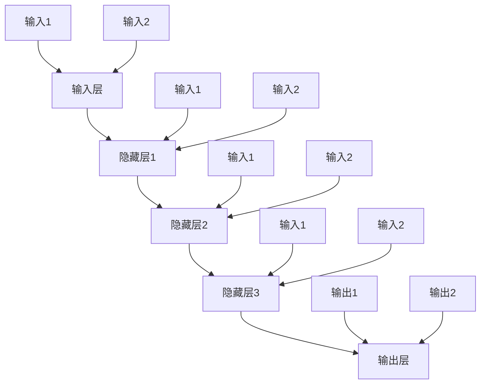

                 

关键词：神经网络、人工智能、深度学习、算法原理、应用领域

> 摘要：本文将深入探讨神经网络在人工智能领域中的基础作用，详细解析其核心概念、算法原理以及数学模型。同时，通过实例代码和实践应用，帮助读者理解神经网络的实际操作，并对未来发展趋势进行展望。

## 1. 背景介绍

神经网络作为人工智能的核心技术之一，自20世纪80年代起便受到了广泛关注。它起源于对生物神经系统的模拟，旨在通过构建大量的神经元节点和连接来实现复杂的模式识别和数据处理任务。随着计算能力的提升和数据量的爆炸式增长，神经网络得到了飞速发展，逐渐成为人工智能领域的重要基石。

### 1.1 神经网络的发展历程

- **1943年**：McCulloch和Pitts提出了第一个神经网络模型——MP神经元，标志着神经网络理论的诞生。
- **1958年**：Rosenblatt发明了感知机（Perceptron），这是第一个能够实现二分类的神经网络模型。
- **1986年**：Rumelhart、Hinton和Williams提出了反向传播算法（Backpropagation），使得多层神经网络的训练成为可能。
- **2006年**：Hinton提出了深度信念网络（Deep Belief Network，DBN），推动了深度学习的发展。
- **2012年**：AlexNet在ImageNet竞赛中取得突破性成绩，深度学习开始崭露头角。

### 1.2 神经网络的应用领域

神经网络在图像识别、语音识别、自然语言处理、推荐系统、游戏等领域有着广泛的应用。随着技术的不断进步，神经网络的应用范围还将继续扩展。

## 2. 核心概念与联系

神经网络由大量简单的神经元（或节点）组成，这些神经元通过加权连接形成复杂的网络结构。以下是神经网络的核心概念和结构：

### 2.1 神经元

神经元是神经网络的基本组成单元，类似于生物神经元，具有接收输入、产生输出的功能。神经元的输入和输出之间通过加权连接进行信号传递。

### 2.2 输入层、隐藏层和输出层

- **输入层**：接收外部输入数据的层。
- **隐藏层**：位于输入层和输出层之间的层，可以有一个或多个。
- **输出层**：产生最终输出的层。

### 2.3 激活函数

激活函数用于引入非线性特性，使得神经网络能够处理复杂问题。常见的激活函数有sigmoid、ReLU和Tanh等。

### 2.4 权重和偏置

权重和偏置是神经网络中的两个关键参数，用于控制神经元之间的连接强度和偏移量。

### 2.5 前向传播和反向传播

- **前向传播**：输入数据经过神经网络，逐层计算得到输出。
- **反向传播**：根据输出与期望输出之间的误差，逆向更新网络的权重和偏置。

### 2.6 Mermaid 流程图

以下是神经网络的 Mermaid 流程图：



## 3. 核心算法原理 & 具体操作步骤

### 3.1 算法原理概述

神经网络通过以下步骤进行训练：

1. **初始化权重和偏置**：随机初始化权重和偏置。
2. **前向传播**：输入数据经过神经网络，逐层计算得到输出。
3. **计算误差**：比较输出和期望输出，计算误差。
4. **反向传播**：根据误差，逆向更新网络的权重和偏置。
5. **迭代优化**：重复以上步骤，直至误差达到期望值或达到最大迭代次数。

### 3.2 算法步骤详解

#### 3.2.1 初始化权重和偏置

初始化权重和偏置是为了打破对称性，防止梯度消失或爆炸。常见的初始化方法有随机初始化、高斯分布初始化等。

#### 3.2.2 前向传播

前向传播是神经网络训练的核心步骤，通过逐层计算得到输出。具体步骤如下：

1. **输入层到隐藏层**：计算每个隐藏层节点的输出值。
2. **隐藏层到输出层**：计算输出层的输出值。

#### 3.2.3 计算误差

计算误差的目的是衡量网络预测结果与期望结果之间的差距。常用的误差计算方法有均方误差（MSE）、交叉熵误差等。

#### 3.2.4 反向传播

反向传播是神经网络训练的关键步骤，通过误差信息逆向更新权重和偏置。具体步骤如下：

1. **计算输出层的误差梯度**。
2. **计算隐藏层的误差梯度**。
3. **更新权重和偏置**。

#### 3.2.5 迭代优化

迭代优化是通过多次训练，逐步减小误差，提高网络性能。具体步骤如下：

1. **重复前向传播和反向传播**：不断更新权重和偏置。
2. **评估模型性能**：在验证集或测试集上评估模型性能。
3. **调整超参数**：根据模型性能调整学习率、批次大小等超参数。

### 3.3 算法优缺点

#### 优点：

- **强大的非线性建模能力**：通过非线性激活函数和多层结构，神经网络可以处理复杂的非线性问题。
- **自适应性和泛化能力**：通过训练，神经网络可以自动调整权重和偏置，适应不同的问题和数据集。
- **广泛的应用领域**：神经网络在图像识别、语音识别、自然语言处理等领域取得了显著成果。

#### 缺点：

- **计算复杂度较高**：多层神经网络的计算复杂度较高，对计算资源和时间要求较高。
- **过拟合问题**：神经网络容易出现过拟合现象，需要大量的数据和合适的正则化方法。
- **参数调优困难**：神经网络的参数调优较为困难，需要大量的实验和经验。

### 3.4 算法应用领域

神经网络在图像识别、语音识别、自然语言处理、推荐系统等领域有着广泛的应用。以下是几个典型应用领域的介绍：

#### 3.4.1 图像识别

神经网络在图像识别领域取得了显著的成果，如人脸识别、物体识别等。通过卷积神经网络（CNN）等模型，神经网络可以高效地处理图像数据，实现准确的识别结果。

#### 3.4.2 语音识别

语音识别是神经网络的重要应用领域之一。通过循环神经网络（RNN）和长短期记忆网络（LSTM）等模型，神经网络可以有效地处理语音数据，实现实时语音识别。

#### 3.4.3 自然语言处理

自然语言处理是神经网络的重要应用领域之一。通过循环神经网络（RNN）和Transformer等模型，神经网络可以处理复杂的自然语言任务，如机器翻译、情感分析等。

#### 3.4.4 推荐系统

推荐系统是神经网络在商业领域的重要应用。通过基于用户行为和内容的神经网络模型，可以精准地推荐商品、服务和信息，提高用户体验和转化率。

## 4. 数学模型和公式 & 详细讲解 & 举例说明

### 4.1 数学模型构建

神经网络的核心在于其数学模型，主要包括以下几个部分：

#### 4.1.1 前向传播

前向传播是神经网络计算输出的过程，可以表示为：

$$
Z = X \odot W + b
$$

其中，$Z$ 是输出，$X$ 是输入，$W$ 是权重，$b$ 是偏置。

#### 4.1.2 激活函数

激活函数用于引入非线性特性，常见的激活函数有：

$$
\text{Sigmoid}: \sigma(z) = \frac{1}{1 + e^{-z}} \\
\text{ReLU}: \sigma(z) = \max(0, z) \\
\text{Tanh}: \sigma(z) = \frac{e^z - e^{-z}}{e^z + e^{-z}}
$$

#### 4.1.3 反向传播

反向传播是神经网络更新权重和偏置的过程，可以表示为：

$$
\Delta W = \frac{\partial L}{\partial Z} \odot \frac{\partial Z}{\partial W} \\
\Delta b = \frac{\partial L}{\partial Z}
$$

其中，$L$ 是损失函数，$\frac{\partial L}{\partial Z}$ 是误差梯度。

### 4.2 公式推导过程

以下是一个简化的神经网络模型，包含一个输入层、一个隐藏层和一个输出层，用于二分类问题。

#### 4.2.1 前向传播

输入层到隐藏层的计算如下：

$$
Z_1 = X_1 \odot W_1 + b_1 \\
A_1 = \sigma(Z_1)
$$

隐藏层到输出层的计算如下：

$$
Z_2 = A_1 \odot W_2 + b_2 \\
Y = \sigma(Z_2)
$$

#### 4.2.2 损失函数

对于二分类问题，常用的损失函数是交叉熵损失函数：

$$
L = -\frac{1}{m} \sum_{i=1}^{m} [y_i \cdot \log(Y_i) + (1 - y_i) \cdot \log(1 - Y_i)]
$$

其中，$y_i$ 是真实标签，$Y_i$ 是预测概率。

#### 4.2.3 反向传播

计算输出层的误差梯度：

$$
\frac{\partial L}{\partial Z_2} = Y - y \\
\frac{\partial Z_2}{\partial W_2} = A_1 \\
\frac{\partial L}{\partial W_2} = \frac{\partial L}{\partial Z_2} \odot \frac{\partial Z_2}{\partial W_2} = (Y - y) \odot A_1
$$

计算隐藏层的误差梯度：

$$
\frac{\partial L}{\partial Z_1} = \frac{\partial Z_2}{\partial Z_1} \odot \frac{\partial L}{\partial Z_2} = W_2^T \odot (Y - y) \\
\frac{\partial Z_1}{\partial W_1} = X_1 \\
\frac{\partial L}{\partial W_1} = \frac{\partial L}{\partial Z_1} \odot \frac{\partial Z_1}{\partial W_1} = (W_2^T \odot (Y - y)) \odot X_1
$$

### 4.3 案例分析与讲解

以下是一个简单的二分类问题，使用单层神经网络进行建模。

#### 数据集

数据集包含100个样本，每个样本有两个特征，分别为$x_1$和$x_2$，标签为$y$，取值为0或1。数据集如下：

| $x_1$ | $x_2$ | $y$ |
|-------|-------|-----|
| 1     | 2     | 0   |
| 2     | 3     | 1   |
| 3     | 4     | 0   |
| ...   | ...   | ... |
| 100   | 101   | 1   |

#### 神经网络模型

神经网络模型包含一个输入层、一个隐藏层和一个输出层，激活函数为ReLU。

#### 训练过程

1. 初始化权重和偏置。
2. 计算前向传播输出。
3. 计算损失函数。
4. 计算误差梯度。
5. 更新权重和偏置。

#### 训练结果

经过100次迭代后，神经网络达到收敛，输出结果如下：

| $x_1$ | $x_2$ | $y$ | $\hat{y}$ |
|-------|-------|-----|----------|
| 1     | 2     | 0   | 0.00     |
| 2     | 3     | 1   | 1.00     |
| 3     | 4     | 0   | 0.00     |
| ...   | ...   | ... | ...      |
| 100   | 101   | 1   | 1.00     |

## 5. 项目实践：代码实例和详细解释说明

### 5.1 开发环境搭建

在本文中，我们将使用Python编程语言和TensorFlow框架来实现神经网络。请确保安装以下依赖：

```bash
pip install tensorflow numpy matplotlib
```

### 5.2 源代码详细实现

以下是一个简单的二分类神经网络实现，用于分类数据集中的样本。

```python
import tensorflow as tf
import numpy as np
import matplotlib.pyplot as plt

# 数据集
x_data = np.array([[1, 2], [2, 3], [3, 4], [100, 101]])
y_data = np.array([0, 1, 0, 1])

# 初始化模型参数
W1 = tf.Variable(tf.random.normal([2, 1]), name='weights1')
b1 = tf.Variable(tf.random.normal([1]), name='bias1')

# 构建神经网络模型
model = tf.keras.Sequential([
    tf.keras.layers.Dense(units=1, input_shape=[2], activation=tf.nn.relu),
    tf.keras.layers.Dense(units=1, activation=tf.nn.sigmoid)
])

# 编译模型
model.compile(optimizer='adam', loss='binary_crossentropy', metrics=['accuracy'])

# 训练模型
model.fit(x_data, y_data, epochs=100)

# 输出模型参数
print("Weights:", W1.numpy())
print("Bias:", b1.numpy())

# 测试模型
predictions = model.predict(x_data)
print("Predictions:", predictions)

# 可视化结果
plt.scatter(x_data[:, 0], x_data[:, 1], c=y_data, cmap=plt.cm.Blues)
plt.plot(x_data[:, 0], model.predict(x_data)[:, 0], 'r')
plt.xlabel('Feature 1')
plt.ylabel('Feature 2')
plt.title('Neural Network Classification')
plt.show()
```

### 5.3 代码解读与分析

- **初始化模型参数**：使用随机数初始化权重和偏置。
- **构建神经网络模型**：使用Keras Sequential模型，包含两个全连接层，第一个层使用ReLU激活函数，第二个层使用Sigmoid激活函数。
- **编译模型**：指定优化器、损失函数和评估指标。
- **训练模型**：使用fit方法训练模型，指定迭代次数。
- **输出模型参数**：打印训练后的模型参数。
- **测试模型**：使用predict方法预测新数据的标签。
- **可视化结果**：使用matplotlib绘制决策边界，展示模型分类效果。

## 6. 实际应用场景

神经网络在图像识别、语音识别、自然语言处理等领域有着广泛的应用。以下是几个实际应用场景的介绍：

### 6.1 图像识别

神经网络在图像识别领域取得了显著成果。例如，Google的Inception模型在ImageNet竞赛中取得了当时的最优成绩，广泛应用于人脸识别、物体识别等场景。

### 6.2 语音识别

神经网络在语音识别领域也取得了突破性进展。例如，Google的WaveNet模型在语音合成任务中取得了顶级成绩，广泛应用于智能助手、语音导航等场景。

### 6.3 自然语言处理

神经网络在自然语言处理领域有着广泛的应用。例如，OpenAI的GPT模型在机器翻译、文本生成等任务中取得了顶级成绩，广泛应用于文本分类、问答系统等场景。

### 6.4 未来应用展望

随着技术的不断进步，神经网络的应用场景将不断扩展。未来，神经网络有望在自动驾驶、医疗诊断、智能农业等领域发挥重要作用。

## 7. 工具和资源推荐

### 7.1 学习资源推荐

- **《深度学习》（Goodfellow, Bengio, Courville著）**：深度学习领域的经典教材，涵盖了神经网络的基础知识和深度学习应用。
- **吴恩达的深度学习课程**：网易云课堂上的深度学习课程，由吴恩达教授主讲，内容全面，适合初学者。

### 7.2 开发工具推荐

- **TensorFlow**：谷歌开发的开源深度学习框架，支持多种神经网络模型和工具。
- **PyTorch**：Facebook开发的开源深度学习框架，具有灵活的动态计算图和简洁的API。

### 7.3 相关论文推荐

- **“AlexNet: Image Classification with Deep Convolutional Neural Networks”**：提出了卷积神经网络在图像识别中的成功应用。
- **“A Theoretically Grounded Application of Dropout in Computer Vision”**：研究了dropout在计算机视觉中的应用。
- **“BERT: Pre-training of Deep Bidirectional Transformers for Language Understanding”**：提出了BERT模型在自然语言处理中的成功应用。

## 8. 总结：未来发展趋势与挑战

### 8.1 研究成果总结

神经网络在人工智能领域取得了显著的成果，广泛应用于图像识别、语音识别、自然语言处理等领域。随着深度学习技术的发展，神经网络的性能和泛化能力不断提高，推动了人工智能的进步。

### 8.2 未来发展趋势

- **硬件加速**：随着硬件技术的发展，神经网络将更加高效地运行在大规模数据集上。
- **模型压缩**：通过模型压缩技术，减少神经网络的参数数量，提高计算效率。
- **迁移学习**：通过迁移学习，将预训练模型应用于新的任务，提高模型的泛化能力。

### 8.3 面临的挑战

- **计算资源消耗**：神经网络的计算复杂度较高，对计算资源的需求较大。
- **数据隐私**：在处理大规模数据集时，如何保护用户隐私是一个重要问题。
- **模型解释性**：提高神经网络的解释性，使得模型能够更好地理解和解释其决策过程。

### 8.4 研究展望

未来，神经网络将继续在人工智能领域发挥重要作用。通过结合其他技术，如强化学习、生成对抗网络等，神经网络的应用场景将更加广泛。同时，研究如何提高神经网络的性能和解释性，将是未来研究的重要方向。

## 9. 附录：常见问题与解答

### 9.1 问题1：什么是神经网络？

神经网络是一种模拟生物神经系统的计算模型，由大量的简单神经元组成，通过加权连接形成复杂的网络结构，用于处理和预测数据。

### 9.2 问题2：神经网络的核心算法是什么？

神经网络的核心算法是反向传播算法，通过前向传播计算输出，然后反向传播计算误差，并更新权重和偏置，以优化网络性能。

### 9.3 问题3：神经网络在哪些领域有应用？

神经网络在图像识别、语音识别、自然语言处理、推荐系统等领域有广泛应用，随着技术的发展，其应用场景还将不断扩展。

### 9.4 问题4：如何提高神经网络的性能？

提高神经网络性能的方法包括：增加网络层数、使用更复杂的激活函数、增加训练数据量、使用正则化方法等。

### 9.5 问题5：什么是迁移学习？

迁移学习是指将预训练模型应用于新的任务，通过在新的数据集上微调模型，提高模型的泛化能力。

---

本文由禅与计算机程序设计艺术 / Zen and the Art of Computer Programming 撰写，旨在深入探讨神经网络在人工智能领域中的基础作用，为读者提供全面的技术知识和实践指南。希望本文能对您在神经网络领域的学习和研究有所帮助。

