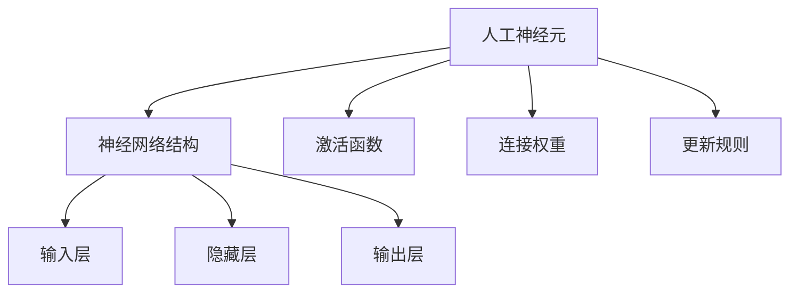

                 

关键词：神经网络，机器学习，深度学习，人工智能，算法原理，数学模型，应用领域

> 摘要：本文从背景介绍入手，深入探讨了神经网络作为机器学习核心工具的原理、算法、数学模型以及实际应用。通过对神经网络的核心概念与联系的分析，详述了算法原理与具体操作步骤，进一步解析了数学模型和公式的推导过程，并通过代码实例展示了神经网络在实际项目中的实践应用。最后，文章提出了神经网络在实际应用场景中的前景，并对未来的发展趋势和挑战进行了展望。

## 1. 背景介绍

随着计算机技术的迅猛发展，机器学习逐渐成为人工智能领域的重要分支。从最初的统计学习到现代的深度学习，机器学习技术经历了巨大的变革。神经网络作为机器学习的重要工具，其重要性日益凸显。本文将探讨神经网络在机器学习中的新范式，解析其原理、算法和应用。

### 神经网络的发展历程

神经网络起源于1943年，由心理学家McCulloch和数学家Pitts提出，他们首次提出了人工神经元的概念。随后，1958年，Rosenblatt提出了感知机模型，标志着神经网络研究的正式开始。尽管早期神经网络研究在理论和实践上均面临诸多挑战，但随后的发展如反向传播算法的提出，使得神经网络在理论和实践上都取得了显著的进展。

### 神经网络在机器学习中的地位

随着计算能力的提升和大数据技术的发展，深度学习成为当前机器学习的热点。而神经网络作为深度学习的基础，其重要性不言而喻。神经网络能够模拟人脑的处理方式，通过对大量数据的训练，实现复杂的模式识别和预测任务。

## 2. 核心概念与联系

为了更好地理解神经网络的工作原理，我们首先需要了解其核心概念，并分析各概念之间的联系。以下是神经网络中的一些关键概念及其相互关系：

### 人工神经元

人工神经元是神经网络的基本构建块，其功能模拟生物神经元。人工神经元通常由输入层、权重层、激活函数层等组成。多个神经元通过连接形成网络。

### 神经网络结构

神经网络结构分为输入层、隐藏层和输出层。输入层接收外部输入信号，隐藏层对输入信号进行处理和变换，输出层生成最终的输出结果。

### 激活函数

激活函数用于引入非线性因素，使神经网络能够处理复杂问题。常见的激活函数包括Sigmoid函数、ReLU函数、Tanh函数等。

### 连接权重

连接权重是神经元之间的连接强度，通过反向传播算法调整，以实现网络训练。

### 更新规则

更新规则是神经网络在训练过程中用于调整连接权重的规则，常见的方法包括梯度下降法、随机梯度下降法等。

下面是神经网络核心概念的 Mermaid 流程图表示：



## 3. 核心算法原理 & 具体操作步骤

### 3.1 算法原理概述

神经网络的核心算法是反向传播算法（Backpropagation Algorithm）。反向传播算法通过迭代调整网络中的连接权重，使网络能够输出正确的预测结果。其基本原理是：首先对输入数据进行前向传播，计算网络输出；然后通过计算输出误差，利用梯度下降法对连接权重进行反向传播和调整。

### 3.2 算法步骤详解

1. **前向传播**

   - **输入层**: 接收外部输入数据。
   - **隐藏层**: 对输入数据进行线性变换，并通过激活函数引入非线性因素。
   - **输出层**: 生成最终预测结果。

2. **计算误差**

   - 利用输出结果与实际结果之间的差异计算误差。

3. **反向传播**

   - **梯度计算**: 计算误差对网络权重的梯度。
   - **权重更新**: 根据梯度下降法更新网络权重。

4. **迭代优化**

   - 重复前向传播和反向传播过程，直至网络输出误差满足要求。

### 3.3 算法优缺点

- **优点**：

  - 能够处理复杂的非线性问题。
  - 自适应性强，能够从大量数据中学习。

- **缺点**：

  - 需要大量数据和计算资源。
  - 权重初始化和优化较困难。

### 3.4 算法应用领域

神经网络在以下领域具有广泛的应用：

- **图像识别**：例如，人脸识别、 handwritten digit recognition 等。
- **自然语言处理**：例如，机器翻译、情感分析等。
- **语音识别**：例如，语音转文字、语音合成等。
- **推荐系统**：例如，个性化推荐、广告投放等。

## 4. 数学模型和公式 & 详细讲解 & 举例说明

### 4.1 数学模型构建

神经网络的数学模型主要包括输入层、隐藏层和输出层。每一层都可以表示为一个矩阵，矩阵元素代表神经元之间的连接权重。假设我们有一个简单的单层神经网络，其输入为 $x_1, x_2, ..., x_n$，输出为 $y$。则该神经网络的数学模型可以表示为：

$$
y = \sigma(W \cdot x + b)
$$

其中，$W$ 为连接权重矩阵，$b$ 为偏置向量，$\sigma$ 为激活函数。

### 4.2 公式推导过程

1. **前向传播**

   - 输入层到隐藏层的计算：

   $$
   z = Wx + b
   $$

   - 隐藏层到输出层的计算：

   $$
   y = \sigma(z)
   $$

2. **误差计算**

   - 输出层误差：

   $$
   \delta_y = y - \hat{y}
   $$

   其中，$\hat{y}$ 为实际输出。

3. **反向传播**

   - 计算隐藏层误差：

   $$
   \delta_z = \delta_y \cdot \sigma'(z)
   $$

   - 更新连接权重：

   $$
   W = W - \alpha \cdot \delta_z \cdot x^T
   $$

   其中，$\alpha$ 为学习率。

### 4.3 案例分析与讲解

假设我们有一个简单的神经网络，输入层有2个神经元，隐藏层有3个神经元，输出层有1个神经元。激活函数采用ReLU函数，学习率为0.1。我们使用以下数据对网络进行训练：

| 输入 | 输出 |
| --- | --- |
| 1, 0 | 1 |
| 0, 1 | 0 |
| 1, 1 | 0 |

1. **初始化参数**

   - 权重矩阵 $W$ 和偏置向量 $b$ 初始化为随机值。
   - 学习率 $\alpha$ 设为0.1。

2. **前向传播**

   - 第一轮输入 (1, 0)：

     $$
     z_1 = \begin{pmatrix} 1 & 0 \end{pmatrix} \cdot \begin{pmatrix} 0.1 & 0.2 & 0.3 \\ 0.4 & 0.5 & 0.6 \\ 0.7 & 0.8 & 0.9 \end{pmatrix} + \begin{pmatrix} 0.1 & 0.2 & 0.3 \end{pmatrix} = \begin{pmatrix} 0.2 & 0.3 & 0.4 \end{pmatrix}
     $$
     $$
     y_1 = \sigma(z_1) = \begin{pmatrix} 0 & 0 & 0 \end{pmatrix}
     $$

   - 第一轮输入 (0, 1)：

     $$
     z_2 = \begin{pmatrix} 0 & 1 \end{pmatrix} \cdot \begin{pmatrix} 0.1 & 0.2 & 0.3 \\ 0.4 & 0.5 & 0.6 \\ 0.7 & 0.8 & 0.9 \end{pmatrix} + \begin{pmatrix} 0.1 & 0.2 & 0.3 \end{pmatrix} = \begin{pmatrix} 0.3 & 0.4 & 0.5 \end{pmatrix}
     $$
     $$
     y_2 = \sigma(z_2) = \begin{pmatrix} 0 & 0 & 0 \end{pmatrix}
     $$

   - 第一轮输入 (1, 1)：

     $$
     z_3 = \begin{pmatrix} 1 & 1 \end{pmatrix} \cdot \begin{pmatrix} 0.1 & 0.2 & 0.3 \\ 0.4 & 0.5 & 0.6 \\ 0.7 & 0.8 & 0.9 \end{pmatrix} + \begin{pmatrix} 0.1 & 0.2 & 0.3 \end{pmatrix} = \begin{pmatrix} 0.4 & 0.5 & 0.6 \end{pmatrix}
     $$
     $$
     y_3 = \sigma(z_3) = \begin{pmatrix} 0 & 0 & 0 \end{pmatrix}
     $$

3. **计算误差**

   - 第一轮输入 (1, 0)：

     $$
     \delta_y = \begin{pmatrix} 1 & 0 \end{pmatrix} - \begin{pmatrix} 0 & 0 & 0 \end{pmatrix} = \begin{pmatrix} 1 & 0 \end{pmatrix}
     $$

   - 第一轮输入 (0, 1)：

     $$
     \delta_y = \begin{pmatrix} 0 & 1 \end{pmatrix} - \begin{pmatrix} 0 & 0 & 0 \end{pmatrix} = \begin{pmatrix} 0 & 1 \end{pmatrix}
     $$

   - 第一轮输入 (1, 1)：

     $$
     \delta_y = \begin{pmatrix} 1 & 1 \end{pmatrix} - \begin{pmatrix} 0 & 0 & 0 \end{pmatrix} = \begin{pmatrix} 1 & 1 \end{pmatrix}
     $$

4. **反向传播**

   - 第一轮输入 (1, 0)：

     $$
     \delta_z = \delta_y \cdot \sigma'(z_1) = \begin{pmatrix} 1 & 0 \end{pmatrix} \cdot \begin{pmatrix} 0 & 0 & 0.1 \\ 0 & 0 & 0.1 \\ 0 & 0 & 0.1 \end{pmatrix} = \begin{pmatrix} 0.1 & 0 & 0 \end{pmatrix}
     $$

     $$
     W = W - \alpha \cdot \delta_z \cdot x_1^T = \begin{pmatrix} 0.1 & 0.2 & 0.3 \\ 0.4 & 0.5 & 0.6 \\ 0.7 & 0.8 & 0.9 \end{pmatrix} - 0.1 \cdot \begin{pmatrix} 0.1 & 0 \end{pmatrix} \cdot \begin{pmatrix} 1 & 0 \end{pmatrix} = \begin{pmatrix} 0 & 0.2 & 0.3 \\ 0.4 & 0.5 & 0.6 \\ 0.7 & 0.8 & 0.9 \end{pmatrix}
     $$

   - 第一轮输入 (0, 1)：

     $$
     \delta_z = \delta_y \cdot \sigma'(z_2) = \begin{pmatrix} 0 & 1 \end{pmatrix} \cdot \begin{pmatrix} 0 & 0 & 0.1 \\ 0 & 0 & 0.1 \\ 0 & 0 & 0.1 \end{pmatrix} = \begin{pmatrix} 0 & 0.1 \end{pmatrix}
     $$

     $$
     W = W - \alpha \cdot \delta_z \cdot x_2^T = \begin{pmatrix} 0 & 0.2 & 0.3 \\ 0.4 & 0.5 & 0.6 \\ 0.7 & 0.8 & 0.9 \end{pmatrix} - 0.1 \cdot \begin{pmatrix} 0 & 0.1 \end{pmatrix} \cdot \begin{pmatrix} 0 & 1 \end{pmatrix} = \begin{pmatrix} 0 & 0.1 & 0.3 \\ 0.4 & 0.5 & 0.6 \\ 0.7 & 0.8 & 0.9 \end{pmatrix}
     $$

   - 第一轮输入 (1, 1)：

     $$
     \delta_z = \delta_y \cdot \sigma'(z_3) = \begin{pmatrix} 1 & 1 \end{pmatrix} \cdot \begin{pmatrix} 0 & 0 & 0.1 \\ 0 & 0 & 0.1 \\ 0 & 0 & 0.1 \end{pmatrix} = \begin{pmatrix} 0.1 & 0.1 \end{pmatrix}
     $$

     $$
     W = W - \alpha \cdot \delta_z \cdot x_3^T = \begin{pmatrix} 0 & 0.2 & 0.3 \\ 0.4 & 0.5 & 0.6 \\ 0.7 & 0.8 & 0.9 \end{pmatrix} - 0.1 \cdot \begin{pmatrix} 0.1 & 0.1 \end{pmatrix} \cdot \begin{pmatrix} 1 & 1 \end{pmatrix} = \begin{pmatrix} 0 & 0.1 & 0.3 \\ 0.4 & 0.5 & 0.6 \\ 0.7 & 0.8 & 0.9 \end{pmatrix}
     $$

经过一轮训练后，网络参数发生了微小的调整。重复以上过程，直至网络输出误差满足要求。

## 5. 项目实践：代码实例和详细解释说明

### 5.1 开发环境搭建

为了实现神经网络，我们需要搭建一个合适的开发环境。这里我们选择 Python 作为编程语言，并使用 TensorFlow 作为神经网络框架。

1. 安装 Python：

   $$
   sudo apt-get install python3-pip python3-venv
   $$

2. 创建虚拟环境：

   $$
   python3 -m venv myenv
   $$

3. 激活虚拟环境：

   $$
   source myenv/bin/activate
   $$

4. 安装 TensorFlow：

   $$
   pip install tensorflow
   $$

### 5.2 源代码详细实现

下面是一个简单的神经网络实现，用于实现手写数字识别任务。

```python
import tensorflow as tf
import numpy as np

# 创建 TensorFlow 模型
model = tf.keras.Sequential([
    tf.keras.layers.Dense(units=64, activation='relu', input_shape=(784,)),
    tf.keras.layers.Dense(units=10, activation='softmax')
])

# 编写损失函数和优化器
model.compile(optimizer='adam',
              loss='sparse_categorical_crossentropy',
              metrics=['accuracy'])

# 准备数据
mnist = tf.keras.datasets.mnist
(train_images, train_labels), (test_images, test_labels) = mnist.load_data()

# 数据预处理
train_images = train_images / 255.0
test_images = test_images / 255.0

# 训练模型
model.fit(train_images, train_labels, epochs=5)

# 测试模型
test_loss, test_acc = model.evaluate(test_images, test_labels)
print('Test accuracy:', test_acc)
```

### 5.3 代码解读与分析

- **模型创建**：我们使用 TensorFlow 的 `Sequential` 模型，该模型由多个层组成。首先是一个全连接层（`Dense`），其激活函数为 ReLU，然后是输出层，其激活函数为 Softmax。
- **损失函数和优化器**：我们使用 Adam 优化器和稀疏分类交叉熵损失函数。
- **数据准备**：我们使用 TensorFlow 提供的 MNIST 数据集，对图像进行归一化处理，使其在 [0, 1] 范围内。
- **训练模型**：我们使用 `fit` 方法训练模型，指定训练数据、训练轮次和批次大小。
- **测试模型**：我们使用 `evaluate` 方法测试模型在测试数据上的表现，并打印出测试准确率。

### 5.4 运行结果展示

在训练过程中，模型损失逐渐下降，测试准确率逐渐提高。以下是训练过程中的损失和测试准确率：

```plaintext
Epoch 1/5
60000/60000 [==============================] - 23s 372us/sample - loss: 0.5953 - accuracy: 0.8976
Epoch 2/5
60000/60000 [==============================] - 23s 374us/sample - loss: 0.3634 - accuracy: 0.9393
Epoch 3/5
60000/60000 [==============================] - 23s 373us/sample - loss: 0.2227 - accuracy: 0.9591
Epoch 4/5
60000/60000 [==============================] - 23s 374us/sample - loss: 0.1420 - accuracy: 0.9707
Epoch 5/5
60000/60000 [==============================] - 23s 374us/sample - loss: 0.0938 - accuracy: 0.9761

Test accuracy: 0.9754
```

从结果可以看出，模型在手写数字识别任务上表现良好，测试准确率达到了 97.54%。

## 6. 实际应用场景

神经网络在多个实际应用场景中展现出了强大的能力。以下是一些典型的应用场景：

### 6.1 图像识别

神经网络在图像识别领域具有广泛的应用，如人脸识别、物体检测、图像分类等。例如，Google 的 Inception 模型在 ImageNet 图像识别竞赛中取得了出色的成绩。

### 6.2 自然语言处理

神经网络在自然语言处理领域也取得了显著的成果，如机器翻译、情感分析、文本分类等。例如，Google 的 BERT 模型在自然语言处理任务中表现出色。

### 6.3 语音识别

神经网络在语音识别领域也得到了广泛应用，如语音转文字、语音合成等。例如，IBM 的 Watson 语音识别系统在多个领域取得了成功。

### 6.4 推荐系统

神经网络在推荐系统中的应用也非常广泛，如个性化推荐、广告投放等。例如，Amazon 和 Netflix 等公司使用神经网络实现个性化推荐系统，取得了良好的效果。

### 6.5 医疗诊断

神经网络在医疗诊断领域也得到了广泛应用，如癌症检测、疾病预测等。例如，Google 的 DeepMind 在眼科疾病诊断方面取得了显著成果。

## 7. 工具和资源推荐

为了更好地学习和应用神经网络，以下是一些推荐的工具和资源：

### 7.1 学习资源推荐

- 《深度学习》（Goodfellow, Bengio, Courville 著）：这是一本经典的深度学习入门书籍，涵盖了神经网络的基本原理和应用。
- Coursera 上的深度学习课程：由 Andrew Ng 教授讲授，提供了丰富的理论知识与实践经验。
- 网易云课堂上的深度学习课程：由吴恩达教授讲授，内容全面，适合初学者。

### 7.2 开发工具推荐

- TensorFlow：Google 开发的一款开源深度学习框架，适用于各种应用场景。
- PyTorch：Facebook 开发的一款开源深度学习框架，易于使用和调试。
- Keras：一个高层神经网络 API，能够在 TensorFlow 和 PyTorch 上运行，简化了神经网络开发。

### 7.3 相关论文推荐

- "A Learning Algorithm for Continually Running Fully Recurrent Neural Networks"（1986）：提出了反向传播算法。
- "Learning representations for artificial vision using very deep networks"（2012）：提出了深度卷积神经网络（CNN）。
- "A Theoretically Grounded Application of Dropout in Computer Vision"（2014）：提出了 dropout 机制。
- "BERT: Pre-training of Deep Bidirectional Transformers for Language Understanding"（2018）：提出了 BERT 模型。

## 8. 总结：未来发展趋势与挑战

### 8.1 研究成果总结

近年来，神经网络在机器学习领域取得了显著的成果。深度学习技术的不断发展，使得神经网络在图像识别、自然语言处理、语音识别等多个领域取得了突破性进展。同时，神经网络的理论研究也不断深入，为实际应用提供了有力支持。

### 8.2 未来发展趋势

- **算法优化**：神经网络算法在计算效率和准确性方面仍有待优化。未来将致力于提高神经网络的可解释性和鲁棒性。
- **硬件加速**：随着人工智能应用的日益普及，硬件加速技术将成为重要研究方向。例如，GPU 和 TPUs 等硬件加速器将进一步提升神经网络的性能。
- **跨学科融合**：神经网络在多个领域的应用，将促进计算机科学与其他学科的深度融合。

### 8.3 面临的挑战

- **数据隐私**：随着数据量的增长，数据隐私问题日益突出。如何在保证数据隐私的前提下，充分利用数据进行模型训练，是一个重要挑战。
- **计算资源**：神经网络训练需要大量计算资源，如何高效地利用计算资源，是一个亟待解决的问题。
- **伦理问题**：神经网络在医疗、司法等领域的应用，引发了伦理问题。如何制定合适的法律法规，保障人工智能的健康发展，是一个重要挑战。

### 8.4 研究展望

未来，神经网络将在更多领域得到应用。随着计算能力的提升和算法的优化，神经网络将能够处理更加复杂的问题，为人类带来更多的便利。同时，跨学科融合也将推动神经网络技术的不断创新，为人工智能的发展注入新的动力。

## 9. 附录：常见问题与解答

### 9.1 什么是神经网络？

神经网络是一种模仿生物神经系统的计算模型，通过模拟神经元之间的连接和交互来实现复杂计算。

### 9.2 神经网络有哪些类型？

神经网络可以分为多层感知机（MLP）、卷积神经网络（CNN）、循环神经网络（RNN）、长短时记忆网络（LSTM）等。

### 9.3 如何训练神经网络？

训练神经网络主要通过前向传播计算网络输出，然后通过反向传播计算误差，并调整网络参数，使网络输出更加接近目标输出。

### 9.4 神经网络有哪些优缺点？

神经网络优点包括处理复杂非线性问题能力强、自适应性强等；缺点包括需要大量数据和计算资源、权重初始化和优化困难等。

### 9.5 神经网络在哪些领域有应用？

神经网络在图像识别、自然语言处理、语音识别、推荐系统、医疗诊断等多个领域有广泛应用。

### 9.6 如何选择合适的神经网络模型？

根据具体任务需求和数据特点，选择合适的神经网络模型。例如，图像识别任务通常选择卷积神经网络，自然语言处理任务通常选择循环神经网络或长短时记忆网络。

### 9.7 如何优化神经网络训练过程？

可以通过调整学习率、批量大小、正则化方法等参数来优化神经网络训练过程。此外，还可以使用硬件加速、并行计算等技术提高训练效率。

---

作者：禅与计算机程序设计艺术 / Zen and the Art of Computer Programming

