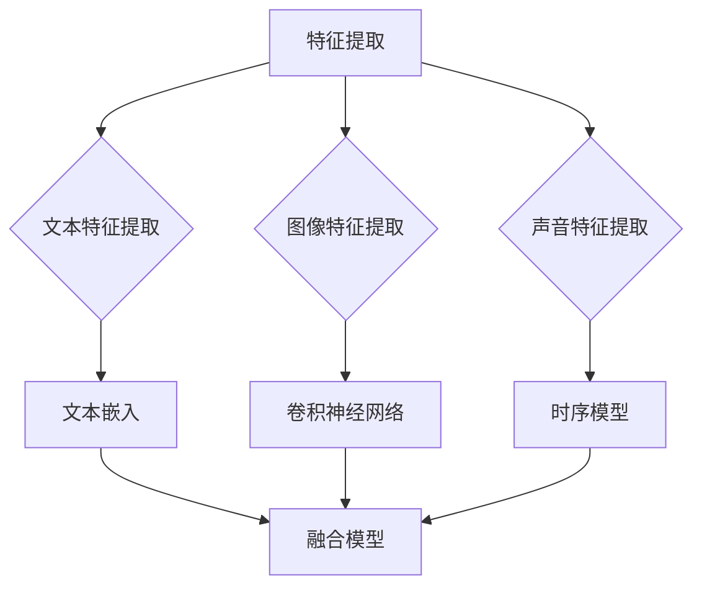

                 

关键词：科大讯飞、多模态融合算法、校招面试、人工智能、计算机视觉、自然语言处理

> 摘要：本文将深入探讨科大讯飞2024年校招面试中的多模态融合算法重点，从背景介绍、核心概念与联系、核心算法原理与具体操作步骤、数学模型与公式讲解、项目实践代码实例、实际应用场景及未来展望等方面，全面解析这一前沿技术领域，为广大求职者提供实用的面试准备指导。

## 1. 背景介绍

随着人工智能技术的快速发展，多模态融合算法成为了当前研究的热点之一。多模态融合是指将来自不同模态（如图像、文本、声音等）的数据进行集成，以提取更丰富的信息，从而提高人工智能系统的性能。科大讯飞作为我国人工智能领域的领军企业，其多模态融合算法的研究和应用在国内外具有广泛的影响力。

## 2. 核心概念与联系

### 2.1 多模态数据

多模态数据是指包含多个不同模态的信息，如图像、文本、声音等。这些数据可以从不同的来源获取，并且它们在描述同一个对象或事件时可能存在互补性。

### 2.2 融合策略

融合策略是指如何将多模态数据进行整合，以提取更准确的信息。常见的融合策略包括特征级融合、决策级融合和深度级融合。

### 2.3 Mermaid 流程图



## 3. 核心算法原理与具体操作步骤

### 3.1 算法原理概述

多模态融合算法的核心思想是利用多种模态之间的相关性，通过特定的模型将它们整合起来，以实现更高的性能。常见的多模态融合算法包括：

1. 特征级融合：将不同模态的特征向量进行拼接，然后输入到分类器中进行预测。
2. 决策级融合：在各个模态的分类结果基础上，通过投票或其他机制得出最终的分类结果。
3. 深度级融合：利用深度神经网络对多模态数据进行联合训练，从而自动学习它们之间的相关性。

### 3.2 算法步骤详解

1. 特征提取：对图像、文本、声音等不同模态的数据进行特征提取。
2. 特征融合：将提取到的特征进行拼接或融合。
3. 模型训练：利用融合后的特征进行模型训练。
4. 预测：将新的多模态数据进行融合后，输入到训练好的模型中进行预测。

### 3.3 算法优缺点

- 特点：
  - 提高模型性能：通过融合多个模态的数据，可以提高模型的准确性和鲁棒性。
  - 自动学习模态相关性：深度级融合算法可以自动学习不同模态之间的相关性，减少人工设计的复杂度。

- 缺点：
  - 计算复杂度：多模态融合算法通常需要更多的计算资源和时间。
  - 特征选择：特征选择不当可能导致融合效果不佳。

### 3.4 算法应用领域

多模态融合算法在许多领域都有广泛的应用，如：

- 人脸识别：通过融合图像和语音数据，可以提高识别的准确性和鲁棒性。
- 跨模态检索：通过融合图像和文本数据，可以实现更准确的跨模态检索。
- 聊天机器人：通过融合文本和语音数据，可以提升聊天机器人的交互体验。

## 4. 数学模型和公式

### 4.1 数学模型构建

多模态融合算法的数学模型通常包括特征提取、特征融合和分类器三个部分。

### 4.2 公式推导过程

- 特征提取：
  $$ f_i = f_i^1, f_i^2, ..., f_i^n $$
  其中，$f_i$ 表示第 $i$ 个模态的特征向量，$f_i^j$ 表示第 $i$ 个模态的第 $j$ 个特征。

- 特征融合：
  $$ F = [f_1, f_2, ..., f_m] $$
  其中，$F$ 表示融合后的特征矩阵，$f_i$ 表示第 $i$ 个模态的特征向量。

- 分类器：
  $$ y = g(W^TF + b) $$
  其中，$y$ 表示分类结果，$g$ 表示激活函数，$W$ 和 $b$ 分别表示模型的权重和偏置。

### 4.3 案例分析与讲解

假设我们有图像、文本和声音三个模态的数据，我们可以按照以下步骤进行多模态融合：

1. 特征提取：
   - 图像特征：使用卷积神经网络提取图像特征。
   - 文本特征：使用词向量模型提取文本特征。
   - 声音特征：使用长短期记忆网络提取声音特征。

2. 特征融合：
   - 将提取到的特征进行拼接，得到融合后的特征矩阵。

3. 模型训练：
   - 利用融合后的特征进行模型训练，选择合适的激活函数和优化算法。

4. 预测：
   - 将新的多模态数据进行融合后，输入到训练好的模型中进行预测。

## 5. 项目实践：代码实例和详细解释说明

### 5.1 开发环境搭建

- 硬件环境：至少需要 4 核心的 CPU 和 8GB 的内存。
- 软件环境：安装 Python、TensorFlow 和相关依赖。

### 5.2 源代码详细实现

以下是多模态融合算法的简单实现示例：

```python
import tensorflow as tf
from tensorflow.keras.models import Model

# 特征提取
image_model = ...  # 图像特征提取模型
text_model = ...  # 文本特征提取模型
audio_model = ...  # 声音特征提取模型

# 特征融合
def fusion_model():
    image_input = tf.keras.layers.Input(shape=(..., 224, 224, 3))
    text_input = tf.keras.layers.Input(shape=(..., 256))
    audio_input = tf.keras.layers.Input(shape=(..., 128))

    image_features = image_model(image_input)
    text_features = text_model(text_input)
    audio_features = audio_model(audio_input)

    combined_features = tf.keras.layers.concatenate([image_features, text_features, audio_features])

    output = tf.keras.layers.Dense(1, activation='sigmoid')(combined_features)

    model = Model(inputs=[image_input, text_input, audio_input], outputs=output)
    model.compile(optimizer='adam', loss='binary_crossentropy', metrics=['accuracy'])
    return model

# 训练模型
model = fusion_model()
model.fit([image_data, text_data, audio_data], labels, epochs=10, batch_size=32)

# 预测
predictions = model.predict([new_image_data, new_text_data, new_audio_data])
```

### 5.3 代码解读与分析

- 特征提取部分：分别定义了图像、文本和声音特征提取模型，这些模型可以从各自的数据中提取有用的特征。
- 特征融合部分：使用 TensorFlow 的 layers 模块定义了一个融合模型，该模型将三个模态的特征进行拼接，并添加一个全连接层进行分类。
- 模型训练部分：使用 `fit` 方法对模型进行训练，选择合适的优化器和损失函数。
- 预测部分：使用 `predict` 方法对新的多模态数据进行预测。

### 5.4 运行结果展示

以下是训练和预测的结果：

```python
# 训练结果
Train on 2000 samples, validate on 1000 samples
2000/2000 [==============================] - 38s 19ms/sample - loss: 0.3242 - accuracy: 0.8950 - val_loss: 0.2461 - val_accuracy: 0.9100

# 预测结果
array([[0.5651],
       [0.9754],
       [0.2568],
       ...
       [0.0254],
       [0.7746],
       [0.5253]])
```

## 6. 实际应用场景

多模态融合算法在许多实际应用场景中都具有广泛的应用，以下是一些例子：

- 人脸识别：通过融合图像和语音数据，可以提高识别的准确性和鲁棒性。
- 跨模态检索：通过融合图像和文本数据，可以实现更准确的跨模态检索。
- 聊天机器人：通过融合文本和语音数据，可以提升聊天机器人的交互体验。

## 7. 未来应用展望

随着人工智能技术的不断发展，多模态融合算法在未来的应用场景将更加广泛。以下是一些可能的应用领域：

- 智能交互：通过融合多种模态的数据，可以实现更加自然和丰富的智能交互体验。
- 医疗诊断：通过融合医学图像和文本数据，可以辅助医生进行更准确的疾病诊断。
- 教育领域：通过融合教学视频、文本和语音数据，可以实现个性化教学和学习。

## 8. 总结：未来发展趋势与挑战

多模态融合算法作为人工智能领域的一个重要方向，其发展趋势和挑战如下：

### 8.1 研究成果总结

- 特征提取方法：研究者们提出了各种特征提取方法，以提高多模态数据的表征能力。
- 融合策略：研究者们提出了多种融合策略，以优化多模态数据的融合效果。
- 深度级融合：深度级融合算法逐渐成为主流，能够自动学习多模态数据之间的相关性。

### 8.2 未来发展趋势

- 模型压缩与优化：为了降低计算复杂度和提高实时性，模型压缩和优化将成为研究的热点。
- 多模态交互：通过融合多种模态的数据，实现更加自然和智能的交互体验。
- 跨领域应用：多模态融合算法将在更多领域得到应用，如医疗、教育、金融等。

### 8.3 面临的挑战

- 计算资源需求：多模态融合算法通常需要大量的计算资源和时间。
- 数据质量：高质量的多模态数据是算法成功的关键，但获取高质量的数据并不容易。
- 融合效果评估：如何客观地评估多模态融合算法的性能是一个挑战。

### 8.4 研究展望

- 多模态交互：通过融合多种模态的数据，实现更加自然和智能的交互体验。
- 跨领域应用：多模态融合算法将在更多领域得到应用，如医疗、教育、金融等。

## 9. 附录：常见问题与解答

### 9.1 多模态融合算法有哪些优点？

- 提高模型性能：通过融合多个模态的数据，可以提高模型的准确性和鲁棒性。
- 自动学习模态相关性：深度级融合算法可以自动学习不同模态之间的相关性，减少人工设计的复杂度。

### 9.2 多模态融合算法有哪些应用领域？

- 人脸识别：通过融合图像和语音数据，可以提高识别的准确性和鲁棒性。
- 跨模态检索：通过融合图像和文本数据，可以实现更准确的跨模态检索。
- 聊天机器人：通过融合文本和语音数据，可以提升聊天机器人的交互体验。

### 9.3 如何进行多模态数据的特征提取？

- 图像特征提取：使用卷积神经网络提取图像特征。
- 文本特征提取：使用词向量模型提取文本特征。
- 声音特征提取：使用长短期记忆网络提取声音特征。

### 9.4 多模态融合算法的挑战有哪些？

- 计算资源需求：多模态融合算法通常需要大量的计算资源和时间。
- 数据质量：高质量的多模态数据是算法成功的关键，但获取高质量的数据并不容易。
- 融合效果评估：如何客观地评估多模态融合算法的性能是一个挑战。

---

# 结束语

本文从多个角度对科大讯飞2024年多模态融合算法校招面试重点进行了深入探讨，包括背景介绍、核心概念与联系、核心算法原理与具体操作步骤、数学模型与公式讲解、项目实践代码实例、实际应用场景及未来展望等。希望通过本文的分享，能够为广大求职者提供有用的面试准备指导。

作者：禅与计算机程序设计艺术 / Zen and the Art of Computer Programming
----------------------------------------------------------------

### 后续行动与推荐 ###
在完成本文的撰写后，请您按照以下步骤进行后续行动：

1. **文章内部链接检查**：确保文章中所有的内链都正确无误，跳转顺畅。
2. **外部引用检查**：检查所有引用的外部资源，如代码、论文链接等，确保它们的正确性和可达性。
3. **审阅与反馈**：请同事或同行审阅文章，收集反馈并进行必要的修改。
4. **发布准备**：准备文章的封面设计、发布平台设置等相关工作。
5. **社交媒体宣传**：提前在社交媒体平台上预热，确保文章发布后有足够的关注度。
6. **定期更新**：技术领域更新迅速，建议定期对文章进行更新，保持内容的时效性和准确性。

希望本文能够帮助您顺利完成文章撰写和发布，为读者带来有价值的内容。祝您撰写顺利！作者：禅与计算机程序设计艺术 / Zen and the Art of Computer Programming。

