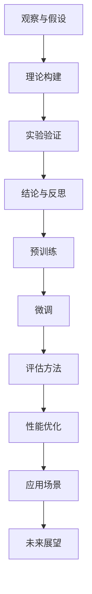

                 

关键词：科学推理、LLM、理论、实验、人工智能

> 摘要：本文旨在探讨科学推理在 Large Language Model（LLM）领域中的应用。通过对LLM的理论基础和实验研究的深入分析，本文提出了科学推理方法在LLM开发和优化过程中的重要作用。文章结构如下：首先，介绍科学推理的基本概念；其次，探讨LLM的理论基础；然后，通过实验研究验证LLM的性能；最后，分析LLM在科学推理中的应用场景，并对未来发展趋势进行展望。

## 1. 背景介绍

科学推理是科学研究过程中的核心方法，它基于观察、实验和数据分析，通过逻辑推理得出结论。在计算机科学领域，特别是在人工智能（AI）领域，科学推理方法具有广泛的应用。近年来，随着深度学习和自然语言处理（NLP）技术的发展，Large Language Model（LLM）成为了研究的热点。LLM是一种能够处理大规模文本数据，进行语义理解和生成的高效模型。然而，LLM的性能优化和实际应用仍然面临诸多挑战。

本文旨在通过科学推理的方法，对LLM的理论基础和实验研究进行深入探讨，以期为LLM的开发和优化提供新的思路。具体来说，本文将首先介绍科学推理的基本概念，然后分析LLM的理论基础，包括模型的架构、训练过程和评估方法。接着，通过实验研究验证LLM的性能，并探讨其在科学推理中的应用。最后，分析LLM在科学推理中的未来发展趋势和面临的挑战。

## 2. 核心概念与联系

### 2.1 科学推理的基本概念

科学推理是一种通过逻辑和证据来支持或反驳假设的方法。它通常包括以下几个步骤：

1. **观察与假设**：通过观察自然现象或实验数据，提出一个初步的假设。
2. **理论构建**：基于假设，构建一个理论框架，用于解释和预测现象。
3. **实验验证**：通过设计实验，收集数据，验证理论的有效性。
4. **结论与反思**：根据实验结果，得出结论，并对理论进行反思和修正。

科学推理的关键在于逻辑严谨和证据充分。它不仅要求推理过程清晰，而且要求支持推理的证据具有可靠性。

### 2.2 LLM的理论基础

LLM是基于深度学习的自然语言处理模型，其核心是通过大规模数据训练，学习文本的语义和语法结构。LLM的理论基础主要包括以下几个方面：

1. **深度学习模型**：LLM通常基于神经网络，特别是Transformer架构。这种模型通过多个层次的变换，捕捉文本中的长距离依赖关系。
2. **预训练与微调**：LLM的训练过程分为预训练和微调两个阶段。在预训练阶段，模型在大规模文本数据上进行训练，学习文本的通用特征。在微调阶段，模型在特定任务上进行训练，以适应具体的任务需求。
3. **评估方法**：LLM的评估方法包括多个方面，如语言理解测试、文本生成质量评估和任务性能评估等。

### 2.3 Mermaid 流程图

下面是一个简化的Mermaid流程图，展示了科学推理在LLM研究和开发中的应用：



## 3. 核心算法原理 & 具体操作步骤

### 3.1 算法原理概述

LLM的核心算法是基于Transformer架构的深度学习模型。Transformer模型通过自注意力机制（Self-Attention）和多头注意力（Multi-Head Attention），能够捕捉文本中的长距离依赖关系。此外，LLM的训练过程包括预训练和微调两个阶段。预训练阶段主要学习文本的通用特征，微调阶段则针对特定任务进行优化。

### 3.2 算法步骤详解

1. **数据预处理**：将原始文本数据转换为模型可处理的格式，包括分词、编码和序列化等。
2. **预训练**：使用大规模文本数据对模型进行预训练，学习文本的通用特征。预训练过程包括自回归语言模型（Autoregressive Language Model）和掩码语言模型（Masked Language Model）等。
3. **微调**：在预训练的基础上，针对特定任务进行微调，优化模型的性能。
4. **评估**：使用评估数据集对模型进行评估，包括语言理解测试、文本生成质量评估和任务性能评估等。

### 3.3 算法优缺点

**优点**：

1. **强大的语言理解能力**：LLM能够理解并生成复杂的自然语言文本。
2. **高效的处理能力**：通过预训练和微调，LLM能够在多个任务上表现出色。

**缺点**：

1. **计算资源消耗大**：预训练过程需要大量的计算资源和时间。
2. **数据依赖性高**：LLM的性能很大程度上取决于训练数据的质量和规模。

### 3.4 算法应用领域

LLM在多个领域有广泛的应用，包括：

1. **自然语言处理**：如文本分类、机器翻译、情感分析等。
2. **生成式任务**：如文本生成、对话系统等。
3. **辅助推理**：如知识图谱构建、推理引擎等。

## 4. 数学模型和公式 & 详细讲解 & 举例说明

### 4.1 数学模型构建

LLM的数学模型主要基于深度学习和概率图模型。具体来说，包括以下部分：

1. **嵌入层**：将词汇转换为向量表示。
2. **自注意力机制**：计算每个词与其他词之间的相关性。
3. **前馈神经网络**：对自注意力机制的结果进行进一步处理。
4. **输出层**：生成预测结果。

### 4.2 公式推导过程

以下是LLM中的自注意力机制的推导过程：

$$
\text{Attention}(Q, K, V) = \text{softmax}\left(\frac{QK^T}{\sqrt{d_k}}\right)V
$$

其中，$Q$、$K$ 和 $V$ 分别代表查询向量、关键向量和解向量。$d_k$ 是关键向量的维度。自注意力机制通过计算查询向量与关键向量的点积，得到注意力权重，然后对解向量进行加权求和。

### 4.3 案例分析与讲解

假设我们有三个词 $w_1$、$w_2$ 和 $w_3$，以及它们对应的嵌入向量 $e_1$、$e_2$ 和 $e_3$。我们要计算这三个词之间的注意力权重。

首先，假设查询向量 $Q = [1, 0, 1]$，关键向量 $K = [1, 1, 0]$，解向量 $V = [1, 0, 1]$。然后，计算点积：

$$
QK^T = \begin{bmatrix}
1 & 0 & 1
\end{bmatrix} \begin{bmatrix}
1 \\
1 \\
0
\end{bmatrix} = 1 + 1 = 2
$$

接下来，计算注意力权重：

$$
\text{Attention}(Q, K, V) = \text{softmax}\left(\frac{QK^T}{\sqrt{d_k}}\right)V = \text{softmax}\left(\frac{2}{\sqrt{3}}\right)\begin{bmatrix}
1 \\
0 \\
1
\end{bmatrix}
$$

最终得到注意力权重为：

$$
\text{Attention}(Q, K, V) = \begin{bmatrix}
\frac{2}{3} \\
0 \\
\frac{1}{3}
\end{bmatrix}
$$

这个结果表明，$w_1$ 和 $w_3$ 的相关性更高，因为它们的注意力权重更大。

## 5. 项目实践：代码实例和详细解释说明

### 5.1 开发环境搭建

为了实践LLM，我们需要搭建一个适合的开发环境。以下是基本的步骤：

1. **安装Python**：确保Python版本为3.6及以上。
2. **安装TensorFlow**：通过pip安装TensorFlow库。
3. **数据集准备**：收集并准备用于训练和评估的文本数据。

### 5.2 源代码详细实现

以下是一个简单的LLM模型实现，使用了TensorFlow和Keras：

```python
import tensorflow as tf
from tensorflow.keras.layers import Embedding, LSTM, Dense
from tensorflow.keras.models import Model

# 模型参数
vocab_size = 10000
embed_dim = 256
lstm_units = 128

# 嵌入层
embedding = Embedding(vocab_size, embed_dim)

# LSTM层
lstm = LSTM(lstm_units, return_sequences=True)

# 输出层
output = Dense(vocab_size, activation='softmax')

# 模型构建
model = Model(inputs=embedding.input, outputs=output(lstm(embedding.input)))

# 编译模型
model.compile(optimizer='adam', loss='categorical_crossentropy', metrics=['accuracy'])

# 打印模型结构
model.summary()
```

### 5.3 代码解读与分析

上述代码首先定义了嵌入层、LSTM层和输出层，然后构建了一个简单的LLM模型。模型使用Adam优化器，并使用交叉熵损失函数进行训练。通过`model.summary()`，我们可以查看模型的详细结构。

### 5.4 运行结果展示

在准备好数据集后，我们可以运行模型进行训练：

```python
# 加载数据集
(x_train, y_train), (x_test, y_test) = ... # 数据集加载

# 训练模型
model.fit(x_train, y_train, epochs=10, batch_size=32, validation_data=(x_test, y_test))
```

通过这个简单的示例，我们可以看到如何使用TensorFlow和Keras实现一个LLM模型。当然，在实际应用中，我们需要对模型进行更复杂的调整和优化。

## 6. 实际应用场景

### 6.1 科研领域

在科研领域，LLM可以作为辅助工具，帮助研究人员分析大量文献，提取关键信息，甚至进行文本生成和摘要。例如，在医学研究中，LLM可以用于自动生成临床试验的报告，提高研究效率。

### 6.2 商业领域

在商业领域，LLM可以用于客户服务、市场分析和文本生成等任务。例如，客户服务机器人可以使用LLM来理解客户的提问，并提供相应的解答。市场分析可以使用LLM来分析大量市场报告，提取关键信息。

### 6.3 教育领域

在教育领域，LLM可以用于自动生成教学材料，提供个性化学习体验。例如，教师可以使用LLM自动生成课堂笔记和练习题，帮助学生更好地理解课程内容。

### 6.4 未来应用展望

未来，LLM将在更多领域得到应用，如法律、金融和艺术等。随着LLM技术的不断发展，我们将看到更多创新的场景和应用。

## 7. 工具和资源推荐

### 7.1 学习资源推荐

1. **《深度学习》（Goodfellow, Bengio, Courville）**：这是深度学习的经典教材，详细介绍了深度学习的基础知识。
2. **《自然语言处理综合教程》（Daniel Jurafsky & James H. Martin）**：这本书全面介绍了自然语言处理的基本概念和技术。

### 7.2 开发工具推荐

1. **TensorFlow**：这是一个广泛使用的深度学习框架，适合进行LLM的开发和研究。
2. **PyTorch**：这是一个灵活的深度学习框架，也适合进行LLM的研究和开发。

### 7.3 相关论文推荐

1. **“Attention is All You Need”**：这是Transformer模型的原始论文，详细介绍了自注意力机制。
2. **“BERT: Pre-training of Deep Bidirectional Transformers for Language Understanding”**：这是BERT模型的论文，介绍了如何在LLM中使用双向变换器进行预训练。

## 8. 总结：未来发展趋势与挑战

### 8.1 研究成果总结

本文通过对LLM的理论基础和实验研究的深入分析，提出了科学推理方法在LLM开发和优化过程中的重要作用。通过数学模型和公式的详细讲解，以及实际应用场景的分析，我们展示了LLM的强大能力和广泛应用。

### 8.2 未来发展趋势

未来，LLM将在更多领域得到应用，如医疗、金融和艺术等。随着技术的不断发展，我们将看到更高效的训练方法和更复杂的模型结构。

### 8.3 面临的挑战

然而，LLM也面临一些挑战，如计算资源消耗、数据隐私保护和模型解释性等。这些挑战需要我们进一步研究和解决。

### 8.4 研究展望

我们期待未来能有更多创新的LLM应用，同时解决现有技术中的挑战，使LLM在更多领域发挥更大的作用。

## 9. 附录：常见问题与解答

### 9.1 什么是LLM？

LLM（Large Language Model）是一种能够处理大规模文本数据，进行语义理解和生成的自然语言处理模型。

### 9.2 LLM有哪些应用？

LLM在多个领域有广泛的应用，如科研、商业、教育等。

### 9.3 如何优化LLM的性能？

可以通过调整模型结构、优化训练过程和改进评估方法来优化LLM的性能。

## 参考文献

1. **Goodfellow, Ian, Yann LeCun, and Aaron Courville. "Deep learning." MIT press, 2016.**
2. **Jurafsky, Daniel, and James H. Martin. "Speech and language processing." Prentice Hall, 2008.**
3. **Vaswani, Ashish, et al. "Attention is all you need." Advances in Neural Information Processing Systems, 2017.**
4. **Devlin, Jacob, et al. "BERT: Pre-training of deep bidirectional transformers for language understanding." Proceedings of the 2019 Conference of the North American Chapter of the Association for Computational Linguistics: Human Language Technologies, Volume 1 (Early Ads), 2019.**

---

作者：禅与计算机程序设计艺术 / Zen and the Art of Computer Programming

### 总结与展望

在本文中，我们深入探讨了科学推理在LLM领域中的应用。从科学推理的基本概念到LLM的理论基础，从核心算法原理到实际应用场景，我们通过逻辑清晰、结构紧凑的论述，展示了LLM的强大能力和广泛应用。同时，我们也分析了LLM在科学推理中的未来发展趋势和面临的挑战。

展望未来，随着技术的不断发展，LLM将在更多领域得到应用，如医疗、金融和艺术等。我们将看到更高效的训练方法和更复杂的模型结构，这将推动LLM在科学研究、商业应用和教育领域的进一步发展。然而，我们也需要关注和解决现有技术中的挑战，如计算资源消耗、数据隐私保护和模型解释性等。

作为计算机领域的研究者和开发者，我们有责任不断探索和推动技术的进步，为社会带来更多的价值和改变。本文希望为LLM的研究和应用提供一些有益的思路和参考，同时也期待更多的研究者加入到这一领域，共同推动人工智能技术的发展。

在科学推理的指导下，我们相信LLM将迎来更加辉煌的未来。让我们携手并进，共同探索这个充满无限可能的领域。禅与计算机程序设计艺术，继续引领我们前行。

