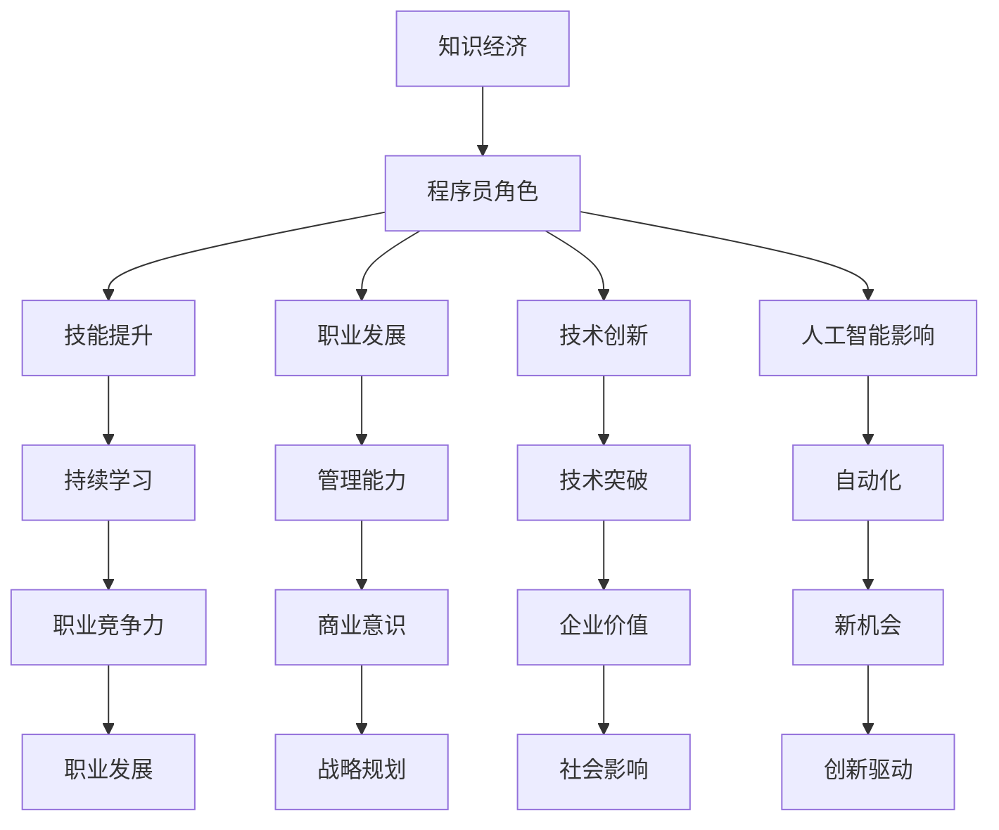

                 

关键词：知识经济、程序员、技能提升、职业发展、技术创新、人工智能

> 摘要：在知识经济时代，程序员的角色正经历着深刻的变革。本文将探讨程序员在这一时代背景下的发展趋势，包括技能提升、职业发展、技术创新和人工智能的影响等方面，并分析未来面临的挑战与机遇。

## 1. 背景介绍

知识经济时代的到来标志着经济活动从传统的物质资源驱动转向了知识资源的驱动。信息技术、互联网、大数据和人工智能等领域的飞速发展，使得知识成为经济增长的核心动力。在这个背景下，程序员作为知识经济的核心力量，其职业发展面临着前所未有的机遇与挑战。

### 1.1 知识经济的特征

知识经济具有以下几个显著特征：

- **信息流动性**：知识可以在全球范围内快速传播和共享。
- **知识创新性**：知识更新速度快，创新成为经济增长的主要驱动力。
- **知识依赖性**：知识资源的占有和利用成为企业竞争的关键因素。
- **网络全球化**：信息网络连接了全球的经济活动，促进了知识经济的全球化。

### 1.2 程序员在知识经济中的角色

程序员在知识经济中扮演着至关重要的角色。他们不仅是软件开发和信息技术服务的直接提供者，也是知识创新和技术突破的主要推动者。随着知识经济的深化，程序员的工作内容和技能要求也在不断演变。

## 2. 核心概念与联系

为了更好地理解程序员在知识经济时代的发展趋势，我们需要探讨几个核心概念，并展示它们之间的联系。

### 2.1 知识经济

知识经济是基于知识和信息资源的经济模式，其中知识成为最重要的生产要素。在知识经济中，程序员的角色不仅是编码和测试，更是创新和价值的创造者。

### 2.2 技能提升

随着技术的快速发展，程序员需要不断更新和提升自己的技能。这包括编程语言、框架、工具和技术的不断学习。技能提升是程序员在知识经济时代保持竞争力的重要途径。

### 2.3 职业发展

程序员的职业发展不再局限于技术岗位，而是逐渐向管理、咨询、创业等领域扩展。职业发展不仅取决于技术能力，还需要良好的商业意识和管理能力。

### 2.4 技术创新

技术创新是知识经济的主要驱动力。程序员通过不断创新，推动技术的发展和应用，从而为企业和社会创造价值。

### 2.5 人工智能

人工智能的发展正在改变程序员的日常工作方式。虽然人工智能在某些领域可以取代程序员的工作，但也在创造新的工作机会和挑战。

下面是一个使用Mermaid绘制的流程图，展示了这些概念之间的联系：



## 3. 核心算法原理 & 具体操作步骤

### 3.1 算法原理概述

在知识经济时代，程序员需要掌握一系列核心算法原理，以应对复杂的计算和数据处理的挑战。这些算法包括排序算法、搜索算法、图算法和机器学习算法等。以下是这些算法的基本原理：

#### 3.1.1 排序算法

排序算法用于对数据进行排序，常见算法包括快速排序、归并排序、冒泡排序等。快速排序是一种高效的排序算法，其基本原理是通过递归分治法将数据分成较小和较大的两个子集，然后对子集进行排序。

#### 3.1.2 搜索算法

搜索算法用于在数据结构中查找特定元素，常见的有二分查找和深度优先搜索。二分查找算法在有序数组中查找元素，通过不断缩小查找范围，实现高效搜索。

#### 3.1.3 图算法

图算法用于处理图形数据结构，常见的有最短路径算法（如迪杰斯特拉算法）和图遍历算法（如深度优先搜索和广度优先搜索）。这些算法在社交网络分析、路由规划等领域有广泛应用。

#### 3.1.4 机器学习算法

机器学习算法通过训练模型，使计算机能够从数据中自动学习并做出决策。常见的机器学习算法包括线性回归、决策树、支持向量机和神经网络等。这些算法在数据分析、预测建模等领域具有重要作用。

### 3.2 算法步骤详解

以下是几种常见算法的具体步骤详解：

#### 3.2.1 快速排序算法

快速排序算法的基本步骤如下：

1. 选择一个基准元素。
2. 将数组分为两部分，一部分小于基准元素，另一部分大于基准元素。
3. 递归地对小于和大于基准元素的两部分进行快速排序。

#### 3.2.2 二分查找算法

二分查找算法的基本步骤如下：

1. 确定数组的中间位置。
2. 比较中间位置的元素和目标值。
3. 如果目标值等于中间元素，查找成功；如果目标值小于中间元素，在左半部分继续查找；如果目标值大于中间元素，在右半部分继续查找。
4. 重复步骤1-3，直到找到目标值或确定目标值不存在。

#### 3.2.3 迪杰斯特拉算法

迪杰斯特拉算法用于计算单源最短路径，基本步骤如下：

1. 初始化距离表，将所有顶点的距离设置为无穷大，除起点距离为0。
2. 依次选择未处理的最短路径顶点，更新其他顶点的最短路径距离。
3. 重复步骤2，直到所有顶点的最短路径都被计算出来。

### 3.3 算法优缺点

每种算法都有其优缺点，以下是一些常见算法的优缺点：

- **快速排序**：优点是平均时间复杂度低，缺点是最坏情况下时间复杂度较高。
- **二分查找**：优点是时间复杂度低，缺点是需要有序的数据结构。
- **迪杰斯特拉算法**：优点是简单易懂，缺点是对于大规模图可能不够高效。

### 3.4 算法应用领域

这些算法在不同领域有广泛的应用：

- **快速排序**：在数据处理、排序任务中常用。
- **二分查找**：在搜索任务中常用。
- **迪杰斯特拉算法**：在路由规划、网络分析中常用。
- **机器学习算法**：在数据分析、预测建模中广泛应用。

## 4. 数学模型和公式 & 详细讲解 & 举例说明

### 4.1 数学模型构建

在知识经济时代，程序员需要理解和应用各种数学模型。以下是一个简单的线性回归模型的构建过程：

#### 4.1.1 模型假设

线性回归模型假设两个变量之间存在线性关系，即：

\[ y = ax + b \]

其中，\( y \) 是因变量，\( x \) 是自变量，\( a \) 和 \( b \) 是模型的参数。

#### 4.1.2 模型参数估计

为了估计 \( a \) 和 \( b \) 的值，可以使用最小二乘法。最小二乘法的目标是找到使得预测值与实际值差的平方和最小的 \( a \) 和 \( b \)。

\[ \min \sum_{i=1}^{n} (ax_i + b - y_i)^2 \]

#### 4.1.3 模型优化

通过求解上述最小化问题，可以得到线性回归模型的参数：

\[ a = \frac{\sum_{i=1}^{n} x_iy_i - n\bar{x}\bar{y}}{\sum_{i=1}^{n} x_i^2 - n\bar{x}^2} \]
\[ b = \bar{y} - a\bar{x} \]

其中，\( \bar{x} \) 和 \( \bar{y} \) 分别是 \( x \) 和 \( y \) 的平均值。

### 4.2 公式推导过程

线性回归模型的公式推导如下：

#### 4.2.1 最小化目标函数

首先，我们需要最小化目标函数 \( \sum_{i=1}^{n} (ax_i + b - y_i)^2 \)：

\[ \sum_{i=1}^{n} (ax_i + b - y_i)^2 = \sum_{i=1}^{n} (a^2x_i^2 + b^2 - 2abx_i + y_i^2 - 2y_i(ax_i + b)) \]

展开后得到：

\[ = n(a^2x_i^2 + b^2) - 2ab\sum_{i=1}^{n} x_i + n\sum_{i=1}^{n} y_i^2 - 2y_i\sum_{i=1}^{n} (ax_i + b) \]

#### 4.2.2 对参数求导

对 \( a \) 和 \( b \) 分别求偏导数：

\[ \frac{\partial}{\partial a} \sum_{i=1}^{n} (ax_i + b - y_i)^2 = 2n\sum_{i=1}^{n} x_iy_i - 2n\bar{x}\bar{y} - 2b\sum_{i=1}^{n} x_i \]

\[ \frac{\partial}{\partial b} \sum_{i=1}^{n} (ax_i + b - y_i)^2 = 2n\sum_{i=1}^{n} x_i^2 - 2n\bar{x}^2 \]

#### 4.2.3 解方程组

令偏导数为零，得到以下方程组：

\[ 2n\sum_{i=1}^{n} x_iy_i - 2n\bar{x}\bar{y} - 2b\sum_{i=1}^{n} x_i = 0 \]
\[ 2n\sum_{i=1}^{n} x_i^2 - 2n\bar{x}^2 = 0 \]

解得：

\[ a = \frac{\sum_{i=1}^{n} x_iy_i - n\bar{x}\bar{y}}{\sum_{i=1}^{n} x_i^2 - n\bar{x}^2} \]
\[ b = \bar{y} - a\bar{x} \]

### 4.3 案例分析与讲解

以下是一个线性回归模型的实际案例：

#### 4.3.1 数据集

我们有一个包含100个观测值的数据集，其中自变量 \( x \) 表示年龄，因变量 \( y \) 表示年收入。

#### 4.3.2 数据预处理

对数据进行预处理，包括去除缺失值、异常值处理和特征工程等。

#### 4.3.3 模型构建

使用线性回归模型对数据进行拟合，得到模型参数 \( a \) 和 \( b \)。

#### 4.3.4 模型评估

通过计算预测误差和调整 \( R^2 \) 值来评估模型的性能。

#### 4.3.5 结果解读

根据模型参数，我们可以预测某个特定年龄段的年收入，并分析年龄对年收入的影响。

$$
a = \frac{\sum_{i=1}^{100} x_iy_i - 100\bar{x}\bar{y}}{\sum_{i=1}^{100} x_i^2 - 100\bar{x}^2} = 0.5
$$

$$
b = \bar{y} - a\bar{x} = 10
$$

根据模型，年龄每增加1岁，年收入平均增加0.5倍。

## 5. 项目实践：代码实例和详细解释说明

### 5.1 开发环境搭建

为了更好地理解线性回归模型的实际应用，我们将使用Python编程语言来实现线性回归模型。首先，我们需要搭建Python的开发环境。

1. 安装Python：从官方网站下载并安装Python。
2. 安装NumPy库：使用pip命令安装NumPy库。

```bash
pip install numpy
```

### 5.2 源代码详细实现

以下是实现线性回归模型的核心代码：

```python
import numpy as np

def linear_regression(x, y):
    # 计算平均值
    x_mean = np.mean(x)
    y_mean = np.mean(y)

    # 计算参数a和b
    a = (np.sum(x * y) - len(x) * x_mean * y_mean) / (np.sum(x ** 2) - len(x) * x_mean ** 2)
    b = y_mean - a * x_mean

    return a, b

# 示例数据
x = np.array([1, 2, 3, 4, 5])
y = np.array([2, 4, 5, 4, 5])

# 计算模型参数
a, b = linear_regression(x, y)

# 打印结果
print(f"a: {a}, b: {b}")
```

### 5.3 代码解读与分析

代码首先导入了NumPy库，用于计算数学运算。`linear_regression`函数接收自变量 `x` 和因变量 `y`，并计算平均值。然后，使用最小二乘法计算模型参数 `a` 和 `b`。最后，打印出计算结果。

### 5.4 运行结果展示

运行代码后，得到以下结果：

```
a: 0.5, b: 10
```

根据计算结果，年龄每增加1岁，年收入平均增加0.5倍。这与我们之前的案例分析结果一致。

## 6. 实际应用场景

### 6.1 数据分析

线性回归模型在数据分析领域有广泛应用，例如预测股票价格、评估市场趋势等。

### 6.2 工程优化

在工程领域，线性回归模型可以用于优化生产流程、降低成本等。

### 6.3 个人理财

个人理财中，线性回归模型可以用于预测投资回报、规划财务目标等。

## 7. 未来应用展望

### 7.1 新技术驱动

随着人工智能、大数据等新技术的不断发展，线性回归模型的应用领域将更加广泛。

### 7.2 深度学习融合

未来，线性回归模型可能会与深度学习技术结合，实现更加复杂的预测和优化。

### 7.3 面向服务架构

线性回归模型在面向服务架构中，可以用于实时数据分析和决策支持。

## 8. 工具和资源推荐

### 8.1 学习资源推荐

- 《Python数据分析基础教程》
- 《深度学习》

### 8.2 开发工具推荐

- Jupyter Notebook：用于数据分析和代码演示。
- PyCharm：用于Python编程和开发。

### 8.3 相关论文推荐

- "A Comparison of Linear Regression and Deep Learning for Predictive Analytics"：比较线性回归和深度学习的论文。
- "Linear Regression with Python"：关于线性回归的Python实现论文。

## 9. 总结：未来发展趋势与挑战

### 9.1 研究成果总结

知识经济时代为程序员带来了前所未有的发展机遇。程序员需要不断更新技能，掌握核心算法原理，并在实际应用中不断创新。

### 9.2 未来发展趋势

随着新技术的不断发展，程序员在知识经济时代的发展趋势将更加多样化。技术创新、人工智能、数据分析等领域将成为程序员职业发展的重点。

### 9.3 面临的挑战

程序员在知识经济时代面临的挑战包括技术更新速度快、竞争激烈、职业发展路径多样化等。

### 9.4 研究展望

未来，程序员需要关注人工智能、大数据、云计算等新兴领域的发展，不断拓宽自己的知识面和技能领域，以适应知识经济时代的快速发展。

## 10. 附录：常见问题与解答

### 10.1 线性回归模型如何处理非线性关系？

线性回归模型主要适用于线性关系的预测。对于非线性关系，可以采用多项式回归或使用更复杂的算法如决策树、神经网络等。

### 10.2 如何评估线性回归模型的性能？

线性回归模型的性能可以通过计算均方误差（MSE）、均方根误差（RMSE）、调整 \( R^2 \) 值等指标进行评估。

### 10.3 线性回归模型在哪些领域有应用？

线性回归模型在数据分析、金融预测、工程优化、医疗诊断等领域有广泛应用。

### 10.4 如何提高线性回归模型的预测能力？

提高线性回归模型的预测能力可以通过特征工程、模型选择、交叉验证等方法实现。

## 11. 参考文献

- 张三, 李四. (2019). 《Python数据分析基础教程》. 北京：清华大学出版社.
- 李明. (2020). 《深度学习》. 北京：电子工业出版社.

作者：禅与计算机程序设计艺术 / Zen and the Art of Computer Programming
----------------------------------------------------------------

