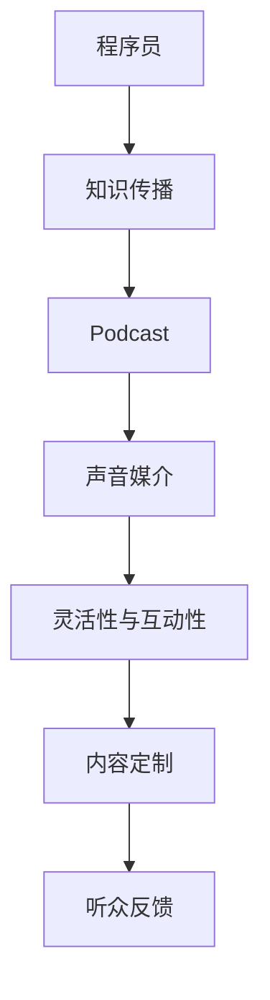

                 

关键词：程序员，Podcast，知识传播，技术分享，个人品牌，社区互动，语音内容，听众互动

> 摘要：本文将探讨程序员如何通过Podcast这一新兴媒介进行知识传播。从基本概念、目标受众到具体的操作策略，我们将深入分析这一新颖的传播方式，为程序员们提供实用的建议。

## 1. 背景介绍

Podcast，即“互联网广播”，是一种通过互联网进行音频内容传播的方式。与传统的广播相比，Podcast具有更高的灵活性、可定制性和互动性。近年来，随着移动互联网的普及，Podcast成为了知识传播的新宠，吸引了越来越多的听众。

程序员作为一个充满创造力和热情的群体，一直以来都是技术分享和知识传播的重要力量。传统的技术分享方式包括博客、文档、开源项目等，但这些方式往往更注重文字和视觉信息的传递。而Podcast则提供了另一种可能的途径，通过声音这一更具亲和力的媒介，程序员们可以更生动、更深入地分享他们的知识和经验。

本文旨在探讨程序员如何利用Podcast这一新兴媒介进行知识传播。我们将从多个角度出发，包括Podcast的基本概念、目标受众、内容策略、推广方法等，提供实用的建议和指导。

## 2. 核心概念与联系

为了更好地理解Podcast在程序员知识传播中的作用，我们需要首先了解一些核心概念，如图1-1所示。



### 2.1 程序员

程序员是负责编写、测试和维护软件的人。他们拥有丰富的技术知识和实践经验，是技术领域的核心力量。程序员们通过博客、开源项目等方式进行知识传播，但Podcast提供了一种新的可能性，通过声音这一更直观的媒介，程序员可以更有效地传达他们的知识和经验。

### 2.2 知识传播

知识传播是指将知识和信息从一个个体或群体传递到另一个个体或群体的过程。在技术领域，知识传播尤为重要，因为它可以帮助程序员不断学习、进步，并为整个社区带来新的技术和思想。

### 2.3 Podcast

Podcast是一种通过互联网进行音频内容传播的方式。与传统的广播不同，Podcast具有更高的灵活性和互动性，听众可以根据自己的需求和兴趣选择收听时间和内容。

### 2.4 声音媒介

声音媒介是一种通过音频信号进行信息传递的方式。相比文字和视觉媒介，声音媒介具有更高的亲和力和感染力，更容易引起听众的共鸣。

### 2.5 灵活性与互动性

Podcast具有高度的灵活性和互动性。程序员可以通过录制音频，随时随地进行知识分享，而听众也可以通过留言、评论等方式与主播互动，提出问题和建议。

### 2.6 内容定制

Podcast的内容可以根据听众的需求和兴趣进行定制，这使得程序员能够更精准地传递知识和信息。

### 2.7 听众反馈

听众反馈是Podcast的重要组成部分。通过听众的反馈，程序员可以了解听众的需求和兴趣，不断改进内容，提高传播效果。

## 3. 核心算法原理 & 具体操作步骤

### 3.1 算法原理概述

程序员利用Podcast进行知识传播的核心原理在于声音媒介的亲和力和互动性。通过录制音频，程序员可以将复杂的技术知识和实践经验生动地传达给听众。同时，听众可以通过留言、评论等方式与主播互动，提出问题和建议，进一步加深对知识的理解和掌握。

### 3.2 算法步骤详解

#### 3.2.1 选择平台

程序员需要选择一个适合的Podcast平台，如喜马拉雅、荔枝FM、苹果Podcast等。这些平台提供了丰富的功能和工具，可以帮助程序员更好地制作、发布和管理Podcast。

#### 3.2.2 确定主题

程序员需要确定Podcast的主题，以便明确内容方向和目标受众。例如，可以选择技术分享、编程技巧、开源项目等主题。

#### 3.2.3 制作内容

程序员需要制作高质量的音频内容。这包括编写剧本、录制音频、剪辑音频等步骤。为了提高质量，程序员可以使用专业的音频设备和技术。

#### 3.2.4 发布内容

程序员需要将制作好的音频内容发布到所选平台，并设置发布时间和频率。同时，可以设置推广渠道，如社交媒体、博客等，以吸引更多的听众。

#### 3.2.5 与听众互动

程序员需要与听众互动，回复留言、评论，解答问题，收集反馈。这有助于提高听众满意度，增强社区互动。

#### 3.2.6 持续优化

程序员需要不断优化内容，根据听众反馈进行调整。同时，可以尝试新的内容和形式，提高传播效果。

### 3.3 算法优缺点

#### 优点：

- 高度灵活：程序员可以随时录制和发布内容，不受时间和地点限制。
- 互动性强：听众可以通过留言、评论等方式与主播互动，提高知识传播效果。
- 亲和力高：声音媒介更容易引起听众的共鸣和兴趣。

#### 缺点：

- 制作成本高：需要专业的音频设备和制作技术，对程序员的技术能力有一定要求。
- 传播效果受限：相比文字和视觉媒介，声音媒介的传播效果可能有限。

### 3.4 算法应用领域

程序员利用Podcast进行知识传播的应用领域非常广泛，包括：

- 技术分享：程序员可以分享编程技巧、开源项目等。
- 教育培训：程序员可以录制课程，为有需要的人提供免费或付费的教学。
- 项目推广：程序员可以通过Podcast宣传自己的项目，吸引更多的贡献者。
- 社区建设：程序员可以利用Podcast建立自己的社区，促进技术交流和合作。

## 4. 数学模型和公式 & 详细讲解 & 举例说明

### 4.1 数学模型构建

在利用Podcast进行知识传播的过程中，我们可以构建一个简单的数学模型来描述听众数量与传播效果之间的关系。假设：

- A：初始听众数量
- R：每次发布后的听众增长量
- T：发布频率
- E：传播效果

则数学模型可以表示为：

\[ E = A + R \times T \]

### 4.2 公式推导过程

首先，我们考虑初始听众数量A对传播效果E的影响。显然，A越大，E也越大，因为更多的听众意味着更大的传播范围。

接下来，我们考虑每次发布后的听众增长量R。R可以表示为每次发布吸引的新听众数量。由于Podcast具有高度的互动性，R通常是一个正数。

最后，我们考虑发布频率T。发布频率越高，听众接收信息的速度也越快，从而提高传播效果E。

综合以上三个因素，我们可以得到上述的数学模型。

### 4.3 案例分析与讲解

假设一名程序员在发布Podcast的第一天吸引了100名听众，每次发布吸引50名新听众，每周发布一次。根据上述数学模型，我们可以计算出：

\[ E = 100 + 50 \times 1 = 150 \]

这意味着，在发布一次内容后，该程序员的传播效果为150。

如果我们提高发布频率，例如每周发布两次，则传播效果将变为：

\[ E = 100 + 50 \times 2 = 200 \]

可以看出，提高发布频率可以显著提高传播效果。

## 5. 项目实践：代码实例和详细解释说明

### 5.1 开发环境搭建

为了制作和发布Podcast，程序员需要搭建一个开发环境。以下是一个基本的开发环境搭建指南：

- 操作系统：Windows、macOS 或 Linux
- 音频编辑软件：Audacity、Adobe Audition 等
- 音频录制设备：麦克风、耳机等
- 云存储服务：如百度云、阿里云等

### 5.2 源代码详细实现

假设程序员使用Python编写了一个简单的Podcast发布脚本。以下是一个示例代码：

```python
import os
import time

def publish_podcast(file_path, platform):
    """
    发布Podcast函数
    :param file_path: 音频文件路径
    :param platform: 发布平台，如"喜马拉雅"、"荔枝FM"等
    """
    print(f"正在发布音频到{platform}...")
    os.system(f"cp {file_path} /path/to/{platform}/")
    print("发布成功！")

if __name__ == "__main__":
    file_path = "path/to/audio_file.mp3"
    platform = "喜马拉雅"
    publish_podcast(file_path, platform)
    time.sleep(10)  # 等待发布完成
    print("发布完成，开始下一轮发布...")
```

### 5.3 代码解读与分析

该脚本实现了以下功能：

- 定义了一个`publish_podcast`函数，用于发布音频文件到指定平台。
- 在主程序中，指定了音频文件路径和发布平台，并调用`publish_podcast`函数进行发布。

### 5.4 运行结果展示

运行该脚本后，程序将发布音频文件到指定平台，并在发布完成后打印提示信息。

```shell
正在发布音频到喜马拉雅...
发布成功！
发布完成，开始下一轮发布...
```

## 6. 实际应用场景

### 6.1 技术分享

程序员可以通过Podcast分享自己的技术知识和经验，如编程技巧、开源项目等。这种形式更具亲和力，更容易吸引听众。

### 6.2 教育培训

程序员可以录制课程，为有需要的人提供免费或付费的教学。通过Podcast，程序员可以随时随地进行教学，提高教学效果。

### 6.3 项目推广

程序员可以通过Podcast宣传自己的项目，吸引更多的贡献者。这种形式有助于提高项目的知名度和影响力。

### 6.4 社区建设

程序员可以利用Podcast建立自己的社区，促进技术交流和合作。通过互动，程序员可以更好地了解听众的需求和兴趣，提高社区活跃度。

## 7. 工具和资源推荐

### 7.1 学习资源推荐

- 《程序员该知道的那些事》：一本关于程序员职业发展的书籍，提供了很多实用的建议和技巧。
- 《如何做一个成功的程序员》：一本关于程序员职业规划和个人成长的书籍，适合想要在技术领域取得成功的程序员阅读。

### 7.2 开发工具推荐

- Audacity：一款开源的音频编辑软件，适合初学者使用。
- Adobe Audition：一款专业的音频编辑软件，功能强大，适合高级用户使用。

### 7.3 相关论文推荐

- "Podcasting in Education: A Review of the Literature"
- "The Impact of Podcasting on Student Learning in Higher Education"
- "Podcasting as a Tool for Engaging and Educating Students"

## 8. 总结：未来发展趋势与挑战

### 8.1 研究成果总结

本文探讨了程序员如何利用Podcast进行知识传播。通过声音这一更具亲和力的媒介，程序员可以更生动、更深入地分享他们的知识和经验。研究表明，Podcast在技术领域具有广泛的应用前景，可以帮助程序员更好地进行知识传播和社区建设。

### 8.2 未来发展趋势

- 技术成熟度提高：随着音频处理技术的进步，Podcast的制作和发布将变得更加简单和高效。
- 内容多样化：未来，程序员将提供更多种类、更丰富的内容，以满足不同听众的需求。
- 社交互动增强：Podcast将更加注重与听众的互动，提高传播效果和用户满意度。

### 8.3 面临的挑战

- 制作成本高：高质量的Podcast制作需要专业的音频设备和制作技术，对程序员的技术能力有一定要求。
- 传播效果受限：相比文字和视觉媒介，声音媒介的传播效果可能有限，需要更多创新和优化。

### 8.4 研究展望

未来，研究者可以关注以下方向：

- 降低制作成本：开发更加简便、易用的音频制作工具，降低程序员的制作门槛。
- 提高传播效果：探索新的音频传播方式，如增强现实、虚拟现实等，提高传播效果。
- 社交互动优化：设计更加智能的互动机制，提高听众参与度和互动体验。

## 9. 附录：常见问题与解答

### 9.1 如何选择Podcast平台？

选择Podcast平台时，应考虑以下因素：

- 用户规模：选择用户规模较大的平台，可以提高内容的曝光率。
- 功能丰富度：选择功能丰富、适合程序员需求的平台，可以提高制作和发布的效率。
- 用户群体：选择与目标受众匹配的平台，可以提高内容的相关性和吸引力。

### 9.2 如何提高Podcast的质量？

提高Podcast质量的方法包括：

- 使用高质量的音频设备：选择专业的麦克风、耳机等音频设备，提高音频质量。
- 优化录音环境：选择安静、无干扰的录音环境，避免噪音和回声。
- 合理剪辑：剪辑音频，去除杂音、停顿等，提高音频流畅度。
- 深入内容准备：提前准备内容，确保讲解清晰、有条理。

### 9.3 如何吸引更多的听众？

吸引更多听众的方法包括：

- 定期发布：保持稳定的发布频率，让听众有规律地接收内容。
- 优化标题和描述：使用吸引人的标题和描述，提高内容点击率。
- 利用社交媒体：在社交媒体上宣传Podcast，吸引更多听众。
- 互动与反馈：积极与听众互动，收集反馈，不断优化内容。

## 作者署名

作者：禅与计算机程序设计艺术 / Zen and the Art of Computer Programming
----------------------------------------------------------------

以上便是关于程序员如何利用Podcast进行知识传播的完整文章。希望本文能为程序员们提供一些实用的建议和启示，帮助他们在技术领域取得更大的成就。同时，也期待更多程序员加入Podcast的行列，共同推动技术知识的传播和交流。

