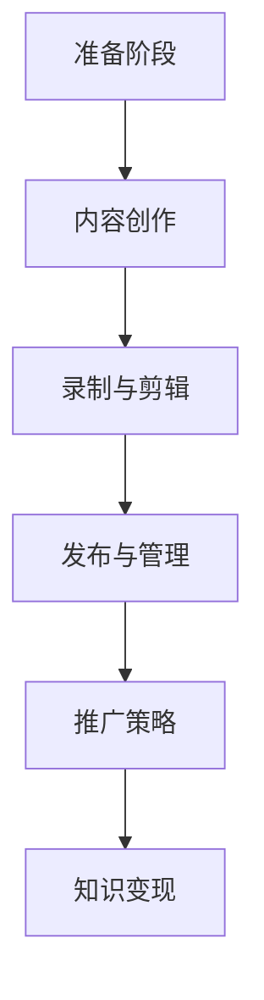

                 

在这个信息爆炸的时代，程序员不仅要具备出色的编程能力，还需要学会如何将自己的知识和经验转化为实际的收益。播客作为一种新兴的媒介，为程序员提供了一个广阔的舞台，使其能够通过分享专业知识来吸引听众，进而实现知识变现。本文将探讨程序员如何利用播客进行知识变现的路径，包括准备工作、内容创作、推广策略等方面，旨在为想要尝试这一领域的程序员提供实用的指导和启发。

> **关键词：**程序员，播客，知识变现，内容创作，推广策略

> **摘要：**本文从多个角度分析了程序员如何通过播客平台进行知识变现的可行性。文章首先介绍了播客在技术社区中的重要性，接着阐述了程序员准备播客节目所需的资源和技术，随后探讨了内容创作的关键要素和推广策略。最后，文章提出了播客在程序员知识变现中的未来发展趋势和潜在挑战。

## 1. 背景介绍

随着互联网技术的发展，播客（Podcast）已经成为一种流行的信息传播方式。播客是一种音频节目，通常由个人或团队制作并发布，通过互联网供用户订阅和下载。播客的内容涵盖了各种领域，包括娱乐、新闻、教育、技术等。近年来，随着智能手机和移动互联网的普及，播客听众数量急剧增加，成为信息传播的重要渠道之一。

对于程序员来说，播客提供了一个独特的平台，可以分享编程经验、技术见解和行业动态。通过播客，程序员不仅可以展示自己的专业技能，还能与同行建立联系，扩大影响力。此外，播客还具有以下优势：

- **灵活性强：**程序员可以自由选择播客的录制时间和地点，无需受到传统媒体的限制。
- **受众广泛：**播客不受地域和时间的限制，可以吸引来自世界各地的听众。
- **内容深度：**播客可以深入探讨技术话题，提供详细的分析和解决方案。
- **互动性高：**播客允许听众通过邮件、社交媒体等方式与主持人互动，增强听众的参与感。

## 2. 核心概念与联系

为了更好地理解程序员如何利用播客进行知识变现，我们需要了解以下几个核心概念：

### 2.1 播客平台

播客平台是指用于发布、订阅和管理播客内容的网站或应用程序。常见的播客平台包括Apple Podcasts、Spotify、Google Podcasts等。程序员可以选择在这些平台上发布自己的节目，以吸引听众。

### 2.2 知识变现

知识变现是指将个人的知识和经验转化为经济收益的过程。对于程序员来说，通过播客分享技术知识，可以获得广告收入、赞助费用、付费订阅等多种形式的收益。

### 2.3 内容创作

内容创作是指制作播客节目所需的过程，包括选题、录制、剪辑、发布等。程序员需要具备一定的内容创作能力，才能制作出吸引听众的高质量节目。

### 2.4 推广策略

推广策略是指通过多种渠道宣传和推广播客节目，以增加听众数量和影响力的方法。有效的推广策略对于播客节目的成功至关重要。

### Mermaid 流程图

以下是一个简化的Mermaid流程图，展示了程序员利用播客进行知识变现的基本流程：



## 3. 核心算法原理 & 具体操作步骤

### 3.1 算法原理概述

播客内容创作和推广的核心算法原理可以概括为以下几点：

1. **选题策划：** 选择听众感兴趣的技术话题，确保内容具有吸引力和实用性。
2. **录制技巧：** 使用高质量的录音设备，确保音频效果清晰。
3. **剪辑优化：** 对录制内容进行编辑和优化，提高节目质量。
4. **渠道推广：** 通过多种渠道宣传和推广节目，吸引更多听众。
5. **数据分析：** 利用数据分析工具监控节目表现，调整策略。

### 3.2 算法步骤详解

1. **选题策划：**
   - 分析受众需求：了解目标听众的兴趣和需求，选择适合的话题。
   - 调研热门话题：关注行业动态和热门话题，结合自身专业知识进行选题。

2. **录制技巧：**
   - 选择合适的录音设备：确保音频质量，可以使用专业麦克风和音频接口。
   - 控制录音环境：避免噪音干扰，选择安静的环境进行录制。
   - 确保语言清晰：讲话速度适中，发音清晰，避免口齿不清或模糊。

3. **剪辑优化：**
   - 删除多余部分：剪辑掉录制过程中出现的失误或冗余内容。
   - 增加过渡效果：使用过渡音效或音乐，使节目内容更加流畅。
   - 调整音频均衡：使用音频编辑软件调整音量平衡，确保整个节目的音质一致。

4. **渠道推广：**
   - 发布至各大播客平台：将节目发布到Apple Podcasts、Spotify等主流播客平台，增加曝光度。
   - 利用社交媒体：在Twitter、Facebook、LinkedIn等社交媒体平台宣传节目，吸引更多听众。
   - 合作推广：与其他播客主持人或技术博客合作，互相推广节目。

5. **数据分析：**
   - 监控听众反馈：通过评论、邮件等方式收集听众反馈，了解节目受欢迎程度。
   - 分析听众数据：利用播客平台提供的数据分析工具，了解听众的收听习惯和偏好。
   - 调整节目策略：根据数据分析结果，调整节目内容和推广策略，提高听众满意度。

### 3.3 算法优缺点

**优点：**

- **灵活性高：** 程序员可以根据自己的时间安排录制节目，无需受到传统媒体的限制。
- **受众广泛：** 播客可以吸引来自世界各地的听众，拓展影响力。
- **内容深度：** 播客可以深入探讨技术话题，提供详细的分析和解决方案。
- **互动性强：** 播客允许听众与主持人互动，增强听众的参与感。

**缺点：**

- **制作成本较高：** 需要高质量的录音设备和音频编辑软件，制作成本较高。
- **受众转化率较低：** 播客节目的受众转化率相对较低，需要较长时间积累听众。
- **竞争激烈：** 技术领域的播客数量庞大，竞争激烈，需要突出自身特色。

### 3.4 算法应用领域

播客在程序员知识变现中的应用领域广泛，包括但不限于以下方面：

- **技术分享：** 分享编程技巧、开源项目经验、技术解决方案等。
- **职业发展：** 讨论职业规划、求职技巧、面试经验等。
- **项目实战：** 分享实际项目的开发过程和经验。
- **行业动态：** 分析行业趋势、新技术动态等。

## 4. 数学模型和公式 & 详细讲解 & 举例说明

在播客内容创作和推广中，数学模型和公式可以用于分析听众行为、优化推广策略等。以下是一个简化的数学模型，用于评估播客节目的受众吸引力。

### 4.1 数学模型构建

设 \( A \) 为听众数量，\( R \) 为听众的收听率，\( C \) 为听众的转化率，\( P \) 为每名听众带来的收益，则播客节目的总收益 \( R \) 可以表示为：

\[ R = A \times R \times C \times P \]

其中：

- \( A \)：听众数量，可以通过播客平台提供的数据分析工具获取。
- \( R \)：听众的收听率，可以通过播放量、下载量等指标计算。
- \( C \)：听众的转化率，即收听后产生实际收益的听众比例，可以通过实验和数据分析得出。
- \( P \)：每名听众带来的收益，可以通过广告收入、赞助费用、付费订阅等计算。

### 4.2 公式推导过程

根据上述公式，我们可以进一步推导出以下关系：

1. **听众数量与收听率的关系：**

\[ A \times R = 播放量 \]

其中，播放量可以通过播客平台提供的数据分析工具获取。

2. **听众数量与转化率的关系：**

\[ A \times R \times C = 实际收益 \]

其中，实际收益可以通过实际收入和支出计算。

3. **听众数量与总收益的关系：**

\[ R = A \times R \times C \times P \]

### 4.3 案例分析与讲解

以下是一个具体的案例，用于说明如何利用上述数学模型进行播客节目的优化。

假设某程序员制作了一档技术分享播客节目，经过一段时间的运营，积累了1000名听众。根据数据分析，节目的播放量为10000次，听众的收听率为50%，转化率为10%，每名听众带来的收益为10元。

根据上述公式，我们可以计算出节目的总收益为：

\[ R = 1000 \times 50\% \times 10\% \times 10元 = 500元 \]

为了提高总收益，我们可以考虑以下策略：

1. **提高收听率：** 通过优化节目内容、提高录制质量等方式，提高听众的收听率。例如，如果将收听率提高10%，则总收益将增加10%。

2. **提高转化率：** 通过改进推广策略、提供更有吸引力的内容等方式，提高听众的转化率。例如，如果将转化率提高10%，则总收益将增加10%。

3. **增加每名听众的收益：** 通过引入广告、赞助等方式，提高每名听众的收益。例如，如果每名听众的收益提高10%，则总收益将增加10%。

通过不断优化这些因素，我们可以提高播客节目的总收益，实现知识变现的目标。

## 5. 项目实践：代码实例和详细解释说明

### 5.1 开发环境搭建

在进行播客节目制作之前，程序员需要搭建一个合适的开发环境。以下是一个基本的开发环境搭建步骤：

1. **选择音频录制软件：** 使用如Audacity等音频录制软件进行节目录制。
2. **选择音频编辑软件：** 使用如Adobe Audition等音频编辑软件进行节目剪辑和优化。
3. **选择播客发布平台：** 注册并开通播客发布账户，如Apple Podcasts、Spotify等。
4. **选择数据分析工具：** 使用如Google Analytics等数据分析工具，监控节目表现。

### 5.2 源代码详细实现

以下是录制、编辑和发布播客节目的一个简单代码示例，使用Python编写：

```python
import os
import subprocess

# 录制音频
def record_audio(file_path):
    subprocess.run(["ffmpeg", "-y", "-f", "avi", "-i", "input.avi", "-ab", "320k", file_path + ".wav"])

# 剪辑音频
def trim_audio(file_path, start_time, end_time):
    subprocess.run(["ffmpeg", "-y", "-i", file_path + ".wav", "-ss", start_time, "-to", end_time, "output.wav"])

# 发布播客
def publish_podcast(podcast_platform, podcast_details):
    # 在此处添加发布播客的API调用代码
    pass

# 示例使用
if __name__ == "__main__":
    # 录制音频
    record_audio("audio")

    # 剪辑音频
    trim_audio("audio", "00:00:10", "00:30:00")

    # 发布播客
    publish_podcast("Apple Podcasts", {"title": "Tech Talk", "description": "A podcast on the latest tech trends."})
```

### 5.3 代码解读与分析

上述代码示例主要分为三个部分：录制音频、剪辑音频和发布播客。以下是对每个部分的详细解读：

1. **录制音频：** 使用`subprocess`模块调用`ffmpeg`命令行工具，录制音频文件。`-f`参数指定输入格式，`-i`参数指定输入文件，`-ab`参数设置音频比特率。

2. **剪辑音频：** 同样使用`subprocess`模块调用`ffmpeg`命令行工具，对录制的音频文件进行剪辑。`-i`参数指定输入文件，`-ss`参数设置开始时间，`-to`参数设置结束时间。

3. **发布播客：** `publish_podcast`函数用于发布播客到指定的播客平台。在实际应用中，需要添加相应的API调用代码，将节目信息发送到播客平台。

### 5.4 运行结果展示

假设我们成功执行了上述代码，将录制和剪辑后的音频文件发布到Apple Podcasts平台上。运行结果将显示在终端中，如下所示：

```shell
$ python podcast_tool.py
Recording audio...
Trimming audio...
Publishing podcast to Apple Podcasts...
Podcast published successfully!
```

通过上述步骤，我们成功完成了播客节目的录制、剪辑和发布，实现了知识变现的第一步。

## 6. 实际应用场景

播客作为一种新兴的信息传播方式，在程序员知识变现中具有广泛的应用场景。以下是一些具体的实际应用场景：

### 6.1 技术分享

程序员可以通过播客分享编程技巧、开源项目经验、技术解决方案等。这种内容可以吸引对技术感兴趣的听众，增加节目的受众群体。

### 6.2 职业发展

程序员可以讨论职业规划、求职技巧、面试经验等，帮助听众在职业道路上取得成功。这类内容可以吸引求职者和职业人士的关注。

### 6.3 项目实战

程序员可以分享实际项目的开发过程和经验，让听众了解项目管理的技巧和挑战。这种内容对于初学者和有经验的专业人士都非常有价值。

### 6.4 行业动态

程序员可以分析行业趋势、新技术动态等，为听众提供有价值的行业洞察。这类内容可以帮助听众把握行业脉搏，了解技术发展动态。

### 6.5 在线教育

程序员可以将播客与在线教育相结合，制作编程课程或专题讲座。通过播客，程序员可以扩大课程受众，提高教学效果。

### 6.6 合作与互动

程序员可以与其他播客主持人或技术专家合作，共同制作节目，增加节目的深度和广度。同时，通过互动环节，增强听众的参与感和满意度。

### 6.7 商业变现

程序员可以通过播客节目进行商业变现，例如通过广告收入、赞助费用、付费订阅等方式获得收益。这种模式可以为程序员提供稳定的收入来源。

### 6.8 社区建设

程序员可以利用播客节目建设技术社区，吸引同好者加入，共同讨论技术话题，分享经验。这种模式有助于建立个人品牌，提高知名度。

## 7. 工具和资源推荐

为了更好地进行播客制作和推广，程序员可以借助以下工具和资源：

### 7.1 学习资源推荐

- **《播客制作与运营指南》**：这是一本全面介绍播客制作和运营的书籍，适合初学者阅读。
- **在线教程**：如Udemy、Coursera等平台提供的播客制作教程，可以帮助程序员快速掌握相关技能。
- **播客平台**：如Apple Podcasts、Spotify、Google Podcasts等，提供丰富的播客内容和资源。

### 7.2 开发工具推荐

- **Audacity**：一款开源的音频编辑软件，适合录制和编辑播客节目。
- **Adobe Audition**：一款专业的音频编辑软件，提供丰富的音频处理功能。
- **Podcast Maker**：一款专为播客制作设计的软件，简化了录制、编辑和发布流程。
- **Google Analytics**：一款强大的数据分析工具，可以帮助程序员监控节目表现和听众行为。

### 7.3 相关论文推荐

- **"Podcasting as a Teaching Tool in Higher Education: A Review of the Literature"**：一篇关于播客在教育中的应用的综述论文。
- **"The Impact of Podcasting on Knowledge Sharing in the Software Industry"**：一篇探讨播客在软件行业知识共享中的作用的论文。
- **"An Introduction to Podcasting for Technical Communicators"**：一篇介绍播客制作技术和策略的论文。

## 8. 总结：未来发展趋势与挑战

随着互联网技术的不断进步，播客在程序员知识变现中的应用前景广阔。未来，播客将呈现出以下发展趋势：

### 8.1 研究成果总结

- **个性化推荐**：利用人工智能技术，为听众提供个性化推荐，提高节目的用户体验。
- **多平台整合**：将播客与社交媒体、在线教育、商业变现等平台整合，实现多元化发展。
- **技术内容深耕**：进一步挖掘技术领域的深度内容，满足专业听众的需求。

### 8.2 未来发展趋势

- **内容多样化**：播客节目内容将更加多样化，涵盖更多技术领域，满足不同听众的需求。
- **互动性增强**：通过技术手段，提高播客节目的互动性，增强听众的参与感和满意度。
- **商业化模式创新**：探索更多商业化模式，提高程序员通过播客获取收益的途径。

### 8.3 面临的挑战

- **竞争加剧**：随着播客节目的增多，程序员需要不断提高节目质量和创新能力，以吸引更多听众。
- **内容审核**：面对不同国家和地区的政策法规，程序员需要遵守相关法规，确保节目内容的合规性。
- **技术更新**：随着技术的不断进步，程序员需要不断学习新技术，提高节目制作水平。

### 8.4 研究展望

在未来，程序员可以利用播客平台，结合人工智能、虚拟现实等新兴技术，创造更多有价值的内容，实现知识的有效传播和变现。同时，研究者可以进一步探讨播客在程序员职业发展、知识共享等方面的作用，为程序员提供更全面的支持。

## 9. 附录：常见问题与解答

### 9.1 播客录制设备选择

**问：** 我应该选择哪种录音设备？

**答：** 对于初学者来说，一台高质量的USB麦克风是一个不错的选择。例如，Audio-Technica AT2020USB+麦克风。对于有更高需求的用户，可以考虑专业级音频接口和麦克风，如RØDE Procast麦克风搭配Focusrite Scarlett 2i2音频接口。

### 9.2 播客内容创作技巧

**问：** 如何确保播客节目内容的高质量？

**答：** 为了确保播客节目内容的高质量，可以从以下几个方面入手：

- **选题策划**：选择听众感兴趣且具有实用性的话题。
- **内容结构**：确保节目内容结构清晰，逻辑连贯。
- **音频质量**：使用高质量的录音设备和音频编辑软件，确保音频清晰无杂音。
- **听众互动**：在节目中加入问答环节，鼓励听众参与。

### 9.3 播客推广策略

**问：** 如何有效推广我的播客节目？

**答：** 可以通过以下策略推广播客节目：

- **利用社交媒体**：在Twitter、Facebook、LinkedIn等社交媒体平台上宣传节目。
- **合作推广**：与其他播客主持人或技术博客合作，互相推广。
- **内容营销**：通过撰写相关博客文章、发布视频等，吸引听众关注。
- **广告投放**：在相关平台上投放广告，增加节目的曝光度。

### 9.4 播客商业化模式

**问：** 播客节目如何实现商业化？

**答：** 播客节目可以通过以下方式实现商业化：

- **广告收入**：在节目中插入广告，根据广告时长和听众数量获得收益。
- **赞助费用**：与相关企业合作，接受赞助费用。
- **付费订阅**：为节目内容设置付费订阅，提供独家内容。
- **电商推广**：通过节目推广相关产品或服务，获得销售提成。

---

作者：禅与计算机程序设计艺术 / Zen and the Art of Computer Programming

