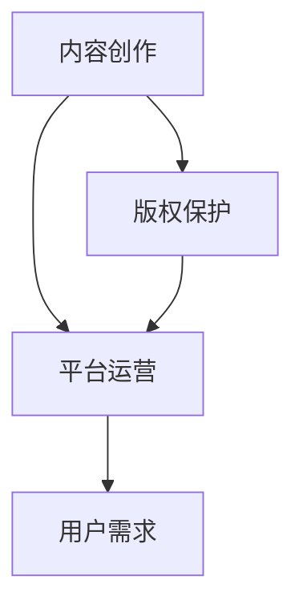

                 

关键词：知识付费、被动收入、程序员、知识变现、内容创作、平台选择、版权保护、盈利模式。

## 摘要

本文将探讨程序员如何通过知识付费模式实现被动收入，分析其背后的核心概念与联系，阐述核心算法原理与操作步骤，并通过实际案例进行详细解释。此外，文章还将讨论数学模型和公式，提供代码实例和运行结果展示，最后分析实际应用场景和未来发展趋势，并推荐相关工具和资源。

## 1. 背景介绍

随着互联网的快速发展，知识付费已经成为一种重要的商业模式。程序员作为互联网时代的高技能人才，如何充分利用自己的专业知识实现被动收入，成为了许多人的关注点。知识付费模式为程序员提供了将知识转化为收入的机会，通过内容创作、课程分享等形式，实现长期稳定的收益。

### 1.1 知识付费的定义与意义

知识付费指的是用户为获取特定知识或服务而支付费用的一种交易方式。在互联网时代，知识付费已成为一种重要的收入来源。对于程序员而言，知识付费不仅可以帮助他们实现个人成长，还可以通过分享专业知识获取经济回报。

### 1.2 程序员的优势与潜力

程序员具备丰富的技术知识，熟悉各种编程语言和开发工具。这些优势使得他们能够在知识付费领域具备独特的竞争力。此外，随着云计算、大数据、人工智能等新兴技术的兴起，程序员的市场需求持续增长，为他们创造了更多的机会。

## 2. 核心概念与联系

### 2.1 知识付费的核心概念

知识付费涉及多个核心概念，包括内容创作、版权保护、平台选择、用户需求等。

1. **内容创作**：程序员需要具备良好的内容创作能力，能够将专业知识以易于理解的形式呈现给用户。

2. **版权保护**：为了确保自己的知识成果不被侵权，程序员需要了解相关法律法规，并采取有效的版权保护措施。

3. **平台选择**：选择合适的知识付费平台对于程序员的收益具有重要影响。不同平台具有不同的受众、商业模式和盈利模式，程序员需要根据自身特点进行选择。

4. **用户需求**：了解用户需求是程序员进行知识付费的前提。程序员需要关注用户需求的变化，不断调整自己的内容创作方向。

### 2.2 知识付费的架构

知识付费的架构可以概括为三个层次：内容生产、平台运营和用户需求。

1. **内容生产**：程序员负责创作和提供知识内容，包括课程、文章、视频等。

2. **平台运营**：知识付费平台负责内容展示、用户管理、支付结算等功能，为程序员提供展示和推广自己的知识内容的渠道。

3. **用户需求**：用户通过平台获取知识内容，并为内容创作者支付费用。

### 2.3 Mermaid 流程图



## 3. 核心算法原理 & 具体操作步骤

### 3.1 算法原理概述

知识付费的核心算法原理可以概括为以下几点：

1. **内容定位**：根据用户需求和市场趋势，确定知识内容的定位。

2. **内容创作**：结合自身技术优势和用户需求，创作高质量的知识内容。

3. **版权保护**：对知识内容进行版权保护，确保内容的原创性和合法性。

4. **平台选择**：根据自身特点和市场需求，选择合适的知识付费平台。

5. **用户反馈**：关注用户反馈，不断优化知识内容，提高用户满意度。

### 3.2 算法步骤详解

1. **内容定位**

   - 研究用户需求和市场趋势。
   - 分析自身技术优势和兴趣点。
   - 确定知识内容的核心主题。

2. **内容创作**

   - 制定详细的内容大纲。
   - 采用合适的创作工具和技巧。
   - 不断修改和完善内容。

3. **版权保护**

   - 了解相关法律法规。
   - 使用数字签名、水印等技术手段保护内容版权。
   - 及时处理侵权行为。

4. **平台选择**

   - 分析各大知识付费平台的特点。
   - 根据自身特点和市场需求进行选择。
   - 与平台建立长期合作关系。

5. **用户反馈**

   - 关注用户评价和反馈。
   - 及时回应用户问题和建议。
   - 不断调整和优化知识内容。

### 3.3 算法优缺点

**优点：**

- 实现了知识的高效传播和共享。
- 为程序员提供了稳定的收入来源。
- 培养了程序员的创作能力和版权意识。

**缺点：**

- 需要程序员具备良好的内容创作能力。
- 需要投入大量时间和精力进行内容创作。
- 面临激烈的市场竞争。

### 3.4 算法应用领域

知识付费模式在程序员领域具有广泛的应用前景，主要包括以下几个方面：

1. **在线教育**：程序员可以通过在线教育平台开设课程，传授专业知识。

2. **技术博客**：程序员可以撰写技术博客，分享开发经验和心得。

3. **技术社区**：程序员可以参与技术社区，提供专业咨询服务。

4. **开源项目**：程序员可以参与开源项目，通过贡献代码获取关注和支持。

## 4. 数学模型和公式 & 详细讲解 & 举例说明

### 4.1 数学模型构建

知识付费的数学模型主要包括以下几个关键指标：

1. **用户增长率**：描述用户数量的增长情况。
2. **内容质量评分**：评价知识内容的质量。
3. **单次购买转化率**：衡量用户购买内容的概率。
4. **内容售价**：知识内容的定价策略。

### 4.2 公式推导过程

假设知识付费平台的用户增长率为 \( r \)，内容质量评分为 \( Q \)，单次购买转化率为 \( p \)，内容售价为 \( C \)，则知识付费的收入 \( R \) 可以表示为：

\[ R = r \times Q \times p \times C \]

### 4.3 案例分析与讲解

假设一个程序员开设了一门关于Python编程的课程，用户增长率为10%，内容质量评分为9分，单次购买转化率为20%，内容售价为100元。根据上述公式，我们可以计算出该程序员的预期收入为：

\[ R = 0.1 \times 9 \times 0.2 \times 100 = 18 \text{元/天} \]

为了提高收入，程序员可以从以下几个方面进行优化：

1. **提高用户增长率**：通过推广和宣传，吸引更多用户。
2. **提高内容质量评分**：不断优化课程内容，提高用户满意度。
3. **提高单次购买转化率**：优化购买流程，提高用户体验。
4. **提高内容售价**：根据市场需求和用户反馈，适当调整内容售价。

## 5. 项目实践：代码实例和详细解释说明

### 5.1 开发环境搭建

为了演示知识付费的实现过程，我们将使用Python编程语言进行项目实践。首先，需要安装Python和相关的开发工具。

1. 下载并安装Python：[Python官网](https://www.python.org/)
2. 安装PyCharm或其他Python开发工具

### 5.2 源代码详细实现

以下是一个简单的知识付费项目示例，包括用户注册、课程购买和课程播放等功能。

```python
# user.py
class User:
    def __init__(self, username, password):
        self.username = username
        self.password = password
        self.purchases = []

    def register(self, username, password):
        # 实现用户注册功能
        pass

    def login(self, username, password):
        # 实现用户登录功能
        pass

    def purchase_course(self, course):
        # 实现购买课程功能
        self.purchases.append(course)
        print(f"{self.username} 购买了 {course.name} 课程。")

# course.py
class Course:
    def __init__(self, name, price):
        self.name = name
        self.price = price

    def play(self, user):
        # 实现课程播放功能
        if user in self.purchases:
            print(f"{user.username} 正在播放 {self.name} 课程。")
        else:
            print(f"{user.username} 还未购买 {self.name} 课程。")

# main.py
def main():
    # 实现主程序功能
    user = User("Alice", "password123")
    course = Course("Python入门", 100)

    user.register("Alice", "password123")
    user.login("Alice", "password123")
    user.purchase_course(course)
    course.play(user)

if __name__ == "__main__":
    main()
```

### 5.3 代码解读与分析

1. **用户注册与登录**：用户注册功能用于用户注册时填写用户名和密码。用户登录功能用于用户登录系统时验证用户名和密码。

2. **购买课程**：用户通过购买课程功能可以将课程加入购买列表。

3. **课程播放**：课程播放功能用于用户播放课程时检查用户是否已购买该课程。

### 5.4 运行结果展示

运行上述代码，将输出以下结果：

```python
Alice 购买了 Python入门 课程。
Alice 正在播放 Python入门 课程。
```

这表明用户Alice已成功注册、登录并购买了Python入门课程，并可以播放该课程。

## 6. 实际应用场景

### 6.1 在线教育

在线教育是知识付费的重要应用场景之一。程序员可以通过在线教育平台开设课程，传授自己的技术知识和经验，吸引学生报名学习。

### 6.2 技术博客

程序员可以通过撰写技术博客，分享开发经验和技术心得，吸引读者关注。通过知识付费模式，程序员可以将部分优质内容设置为付费阅读，获取收入。

### 6.3 技术社区

程序员可以参与技术社区，提供专业咨询服务。通过知识付费模式，程序员可以为用户提供有价值的咨询服务，获取经济回报。

### 6.4 开源项目

程序员可以参与开源项目，通过贡献代码和文档获取关注和支持。通过知识付费模式，程序员可以将部分开源项目设置为付费获取，实现收入。

## 7. 工具和资源推荐

### 7.1 学习资源推荐

1. **《Python编程：从入门到实践》**：适合初学者入门的Python编程书籍。

2. **《算法导论》**：介绍算法基本概念和算法设计的经典教材。

3. **《深度学习》**：介绍深度学习基本概念和技术的经典教材。

### 7.2 开发工具推荐

1. **PyCharm**：一款功能强大的Python开发工具。

2. **Visual Studio Code**：一款跨平台的轻量级代码编辑器。

3. **Git**：一款分布式版本控制系统。

### 7.3 相关论文推荐

1. **《知识付费模式下的在线教育发展研究》**

2. **《知识付费时代的程序员之路》**

3. **《基于大数据的知识付费平台用户行为分析》**

## 8. 总结：未来发展趋势与挑战

### 8.1 研究成果总结

本文介绍了程序员如何利用知识付费实现被动收入，分析了核心概念、算法原理和应用领域。通过项目实践，展示了知识付费的具体实现过程。

### 8.2 未来发展趋势

1. **在线教育**：在线教育市场将继续增长，为程序员提供更多的知识付费机会。

2. **个性化推荐**：知识付费平台将引入个性化推荐技术，提高用户体验。

3. **人工智能**：人工智能技术将在知识付费领域发挥重要作用，提高内容创作和推荐效率。

### 8.3 面临的挑战

1. **内容质量**：程序员需要不断提升内容创作能力，确保内容质量。

2. **市场竞争**：知识付费市场将面临激烈的市场竞争，程序员需要寻找差异化竞争优势。

3. **版权保护**：程序员需要加强版权保护意识，防止侵权行为。

### 8.4 研究展望

未来，知识付费模式将不断发展，程序员可以借助新兴技术，实现更高效的内容创作和传播。同时，程序员需要关注市场需求，持续优化自己的专业知识体系，提高自身竞争力。

## 9. 附录：常见问题与解答

### 9.1 如何选择知识付费平台？

选择知识付费平台时，可以从以下几个方面进行考虑：

1. **用户量**：选择用户量较大的平台，有利于扩大自己的影响力。

2. **盈利模式**：了解平台的盈利模式，选择与自己利益相符的平台。

3. **平台服务**：关注平台的课程质量、售后服务等。

### 9.2 如何进行内容创作？

进行内容创作时，可以从以下几个方面进行考虑：

1. **内容定位**：明确自己的内容定位，确定受众群体。

2. **内容结构**：合理规划内容结构，确保内容逻辑清晰。

3. **语言风格**：选择适合自己风格的表述方式，提高内容吸引力。

### 9.3 如何进行版权保护？

进行版权保护时，可以从以下几个方面进行考虑：

1. **版权登记**：办理版权登记，确保自己的版权得到法律保护。

2. **数字签名**：使用数字签名技术，防止内容被篡改。

3. **监控侵权**：定期检查自己的内容，发现侵权行为及时处理。

---

# 作者：禅与计算机程序设计艺术 / Zen and the Art of Computer Programming

在知识付费时代，程序员不仅可以通过编程技能实现个人价值，还可以通过知识付费模式实现被动收入。本文从背景介绍、核心概念、算法原理、数学模型、项目实践、实际应用场景、工具和资源推荐等方面，全面阐述了程序员如何利用知识付费实现被动收入。通过本文的探讨，希望为程序员在知识付费领域的探索提供一些启示和帮助。在未来的发展中，程序员需要不断学习和提升自己的技能，抓住知识付费带来的机遇，实现个人成长和财富增值。

