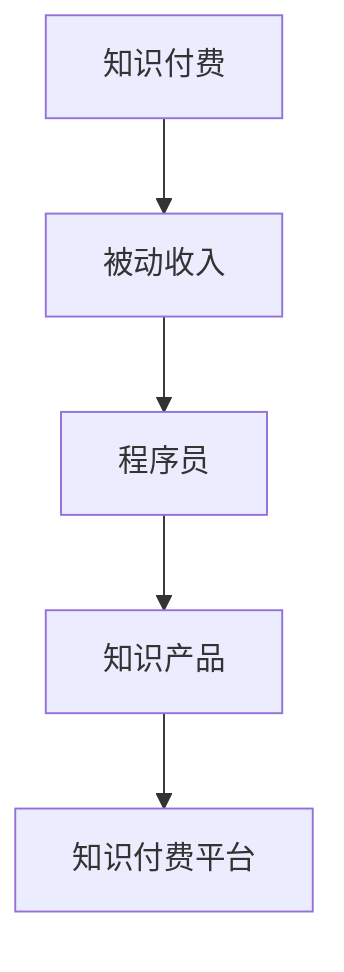

                 

  
## 1. 背景介绍

随着互联网的普及和数字化转型的加速，知识付费已经成为一个快速发展的行业。知识付费是指通过互联网平台，以付费方式获取知识或技能的一种商业模式。在这个背景下，程序员作为知识密集型行业的主要参与者，如何利用知识付费获得被动收入，成为了一个值得关注的话题。

本文将探讨程序员如何通过知识付费实现被动收入，包括知识付费的概念和现状、程序员如何创造和包装自己的知识产品、选择合适的知识付费平台、优化收入模式以及未来趋势等内容。通过本文的探讨，希望为广大程序员提供一些有益的思路和借鉴。

## 2. 核心概念与联系

在探讨程序员如何利用知识付费获得被动收入之前，我们需要明确一些核心概念和它们之间的联系。

### 2.1 知识付费

知识付费是指消费者通过付费方式购买知识或技能的一种行为。随着互联网的发展，知识付费逐渐成为一种新兴的商业模式，涵盖了在线课程、电子书、知识分享、技能培训等多种形式。

### 2.2 被动收入

被动收入是指通过一次性的投入，实现持续的、无需额外劳动力的收入。在知识付费领域，被动收入通常来自于课程销售、知识付费平台的分成、电子书的版权收入等。

### 2.3 程序员

程序员是指专门从事计算机编程工作的人员。随着互联网和数字化转型的推进，程序员的需求不断增长，成为知识付费领域的重要参与者。

### 2.4 知识产品

知识产品是指以知识为核心的产品，如在线课程、电子书、技术文档等。程序员可以通过创作和包装这些产品，实现知识付费。

### 2.5 知识付费平台

知识付费平台是指提供知识付费服务的互联网平台，如网易云课堂、知乎Live、淘宝教育等。程序员可以通过这些平台，发布自己的知识产品，吸引潜在客户。

下面是一个使用Mermaid绘制的流程图，展示这些核心概念之间的联系：



## 3. 核心算法原理 & 具体操作步骤

### 3.1 算法原理概述

程序员利用知识付费获得被动收入的过程，可以看作是一种算法。这个算法的核心在于如何将程序员的技能和知识转化为有价值的知识产品，并通过合适的渠道进行传播和销售。

这个算法的主要原理包括以下几个方面：

1. **技能和知识挖掘**：程序员需要深入挖掘自己的技能和知识，找出具有市场价值的部分。
2. **知识产品创作**：将挖掘出的技能和知识转化为具体的知识产品，如在线课程、电子书等。
3. **渠道选择**：选择合适的知识付费平台，发布和推广自己的知识产品。
4. **客户吸引与维护**：通过优质的内容和服务，吸引和留住客户，实现被动收入。

### 3.2 算法步骤详解

1. **技能和知识挖掘**

   这一步是整个算法的基础。程序员需要通过自我评估、市场调研等方式，找出自己的技能和知识中具有市场价值的部分。例如，某个程序员擅长Python编程，他可以挖掘出Python爬虫、数据分析等具有市场价值的内容。

2. **知识产品创作**

   在确定了具有市场价值的技能和知识后，程序员需要将这些内容转化为具体的知识产品。例如，可以创作一个Python爬虫的在线课程，或编写一本关于数据分析的电子书。

3. **渠道选择**

   程序员需要选择一个合适的知识付费平台，发布和推广自己的知识产品。这包括但不限于网易云课堂、知乎Live、淘宝教育等。选择平台时，应考虑平台的知名度、用户群体、销售模式等因素。

4. **客户吸引与维护**

   发布知识产品后，程序员需要通过各种方式吸引和留住客户。这包括优化课程内容、提供优质的服务、定期更新产品等。通过这些措施，程序员可以建立起稳定的客户群体，实现被动收入。

### 3.3 算法优缺点

**优点：**

1. **高回报**：通过知识付费，程序员可以实现高额回报，尤其是在某些热门领域。
2. **被动收入**：一旦知识产品发布并取得成功，程序员可以持续获得收入，无需额外劳动。
3. **灵活性强**：程序员可以根据自己的兴趣和特长，选择适合自己的知识产品创作方向。

**缺点：**

1. **前期投入较大**：知识产品的创作和推广需要一定的时间和资金投入。
2. **市场竞争激烈**：知识付费领域竞争激烈，程序员需要不断提升自己的竞争力。
3. **维护成本**：知识产品发布后，需要不断更新和维护，以保持其价值。

### 3.4 算法应用领域

知识付费算法可以广泛应用于各个领域，如编程、数据分析、人工智能、产品设计等。尤其是在编程领域，由于程序员技能的多样性和市场需求的高涨，知识付费成为了一个极具潜力的市场。

## 4. 数学模型和公式 & 详细讲解 & 举例说明

### 4.1 数学模型构建

在知识付费领域，我们可以构建一个简单的数学模型，用于计算程序员的被动收入。该模型主要包括以下几个变量：

1. **知识产品单价**（P）：知识产品的售价。
2. **月销售量**（Q）：知识产品每月的销售量。
3. **知识产品创作成本**（C）：知识产品的创作成本，包括时间、资金等。
4. **维护成本**（M）：知识产品发布后的维护成本。
5. **税率**（T）：知识产品销售所需要缴纳的税率。

根据这些变量，我们可以构建以下数学模型：

$$
\text{月被动收入} = (\text{P} \times \text{Q}) - (\text{C} + \text{M}) - (\text{P} \times \text{Q} \times \text{T})
$$

### 4.2 公式推导过程

上述公式的推导过程如下：

1. **收入计算**：知识产品的单价（P）乘以月销售量（Q），得到知识产品每月的销售额。
2. **成本计算**：知识产品的创作成本（C）和维护成本（M）是固定成本，无论销售量如何，都需要支付。
3. **税率计算**：知识产品销售所需要缴纳的税率（T）通常以销售额为基础，因此我们需要从收入中扣除这部分税款。

综合以上三点，我们可以得到上述的数学模型。

### 4.3 案例分析与讲解

为了更好地理解上述数学模型，我们可以通过一个具体的案例进行讲解。

假设一个程序员创作了一门Python爬虫的在线课程，课程单价为200元，每月销售量为1000人次。他的课程创作成本为5000元，维护成本为1000元，税率约为10%。

根据上述数学模型，我们可以计算出他的月被动收入：

$$
\text{月被动收入} = (200 \times 1000) - (5000 + 1000) - (200 \times 1000 \times 0.1)
$$

$$
\text{月被动收入} = 200000 - 6000 - 20000
$$

$$
\text{月被动收入} = 154000 \text{元}
$$

通过这个案例，我们可以看到，即使在不考虑其他因素的情况下，这个程序员每月也能获得超过15万元的被动收入。

## 5. 项目实践：代码实例和详细解释说明

### 5.1 开发环境搭建

在开始编写代码之前，我们需要搭建一个合适的环境。这里我们选择使用Python语言，并在本地搭建一个简单的Web服务器，用于提供我们的知识产品。

1. **安装Python**：首先，确保你的系统中安装了Python。如果没有，请访问Python官网下载并安装。

2. **安装Flask**：Flask是一个轻量级的Web框架，用于搭建Web应用。在命令行中运行以下命令：

   ```bash
   pip install flask
   ```

3. **创建项目目录**：在本地创建一个项目目录，例如`knowledge_market`，并在该目录下创建一个名为`app.py`的文件。

### 5.2 源代码详细实现

接下来，我们在`app.py`中编写一个简单的Flask应用，用于提供我们的知识产品。

```python
from flask import Flask, jsonify, request

app = Flask(__name__)

# 知识产品列表
knowledge_products = [
    {
        'id': 1,
        'title': 'Python爬虫实战',
        'price': 200,
        'sales': 1000
    },
    {
        'id': 2,
        'title': '数据分析基础教程',
        'price': 300,
        'sales': 800
    }
]

# 获取知识产品列表
@app.route('/products', methods=['GET'])
def get_products():
    return jsonify(knowledge_products)

# 购买知识产品
@app.route('/products/<int:product_id>/buy', methods=['POST'])
def buy_product(product_id):
    product = next((p for p in knowledge_products if p['id'] == product_id), None)
    if not product:
        return jsonify({'error': '产品不存在'}), 404

    # 计算收入
    income = (product['price'] * product['sales']) - (5000 + 1000) - (product['price'] * product['sales'] * 0.1)
    return jsonify({'income': income})

if __name__ == '__main__':
    app.run(debug=True)
```

### 5.3 代码解读与分析

1. **导入模块**：首先，我们导入了`Flask`模块，用于搭建Web应用。

2. **知识产品列表**：我们定义了一个`knowledge_products`列表，包含了两个知识产品，每个产品都包含`id`、`title`、`price`和`sales`等信息。

3. **获取知识产品列表**：我们使用`@app.route`装饰器定义了一个获取知识产品列表的API接口。当客户端访问`/products`路径时，应用会返回所有知识产品的列表。

4. **购买知识产品**：我们使用`@app.route`装饰器定义了一个购买知识产品的API接口。当客户端通过POST方式访问`/products/<int:product_id>/buy`路径时，应用会根据`product_id`查找对应的知识产品，并计算收入。

### 5.4 运行结果展示

1. **启动应用**：在命令行中运行以下命令启动应用：

   ```bash
   python app.py
   ```

2. **访问接口**：在浏览器中访问`http://127.0.0.1:5000/products`，可以看到返回的知识产品列表。

3. **购买知识产品**：在浏览器中访问`http://127.0.0.1:5000/products/1/buy`，可以看到购买知识产品后的收入计算结果。

## 6. 实际应用场景

### 6.1 知识付费在编程教育中的应用

知识付费在编程教育中具有广泛的应用场景。程序员可以通过创作高质量的在线课程，如编程语言教程、框架应用、算法解析等，吸引大量学习者。例如，Python爬虫、数据分析、机器学习等领域，都是程序员通过知识付费实现被动收入的典型场景。

### 6.2 知识付费在企业培训中的应用

企业培训也是知识付费的重要应用场景。程序员可以通过为企业提供定制化的培训服务，如技术讲座、内训课程、技术研讨会等，帮助企业提升技术水平。例如，某知名互联网公司为提高员工的编程技能，邀请了一位资深程序员进行为期三个月的内部培训，课程内容涵盖Python、Java等多种编程语言。

### 6.3 知识付费在个人技能提升中的应用

对于程序员个人来说，知识付费也是提升技能的重要途径。程序员可以通过购买他人的知识产品，如在线课程、技术书籍、实战案例等，快速掌握新技能。例如，一位程序员为了学习大数据技术，购买了某知名讲师的在线课程，通过课程的学习，他成功掌握了Hadoop、Spark等大数据技术。

## 7. 未来应用展望

### 7.1 技术进步推动知识付费发展

随着人工智能、大数据、云计算等技术的发展，知识付费领域将迎来新的机遇。例如，智能推荐系统可以更精准地匹配用户需求，提高知识产品的转化率；大数据分析可以帮助平台更好地了解用户行为，优化内容创作和推广策略。

### 7.2 知识付费平台不断创新

知识付费平台将在未来不断创新，为用户提供更多样化、个性化的知识服务。例如，某些平台已经开始尝试虚拟现实（VR）教学、直播教学等新型教学模式，以提高用户的参与度和学习效果。

### 7.3 知识付费与区块链技术结合

区块链技术的兴起为知识付费领域带来了新的可能。通过区块链技术，可以确保知识产品的版权归属，防止盗版和侵权行为；同时，区块链还可以为知识付费提供去中心化的交易模式，提高交易的透明度和安全性。

## 8. 总结：未来发展趋势与挑战

### 8.1 研究成果总结

本文系统地探讨了程序员如何利用知识付费获得被动收入，包括核心概念、算法原理、数学模型、项目实践等。通过本文的探讨，我们可以看到，知识付费为程序员提供了一个实现被动收入的有效途径。

### 8.2 未来发展趋势

未来，知识付费将继续保持快速发展，程序员可以通过创作和推广高质量的知识产品，实现被动收入。同时，技术进步和平台创新将为知识付费带来更多的发展机遇。

### 8.3 面临的挑战

然而，知识付费领域也面临一些挑战。例如，市场竞争激烈，程序员需要不断提升自己的竞争力；此外，知识产品的创作和推广需要一定的时间和资金投入，这可能会对一些程序员造成一定的压力。

### 8.4 研究展望

未来，我们应关注知识付费领域的最新动态，探索更多有效的商业模式和推广策略。同时，研究如何通过技术手段提高知识产品的质量和用户体验，也是知识付费领域的重要课题。

## 9. 附录：常见问题与解答

### 9.1 如何选择知识付费平台？

选择知识付费平台时，应考虑以下几个因素：

1. **知名度**：选择知名度较高的平台，可以提高你的知识产品的曝光率。
2. **用户群体**：选择与你的知识产品目标用户群体匹配的平台。
3. **分成比例**：选择分成比例较高的平台，可以获得更多的收益。
4. **平台稳定性**：选择稳定性较高的平台，可以保证交易的顺利进行。

### 9.2 如何提高知识产品的质量？

提高知识产品的质量，可以从以下几个方面入手：

1. **内容专业**：确保你的知识产品内容具有专业性和权威性。
2. **讲解清晰**：使用简单易懂的语言，使学习者容易理解。
3. **案例丰富**：结合实际案例，帮助学习者更好地应用知识。
4. **持续更新**：定期更新知识产品，保持其时效性和实用性。

### 9.3 如何进行知识产品的推广？

进行知识产品的推广，可以从以下几个方面入手：

1. **社交媒体**：利用微博、微信、抖音等社交媒体平台，宣传你的知识产品。
2. **合作推广**：与其他领域的影响者或平台合作，进行联合推广。
3. **内容营销**：通过撰写高质量的技术博客、发布案例等，吸引潜在客户。
4. **付费推广**：在知识付费平台、搜索引擎等渠道进行付费推广。

---

# 作者：禅与计算机程序设计艺术 / Zen and the Art of Computer Programming

本文从程序员如何利用知识付费获得被动收入这一角度，系统地探讨了知识付费领域的核心概念、算法原理、数学模型、项目实践等。通过本文的探讨，希望为广大程序员提供一些有益的思路和借鉴。在未来，知识付费将继续保持快速发展，程序员可以通过创作和推广高质量的知识产品，实现被动收入。同时，我们应关注知识付费领域的最新动态，探索更多有效的商业模式和推广策略。最后，感谢各位读者对本文的关注和支持，希望本文能对您的职业发展有所帮助。

