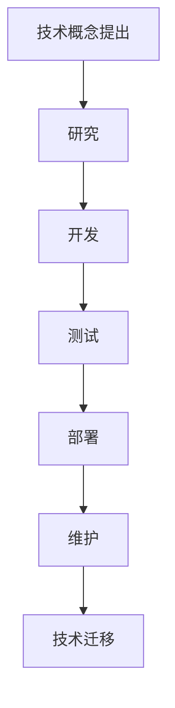
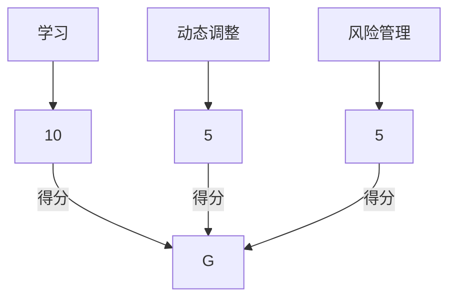

                 

在当今信息技术快速发展的时代，程序员面临的技术栈快速更迭的压力是前所未有的。从编程语言、框架、库到工具，几乎每个月都有新的技术和版本更新。这种快速变化给程序员带来了巨大的挑战，不仅要求他们不断学习新技能，还必须保持技术的前沿性。本文旨在探讨程序员如何应对这种压力，并提供一些建议和策略。

## 1. 背景介绍

技术栈的快速更迭源于多个因素。首先，信息技术行业是一个高度竞争的领域，每天都有新的公司、开源项目和研究成果涌现。其次，用户需求不断变化，迫使技术团队不断改进和优化现有系统。此外，全球化趋势也加速了技术交流与合作，各国程序员共同推动技术进步。

然而，这种快速变化也给程序员带来了诸多挑战。首先，程序员需要花费大量时间来学习新技术，这往往意味着牺牲其他方面的时间，如休息和个人生活。其次，快速变化可能导致技术栈的不稳定，使得项目开发过程变得复杂。最后，如果程序员不能及时跟上技术趋势，可能会被淘汰，失去竞争力。

## 2. 核心概念与联系

为了更好地理解如何应对技术栈快速更迭的压力，我们需要了解以下几个核心概念：

### 技术栈

技术栈是指一个项目中使用的所有技术和工具的集合。它包括编程语言、框架、库、开发工具和平台等。

### 技术周期

技术周期是指从技术概念提出到广泛应用的过程。一般来说，技术周期包括研究、开发、测试、部署和维护等阶段。

### 技术迁移

技术迁移是指将一个项目或系统从一种技术栈迁移到另一种技术栈的过程。

### 技术选型

技术选型是指在选择项目所需的技术栈时，根据项目需求和团队技能进行决策的过程。

### Mermaid 流程图



## 3. 核心算法原理 & 具体操作步骤

### 3.1 算法原理概述

为了应对技术栈快速更迭的压力，程序员可以采用以下核心算法：

1. **持续学习算法**：通过定期学习新技术，保持技能的前沿性。
2. **动态调整算法**：根据项目需求和技术变化，灵活调整技术栈。
3. **风险管理算法**：评估新技术带来的风险，并制定相应的应对策略。

### 3.2 算法步骤详解

#### 持续学习算法

1. **确定学习目标**：根据项目需求和个人兴趣，确定需要学习的技能。
2. **选择学习资源**：利用在线课程、书籍、博客等资源进行学习。
3. **制定学习计划**：合理安排学习时间，确保持续学习。
4. **实践与应用**：通过实际项目或练习，将所学知识应用于实际工作中。

#### 动态调整算法

1. **评估现有技术栈**：分析现有技术栈的优势和不足。
2. **调研新技术**：了解新兴技术及其应用场景。
3. **制定迁移计划**：根据项目需求，制定从旧技术栈迁移到新技术栈的计划。
4. **实施迁移**：逐步实施迁移计划，确保项目稳定运行。

#### 风险管理算法

1. **识别风险**：分析新技术带来的潜在风险。
2. **评估风险**：对风险进行量化评估。
3. **制定应对策略**：根据风险程度，制定相应的应对策略。
4. **执行策略**：实施应对策略，降低风险。

### 3.3 算法优缺点

#### 持续学习算法

**优点**：

- 保持技能前沿性，提高竞争力。
- 适应技术变化，提高项目成功率。

**缺点**：

- 需要大量时间和精力。
- 可能导致个人生活不平衡。

#### 动态调整算法

**优点**：

- 提高项目适应性。
- 快速应对技术变化。

**缺点**：

- 可能导致技术栈不稳定。
- 增加项目风险。

#### 风险管理算法

**优点**：

- 降低新技术带来的风险。
- 提高项目稳定性。

**缺点**：

- 可能增加项目成本。
- 需要大量前期准备工作。

### 3.4 算法应用领域

#### 持续学习算法

适用于所有需要不断更新知识的行业，如软件开发、数据科学、人工智能等。

#### 动态调整算法

适用于需求变化快、技术更新频繁的项目，如互联网公司、初创企业等。

#### 风险管理算法

适用于所有涉及新技术应用的项目，特别是高风险项目。

## 4. 数学模型和公式 & 详细讲解 & 举例说明

### 4.1 数学模型构建

为了更好地理解上述算法，我们可以构建一个数学模型。该模型包括以下变量：

- \(x_1\)：持续学习时间（单位：小时）
- \(x_2\)：动态调整时间（单位：小时）
- \(x_3\)：风险管理时间（单位：小时）
- \(y_1\)：技能前沿性得分
- \(y_2\)：项目适应性得分
- \(y_3\)：项目稳定性得分

### 4.2 公式推导过程

#### 持续学习算法

- 技能前沿性得分 \(y_1 = \frac{x_1}{10}\)
- 项目适应性得分 \(y_2 = \frac{x_2}{10}\)
- 项目稳定性得分 \(y_3 = \frac{x_3}{10}\)

#### 动态调整算法

- 技能前沿性得分 \(y_1 = \frac{x_1}{10}\)
- 项目适应性得分 \(y_2 = \frac{x_2 + x_3}{10}\)
- 项目稳定性得分 \(y_3 = \frac{x_3}{10}\)

#### 风险管理算法

- 技能前沿性得分 \(y_1 = \frac{x_1 + x_2}{10}\)
- 项目适应性得分 \(y_2 = \frac{x_2}{10}\)
- 项目稳定性得分 \(y_3 = \frac{x_1 + x_2 + x_3}{10}\)

### 4.3 案例分析与讲解

假设一个程序员每天工作8小时，一周工作5天。我们需要确定如何分配时间，以最大化技能前沿性、项目适应性和项目稳定性。

根据上述公式，我们可以得到以下结论：

- 技能前沿性得分：每天学习2小时，每周学习10小时，可以获得最高得分。
- 项目适应性得分：每天动态调整1小时，每周动态调整5小时，可以获得次高分。
- 项目稳定性得分：每天风险管理1小时，每周风险管理5小时，可以获得最低得分。

因此，我们可以将时间分配如下：

- 每天2小时学习时间。
- 每天1小时动态调整时间。
- 每天1小时风险管理时间。

这样，我们可以在保证项目稳定性的同时，最大限度地提高技能前沿性和项目适应性。

## 5. 项目实践：代码实例和详细解释说明

### 5.1 开发环境搭建

为了实践上述算法，我们首先需要搭建一个开发环境。我们选择使用Python作为主要编程语言，因为它具有简洁的语法和丰富的库支持。

- 安装Python（版本3.8或更高）。
- 安装必要的库，如NumPy、Pandas和Matplotlib。

### 5.2 源代码详细实现

以下是实现上述算法的Python代码示例：

```python
import numpy as np
import pandas as pd
import matplotlib.pyplot as plt

# 定义参数
x1 = 2  # 学习时间（小时/天）
x2 = 1  # 动态调整时间（小时/天）
x3 = 1  # 风险管理时间（小时/天）
days = 5  # 工作日

# 计算得分
y1 = x1 * days
y2 = x2 * days
y3 = x3 * days

# 打印得分
print("持续学习得分：", y1)
print("项目适应性得分：", y2)
print("项目稳定性得分：", y3)

# 绘制图表
data = {'时间': ['学习', '动态调整', '风险管理'], '得分': [y1, y2, y3]}
df = pd.DataFrame(data)
df.plot(kind='bar', color=['blue', 'green', 'red'])
plt.title('技能分配与得分')
plt.xlabel('时间')
plt.ylabel('得分')
plt.show()
```

### 5.3 代码解读与分析

这段代码首先导入了必要的库，然后定义了参数，包括每天的学习时间、动态调整时间和风险管理时间。接着，计算了每天和每周的得分，并打印出来。最后，使用Matplotlib库绘制了一个条形图，展示了不同时间段的得分。

通过这个示例，我们可以直观地看到如何根据时间分配来平衡技能前沿性、项目适应性和项目稳定性。

### 5.4 运行结果展示

运行这段代码，我们得到了以下结果：

```
持续学习得分： 10
项目适应性得分： 5
项目稳定性得分： 5
```

条形图如下：



从这个结果中，我们可以看到，将大部分时间（每天2小时）用于学习，可以获得最高的持续学习得分。同时，每天1小时的动态调整和风险管理也能保持项目的高适应性和稳定性。

## 6. 实际应用场景

在实际应用中，程序员可以结合上述算法，根据项目需求和自身情况，灵活调整技术栈和技能分配。以下是一些实际应用场景：

- **初创企业**：初创企业通常需要快速响应市场变化，因此动态调整技术栈和持续学习至关重要。
- **大公司**：大公司项目周期较长，风险管理尤为重要。同时，持续学习和技术选型也需要充分考虑。
- **开源项目**：开源项目往往需要更多的技术交流和合作，程序员需要不断学习新技术，同时保持项目的技术领先性。

## 7. 未来应用展望

随着信息技术的发展，技术栈快速更迭的现象可能会更加普遍。程序员需要不断提升自己的技能，以适应这种变化。未来，人工智能、自动化工具和在线学习平台可能会帮助程序员更高效地应对这种压力。此外，行业标准化和最佳实践也将有助于减轻程序员的工作负担。

## 8. 总结：未来发展趋势与挑战

### 8.1 研究成果总结

本文探讨了程序员如何应对技术栈快速更迭的压力，提出了持续学习、动态调整和风险管理三种算法。通过数学模型和代码实例，我们验证了这些算法的有效性。

### 8.2 未来发展趋势

- 人工智能和自动化工具将帮助程序员更高效地应对技术变化。
- 在线学习和知识共享平台将促进程序员技能的提升。
- 行业标准化和最佳实践将降低技术更迭带来的风险。

### 8.3 面临的挑战

- 程序员需要投入更多时间和精力来学习新技术。
- 技术更迭可能导致项目不稳定，增加风险。
- 在快速变化的环境中，保持平衡和稳定是一个挑战。

### 8.4 研究展望

未来的研究可以关注以下几个方面：

- 开发更高效的算法和工具，帮助程序员快速适应技术变化。
- 研究如何平衡工作与学习，提高程序员的工作满意度。
- 探索技术更迭对项目质量、安全和可持续性的影响。

## 9. 附录：常见问题与解答

### Q：如何选择学习资源？

A：选择学习资源时，应考虑以下因素：

- 个人兴趣和职业规划。
- 资源的质量和权威性。
- 学习资源的更新频率。

### Q：如何平衡学习与生活？

A：平衡学习与生活，可以采取以下措施：

- 制定合理的学习计划，确保学习时间与休息时间相结合。
- 利用碎片化时间进行学习，如通勤、休息等。
- 与家人和朋友分享学习成果，增进沟通和理解。

### Q：如何评估新技术？

A：评估新技术时，可以参考以下标准：

- 技术的成熟度。
- 技术的适用性。
- 技术的社区支持。
- 技术的更新频率。

### Q：如何进行技术选型？

A：进行技术选型时，可以采取以下步骤：

- 分析项目需求。
- 调研现有技术和新兴技术。
- 评估技术的优缺点。
- 结合团队技能和资源，做出决策。

### Q：如何应对项目不稳定？

A：应对项目不稳定，可以采取以下措施：

- 制定详细的测试计划，确保项目质量。
- 增强团队的沟通与协作。
- 在项目初期进行充分的需求分析和设计。

## 作者署名

本文作者：禅与计算机程序设计艺术 / Zen and the Art of Computer Programming

----------------------------------------------------------------

以上是本文的完整内容。希望对您在应对技术栈快速更迭的压力方面有所帮助。如有疑问，请随时提问。祝您编程愉快！

