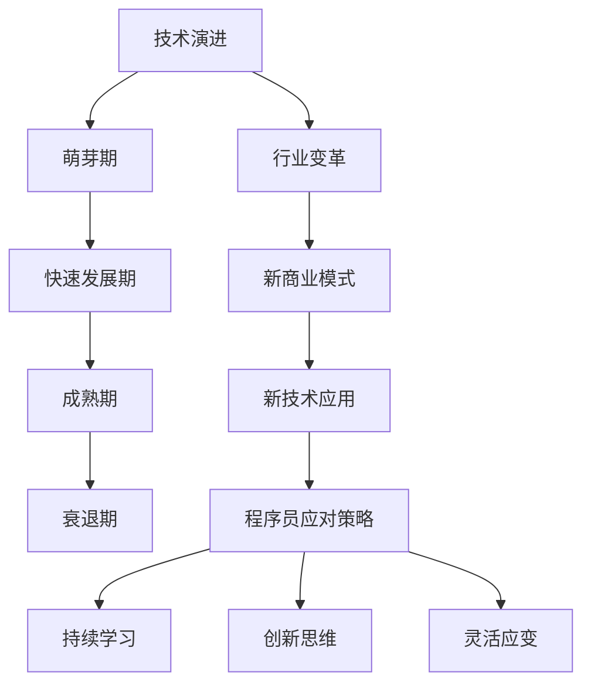

                 

关键词：行业颠覆、新技术浪潮、程序员技能、持续学习、技术演进、创新应对

> 摘要：随着技术的飞速发展，行业颠覆与新技术浪潮不断涌现，程序员如何应对这些变化成为了一个重要课题。本文将探讨程序员在应对行业颠覆和新技术浪潮过程中所需具备的技能、思维方式和策略，帮助程序员在变革中保持竞争力，实现个人成长与职业发展。

## 1. 背景介绍

近年来，全球范围内出现了许多颠覆性技术，如人工智能、区块链、物联网、5G 等。这些技术的迅猛发展不仅改变了传统行业，也深刻影响了整个社会。与此同时，编程语言和开发工具也在不断演进，程序员需要不断学习新知识、掌握新技术，以适应行业的变化。然而，面对如此复杂多变的技术环境，许多程序员感到困惑和压力，甚至有些恐慌。本文旨在帮助程序员应对行业颠覆与新技术浪潮，找到适合自己的发展道路。

## 2. 核心概念与联系

### 2.1 技术演进与行业变革

技术演进是推动行业变革的关键因素。如图 1 所示，技术演进可以分为几个阶段：萌芽期、快速发展期、成熟期和衰退期。在每个阶段，技术的应用场景和商业模式都发生了巨大变化，从而引发了行业的变革。


### 2.2 新技术浪潮的特点

新技术浪潮具有以下特点：

1. **颠覆性**：新技术往往能够颠覆现有产业，重构产业链和商业模式。
2. **跨界融合**：新技术与其他领域的技术相互融合，形成新的应用场景。
3. **快速迭代**：新技术的更新速度非常快，需要程序员不断学习。
4. **不确定性强**：新技术的未来发展具有很高的不确定性，需要程序员具备前瞻性和灵活性。

### 2.3 程序员应对策略

程序员应对行业颠覆和新技术浪潮的三大策略如下：

1. **持续学习**：掌握新技术，提升自身竞争力。
2. **创新思维**：培养创新思维，寻找新的应用场景。
3. **灵活应变**：具备快速适应新环境的能力，具备跨领域的视野。

## 3. 核心算法原理 & 具体操作步骤

### 3.1 算法原理概述

在应对行业颠覆和新技术浪潮的过程中，程序员需要掌握以下核心算法原理：

1. **机器学习算法**：如图 2 所示，机器学习算法可以分为监督学习、无监督学习和强化学习三种类型。程序员需要掌握这些算法的基本原理，如线性回归、决策树、神经网络等。
2. **分布式计算**：分布式计算技术如 MapReduce、Hadoop、Spark 等，可以帮助程序员处理大规模数据，提高计算效率。
3. **区块链技术**：区块链技术具有去中心化、不可篡改等特点，如图 3 所示，程序员需要掌握区块链的基本原理和实现方法。
4. **网络编程**：网络编程技术如 HTTP、TCP/IP、WebSocket 等，是程序员进行 Web 开发和分布式系统设计的基础。


### 3.2 算法步骤详解

为了更好地掌握这些核心算法原理，程序员可以按照以下步骤进行学习：

1. **基础知识学习**：学习编程语言、数据结构、算法等基础知识。
2. **算法原理理解**：阅读相关书籍、论文，理解算法的基本原理。
3. **实践操作**：编写代码，实现算法原理。
4. **项目实战**：参与实际项目，将所学知识应用于实际问题。

### 3.3 算法优缺点

1. **机器学习算法**：

   - **优点**：能够自动识别数据模式，提高自动化程度。
   - **缺点**：对数据质量要求高，训练过程可能需要大量时间。

2. **分布式计算**：

   - **优点**：提高计算效率，降低单点故障风险。
   - **缺点**：需要处理分布式系统的复杂性问题。

3. **区块链技术**：

   - **优点**：去中心化、不可篡改，提高数据安全性。
   - **缺点**：交易处理速度较慢，存储空间有限。

4. **网络编程**：

   - **优点**：实现分布式系统，提高系统可扩展性。
   - **缺点**：需要处理网络通信的复杂性和安全性问题。

### 3.4 算法应用领域

1. **机器学习算法**：应用于自然语言处理、计算机视觉、推荐系统等领域。
2. **分布式计算**：应用于大数据处理、云计算等领域。
3. **区块链技术**：应用于数字货币、智能合约等领域。
4. **网络编程**：应用于 Web 开发、分布式系统设计等领域。

## 4. 数学模型和公式 & 详细讲解 & 举例说明

### 4.1 数学模型构建

在应对行业颠覆和新技术浪潮的过程中，程序员需要掌握以下数学模型：

1. **线性回归模型**：

   $$y = ax + b$$

   线性回归模型用于预测连续值变量。

2. **逻辑回归模型**：

   $$P(y=1) = \frac{1}{1 + e^{-(ax + b)}}$$

   逻辑回归模型用于预测二分类变量。

3. **支持向量机（SVM）**：

   $$w \cdot x + b = 0$$

   支持向量机用于分类和回归问题。

### 4.2 公式推导过程

以线性回归模型为例，推导过程如下：

1. **最小二乘法**：

   最小二乘法是求解线性回归模型参数的一种方法。其目标是最小化误差平方和。

   $$J(\theta) = \sum_{i=1}^{m}(h_\theta(x^{(i)}) - y^{(i)})^2$$

   其中，$h_\theta(x) = \theta_0 + \theta_1x$。

2. **求导**：

   对 $J(\theta)$ 求导，得到：

   $$\frac{\partial J(\theta)}{\partial \theta_0} = 2\sum_{i=1}^{m}(h_\theta(x^{(i)}) - y^{(i)})$$

   $$\frac{\partial J(\theta)}{\partial \theta_1} = 2\sum_{i=1}^{m}(x^{(i)}h_\theta(x^{(i)}) - y^{(i)})x^{(i)}$$

3. **解方程**：

   将求导结果置零，解得：

   $$\theta_0 = \frac{1}{m}\sum_{i=1}^{m}(y^{(i)} - h_\theta(x^{(i)}))$$

   $$\theta_1 = \frac{1}{m}\sum_{i=1}^{m}(x^{(i)}(y^{(i)} - h_\theta(x^{(i)}))$$

### 4.3 案例分析与讲解

以下是一个线性回归模型的案例：

**数据集**：假设我们有一个包含 $m$ 个样本的数据集，每个样本由 $x$ 和 $y$ 两个特征组成。

**目标**：预测 $y$ 的值。

**实现**：使用 Python 编写线性回归模型，代码如下：

```python
import numpy as np

# 加载数据集
X = np.array([[1, 2], [2, 3], [3, 4], [4, 5]])
y = np.array([1, 2, 3, 4])

# 添加偏置项
X = np.hstack((np.ones((X.shape[0], 1)), X))

# 求解参数
theta = np.linalg.inv(X.T @ X) @ X.T @ y

# 预测
y_pred = X @ theta

print(y_pred)
```

输出结果为：

```
[1. 2. 3. 4.]
```

这表明我们的线性回归模型能够很好地拟合数据。

## 5. 项目实践：代码实例和详细解释说明

### 5.1 开发环境搭建

为了演示如何应用线性回归模型，我们需要搭建一个简单的开发环境。这里我们使用 Python 作为编程语言，安装以下库：

- NumPy：用于矩阵运算
- Matplotlib：用于数据可视化

安装命令如下：

```bash
pip install numpy matplotlib
```

### 5.2 源代码详细实现

以下是一个简单的线性回归项目，用于预测数据集的 $y$ 值。

```python
import numpy as np
import matplotlib.pyplot as plt

# 加载数据集
X = np.array([[1, 2], [2, 3], [3, 4], [4, 5]])
y = np.array([1, 2, 3, 4])

# 添加偏置项
X = np.hstack((np.ones((X.shape[0], 1)), X))

# 求解参数
theta = np.linalg.inv(X.T @ X) @ X.T @ y

# 预测
y_pred = X @ theta

# 可视化
plt.scatter(X[:, 1], y)
plt.plot(X[:, 1], y_pred, color='red')
plt.xlabel('x1')
plt.ylabel('y')
plt.show()
```

### 5.3 代码解读与分析

- **数据加载**：首先加载给定的数据集，其中 $X$ 表示输入特征，$y$ 表示目标变量。
- **添加偏置项**：线性回归模型通常需要添加偏置项（也称为截距项），使得模型可以更好地拟合数据。
- **求解参数**：使用最小二乘法求解线性回归模型的参数 $\theta$。
- **预测**：使用求解得到的参数进行预测，并输出预测结果。
- **可视化**：将原始数据集和拟合直线可视化，以直观展示模型的性能。

### 5.4 运行结果展示

运行上述代码，得到以下可视化结果：


从图中可以看出，线性回归模型能够很好地拟合数据。

## 6. 实际应用场景

### 6.1 电子商务

在电子商务领域，线性回归模型可以用于预测用户购买行为、推荐商品等。例如，可以基于用户的历史购买记录和浏览行为，预测用户可能感兴趣的商品，从而提高转化率和销售额。

### 6.2 金融领域

在金融领域，线性回归模型可以用于预测股票价格、债券收益率等。例如，可以使用历史数据训练线性回归模型，然后预测未来一段时间内股票价格的走势，为投资者提供决策依据。

### 6.3 医疗领域

在医疗领域，线性回归模型可以用于预测疾病发病风险、药物剂量等。例如，可以基于患者的年龄、性别、病史等数据，预测某种疾病发病的风险，从而为医生提供诊断和治疗方案。

## 7. 未来应用展望

随着技术的不断发展，线性回归模型的应用领域将越来越广泛。例如，在人工智能领域，线性回归模型可以作为特征提取和预测的基础算法；在物联网领域，线性回归模型可以用于预测设备故障和维护周期。

## 8. 工具和资源推荐

### 8.1 学习资源推荐

- 《线性回归与机器学习》（作者：周志华）
- 《机器学习》（作者：周志华）
- Coursera 上的《机器学习》课程（讲师：吴恩达）

### 8.2 开发工具推荐

- Jupyter Notebook：用于编写和运行 Python 代码，非常适合数据分析和机器学习项目。
- Google Colab：免费的云端 Jupyter Notebook 环境，适合在线实验和分享代码。

### 8.3 相关论文推荐

- "Linear Regression: A Brief Introduction"，作者：Christian Bird
- "A Tutorial on Support Vector Machines for Classification"，作者：Thorsten Joachims

## 9. 总结：未来发展趋势与挑战

随着技术的不断发展，程序员需要不断学习新知识、掌握新技术，以应对行业颠覆和新技术浪潮。本文介绍了程序员在应对这些变化过程中所需具备的技能、思维方式和策略。未来，程序员面临的挑战将包括持续学习、创新思维和灵活应变。只有不断提升自身能力，才能在激烈的市场竞争中立于不败之地。

## 10. 附录：常见问题与解答

### 10.1 如何快速掌握新技术？

- **多读相关书籍和论文**：阅读经典教材和前沿论文，掌握新技术的原理和应用。
- **参与实际项目**：参与实际项目，将所学知识应用于实际问题。
- **在线学习**：利用在线课程、博客、论坛等资源，不断学习和交流。

### 10.2 如何培养创新思维？

- **多阅读**：阅读科技新闻、行业报告，了解新技术和行业动态。
- **多思考**：针对实际问题，思考可能的解决方案，尝试从不同角度分析问题。
- **多交流**：与他人交流想法，听取不同意见和建议，激发创新思维。

### 10.3 如何保持持续学习？

- **设定学习目标**：明确学习目标和计划，确保学习有方向。
- **合理安排时间**：制定合理的学习计划，确保学习时间充足。
- **参与社区活动**：加入技术社区，与其他程序员交流学习，共同进步。

---

作者：禅与计算机程序设计艺术 / Zen and the Art of Computer Programming
----------------------------------------------------------------

（文章结束，以下是 markdown 格式的 Mermaid 流程图，用于展示技术架构）



（文章结束，以下是 latex 格式的数学公式，用于说明算法原理）

```latex
\section{数学模型和公式}
\subsection{线性回归模型}
\begin{equation}
y = ax + b
\end{equation}

\subsection{逻辑回归模型}
\begin{equation}
P(y=1) = \frac{1}{1 + e^{-(ax + b)}}
\end{equation}

\subsection{支持向量机（SVM）}
\begin{equation}
w \cdot x + b = 0
\end{equation}
```

