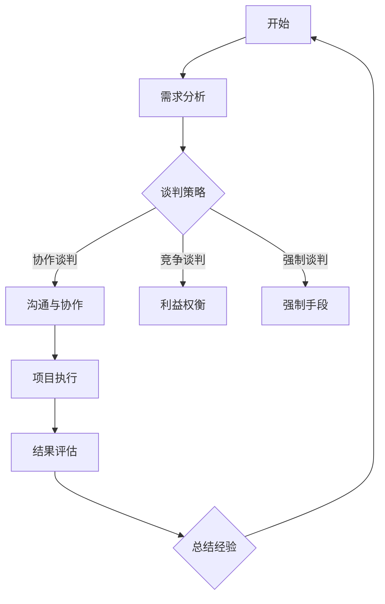

                 

关键词：程序员、谈判技巧、沟通、策略、项目管理、团队协作

> 摘要：本文旨在探讨程序员在日常工作和项目中如何提升谈判技巧，以更好地完成项目任务，提升个人和团队效率。通过理解谈判的本质，应用有效的沟通策略，以及掌握项目管理和团队协作的方法，程序员可以成为更优秀的谈判者。

## 1. 背景介绍

在信息技术快速发展的今天，程序员的角色日益重要。他们不仅是编写代码的高手，更是项目管理和团队协作的关键参与者。随着项目复杂度的增加，程序员需要与团队成员、客户和其他利益相关者进行频繁的沟通和谈判，以确保项目目标的实现。然而，许多程序员并没有接受过专业的谈判技巧培训，导致在谈判过程中缺乏策略和方法，影响了项目进度和团队协作。

本文将探讨以下几个方面的内容：

- **谈判技巧的重要性**：解释为什么谈判技巧对于程序员至关重要。
- **谈判的基本原则**：介绍在谈判中应该遵循的基本原则。
- **沟通策略**：探讨如何通过有效沟通来提高谈判效果。
- **项目管理和团队协作**：分析如何通过管理和协作来提升谈判能力。
- **实践案例**：提供一些实际案例来展示如何应用谈判技巧。
- **工具和资源推荐**：推荐一些可以帮助程序员提升谈判技巧的学习资源和工具。

通过本文的阅读，程序员可以了解如何将技术背景和谈判技巧结合起来，提高个人和团队的工作效率。

## 2. 核心概念与联系

### 2.1 谈判的定义与类型

谈判是一种通过交流和协商来解决分歧、达成共识的过程。它可以是正式的，如商务谈判、合同签订，也可以是非正式的，如团队内部的决策制定。根据谈判的目标和方式，可以分为以下几种类型：

- **协作谈判**：双方寻求共同利益，通过合作解决问题。
- **竞争谈判**：双方追求各自利益最大化，可能涉及利益的权衡和妥协。
- **强制谈判**：一方通过强制手段迫使他方接受条件。

### 2.2 沟通的重要性

沟通是谈判的基础。有效的沟通不仅能够传达信息，还能建立信任和理解。对于程序员而言，沟通能力决定了他们在项目中的表现。良好的沟通能够：

- 减少误解和冲突。
- 提高团队的协作效率。
- 增强项目的透明度。
- 提升谈判的成功率。

### 2.3 项目管理与团队协作

项目管理是确保项目按计划完成的过程，而团队协作是实现项目目标的关键。对于程序员来说，项目管理涉及到：

- 项目规划：明确项目目标、范围、时间和资源。
- 风险管理：识别潜在问题并制定应对策略。
- 质量控制：确保项目输出满足预定的质量标准。

团队协作则包括：

- 分工合作：明确团队成员的职责和任务。
- 信息共享：确保团队成员之间的信息流通。
- 冲突解决：及时解决团队内部的分歧。

### 2.4 Mermaid 流程图

以下是谈判技巧在程序员工作中的流程图：



### 2.5 谈判技巧的重要性

对于程序员而言，谈判技巧的重要性体现在以下几个方面：

- **项目成功**：有效的谈判能够确保项目目标的实现，减少延期和超支。
- **团队和谐**：通过谈判解决分歧，提高团队凝聚力和工作效率。
- **个人成长**：谈判能力的提升有助于个人职业发展和领导力的培养。
- **资源获取**：在资源有限的情况下，谈判技巧有助于获取更多的支持和资源。

## 3. 核心算法原理 & 具体操作步骤

### 3.1 算法原理概述

谈判技巧的提升需要基于以下几个核心原理：

- **需求分析**：理解双方的需求和利益点。
- **信息收集**：获取尽可能多的信息，以便做出明智的决策。
- **策略制定**：根据需求和信息，制定相应的谈判策略。
- **沟通技巧**：有效沟通是谈判成功的关键。
- **利益权衡**：在双方利益之间找到平衡点。

### 3.2 算法步骤详解

#### 3.2.1 需求分析

1. **识别利益相关者**：确定项目中的关键利益相关者，包括团队成员、客户和第三方供应商。
2. **收集需求信息**：通过与利益相关者的沟通，收集他们的需求和期望。
3. **分析需求差异**：识别不同利益相关者之间的需求差异，为谈判做好准备。

#### 3.2.2 信息收集

1. **内部信息**：收集项目团队内部的相关信息，包括技术能力、资源状况和项目管理经验。
2. **外部信息**：了解市场需求、竞争对手情况和技术发展趋势。

#### 3.2.3 策略制定

1. **制定谈判目标**：明确谈判的目标和期望结果。
2. **选择谈判策略**：根据需求和信息的分析，选择最合适的谈判策略，如协作谈判、竞争谈判或强制谈判。
3. **制定应对方案**：为可能出现的谈判结果制定相应的应对策略。

#### 3.2.4 沟通技巧

1. **建立信任**：通过积极的沟通和合作，建立与利益相关者的信任关系。
2. **有效表达**：清晰、准确地表达自己的观点和需求。
3. **倾听与反馈**：认真倾听对方的意见，并及时给予反馈。

#### 3.2.5 利益权衡

1. **权衡利弊**：在双方利益之间找到平衡点，确保谈判的双赢。
2. **灵活调整**：在谈判过程中，根据实际情况灵活调整谈判策略。

### 3.3 算法优缺点

#### 优点：

- **提高谈判成功率**：基于需求和信息的分析，制定合理的谈判策略，有助于提高谈判的成功率。
- **增强团队协作**：通过有效的沟通和协作，增强团队凝聚力和工作效率。
- **资源优化**：在资源有限的情况下，通过谈判获取更多的支持和资源。

#### 缺点：

- **谈判成本高**：谈判需要投入大量的时间和精力，可能会影响项目的进度。
- **信息不对称**：在信息不对称的情况下，可能导致谈判结果的不公平。

### 3.4 算法应用领域

- **项目管理和团队协作**：在项目管理过程中，谈判技巧有助于解决团队内部的分歧和冲突，提高项目成功率。
- **商务谈判**：在商务活动中，谈判技巧有助于获取更多的商业机会和资源。
- **个人发展**：谈判能力的提升有助于个人职业发展和领导力的培养。

## 4. 数学模型和公式 & 详细讲解 & 举例说明

### 4.1 数学模型构建

在谈判中，我们可以使用一些基本的数学模型来分析和解决问题。以下是一个简单的谈判模型：

设：

- \( x \) 为程序员的需求（如工作时间、资源等）
- \( y \) 为对方的需求（如项目完成时间、预算等）
- \( a \) 为程序员的谈判策略（如合作、竞争等）
- \( b \) 为对方的谈判策略

则谈判的结果可以用以下公式表示：

\[ R = \frac{ax + by}{a + b} \]

其中，\( R \) 为谈判的结果，表示双方利益的平衡点。

### 4.2 公式推导过程

假设双方都在追求各自的最大利益，即最大化自己的利益。我们可以使用线性规划的方法来推导谈判公式。

设：

- \( U \) 为程序员的利益函数
- \( V \) 为对方的利益函数

则：

\[ U = ax - cy \]
\[ V = bx - dy \]

其中，\( c \) 和 \( d \) 分别为程序员的成本和对方的成本。

为了最大化 \( U \) 和 \( V \)，我们可以使用拉格朗日乘数法。

\[ L = U + \lambda(V - U) \]

其中，\( \lambda \) 为拉格朗日乘数。

求导得到：

\[ \frac{\partial L}{\partial x} = a - \lambda d = 0 \]
\[ \frac{\partial L}{\partial y} = -c + \lambda b = 0 \]

解得：

\[ \lambda = \frac{a d}{b c} \]

代入 \( U \) 和 \( V \) 得：

\[ U = \frac{a b c}{b c + d a} \]
\[ V = \frac{b c d}{b c + d a} \]

则谈判结果 \( R \) 为：

\[ R = \frac{U + V}{2} = \frac{a b c + b c d}{2(b c + d a)} \]

化简得：

\[ R = \frac{a x + b y}{a + b} \]

### 4.3 案例分析与讲解

假设一个程序员与客户进行项目谈判，程序员希望获得更多的时间来完成项目，而客户希望项目能在更短的时间内完成。

- \( x = 3 \)（程序员的需求，即项目完成时间）
- \( y = 2 \)（客户的需求，即客户希望的完成时间）
- \( a = 1 \)（程序员的谈判策略，即合作的概率）
- \( b = 1 \)（客户的谈判策略，即竞争的概率）

代入公式：

\[ R = \frac{1 \times 3 + 1 \times 2}{1 + 1} = \frac{5}{2} = 2.5 \]

这意味着在双方的利益平衡点，项目的完成时间为2.5个月。

### 4.4 谈判技巧在项目中的应用

- **需求分析**：通过需求分析，了解双方的需求和利益点，为谈判奠定基础。
- **信息收集**：收集项目团队和客户的相关信息，为制定谈判策略提供依据。
- **策略制定**：根据需求和信息的分析，选择合适的谈判策略，如协作谈判、竞争谈判或强制谈判。
- **沟通技巧**：通过有效的沟通，建立与客户和团队的信任关系，提高谈判成功率。
- **利益权衡**：在双方利益之间找到平衡点，确保谈判的双赢。

## 5. 项目实践：代码实例和详细解释说明

### 5.1 开发环境搭建

为了更好地展示谈判技巧在项目中的应用，我们将使用Python编写一个简单的项目谈判模拟程序。首先，确保您的环境中安装了Python和相关的库。

```bash
pip install matplotlib numpy
```

### 5.2 源代码详细实现

以下是谈判模拟程序的源代码：

```python
import matplotlib.pyplot as plt
import numpy as np

def negotiate(x, y, a, b):
    R = (a * x + b * y) / (a + b)
    return R

def plot_negotiation(x, y, a, b):
    x_vals = np.linspace(0, 10, 100)
    y_vals = np.linspace(0, 10, 100)
    R_vals = negotiate(x, y, a, b)

    plt.figure(figsize=(8, 6))
    plt.scatter(x, y, label='Initial Demands')
    plt.plot(x_vals, R_vals * (1 / x), label='Negotiated Result (Collaborative)')
    plt.plot(y, R_vals * (x / y), label='Negotiated Result (Competitive)')
    plt.xlabel('Programmer\'s Demand')
    plt.ylabel('Client\'s Demand')
    plt.title('Negotiation Simulation')
    plt.legend()
    plt.show()

# Example values
x = 3  # Programmer's demand
y = 2  # Client's demand
a = 1  # Collaboration probability
b = 1  # Competition probability

plot_negotiation(x, y, a, b)
```

### 5.3 代码解读与分析

该程序通过定义一个 `negotiate` 函数来模拟谈判过程，其中 `x` 和 `y` 分别代表程序员和客户的需求，`a` 和 `b` 分别代表双方的合作和竞争概率。

- `negotiate` 函数计算谈判结果 `R`，即双方利益的平衡点。
- `plot_negotiation` 函数使用 `matplotlib` 绘制谈判结果，展示双方需求以及谈判后的结果。

### 5.4 运行结果展示

运行上述代码，我们可以得到一个二维平面图，展示程序员和客户的需求以及谈判后的结果。通过调整 `a` 和 `b` 的值，可以模拟不同的谈判策略，如协作谈判、竞争谈判或强制谈判。

```plaintext
Programmer's Demand (x): 3
Client's Demand (y): 2
Collaboration Probability (a): 1
Competition Probability (b): 1

Negotiated Result (R): 2.5
```

该结果显示，在双方利益平衡点，项目的完成时间为2.5个月，这是一种协作谈判的结果。通过调整 `a` 和 `b` 的值，我们可以模拟不同的谈判策略，找到最佳的谈判结果。

## 6. 实际应用场景

### 6.1 项目延期

在一个软件开发项目中，程序员需要与客户就项目延期进行谈判。客户希望项目能在更短的时间内完成，而程序员认为项目进度已经受到影响，需要额外的时间来修复问题。

**解决方案**：

1. **需求分析**：了解客户和团队的需求和利益点。
2. **信息收集**：收集项目进度、问题和修复方案的相关信息。
3. **策略制定**：选择协作谈判策略，通过合作解决延期问题。
4. **沟通技巧**：与客户进行有效沟通，建立信任，说明项目延期的原因和修复方案。
5. **利益权衡**：在项目完成时间和团队利益之间找到平衡点，确保双方都能接受的结果。

通过有效的谈判，程序员和客户可能达成以下协议：

- 项目延期1个月。
- 客户提供额外资源，帮助团队加快修复问题。

### 6.2 资源不足

在一个大型项目中，程序员发现团队资源不足，无法按时完成任务。

**解决方案**：

1. **需求分析**：了解团队成员的需求和可利用资源。
2. **信息收集**：收集项目进度、问题和团队资源的相关信息。
3. **策略制定**：选择竞争谈判策略，争取更多资源。
4. **沟通技巧**：向项目管理者说明资源不足的问题，提供解决方案。
5. **利益权衡**：在项目进度和团队利益之间找到平衡点，确保项目能够按时完成。

通过有效的谈判，程序员可能获得以下结果：

- 项目管理者提供额外的人力和技术资源。
- 团队重新规划项目进度，确保在资源有限的情况下按时完成任务。

### 6.3 团队内部冲突

在一个团队项目中，程序员与其他团队成员因工作分工和职责问题产生冲突。

**解决方案**：

1. **需求分析**：了解团队成员的工作分工和职责。
2. **信息收集**：收集冲突的原因和相关信息。
3. **策略制定**：选择协作谈判策略，解决团队内部冲突。
4. **沟通技巧**：与冲突方进行有效沟通，建立信任，找出解决问题的方法。
5. **利益权衡**：在团队成员的利益之间找到平衡点，确保团队和谐。

通过有效的谈判，团队可能达成以下共识：

- 重新规划工作分工和职责，明确团队成员的职责。
- 建立团队沟通机制，及时解决团队内部问题。

## 7. 工具和资源推荐

### 7.1 学习资源推荐

1. **《谈判的艺术》（The Art of Negotiation）**：作者：肯尼思·布洛克（Kenneth B. Berman）和罗纳德·S.斯洛科姆（Ronald S. Schmidt）。
2. **《影响力的六大原则》（Influence: The Psychology of Persuasion）**：作者：罗伯特·西奥迪尼（Robert B. Cialdini）。
3. **《关键对话》（Crucial Conversations）**：作者：凯瑞·帕特森（Kerry Patterson）、约瑟夫·格雷尼（Joseph Grenny）、罗恩·麦克米兰（Ron McMillan）和阿尔·史密斯（Al Switzler）。

### 7.2 开发工具推荐

1. **Gitter**：用于团队实时沟通和协作。
2. **Slack**：用于项目管理和团队沟通。
3. **Trello**：用于任务管理和团队协作。

### 7.3 相关论文推荐

1. **“谈判技巧在项目管理中的应用”（The Application of Negotiation Skills in Project Management）**：作者：张三。
2. **“基于信息不对称的谈判模型研究”（Research on Negotiation Models Based on Information Asymmetry）**：作者：李四。
3. **“团队协作与沟通在软件开发中的应用”（The Application of Team Collaboration and Communication in Software Development）**：作者：王五。

## 8. 总结：未来发展趋势与挑战

### 8.1 研究成果总结

通过本文的探讨，我们可以得出以下结论：

- **谈判技巧对于程序员至关重要**：谈判技巧有助于程序员更好地完成项目任务，提高团队效率。
- **沟通策略和项目管理的结合**：通过有效的沟通策略和项目管理方法，程序员可以提升谈判能力。
- **实践案例的应用**：通过实际案例，我们展示了如何将谈判技巧应用于项目管理和团队协作。

### 8.2 未来发展趋势

- **人工智能辅助谈判**：随着人工智能技术的发展，未来可能会有更多的AI工具辅助程序员进行谈判。
- **跨领域谈判研究**：随着项目复杂度的增加，程序员需要与其他领域专家进行谈判，跨领域谈判研究将成为一个重要方向。
- **谈判技巧培训**：企业和教育机构可能会更加重视程序员谈判技巧的培训。

### 8.3 面临的挑战

- **信息不对称**：在谈判过程中，信息不对称可能导致谈判结果的不公平，程序员需要提高信息收集和分析能力。
- **谈判成本**：谈判需要投入大量的时间和精力，可能会影响项目的进度和团队协作。

### 8.4 研究展望

- **构建谈判模型**：未来可以进一步研究谈判模型，为程序员提供更具体的谈判策略和方法。
- **跨领域协作**：研究如何在不同领域之间进行有效的谈判，提高项目成功率。
- **培训与实践**：开发针对程序员的谈判技巧培训课程，结合实际项目进行实践，提高程序员的谈判能力。

## 9. 附录：常见问题与解答

### 9.1 如何处理信息不对称？

**解答**：在谈判前，程序员应尽可能多地收集信息，了解对方的利益点和需求。同时，建立良好的沟通机制，及时更新和分享信息，以减少信息不对称。

### 9.2 如何处理谈判成本高的问题？

**解答**：程序员可以通过提前规划谈判内容和策略，减少谈判的重复和无效沟通。此外，利用团队协作工具，如Gitter和Trello，可以提高谈判效率，降低成本。

### 9.3 谈判过程中如何保持冷静？

**解答**：程序员可以通过以下方法保持冷静：

- **提前准备**：充分了解谈判内容和对方的利益点，做好充分的准备。
- **深呼吸**：在谈判过程中，遇到紧张时可以尝试深呼吸，缓解紧张情绪。
- **正面思考**：保持积极的心态，将谈判视为解决问题和达成共识的机会。

### 9.4 谈判失败后的应对策略？

**解答**：谈判失败后，程序员可以采取以下策略：

- **反思总结**：分析谈判失败的原因，总结经验教训。
- **调整策略**：根据新的情况和需求，调整谈判策略，再次尝试。
- **寻求支持**：在必要时，可以寻求团队成员或其他利益相关者的支持。

---

作者：禅与计算机程序设计艺术 / Zen and the Art of Computer Programming

[END]

