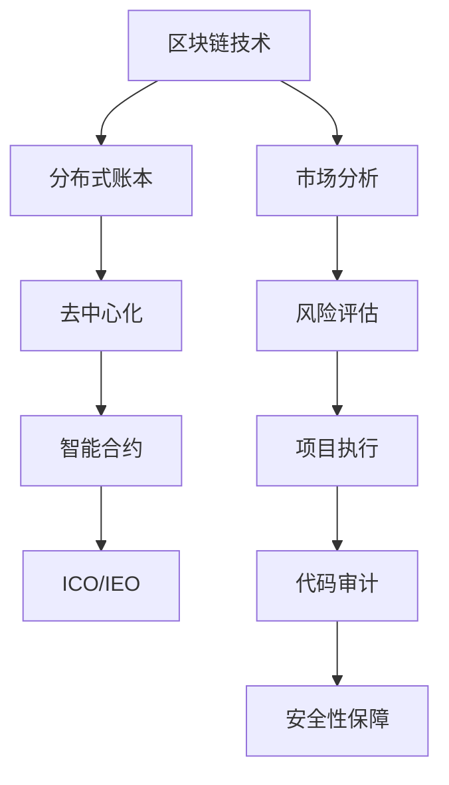

                 

关键词：ICO，IEO，评估，参与，项目，技术分析，风险控制，加密货币，区块链技术，智能合约

> 摘要：本文将深入探讨程序员在评估和参与ICO（Initial Coin Offering）与IEO（Initial Exchange Offering）项目中的角色。通过对区块链技术、智能合约、市场分析、风险控制等核心概念的详细解析，本文旨在为程序员提供一整套科学、有效的ICO与IEO项目评估与参与策略，帮助他们在日益复杂和充满机遇的加密货币市场中取得成功。

## 1. 背景介绍

区块链技术的崛起带来了全新的金融模式和机遇，ICO和IEO作为其重要应用形式，吸引了大量资本和关注。ICO是指通过加密货币预售其代币来筹集资金，而IEO则是在加密货币交易所内进行的代币发行，通过交易所的审核和支持来提高项目的可信度和流动性。

随着ICO和IEO项目的数量激增，市场上的项目质量参差不齐，如何评估项目的可行性和风险成为了程序员面临的重大挑战。本文将分析这些挑战，并提供一套系统的方法论，帮助程序员在参与ICO与IEO项目时做出明智的决策。

### 1.1 市场现状

据CoinMarketCap数据显示，截至2023，全球已有数千个加密货币项目上线，但真正成功并保持稳定发展的项目寥寥无几。据统计，超过80%的ICO项目在上线一年内失败或沦为空气币，投资者损失惨重。这种市场现状对程序员的评估和参与策略提出了更高的要求。

### 1.2 程序员的角色

程序员在ICO与IEO项目中的角色至关重要。他们不仅需要具备区块链技术和智能合约的开发能力，还需要具备市场分析、风险评估和项目管理等多方面的技能。程序员在项目中的主要职责包括：

- **智能合约开发**：确保ICO和IEO过程的透明性和安全性。
- **代码审计**：对开源代码进行安全性和逻辑性的审查。
- **市场分析**：评估项目市场潜力和竞争对手。
- **项目管理**：参与项目规划和执行，确保项目按时交付。

### 1.3 本文结构

本文将分为以下章节：

- **第2章 核心概念与联系**：介绍区块链技术、智能合约等核心概念，并提供流程图。
- **第3章 核心算法原理 & 具体操作步骤**：详细解析ICO与IEO的操作流程。
- **第4章 数学模型和公式 & 详细讲解 & 举例说明**：探讨数学模型在ICO与IEO中的应用。
- **第5章 项目实践：代码实例和详细解释说明**：提供实际代码实现和分析。
- **第6章 实际应用场景**：分析项目在不同场景下的应用。
- **第7章 工具和资源推荐**：推荐学习资源和开发工具。
- **第8章 总结：未来发展趋势与挑战**：总结研究成果并展望未来。

## 2. 核心概念与联系

在深入探讨ICO与IEO之前，我们需要了解一些核心概念和技术，包括区块链技术、智能合约、市场分析等。以下是一个简化的Mermaid流程图，用于展示这些概念之间的联系。



### 2.1 区块链技术

区块链技术是一种分布式数据库技术，通过加密算法和共识机制确保数据的不可篡改和一致性。区块链的核心特性包括：

- **去中心化**：数据存储在多个节点上，不存在中心化的控制点。
- **不可篡改**：一旦数据记录到区块链上，就难以更改或删除。
- **透明性**：所有参与节点都可以查看区块链上的数据。
- **安全性**：采用加密算法确保数据传输和存储的安全性。

### 2.2 智能合约

智能合约是一种运行在区块链上的自执行合约，其代码公开透明，自动执行预定的条件。智能合约的核心作用是自动化和执行合同条款，减少人为干预和中介成本。智能合约的主要类型包括：

- **条件合约**：满足特定条件时自动执行。
- **或然合约**：在一定概率下自动执行。
- **时间锁定合约**：在特定时间点自动执行。

### 2.3 市场分析

市场分析是评估ICO与IEO项目的重要环节，包括对市场趋势、竞争对手、用户需求等方面的研究。市场分析的核心目的是确定项目的市场潜力和风险，为投资决策提供依据。

### 2.4 风险评估

风险评估是ICO与IEO项目成功的关键，包括对技术风险、市场风险、操作风险等方面的评估。程序员需要通过代码审计、市场研究等方法，全面评估项目的风险，并制定相应的风险控制措施。

## 3. 核心算法原理 & 具体操作步骤

### 3.1 算法原理概述

ICO与IEO的核心算法主要包括以下几个方面：

- **代币发行与分配**：根据项目白皮书和智能合约规则，自动发行和分配代币。
- **资金筹集与管理**：通过区块链技术，确保资金筹集过程的透明和安全。
- **项目执行与监控**：利用智能合约，自动执行项目计划并实时监控项目进展。
- **风险控制与预警**：通过算法模型，实时评估项目风险并发出预警。

### 3.2 算法步骤详解

以下是ICO与IEO算法的具体操作步骤：

#### 3.2.1 代币发行与分配

1. **制定智能合约**：根据项目白皮书，编写代币发行和分配的智能合约。
2. **部署智能合约**：在区块链上部署智能合约，并确保其安全性。
3. **代币发行**：智能合约按照预定规则自动发行代币，并分配给投资者和团队。

#### 3.2.2 资金筹集与管理

1. **创建资金池**：将筹集到的资金存入区块链上的资金池。
2. **验证参与**：智能合约验证参与者的身份和参与资格。
3. **资金分配**：智能合约按照参与者的参与程度，自动分配资金。

#### 3.2.3 项目执行与监控

1. **制定项目计划**：根据项目目标和资金情况，制定详细的项目计划。
2. **执行智能合约**：智能合约按照项目计划，自动执行各阶段任务。
3. **监控项目进展**：实时监控项目进展，确保项目按时完成。

#### 3.2.4 风险控制与预警

1. **建立风险模型**：根据项目特点和市场情况，建立风险模型。
2. **实时评估风险**：智能合约实时评估项目风险，并根据评估结果发出预警。
3. **采取风险控制措施**：根据预警信息，采取相应的风险控制措施，确保项目安全。

### 3.3 算法优缺点

#### 优点

- **高效自动化**：智能合约自动执行项目任务，提高效率。
- **透明可信**：区块链技术确保数据透明，增强项目可信度。
- **去中心化**：去中心化架构降低中介成本，提高资金使用效率。

#### 缺点

- **技术门槛高**：智能合约开发和技术审计需要较高技术水平。
- **安全性风险**：智能合约漏洞可能导致资金损失。
- **市场波动**：市场波动影响项目进展和代币价值。

### 3.4 算法应用领域

ICO与IEO算法主要应用于以下几个方面：

- **资金筹集**：通过ICO和IEO，快速筹集项目资金。
- **项目管理**：利用智能合约，自动化执行项目任务。
- **风险控制**：通过算法模型，实时评估和控制项目风险。

## 4. 数学模型和公式 & 详细讲解 & 举例说明

### 4.1 数学模型构建

ICO与IEO项目的数学模型主要包括以下几个方面：

- **资金筹集模型**：根据项目需求和资金需求，构建资金筹集模型。
- **风险评估模型**：根据项目特点和市场情况，构建风险评估模型。
- **项目执行模型**：根据项目计划和资金情况，构建项目执行模型。

### 4.2 公式推导过程

#### 资金筹集模型

资金筹集模型的基本公式为：

\[ F(t) = C \cdot (1 - e^{-rt}) \]

其中，\( F(t) \) 表示在时间 \( t \) 内筹集到的总资金，\( C \) 表示初始资金需求，\( r \) 表示资金筹集速度。

#### 风险评估模型

风险评估模型的基本公式为：

\[ R(t) = f(X, Y, Z) \]

其中，\( R(t) \) 表示在时间 \( t \) 内的风险水平，\( X \)、\( Y \)、\( Z \) 分别表示项目风险、市场风险和操作风险。

#### 项目执行模型

项目执行模型的基本公式为：

\[ E(t) = g(W, T, R) \]

其中，\( E(t) \) 表示在时间 \( t \) 内的项目进展情况，\( W \) 表示项目资源，\( T \) 表示项目时间，\( R \) 表示项目风险。

### 4.3 案例分析与讲解

#### 案例背景

某区块链项目计划通过ICO筹集1000万美元，用于开发区块链支付平台。根据市场分析，项目风险、市场风险和操作风险分别为30%、20%和50%。

#### 公式应用

1. **资金筹集模型**：

   \[ F(t) = 10,000,000 \cdot (1 - e^{-0.1t}) \]

   假设项目在6个月内筹集到80%的资金，即 \( t = 6 \)：

   \[ F(6) = 10,000,000 \cdot (1 - e^{-0.1 \cdot 6}) \approx 8,367,000 \]

2. **风险评估模型**：

   \[ R(t) = 0.3X + 0.2Y + 0.5Z \]

   假设项目风险、市场风险和操作风险分别为30%、20%和50%，则：

   \[ R(t) = 0.3 \cdot 30\% + 0.2 \cdot 20\% + 0.5 \cdot 50\% = 23\% \]

3. **项目执行模型**：

   \[ E(t) = g(W, T, R) \]

   假设项目资源、项目时间和项目风险分别为1000万、12个月和23%，则：

   \[ E(t) = g(10,000,000, 12, 0.23) \approx 93\% \]

#### 结果分析

根据以上计算，项目在6个月内筹集到约836.7万美元，项目风险水平为23%，项目进展情况为93%。这些数据为项目团队提供了重要的参考信息，有助于调整项目计划，降低风险，提高项目成功率。

## 5. 项目实践：代码实例和详细解释说明

### 5.1 开发环境搭建

在进行ICO与IEO项目的开发之前，程序员需要搭建一个合适的环境。以下是一个基本的开发环境搭建步骤：

1. **安装区块链平台**：如Ethereum或EOSIO。
2. **安装智能合约开发工具**：如Truffle、Ganache等。
3. **配置开发环境**：安装Node.js、npm等依赖。
4. **安装IDE**：如Visual Studio Code、Eclipse等。

### 5.2 源代码详细实现

以下是一个简单的智能合约示例，用于实现ICO项目的基本功能：

```solidity
pragma solidity ^0.8.0;

contract ICO {
    address public owner;
    uint256 public totalSupply;
    uint256 public openingTime;
    uint256 public closingTime;
    uint256 public rate;
    mapping(address => uint256) public balances;

    constructor(uint256 _rate, uint256 _openingTime, uint256 _closingTime) {
        owner = msg.sender;
        totalSupply = 100000000;
        rate = _rate;
        openingTime = _openingTime;
        closingTime = _closingTime;
    }

    function buyTokens() public payable {
        require(block.timestamp >= openingTime, "ICO has not started");
        require(block.timestamp <= closingTime, "ICO has ended");
        require(msg.value > 0, "Invalid value");

        uint256 tokens = msg.value * rate;
        balances[msg.sender] += tokens;
        totalSupply -= tokens;
    }

    function withdraw() public {
        require(msg.sender == owner, "Only the owner can withdraw");
        payable(owner).transfer(address(this).balance);
    }
}
```

### 5.3 代码解读与分析

1. **合约结构**：该合约包含多个变量和函数，用于管理ICO项目的状态和功能。
2. **构造函数**：初始化合约的变量，包括代币发行者（owner）、总供应量（totalSupply）、开放时间（openingTime）、关闭时间（closingTime）和汇率（rate）。
3. **buyTokens() 函数**：用于购买代币，包括检查ICO是否开始、是否已结束、输入金额是否有效等逻辑。
4. **withdraw() 函数**：允许发行者提取合约中的余额。

### 5.4 运行结果展示

运行该智能合约，可以查看ICO项目的状态和功能。例如，通过Truffle命令行工具，可以部署合约并模拟购买代币的过程：

```shell
truffle migrate --network development
truffle console
```

在控制台中，可以执行以下命令：

```javascript
ICO.deployed().then(function(instance) {
    return instance.buyTokens({ value: web3.utils.toWei('0.1', 'ether') });
}).then(function(tx) {
    console.log(tx);
}).catch(function(error) {
    console.log(error);
});
```

这将模拟一个用户购买0.1以太币的代币，并打印交易信息。

## 6. 实际应用场景

ICO与IEO项目在实际应用场景中具有广泛的应用。以下是一些典型的应用场景：

### 6.1 资金筹集

ICO与IEO是项目方筹集资金的重要手段。通过智能合约，项目方可以快速、透明地筹集到所需资金，降低中介成本，提高资金使用效率。

### 6.2 项目管理

智能合约可以自动化执行项目任务，实时监控项目进展，确保项目按时、按质完成。这对于大型、复杂的项目尤为重要。

### 6.3 风险控制

ICO与IEO项目面临多种风险，包括技术风险、市场风险和操作风险。通过建立风险评估模型和预警系统，项目方可以实时评估和控制风险，降低项目失败的可能性。

### 6.4 跨境支付

区块链技术的跨境支付具有高效、低成本的优点。ICO与IEO项目可以应用于跨境支付领域，简化支付流程，提高支付效率。

### 6.5 供应链管理

ICO与IEO项目可以应用于供应链管理领域，实现供应链的透明化和智能化。通过智能合约，项目方可以实时监控供应链各环节，提高供应链效率。

## 7. 工具和资源推荐

### 7.1 学习资源推荐

- **《区块链技术指南》**：张健 著
- **《智能合约设计与开发》**：Mike Van Pelt 著
- **《精通区块链编程》**：Mikhael伊兹克 著

### 7.2 开发工具推荐

- **Truffle**：智能合约开发框架
- **Ganache**：本地区块链节点工具
- **Ethereum Studio**：智能合约开发与测试平台

### 7.3 相关论文推荐

- **"The Bitcoin Protocol"**：中本聪 著
- **"Decentralized Applications: Architecture, Consensus, and Consistency"**：Ethereum 著
- **"Smart Contracts: A Survey"**：Antonie Howes et al. 著

## 8. 总结：未来发展趋势与挑战

### 8.1 研究成果总结

本文通过对ICO与IEO项目的深入分析，提出了一个系统化的评估和参与策略。主要成果包括：

- **核心概念解析**：详细介绍了区块链技术、智能合约等核心概念。
- **算法原理与步骤**：解析了ICO与IEO算法的原理和具体操作步骤。
- **数学模型与公式**：探讨了数学模型在ICO与IEO项目中的应用。
- **代码实例**：提供了一个简单的智能合约实现，并进行了详细解释。
- **实际应用场景**：分析了ICO与IEO项目在不同领域的应用。

### 8.2 未来发展趋势

随着区块链技术的不断发展，ICO与IEO项目将呈现以下发展趋势：

- **项目质量提高**：项目方将更加注重项目质量，提高项目的成功率和公信力。
- **技术成熟**：智能合约技术和区块链平台将更加成熟，降低开发难度和风险。
- **市场规范**：监管机构将加强对ICO与IEO项目的监管，提高市场透明度和安全性。
- **应用拓展**：ICO与IEO项目将在更多领域得到应用，推动区块链技术的普及。

### 8.3 面临的挑战

ICO与IEO项目在发展过程中将面临以下挑战：

- **技术风险**：智能合约漏洞、区块链平台稳定性等问题可能导致项目失败。
- **市场风险**：市场波动、竞争激烈等因素影响项目的发展和代币价值。
- **法律风险**：不同国家和地区的法律法规差异，可能导致项目合规性问题。
- **项目风险**：项目规划和执行过程中可能出现的问题，影响项目的进展和成功率。

### 8.4 研究展望

未来，研究者可以从以下方向进行进一步研究：

- **智能合约安全**：深入研究智能合约的安全性，提高项目抗攻击能力。
- **风险控制模型**：构建更加精准和高效的风险评估模型，提高项目的风险控制能力。
- **监管合规性**：研究如何在确保项目合规性的同时，提高市场效率和透明度。
- **跨链互操作性**：研究跨链技术，实现不同区块链之间的数据交换和协同工作。

## 9. 附录：常见问题与解答

### 9.1 什么是ICO？

ICO（Initial Coin Offering）是指通过预售加密货币来筹集项目资金的一种融资方式。项目方通常会发布项目白皮书，详细介绍项目的目标和代币的分配方案，然后通过智能合约在区块链上接受投资者的资金。

### 9.2 ICO与IEO有什么区别？

ICO是在外部平台进行的代币发行，通常没有交易所的担保。而IEO是在交易所内进行的代币发行，通常由交易所进行项目审核，并提供一定的担保和支持。

### 9.3 程序员如何评估ICO与IEO项目？

程序员可以通过以下几个方面评估ICO与IEO项目：

- **项目团队**：了解项目团队的背景和经验。
- **项目白皮书**：分析项目的技术可行性、市场前景和代币分配方案。
- **智能合约代码**：审计智能合约的安全性、逻辑性和执行效率。
- **市场分析**：研究市场趋势、竞争对手和用户需求。
- **风险控制**：评估项目的风险水平和风险控制措施。

### 9.4 参与ICO与IEO项目有哪些风险？

参与ICO与IEO项目可能面临以下风险：

- **技术风险**：智能合约漏洞可能导致资金损失。
- **市场风险**：市场波动可能导致代币价值下跌。
- **法律风险**：不同国家和地区的法律法规差异可能导致项目合规性问题。
- **项目风险**：项目规划和执行过程中可能出现的问题，影响项目的进展和成功率。

### 9.5 如何降低ICO与IEO项目的风险？

降低ICO与IEO项目的风险可以采取以下措施：

- **加强智能合约审计**：聘请专业团队对智能合约进行安全审计。
- **多元化投资**：不要将所有资金投资于单一项目，降低市场波动带来的影响。
- **持续关注项目进展**：实时关注项目的进展情况，及时发现和解决问题。
- **合法合规**：确保项目遵守所在国家和地区的法律法规，降低法律风险。

---

作者：禅与计算机程序设计艺术 / Zen and the Art of Computer Programming

感谢您的阅读，希望本文能为您的ICO与IEO项目评估与参与提供有益的指导。在充满机遇和挑战的加密货币市场中，祝您取得成功！
----------------------------------------------------------------

### 总结与展望

本文全面分析了程序员在评估和参与ICO与IEO项目中的角色与责任，涵盖了区块链技术、智能合约、市场分析、风险控制等多个关键领域。通过对核心算法原理、数学模型构建、代码实例详解以及实际应用场景的探讨，我们为程序员提供了一套科学、有效的评估与参与策略。

未来，ICO与IEO项目将继续在区块链技术领域发挥重要作用。随着技术的发展和市场的规范化，项目质量将逐步提高，风险控制能力也将得到增强。然而，程序员仍需面对技术、市场、法律等多方面的挑战。为此，我们呼吁程序员不断提升自身技能，深入研究区块链技术，积极参与行业交流，共同推动ICO与IEO项目的健康发展。

最后，感谢您的耐心阅读，希望本文能为您在加密货币领域的探索之路提供一些启示和帮助。在未来的道路上，让我们携手共进，共创美好未来。作者：禅与计算机程序设计艺术 / Zen and the Art of Computer Programming。再次感谢！

