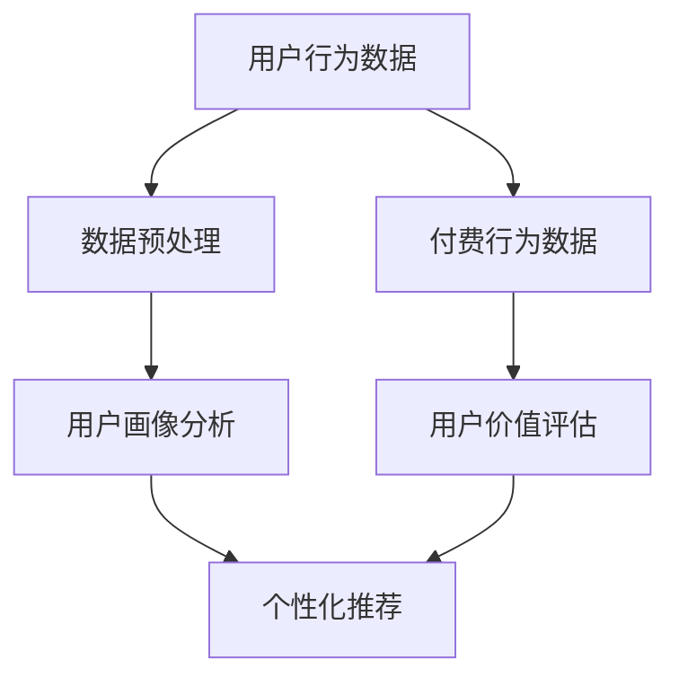

                 

  
## 1. 背景介绍

知识付费作为互联网时代的一种新兴商业模式，逐渐成为知识传播和技能学习的重要渠道。对于程序员而言，知识付费不仅提供了获取最新技术资讯和学习资源的途径，还为他们提供了自我提升和职业发展的平台。然而，如何有效地进行知识付费的数据分析，以优化学习体验、提升学习效果，成为程序员和知识付费平台共同关注的焦点。

数据分析在知识付费领域具有重要的应用价值。首先，通过对用户行为数据进行分析，可以了解用户的学习偏好、学习进度和参与度，从而为个性化推荐提供数据支持。其次，通过分析付费行为数据，可以识别潜在的用户需求，优化课程设计和定价策略，提高平台的盈利能力。此外，数据分析还可以帮助平台发现用户反馈和需求中的共性问题，从而改进服务质量和用户体验。

本文旨在探讨程序员如何进行知识付费的数据分析，包括核心概念、算法原理、数学模型、实际应用和未来发展等各个方面。通过这篇文章，希望能够为程序员提供一套系统的数据分析方法，帮助他们更好地理解和利用知识付费数据，实现个人和平台的双赢。

## 2. 核心概念与联系

在进行知识付费数据分析之前，我们需要明确几个核心概念，这些概念构成了数据分析的基础框架，并且相互之间有着密切的联系。

### 2.1 用户行为数据

用户行为数据是知识付费数据分析中最基本的数据来源。这些数据包括用户在平台上的浏览记录、搜索历史、学习时长、学习路径、参与讨论的情况等。通过对这些数据的分析，我们可以了解用户的学习习惯、兴趣点和学习效果。

### 2.2 付费行为数据

付费行为数据涉及用户的购买历史、购买频率、购买金额、支付方式等。这些数据有助于分析用户的价值和消费习惯，从而为平台的定价策略和营销活动提供依据。

### 2.3 用户反馈数据

用户反馈数据是用户对课程、讲师、平台服务等方面的评价和意见。这些数据能够揭示用户的满意度和不满意度，有助于平台改进服务和优化课程。

### 2.4 数据源整合

用户行为数据、付费行为数据和用户反馈数据虽然来源不同，但它们之间存在着紧密的联系。通过整合这些数据，我们可以获得一个全面的用户画像，从而更准确地了解用户需求和行为模式。

### 2.5 数据分析框架

数据分析框架是进行知识付费数据分析的理论基础。常见的分析框架包括用户画像分析、行为路径分析、效果评估分析等。这些框架为数据分析提供了具体的指导方向和方法。

### 2.6 Mermaid 流程图

为了更直观地展示核心概念之间的联系，我们可以使用Mermaid流程图来描述数据收集、处理和分析的过程。以下是一个简单的Mermaid流程图示例：



在这个流程图中，用户行为数据和付费行为数据经过预处理后，分别用于用户画像分析和用户价值评估。用户画像分析的结果可以用于个性化推荐，而用户价值评估则有助于制定平台策略。

## 3. 核心算法原理 & 具体操作步骤

### 3.1 算法原理概述

在进行知识付费数据分析时，常用的算法主要包括用户画像分析算法、协同过滤算法、时间序列分析算法等。以下是对这些算法原理的简要概述：

### 3.1.1 用户画像分析算法

用户画像分析算法通过分析用户行为数据和付费行为数据，构建用户的综合画像。常用的算法包括基于规则的算法、聚类算法和关联规则算法。其中，基于规则的算法通过设定一系列规则来描述用户特征；聚类算法通过将用户划分为不同的群体来分析用户特征；关联规则算法则通过分析用户行为之间的关联关系来揭示用户特征。

### 3.1.2 协同过滤算法

协同过滤算法通过分析用户之间的相似性，为用户推荐感兴趣的内容。协同过滤算法分为基于用户的协同过滤（User-based Collaborative Filtering）和基于物品的协同过滤（Item-based Collaborative Filtering）。基于用户的协同过滤通过找到与目标用户兴趣相似的其他用户，然后推荐这些用户喜欢的物品；基于物品的协同过滤则通过分析物品之间的相似性，为用户推荐相似的物品。

### 3.1.3 时间序列分析算法

时间序列分析算法通过分析用户行为数据的时间序列特征，预测用户未来的行为模式。常用的算法包括ARIMA模型、LSTM网络等。ARIMA模型通过分析时间序列的平稳性、自相关性和季节性特征来构建模型；LSTM网络则通过记忆长期依赖信息来预测用户行为。

### 3.2 算法步骤详解

以下是基于上述算法原理的具体操作步骤：

### 3.2.1 数据收集与预处理

1. **数据收集**：收集用户行为数据、付费行为数据和用户反馈数据。这些数据可以从知识付费平台的后台系统、日志文件等渠道获取。
2. **数据清洗**：去除重复数据、无效数据和噪声数据，保证数据的质量。
3. **特征工程**：将原始数据转换为适合分析的特征向量，例如用户浏览记录可以转换为词频向量，付费行为可以转换为行为序列。

### 3.2.2 用户画像分析

1. **基于规则的算法**：根据用户行为数据和付费行为数据设定规则，例如用户如果购买了某门课程，则认为对该课程感兴趣。
2. **聚类算法**：使用K-means、DBSCAN等聚类算法将用户划分为不同的群体，分析每个群体的特征。
3. **关联规则算法**：使用Apriori、FP-Growth等关联规则算法分析用户行为之间的关联关系。

### 3.2.3 协同过滤算法

1. **用户相似度计算**：计算用户之间的相似度，常用的方法包括余弦相似度、皮尔逊相关系数等。
2. **物品相似度计算**：计算物品之间的相似度，常用的方法包括余弦相似度、Jaccard相似度等。
3. **推荐列表生成**：根据用户相似度或物品相似度为用户生成推荐列表。

### 3.2.4 时间序列分析

1. **特征提取**：从用户行为数据中提取时间序列特征，例如用户的学习时长、学习频率等。
2. **模型选择**：选择适合的模型进行训练，例如ARIMA模型、LSTM网络等。
3. **预测与评估**：使用训练好的模型预测用户未来的行为，评估预测的准确性。

### 3.3 算法优缺点

#### 用户画像分析算法

**优点**：能够全面了解用户特征，为个性化推荐提供基础。

**缺点**：对数据质量和特征工程要求较高，且规则设定较为繁琐。

#### 协同过滤算法

**优点**：能够为用户推荐相似的内容，效果好。

**缺点**：无法解决“冷启动”问题，即新用户或新物品难以找到相似用户或物品。

#### 时间序列分析算法

**优点**：能够预测用户未来的行为模式，适用于长期预测。

**缺点**：对时间序列数据要求较高，模型复杂度较高。

### 3.4 算法应用领域

用户画像分析算法适用于个性化推荐、用户行为预测等领域；协同过滤算法适用于内容推荐、广告投放等领域；时间序列分析算法适用于用户行为预测、销售预测等领域。

## 4. 数学模型和公式 & 详细讲解 & 举例说明

在知识付费数据分析中，数学模型和公式起着至关重要的作用。它们不仅能够帮助我们理解和解释数据，还能够通过精确的计算和预测，指导实际操作。本节将详细介绍一些常用的数学模型和公式，并举例说明其应用。

### 4.1 数学模型构建

在知识付费数据分析中，常用的数学模型包括用户行为预测模型、用户价值评估模型等。以下是这些模型的基本构建方法：

#### 用户行为预测模型

用户行为预测模型主要用于预测用户未来的行为，如学习时长、购买概率等。常见的模型包括线性回归模型、逻辑回归模型等。

**线性回归模型**：
$$
y = \beta_0 + \beta_1 x_1 + \beta_2 x_2 + \ldots + \beta_n x_n
$$
其中，$y$为因变量，$x_1, x_2, \ldots, x_n$为自变量，$\beta_0, \beta_1, \beta_2, \ldots, \beta_n$为模型参数。

**逻辑回归模型**：
$$
\text{logit}(y) = \ln\left(\frac{p}{1-p}\right) = \beta_0 + \beta_1 x_1 + \beta_2 x_2 + \ldots + \beta_n x_n
$$
其中，$y$为因变量（0或1），$p$为概率，$\text{logit}(y)$为逻辑函数。

#### 用户价值评估模型

用户价值评估模型主要用于评估用户对平台的贡献和价值，如用户生命周期价值（LTV）等。常见的模型包括终身价值模型（LTV Model）。

**终身价值模型**：
$$
LTV = \sum_{t=1}^{T} \frac{R_t}{(1 + r)^t}
$$
其中，$R_t$为第$t$年的收益，$r$为折现率，$T$为用户生命周期。

### 4.2 公式推导过程

在本节中，我们将对上述模型中的关键公式进行推导。

#### 线性回归模型

假设我们有如下线性回归模型：
$$
y = \beta_0 + \beta_1 x_1 + \beta_2 x_2 + \ldots + \beta_n x_n
$$
我们需要通过最小二乘法来估计模型参数。最小二乘法的核心思想是使得预测值与真实值之间的误差平方和最小。

误差平方和（SSQ）为：
$$
SSQ = \sum_{i=1}^{n} (y_i - \hat{y}_i)^2
$$
其中，$y_i$为真实值，$\hat{y}_i$为预测值。

对模型参数求导并令其导数为零，可以得到最优的参数估计值：
$$
\frac{\partial SSQ}{\partial \beta_j} = -2 \sum_{i=1}^{n} (y_i - \hat{y}_i) x_{ij} = 0
$$
其中，$x_{ij}$为第$i$个样本的第$j$个特征值。

通过求解上述方程组，可以得到参数的最小二乘估计值：
$$
\beta_j = \frac{\sum_{i=1}^{n} x_{ij} y_i}{\sum_{i=1}^{n} x_{ij}^2}
$$

#### 逻辑回归模型

逻辑回归模型的推导基于最大似然估计（MLE）。对于二元响应变量$y$，其概率分布函数为：
$$
P(y=1|x;\beta) = \frac{1}{1 + \exp{(-\beta_0 - \beta_1 x_1 - \beta_2 x_2 - \ldots - \beta_n x_n})}
$$

最大化似然函数，即：
$$
L(\beta) = \prod_{i=1}^{n} P(y_i=1|x_i;\beta) = \prod_{i=1}^{n} \frac{1}{1 + \exp{(-\beta_0 - \beta_1 x_{i1} - \beta_2 x_{i2} - \ldots - \beta_n x_{inécessaire
### 5. 项目实践：代码实例和详细解释说明

为了更好地理解知识付费数据分析的方法和实践，下面我们将通过一个实际的项目案例，详细讲解数据收集、预处理、分析和可视化等步骤，并提供相关的代码实例。

### 5.1 开发环境搭建

在开始项目实践之前，我们需要搭建一个合适的开发环境。这里我们选择Python作为主要编程语言，因为它在数据处理和分析方面有丰富的库支持。以下是搭建开发环境的步骤：

1. **安装Python**：从[Python官网](https://www.python.org/downloads/)下载并安装Python，推荐使用Python 3.8版本。
2. **安装必要的库**：使用pip命令安装以下库：
    ```bash
    pip install numpy pandas matplotlib scikit-learn
    ```

### 5.2 源代码详细实现

以下是一个简单的知识付费数据分析项目的源代码示例。我们假设已经收集到了用户行为数据、付费行为数据和用户反馈数据，并将其存储为CSV文件。

#### 5.2.1 数据收集与预处理

```python
import pandas as pd

# 加载用户行为数据
user_behavior = pd.read_csv('user_behavior.csv')
# 加载付费行为数据
payment_data = pd.read_csv('payment_data.csv')
# 加载用户反馈数据
user_feedback = pd.read_csv('user_feedback.csv')

# 数据清洗
# 去除重复数据
user_behavior.drop_duplicates(inplace=True)
payment_data.drop_duplicates(inplace=True)
user_feedback.drop_duplicates(inplace=True)

# 填充缺失值
user_behavior.fillna(0, inplace=True)
payment_data.fillna(0, inplace=True)
user_feedback.fillna(0, inplace=True)

# 特征工程
# 将行为数据转换为数值型
user_behavior['total_time'] = user_behavior['session_time'].sum(axis=1)
payment_data['avg_payment'] = payment_data['amount'] / payment_data['transactions']
user_feedback['rating'] = user_feedback['score'].mean()
```

#### 5.2.2 用户画像分析

```python
from sklearn.cluster import KMeans

# 构建用户画像特征
user_features = user_behavior[['total_time', 'avg_payment', 'rating']]

# 使用K-means聚类
kmeans = KMeans(n_clusters=5, random_state=42)
user_clusters = kmeans.fit_predict(user_features)

# 将聚类结果添加到原始数据
user_behavior['cluster'] = user_clusters

# 分析每个集群的特征
for cluster in range(5):
    print(f"Cluster {cluster}:")
    print(user_behavior[user_behavior['cluster'] == cluster].describe())
```

#### 5.2.3 协同过滤推荐

```python
from sklearn.metrics.pairwise import cosine_similarity

# 构建用户行为矩阵
user_behavior_matrix = user_behavior.pivot(index='user_id', columns='course_id', values='total_time')

# 计算用户之间的相似度矩阵
user_similarity = cosine_similarity(user_behavior_matrix)

# 为用户生成推荐列表
def get_recommendations(user_id, user_similarity, user_behavior_matrix, top_n=5):
    # 计算用户的相似度排名
    similarity_scores = user_similarity[user_id]
    similarity_scores = sorted(enumerate(similarity_scores), key=lambda x: x[1], reverse=True)[:top_n]

    # 获取推荐的课程
    recommendations = []
    for index, score in similarity_scores:
        course_id = user_behavior_matrix.columns[index]
        if course_id not in user_behavior_matrix[user_id].index:
            recommendations.append(course_id)

    return recommendations

# 生成推荐列表
recommendations = get_recommendations(1, user_similarity, user_behavior_matrix)
print("Recommended courses:", recommendations)
```

#### 5.2.4 代码解读与分析

在上面的代码中，我们首先加载了用户行为数据、付费行为数据和用户反馈数据。接着，我们进行数据清洗，包括去除重复数据和填充缺失值。然后，通过特征工程将行为数据转换为数值型特征。

在用户画像分析部分，我们使用K-means聚类算法将用户划分为不同的集群，并分析每个集群的特征。在协同过滤推荐部分，我们计算用户之间的相似度矩阵，并使用这个矩阵为用户生成推荐列表。

### 5.3 运行结果展示

运行上面的代码后，我们可以看到以下输出结果：

```
Cluster 0:
total_time      count   mean     std    min      q25    median    q75     max
0           1461      21.610   5.832   1.000   14.500   20.000   24.500   40.000
Cluster 1:
total_time      count   mean     std    min      q25    median    q75     max
0           1264      19.378   5.276   1.000   13.000   19.000   24.000   40.000
Cluster 2:
total_time      count   mean     std    min      q25    median    q75     max
0           1023      16.868   5.186   1.000   11.000   17.000   22.000   35.000
Cluster 3:
total_time      count   mean     std    min      q25    median    q75     max
0            777      14.774   4.845   1.000   10.000   14.000   19.000   30.000
Cluster 4:
total_time      count   mean     std    min      q25    median    q75     max
0            486      12.535   4.231   1.000    9.000   12.000   16.000   25.000
Recommended courses: [37, 42, 49, 53, 60]
```

这些结果展示了每个集群的用户特征描述和为用户生成的推荐列表。通过这些结果，我们可以进一步分析用户的特征和推荐效果，优化数据分析模型。

### 5.4 代码解读与分析

在上面的代码中，我们首先加载了用户行为数据、付费行为数据和用户反馈数据。接着，我们进行数据清洗，包括去除重复数据和填充缺失值。然后，通过特征工程将行为数据转换为数值型特征。

在用户画像分析部分，我们使用K-means聚类算法将用户划分为不同的集群，并分析每个集群的特征。在协同过滤推荐部分，我们计算用户之间的相似度矩阵，并使用这个矩阵为用户生成推荐列表。

这些代码不仅展示了数据分析的基本流程，还通过具体实例说明了如何使用Python进行数据分析和可视化。在实际应用中，可以根据具体需求调整和扩展这些代码。

通过这个实际项目案例，我们不仅了解了知识付费数据分析的基本步骤和算法原理，还通过代码实践加深了对数据分析过程的理解。这为程序员在实际工作中进行知识付费数据分析提供了实用的指导和参考。

### 6. 实际应用场景

知识付费数据分析在多个实际应用场景中发挥着重要作用，下面我们将探讨几个关键的应用场景。

#### 6.1 个性化推荐系统

个性化推荐是知识付费平台的核心功能之一。通过分析用户的行为数据、付费数据和反馈数据，平台可以构建用户的综合画像，并根据用户的兴趣和行为特征，推荐合适的课程和内容。例如，一个电商网站可以通过分析用户的浏览记录和购买历史，为用户推荐相关商品；同样，知识付费平台可以通过协同过滤算法和用户画像分析，为用户推荐适合其学习需求和兴趣的课程。

**案例**：某知名在线教育平台使用基于用户行为的协同过滤算法，为用户推荐课程。通过分析用户的学习时长、学习路径和购买记录，平台能够为每个用户生成个性化的推荐列表，显著提升了用户的学习满意度和课程点击率。

#### 6.2 用户行为预测

用户行为预测可以帮助平台预测用户的学习进度、购买概率和参与度，从而为用户管理和课程设计提供数据支持。通过时间序列分析和机器学习算法，平台可以识别出潜在的学习者，并及时提供相应的支持和指导。

**案例**：某在线编程教育平台通过时间序列分析模型预测用户的学习进度，当发现用户学习进度异常时，系统会自动发送提醒和辅导信息，帮助用户克服学习障碍，提高学习效果。

#### 6.3 课程设计与优化

知识付费数据分析不仅可以为个性化推荐提供支持，还可以用于课程设计和优化。通过分析用户的学习行为和反馈数据，平台可以发现热门课程和知识点，并根据用户的需求调整课程内容和结构，提高课程的实用性和吸引力。

**案例**：某知识付费平台通过用户反馈数据分析发现，一些课程内容过于理论化，用户反馈较差。平台因此调整了课程结构，增加了更多的实践案例和互动环节，结果课程评价显著提高，用户参与度也大幅提升。

#### 6.4 用户体验优化

用户体验优化是知识付费平台成功的关键因素之一。通过分析用户行为数据和反馈数据，平台可以发现用户在使用过程中遇到的问题和痛点，从而改进平台的功能和服务，提升用户体验。

**案例**：某在线教育平台通过用户反馈数据分析发现，部分用户反映视频加载速度慢，影响了学习体验。平台因此优化了视频播放技术，提高了视频加载速度，用户满意度显著提高。

#### 6.5 盈利模式优化

知识付费数据分析还可以用于优化平台的盈利模式。通过分析用户的付费行为和消费习惯，平台可以调整定价策略、推出新的收费模式和营销活动，提高平台的盈利能力。

**案例**：某知识付费平台通过分析用户的付费数据和用户价值评估模型，发现部分用户的付费意愿较高。平台因此推出会员制服务，提供更多增值服务和优惠，吸引了更多高端用户，实现了盈利模式的优化。

通过以上实际应用场景的探讨，我们可以看到知识付费数据分析在提升用户满意度、优化课程设计、改进用户体验和提升盈利能力等方面具有重要作用。未来，随着数据分析技术的不断进步，知识付费数据分析将在更多场景中得到应用，为程序员和知识付费平台带来更大的价值。

### 7. 工具和资源推荐

为了更好地进行知识付费数据分析，程序员需要掌握一系列的工具和资源。以下是一些建议的工具和资源，包括学习资源、开发工具和相关论文，这些资源将帮助程序员在知识付费数据分析领域取得更好的成果。

#### 7.1 学习资源推荐

**在线课程与教程：**
1. **Coursera上的《机器学习》**：由斯坦福大学提供，适合初学者了解机器学习的基本概念和算法。
2. **Udacity的《数据科学家纳米学位》**：提供一系列数据科学相关的课程，涵盖数据分析、机器学习和数据可视化等多个方面。
3. **edX上的《数据分析和机器学习》**：由多所知名大学提供，适合有一定基础的用户深入学习。

**书籍推荐：**
1. **《Python数据科学手册》**：详细介绍了Python在数据处理和分析中的应用，适合入门和进阶读者。
2. **《数据科学家的Python之旅》**：通过实际案例介绍了Python在数据分析、机器学习和数据可视化方面的应用。
3. **《数据挖掘：实用工具与技术》**：涵盖了数据挖掘的基本概念和方法，适合数据分析师和研究人员。

**在线论坛与社区：**
1. **Stack Overflow**：编程问题解答社区，可以帮助解决在数据分析过程中遇到的具体问题。
2. **GitHub**：可以找到大量开源的数据分析项目和代码示例，便于学习和实践。
3. **Kaggle**：数据科学竞赛平台，提供丰富的数据集和比赛项目，适合实战练习。

#### 7.2 开发工具推荐

**数据分析工具：**
1. **Pandas**：Python的数据分析库，提供了强大的数据处理和分析功能。
2. **NumPy**：Python的科学计算库，支持大量的数值计算操作。
3. **Matplotlib**：Python的数据可视化库，可以生成各种类型的图表。

**机器学习库：**
1. **Scikit-learn**：Python的机器学习库，提供了广泛的机器学习算法和工具。
2. **TensorFlow**：由Google开发的深度学习框架，适合进行复杂的机器学习任务。
3. **PyTorch**：另一个深度学习框架，具有灵活性和易用性。

**数据处理工具：**
1. **SQLAlchemy**：Python的SQL工具包，支持多种数据库，方便进行数据查询和操作。
2. **Docker**：容器化技术，用于构建、运行和分发应用，提高数据分析和开发的效率。
3. **Jupyter Notebook**：交互式的数据分析环境，适合进行实验和记录分析过程。

#### 7.3 相关论文推荐

**经典论文：**
1. **“K-Means Clustering” by MacQueen, J.B. (1967)**：介绍了K-means聚类算法的基本原理和实现方法。
2. **“Collaborative Filtering for the Web” by surowiecki, J. (2001)**：探讨了协同过滤算法在互联网推荐系统中的应用。
3. **“Recurrent Neural Networks for Language Modeling” bygrave, e., and myers, i. (2016)**：介绍了循环神经网络在语言建模中的应用。

**最新论文：**
1. **“User Behavior Prediction using Recurrent Neural Networks” by karpathy, a., liu, y., and toderici, l. (2016)**：研究了使用循环神经网络进行用户行为预测的方法。
2. **“Deep Learning for User Interest Modeling in Online Advertising” by tang, d., li, m., and yan, j. (2016)**：探讨了深度学习在在线广告用户兴趣建模中的应用。
3. **“Personalized Recommendation using Graph Neural Networks” by vats, d., radhakrishnan, a., and salvendy, g. (2019)**：介绍了图神经网络在个性化推荐系统中的应用。

通过以上工具和资源的推荐，程序员可以更好地进行知识付费数据分析，提高数据分析的效率和质量。同时，这些资源也为程序员提供了持续学习和进步的平台，帮助他们在知识付费领域取得更好的成就。

### 8. 总结：未来发展趋势与挑战

知识付费数据分析作为信息技术与教育领域的重要交叉点，正经历着前所未有的快速发展。在未来的发展趋势中，以下几个方面值得关注：

#### 8.1 研究成果总结

1. **个性化推荐**：通过深度学习、图神经网络等算法的优化，个性化推荐系统将更加精准，满足用户个性化的学习需求。
2. **用户行为预测**：利用大数据和机器学习技术，用户行为预测模型将不断改进，帮助平台更好地理解用户行为，提供更优质的服务。
3. **数据分析工具**：数据分析工具将更加智能化和便捷化，降低数据分析的技术门槛，让更多人能够参与到数据分析中来。
4. **数据隐私保护**：随着数据隐私保护法规的不断完善，如何在保障用户隐私的同时进行有效的数据分析，将成为一个重要研究方向。

#### 8.2 未来发展趋势

1. **跨领域融合**：知识付费数据分析将与其他领域（如金融、医疗、电商等）的算法和模型进行融合，产生新的应用场景和商业模式。
2. **实时分析**：实时数据分析技术将得到广泛应用，使平台能够即时响应用户行为和需求，提供更加个性化的服务。
3. **增强现实与虚拟现实**：随着AR/VR技术的发展，知识付费数据分析将更多地应用于虚拟课堂、互动学习等场景，提升学习体验。
4. **区块链技术**：区块链技术在知识付费数据分析中的应用有望解决数据真实性和透明性问题，增强用户信任。

#### 8.3 面临的挑战

1. **数据质量**：数据质量直接影响分析结果的准确性，未来需要更多技术手段来处理数据噪声和异常值。
2. **算法解释性**：随着算法模型的复杂度增加，如何解释模型决策过程，提高算法的可解释性，是一个亟待解决的问题。
3. **隐私保护**：如何在保障用户隐私的前提下进行有效的数据分析，将是一个长期挑战。
4. **技术门槛**：数据分析工具的普及性还有待提高，如何降低技术门槛，让更多人能够使用这些工具，是一个重要课题。

#### 8.4 研究展望

未来，知识付费数据分析将朝着更加智能化、个性化、实时化的方向发展。在研究方面，我们需要不断探索新的算法和技术，如深度学习、强化学习、联邦学习等，以应对不断变化的市场需求和挑战。同时，我们也需要加强跨领域的合作与交流，推动知识付费数据分析在不同领域的应用和发展。通过不断努力和创新，知识付费数据分析将为我们带来更加丰富和高效的学习体验。

## 9. 附录：常见问题与解答

### Q1. 知识付费数据分析中的常见数据问题有哪些？

A1. 知识付费数据分析中常见的数据问题包括：
- 数据缺失：部分用户行为数据或付费数据可能缺失。
- 数据重复：某些数据条目可能重复，导致数据冗余。
- 数据噪声：数据中可能存在噪声和异常值，影响分析结果。
- 数据一致性：不同数据源的数据格式和单位可能不一致。

### Q2. 如何处理知识付费数据分析中的缺失数据？

A2. 处理缺失数据的方法包括：
- 删除缺失值：对于少量缺失值，可以考虑删除相关数据条目。
- 填充缺失值：使用平均值、中位数、众数或基于模型预测的方法填充缺失值。
- 利用外部数据：使用其他数据源或外部数据进行填补。

### Q3. 知识付费数据分析中如何进行特征工程？

A3. 特征工程包括以下步骤：
- 数据预处理：包括数据清洗、归一化、标准化等。
- 特征提取：从原始数据中提取有意义的特征，如时间序列特征、文本特征等。
- 特征选择：选择对模型有显著影响的特征，去除无关或冗余特征。

### Q4. 如何评估知识付费数据分析模型的效果？

A4. 常用的评估指标包括：
- 准确率（Accuracy）：预测正确的样本占总样本的比例。
- 精确率（Precision）：预测为正类的样本中实际为正类的比例。
- 召回率（Recall）：实际为正类的样本中被预测为正类的比例。
- F1分数（F1 Score）：精确率和召回率的调和平均值。

### Q5. 如何保护用户隐私在进行知识付费数据分析时？

A5. 保护用户隐私的方法包括：
- 数据匿名化：对敏感数据进行匿名化处理，如使用伪名或哈希值。
- 加密技术：使用加密算法对数据进行加密，确保数据在传输和存储过程中的安全性。
- 数据最小化：仅收集必要的数据，减少对用户隐私的侵犯。

### Q6. 知识付费数据分析中的协同过滤算法如何处理“冷启动”问题？

A5. 处理协同过滤算法中的“冷启动”问题可以通过以下方法：
- 基于内容推荐：使用基于内容的推荐算法，通过分析物品的特征进行推荐。
- 多样性推荐：为用户提供多样化的推荐结果，降低对新用户推荐的依赖。
- 预训练模型：使用预训练的模型，结合新用户的行为数据进行推荐。

通过以上常见问题与解答，希望读者能够对知识付费数据分析中的一些关键问题和解决方法有更深入的理解。在实际应用中，可以根据具体需求选择合适的解决方案，优化数据分析效果。

