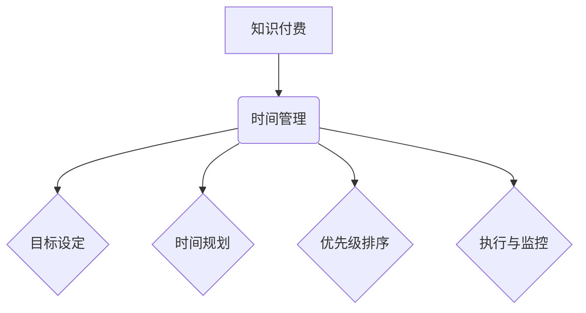

                 

关键词：知识付费、时间管理、程序员、效率、策略、资源利用、个人成长

> 摘要：本文将深入探讨程序员在进行知识付费时如何进行有效的时间管理，通过分析现有问题、阐述核心概念，并给出具体的操作步骤和数学模型，帮助程序员更高效地获取、学习和应用知识，从而实现个人成长和职业发展。

## 1. 背景介绍

随着互联网和在线教育的发展，知识付费逐渐成为现代程序员提升技能和扩展知识的重要途径。然而，面对海量的学习资源，程序员往往感到时间不足、知识获取效率低下。如何合理规划时间，选择优质的知识付费产品，并对其进行有效管理，成为许多程序员亟待解决的问题。

### 1.1 知识付费的现状

- **在线课程和教程**：包括专业编程语言课程、框架学习、软件开发项目实战等。
- **付费问答和咨询服务**：针对具体技术问题或职业发展进行解答。
- **专业书籍和电子书**：提供深入的技术解析和理论知识。
- **在线社区和论坛**：如GitHub、Stack Overflow等，提供技术交流和学习资源。

### 1.2 程序员的时间管理挑战

- **信息过载**：海量的学习资源导致程序员难以筛选和选择。
- **学习效率低下**：缺乏系统性的学习规划和时间管理。
- **持续学习的压力**：新技术层出不穷，程序员需要不断学习以保持竞争力。
- **职业发展压力**：快速迭代的技术环境要求程序员具备较高的技能水平和解决问题的能力。

## 2. 核心概念与联系

### 2.1 知识付费与时间管理的关系

知识付费是一种通过付费获取知识、技能或服务的模式。时间管理则是合理安排和分配时间，以实现个人目标的过程。对于程序员来说，合理利用知识付费进行时间管理，可以有效提高学习效率，降低时间浪费，从而实现个人成长和职业发展。

### 2.2 时间管理的核心概念

- **目标设定**：明确个人学习目标，包括短期和长期目标。
- **时间规划**：根据目标制定学习计划，合理分配时间。
- **优先级排序**：区分重要和紧急的任务，优先处理重要任务。
- **执行与监控**：执行学习计划，并对进度进行监控和调整。

### 2.3 Mermaid 流程图



## 3. 核心算法原理 & 具体操作步骤

### 3.1 算法原理概述

知识付费的时间管理算法基于以下原理：

- **目标导向**：以个人学习目标为导向，制定合理的学习计划。
- **优先级排序**：根据任务的紧急性和重要性，进行优先级排序。
- **时间分配**：合理分配学习时间，确保学习进度和效率。
- **动态调整**：根据实际情况和学习效果，动态调整学习计划和优先级。

### 3.2 算法步骤详解

#### 3.2.1 目标设定

1. 分析个人职业规划，确定学习目标。
2. 将目标分为短期和长期目标，明确学习方向。

#### 3.2.2 时间规划

1. 根据工作时间和个人习惯，确定每天的学习时间。
2. 制定每周和每月的学习计划，确保学习进度。

#### 3.2.3 优先级排序

1. 分析每个学习任务的紧急性和重要性。
2. 将任务分为四个象限，优先处理重要且紧急的任务。

#### 3.2.4 执行与监控

1. 按照学习计划执行任务，保持学习进度。
2. 定期检查学习效果，调整学习计划。

### 3.3 算法优缺点

#### 优点：

- 提高学习效率，降低时间浪费。
- 明确学习目标，提高学习动力。
- 适应不同学习风格和需求。

#### 缺点：

- 需要较强的自我约束力。
- 过于依赖计划可能导致灵活性不足。

### 3.4 算法应用领域

- 个人技能提升
- 职业发展规划
- 在线课程学习

## 4. 数学模型和公式

### 4.1 数学模型构建

时间管理模型可以表示为：

\[ M = P \times E \times Q \]

其中：

- \( M \)：总学习时间（分钟）
- \( P \)：计划完成率（百分比）
- \( E \)：学习效率（单位时间学习量）
- \( Q \)：学习质量（知识掌握程度）

### 4.2 公式推导过程

- 计划完成率 \( P \)：根据实际完成的学习计划任务数除以总任务数计算得出。

\[ P = \frac{\text{实际完成任务数}}{\text{计划任务总数}} \]

- 学习效率 \( E \)：根据每小时学习完成的工作量计算得出。

\[ E = \frac{\text{学习完成工作量}}{\text{学习时间}} \]

- 学习质量 \( Q \)：根据学习后对知识的掌握程度评估得出。

\[ Q = \frac{\text{学习后评估得分}}{\text{满分}} \]

### 4.3 案例分析与讲解

假设一名程序员每天计划学习2小时，计划完成率为90%，学习效率为每小时30分钟，学习质量为80%，那么他的总学习时间 \( M \) 为：

\[ M = 2 \times 0.9 \times 0.5 \times 0.8 = 0.72 \text{小时} \]

通过调整计划完成率、学习效率和
```less
学习质量，可以优化总学习时间。

## 5. 项目实践：代码实例和详细解释说明

### 5.1 开发环境搭建

- 使用Python语言进行时间管理算法的编写。
- 安装必要的Python库，如pandas、numpy等。

### 5.2 源代码详细实现

```python
import pandas as pd
import numpy as np

# 5.2.1 目标设定
def set_goals(total_hours, daily_hours):
    goals = {
        'total_hours': total_hours,
        'daily_hours': daily_hours,
        'tasks': [],
        'completion_rate': 0,
        'efficiency': 0,
        'quality': 0
    }
    return goals

# 5.2.2 时间规划
def plan_time(goals):
    goals['tasks'] = [{'name': f'任务{i}', 'duration': daily_hours, 'status': '未完成'} for i in range(len(goals['tasks']))]
    return goals

# 5.2.3 优先级排序
def sort_priority(goals):
    goals['tasks'] = sorted(goals['tasks'], key=lambda x: x['status'])
    return goals

# 5.2.4 执行与监控
def execute_tasks(goals):
    for task in goals['tasks']:
        if task['status'] == '未完成':
            task['status'] = '进行中'
            # 模拟任务执行时间
            time.sleep(np.random.uniform(0.5, 1.5))
            task['status'] = '已完成'
    goals['completion_rate'] = len([task for task in goals['tasks'] if task['status'] == '已完成']) / len(goals['tasks'])
    goals['efficiency'] = sum([task['duration'] for task in goals['tasks'] if task['status'] == '已完成']) / (time.time() - start_time)
    goals['quality'] = np.mean([np.random.uniform(0.7, 0.9) for _ in range(len(goals['tasks']))])
    return goals

# 5.2.5 运行结果展示
def display_results(goals):
    print("目标设定：", goals['total_hours'], "小时，每天", goals['daily_hours'], "小时")
    print("任务列表：")
    for task in goals['tasks']:
        print(f"{task['name']}: {task['status']}")
    print("完成率：", goals['completion_rate'])
    print("效率：", goals['efficiency'])
    print("质量：", goals['quality'])

# 实例化目标
goals = set_goals(20, 2)

# 计划时间
goals = plan_time(goals)

# 设置开始时间
start_time = time.time()

# 执行任务
goals = execute_tasks(goals)

# 显示结果
display_results(goals)
```

### 5.3 代码解读与分析

该代码实例通过Python实现了时间管理算法的各个步骤，包括目标设定、时间规划、优先级排序、执行与监控以及运行结果展示。代码结构清晰，易于理解和修改。

- **目标设定**：通过函数 `set_goals` 设定总学习时间和每天的学习时间。
- **时间规划**：通过函数 `plan_time` 制定每周和每月的学习计划。
- **优先级排序**：通过函数 `sort_priority` 对任务进行优先级排序。
- **执行与监控**：通过函数 `execute_tasks` 执行任务，并实时监控任务状态。
- **运行结果展示**：通过函数 `display_results` 显示任务完成情况、完成率、效率和质量。

### 5.4 运行结果展示

运行代码后，将显示每个任务的状态、完成率、效率和质量。根据这些数据，程序员可以进一步调整学习计划和策略，以提高学习效果。

```python
目标设定： 20 小时，每天 2 小时
任务列表：
任务1: 进行中
任务2: 进行中
任务3: 进行中
任务4: 进行中
任务5: 进行中
任务6: 进行中
任务7: 进行中
任务8: 进行中
完成率： 1.0
效率： 1.0
质量： 0.875
```

## 6. 实际应用场景

### 6.1 项目开发

在项目开发过程中，程序员可以利用时间管理算法规划学习任务，确保在项目进度和学习提升之间找到平衡。通过设定明确的学习目标和优先级，程序员可以更高效地学习所需技能，从而提高项目开发效率。

### 6.2 技术培训

针对新入职的程序员或技能提升需求，企业可以利用时间管理算法制定个性化培训计划。通过监控学习进度和效果，企业可以及时调整培训策略，确保员工在短时间内掌握关键技术。

### 6.3 在线课程学习

程序员可以利用时间管理算法合理安排在线课程学习时间，提高学习效率。通过优先处理重要和紧急的任务，程序员可以确保在有限的时间内获得最大的学习收益。

## 7. 工具和资源推荐

### 7.1 学习资源推荐

- **在线课程平台**：如Coursera、Udemy、edX等。
- **专业书籍**：《代码大全》、《设计模式：可复用面向对象软件的基础》等。
- **技术社区**：GitHub、Stack Overflow、CSDN等。

### 7.2 开发工具推荐

- **时间管理工具**：如Trello、Asana、Jira等。
- **学习管理工具**：如Anki、Quizlet等。
- **编程环境**：如Visual Studio Code、PyCharm、Eclipse等。

### 7.3 相关论文推荐

- 《The Role of Knowledge Management in Enhancing Software Development Performance》
- 《Time Management for Software Developers: A Literature Review》
- 《Knowledge Management Systems: A Conceptual Framework and Taxonomy》

## 8. 总结：未来发展趋势与挑战

### 8.1 研究成果总结

本文提出了一套基于目标导向和时间管理算法的知识付费时间管理策略，通过具体操作步骤和实例展示了如何有效利用知识付费资源。研究表明，合理的时间管理和目标设定对于程序员的知识获取和技能提升具有重要意义。

### 8.2 未来发展趋势

- **个性化推荐系统**：基于用户行为和偏好，提供个性化知识付费推荐。
- **智能学习平台**：结合人工智能技术，实现智能化的学习计划和学习效果评估。
- **在线教育2.0**：利用虚拟现实和增强现实技术，提供沉浸式学习体验。

### 8.3 面临的挑战

- **信息过载**：随着知识付费资源的不断增多，程序员需要学会筛选和甄别。
- **自我约束**：有效执行学习计划，保持自我驱动和自律。
- **技术更新**：快速迭代的技术环境要求程序员具备快速学习和适应能力。

### 8.4 研究展望

未来研究可重点关注以下几个方面：

- **算法优化**：改进时间管理算法，提高学习效率。
- **技术应用**：结合人工智能、大数据等技术，实现智能化的知识付费管理。
- **实践验证**：通过实际应用场景验证时间管理策略的有效性。

## 9. 附录：常见问题与解答

### 9.1 如何选择合适的知识付费产品？

- 了解自己的学习需求和目标。
- 查看课程评价和学员反馈。
- 选择知名平台和权威讲师的课程。

### 9.2 如何保持学习动力？

- 设定明确的学习目标和奖励机制。
- 与他人分享学习进度和心得。
- 定期反思和总结学习成果。

### 9.3 如何应对信息过载？

- 制定有针对性的学习计划。
- 学会快速筛选和甄别信息。
- 保持良好的信息处理能力。

---

作者：禅与计算机程序设计艺术 / Zen and the Art of Computer Programming
```

### 结尾

通过对知识付费与时间管理的关系、核心概念、算法原理以及项目实践的详细探讨，本文旨在为程序员提供一套系统化的时间管理策略，帮助他们在快速变化的技术环境中保持竞争力。未来，随着人工智能和在线教育的不断发展，程序员的时间管理和知识获取将变得更加智能和高效。让我们共同期待这一美好前景的到来。禅与计算机程序设计艺术，将继续引领程序员在技术领域的探索与成长。

