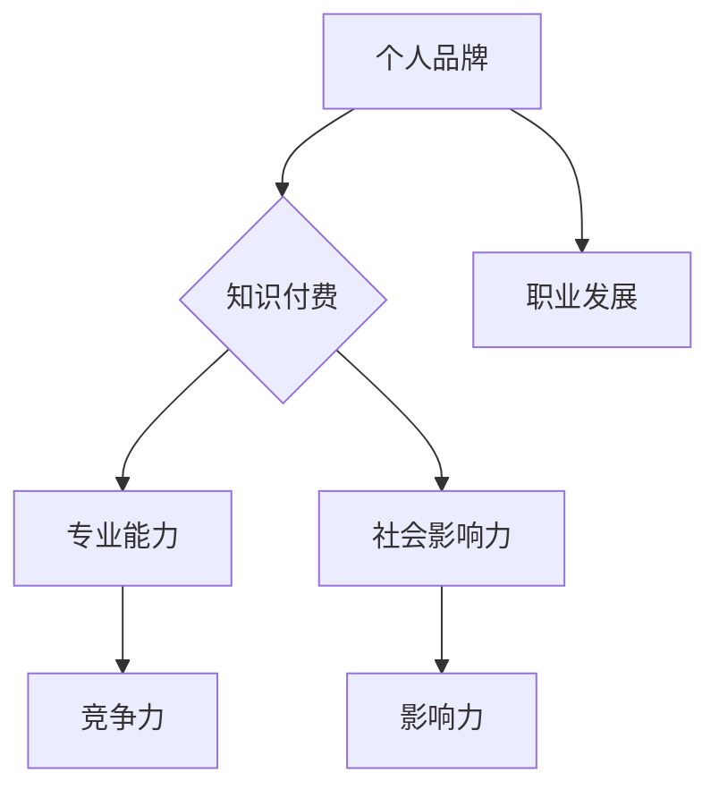

                 

关键词：个人品牌塑造、知识付费、程序员、社交媒体、技术博客、在线教育

> 摘要：本文将探讨程序员如何通过塑造个人品牌和参与知识付费，提高自身在行业中的影响力，实现职业发展。我们将分析个人品牌的重要性，提供具体策略，并探讨知识付费的趋势和机会。

## 1. 背景介绍

在数字时代，个人品牌的重要性日益凸显。对于程序员来说，个人品牌不仅是个人形象的体现，更是专业能力的展示。知识付费作为新兴的经济模式，也为程序员提供了新的收入来源和职业发展路径。本文旨在探讨程序员如何通过个人品牌塑造和知识付费，实现职业增值。

## 2. 核心概念与联系

### 个人品牌

个人品牌是指个人在公众心目中的形象和认知，它是基于个人的专业技能、个性特质和社会影响力构建的。对于程序员而言，个人品牌是展示技术实力、解决问题能力和职业素养的重要手段。

### 知识付费

知识付费是指用户为获取高质量的知识和信息而支付的费用。在互联网时代，知识付费已成为一种重要的商业模式，为用户提供了更精准、更有价值的知识获取途径。

### 个人品牌与知识付费的联系

个人品牌塑造有助于提升程序员在知识付费市场中的竞争力。一个拥有良好个人品牌的程序员，更容易吸引付费用户，实现知识变现。

### Mermaid 流程图



## 3. 核心算法原理 & 具体操作步骤

### 3.1 算法原理概述

个人品牌塑造的关键在于专业能力和社会影响力的提升。专业能力是基础，决定了个人在知识付费市场中的竞争力；社会影响力是扩展，有助于扩大个人品牌的影响力。

### 3.2 算法步骤详解

#### 3.2.1 提升专业能力

1. **持续学习**：跟进行业动态，学习新技术。
2. **实战经验**：参与开源项目，解决实际问题。
3. **技术总结**：撰写技术博客，分享心得。

#### 3.2.2 塑造社会影响力

1. **建立社交媒体账号**：在GitHub、Twitter、LinkedIn等平台活跃。
2. **参与技术社区**：在Stack Overflow、Reddit等技术论坛发言。
3. **开设线上课程**：在Coursera、Udemy等平台分享知识。

### 3.3 算法优缺点

**优点**：

- 提高个人在行业中的竞争力。
- 扩大个人影响力，实现知识变现。

**缺点**：

- 需要投入大量时间和精力。
- 面临市场竞争和评价标准的不确定性。

### 3.4 算法应用领域

- **技术博客**：分享技术心得，积累读者。
- **在线教育**：开设课程，实现知识付费。
- **开源项目**：展示专业能力，吸引同好。

## 4. 数学模型和公式 & 详细讲解 & 举例说明

### 4.1 数学模型构建

个人品牌价值 \(V\) 可以表示为：

\[ V = f(A, B) \]

其中，\(A\) 表示个人专业能力，\(B\) 表示个人社会影响力。

### 4.2 公式推导过程

\[ V = \frac{A + B}{2} \]

- \(A\) 和 \(B\) 分别表示专业能力和社会影响力的得分，满分为10分。
- 两者相加后除以2，表示两者对个人品牌价值的平均贡献。

### 4.3 案例分析与讲解

假设一位程序员，专业能力得分为8分，社会影响力得分为6分，则其个人品牌价值为7分。通过持续提升专业能力和扩大影响力，个人品牌价值有望逐步提高。

## 5. 项目实践：代码实例和详细解释说明

### 5.1 开发环境搭建

- 安装GitHub客户端。
- 注册Twitter、LinkedIn账号。
- 加入相关技术社区。

### 5.2 源代码详细实现

```python
# 示例：发布一篇技术博客
def publish_blog(title, content):
    """
    发布技术博客
    :param title: 博客标题
    :param content: 博客内容
    :return: 发布状态
    """
    print(f"发布博客：{title}")
    print(f"内容：{content}")
    # 实现博客发布逻辑
    return "成功"

# 调用函数
publish_blog("如何提升个人品牌价值", "本文介绍了提升个人品牌价值的策略...")
```

### 5.3 代码解读与分析

- `publish_blog` 函数用于发布技术博客，包含博客标题和内容参数。
- 调用函数时，传入具体参数，实现博客发布。

### 5.4 运行结果展示

```
发布博客：如何提升个人品牌价值
内容：本文介绍了提升个人品牌价值的策略...
```

## 6. 实际应用场景

- **技术博客**：分享技术心得，积累读者。
- **在线教育**：开设课程，实现知识付费。
- **开源项目**：展示专业能力，吸引同好。

## 7. 工具和资源推荐

### 7.1 学习资源推荐

- 《Python编程：从入门到实践》
- 《深度学习》
- 《Effective Java》

### 7.2 开发工具推荐

- GitHub
- Jupyter Notebook
- Visual Studio Code

### 7.3 相关论文推荐

- 《知识付费：新商业模式的兴起》
- 《社交媒体对个人品牌的影响》
- 《在线教育市场发展趋势》

## 8. 总结：未来发展趋势与挑战

### 8.1 研究成果总结

- 个人品牌塑造有助于程序员在知识付费市场中获得更多机会。
- 知识付费为程序员提供了新的收入来源和职业发展路径。

### 8.2 未来发展趋势

- 个人品牌塑造和知识付费将进一步融合。
- 新兴技术（如区块链、虚拟现实）将推动个人品牌和知识付费的发展。

### 8.3 面临的挑战

- 知识付费市场竞争激烈。
- 个人品牌塑造需要持续投入时间和精力。

### 8.4 研究展望

- 探索个人品牌与知识付费的深度融合。
- 研究新兴技术对个人品牌和知识付费的影响。

## 9. 附录：常见问题与解答

### 9.1 如何提升个人专业能力？

- 持续学习，关注行业动态。
- 参与开源项目，积累实战经验。
- 撰写技术博客，分享心得。

### 9.2 如何扩大个人社会影响力？

- 在社交媒体上活跃，分享专业内容。
- 参与技术社区，积极参与讨论。
- 开设线上课程，实现知识变现。

作者：禅与计算机程序设计艺术 / Zen and the Art of Computer Programming
```markdown
----------------------------------------------------------------
```

