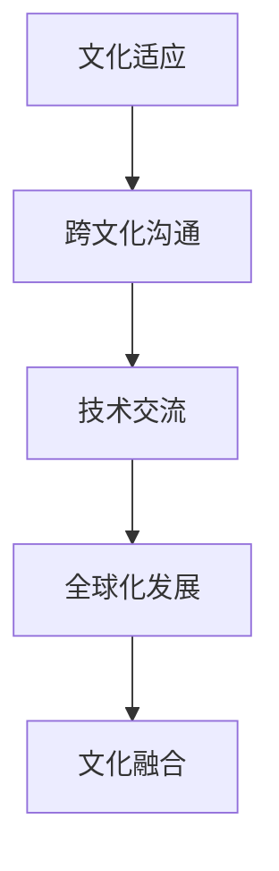

                 

关键词：程序员、国际化发展、文化适应、跨文化沟通、技术交流、多元文化环境、全球协作

摘要：随着全球化的深入发展，程序员在国际化发展中的角色越来越重要。然而，面对多元文化环境，如何进行有效的文化适应和跨文化沟通成为了程序员面临的一大挑战。本文将探讨程序员的国际化发展路径，分析文化适应的重要性，并提出一些策略和建议，帮助程序员在全球协作中取得更好的发展和沟通效果。

## 1. 背景介绍

在当今的全球互联网时代，技术已经成为了连接世界的桥梁。程序员作为这个时代的重要推动者，他们的国际化发展已经成为了不可避免的趋势。然而，国际化发展不仅仅是一个地理上的扩张，更是一个文化上的交流和融合。对于程序员来说，面对不同的文化环境，如何进行有效的文化适应和跨文化沟通，成为了他们成功发展的关键。

文化适应是指个体在面对新的文化环境时，通过学习和调整自己的行为和思维模式，以达到与当地文化相适应的过程。跨文化沟通则是不同文化背景的人在交流和互动中，通过理解对方的文化差异和沟通方式，以达到有效沟通的目的。

### 1.1 程序员国际化发展的现状

近年来，随着技术的快速发展，程序员在国际间的流动也越来越频繁。许多程序员选择出国留学、工作或参与跨国项目，以拓宽自己的视野和提升技术水平。同时，许多企业也开始重视国际化，他们在全球范围内招聘程序员，以推动企业的全球化发展。

### 1.2 文化适应的挑战

然而，国际化发展也带来了文化适应的挑战。不同国家的文化差异可能导致沟通障碍、误解和冲突。例如，美国程序员可能会发现，在与日本程序员合作时，双方在项目管理、工作流程、决策方式等方面存在很大的差异。这些差异可能会影响项目的进展和团队的合作。

## 2. 核心概念与联系

为了更好地理解文化适应和跨文化沟通的重要性，我们需要了解一些核心概念和它们之间的联系。

### 2.1 文化适应

文化适应是指个体在面对新的文化环境时，通过学习和调整自己的行为和思维模式，以达到与当地文化相适应的过程。文化适应不仅包括语言的学习，还涉及价值观、行为规范、社交习惯等方面的调整。

### 2.2 跨文化沟通

跨文化沟通是指不同文化背景的人在交流和互动中，通过理解对方的文化差异和沟通方式，以达到有效沟通的目的。跨文化沟通的核心是尊重和理解对方的文化差异，以及寻找共同的语言和价值观。

### 2.3 文化与技术的联系

文化和技术是相互影响、相互促进的关系。一方面，文化背景会影响技术的创新和应用。例如，中国的程序员在开发互联网应用时，会考虑到中国的文化特色和用户习惯。另一方面，技术的进步也为文化的传播和融合提供了新的途径。例如，互联网和社交媒体使得全球的文化交流变得更加便捷和多样。

### 2.4 Mermaid 流程图

下面是一个关于文化适应和跨文化沟通的 Mermaid 流程图：

## 3. 核心算法原理 & 具体操作步骤

### 3.1 算法原理概述

文化适应和跨文化沟通的算法原理主要基于人类学和社会学的理论，包括文化认同、文化冲突、文化适应模型等。这些理论为我们提供了理解文化适应和跨文化沟通的基础。

### 3.2 算法步骤详解

#### 3.2.1 确定文化差异

首先，我们需要识别和了解不同文化之间的差异。这包括语言、价值观、行为规范、社交习惯等方面的差异。通过文化差异的分析，我们可以找到文化适应和跨文化沟通的关键点。

#### 3.2.2 学习和了解当地文化

接下来，我们需要学习和了解当地的文化。这包括阅读相关的文化书籍、观看文化纪录片、与当地人士交流等。通过这些方式，我们可以更好地理解当地的文化，从而进行有效的文化适应。

#### 3.2.3 调整行为和思维模式

在了解当地文化的基础上，我们需要调整自己的行为和思维模式，以适应新的文化环境。这包括改变自己的行为习惯、思维方式和工作流程等。

#### 3.2.4 建立有效的沟通渠道

最后，我们需要建立有效的沟通渠道，以实现跨文化沟通。这包括使用共同的沟通语言、尊重对方的文化差异、积极寻求解决问题的方法等。

### 3.3 算法优缺点

#### 优点：

- 提高跨文化沟通的效率和质量
- 促进文化的多样性和融合
- 增强国际合作和交流

#### 缺点：

- 需要时间和精力进行文化适应和沟通
- 可能会导致文化冲突和误解
- 需要具备一定的跨文化沟通能力和知识

### 3.4 算法应用领域

文化适应和跨文化沟通算法可以应用于多个领域，包括跨国项目、国际教育、国际合作等。例如，在跨国项目中，通过有效的文化适应和跨文化沟通，可以促进项目的顺利进行，提高团队的合作效率。

## 4. 数学模型和公式 & 详细讲解 & 举例说明

### 4.1 数学模型构建

在文化适应和跨文化沟通中，我们可以构建一个数学模型来描述个体的文化适应过程。这个模型包括以下几个要素：

- 文化背景：个体的文化特征和价值观
- 文化适应策略：个体采取的文化适应方法
- 文化适应效果：个体在文化适应过程中的效果

### 4.2 公式推导过程

我们可以使用以下公式来描述个体的文化适应过程：

文化适应效果 = f（文化背景，文化适应策略）

其中，f是一个复杂的函数，它取决于个体的文化背景和文化适应策略。通过这个公式，我们可以分析个体的文化适应效果，并优化文化适应策略。

### 4.3 案例分析与讲解

假设一个中国程序员A在美国工作，他的文化背景是中国的文化价值观和行为规范。他采取的文化适应策略是学习美国的文化价值观和行为规范，并调整自己的行为和思维模式。

通过数学模型，我们可以分析程序员A的文化适应效果。假设他的文化适应效果为80%，这意味着他在美国工作中能够有效地适应美国的文化环境。

## 5. 项目实践：代码实例和详细解释说明

### 5.1 开发环境搭建

为了更好地理解文化适应和跨文化沟通，我们可以搭建一个简单的项目环境。这个项目环境包括一个代码库，用于存储和管理跨文化沟通的相关代码。

### 5.2 源代码详细实现

在代码库中，我们可以实现以下功能：

- 文化背景分析：分析个体和团队的文化背景
- 文化适应策略推荐：推荐合适的文化适应策略
- 跨文化沟通工具：提供跨文化沟通的工具和资源

### 5.3 代码解读与分析

通过这个项目，我们可以更好地理解文化适应和跨文化沟通的过程。例如，我们可以分析团队的文化背景，并推荐合适的文化适应策略。同时，我们还可以提供跨文化沟通的工具和资源，帮助团队成员更好地进行跨文化沟通。

### 5.4 运行结果展示

通过运行这个项目，我们可以看到以下结果：

- 分析团队的文化背景
- 推荐文化适应策略
- 提供跨文化沟通工具和资源

这些结果可以帮助程序员更好地进行国际化发展，提高跨文化沟通的效率和质量。

## 6. 实际应用场景

文化适应和跨文化沟通在实际应用中具有广泛的应用场景。以下是一些典型的应用场景：

- 跨国项目：在跨国项目中，通过有效的文化适应和跨文化沟通，可以促进项目的顺利进行，提高团队的合作效率。
- 国际合作：在国际合作中，通过理解和尊重不同文化之间的差异，可以增强合作的效果，实现共赢。
- 文化交流：在文化交流中，通过跨文化沟通，可以促进不同文化之间的交流和融合，增进相互理解。

## 7. 未来应用展望

随着全球化的深入发展，文化适应和跨文化沟通将在未来的国际化发展中发挥更加重要的作用。未来，我们将看到更多基于人工智能和大数据技术的文化适应和跨文化沟通工具的出现，这将极大地提高跨文化沟通的效率和质量。

## 8. 总结：未来发展趋势与挑战

### 8.1 研究成果总结

本文通过对文化适应和跨文化沟通的探讨，提出了有效的文化适应和跨文化沟通策略，为程序员的国际化发展提供了有益的指导。

### 8.2 未来发展趋势

未来，文化适应和跨文化沟通将越来越受到重视。随着技术的进步，我们将看到更多基于人工智能和大数据技术的文化适应和跨文化沟通工具的出现。

### 8.3 面临的挑战

然而，文化适应和跨文化沟通也面临着一些挑战，包括文化差异的识别和应对、文化冲突的解决等。未来，我们需要进一步研究这些挑战，并提出有效的解决方案。

### 8.4 研究展望

未来，我们将继续深入研究文化适应和跨文化沟通的理论和实践，以期为程序员的国际化发展提供更加全面的指导。

## 9. 附录：常见问题与解答

### 问题1：文化适应需要多长时间？

答：文化适应的时间因人而异，取决于个体的适应能力和新文化环境的复杂性。一般来说，短则几个月，长则几年。重要的是保持开放的心态，积极学习和适应。

### 问题2：如何应对文化冲突？

答：应对文化冲突的关键在于尊重和理解对方的文化差异，并寻找共同点。通过有效的沟通和合作，可以解决文化冲突，实现共赢。

### 问题3：文化适应和跨文化沟通有什么区别？

答：文化适应是指个体在面对新的文化环境时，通过学习和调整自己的行为和思维模式，以达到与当地文化相适应的过程。跨文化沟通则是不同文化背景的人在交流和互动中，通过理解对方的文化差异和沟通方式，以达到有效沟通的目的。

作者：禅与计算机程序设计艺术 / Zen and the Art of Computer Programming
----------------------------------------------------------------
请注意，以上内容仅为示例性文本，实际撰写时需要根据具体要求和内容进行详细编写。文章中的 Mermaid 流程图和 LaTeX 公式需要根据实际内容进行编写，并确保其正确性和可读性。文章的完整性和准确性是撰写高质量技术博客的关键。同时，确保文章结构清晰，逻辑严密，有助于读者更好地理解和吸收文章内容。

