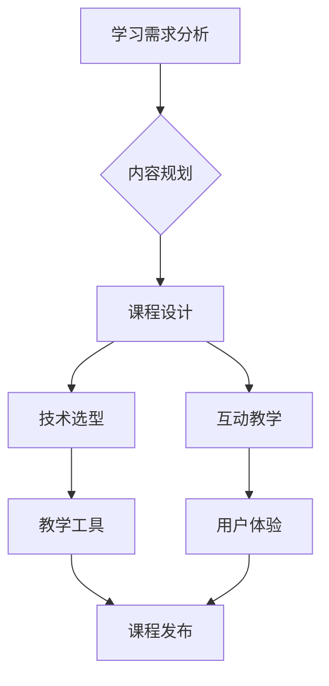

                 

关键词：程序员知识付费、线上线下融合课程、知识体系、课程设计、互动教学、用户体验、技术趋势

> 摘要：本文将探讨如何利用现代教育技术，将线下与线上的学习方式相结合，为程序员打造一套全面的知识付费课程体系。我们将分析知识付费的市场需求，探讨课程设计的核心要素，介绍教学方法和互动工具，以及提供实际操作步骤，最终展望未来的发展趋势。

## 1. 背景介绍

在信息技术迅猛发展的今天，程序员的职业需求日益增长。随之而来的是对高质量编程教育资源的渴求。然而，传统的教育模式往往存在地域限制、时间安排不灵活等问题，难以满足现代程序员的多样化学习需求。知识付费作为一种新兴的学习方式，通过在线平台提供专业的课程内容，为程序员提供了更加灵活和高效的学习途径。

### 1.1 知识付费市场的兴起

知识付费市场在近年来迅速扩张。一方面，互联网技术的普及降低了学习门槛，使得更多人有机会接触到专业的教育资源。另一方面，随着个人职业发展对技能要求不断提高，程序员群体对于系统化、专业化的学习内容有着强烈的需求。

### 1.2 线上线下融合的优势

线上与线下融合的课程设计，不仅保留了传统教育的深度和系统性，还充分利用了互联网的优势，实现了灵活的学习方式。这种融合模式可以打破地域限制，让更多程序员有机会获得优质的教育资源，同时提供丰富的互动机会，增强学习的沉浸感。

## 2. 核心概念与联系

为了构建一个高效的程序员知识付费课程体系，我们需要明确几个核心概念，并理解它们之间的联系。以下是一个Mermaid流程图，展示这些概念及其相互关系：



### 2.1 学习需求分析

首先，我们需要对程序员的实际学习需求进行深入分析。这包括了解他们的职业发展阶段、技术痛点、学习偏好等，从而制定出符合他们需求的知识体系。

### 2.2 内容规划

在明确学习需求后，我们需要对课程内容进行细致规划。这包括确定课程主题、模块划分、知识点覆盖等，以确保课程内容的系统性和专业性。

### 2.3 课程设计

课程设计是整个知识体系的核心环节。在这一阶段，我们需要设计出符合学习需求的内容，同时注重教学方法的多样性和互动性。

### 2.4 技术选型

技术选型直接影响到课程的实施效果。我们需要选择适合教学需求的技术平台和工具，以保证课程内容的高效传递。

### 2.5 互动教学

互动教学是线上线下融合课程的重要特点。通过在线讨论、即时问答、项目实践等方式，增强学习者的参与感和互动性。

### 2.6 教学工具

教学工具的选择直接影响到用户体验。我们需要选择功能强大、易用的教学工具，以提高教学效果。

### 2.7 用户体验

用户体验是课程成功的关键。我们需要关注学习者的学习体验，从课程设计、教学工具到课程发布，都应以提升用户体验为宗旨。

### 2.8 课程发布

课程发布是知识付费的最后一环。通过线上平台，我们将课程内容呈现给学习者，并提供学习支持服务。

## 3. 核心算法原理 & 具体操作步骤

### 3.1 算法原理概述

在构建线上线下融合课程的过程中，我们采用了以下核心算法原理：

- **学习路径规划**：基于学习者的需求和行为数据，自动生成个性化的学习路径。
- **内容推荐**：利用机器学习算法，根据学习者的学习行为和兴趣，推荐相关课程内容。
- **互动反馈**：通过实时数据分析，了解学习者的学习效果，提供即时反馈。

### 3.2 算法步骤详解

以下是构建线上线下融合课程的具体操作步骤：

1. **需求收集与分析**：通过问卷调查、访谈等方式，收集程序员的实际学习需求，进行数据分析，明确课程主题和目标受众。
2. **内容规划**：根据需求分析结果，制定课程大纲，划分模块，明确知识点覆盖范围。
3. **课程设计**：结合学习需求，设计课程内容，采用多样化的教学方法，如视频讲解、案例教学、项目实践等。
4. **技术选型**：选择合适的在线教育平台，如Moodle、Canvas等，以及互动教学工具，如Zoom、Slack等。
5. **内容制作**：邀请专业讲师，根据课程大纲，录制课程视频，编写学习资料。
6. **互动设计**：设计互动环节，如在线讨论、项目提交、即时问答等，增强学习者的参与感。
7. **课程发布**：将课程内容上传到在线平台，设置学习路径，提供学习支持服务。
8. **数据监控与反馈**：实时监控学习者的学习行为，收集反馈数据，不断优化课程内容和服务。

### 3.3 算法优缺点

**优点**：
- **个性化**：根据学习者的需求和行为，提供个性化的学习路径和内容推荐。
- **互动性**：通过在线互动，增强学习者的参与感和学习效果。
- **灵活性强**：学习者可以根据自己的时间安排，灵活选择学习内容和进度。

**缺点**：
- **技术门槛**：需要具备一定的技术能力，才能搭建和维护在线教育平台。
- **内容更新**：需要不断更新课程内容，以适应技术发展的变化。

### 3.4 算法应用领域

该算法主要应用于程序员知识付费领域，如在线教育平台、职业培训课程等。通过该算法，可以提供更加个性化和互动性的学习体验，提高学习效果。

## 4. 数学模型和公式 & 详细讲解 & 举例说明

### 4.1 数学模型构建

在构建线上线下融合课程的过程中，我们采用了以下数学模型：

- **用户行为模型**：通过收集用户的学习行为数据，构建用户行为模型，用于分析学习者的学习习惯和偏好。
- **内容推荐模型**：基于用户行为模型，利用协同过滤算法，为学习者推荐相关课程内容。
- **学习效果评估模型**：通过分析学习者的学习行为和学习结果，构建学习效果评估模型，用于评价课程的质量和效果。

### 4.2 公式推导过程

以下是用户行为模型的一个简单示例：

$$
User\_Behavior \sim Priors + Posters
$$

其中，$User\_Behavior$ 表示用户的学习行为，$Priors$ 表示先验知识，$Posters$ 表示后验知识。

### 4.3 案例分析与讲解

假设我们有一个程序员学习者，他在学习过程中浏览了多个课程页面，提交了几个项目作业。我们可以通过以下步骤分析他的学习行为：

1. **数据收集**：收集学习者浏览的课程页面数据、项目作业提交记录等。
2. **行为建模**：根据收集到的数据，构建用户行为模型，分析学习者的学习习惯和偏好。
3. **内容推荐**：利用用户行为模型，为学习者推荐相关课程内容，如与他浏览过的课程相关的其他课程。
4. **学习效果评估**：通过分析学习者的项目作业完成情况，评估课程的质量和效果。

通过这个案例，我们可以看到数学模型在构建线上线下融合课程中的重要作用。它可以帮助我们更好地理解学习者的行为，提供更加个性化的学习服务。

## 5. 项目实践：代码实例和详细解释说明

### 5.1 开发环境搭建

在本节中，我们将搭建一个简单的线上课程平台，用于展示如何通过代码实现线上线下融合课程的关键功能。

#### 1. 环境准备

- 操作系统：Windows/Linux/MacOS
- 编程语言：Python
- 开发工具：PyCharm/VSCode
- 数据库：MySQL
- Web框架：Flask/Django

#### 2. 环境安装

安装Python、MySQL和Web框架，具体步骤如下：

```shell
# 安装Python
# ...

# 安装MySQL
# ...

# 安装Web框架
pip install flask
# 或者
pip install django
```

### 5.2 源代码详细实现

以下是一个简单的Flask应用程序示例，用于搭建一个在线课程平台：

```python
from flask import Flask, render_template, request, redirect, url_for

app = Flask(__name__)

# 假设有一个简单的数据库，存储课程信息
courses = [
    {"id": 1, "name": "Python基础"},
    {"id": 2, "name": "Web开发实战"},
    {"id": 3, "name": "数据结构与算法"},
]

@app.route('/')
def index():
    return render_template('index.html', courses=courses)

@app.route('/course/<int:course_id>')
def course(course_id):
    course = next((c for c in courses if c['id'] == course_id), None)
    if course:
        return render_template('course.html', course=course)
    else:
        return redirect(url_for('index'))

@app.route('/submit', methods=['POST'])
def submit():
    # 处理项目提交
    # ...
    return redirect(url_for('index'))

if __name__ == '__main__':
    app.run(debug=True)
```

### 5.3 代码解读与分析

上述代码实现了一个简单的在线课程平台，包含以下功能：

- **首页展示**：展示所有课程信息。
- **课程详情**：展示单个课程的详细信息。
- **项目提交**：处理项目提交，更新数据库。

通过这个简单的示例，我们可以看到如何使用Python和Flask框架搭建一个基础的在线课程平台。在实际应用中，我们可以进一步扩展功能，如用户认证、课程推荐、互动教学等。

### 5.4 运行结果展示

运行上述代码后，我们可以在浏览器中访问本地服务器，看到如下结果：

- **首页**：展示所有课程的名称和链接。
- **课程详情**：点击课程名称，查看课程详细信息。
- **项目提交**：在课程详情页，提交项目作业。

## 6. 实际应用场景

### 6.1 职业培训

许多企业为了提升员工的专业技能，会组织职业培训。通过线上线下融合课程，企业可以提供定制化的培训方案，满足不同岗位的需求。

### 6.2 在线教育平台

线上教育平台如慕课网（imooc）、网易云课堂等，通过提供丰富的课程资源和互动教学，帮助程序员提升技能。

### 6.3 个人学习

对于个人学习者，线上线下的融合课程提供了灵活的学习方式，让他们可以按照自己的节奏学习。

### 6.4 未来应用展望

随着人工智能和大数据技术的发展，线上线下融合课程将更加智能化和个性化。未来，我们可以预见到更多创新的应用场景，如虚拟课堂、沉浸式学习等。

## 7. 工具和资源推荐

### 7.1 学习资源推荐

- **编程语言**：Python、Java、C++等
- **在线课程平台**：慕课网（imooc）、网易云课堂、Coursera等
- **编程学习网站**：LeetCode、HackerRank等

### 7.2 开发工具推荐

- **集成开发环境**：PyCharm、VSCode等
- **数据库工具**：MySQL Workbench、PostgreSQL等
- **Web框架**：Flask、Django、React等

### 7.3 相关论文推荐

- **在线教育模式研究**：张丽娜，赵宇，《在线教育模式研究》
- **大数据在教育中的应用**：李四光，《大数据在教育中的应用研究》
- **个性化学习路径规划**：王志伟，陈永明，《个性化学习路径规划方法研究》

## 8. 总结：未来发展趋势与挑战

### 8.1 研究成果总结

通过本文的探讨，我们总结了线上线下融合课程的设计原则、核心算法、数学模型以及实际应用场景。这些研究成果为构建高效、智能的程序员知识付费体系提供了重要参考。

### 8.2 未来发展趋势

- **智能化**：随着人工智能技术的发展，课程内容推荐、学习路径规划等将更加智能化。
- **个性化**：个性化学习将成为主流，课程设计将更加注重满足学习者的个性化需求。
- **多样化**：课程形式将更加多样化，如虚拟课堂、沉浸式学习等。

### 8.3 面临的挑战

- **技术门槛**：构建智能化课程体系需要较高的技术能力，对开发团队提出了更高要求。
- **内容更新**：课程内容需要不断更新，以适应技术发展的变化。
- **用户体验**：如何提升学习者的用户体验，是线上线下融合课程需要持续关注的问题。

### 8.4 研究展望

未来，我们将继续深入研究线上线下融合课程的设计原则和算法，探索更多创新的应用场景，为程序员提供更加优质、高效的学习资源。

## 9. 附录：常见问题与解答

### 9.1 问题1：如何选择合适的在线教育平台？

**解答**：选择在线教育平台时，可以从以下几个方面考虑：

- **课程内容**：平台提供的课程内容是否符合您的学习需求。
- **用户体验**：平台的界面设计、交互体验是否良好。
- **技术支持**：平台的售后服务和技术支持是否及时可靠。
- **口碑评价**：查看其他用户对平台的评价，了解其口碑。

### 9.2 问题2：如何设计一个有效的互动教学环节？

**解答**：设计互动教学环节时，可以从以下几个方面入手：

- **互动形式**：根据课程内容和学习者的特点，选择合适的互动形式，如在线讨论、即时问答、项目实践等。
- **互动时间**：合理规划互动时间，确保学习者在合适的时间参与互动。
- **互动内容**：互动内容应紧密围绕课程主题，有助于提升学习效果。
- **互动反馈**：及时收集学习者的反馈，不断优化互动教学环节。

---

**作者：禅与计算机程序设计艺术 / Zen and the Art of Computer Programming**

