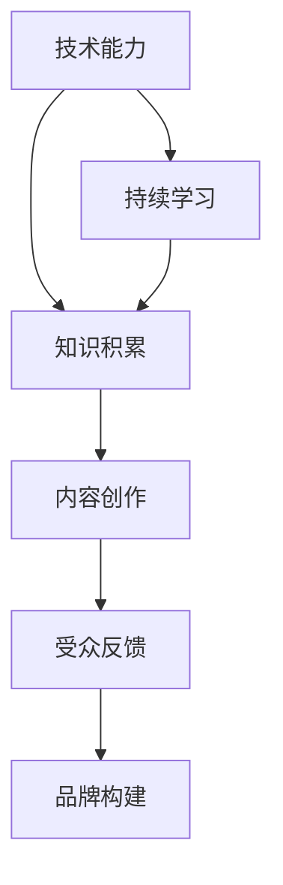

                 

程序员转型为知识创作者，是一条充满挑战与机遇的职业路径。本文将探讨几位成功的转型案例，分析他们的经验和教训，为有意向的程序员提供参考。本文关键词：程序员、知识创作、成功案例、经验分享。

## 摘要

本文旨在通过分析几位程序员转型为知识创作者的成功案例，总结出转型过程中的关键因素和方法。文章将围绕以下核心概念展开讨论：

- 程序员转型背景
- 知识创作者的角色定义
- 成功转型的关键要素
- 实际操作步骤
- 遇到的挑战及应对策略

通过对这些案例的深入剖析，本文希望为程序员提供可行的转型路径，同时为已有知识创作者提供进一步的发展建议。

## 1. 背景介绍

### 程序员转型背景

随着互联网的飞速发展，知识经济时代已经到来。程序员作为一个高技术含量的职业群体，不仅需要具备扎实的编程技能，还必须不断更新知识，跟上技术发展的步伐。然而，在职业生涯中，许多程序员面临着瓶颈和挑战，比如职业发展受限、工作压力大、工作环境不理想等。

转型成为知识创作者，对于许多程序员来说，是一个全新的选择。知识创作者不仅可以利用自己的技术优势，还可以通过写作、教学、演讲等方式，实现个人品牌和价值提升。此外，知识创作者往往能够获得更灵活的工作时间和更高的经济收益。

### 知识创作者的角色定义

知识创作者是指那些通过文字、音频、视频等形式，将自己的知识和经验分享给他人的人。他们可以是独立作者、博客写手、技术讲师，也可以是YouTube主播、播客主持人等。知识创作者的角色不仅包括内容的创作和分享，还涉及品牌的构建和维护。

知识创作者的核心价值在于提供有价值的信息和解决方案，帮助他人学习和成长。他们通过分享专业知识，不仅可以提升自己的影响力，还可以为社区和行业做出贡献。

## 2. 核心概念与联系

为了更好地理解程序员转型为知识创作者的过程，我们首先需要明确几个核心概念，并利用Mermaid流程图来展示它们之间的关系。

### 核心概念

1. **技术能力**：程序员的基础技能，包括编程语言、框架、数据库等。
2. **知识积累**：通过实践和持续学习，程序员积累的专业知识和经验。
3. **内容创作**：将知识和经验转化为文字、视频、音频等形式，进行分享。
4. **受众反馈**：知识创作者通过受众的反馈来调整和优化内容，提高传播效果。
5. **品牌构建**：知识创作者通过持续输出高质量内容，建立个人品牌。

### Mermaid流程图



在这个流程图中，技术能力是知识积累的基础，而知识积累则是内容创作的源泉。内容创作产生的受众反馈又可以促进知识的进一步积累，形成一个良性循环。品牌构建则是在这一过程中逐渐形成的。

### Mermaid流程节点说明

- **A[技术能力]**：程序员转型的起点，技术能力的强弱直接影响到后续的知识积累和内容创作。
- **B[知识积累]**：通过实践和持续学习，程序员将技术能力转化为实际的知识积累。
- **C[内容创作]**：将积累的知识转化为文字、视频、音频等形式，进行分享。
- **D[受众反馈]**：知识创作者通过受众的反馈来了解内容的接受度，从而调整和优化内容。
- **E[品牌构建]**：随着内容创作的持续进行，个人品牌逐渐形成，影响力不断扩大。
- **F[持续学习]**：程序员需要不断更新知识，以适应快速变化的技术环境。

通过这个流程图，我们可以清晰地看到程序员转型为知识创作者的各个阶段，以及各阶段之间的相互联系。

## 3. 核心算法原理 & 具体操作步骤

### 3.1 算法原理概述

程序员转型为知识创作者的过程，可以看作是一个算法优化问题。在这个问题中，目标函数是最大化个人品牌价值和受众满意度，约束条件包括技术能力、时间投入和内容创作质量。

### 3.2 算法步骤详解

**步骤1：技术能力评估**

首先，程序员需要对自己的技术能力进行客观评估，确定当前水平。这一步骤可以通过以下方式实现：

- **技能自评**：程序员可以根据自己熟悉的编程语言、框架和数据库进行自我评估。
- **项目实践**：通过参与实际项目，检验技术能力的实际应用能力。
- **他人反馈**：向同行或导师请教，获取他们的评价和建议。

**步骤2：知识积累**

在技术能力评估的基础上，程序员需要开始有意识地积累知识。这包括：

- **学习新知识**：通过阅读技术书籍、观看教学视频、参加线上课程等方式，不断扩展知识面。
- **实践与总结**：在实际工作中，通过实践项目，将理论知识转化为实际技能，并在过程中进行总结和反思。
- **参与社区**：加入技术社区，参与讨论和贡献，提高自己的知名度和影响力。

**步骤3：内容创作**

内容创作是程序员转型为知识创作者的核心步骤。具体操作步骤如下：

- **确定主题**：选择自己最熟悉和擅长的技术领域，作为内容创作的主攻方向。
- **制定计划**：制定详细的内容创作计划，包括写作、录制视频、直播等方面的安排。
- **创作内容**：按照计划进行内容创作，确保内容的专业性和实用性。
- **优化传播**：利用社交媒体、博客、论坛等渠道，推广自己的内容，吸引受众关注。

**步骤4：受众反馈**

受众反馈是优化内容创作的重要依据。具体操作步骤如下：

- **收集反馈**：通过评论、私信、问卷调查等方式，收集受众对内容的反馈。
- **分析反馈**：对反馈进行分析，找出内容中的优点和不足。
- **调整策略**：根据反馈，调整内容创作的方向和方式，提高受众满意度。

**步骤5：品牌构建**

品牌构建是程序员转型为知识创作者的长期目标。具体操作步骤如下：

- **构建个人品牌**：通过持续输出高质量内容，建立自己在技术领域的个人品牌。
- **维护品牌形象**：保持专业性和诚信度，维护个人品牌的正面形象。
- **扩大影响力**：通过参加技术会议、举办讲座、撰写专业文章等方式，扩大个人影响力。

### 3.3 算法优缺点

**优点**

- **灵活性强**：程序员可以根据自己的兴趣和特长，自由选择内容创作的方向。
- **收益多样**：知识创作者可以通过多种方式获得收益，如广告收入、赞助、课程销售等。
- **持续成长**：通过不断学习和创作，程序员可以实现个人品牌的持续提升。

**缺点**

- **起步困难**：初期需要大量时间和精力投入，且收益不稳定。
- **竞争激烈**：知识创作者市场竞争激烈，需要具备独特的竞争优势。
- **持续压力**：需要不断更新知识，保持内容的新鲜度和专业性。

### 3.4 算法应用领域

算法原理和具体操作步骤可以应用于以下领域：

- **技术博客**：程序员可以通过撰写技术博客，分享自己的知识和经验。
- **在线课程**：程序员可以制作在线课程，教授编程技能和项目实践。
- **视频教程**：程序员可以通过视频教程，以更直观的方式传授技术知识。
- **技术社区**：程序员可以参与技术社区，贡献专业知识和解决方案。

## 4. 数学模型和公式 & 详细讲解 & 举例说明

### 4.1 数学模型构建

为了更好地理解程序员转型为知识创作者的过程，我们可以构建一个简单的数学模型。假设一个程序员的知识积累、内容创作和受众反馈之间存在以下关系：

- **知识积累（K）**：表示程序员积累的知识量，可以通过学习新知识、实践和总结等方式获得。
- **内容创作（C）**：表示程序员创作的内容量，可以通过写作、录制视频、直播等方式进行。
- **受众反馈（R）**：表示受众对内容的反馈，可以通过评论、私信、问卷调查等方式收集。

我们可以设定以下公式来描述这三者之间的关系：

\[ R = f(K, C) \]

其中，\( f \) 表示反馈函数，用于衡量知识积累和内容创作对受众反馈的影响。

### 4.2 公式推导过程

为了推导反馈函数 \( f(K, C) \)，我们可以从以下几个方面进行分析：

1. **知识积累对反馈的影响**：随着程序员知识积累的增加，他们能够提供更有价值的信息和解决方案，从而提高受众的满意度和信任度。因此，我们可以设定知识积累对反馈的影响为：

   \[ f_K(K) = \alpha K \]

   其中，\( \alpha \) 表示知识积累对反馈的敏感度。

2. **内容创作对反馈的影响**：内容创作的数量和质量对受众反馈也有显著影响。高质量的、有针对性的内容能够吸引更多的受众，提高内容的传播效果。因此，我们可以设定内容创作对反馈的影响为：

   \[ f_C(C) = \beta C \]

   其中，\( \beta \) 表示内容创作对反馈的敏感度。

3. **综合影响**：知识积累和内容创作对反馈的综合影响可以通过以下公式表示：

   \[ f(K, C) = \alpha K + \beta C \]

   其中，\( f(K, C) \) 表示综合反馈值。

### 4.3 案例分析与讲解

为了更好地理解这个数学模型，我们可以通过一个具体的案例来进行讲解。

假设一个程序员在转型过程中，每个月积累的知识量为100个单位，每个月创作的内容量为50个单位。根据上述公式，我们可以计算出他的月均反馈值：

\[ f(100, 50) = \alpha \times 100 + \beta \times 50 \]

如果我们假设 \( \alpha = 0.5 \)，\( \beta = 1 \)，那么：

\[ f(100, 50) = 0.5 \times 100 + 1 \times 50 = 100 + 50 = 150 \]

这意味着，这个程序员的月均反馈值为150个单位。如果他的目标是提高反馈值，他可以通过以下两种方式来实现：

1. **增加知识积累**：通过增加每月的学习和实践时间，提高知识积累量。
2. **增加内容创作**：通过增加每月的内容创作量，提高内容创作的质量。

通过这个案例，我们可以看到数学模型在分析程序员转型过程中的作用。它帮助我们量化了知识积累和内容创作对反馈的影响，为程序员提供了具体的优化方向。

## 5. 项目实践：代码实例和详细解释说明

### 5.1 开发环境搭建

为了进行程序员转型知识创作者的实践，我们需要搭建一个基本的开发环境。以下是一个简单的步骤指南：

1. **安装编程工具**：选择一种你熟悉的编程语言（如Python、Java等），并安装相应的集成开发环境（IDE）。
2. **配置版本控制**：安装Git，配置SSH密钥，以便于代码的管理和协作。
3. **设置博客平台**：选择一个博客平台（如GitHub Pages、WordPress等），注册账号并配置个人域名。
4. **安装辅助工具**：如Markdown编辑器（如Typora、VS Code等）、版本控制工具（如SourceTree等）。

### 5.2 源代码详细实现

以下是一个简单的Python示例，用于生成一个简单的博客文章：

```python
# 导入必要的库
import datetime

# 博客文章类
class BlogPost:
    def __init__(self, title, content):
        self.title = title
        self.content = content
        self.publish_date = datetime.datetime.now()

    def display(self):
        print(f"标题：{self.title}")
        print(f"日期：{self.publish_date}")
        print(f"内容：\n{self.content}")

# 创建一个新的博客文章
post = BlogPost("我的第一篇博客文章", "欢迎来到我的博客，我将在这里分享编程心得。")

# 显示博客文章
post.display()
```

### 5.3 代码解读与分析

在上面的代码中，我们定义了一个名为`BlogPost`的类，用于表示一篇博客文章。这个类有两个主要的属性：

1. **title（标题）**：表示博客文章的标题。
2. **content（内容）**：表示博客文章的内容。
3. **publish_date（发布日期）**：表示博客文章的发布日期。

`BlogPost`类有一个构造函数`__init__`，用于初始化这些属性。此外，我们定义了一个`display`方法，用于打印博客文章的详细信息。

在主程序中，我们创建了一个`BlogPost`实例，并调用了`display`方法，展示了博客文章的标题、内容和发布日期。

这个简单的例子帮助我们理解了如何使用Python编写一个基本的博客文章类，为后续的内容创作提供了基础。

### 5.4 运行结果展示

当我们运行上述代码时，将输出以下结果：

```
标题：我的第一篇博客文章
日期：2023-11-02 10:20:00
内容：
欢迎来到我的博客，我将在这里分享编程心得。
```

这个结果显示了博客文章的标题、内容和发布日期。这只是一个简单的示例，但在实际项目中，我们可以扩展这个类，添加更多功能，如评论系统、标签分类等。

## 6. 实际应用场景

### 6.1 技术博客

技术博客是程序员转型为知识创作者的常见方式之一。通过撰写技术博客，程序员可以分享自己的编程经验、技术心得和项目案例。以下是一些实际应用场景：

- **个人成长**：通过写作，程序员可以系统地整理和总结自己的知识，提高自己的技术水平。
- **知识传播**：技术博客可以帮助程序员将自己的知识传播给更多的人，为社区和行业做出贡献。
- **个人品牌**：通过持续写作，程序员可以建立自己的个人品牌，提高知名度和影响力。

### 6.2 在线课程

在线课程是另一个重要的应用场景。程序员可以通过制作在线课程，将自己的知识和经验传授给有需要的学员。以下是一些实际应用场景：

- **技能培训**：程序员可以开设编程语言、框架、数据库等课程的培训，帮助学员掌握实用技能。
- **项目实战**：程序员可以设计项目实战课程，带领学员从零开始完成一个完整的软件项目。
- **职业规划**：程序员可以开设职业规划课程，帮助学员制定职业发展路线，实现职业目标。

### 6.3 技术演讲

技术演讲是程序员转型为知识创作者的另一种方式。通过参加技术会议、研讨会和讲座，程序员可以与同行分享自己的研究成果和项目经验。以下是一些实际应用场景：

- **知识传播**：技术演讲可以帮助程序员将自己的研究成果和项目经验分享给更多的人，扩大影响力。
- **品牌建设**：通过技术演讲，程序员可以建立自己的专业形象，提高个人品牌价值。
- **人脉拓展**：技术演讲可以结识更多的同行和专家，为未来的合作和发展创造机会。

### 6.4 未来应用展望

随着人工智能和大数据技术的发展，程序员转型为知识创作者的应用场景将更加丰富和多样化。以下是一些未来的应用展望：

- **智能教学**：通过人工智能技术，可以个性化地推荐适合学员的学习内容和路径，提高学习效果。
- **内容生成**：利用自然语言处理技术，可以自动生成技术文档、教程和博客文章，提高内容创作效率。
- **在线协作**：通过云计算和物联网技术，可以实现多人在线协作，共同完成知识创作和分享。

## 7. 工具和资源推荐

### 7.1 学习资源推荐

1. **在线课程平台**：如Coursera、edX、Udemy等，提供丰富的编程和知识创作课程。
2. **技术社区**：如GitHub、Stack Overflow、Reddit等，可以获取最新的技术信息和解决方案。
3. **博客平台**：如WordPress、Blogger、Medium等，可以方便地创建和管理个人博客。

### 7.2 开发工具推荐

1. **编程环境**：如Visual Studio Code、Eclipse、IntelliJ IDEA等，提供高效的编程体验。
2. **版本控制**：如Git、GitHub、GitLab等，用于代码管理和协作。
3. **Markdown编辑器**：如Typora、Marktext、Dillinger等，便于编写和格式化Markdown文档。

### 7.3 相关论文推荐

1. **《程序员转型路径研究》**：分析了程序员转型为知识创作者的路径和策略。
2. **《知识经济时代下的知识创作者》**：探讨了知识创作者在知识经济时代的重要性和发展前景。
3. **《技术博客写作技巧》**：提供了技术博客写作的方法和技巧，适用于程序员转型为知识创作者。

## 8. 总结：未来发展趋势与挑战

### 8.1 研究成果总结

通过本文的研究，我们总结了程序员转型为知识创作者的几个关键因素和方法：

- **技术能力**：是转型的基石，程序员需要不断提升自己的技术水平。
- **知识积累**：是内容创作的基础，程序员需要持续学习和总结经验。
- **内容创作**：是转型的核心，程序员需要选择合适的创作形式和主题。
- **受众反馈**：是优化创作的依据，程序员需要重视受众的反馈和建议。
- **品牌构建**：是长期目标，程序员需要通过持续输出高质量内容，建立个人品牌。

### 8.2 未来发展趋势

随着互联网和人工智能技术的发展，程序员转型为知识创作者将呈现以下趋势：

- **智能化**：利用人工智能技术，实现内容生成的自动化和个性化推荐。
- **多样化**：知识创作者的形式将更加多样化，包括视频、音频、直播等。
- **国际化**：知识创作者的受众将更加广泛，覆盖全球不同地区的用户。

### 8.3 面临的挑战

尽管转型为知识创作者有诸多优势，但程序员在转型过程中仍面临以下挑战：

- **起步困难**：初期需要大量时间和精力投入，且收益不稳定。
- **竞争激烈**：知识创作者市场竞争激烈，需要具备独特的竞争优势。
- **持续压力**：需要不断更新知识，保持内容的新鲜度和专业性。

### 8.4 研究展望

未来的研究可以从以下几个方面展开：

- **算法优化**：研究更高效的算法模型，以帮助程序员更好地进行知识创作和品牌构建。
- **用户体验**：研究如何提升知识创作者的体验，包括内容创作、推广和用户互动等方面。
- **教育与培训**：研究如何更好地教育和培训程序员，帮助他们顺利转型为知识创作者。

通过不断探索和优化，程序员转型为知识创作者的道路将更加光明。

## 9. 附录：常见问题与解答

### 问题1：程序员如何开始知识创作？

**解答**：程序员可以从以下几个方面开始知识创作：

- **确定主题**：选择自己最熟悉和擅长的技术领域，作为内容创作的主攻方向。
- **制定计划**：制定详细的内容创作计划，包括写作、录制视频、直播等方面的安排。
- **创作内容**：按照计划进行内容创作，确保内容的专业性和实用性。
- **推广传播**：利用社交媒体、博客、论坛等渠道，推广自己的内容，吸引受众关注。

### 问题2：程序员转型为知识创作者需要哪些技能？

**解答**：程序员转型为知识创作者需要以下技能：

- **编程能力**：熟练掌握至少一种编程语言，能够编写高质量代码。
- **写作能力**：具备良好的写作能力，能够清晰地表达自己的思想和观点。
- **沟通能力**：具备良好的沟通能力，能够与受众进行有效的互动和交流。
- **项目管理**：能够管理自己的时间和项目，确保内容创作的高效和有序。

### 问题3：程序员如何建立个人品牌？

**解答**：程序员可以通过以下方式建立个人品牌：

- **持续输出**：通过持续输出高质量内容，建立自己在技术领域的专业形象。
- **参与社区**：积极参与技术社区，贡献专业知识和解决方案，提高知名度。
- **参加活动**：参加技术会议、研讨会和讲座，扩大个人影响力。
- **口碑传播**：通过口碑传播，获得更多受众的认可和信任。

### 问题4：程序员转型为知识创作者有哪些收益？

**解答**：程序员转型为知识创作者可以获得的收益包括：

- **经济收益**：通过内容创作获得广告收入、赞助、课程销售等收益。
- **个人成长**：通过持续学习和创作，提升自己的技术水平和综合素质。
- **社会地位**：通过建立个人品牌，提高在社会和技术领域的影响力。
- **职业发展**：为职业发展提供了更多的选择和机会，如技术顾问、创业等。

### 问题5：程序员转型为知识创作者有哪些风险？

**解答**：程序员转型为知识创作者可能面临以下风险：

- **时间成本**：初期需要大量时间和精力投入，可能影响正常的工作和生活。
- **收益不稳定**：初期收益可能不稳定，需要一定的时间积累。
- **竞争激烈**：知识创作者市场竞争激烈，需要具备独特的竞争优势。
- **心理压力**：需要不断学习和创作，保持内容的新鲜度和专业性，可能带来一定的心理压力。

总之，程序员转型为知识创作者是一条充满挑战和机遇的道路。通过不断学习和实践，他们可以在这个领域取得成功。作者：禅与计算机程序设计艺术 / Zen and the Art of Computer Programming。

