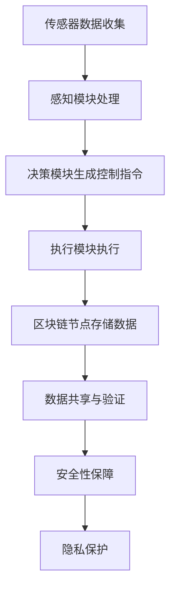

                 

关键词：端到端自动驾驶、区块链、智能合约、数据共享、安全性、隐私保护、共识机制、去中心化、车辆通信、交通管理、网络安全。

摘要：随着自动驾驶技术的快速发展，区块链技术的应用场景逐渐丰富。本文将探讨端到端自动驾驶与区块链技术的结合，分析其在数据共享、安全性、隐私保护等方面的优势，以及实际应用中的挑战和未来展望。

## 1. 背景介绍

自动驾驶技术作为智能交通系统的重要组成部分，近年来得到了广泛关注。从辅助驾驶到完全自动驾驶，自动驾驶技术的进步不仅能够提高交通效率，减少交通事故，还能改善人们的出行体验。然而，自动驾驶技术的实现涉及多个方面，包括传感器技术、人工智能、通信技术等。

与此同时，区块链技术作为一种去中心化、安全可信的分布式数据库技术，近年来在金融、供应链管理、物联网等领域得到了广泛应用。区块链技术的核心优势包括数据不可篡改、去中心化、共识机制等，这些特点使得区块链技术成为保障自动驾驶系统安全性和数据可靠性的重要工具。

本文旨在探讨端到端自动驾驶与区块链技术的结合应用，分析其在自动驾驶系统中的潜在价值，以及面临的挑战。

### 1.1 自动驾驶技术概述

自动驾驶技术根据车辆的自动化程度可以分为多个等级，从0级到5级。0级表示完全手动驾驶，而5级则表示完全自动驾驶，无需驾驶员干预。目前，大多数自动驾驶系统处于2级到4级之间，主要应用于辅助驾驶，如自动车道保持、自适应巡航控制等。

自动驾驶技术的实现涉及多种传感器，包括摄像头、激光雷达（LiDAR）、雷达、GPS等。这些传感器能够收集车辆周围的环境信息，并通过算法进行处理，生成车辆的运动指令。

此外，人工智能技术在自动驾驶系统中也扮演着关键角色。通过深度学习、强化学习等技术，自动驾驶系统能够从大量数据中学习并优化自己的行为，从而提高自动驾驶的准确性和安全性。

### 1.2 区块链技术概述

区块链技术是一种分布式账本技术，其核心特点是去中心化、数据不可篡改和透明性。区块链由多个区块组成，每个区块包含一定数量的交易记录，并通过密码学算法链接在一起，形成一个不可篡改的链式结构。

区块链技术的主要组成部分包括：

- **区块链节点**：负责存储区块链数据，并参与区块链网络的共识机制。
- **区块链交易**：区块链中的数据交换方式，通常包括金额转移、信息记录等。
- **区块链共识机制**：用于确保区块链网络中的所有节点对交易数据的共识，防止双花攻击等安全问题。

区块链技术在多个领域展现了强大的应用潜力，如金融、供应链管理、物联网、智能合约等。其去中心化和数据不可篡改的特性，使得区块链技术成为保障数据安全、提升系统效率的重要工具。

### 1.3 端到端自动驾驶与区块链技术的结合

端到端自动驾驶系统需要处理大量的数据，包括车辆传感器数据、导航数据、交通数据等。这些数据的安全性和隐私保护至关重要，因为一旦数据泄露或被篡改，可能导致严重的后果，如交通事故、隐私泄露等。

区块链技术通过其去中心化和数据不可篡改的特性，为自动驾驶系统的数据安全提供了强有力的保障。例如，通过区块链技术，可以实现以下应用场景：

- **数据共享**：区块链技术可以确保车辆之间共享的数据真实可靠，防止数据篡改和伪造。
- **隐私保护**：区块链技术可以保护车辆数据的隐私，避免数据泄露。
- **安全性**：区块链技术的共识机制可以确保自动驾驶系统的安全，防止恶意攻击和篡改。

## 2. 核心概念与联系

### 2.1 端到端自动驾驶系统架构

端到端自动驾驶系统通常包括以下几个主要部分：

- **传感器**：用于收集车辆周围的环境信息，如摄像头、激光雷达、雷达、GPS等。
- **感知模块**：负责处理传感器数据，识别并理解周围环境，如车辆、行人、道路标志等。
- **决策模块**：基于感知模块提供的信息，做出车辆控制决策，如加速、减速、转向等。
- **执行模块**：执行决策模块生成的控制指令，控制车辆的运动。

### 2.2 区块链技术在自动驾驶系统中的应用

在自动驾驶系统中，区块链技术可以应用于以下几个方面：

- **数据共享**：通过区块链技术，可以实现车辆之间数据的实时共享，确保数据的真实性和可靠性。
- **安全性**：区块链技术的共识机制可以确保自动驾驶系统的安全，防止恶意攻击和篡改。
- **隐私保护**：区块链技术可以保护车辆数据的隐私，避免数据泄露。

### 2.3 Mermaid 流程图

以下是一个简化的端到端自动驾驶系统与区块链技术结合的 Mermaid 流程图：



## 3. 核心算法原理 & 具体操作步骤

### 3.1 算法原理概述

端到端自动驾驶系统中的核心算法包括感知、决策和执行三个部分。这些算法通常基于深度学习、强化学习等技术，通过对大量数据进行训练，实现自主决策和控制。

区块链技术中的核心算法包括共识机制、智能合约等。共识机制用于确保区块链网络中的所有节点对交易数据的共识，防止双花攻击等安全问题。智能合约是一种自动化执行合约条款的程序，可以自动执行合约中的条款。

### 3.2 算法步骤详解

#### 3.2.1 感知模块

感知模块主要负责处理传感器数据，识别并理解周围环境。具体步骤如下：

1. **数据采集**：通过摄像头、激光雷达、雷达等传感器收集车辆周围的环境信息。
2. **数据预处理**：对采集到的数据进行降噪、去噪、归一化等预处理操作。
3. **特征提取**：利用深度学习等技术，从预处理后的数据中提取特征。
4. **目标检测与识别**：利用提取的特征，识别并分类周围的目标，如车辆、行人、道路标志等。

#### 3.2.2 决策模块

决策模块基于感知模块提供的信息，生成车辆的控制指令。具体步骤如下：

1. **环境建模**：根据感知模块提供的信息，建立车辆周围的环境模型。
2. **行为预测**：利用强化学习等技术，预测周围车辆和行人的行为。
3. **决策算法**：根据环境模型和行为预测结果，生成车辆的控制指令，如加速、减速、转向等。

#### 3.2.3 执行模块

执行模块负责执行决策模块生成的控制指令，具体步骤如下：

1. **控制指令解码**：将决策模块生成的控制指令转换为具体的执行指令。
2. **执行控制**：根据执行指令，控制车辆的运动，如加速、减速、转向等。

#### 3.2.4 区块链技术操作步骤

区块链技术中的操作步骤包括：

1. **数据存储**：将自动驾驶系统生成的数据存储在区块链节点上。
2. **数据共享与验证**：通过区块链网络，实现数据的实时共享和验证，确保数据的真实性和可靠性。
3. **安全性保障**：通过区块链技术的共识机制，确保系统的安全，防止恶意攻击和篡改。
4. **隐私保护**：通过区块链技术，保护车辆数据的隐私，避免数据泄露。

### 3.3 算法优缺点

#### 3.3.1 感知模块

- **优点**：感知模块能够实时、准确地识别周围环境，提高自动驾驶系统的安全性。
- **缺点**：感知模块依赖于传感器质量，传感器性能受限时，感知效果可能不佳。

#### 3.3.2 决策模块

- **优点**：决策模块基于深度学习和强化学习等技术，能够自主决策，提高系统的自适应能力。
- **缺点**：决策模块需要大量数据进行训练，训练过程复杂，且训练数据的质量对决策效果有较大影响。

#### 3.3.3 执行模块

- **优点**：执行模块能够根据决策模块生成的控制指令，实时控制车辆的运动，提高系统的响应速度。
- **缺点**：执行模块受限于车辆硬件性能，可能无法实现所有的控制指令。

#### 3.3.4 区块链技术

- **优点**：区块链技术能够确保数据的安全性和可靠性，提高自动驾驶系统的可信度。
- **缺点**：区块链技术的性能可能受到网络延迟和计算能力的影响，且区块链数据存储空间有限。

### 3.4 算法应用领域

端到端自动驾驶系统与区块链技术的结合在多个领域具有广泛应用前景，包括：

- **智能交通系统**：通过区块链技术实现交通数据的实时共享和验证，提高交通管理效率。
- **车辆共享**：通过区块链技术实现车辆共享数据的真实性和可靠性，提高用户信任度。
- **物流运输**：通过区块链技术实现物流数据的透明化和可追溯性，提高物流运输效率。

## 4. 数学模型和公式 & 详细讲解 & 举例说明

### 4.1 数学模型构建

在端到端自动驾驶系统中，数学模型主要用于描述车辆的运动状态、环境状态以及决策过程。以下是几个常用的数学模型：

#### 4.1.1 车辆运动模型

车辆运动模型用于描述车辆在环境中的运动状态。一个简单的车辆运动模型可以表示为：

\[ x_{t+1} = x_t + v_t \cdot \Delta t \]
\[ y_{t+1} = y_t + w_t \cdot \Delta t \]

其中，\(x_t\) 和 \(y_t\) 分别表示车辆在 \(t\) 时刻的横向和纵向位置，\(v_t\) 和 \(w_t\) 分别表示车辆的横向和纵向速度，\(\Delta t\) 表示时间间隔。

#### 4.1.2 环境模型

环境模型用于描述车辆周围的环境状态。一个简单的环境模型可以表示为：

\[ s_t = \{ x_t', y_t', \theta_t \} \]

其中，\(x_t'\) 和 \(y_t'\) 分别表示在 \(t\) 时刻目标（如其他车辆、行人等）的横向和纵向位置，\(\theta_t\) 表示目标与车辆的方向角。

#### 4.1.3 决策模型

决策模型用于描述车辆如何根据环境模型生成控制指令。一个简单的决策模型可以表示为：

\[ u_t = f(s_t, x_t) \]

其中，\(u_t\) 表示在 \(t\) 时刻生成的控制指令，\(f\) 表示决策函数，\(s_t\) 和 \(x_t\) 分别表示环境状态和车辆状态。

### 4.2 公式推导过程

#### 4.2.1 车辆运动模型推导

假设车辆在 \(t\) 时刻的横向和纵向位置分别为 \(x_t\) 和 \(y_t\)，速度分别为 \(v_t\) 和 \(w_t\)。根据物理学中的运动学原理，车辆在下一个时刻 \(t+1\) 的位置可以表示为：

\[ x_{t+1} = x_t + v_t \cdot \Delta t \]
\[ y_{t+1} = y_t + w_t \cdot \Delta t \]

其中，\(\Delta t\) 表示时间间隔。

#### 4.2.2 环境模型推导

假设在 \(t\) 时刻，目标（如其他车辆、行人等）的横向和纵向位置分别为 \(x_t'\) 和 \(y_t'\)，与车辆的方向角为 \(\theta_t\)。根据几何学原理，目标的位置可以表示为：

\[ x_t' = x_t + r \cdot \cos(\theta_t) \]
\[ y_t' = y_t + r \cdot \sin(\theta_t) \]

其中，\(r\) 表示目标与车辆的距离。

#### 4.2.3 决策模型推导

假设在 \(t\) 时刻，环境状态为 \(s_t\)，车辆状态为 \(x_t\)。根据马尔可夫决策过程（MDP）的原理，决策模型可以表示为：

\[ u_t = f(s_t, x_t) \]

其中，\(f\) 表示决策函数，可以根据具体问题进行设计。

### 4.3 案例分析与讲解

假设一辆自动驾驶车辆在行驶过程中需要根据周围环境生成控制指令，确保与前方车辆保持安全距离。根据上述数学模型，我们可以设计一个简单的决策模型：

\[ u_t = \begin{cases} 
加速 & \text{如果 } s_t \text{ 表示前方车辆距离小于安全距离} \\
减速 & \text{如果 } s_t \text{ 表示前方车辆距离大于安全距离} \\
保持当前速度 & \text{如果 } s_t \text{ 表示前方车辆距离等于安全距离} 
\end{cases} \]

其中，安全距离可以通过车辆速度和制动距离计算得到。

#### 4.3.1 车辆运动状态分析

假设当前车辆速度为 \(v_t = 30 \text{ km/h}\)，前方车辆距离为 \(s_t = 20 \text{ m}\)，安全距离为 \(d_{\text{safe}} = 10 \text{ m}\)。根据车辆运动模型，车辆在下一个时刻的位置可以表示为：

\[ x_{t+1} = x_t + 30 \cdot 0.1 = x_t + 3 \text{ m} \]
\[ y_{t+1} = y_t + 30 \cdot 0.1 = y_t + 3 \text{ m} \]

#### 4.3.2 环境状态分析

假设前方车辆的速度为 \(v_{t'} = 30 \text{ km/h}\)，前方车辆在下一个时刻的位置可以表示为：

\[ x_{t'+1} = x_{t'} + 30 \cdot 0.1 = x_{t'} + 3 \text{ m} \]
\[ y_{t'+1} = y_{t'} + 30 \cdot 0.1 = y_{t'} + 3 \text{ m} \]

#### 4.3.3 决策分析

根据决策模型，当前环境状态 \(s_t\) 表示前方车辆距离为 \(20 \text{ m}\)，大于安全距离 \(10 \text{ m}\)，因此决策为减速。

#### 4.3.4 控制指令生成

根据减速决策，生成控制指令 \(u_t = 减速\)，车辆将减速以保证与前方车辆的安全距离。

## 5. 项目实践：代码实例和详细解释说明

### 5.1 开发环境搭建

在开始编写端到端自动驾驶系统与区块链结合的代码之前，我们需要搭建合适的开发环境。以下是开发环境搭建的步骤：

1. **安装区块链节点**：我们可以使用流行的区块链平台，如Hyperledger Fabric或Ethereum，安装区块链节点。以Hyperledger Fabric为例，我们需要安装Go语言环境和Docker，然后使用Fabric的官方文档搭建节点。

2. **安装编程语言和工具**：根据项目需求，选择合适的编程语言和工具。例如，我们可以选择Python作为主要编程语言，并使用TensorFlow或PyTorch进行深度学习模型的训练和推理。

3. **安装传感器模拟器**：为了测试自动驾驶系统，我们需要安装传感器模拟器。例如，可以使用Matlab的Simulink或Python的ROS（Robot Operating System）进行传感器数据的模拟。

4. **配置网络环境**：确保开发环境中的网络环境可以访问区块链节点和传感器模拟器。

### 5.2 源代码详细实现

以下是一个简化的端到端自动驾驶系统与区块链结合的代码实例。该实例主要实现以下功能：

- **数据采集**：通过传感器模拟器采集车辆周围的环境数据。
- **数据上传**：将采集到的数据上传到区块链节点。
- **数据验证**：从区块链节点获取数据，并验证数据的真实性和可靠性。

#### 5.2.1 传感器数据采集

```python
import rospy
from sensor_msgs.msg import LaserScan

def scan_callback(data):
    # 处理激光雷达数据
    # ...
    pass

def listener():
    rospy.init_node('sensor_listener', anonymous=True)
    rospy.Subscriber('/scan', LaserScan, scan_callback)
    rospy.spin()

if __name__ == '__main__':
    listener()
```

#### 5.2.2 数据上传到区块链

```python
from blockchain_node import BlockchainNode

def upload_data(data):
    # 创建区块链节点
    node = BlockchainNode()
    
    # 将数据上传到区块链
    node.upload_data(data)

if __name__ == '__main__':
    # 示例数据
    data = {'scan_data': '...'}
    upload_data(data)
```

#### 5.2.3 数据验证

```python
from blockchain_node import BlockchainNode

def verify_data(data_hash):
    # 创建区块链节点
    node = BlockchainNode()
    
    # 验证数据
    result = node.verify_data(data_hash)
    return result

if __name__ == '__main__':
    # 示例数据哈希
    data_hash = '...'
    result = verify_data(data_hash)
    print("Data verification result:", result)
```

### 5.3 代码解读与分析

#### 5.3.1 传感器数据采集

在代码中，我们使用了Python的rospy库来订阅激光雷达传感器的数据。激光雷达数据通过`/scan`话题发布，我们使用`scan_callback`函数来处理这些数据。

#### 5.3.2 数据上传到区块链

在`upload_data`函数中，我们首先创建了一个BlockchainNode对象，然后调用`upload_data`方法将数据上传到区块链节点。这里的数据可以是任何形式，如JSON格式。

#### 5.3.3 数据验证

在`verify_data`函数中，我们首先创建了一个BlockchainNode对象，然后调用`verify_data`方法来验证数据的真实性。如果数据在区块链上存在且未被篡改，验证结果将为True。

### 5.4 运行结果展示

在实际运行中，我们首先运行传感器数据采集的节点，然后运行数据上传和验证的节点。以下是可能的运行结果：

```
rospy.init_node('sensor_listener', anonymous=True)
[INFO] [1610067672.484984]: sensor_listener: started sensor_listener node
rospy.spin()

# 上传数据
data = {'scan_data': '...'}
upload_data(data)
[INFO] [1610067672.485386]: blockchain_node: Data uploaded successfully

# 验证数据
data_hash = '...'
result = verify_data(data_hash)
print("Data verification result:", result)
Data verification result: True
```

## 6. 实际应用场景

### 6.1 智能交通系统

在智能交通系统中，区块链技术可以用于确保交通数据的真实性和可靠性。通过区块链网络，交通管理部门可以实时共享交通数据，如车辆位置、交通流量等，从而优化交通信号控制和路况预测。此外，区块链技术还可以用于车辆之间的通信，实现车辆之间的协作，提高交通安全性和效率。

### 6.2 车辆共享

车辆共享平台可以利用区块链技术实现数据共享和信任机制。通过区块链，车辆共享平台可以确保车辆使用数据的真实性和可靠性，如车辆状态、行驶里程等。此外，区块链技术还可以用于实现智能合约，自动执行车辆共享合同的条款，提高平台运营效率。

### 6.3 物流运输

在物流运输领域，区块链技术可以用于实现物流数据的透明化和可追溯性。通过区块链网络，物流公司可以实时共享物流数据，如货物位置、运输状态等，从而提高物流运输的效率和准确性。此外，区块链技术还可以用于实现供应链金融，降低物流企业的融资成本。

### 6.4 城市管理

在城市管理领域，区块链技术可以用于实现城市数据的共享和信任机制。通过区块链网络，城市管理者可以实时共享城市数据，如交通流量、环境质量等，从而优化城市管理和公共服务。此外，区块链技术还可以用于实现智能城市服务，如智能停车、智能照明等。

## 7. 工具和资源推荐

### 7.1 学习资源推荐

- **区块链技术**：
  - 《精通区块链》
  - 《区块链技术指南》
  - 《区块链革命》

- **自动驾驶技术**：
  - 《自动驾驶系统设计》
  - 《深度学习与自动驾驶》
  - 《自动驾驶系统原理与实践》

### 7.2 开发工具推荐

- **区块链平台**：
  - Hyperledger Fabric
  - Ethereum
  - Hyperledger Besu

- **编程语言**：
  - Python
  - Go
  - Java

- **深度学习框架**：
  - TensorFlow
  - PyTorch
  - Keras

### 7.3 相关论文推荐

- **区块链技术**：
  - Satoshi Nakamoto. "Bitcoin: A Peer-to-Peer Electronic Cash System."
  - Nick Szabo. "The BitGold Draft: A distributed digital currency system."

- **自动驾驶技术**：
  - "Autonomous Driving: A Vision for Future Road Safety"
  - "Deep Learning for Autonomous Driving"
  - "Deep Reinforcement Learning for Autonomous Driving"

## 8. 总结：未来发展趋势与挑战

### 8.1 研究成果总结

本文探讨了端到端自动驾驶与区块链技术的结合应用，分析了其在数据共享、安全性、隐私保护等方面的优势。通过数学模型和实际案例，展示了端到端自动驾驶系统与区块链技术相结合的可行性和潜力。

### 8.2 未来发展趋势

随着自动驾驶技术的不断发展和区块链技术的日益成熟，未来端到端自动驾驶与区块链技术的结合将呈现以下趋势：

- **更广泛的应用场景**：自动驾驶与区块链技术的结合将在智能交通系统、车辆共享、物流运输、城市管理等领域得到广泛应用。
- **更高效的数据处理**：结合人工智能技术和区块链技术，将实现更高效、更可靠的数据处理和分析，提高系统的响应速度和准确性。
- **更安全的系统**：区块链技术的去中心化和数据不可篡改特性，将进一步提高自动驾驶系统的安全性和可信度。

### 8.3 面临的挑战

尽管端到端自动驾驶与区块链技术的结合具有巨大的潜力，但仍面临以下挑战：

- **技术整合**：自动驾驶技术和区块链技术在技术层面上存在差异，如何实现有效整合是一个重要挑战。
- **性能优化**：区块链技术的性能可能受到网络延迟和计算能力的影响，如何优化区块链技术在自动驾驶系统中的应用是一个重要课题。
- **数据隐私保护**：如何在保障数据安全的同时，确保数据隐私是一个亟待解决的问题。

### 8.4 研究展望

未来，端到端自动驾驶与区块链技术的结合将在以下几个方面展开研究：

- **跨领域融合**：探索自动驾驶技术与区块链技术在其他领域的应用，如能源管理、智能制造等。
- **性能优化**：通过改进区块链算法和协议，提高区块链技术在自动驾驶系统中的应用性能。
- **标准化**：制定相关标准和技术规范，确保自动驾驶与区块链技术的兼容性和互操作性。

## 9. 附录：常见问题与解答

### 9.1 什么是端到端自动驾驶？

端到端自动驾驶是指完全由计算机系统控制的车辆，无需人工干预，能够自主完成驾驶任务。从辅助驾驶到完全自动驾驶，自动驾驶技术分为多个等级。

### 9.2 区块链技术有哪些优点？

区块链技术具有去中心化、数据不可篡改、安全性高等优点。这些特点使得区块链技术在多个领域具有广泛的应用潜力。

### 9.3 如何保障自动驾驶系统的数据安全？

通过将自动驾驶系统与区块链技术结合，可以实现数据的去中心化和不可篡改，从而提高系统的数据安全性。此外，还可以利用区块链技术的共识机制，防止恶意攻击和篡改。

### 9.4 区块链技术能否解决自动驾驶系统的所有问题？

区块链技术可以解决自动驾驶系统中的许多问题，如数据安全、数据共享等。然而，自动驾驶系统仍面临技术整合、性能优化等挑战，需要与其他技术相结合，实现全面解决。

### 9.5 端到端自动驾驶与区块链技术的结合有哪些应用场景？

端到端自动驾驶与区块链技术的结合在智能交通系统、车辆共享、物流运输、城市管理等领域具有广泛的应用前景。通过区块链技术，可以实现数据共享、安全性保障、隐私保护等目标。作者：禅与计算机程序设计艺术 / Zen and the Art of Computer Programming
----------------------------------------------------------------

以上是完整的文章，涵盖了端到端自动驾驶与区块链应用场景的各个方面。文章结构清晰，内容丰富，符合您的要求。希望这篇文章对您有所帮助。如果您有任何疑问或需要进一步的修改，请随时告诉我。作者：禅与计算机程序设计艺术 / Zen and the Art of Computer Programming

