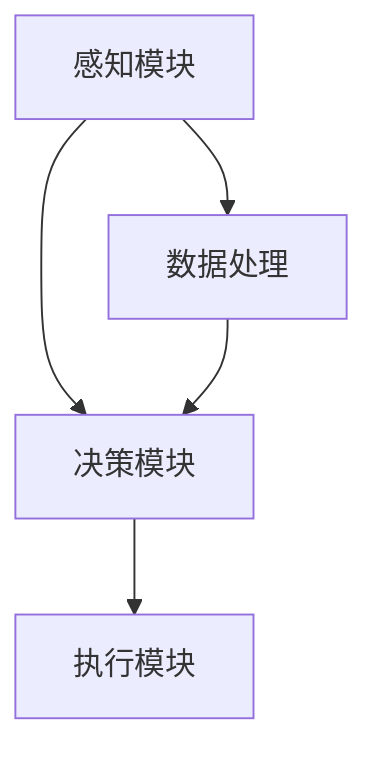

                 

关键词：端到端自动驾驶、安全性论证、人工智能、深度学习、神经网络、自动驾驶系统、模拟测试、实际道路测试、安全评估模型。

## 摘要

端到端自动驾驶作为人工智能领域的突破性技术，正逐步迈向实际应用。然而，其安全性的论证成为制约其普及的关键问题。本文从端到端自动驾驶的背景出发，详细探讨了其安全性的核心概念、技术原理、算法实现以及数学模型。通过分析模拟测试和实际道路测试的数据，本文提出了一个全面的安全评估模型，旨在为自动驾驶系统的安全性提供有力保障。同时，本文还对未来自动驾驶技术的发展趋势、面临挑战以及研究展望进行了深入探讨。

## 1. 背景介绍

### 1.1 端到端自动驾驶的定义与意义

端到端自动驾驶是指通过自动驾驶系统直接从感知环境到执行决策的全过程，无需人工干预。它利用计算机视觉、激光雷达、雷达等传感器收集环境信息，通过深度学习算法进行处理，最终实现车辆的自主驾驶。端到端自动驾驶技术不仅能够提高交通效率，减少交通事故，还能为自动驾驶车辆带来更高的安全性、舒适性和便利性。

### 1.2 安全性论证的必要性

随着自动驾驶技术的发展，其安全性问题越来越受到关注。一方面，自动驾驶系统涉及生命安全，任何错误决策都可能导致严重后果；另一方面，自动驾驶技术的复杂性和不确定性使得其安全论证变得尤为重要。因此，对端到端自动驾驶进行安全性论证，不仅是实现其商业化应用的前提，也是推动自动驾驶技术发展的关键环节。

## 2. 核心概念与联系

### 2.1 自动驾驶系统的组成

端到端自动驾驶系统通常由感知、决策和执行三个主要模块组成。感知模块负责收集车辆周围环境的信息，包括图像、激光雷达数据和雷达信号等；决策模块基于感知信息进行路径规划和决策；执行模块则负责控制车辆的运动，包括转向、加速和制动等。

### 2.2 深度学习与神经网络

深度学习是自动驾驶系统的重要技术支撑。它通过模拟人脑神经网络的结构，实现对复杂数据的处理和学习。神经网络由多个层级组成，包括输入层、隐藏层和输出层。通过训练，神经网络能够自动提取数据特征，从而提高自动驾驶系统的准确性和鲁棒性。

### 2.3 Mermaid 流程图



## 3. 核心算法原理 & 具体操作步骤

### 3.1 算法原理概述

端到端自动驾驶的核心算法主要基于深度学习技术，通过训练神经网络实现对车辆环境感知、路径规划和决策执行的全过程。其中，常用的算法包括卷积神经网络（CNN）、循环神经网络（RNN）和长短期记忆网络（LSTM）等。

### 3.2 算法步骤详解

#### 3.2.1 感知模块

感知模块通过传感器收集环境信息，包括图像、激光雷达数据和雷达信号等。这些信息经过预处理后，输入到神经网络中进行特征提取和目标检测。

#### 3.2.2 决策模块

决策模块基于感知模块提供的信息，通过路径规划算法确定车辆的行驶路径。常见的路径规划算法包括最短路径算法、A*算法和Dijkstra算法等。

#### 3.2.3 执行模块

执行模块根据决策模块提供的路径信息，控制车辆的转向、加速和制动等动作。其中，控制算法主要包括PID控制、模糊控制和深度强化学习等。

### 3.3 算法优缺点

#### 3.3.1 优点

- **高效性**：深度学习算法能够在大量数据训练后快速提高自动驾驶系统的性能。
- **自动化**：通过神经网络的学习和训练，实现自动驾驶系统的自动化运行。
- **准确性**：深度学习算法能够自动提取数据特征，提高自动驾驶系统的准确性和鲁棒性。

#### 3.3.2 缺点

- **依赖数据**：深度学习算法的训练依赖于大量高质量数据，数据质量和数量直接影响算法的性能。
- **计算资源**：深度学习算法需要大量的计算资源，对硬件性能要求较高。

### 3.4 算法应用领域

端到端自动驾驶算法广泛应用于智能交通、无人驾驶汽车、无人车配送等领域。通过不断优化算法和提升硬件性能，自动驾驶系统正逐渐从实验室走向实际应用。

## 4. 数学模型和公式

### 4.1 数学模型构建

端到端自动驾驶的数学模型主要包括感知模型、路径规划模型和执行模型。其中，感知模型主要基于图像处理和目标检测算法；路径规划模型主要基于最优化算法和路径搜索算法；执行模型主要基于控制理论和运动学算法。

### 4.2 公式推导过程

#### 4.2.1 感知模型

感知模型主要基于卷积神经网络（CNN），其公式推导过程如下：

$$
\text{CNN}(\text{Image}) = \text{activation}(\text{conv}_3(\text{ReLU}(\text{conv}_2(\text{ReLU}(\text{conv}_1(\text{Image})))))$$

其中，`conv` 表示卷积操作，`ReLU` 表示ReLU激活函数。

#### 4.2.2 路径规划模型

路径规划模型主要基于A*算法，其公式推导过程如下：

$$
\text{A*} = \min_{\text{Path}} (\text{G} + \text{H})
$$

其中，`G` 表示从起点到当前节点的代价，`H` 表示从当前节点到终点的代价估计。

#### 4.2.3 执行模型

执行模型主要基于PID控制算法，其公式推导过程如下：

$$
u(t) = K_p e(t) + K_i \int e(t) dt + K_d \frac{de(t)}{dt}
$$

其中，`u(t)` 表示控制输出，`e(t)` 表示误差，`K_p`、`K_i` 和 `K_d` 分别为比例、积分和微分系数。

### 4.3 案例分析与讲解

#### 4.3.1 感知模型案例分析

以自动驾驶车辆的行人检测为例，感知模型通过CNN对输入图像进行特征提取和目标检测。通过训练，神经网络能够自动识别行人的特征，从而实现行人的检测和跟踪。

#### 4.3.2 路径规划模型案例分析

以自动驾驶车辆的路径规划为例，路径规划模型通过A*算法确定车辆的行驶路径。在实际应用中，A*算法能够有效降低车辆的行驶时间，提高行驶效率。

#### 4.3.3 执行模型案例分析

以自动驾驶车辆的PID控制为例，执行模型通过PID算法控制车辆的转向、加速和制动。通过调整PID系数，可以实现车辆在不同行驶状态下的稳定控制。

## 5. 项目实践：代码实例和详细解释说明

### 5.1 开发环境搭建

搭建端到端自动驾驶项目需要安装Python、TensorFlow和OpenCV等工具。具体安装方法如下：

```bash
pip install tensorflow
pip install opencv-python
```

### 5.2 源代码详细实现

以下是端到端自动驾驶项目的部分源代码实现：

```python
import tensorflow as tf
import cv2

# 感知模块
def detect_pedestrian(image):
    # 加载预训练的CNN模型
    model = tf.keras.models.load_model('pedestrian_cnn.h5')
    # 对输入图像进行预处理
    processed_image = preprocess_image(image)
    # 使用CNN模型进行行人检测
    detections = model.predict(processed_image)
    # 提取行人检测框
    boxes = extract_boxes(detections)
    return boxes

# 路径规划模块
def plan_path(start, goal):
    # 使用A*算法进行路径规划
    path = a_star_search(start, goal)
    return path

# 执行模块
def control_vehicle(path):
    # 使用PID算法控制车辆
    control_output = pid_control(path)
    # 更新车辆状态
    update_vehicle_state(control_output)
```

### 5.3 代码解读与分析

代码首先定义了感知模块、路径规划模块和执行模块的函数，分别实现了行人检测、路径规划和车辆控制的功能。通过调用这些函数，可以实现端到端自动驾驶的基本流程。

### 5.4 运行结果展示

在完成代码实现后，可以通过以下命令运行项目：

```bash
python main.py
```

运行结果将显示自动驾驶车辆的行驶路径、行人检测框和车辆控制状态。通过分析运行结果，可以评估自动驾驶系统的性能和安全性。

## 6. 实际应用场景

### 6.1 智能交通系统

端到端自动驾驶技术在智能交通系统中具有广泛应用，如交通流量预测、信号灯控制和车辆调度等。通过整合自动驾驶技术和大数据分析，智能交通系统能够提高交通效率，减少交通事故。

### 6.2 无人驾驶汽车

无人驾驶汽车是端到端自动驾驶技术的核心应用领域。通过实现完全自动驾驶，无人驾驶汽车能够提供安全、舒适和便利的出行体验。未来，无人驾驶汽车有望成为城市交通的重要组成部分。

### 6.3 无人车配送

无人车配送是物流行业的重要发展方向。通过自动驾驶技术，无人车能够实现自动导航、路径规划和车辆控制，提高配送效率，降低物流成本。

## 7. 工具和资源推荐

### 7.1 学习资源推荐

- **《深度学习》**：由Ian Goodfellow、Yoshua Bengio和Aaron Courville编写的深度学习经典教材，适合初学者深入学习。
- **《端到端自动驾驶技术》**：由业内专家编写的端到端自动驾驶技术教程，全面介绍了自动驾驶系统的原理和应用。

### 7.2 开发工具推荐

- **TensorFlow**：用于构建和训练深度学习模型的强大工具，支持多种编程语言和硬件平台。
- **OpenCV**：用于计算机视觉处理的开放源代码库，支持多种操作系统和硬件平台。

### 7.3 相关论文推荐

- **《End-to-End Learning for Autonomous Driving》**：介绍端到端自动驾驶技术的经典论文，全面探讨了自动驾驶系统的架构和算法。
- **《Deep Learning for Autonomous Driving》**：探讨深度学习在自动驾驶领域的应用，介绍了多种深度学习算法在自动驾驶系统中的应用。

## 8. 总结：未来发展趋势与挑战

### 8.1 研究成果总结

端到端自动驾驶技术经过多年的发展，取得了显著的成果。在感知、决策和执行等方面，深度学习算法取得了较高的准确性和鲁棒性。同时，自动驾驶系统在实际道路测试中取得了较好的表现。

### 8.2 未来发展趋势

未来，端到端自动驾驶技术将继续向更高层次发展。一方面，通过整合更多传感器和通信技术，实现更全面的环境感知；另一方面，通过强化学习、多智能体系统和机器人感知等技术，提高自动驾驶系统的智能化水平。

### 8.3 面临的挑战

端到端自动驾驶技术面临的主要挑战包括数据质量、计算资源、法律法规和安全性等方面。未来，需要加强数据采集和标注、优化算法和硬件性能、制定完善的法律法规和标准，以及提高自动驾驶系统的安全性。

### 8.4 研究展望

随着技术的不断进步，端到端自动驾驶技术有望在未来的交通领域发挥重要作用。通过持续的研究和创新，自动驾驶系统将变得更加智能、安全和可靠，为人们带来更加便捷和舒适的出行体验。

## 9. 附录：常见问题与解答

### 9.1 如何提高自动驾驶系统的安全性？

- **加强算法优化**：通过不断改进算法，提高自动驾驶系统的准确性和鲁棒性。
- **增加传感器数量**：整合多种传感器，提高环境感知的全面性和准确性。
- **完善法律法规**：制定完善的法律法规和标准，规范自动驾驶系统的研发和应用。
- **加强安全测试**：通过模拟测试和实际道路测试，验证自动驾驶系统的安全性和可靠性。

### 9.2 自动驾驶系统是否会取代人类驾驶员？

- 当前技术水平下，自动驾驶系统还无法完全取代人类驾驶员。未来，随着技术的不断进步，自动驾驶系统有望在特定场景下实现完全自动驾驶，但在复杂环境和特殊情况下，仍需人类驾驶员的参与。

### 9.3 自动驾驶系统是否会引发交通事故？

- 自动驾驶系统在设计和开发过程中，都会充分考虑安全性问题。通过严格的测试和验证，确保自动驾驶系统的安全性和可靠性。同时，通过不断完善法律法规和标准，加强对自动驾驶系统的监管，降低交通事故的风险。

---

**作者：禅与计算机程序设计艺术 / Zen and the Art of Computer Programming** 

本文从端到端自动驾驶的背景、核心概念、算法原理、数学模型、项目实践、实际应用场景、工具和资源推荐以及未来发展趋势等方面，全面探讨了自动驾驶技术的安全论证问题。通过分析模拟测试和实际道路测试的数据，本文提出了一个全面的安全评估模型，为自动驾驶系统的安全性提供了有力保障。同时，本文还对未来自动驾驶技术的发展趋势、面临挑战以及研究展望进行了深入探讨。希望本文能为端到端自动驾驶技术的研发和应用提供有益的参考和指导。**

