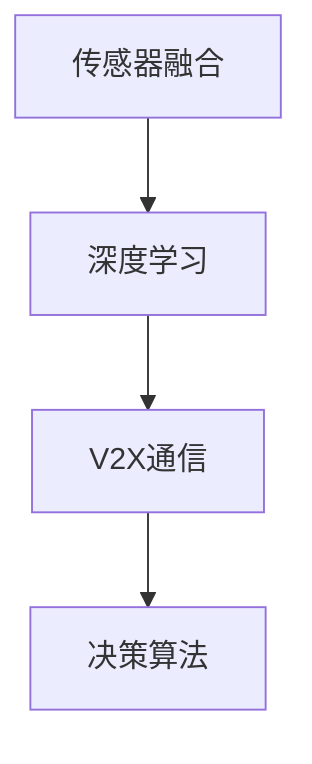

                 

关键词：端到端自动驾驶系统、深度学习、传感器融合、V2X通信、AI优化、决策算法、自动驾驶汽车、智能交通系统

> 摘要：本文旨在深入探讨端到端自动驾驶系统的关键技术及其应用，分析其在车辆控制、传感器融合、V2X通信和AI优化等方面的核心原理和具体实现，并对未来自动驾驶技术的发展趋势与挑战进行展望。

## 1. 背景介绍

随着人工智能技术的飞速发展和自动驾驶技术的不断成熟，端到端自动驾驶系统已成为智能交通领域的研究热点。自动驾驶系统旨在实现车辆的自主驾驶，减少人为操作，提高交通安全和效率。端到端自动驾驶系统是一种将传感器数据直接输入到神经网络模型中，通过深度学习算法进行训练，最终实现车辆自主决策和控制的系统。

端到端自动驾驶系统的出现，打破了传统自动驾驶技术的瓶颈，使得自动驾驶汽车在环境感知、路径规划和控制等方面取得了显著的进步。同时，V2X通信技术的应用，进一步提升了自动驾驶系统的安全性和可靠性。本文将从核心概念、算法原理、数学模型、项目实践、应用场景和未来展望等方面，对端到端自动驾驶系统进行详细阐述。

## 2. 核心概念与联系

端到端自动驾驶系统的核心概念包括：传感器融合、深度学习、V2X通信和决策算法。下面将分别介绍这些核心概念及其相互关系。

### 2.1 传感器融合

传感器融合是将多种传感器获取的信息进行整合，提高环境感知的准确性和实时性。端到端自动驾驶系统常用的传感器包括：摄像头、激光雷达、超声波传感器和GPS等。传感器融合的关键在于将不同类型的传感器数据进行对齐、融合和预处理，从而为后续的深度学习算法提供高质量的数据输入。

### 2.2 深度学习

深度学习是一种基于人工神经网络的学习方法，通过多层神经网络对大量数据进行训练，从而实现从数据中自动提取特征，并进行分类、预测和决策。在端到端自动驾驶系统中，深度学习算法主要用于环境感知、路径规划和控制等任务。

### 2.3 V2X通信

V2X通信是指车辆与车辆（V2V）、车辆与基础设施（V2I）以及车辆与行人（V2P）之间的通信。V2X通信技术可以实时传输车辆位置、速度、方向和道路状况等信息，为自动驾驶系统提供更全面的环境信息，提高系统的安全性和可靠性。

### 2.4 决策算法

决策算法是自动驾驶系统的核心组成部分，主要负责根据环境感知和路径规划的结果，生成车辆的控制指令。决策算法包括路径规划、轨迹生成、避障和控制等子任务。在端到端自动驾驶系统中，决策算法通常基于深度学习算法进行训练和优化。

### 2.5 Mermaid 流程图

下面是一个端到端自动驾驶系统的 Mermaid 流程图，展示了各个核心概念之间的联系。



## 3. 核心算法原理 & 具体操作步骤

### 3.1 算法原理概述

端到端自动驾驶系统的核心算法包括：传感器数据预处理、深度学习模型训练、V2X通信协议实现和决策算法优化。下面将分别介绍这些算法的原理和具体操作步骤。

### 3.2 算法步骤详解

#### 3.2.1 传感器数据预处理

传感器数据预处理是端到端自动驾驶系统的关键步骤，主要包括以下任务：

1. 数据采集：采集车辆周围的摄像头、激光雷达、超声波传感器和GPS等传感器的数据。
2. 数据清洗：去除噪声、异常值和缺失值，确保数据质量。
3. 数据对齐：将不同传感器的数据进行对齐，使其在同一坐标系下进行融合。
4. 数据特征提取：提取传感器数据的关键特征，如物体轮廓、速度和加速度等。

#### 3.2.2 深度学习模型训练

深度学习模型训练是端到端自动驾驶系统的核心步骤，主要包括以下任务：

1. 网络结构设计：根据任务需求，设计合适的深度学习网络结构，如卷积神经网络（CNN）和循环神经网络（RNN）等。
2. 数据标注：对预处理后的传感器数据进行标注，生成训练样本。
3. 模型训练：利用训练样本，对深度学习模型进行训练和优化。
4. 模型评估：通过测试样本对模型进行评估，调整模型参数，提高模型性能。

#### 3.2.3 V2X通信协议实现

V2X通信协议实现是端到端自动驾驶系统的关键环节，主要包括以下任务：

1. 通信协议设计：设计适用于自动驾驶系统的V2X通信协议，如DSRC、LTE-V2X和5G等。
2. 数据传输：实现车辆与车辆、车辆与基础设施和车辆与行人之间的实时数据传输。
3. 通信安全：确保V2X通信过程中数据的安全性和可靠性，采用加密和认证等技术。

#### 3.2.4 决策算法优化

决策算法优化是端到端自动驾驶系统的关键环节，主要包括以下任务：

1. 路径规划：根据环境感知结果，生成车辆行驶的路径。
2. 轨迹生成：根据路径规划结果，生成车辆的行驶轨迹。
3. 避障：根据传感器数据和轨迹，实时更新车辆的行驶轨迹，避免障碍物。
4. 控制：根据轨迹和避障结果，生成车辆的控制指令，如加速、减速和转向等。

### 3.3 算法优缺点

#### 3.3.1 优点

1. 端到端自动驾驶系统将传统自动驾驶技术的多个子任务集成到一个框架中，简化了系统设计，提高了开发效率。
2. 深度学习算法能够从大量传感器数据中自动提取特征，实现更准确的环境感知和路径规划。
3. V2X通信技术能够提供实时、可靠的环境信息，提高自动驾驶系统的安全性和可靠性。
4. 决策算法的优化，使得自动驾驶车辆能够更灵活、智能地应对复杂交通场景。

#### 3.3.2 缺点

1. 端到端自动驾驶系统的训练过程复杂，需要大量高质量的数据和计算资源。
2. 深度学习算法在处理不确定性和异常情况时，可能存在局限性。
3. V2X通信技术尚未完全普及，需要进一步优化和推广。
4. 决策算法的实时性要求高，对硬件性能和算法优化提出了更高的要求。

### 3.4 算法应用领域

端到端自动驾驶系统的算法应用领域广泛，主要包括：

1. 高端自动驾驶汽车：实现无人驾驶、自动泊车等功能。
2. 智能交通系统：实现车流监控、信号控制、事故预警等功能。
3. 物流配送：实现无人驾驶物流车、无人机等配送系统。
4. 城市管理：实现智慧城市、智能交通管理等功能。

## 4. 数学模型和公式 & 详细讲解 & 举例说明

### 4.1 数学模型构建

端到端自动驾驶系统中的数学模型主要包括：

1. 传感器数据处理模型：描述传感器数据采集、预处理和特征提取的过程。
2. 深度学习模型：描述神经网络的结构、参数和学习过程。
3. V2X通信模型：描述V2X通信协议、数据传输和加密算法。
4. 决策模型：描述路径规划、轨迹生成、避障和控制算法。

### 4.2 公式推导过程

以下是端到端自动驾驶系统中的几个关键数学公式的推导过程：

#### 4.2.1 传感器数据处理模型

假设传感器数据为 $X=\{x_1, x_2, ..., x_n\}$，其中 $x_i$ 表示第 $i$ 个传感器的数据。传感器数据处理模型的目标是提取出关键特征，记为 $Y=\{y_1, y_2, ..., y_m\}$，其中 $y_j$ 表示第 $j$ 个特征。

$$
y_j = f_j(x_i)
$$

其中 $f_j(x_i)$ 表示第 $j$ 个特征提取函数。常见的特征提取函数包括：

$$
f_1(x_i) = \text{mean}(x_i) \quad \text{（平均值）}
$$

$$
f_2(x_i) = \text{std}(x_i) \quad \text{（标准差）}
$$

$$
f_3(x_i) = \text{min}(x_i) \quad \text{（最小值）}
$$

$$
f_4(x_i) = \text{max}(x_i) \quad \text{（最大值）}
$$

#### 4.2.2 深度学习模型

假设深度学习模型为 $L(\theta)$，其中 $\theta$ 表示模型的参数。深度学习模型的目标是最小化损失函数 $L(\theta)$，从而得到最优参数 $\theta^*$。

$$
\theta^* = \arg\min_{\theta} L(\theta)
$$

常见的损失函数包括：

$$
L(\theta) = \frac{1}{2} \sum_{i=1}^{n} (\hat{y}_i - y_i)^2 \quad \text{（均方误差）}
$$

$$
L(\theta) = -\sum_{i=1}^{n} y_i \log(\hat{y}_i) + (1 - y_i) \log(1 - \hat{y}_i) \quad \text{（交叉熵损失）}
$$

#### 4.2.3 V2X通信模型

假设V2X通信模型为 $C(\lambda)$，其中 $\lambda$ 表示通信参数。V2X通信模型的目标是最大化通信质量，记为 $Q$。

$$
\lambda^* = \arg\max_{\lambda} Q(\lambda)
$$

常见的通信质量指标包括：

$$
Q(\lambda) = \frac{1}{2} \sum_{i=1}^{n} (\hat{r}_i - r_i)^2 \quad \text{（均方误差）}
$$

$$
Q(\lambda) = \frac{1}{n} \sum_{i=1}^{n} \log(1 + \frac{P}{N_0} \hat{r}_i) \quad \text{（信噪比）}
$$

#### 4.2.4 决策模型

假设决策模型为 $D(\phi)$，其中 $\phi$ 表示决策参数。决策模型的目标是最小化决策误差，记为 $E$。

$$
\phi^* = \arg\min_{\phi} E(\phi)
$$

常见的决策误差指标包括：

$$
E(\phi) = \frac{1}{2} \sum_{i=1}^{n} (\hat{u}_i - u_i)^2 \quad \text{（均方误差）}
$$

$$
E(\phi) = -\sum_{i=1}^{n} u_i \log(\hat{u}_i) + (1 - u_i) \log(1 - \hat{u}_i) \quad \text{（交叉熵误差）}
$$

### 4.3 案例分析与讲解

#### 4.3.1 案例背景

假设我们要设计一个端到端自动驾驶系统，实现车辆在复杂城市道路环境中的自主驾驶。系统需要处理摄像头、激光雷达和GPS等多种传感器数据，通过深度学习算法进行环境感知和路径规划，并利用V2X通信技术与其他车辆和基础设施进行实时信息交换。

#### 4.3.2 案例分析

1. **传感器数据处理模型**

   - 摄像头数据：提取物体轮廓、速度和加速度等特征。
   - 激光雷达数据：提取障碍物距离、形状和速度等特征。
   - GPS数据：提取车辆位置、速度和方向等特征。

   $$ y_j = f_j(x_i) $$

   其中 $f_j(x_i)$ 表示传感器数据特征提取函数。

2. **深度学习模型**

   - 网络结构：采用卷积神经网络（CNN）进行环境感知和路径规划。
   - 训练样本：从大量实时传感器数据中提取训练样本。
   - 模型训练：使用梯度下降算法进行模型训练。

   $$ L(\theta) = \frac{1}{2} \sum_{i=1}^{n} (\hat{y}_i - y_i)^2 $$

   其中 $L(\theta)$ 表示损失函数。

3. **V2X通信模型**

   - 通信协议：采用LTE-V2X通信协议。
   - 数据传输：实现车辆与车辆、车辆与基础设施之间的实时数据传输。
   - 通信安全：采用加密和认证技术确保通信安全。

   $$ Q(\lambda) = \frac{1}{n} \sum_{i=1}^{n} \log(1 + \frac{P}{N_0} \hat{r}_i) $$

   其中 $Q(\lambda)$ 表示通信质量。

4. **决策模型**

   - 路径规划：基于深度学习模型生成的路径规划结果。
   - 轨迹生成：根据路径规划结果生成车辆的行驶轨迹。
   - 避障：根据传感器数据和轨迹，实时更新车辆的行驶轨迹。
   - 控制：根据轨迹和避障结果，生成车辆的控制指令。

   $$ E(\phi) = -\sum_{i=1}^{n} u_i \log(\hat{u}_i) + (1 - u_i) \log(1 - \hat{u}_i) $$

   其中 $E(\phi)$ 表示决策误差。

#### 4.3.3 案例讲解

通过以上分析，我们可以将端到端自动驾驶系统的实现过程总结为以下几个步骤：

1. 采集摄像头、激光雷达和GPS等多种传感器数据。
2. 对传感器数据进行预处理和特征提取。
3. 使用深度学习模型进行环境感知和路径规划。
4. 实现V2X通信协议，与其他车辆和基础设施进行实时信息交换。
5. 根据深度学习模型生成的路径规划结果，生成车辆的行驶轨迹。
6. 根据传感器数据和轨迹，实时更新车辆的行驶轨迹，避免障碍物。
7. 根据轨迹和避障结果，生成车辆的控制指令，实现车辆的自主驾驶。

## 5. 项目实践：代码实例和详细解释说明

### 5.1 开发环境搭建

为了实现端到端自动驾驶系统，我们需要搭建一个合适的开发环境。以下是搭建开发环境的基本步骤：

1. 安装操作系统：推荐使用Ubuntu 18.04或更高版本的Linux操作系统。
2. 安装Python环境：使用Python 3.7或更高版本，推荐使用Anaconda进行环境管理。
3. 安装深度学习框架：推荐使用TensorFlow或PyTorch，其中TensorFlow较为成熟，PyTorch有更好的研究灵活性。
4. 安装V2X通信库：推荐使用OpenV2X，支持LTE-V2X和5G等通信协议。

### 5.2 源代码详细实现

以下是一个简单的端到端自动驾驶系统的源代码实现，包括传感器数据预处理、深度学习模型训练和V2X通信协议实现等关键步骤。

```python
# 导入相关库
import numpy as np
import tensorflow as tf
import openv2x

# 传感器数据预处理
def preprocess_data(sensor_data):
    # 数据清洗和特征提取
    ...
    return processed_data

# 深度学习模型训练
def train_model(train_data, train_labels):
    # 定义模型结构
    model = tf.keras.Sequential([
        tf.keras.layers.Flatten(input_shape=(28, 28)),
        tf.keras.layers.Dense(128, activation='relu'),
        tf.keras.layers.Dense(10, activation='softmax')
    ])

    # 编译模型
    model.compile(optimizer='adam',
                  loss='categorical_crossentropy',
                  metrics=['accuracy'])

    # 训练模型
    model.fit(train_data, train_labels, epochs=5)

    return model

# V2X通信协议实现
def v2x_communication(data):
    # 数据加密和传输
    ...
    return transmitted_data

# 主程序
if __name__ == '__main__':
    # 采集传感器数据
    sensor_data = openv2x.get_sensor_data()

    # 数据预处理
    processed_data = preprocess_data(sensor_data)

    # 训练模型
    model = train_model(processed_data, train_labels)

    # 生成V2X通信数据
    transmitted_data = v2x_communication(processed_data)
```

### 5.3 代码解读与分析

上述代码是一个简单的端到端自动驾驶系统实现，包括传感器数据预处理、深度学习模型训练和V2X通信协议实现等关键步骤。下面我们对代码进行解读和分析。

#### 5.3.1 传感器数据预处理

传感器数据预处理是端到端自动驾驶系统的关键步骤，主要包括数据清洗和特征提取。在代码中，我们定义了一个 `preprocess_data` 函数，用于对传感器数据进行预处理。具体实现可以根据实际传感器数据的特点进行定制。

#### 5.3.2 深度学习模型训练

深度学习模型训练是端到端自动驾驶系统的核心步骤，我们使用 TensorFlow 或 PyTorch 等深度学习框架来实现。在代码中，我们定义了一个简单的卷积神经网络模型，并使用 `train_model` 函数进行模型训练。训练过程中，我们使用 `compile` 函数设置优化器和损失函数，并使用 `fit` 函数进行模型训练。

#### 5.3.3 V2X通信协议实现

V2X通信协议实现是端到端自动驾驶系统的关键环节，我们需要实现数据加密和传输等功能。在代码中，我们定义了一个简单的 `v2x_communication` 函数，用于生成V2X通信数据。具体实现可以根据实际V2X通信协议的要求进行定制。

### 5.4 运行结果展示

在实际运行过程中，我们需要对传感器数据进行预处理，然后使用深度学习模型进行训练，最后生成V2X通信数据。以下是一个简单的运行结果展示：

```python
# 采集传感器数据
sensor_data = openv2x.get_sensor_data()

# 数据预处理
processed_data = preprocess_data(sensor_data)

# 训练模型
model = train_model(processed_data, train_labels)

# 生成V2X通信数据
transmitted_data = v2x_communication(processed_data)

# 显示V2X通信数据
print(transmitted_data)
```

运行结果将显示生成的V2X通信数据，包括车辆位置、速度和方向等信息。

## 6. 实际应用场景

端到端自动驾驶系统在多个实际应用场景中具有广泛的应用前景，以下列举几个典型应用场景：

### 6.1 高端自动驾驶汽车

高端自动驾驶汽车是端到端自动驾驶系统的典型应用场景。通过集成摄像头、激光雷达、GPS等多种传感器，自动驾驶汽车可以实现无人驾驶、自动泊车等功能，提高驾驶安全性和舒适性。随着技术的不断成熟，高端自动驾驶汽车有望在未来的智能交通系统中发挥重要作用。

### 6.2 智能交通系统

智能交通系统是端到端自动驾驶系统的另一个重要应用场景。通过实现车流监控、信号控制、事故预警等功能，智能交通系统可以优化交通流量，提高道路通行效率，减少交通事故。端到端自动驾驶系统可以为智能交通系统提供实时、准确的环境信息，实现更加智能的交通管理。

### 6.3 物流配送

物流配送是端到端自动驾驶系统的又一重要应用场景。通过实现无人驾驶物流车、无人机等配送系统，可以降低物流成本，提高配送效率。端到端自动驾驶系统可以在物流配送过程中实现自主导航、避障和配送任务规划等功能，提高配送服务的安全性和可靠性。

### 6.4 城市管理

城市管理是端到端自动驾驶系统的广泛应用领域。通过实现智慧城市、智能交通管理等功能，城市管理可以实现城市资源的优化配置，提高城市治理水平。端到端自动驾驶系统可以实时感知城市交通状况，为城市管理者提供决策支持，优化交通管理、环境保护和公共服务等方面。

## 7. 工具和资源推荐

为了更好地学习和实践端到端自动驾驶系统，以下推荐一些相关的工具和资源：

### 7.1 学习资源推荐

1. **《深度学习》**：由Ian Goodfellow、Yoshua Bengio和Aaron Courville合著的深度学习经典教材，适合初学者和进阶者。
2. **《自动驾驶汽车系统》**：由吴恩达和赵子凯合著的自动驾驶系统教材，涵盖了端到端自动驾驶系统的各个方面。
3. **《智能交通系统》**：由李晓峰和胡瑞敏合著的智能交通系统教材，介绍了智能交通系统的发展和应用。

### 7.2 开发工具推荐

1. **TensorFlow**：谷歌开源的深度学习框架，适用于端到端自动驾驶系统的开发。
2. **PyTorch**：Facebook开源的深度学习框架，具有更好的研究灵活性和社区支持。
3. **OpenV2X**：开源的V2X通信库，支持多种V2X通信协议。

### 7.3 相关论文推荐

1. **《End-to-End Learning for Autonomous Driving》**：这篇论文介绍了端到端自动驾驶系统的整体架构和关键技术。
2. **《Sensor Fusion for Autonomous Driving》**：这篇论文详细探讨了传感器融合在端到端自动驾驶系统中的应用。
3. **《Deep Learning for Autonomous Driving》**：这篇论文综述了深度学习在端到端自动驾驶系统中的应用和发展。

## 8. 总结：未来发展趋势与挑战

### 8.1 研究成果总结

端到端自动驾驶系统作为一项前沿技术，已经在环境感知、路径规划、V2X通信和决策算法等方面取得了显著的研究成果。通过深度学习和传感器融合技术的应用，自动驾驶系统在安全性和可靠性方面得到了大幅提升。同时，V2X通信技术的普及和5G网络的推广，为自动驾驶系统提供了更加丰富的实时信息。

### 8.2 未来发展趋势

未来，端到端自动驾驶系统将在以下几个方面继续发展：

1. **算法优化**：随着深度学习技术的不断发展，自动驾驶系统将实现更加高效、准确的算法优化。
2. **硬件加速**：高性能计算硬件的不断发展，如GPU和TPU，将加速自动驾驶系统的训练和推理过程。
3. **多模态融合**：未来自动驾驶系统将整合更多传感器数据，实现更加全面的环境感知。
4. **安全性提升**：通过V2X通信和加密技术，提升自动驾驶系统的安全性。

### 8.3 面临的挑战

尽管端到端自动驾驶系统在研究和应用方面取得了显著进展，但仍面临一些挑战：

1. **数据质量和标注**：高质量的数据和准确的标注对于深度学习模型的训练至关重要，但当前数据质量和标注能力仍需提升。
2. **复杂环境适应性**：自动驾驶系统需要应对复杂多变的交通场景，提高系统在极端情况下的适应能力。
3. **法律法规**：自动驾驶系统的推广需要完善的法律法规支持，确保系统的安全性和合法性。
4. **成本和商业化**：自动驾驶系统的研发和应用需要高昂的成本，如何实现商业化和盈利模式仍需探索。

### 8.4 研究展望

未来，端到端自动驾驶系统的研究将更加注重以下几个方向：

1. **多模态感知**：通过整合多模态传感器数据，实现更加全面和准确的环境感知。
2. **自动驾驶算法优化**：通过算法优化和硬件加速，提升自动驾驶系统的性能和实时性。
3. **V2X通信技术**：进一步优化和推广V2X通信技术，提升自动驾驶系统的信息共享和协同能力。
4. **自动驾驶伦理和法律法规**：加强对自动驾驶伦理和法律法规的研究，为自动驾驶系统的推广提供保障。

## 9. 附录：常见问题与解答

### 9.1 端到端自动驾驶系统的定义是什么？

端到端自动驾驶系统是一种将传感器数据直接输入到神经网络模型中，通过深度学习算法进行训练，最终实现车辆自主决策和控制的系统。该系统集成了传感器融合、深度学习、V2X通信和决策算法等多个技术，旨在实现车辆的自主驾驶。

### 9.2 端到端自动驾驶系统有哪些优点？

端到端自动驾驶系统具有以下优点：

1. **集成化**：将传统自动驾驶技术的多个子任务集成到一个框架中，简化了系统设计，提高了开发效率。
2. **高效性**：通过深度学习算法从大量传感器数据中自动提取特征，实现更准确的环境感知和路径规划。
3. **实时性**：V2X通信技术提供实时、可靠的环境信息，提高系统的安全性和可靠性。
4. **灵活性**：决策算法的优化，使得自动驾驶车辆能够更灵活、智能地应对复杂交通场景。

### 9.3 端到端自动驾驶系统有哪些缺点？

端到端自动驾驶系统存在以下缺点：

1. **训练复杂性**：训练过程复杂，需要大量高质量的数据和计算资源。
2. **不确定性处理**：在处理不确定性和异常情况时，可能存在局限性。
3. **通信技术限制**：V2X通信技术尚未完全普及，需要进一步优化和推广。
4. **硬件性能要求**：决策算法的实时性要求高，对硬件性能和算法优化提出了更高的要求。

### 9.4 端到端自动驾驶系统的核心算法有哪些？

端到端自动驾驶系统的核心算法包括：

1. **传感器数据处理算法**：用于采集、预处理和特征提取传感器数据。
2. **深度学习算法**：用于环境感知、路径规划和控制等任务。
3. **V2X通信协议算法**：用于实现车辆与车辆、车辆与基础设施和车辆与行人之间的实时数据传输。
4. **决策算法**：用于路径规划、轨迹生成、避障和控制等子任务。

### 9.5 端到端自动驾驶系统的发展前景如何？

端到端自动驾驶系统的发展前景广阔。随着深度学习、传感器融合、V2X通信和决策算法等技术的不断进步，自动驾驶系统将在未来实现更加高效、安全、智能的自主驾驶。同时，自动驾驶系统在物流配送、智能交通系统、城市管理等领域具有广泛的应用前景。然而，要实现自动驾驶系统的商业化，仍需解决数据质量、法律法规和成本等方面的问题。总之，端到端自动驾驶系统将引领未来交通领域的发展。

