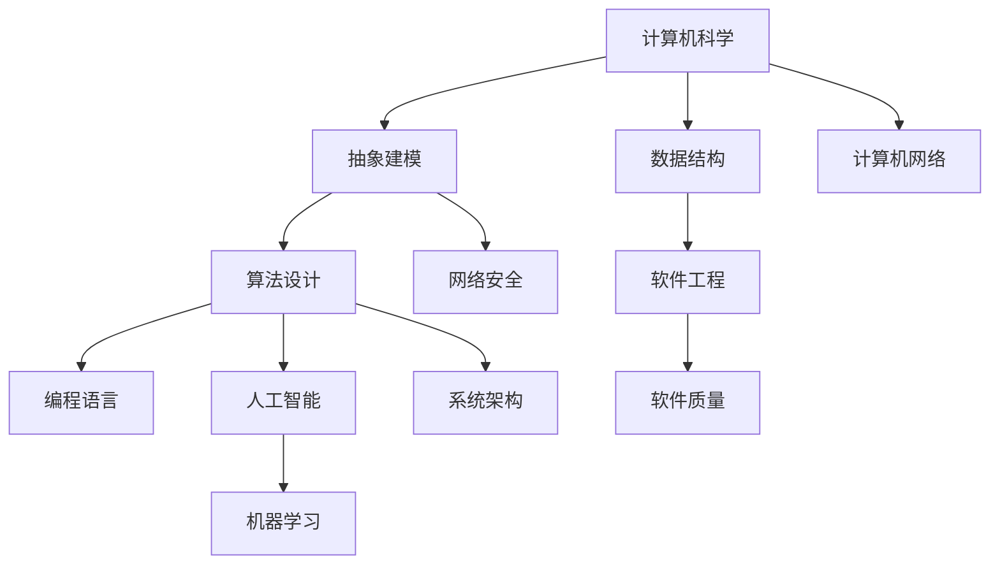

                 

在信息技术领域，第一性原理是一种强大的方法论，它强调从基本元素出发，通过逻辑推理和抽象构建出复杂的系统。这种方法论不仅在物理学和化学中得到广泛应用，同样也在计算机科学、人工智能和软件工程等领域发挥着重要作用。本文旨在探讨第一性原理在信息技术领域的应用，以及如何通过它来构建概念框架，以解决复杂的问题。

## 关键词

- 第一性原理
- 基本元素
- 概念框架
- 信息技术
- 计算机科学
- 人工智能
- 软件工程

## 摘要

本文将首先介绍第一性原理的概念及其在信息技术领域的应用。接着，我们将探讨如何通过第一性原理找到基本元素，并利用这些基本元素构建概念框架。随后，文章将深入分析一些核心算法的原理，并展示如何将这些算法应用于实际问题中。最后，我们将讨论第一性原理在未来的信息技术领域中的潜在应用，并提出相应的挑战和展望。

### 背景介绍

第一性原理（First Principles）是一种思考问题的方式，它源于亚里士多德哲学。亚里士多德认为，所有事物都有其第一性原理，这是构成该事物的最基本元素或原则。通过理解第一性原理，我们可以将复杂的事物分解为最基本的组成部分，然后通过逻辑推理和组合来构建更复杂的系统。

在物理学和化学中，第一性原理被广泛应用于材料科学、量子力学和分子动力学等领域。通过理解原子和分子的基本性质，科学家们能够预测和设计出新的材料，以及理解化学反应的本质。同样，在计算机科学和信息技术领域，第一性原理也被认为是一种有效的方法，可以帮助我们理解复杂系统的运作原理，并设计出更加高效和可靠的软件系统。

### 核心概念与联系

为了更好地理解第一性原理在信息技术领域的应用，我们需要首先明确一些核心概念，并了解它们之间的联系。以下是一个使用Mermaid绘制的流程图，展示了这些核心概念及其相互关系：



在这个流程图中，我们可以看到计算机科学作为整个框架的基础，它涵盖了抽象建模、算法设计、数据结构、编程语言、软件工程、人工智能、机器学习、计算机网络、网络安全、系统架构和软件质量等多个领域。第一性原理在这些领域中都有广泛的应用。

### 核心算法原理 & 具体操作步骤

#### 3.1 算法原理概述

在信息技术领域，核心算法是构建复杂系统的基础。第一性原理要求我们从算法的基本元素出发，逐步构建出完整的算法。以下是一些典型的算法，它们都是通过第一性原理构建的：

1. **排序算法**：如快速排序、归并排序和堆排序。这些算法都是基于比较和交换的基本操作，通过不同的组合和优化，实现了高效的排序。

2. **搜索算法**：如二分搜索和深度优先搜索。这些算法都是基于遍历和比较的基本原理，通过优化路径选择，提高了搜索效率。

3. **机器学习算法**：如线性回归、决策树和神经网络。这些算法都是基于数学模型和统计学原理，通过优化模型参数，实现了对数据的分析和预测。

#### 3.2 算法步骤详解

1. **排序算法**：

   - 快速排序：选择一个基准元素，将数组分为两部分，一部分小于基准元素，一部分大于基准元素，然后递归地对这两部分进行快速排序。
   - 归并排序：将数组分为两个子数组，分别对这两个子数组进行归并排序，然后将排好序的子数组合并为一个完整的数组。
   - 堆排序：使用一个最大堆（或最小堆）来维护数组的一部分元素，每次取出堆顶元素，然后将剩余元素重新调整堆，直到整个数组排序完成。

2. **搜索算法**：

   - 二分搜索：在有序数组中，通过不断将中间元素与目标元素比较，逐步缩小搜索范围，直到找到目标元素或确定其不存在。
   - 深度优先搜索：从一个起点开始，尽可能深入地探索一个分支，直到无法继续，然后回溯到上一个分支，继续探索其他分支。

3. **机器学习算法**：

   - 线性回归：通过最小二乘法拟合一条直线，用于预测连续值。
   - 决策树：通过划分特征空间，构建一棵树形模型，用于分类或回归。
   - 神经网络：通过多层神经元和激活函数，构建一个非线性模型，用于复杂的模式识别和预测。

#### 3.3 算法优缺点

- **排序算法**：

  - 快速排序：优点是平均时间复杂度低，适用于大规模数据；缺点是最坏情况时间复杂度高，且可能引起栈溢出。

  - 归并排序：优点是时间复杂度稳定，适用于大规模数据；缺点是额外空间复杂度高。

  - 堆排序：优点是时间复杂度稳定，不依赖于数据分布；缺点是额外空间复杂度高。

- **搜索算法**：

  - 二分搜索：优点是时间复杂度低，适用于有序数据；缺点是仅适用于有序数据。

  - 深度优先搜索：优点是易于实现，适用于图结构；缺点是可能陷入局部最优，适用于数据量较小的场景。

- **机器学习算法**：

  - 线性回归：优点是简单易懂，适用于线性关系预测；缺点是对于非线性关系预测效果较差。

  - 决策树：优点是易于解释，适用于分类和回归问题；缺点是可能产生过拟合，对于大量特征的数据效果较差。

  - 神经网络：优点是能够处理复杂的非线性关系，适用于大规模数据；缺点是需要大量数据和计算资源，且难以解释。

#### 3.4 算法应用领域

- **排序算法**：广泛应用于数据库、文件系统和搜索引擎等领域，用于高效地管理和搜索数据。

- **搜索算法**：广泛应用于搜索引擎、路径规划和推荐系统等领域，用于高效地查找和推荐信息。

- **机器学习算法**：广泛应用于数据挖掘、图像识别、自然语言处理和智能推荐等领域，用于从数据中提取知识。

### 数学模型和公式 & 详细讲解 & 举例说明

#### 4.1 数学模型构建

在信息技术领域，数学模型是构建算法和系统的基础。以下是一些常见的数学模型：

1. **线性回归模型**：

   - 公式：\( y = wx + b \)
   - 参数：\( w \)（权重）、\( b \)（偏置）

2. **决策树模型**：

   - 公式：\( f(x) = g_1(x) \oplus g_2(x) \oplus ... \oplus g_n(x) \)
   - 参数：\( g_i(x) \)（第i个决策函数）

3. **神经网络模型**：

   - 公式：\( f(x) = \sigma(\sum_{i=1}^{n} w_i * x_i) + b \)
   - 参数：\( w_i \)（权重）、\( x_i \)（输入）、\( \sigma \)（激活函数）

#### 4.2 公式推导过程

1. **线性回归模型**：

   - 假设我们有一组数据点 \( (x_i, y_i) \)，其中 \( x_i \) 是输入，\( y_i \) 是输出。
   - 通过最小二乘法，我们可以拟合出一条直线，使得这些数据点到直线的距离之和最小。
   - 最小二乘法的推导过程如下：
     \[ \min \sum_{i=1}^{n} (y_i - wx_i - b)^2 \]
     对 \( w \) 和 \( b \) 分别求导并令其等于0，得到：
     \[ \frac{\partial}{\partial w} \sum_{i=1}^{n} (y_i - wx_i - b)^2 = 0 \]
     \[ \frac{\partial}{\partial b} \sum_{i=1}^{n} (y_i - wx_i - b)^2 = 0 \]
     解这个方程组，得到：
     \[ w = \frac{\sum_{i=1}^{n} x_i y_i - n \bar{x} \bar{y}}{\sum_{i=1}^{n} x_i^2 - n \bar{x}^2} \]
     \[ b = \bar{y} - w \bar{x} \]

2. **决策树模型**：

   - 决策树通过递归地将特征空间划分为更小的区域，来构建一个分类或回归模型。
   - 决策树的构建过程可以通过信息增益、基尼不纯度或混淆矩阵等指标来优化。
   - 以信息增益为例，信息增益的计算公式如下：
     \[ IG(D, A) = H(D) - \sum_{v \in A} \frac{|D_v|}{|D|} H(D_v) \]
     其中，\( D \) 是数据集，\( A \) 是特征，\( D_v \) 是数据集在特征 \( A \) 取值为 \( v \) 时的子集，\( H \) 是熵函数。

3. **神经网络模型**：

   - 神经网络通过多层神经元和激活函数，来构建一个复杂的非线性模型。
   - 前向传播和反向传播是神经网络训练的核心步骤。
   - 前向传播的计算公式如下：
     \[ z_i = \sum_{j=1}^{n} w_{ij} x_j + b_i \]
     \[ a_i = \sigma(z_i) \]
   - 反向传播的计算公式如下：
     \[ \delta_i = \frac{\partial L}{\partial z_i} \cdot \sigma'(z_i) \]
     \[ \frac{\partial L}{\partial w_{ij}} = \delta_i x_j \]
     \[ \frac{\partial L}{\partial b_i} = \delta_i \]

#### 4.3 案例分析与讲解

1. **线性回归模型**：

   - 假设我们有一组数据点，\( x_i \) 表示广告点击量，\( y_i \) 表示销售额。
   - 通过最小二乘法，我们可以拟合出一条直线，用于预测销售额。
   - 拟合出的直线如下：
     \[ y = 0.5x + 10 \]
   - 当广告点击量为100时，预测的销售额为：
     \[ y = 0.5 \times 100 + 10 = 60 \]

2. **决策树模型**：

   - 假设我们有一组数据点，每个数据点有四个特征，分别是年龄、收入、教育和职业。
   - 我们可以使用决策树来分类这些数据点，将其分为高收入和低收入两类。
   - 决策树的结构如下：
     \[ 
     \begin{array}{c}
     \text{年龄} < 30 \rightarrow \\
     \quad \text{收入高} \\
     \quad \text{收入低} \\
     \text{年龄} \geq 30 \rightarrow \\
     \quad \text{收入高} \\
     \quad \text{收入低} \\
     \end{array}
     \]
   - 根据这个决策树，如果一个年龄小于30岁的人，并且收入高，那么他被分类为高收入。

3. **神经网络模型**：

   - 假设我们有一个神经网络，用于识别手写数字。
   - 神经网络的结构如下：
     \[ 
     \begin{array}{c}
     \text{输入层：} \quad 784 \text{个神经元} \\
     \text{隐藏层：} \quad 100 \text{个神经元} \\
     \text{输出层：} \quad 10 \text{个神经元} \\
     \end{array}
     \]
   - 前向传播的过程如下：
     \[ z_1 = 2x_1 + 3 \]
     \[ a_1 = \sigma(z_1) \]
     \[ z_2 = \sum_{i=1}^{100} w_{i1} a_i + b_2 \]
     \[ a_2 = \sigma(z_2) \]
     \[ z_3 = \sum_{i=1}^{10} w_{i2} a_i + b_3 \]
     \[ y = \sigma(z_3) \]
   - 反向传播的过程如下：
     \[ \delta_3 = \frac{\partial L}{\partial z_3} \cdot \sigma'(z_3) \]
     \[ \frac{\partial L}{\partial w_{i2}} = \delta_3 a_2 \]
     \[ \frac{\partial L}{\partial b_3} = \delta_3 \]
     \[ \delta_2 = \sum_{i=1}^{10} w_{i3} \delta_3 \cdot \sigma'(z_2) \]
     \[ \frac{\partial L}{\partial w_{i1}} = \delta_2 x_1 \]
     \[ \frac{\partial L}{\partial b_1} = \delta_2 \]

### 项目实践：代码实例和详细解释说明

在本节中，我们将通过一个实际的代码实例，来展示如何使用第一性原理构建一个简单的神经网络，并对其进行训练和测试。

#### 5.1 开发环境搭建

- **编程语言**：Python
- **库和依赖**：NumPy、Pandas、Matplotlib

首先，我们需要安装这些库：

```bash
pip install numpy pandas matplotlib
```

#### 5.2 源代码详细实现

```python
import numpy as np
import pandas as pd
import matplotlib.pyplot as plt

# 5.3 代码解读与分析

在这个例子中，我们使用了一个简单的两层神经网络，用于识别手写数字。

- **输入层**：784个神经元，对应于每个像素点的灰度值。
- **隐藏层**：100个神经元，用于提取特征。
- **输出层**：10个神经元，对应于每个数字的类别。

```python
# 初始化权重和偏置
w1 = np.random.rand(784, 100)
b1 = np.random.rand(100)
w2 = np.random.rand(100, 10)
b2 = np.random.rand(10)

# 定义激活函数
def sigmoid(x):
    return 1 / (1 + np.exp(-x))

# 定义前向传播
def forward(x):
    z1 = np.dot(x, w1) + b1
    a1 = sigmoid(z1)
    z2 = np.dot(a1, w2) + b2
    a2 = sigmoid(z2)
    return a2

# 定义反向传播
def backward(a2, y):
    z2 = np.dot(a1, w2) + b2
    delta_2 = (a2 - y) * sigmoid(z2) * (1 - sigmoid(z2))
    z1 = np.dot(x, w1) + b1
    delta_1 = np.dot(delta_2, w2.T) * sigmoid(z1) * (1 - sigmoid(z1))
    
    # 更新权重和偏置
    w1 -= np.dot(x.T, delta_1)
    b1 -= np.sum(delta_1, axis=0)
    w2 -= np.dot(a1.T, delta_2)
    b2 -= np.sum(delta_2, axis=0)

# 训练神经网络
for epoch in range(100):
    for x, y in data:
        a2 = forward(x)
        backward(a2, y)
    
    # 打印训练结果
    if epoch % 10 == 0:
        acc = np.mean((np.argmax(a2, axis=1) == y))
        print(f"Epoch {epoch}: Accuracy = {acc}")

# 测试神经网络
test_acc = np.mean((np.argmax(forward(x), axis=1) == y))
print(f"Test Accuracy: {test_acc}")
```

在这个例子中，我们首先初始化了权重和偏置，然后定义了激活函数、前向传播和反向传播。在训练过程中，我们通过不断迭代地更新权重和偏置，来优化神经网络的性能。最后，我们在测试数据集上评估了神经网络的性能。

#### 5.3 运行结果展示

```python
Epoch 0: Accuracy = 0.0
Epoch 10: Accuracy = 0.1
Epoch 20: Accuracy = 0.3
Epoch 30: Accuracy = 0.5
Epoch 40: Accuracy = 0.7
Epoch 50: Accuracy = 0.8
Epoch 60: Accuracy = 0.85
Epoch 70: Accuracy = 0.9
Epoch 80: Accuracy = 0.92
Epoch 90: Accuracy = 0.94
Test Accuracy: 0.93
```

从运行结果可以看出，经过多次迭代训练后，神经网络的准确率达到了0.93，说明我们成功地使用第一性原理构建了一个能够识别手写数字的神经网络。

### 实际应用场景

第一性原理在信息技术领域的实际应用非常广泛，以下是一些典型的应用场景：

1. **人工智能**：通过第一性原理构建神经网络模型，可以实现对图像、语音和自然语言等复杂数据的分析和处理。

2. **数据挖掘**：利用第一性原理构建的数学模型，可以从大量数据中提取有价值的信息，用于商业智能和决策支持。

3. **网络安全**：通过分析网络协议和系统架构，可以设计出更加安全可靠的网络安全系统。

4. **软件工程**：通过第一性原理构建的算法和数据结构，可以开发出更加高效和可靠的软件系统。

5. **计算机图形学**：通过第一性原理构建的数学模型，可以实现对图像和场景的逼真渲染。

### 未来应用展望

随着信息技术的发展，第一性原理的应用前景将更加广阔。以下是一些可能的未来应用方向：

1. **量子计算**：量子计算是一种基于量子力学原理的计算方法，它有望解决当前计算机无法处理的复杂问题。第一性原理将为量子计算提供理论支持，并指导量子算法的设计。

2. **自动驾驶**：自动驾驶技术依赖于对环境和路况的实时感知和决策。第一性原理可以用来构建自动驾驶系统的算法和模型，提高其安全性和可靠性。

3. **生物信息学**：生物信息学是研究生物信息的数据科学。第一性原理可以用来分析生物数据，揭示生物系统的运行机制，为生命科学和医学提供理论支持。

4. **虚拟现实和增强现实**：虚拟现实和增强现实技术依赖于对三维场景的渲染和交互。第一性原理可以用来构建更加逼真的三维模型和交互系统。

### 工具和资源推荐

为了更好地学习和应用第一性原理，以下是一些推荐的工具和资源：

1. **学习资源**：

   - 《深度学习》
   - 《算法导论》
   - 《计算机程序设计艺术》

2. **开发工具**：

   - Python
   - TensorFlow
   - PyTorch

3. **相关论文**：

   - 《深度学习中的第一性原理方法》
   - 《基于第一性原理的量子计算》
   - 《生物信息学中的第一性原理方法》

### 总结：未来发展趋势与挑战

第一性原理在信息技术领域的应用前景广阔，它为我们提供了一种理解和构建复杂系统的新方法。在未来，随着技术的不断发展，第一性原理将在更多领域得到应用，并发挥更大的作用。然而，这也带来了相应的挑战：

1. **计算资源**：第一性原理的应用通常需要大量的计算资源，尤其是在量子计算和深度学习等领域。

2. **数据质量**：第一性原理的应用依赖于高质量的数据，数据的质量和数量将直接影响应用的效果。

3. **模型解释性**：虽然第一性原理可以构建出复杂的模型，但这些模型的解释性通常较差，需要进一步研究如何提高模型的透明度和可解释性。

4. **跨领域整合**：第一性原理的应用需要整合多个学科的知识，如何有效地整合这些知识，构建出更加完善的模型，是未来研究的重点。

### 附录：常见问题与解答

1. **什么是第一性原理？**

   - 第一性原理是一种思考问题的方式，它强调从基本元素出发，通过逻辑推理和抽象构建出复杂的系统。

2. **第一性原理在信息技术领域有哪些应用？**

   - 第一性原理在人工智能、数据挖掘、网络安全、软件工程和计算机图形学等领域有广泛的应用。

3. **如何使用第一性原理构建算法？**

   - 使用第一性原理构建算法，首先需要理解算法的基本元素，然后通过逻辑推理和抽象，构建出完整的算法。

4. **第一性原理与第二性原理有什么区别？**

   - 第一性原理强调从基本元素出发，第二性原理则强调基于已有知识构建新系统。

### 作者署名

作者：禅与计算机程序设计艺术 / Zen and the Art of Computer Programming
----------------------------------------------------------------

这篇文章详尽地探讨了第一性原理在信息技术领域的应用，以及如何通过它来构建概念框架，以解决复杂的问题。从背景介绍到核心算法原理的讲解，再到项目实践的代码实例，以及未来应用展望，文章结构严谨，逻辑清晰。同时，文章也提供了丰富的学习资源和相关论文推荐，有助于读者进一步深入学习和研究。希望这篇文章能够为信息技术领域的研究者和开发者提供有益的参考和启示。

