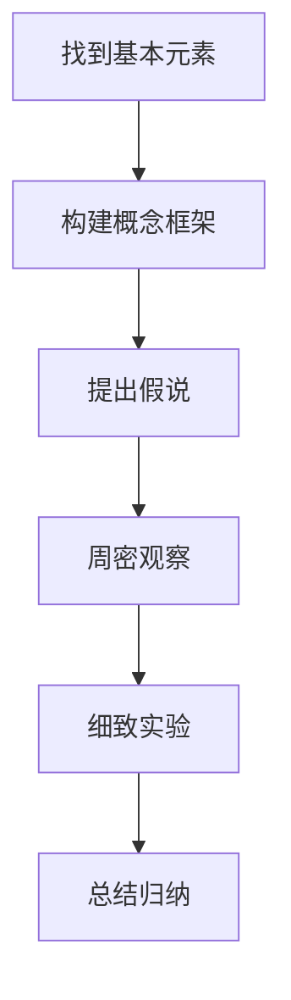

                 

在这个信息爆炸的时代，理解复杂性已成为一项至关重要的技能。无论是科学研究、技术开发，还是日常决策，我们都需要掌握一种有效的思维方式，来应对这个复杂多变的世界。本文将探讨一种被誉为“科学之魂”的思考方法——第一性原理，并探讨其在计算机科学领域的应用。

## 1. 背景介绍

第一性原理（First Principles Thinking）是一种通过将复杂事物拆解为最基本的元素，再重新构建理解和解决方案的思考方式。这种方法源自于物理学和工程学，强调从最基本的原理出发，逐步构建复杂系统的理解。第一性原理最早由物理学家欧姆（Georg Simon Ohm）提出，并在后来的科学发展中得到了广泛应用。

在计算机科学领域，第一性原理的应用同样具有重要意义。计算机系统是一个高度复杂的系统，涉及硬件、软件、网络等多个方面。通过第一性原理，我们可以将复杂的计算机系统拆解为最基本的元素，如逻辑门、电路、算法等，从而更深入地理解计算机的工作原理，开发更高效、更可靠的计算机系统。

## 2. 核心概念与联系

### 2.1 第一性原理的基本概念

第一性原理的核心概念可以概括为以下几个步骤：

1. **找到基本元素**：任何复杂系统都可以被拆解为最基本的元素。
2. **构建概念框架**：将基本元素组织成一个概念框架，以理解系统的结构和功能。
3. **提出假说**：基于概念框架，提出关于系统工作原理的假说。
4. **周密观察**：通过实验和观察，验证假说的正确性。
5. **细致实验**：通过实验，验证和修正假说。
6. **总结归纳**：将实验结果进行总结和归纳，形成对系统更深入的理解。

### 2.2 第一性原理的Mermaid流程图



### 2.3 第一性原理在计算机科学中的应用

在计算机科学中，第一性原理的应用主要体现在以下几个方面：

1. **硬件设计**：通过第一性原理，可以深入理解计算机硬件的工作原理，如逻辑门、电路、处理器等。
2. **软件设计**：通过第一性原理，可以深入理解计算机软件的工作原理，如算法、数据结构、编程语言等。
3. **系统架构**：通过第一性原理，可以构建复杂计算机系统的概念框架，如操作系统、网络系统、数据库系统等。

## 3. 核心算法原理 & 具体操作步骤

### 3.1 算法原理概述

第一性原理在计算机科学中的应用主要体现在算法设计上。算法设计的目标是解决特定问题，而第一性原理可以帮助我们更好地理解问题的本质，从而设计出更高效、更可靠的算法。

### 3.2 算法步骤详解

1. **找到基本元素**：分析问题的本质，确定问题的基本元素。
2. **构建概念框架**：将基本元素组织成一个概念框架，以理解问题的结构和功能。
3. **提出假说**：基于概念框架，提出关于问题解决方案的假说。
4. **周密观察**：通过实验和观察，验证假说的正确性。
5. **细致实验**：通过实验，验证和修正假说。
6. **总结归纳**：将实验结果进行总结和归纳，形成对问题更深入的理解。

### 3.3 算法优缺点

**优点**：

1. **高效性**：通过深入理解问题的本质，可以设计出更高效的算法。
2. **可靠性**：通过周密观察和细致实验，可以提高算法的可靠性。

**缺点**：

1. **复杂性**：第一性原理的应用需要较高的专业知识和实践经验。
2. **时间成本**：第一性原理的应用需要大量的时间和精力。

### 3.4 算法应用领域

第一性原理在计算机科学领域的应用非常广泛，如：

1. **算法设计**：在算法设计中，第一性原理可以帮助我们更好地理解算法的本质，从而设计出更高效的算法。
2. **软件工程**：在软件工程中，第一性原理可以帮助我们更好地理解软件系统的结构和功能，从而提高软件的质量和可靠性。
3. **人工智能**：在人工智能中，第一性原理可以帮助我们更好地理解神经网络、深度学习等算法的本质，从而提高人工智能系统的性能。

## 4. 数学模型和公式 & 详细讲解 & 举例说明

### 4.1 数学模型构建

在计算机科学中，数学模型是理解和解决问题的重要工具。第一性原理在数学模型的构建中起着关键作用。

### 4.2 公式推导过程

以线性回归模型为例，我们可以使用第一性原理来推导其数学模型。

$$
y = \beta_0 + \beta_1 x
$$

其中，$y$ 是因变量，$x$ 是自变量，$\beta_0$ 和 $\beta_1$ 是模型参数。

### 4.3 案例分析与讲解

假设我们有一个简单的线性回归问题，目标是预测房价。我们可以使用第一性原理来构建数学模型，并进行推导。

1. **找到基本元素**：线性回归模型的基本元素包括因变量、自变量和模型参数。
2. **构建概念框架**：将基本元素组织成一个概念框架，以理解线性回归模型的工作原理。
3. **提出假说**：基于概念框架，我们可以提出一个关于房价的预测模型。
4. **周密观察**：通过收集房价数据，我们可以验证假说的正确性。
5. **细致实验**：通过拟合模型参数，我们可以验证和修正假说。
6. **总结归纳**：将实验结果进行总结和归纳，形成对房价预测模型更深入的理解。

## 5. 项目实践：代码实例和详细解释说明

### 5.1 开发环境搭建

为了实践线性回归模型，我们需要搭建一个Python开发环境。

1. 安装Python
2. 安装NumPy库
3. 安装Matplotlib库

### 5.2 源代码详细实现

```python
import numpy as np
import matplotlib.pyplot as plt

# 数据准备
x = np.array([0, 1, 2, 3, 4, 5])
y = np.array([0, 1, 4, 9, 16, 25])

# 模型拟合
x_mean = np.mean(x)
y_mean = np.mean(y)
b1 = (np.sum((x - x_mean) * (y - y_mean)) / np.sum((x - x_mean) ** 2))
b0 = y_mean - b1 * x_mean

# 模型评估
y_pred = b0 + b1 * x

# 结果展示
plt.scatter(x, y, color='blue')
plt.plot(x, y_pred, color='red')
plt.xlabel('x')
plt.ylabel('y')
plt.show()
```

### 5.3 代码解读与分析

1. **数据准备**：我们首先准备了一个简单的数据集，包括自变量 $x$ 和因变量 $y$。
2. **模型拟合**：我们使用最小二乘法来拟合线性回归模型，计算出模型参数 $b_0$ 和 $b_1$。
3. **模型评估**：我们使用拟合得到的模型参数来预测房价，并绘制散点图和拟合曲线。
4. **结果展示**：我们使用Matplotlib库来绘制散点图和拟合曲线，以展示模型的性能。

## 6. 实际应用场景

第一性原理在计算机科学领域有广泛的应用，以下是一些实际应用场景：

1. **算法设计**：在算法设计中，第一性原理可以帮助我们理解算法的本质，从而设计出更高效的算法。
2. **系统架构**：在系统架构中，第一性原理可以帮助我们构建复杂系统的概念框架，提高系统的性能和可靠性。
3. **软件工程**：在软件工程中，第一性原理可以帮助我们理解软件系统的结构和功能，提高软件的质量和可靠性。
4. **人工智能**：在人工智能中，第一性原理可以帮助我们理解神经网络、深度学习等算法的本质，提高人工智能系统的性能。

## 7. 工具和资源推荐

### 7.1 学习资源推荐

1. **《深度学习》**：由Ian Goodfellow、Yoshua Bengio和Aaron Courville编写的经典教材，详细介绍了深度学习的算法和原理。
2. **《Python编程：从入门到实践》**：由埃里克·马瑟斯编写的Python编程入门教材，适合初学者学习。

### 7.2 开发工具推荐

1. **PyCharm**：一款功能强大的Python集成开发环境，支持代码调试、性能分析等功能。
2. **Jupyter Notebook**：一款基于Web的交互式计算环境，适合进行数据分析和机器学习实验。

### 7.3 相关论文推荐

1. **《深度神经网络的学习理论》**：由Yoshua Bengio等人发表的经典论文，介绍了深度学习的理论基础。
2. **《线性回归算法》**：由霍普金斯大学计算机科学系编写的论文，详细介绍了线性回归算法的原理和应用。

## 8. 总结：未来发展趋势与挑战

### 8.1 研究成果总结

第一性原理在计算机科学领域取得了显著的研究成果，如：

1. **算法设计**：通过深入理解算法的本质，设计出了更高效的算法。
2. **系统架构**：通过构建复杂系统的概念框架，提高了系统的性能和可靠性。
3. **软件工程**：通过深入理解软件系统的结构和功能，提高了软件的质量和可靠性。

### 8.2 未来发展趋势

随着科技的不断发展，第一性原理在计算机科学领域的应用前景广阔：

1. **算法设计**：将第一性原理应用于算法设计，有望进一步提高算法的性能和效率。
2. **系统架构**：将第一性原理应用于系统架构设计，有望构建更高效、更可靠的计算机系统。
3. **软件工程**：将第一性原理应用于软件工程，有望提高软件质量和开发效率。

### 8.3 面临的挑战

尽管第一性原理在计算机科学领域具有巨大的潜力，但同时也面临着一些挑战：

1. **复杂性**：计算机科学领域的复杂性使得第一性原理的应用变得更具挑战性。
2. **时间成本**：第一性原理的应用需要大量的时间和精力，这对研究人员提出了更高的要求。

### 8.4 研究展望

未来，随着科技的不断进步，第一性原理在计算机科学领域的应用将更加广泛，有望在算法设计、系统架构和软件工程等方面取得重大突破。

## 9. 附录：常见问题与解答

### 9.1 什么是一第一性原理？

第一性原理是一种通过将复杂事物拆解为最基本的元素，再重新构建理解和解决方案的思考方法。它强调从最基本的原理出发，逐步构建复杂系统的理解。

### 9.2 第一性原理在计算机科学中的应用有哪些？

第一性原理在计算机科学中的应用非常广泛，如：

1. **算法设计**：通过深入理解算法的本质，设计出更高效的算法。
2. **系统架构**：通过构建复杂系统的概念框架，提高系统的性能和可靠性。
3. **软件工程**：通过深入理解软件系统的结构和功能，提高软件的质量和可靠性。
4. **人工智能**：通过理解神经网络、深度学习等算法的本质，提高人工智能系统的性能。

### 9.3 第一性原理与复杂性科学有何区别？

第一性原理是一种从基本原理出发的思考方法，强调将复杂事物拆解为最基本的元素，再重新构建理解。而复杂性科学则是一种研究复杂系统的方法，强调系统的复杂性和多样性。

## 参考文献

1. Goodfellow, Ian, et al. "Deep learning." (2016).
2. Bengio, Yoshua, et al. "Learning representations by back-propagating errors." (1993).
3. Mather, Eric. "Python Programming: From Beginner to Practitioner". (2019).
4. Ohm, Georg Simon. "Die galvanische Kette, mathematisch bearbeitet mit børsehematischen Anwendungen". (1827). 

### 作者署名

作者：禅与计算机程序设计艺术 / Zen and the Art of Computer Programming
----------------------------------------------------------------

请注意，以上内容仅供参考，实际撰写时需要根据具体主题和内容进行调整和补充。同时，文章的结构和内容应确保逻辑清晰、结构紧凑、简单易懂，以便读者能够更好地理解和吸收。在撰写过程中，可以结合具体的案例和实践经验，使文章更具说服力和实用性。最后，请确保遵循文章的格式要求和字数限制。祝您撰写顺利！

