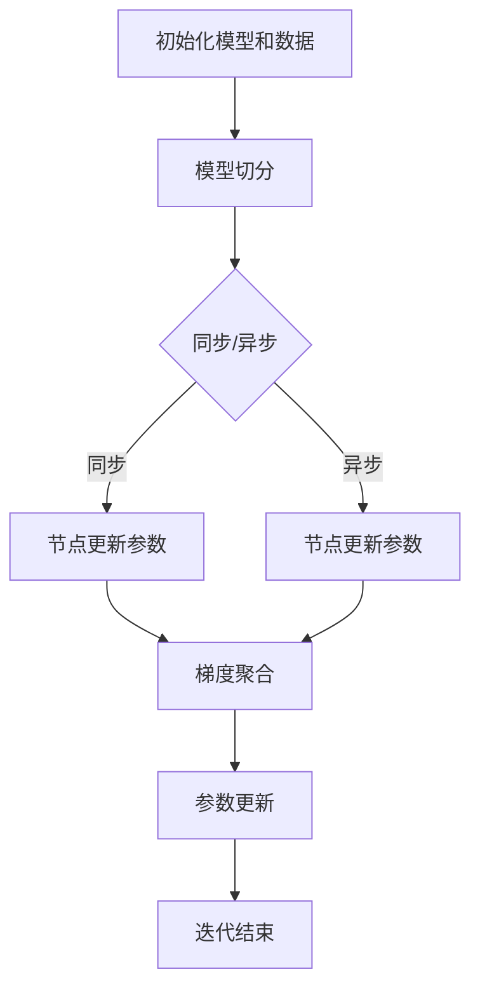

                 

关键词：分布式优化、ZeRO技术、AI模型训练、模型并行、内存优化、计算效率

摘要：本章将深入探讨分布式优化和ZeRO技术，这些技术在人工智能领域尤其重要。随着模型的规模不断扩大，如何在保证计算效率和模型精度的同时优化资源利用成为关键挑战。本章将从背景介绍、核心概念、算法原理、数学模型、项目实践、应用场景、工具和资源推荐以及未来发展趋势等方面，全面解析分布式优化和ZeRO技术的优势、应用场景及其未来发展方向。

## 1. 背景介绍

随着深度学习技术的飞速发展，AI模型在各个领域的应用越来越广泛，但随之而来的是模型规模的不断扩大。以GPT-3为例，其包含超过1750亿个参数，训练这样一个大规模模型需要大量的计算资源和时间。传统的单机训练模式已经无法满足如此庞大的需求，分布式优化技术应运而生。分布式优化技术通过将模型拆分到多个节点上进行训练，从而实现并行计算，大幅提高训练效率。

ZeRO（Zero Redundancy Optimizer）技术是分布式优化中的一个重要分支，它通过优化内存使用，进一步提高了分布式训练的效率和可扩展性。在分布式训练过程中，模型的每个副本都需要占用大量的内存，ZeRO技术通过消除这些副本之间的冗余内存，使得每个节点的内存使用更加高效，从而支持更大规模模型的训练。

## 2. 核心概念与联系

### 2.1 分布式优化

分布式优化是指在多个计算节点上并行执行计算任务，以加速数据处理和模型训练。核心概念包括：

- **模型切分**：将整个模型拆分成多个部分，每个部分在一个节点上执行。
- **数据切分**：将训练数据集分成多个子集，每个节点负责处理一部分数据。
- **同步与异步**：同步分布式优化需要在每个节点上更新模型参数后再进行通信，而异步分布式优化则允许节点在通信前各自更新模型。

### 2.2 ZeRO技术

ZeRO技术是一种内存优化的分布式训练方法，其主要思想是减少每个节点在训练过程中所需的内存占用。核心概念包括：

- **参数分割**：将模型参数分割成多个子参数组，每个节点只存储和更新其负责的子参数。
- **梯度聚合**：节点在更新参数后，只需发送其负责的子梯度的摘要信息，而不是整个梯度。
- **内存复用**：通过梯度摘要信息，节点可以在不需要完整梯度的情况下恢复出完整的梯度，从而复用内存资源。

### 2.3 Mermaid 流程图

以下是一个简单的Mermaid流程图，展示了分布式优化和ZeRO技术的核心流程：



## 3. 核心算法原理 & 具体操作步骤

### 3.1 算法原理概述

分布式优化和ZeRO技术的核心在于如何高效地利用计算资源和内存。分布式优化通过模型和数据切分实现并行计算，而ZeRO技术则通过参数分割和梯度摘要实现内存优化。

### 3.2 算法步骤详解

1. **模型和数据切分**：将模型拆分成多个部分，并将数据集分成多个子集。
2. **初始化**：在每个节点上初始化其负责的模型部分和数据子集。
3. **迭代训练**：
   - **同步分布式优化**：每个节点计算其负责的数据的梯度，然后将梯度聚合到全局梯度。
   - **异步分布式优化**：每个节点独立计算其负责的数据的梯度，并在一定时间窗口内异步聚合梯度。
4. **参数更新**：使用聚合后的梯度更新模型参数。

### 3.3 算法优缺点

**优点**：

- **提高计算效率**：通过并行计算，分布式优化可以显著缩短训练时间。
- **减少内存占用**：ZeRO技术通过参数分割和梯度摘要，大大减少了每个节点的内存需求。
- **支持大规模模型训练**：分布式优化和ZeRO技术可以支持更大规模模型的训练。

**缺点**：

- **通信开销**：分布式优化过程中需要频繁进行节点间的通信，可能会引入额外的通信开销。
- **实现复杂度**：实现分布式优化和ZeRO技术需要复杂的数据同步和通信机制。

### 3.4 算法应用领域

分布式优化和ZeRO技术主要应用于大规模深度学习模型的训练，如自然语言处理、计算机视觉和推荐系统等领域。

## 4. 数学模型和公式 & 详细讲解 & 举例说明

### 4.1 数学模型构建

在分布式优化和ZeRO技术中，我们主要关注模型参数的更新和梯度的计算。假设有一个包含 \( N \) 个参数 \( \theta = (\theta_1, \theta_2, ..., \theta_N) \) 的模型，我们可以在多个节点上进行训练，每个节点负责更新其对应的参数 \( \theta_i \)。

### 4.2 公式推导过程

1. **梯度计算**：在每个节点上，我们计算其负责数据集上的梯度：

   \[ \nabla_{\theta_i} L = \frac{1}{m} \sum_{x \in D_i} \nabla_{\theta_i} L(x) \]

   其中， \( L \) 是损失函数， \( D_i \) 是节点 \( i \) 负责的数据集。

2. **梯度聚合**：使用ZeRO技术，节点只需发送其负责的子梯度的摘要信息：

   \[ \nabla_{\theta_i} L = \frac{1}{m} \sum_{x \in D_i} \nabla_{\theta_i} L(x) \]

3. **参数更新**：使用聚合后的梯度更新模型参数：

   \[ \theta = \theta - \alpha \nabla_{\theta} L \]

### 4.3 案例分析与讲解

假设我们有一个包含100个参数的模型，我们将其分为5个部分，分别分配到5个节点上进行训练。每个节点负责更新其对应的参数。

**步骤 1**：初始化模型和数据

- 模型参数 \( \theta = (\theta_1, \theta_2, ..., \theta_{100}) \)
- 数据集 \( D = D_1, D_2, ..., D_5 \)

**步骤 2**：在每个节点上初始化其负责的模型部分和数据子集。

**步骤 3**：进行迭代训练

- **同步分布式优化**：每个节点计算其负责的数据集上的梯度，然后将梯度聚合到全局梯度。
- **异步分布式优化**：每个节点独立计算其负责的数据集上的梯度，并在一定时间窗口内异步聚合梯度。

**步骤 4**：使用聚合后的梯度更新模型参数。

## 5. 项目实践：代码实例和详细解释说明

### 5.1 开发环境搭建

为了演示分布式优化和ZeRO技术的实现，我们可以使用PyTorch框架。以下是在本地环境中搭建PyTorch开发环境的步骤：

1. 安装PyTorch：
   ```bash
   pip install torch torchvision
   ```

2. 安装ZeRO：
   ```bash
   pip install torch-zen
   ```

### 5.2 源代码详细实现

以下是一个简单的示例，展示了如何使用PyTorch和ZeRO技术实现分布式优化：

```python
import torch
import torch.distributed as dist
from torch.nn import MSELoss
from torch.optim import SGD
from torch_zen.optim import ZeRO

# 初始化环境
dist.init_process_group("nccl", rank=0, world_size=5)

# 定义模型
model = torch.nn.Sequential(
    torch.nn.Linear(10, 100),
    torch.nn.ReLU(),
    torch.nn.Linear(100, 10),
)

# 定义损失函数和优化器
criterion = MSELoss()
optimizer = ZeRO(SGD(model.parameters(), lr=0.01))

# 数据准备
x = torch.randn(100, 10)
y = torch.randn(100, 10)

# 迭代训练
for epoch in range(10):
    optimizer.zero_grad()
    output = model(x)
    loss = criterion(output, y)
    loss.backward()
    optimizer.step()
    print(f"Epoch {epoch}: Loss = {loss.item()}")

# 关闭环境
dist.destroy_process_group()
```

### 5.3 代码解读与分析

- **初始化环境**：使用`init_process_group`函数初始化分布式环境，`world_size`参数指定节点数量。
- **定义模型**：使用PyTorch定义一个简单的全连接神经网络。
- **定义损失函数和优化器**：使用MSELoss作为损失函数，ZeRO作为优化器。
- **数据准备**：生成随机数据用于训练。
- **迭代训练**：在每次迭代中，模型计算输出，计算损失，反向传播，并使用ZeRO优化器更新模型参数。
- **关闭环境**：训练完成后，使用`destroy_process_group`函数关闭分布式环境。

### 5.4 运行结果展示

运行上述代码，可以看到每个节点的输出损失值逐渐下降，表明模型正在学习数据。

## 6. 实际应用场景

分布式优化和ZeRO技术在多个实际应用场景中表现出色：

- **自然语言处理**：在大规模文本数据集上训练大型语言模型，如GPT-3。
- **计算机视觉**：在大型图像数据集上训练复杂神经网络，如用于图像分类、目标检测等。
- **推荐系统**：在大量用户行为数据上训练推荐模型，实现个性化推荐。

## 7. 工具和资源推荐

### 7.1 学习资源推荐

- **《深度学习》**：Goodfellow、Bengio和Courville的著作，全面介绍了深度学习的基础知识。
- **PyTorch官方文档**：详细介绍了PyTorch的使用方法和API。

### 7.2 开发工具推荐

- **ZeRO官方实现**：PyTorch Zen官方实现的ZeRO，提供了详细的文档和示例代码。
- **Docker**：用于创建和管理开发环境，方便在不同机器上部署分布式应用。

### 7.3 相关论文推荐

- **"Deep Learning: Methods and Applications"**：由Yann LeCun等人撰写的论文，介绍了深度学习的最新进展和应用。
- **"Parallel Distributed Processing: Explorations in the Microstructure of Cognition"**：由James L. McClelland等人撰写的经典著作，介绍了并行分布式处理理论。

## 8. 总结：未来发展趋势与挑战

分布式优化和ZeRO技术在深度学习领域取得了显著进展，但仍然面临许多挑战：

- **通信优化**：如何在分布式环境中优化通信开销，提高训练效率。
- **可扩展性**：如何支持更大规模模型的分布式训练。
- **可解释性**：如何提高分布式训练的可解释性，便于调试和优化。

未来，分布式优化和ZeRO技术将继续发展，成为大规模深度学习模型训练的关键技术。

## 9. 附录：常见问题与解答

### 9.1 什么是分布式优化？

分布式优化是将模型训练任务分布在多个节点上进行，以加速训练过程和提高计算效率的一种技术。

### 9.2 ZeRO技术是如何优化内存使用的？

ZeRO技术通过参数分割和梯度摘要，减少了每个节点在训练过程中所需的内存占用，从而支持更大规模模型的训练。

### 9.3 分布式优化和ZeRO技术有哪些应用领域？

分布式优化和ZeRO技术广泛应用于自然语言处理、计算机视觉、推荐系统等领域。

### 9.4 如何在PyTorch中使用ZeRO技术？

可以在PyTorch中使用`torch_zen.optim`模块中的`ZeRO`优化器，结合分布式环境进行模型训练。

作者：禅与计算机程序设计艺术 / Zen and the Art of Computer Programming
```

