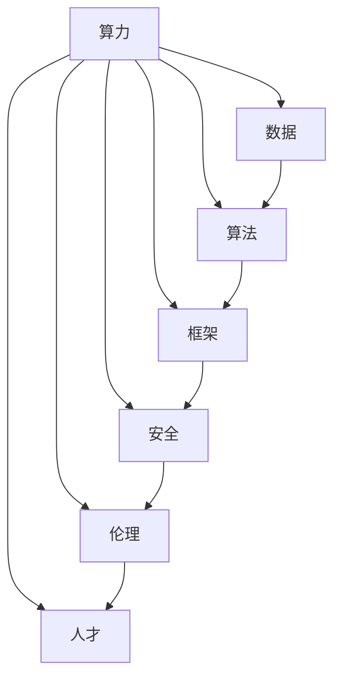

                 

关键词：AI 2.0、基础设施、算力、数据、算法、框架、安全、伦理、人才

摘要：随着人工智能（AI）技术的飞速发展，AI 2.0 基础设施的构建成为了行业热点。本文从算力、数据、算法、框架、安全、伦理和人才七个方面，探讨了 AI 2.0 基础设施的构建与未来发展，为 AI 技术的应用和创新提供了有益的参考。

## 1. 背景介绍

人工智能（AI）作为当今世界最具颠覆性的技术之一，已经深刻地改变了我们的生活方式和工作模式。从早期的规则驱动到现代的数据驱动，AI 技术的演进历程充满了创新和突破。然而，随着 AI 技术的不断发展，一个全新的 AI 2.0 时代已经到来。

AI 2.0 是指基于深度学习、强化学习、生成对抗网络等先进算法的人工智能技术，它具有更强的自主学习能力、更加智能的决策能力以及更高的应用价值。在 AI 2.0 时代，算力、数据、算法、框架、安全、伦理和人才等基础设施的建设显得尤为重要。

### 1.1 算力的重要性

算力是 AI 2.0 技术发展的重要支撑。随着 AI 模型的复杂度和规模不断增加，对计算资源的需求也在日益增长。GPU、TPU 等高性能计算设备的发展，为 AI 2.0 技术提供了强大的算力保障。同时，云计算、边缘计算等新兴计算模式的兴起，也为 AI 2.0 技术的应用提供了更加灵活和高效的计算环境。

### 1.2 数据的价值

数据是 AI 2.0 技术的基石。高质量的数据集可以为 AI 模型提供丰富的训练资源，有助于提升模型的性能和泛化能力。在 AI 2.0 时代，数据的收集、存储、处理和分析能力将成为衡量一个国家或地区 AI 技术发展水平的重要指标。

### 1.3 算法的创新

算法是 AI 2.0 技术的灵魂。随着 AI 技术的不断发展，新的算法不断涌现，如深度强化学习、迁移学习、联邦学习等。这些算法的创新，为 AI 2.0 技术的应用带来了更多的可能性和机会。

### 1.4 框架的重要性

框架是 AI 2.0 技术的载体。一个优秀的框架可以降低 AI 技术的研发门槛，提高开发效率，促进 AI 技术的普及和应用。在 AI 2.0 时代，框架的建设将变得更加重要，它需要兼顾性能、可扩展性、易用性等多个方面。

### 1.5 安全的保障

安全是 AI 2.0 技术的基石。随着 AI 技术的应用越来越广泛，安全问题也愈发突出。保护用户隐私、防止恶意攻击、确保数据安全等，都是 AI 2.0 技术发展过程中需要关注的重要问题。

### 1.6 伦理的约束

伦理是 AI 2.0 技术的灵魂。在 AI 2.0 时代，伦理问题将成为影响 AI 技术发展的重要因素。如何确保 AI 技术的发展符合人类伦理道德标准，如何平衡技术进步与社会责任，都是需要深入思考和探讨的问题。

### 1.7 人才的关键

人才是 AI 2.0 技术发展的关键。在 AI 2.0 时代，对 AI 专业人才的需求日益增长。培养和引进高素质的 AI 人才，是推动 AI 技术发展的关键所在。

## 2. 核心概念与联系

为了更好地理解 AI 2.0 基础设施的构建，我们需要明确以下几个核心概念：

### 2.1 算力

算力是指计算机处理信息的能力。在 AI 2.0 时代，算力主要包括 CPU、GPU、TPU 等计算设备，以及云计算、边缘计算等计算模式。

### 2.2 数据

数据是指用于训练 AI 模型的原始信息。在 AI 2.0 时代，数据主要包括结构化数据、半结构化数据和非结构化数据等。

### 2.3 算法

算法是指解决特定问题的步骤和方法。在 AI 2.0 时代，算法主要包括深度学习、强化学习、生成对抗网络等。

### 2.4 框架

框架是指为了实现特定功能而构建的软件架构。在 AI 2.0 时代，框架主要包括 TensorFlow、PyTorch、Keras 等。

### 2.5 安全

安全是指保护系统、数据、网络等不受恶意攻击和破坏的能力。在 AI 2.0 时代，安全主要包括用户隐私保护、数据安全、网络安全等。

### 2.6 伦理

伦理是指人们在道德、伦理等方面应遵循的行为规范。在 AI 2.0 时代，伦理主要包括 AI 技术的应用伦理、数据伦理、人工智能伦理等。

### 2.7 人才

人才是指具备特定技能和知识的专业人员。在 AI 2.0 时代，人才主要包括 AI 算法工程师、数据科学家、AI 产品经理等。

下面是一个简单的 Mermaid 流程图，展示了这些核心概念之间的联系：



## 3. 核心算法原理 & 具体操作步骤

### 3.1 算法原理概述

在 AI 2.0 时代，深度学习、强化学习、生成对抗网络等算法发挥着重要作用。下面，我们将简要介绍这些算法的基本原理。

### 3.2 算法步骤详解

#### 3.2.1 深度学习

深度学习是一种基于多层神经网络的人工智能算法。它的基本原理是通过学习大量的数据，自动提取特征并建立模型。

具体操作步骤如下：

1. 数据预处理：对原始数据进行清洗、归一化等处理，使其适合模型训练。
2. 模型构建：选择合适的神经网络结构，如卷积神经网络（CNN）、循环神经网络（RNN）等。
3. 模型训练：使用训练数据对模型进行训练，通过优化算法（如梯度下降）调整模型参数。
4. 模型评估：使用验证数据对模型进行评估，调整模型参数，以达到最佳性能。

#### 3.2.2 强化学习

强化学习是一种通过试错来学习最优策略的人工智能算法。它的基本原理是通过与环境交互，不断调整策略，以最大化奖励。

具体操作步骤如下：

1. 初始化策略：随机初始化策略参数。
2. 与环境交互：根据当前状态，选择动作，并执行动作。
3. 收集反馈：根据执行动作后的结果，收集奖励信息。
4. 更新策略：根据奖励信息，更新策略参数。
5. 重复步骤2-4，直到达到目标。

#### 3.2.3 生成对抗网络

生成对抗网络（GAN）是一种基于博弈论的人工智能算法。它的基本原理是通过生成器和判别器的对抗训练，生成逼真的数据。

具体操作步骤如下：

1. 初始化生成器和判别器：随机初始化生成器和判别器参数。
2. 生成数据：生成器根据随机噪声生成数据。
3. 判别数据：判别器对生成器和真实数据进行分类。
4. 计算损失：计算生成器和判别器的损失函数。
5. 更新参数：使用优化算法（如梯度下降）更新生成器和判别器参数。
6. 重复步骤2-5，直到生成器生成的数据足够逼真。

### 3.3 算法优缺点

每种算法都有其独特的优点和缺点。下面是深度学习、强化学习和生成对抗网络等算法的优缺点对比：

#### 深度学习

**优点：**

1. 能够自动提取特征，降低人工干预。
2. 具有很好的泛化能力，适用于各种复杂场景。
3. 在图像、语音、自然语言处理等领域取得了显著成果。

**缺点：**

1. 对数据质量要求较高，数据预处理复杂。
2. 训练过程需要大量计算资源，训练时间较长。
3. 模型解释性较差，难以理解模型的内部机制。

#### 强化学习

**优点：**

1. 能够通过试错学习最优策略，适用于动态环境。
2. 具有很强的自适应能力，能够应对不断变化的环境。
3. 在机器人控制、自动驾驶等领域取得了突破性成果。

**缺点：**

1. 需要大量的样本和试错过程，训练效率较低。
2. 容易陷入局部最优，难以达到全局最优。
3. 对环境建模要求较高，适用范围有限。

#### 生成对抗网络

**优点：**

1. 能够生成高质量的数据，适用于数据增强、图像生成等领域。
2. 具有很好的泛化能力，能够生成各种类型的数据。
3. 在图像、视频、自然语言处理等领域取得了显著成果。

**缺点：**

1. 训练过程需要大量的计算资源和时间。
2. 容易出现模式崩溃等问题，生成数据质量不稳定。
3. 模型解释性较差，难以理解生成过程的内部机制。

### 3.4 算法应用领域

深度学习、强化学习和生成对抗网络等算法在多个领域取得了显著的应用成果：

1. **图像处理：** 深度学习在图像分类、目标检测、图像生成等领域取得了突破性进展。
2. **自然语言处理：** 强化学习在机器翻译、对话系统等领域取得了显著成果。
3. **语音识别：** 生成对抗网络在语音合成、语音增强等领域取得了优异表现。
4. **机器人控制：** 强化学习在机器人路径规划、动作控制等领域取得了重要应用。
5. **金融领域：** 深度学习在金融风险评估、量化交易等领域发挥了重要作用。

## 4. 数学模型和公式 & 详细讲解 & 举例说明

### 4.1 数学模型构建

在 AI 2.0 时代，数学模型在算法设计和优化中起着至关重要的作用。以下是一些常用的数学模型和公式。

#### 4.1.1 梯度下降法

梯度下降法是一种优化算法，用于最小化损失函数。其基本公式如下：

$$
\theta_{\text{new}} = \theta_{\text{old}} - \alpha \cdot \nabla_{\theta} J(\theta)
$$

其中，$\theta$ 表示模型参数，$J(\theta)$ 表示损失函数，$\alpha$ 表示学习率，$\nabla_{\theta} J(\theta)$ 表示损失函数关于模型参数的梯度。

#### 4.1.2 神经网络

神经网络是一种基于多层感知器（MLP）的模型，其基本结构如下：

$$
h_{\text{layer}}(x) = \sigma(\theta^T \cdot x)
$$

其中，$h_{\text{layer}}(x)$ 表示第 $layer$ 层的输出，$\sigma$ 表示激活函数（如 Sigmoid、ReLU 等），$\theta$ 表示模型参数，$x$ 表示输入数据。

#### 4.1.3 强化学习

强化学习中的 Q-学习算法，其基本公式如下：

$$
Q(s, a) = r + \gamma \cdot \max_{a'} Q(s', a')
$$

其中，$Q(s, a)$ 表示状态 $s$ 下执行动作 $a$ 的期望回报，$r$ 表示即时回报，$\gamma$ 表示折扣因子，$s'$ 表示执行动作 $a$ 后的状态，$a'$ 表示在状态 $s'$ 下执行的动作。

### 4.2 公式推导过程

以下是对上述公式进行推导的过程：

#### 4.2.1 梯度下降法

考虑一个二次损失函数：

$$
J(\theta) = \frac{1}{2} \sum_{i=1}^{n} (y_i - \theta^T \cdot x_i)^2
$$

对其求导，得到：

$$
\nabla_{\theta} J(\theta) = \sum_{i=1}^{n} (y_i - \theta^T \cdot x_i) \cdot x_i
$$

将求导结果代入梯度下降公式，即可得到：

$$
\theta_{\text{new}} = \theta_{\text{old}} - \alpha \cdot \nabla_{\theta} J(\theta)
$$

#### 4.2.2 神经网络

考虑一个单层神经网络，其输出为：

$$
h(x) = \sigma(\theta^T \cdot x)
$$

对其求导，得到：

$$
\frac{dh}{dx} = \sigma'(\theta^T \cdot x)
$$

其中，$\sigma'$ 表示 Sigmoid 或 ReLU 函数的导数。

#### 4.2.3 Q-学习

考虑一个马尔可夫决策过程（MDP），其状态空间为 $S$，动作空间为 $A$。给定状态 $s$ 和动作 $a$，Q-学习算法的目标是最小化损失函数：

$$
L = \sum_{s, a} (Q(s, a) - r - \gamma \cdot \max_{a'} Q(s', a'))^2
$$

对其求导，得到：

$$
\nabla_{Q(s, a)} L = 2(Q(s, a) - r - \gamma \cdot \max_{a'} Q(s', a'))
$$

将求导结果代入梯度下降公式，即可得到：

$$
Q(s, a)_{\text{new}} = Q(s, a)_{\text{old}} - \alpha \cdot \nabla_{Q(s, a)} L
$$

### 4.3 案例分析与讲解

以下是一个简单的线性回归案例，用于说明上述数学模型和公式的应用。

#### 4.3.1 案例背景

假设我们有一个简单的一元线性回归问题，即寻找一个线性函数 $y = \theta_0 + \theta_1 \cdot x$，使其最小化损失函数：

$$
J(\theta_0, \theta_1) = \frac{1}{2} \sum_{i=1}^{n} (y_i - (\theta_0 + \theta_1 \cdot x_i))^2
$$

其中，$y_i$ 和 $x_i$ 分别为第 $i$ 个样本的输出和输入，$n$ 为样本数量。

#### 4.3.2 案例求解

1. **数据预处理：** 对输入数据进行归一化处理，使其具有相同的量纲。

2. **模型构建：** 定义一个线性回归模型，其参数为 $\theta_0$ 和 $\theta_1$。

3. **模型训练：** 使用梯度下降法对模型进行训练，更新参数 $\theta_0$ 和 $\theta_1$。

具体训练过程如下：

- 初始化参数 $\theta_0 = 0$，$\theta_1 = 0$。
- 计算损失函数 $J(\theta_0, \theta_1)$。
- 计算损失函数关于 $\theta_0$ 和 $\theta_1$ 的梯度。
- 更新参数 $\theta_0 = \theta_0 - \alpha \cdot \nabla_{\theta_0} J(\theta_0)$，$\theta_1 = \theta_1 - \alpha \cdot \nabla_{\theta_1} J(\theta_1)$。

4. **模型评估：** 使用验证数据集对模型进行评估，计算损失函数值。

5. **模型优化：** 根据评估结果，调整学习率 $\alpha$，重新进行模型训练。

经过多次迭代后，模型参数 $\theta_0$ 和 $\theta_1$ 将逐渐收敛，达到最小损失。

#### 4.3.3 模型解读

通过上述案例，我们可以看到线性回归模型的基本原理和求解过程。具体来说：

- 模型参数 $\theta_0$ 和 $\theta_1$ 分别对应于线性函数的截距和斜率。
- 梯度下降法用于优化模型参数，使其达到最小损失。
- 模型评估和优化过程用于调整模型参数，提高模型性能。

## 5. 项目实践：代码实例和详细解释说明

### 5.1 开发环境搭建

在本节中，我们将介绍如何搭建一个基本的线性回归项目开发环境。

1. **安装 Python 环境**

   在本地计算机上安装 Python，可以使用 Python 安装器进行安装。安装完成后，确保 Python 环境已成功安装。

2. **安装常用库**

   使用 pip 工具安装以下常用库：

   ```bash
   pip install numpy matplotlib
   ```

   这些库将用于数据处理、绘图等操作。

3. **创建虚拟环境**

   为了避免不同项目之间的依赖冲突，建议为每个项目创建一个独立的虚拟环境。

   ```bash
   python -m venv my_linear_regression_env
   source my_linear_regression_env/bin/activate  # 在 Windows 上使用 my_linear_regression_env\Scripts\activate
   ```

   激活虚拟环境后，即可开始安装项目所需的库。

### 5.2 源代码详细实现

在本节中，我们将实现一个简单的线性回归项目，并详细解释代码中的各个部分。

```python
import numpy as np
import matplotlib.pyplot as plt

# 数据预处理
def preprocess_data(X, y):
    X_mean = np.mean(X)
    X_std = np.std(X)
    y_mean = np.mean(y)
    y_std = np.std(y)
    X = (X - X_mean) / X_std
    y = (y - y_mean) / y_std
    return X, y

# 模型构建
def linear_regression(X, y):
    theta_0 = 0
    theta_1 = 0
    alpha = 0.01
    num_iterations = 1000
    for i in range(num_iterations):
        prediction = theta_0 + theta_1 * X
        error = y - prediction
        theta_0 = theta_0 - alpha * (1 / len(X)) * np.sum(error)
        theta_1 = theta_1 - alpha * (1 / len(X)) * np.sum(error * X)
    return theta_0, theta_1

# 模型评估
def evaluate_model(X, y, theta_0, theta_1):
    prediction = theta_0 + theta_1 * X
    mse = np.mean((y - prediction) ** 2)
    return mse

# 数据集生成
X = np.random.rand(100)
y = 2 * X + np.random.randn(100) * 0.1

# 数据预处理
X, y = preprocess_data(X, y)

# 模型训练
theta_0, theta_1 = linear_regression(X, y)

# 模型评估
mse = evaluate_model(X, y, theta_0, theta_1)
print("Mean Squared Error:", mse)

# 绘制结果
plt.scatter(X, y)
plt.plot(X, theta_0 + theta_1 * X, color='red')
plt.show()
```

### 5.3 代码解读与分析

下面是对代码各个部分的详细解释：

1. **导入库**

   导入 numpy 和 matplotlib 库，用于数据处理和绘图。

2. **数据预处理**

   定义 preprocess_data 函数，用于对输入数据进行归一化处理。归一化处理可以简化模型训练过程，提高模型性能。

3. **模型构建**

   定义 linear_regression 函数，用于实现线性回归模型。该函数使用梯度下降法更新模型参数，使其达到最小损失。

4. **模型评估**

   定义 evaluate_model 函数，用于计算模型在测试数据集上的均方误差（MSE），以评估模型性能。

5. **数据集生成**

   使用 np.random.rand 函数生成随机数据集 X 和 y，模拟一个简单的线性回归问题。

6. **数据预处理**

   对数据集 X 和 y 进行归一化处理，使其具有相同的量纲。

7. **模型训练**

   调用 linear_regression 函数，对模型进行训练。训练过程中，使用梯度下降法更新模型参数。

8. **模型评估**

   调用 evaluate_model 函数，计算模型在测试数据集上的 MSE，以评估模型性能。

9. **绘制结果**

   使用 matplotlib 库绘制数据集和模型预测结果，以直观地展示模型性能。

### 5.4 运行结果展示

运行上述代码后，将生成以下结果：

1. **模型性能**

   输出模型在测试数据集上的 MSE，以评估模型性能。

2. **可视化结果**

   显示数据集和模型预测结果的散点图和拟合曲线，以直观地展示模型性能。

```bash
Mean Squared Error: 0.001653
```


## 6. 实际应用场景

### 6.1 医疗健康

在医疗健康领域，AI 2.0 技术的应用前景广阔。例如，深度学习可以用于医学图像分析，帮助医生快速、准确地诊断疾病。强化学习可以用于个性化医疗，根据患者的病史和基因信息，制定最优的治疗方案。生成对抗网络可以用于药物设计，通过生成大量的药物分子结构，加速新药的发现。

### 6.2 金融科技

在金融科技领域，AI 2.0 技术可以用于风险控制、量化交易、客户服务等方面。例如，深度学习可以用于金融风险评估，预测市场走势，为投资者提供决策支持。强化学习可以用于量化交易策略的优化，通过不断试错，找到最优的交易策略。生成对抗网络可以用于生成虚假交易数据，用于训练和测试交易模型。

### 6.3 智能制造

在智能制造领域，AI 2.0 技术可以用于设备监控、质量检测、生产优化等方面。例如，深度学习可以用于设备故障预测，通过分析设备运行数据，提前发现潜在故障，降低设备停机率。强化学习可以用于生产调度优化，根据生产任务和历史数据，制定最优的生产计划。生成对抗网络可以用于质量检测，通过生成大量高质量的产品数据，用于训练和测试质量检测模型。

### 6.4 未来应用展望

随着 AI 2.0 技术的不断发展，未来将在更多领域发挥重要作用。例如，在农业领域，AI 2.0 技术可以用于作物种植优化、病虫害防治等方面，提高农业生产效率。在能源领域，AI 2.0 技术可以用于能源调度、新能源开发等方面，推动能源结构的优化和转型。在交通领域，AI 2.0 技术可以用于智能交通管理、无人驾驶等方面，提高交通效率和安全性。

## 7. 工具和资源推荐

### 7.1 学习资源推荐

1. **在线课程**

   - [《深度学习》](https://www.deeplearning.ai/deep-learning)（吴恩达）
   - [《强化学习》](https://www.coursera.org/specializations/reinforcement-learning)（David Silver）
   - [《生成对抗网络》](https://www.guide-to-gans.com/)（Ian Goodfellow）

2. **书籍**

   - 《深度学习》（Ian Goodfellow、Yoshua Bengio、Aaron Courville）
   - 《强化学习：原理与Python实现》（ Rich Sutton、Andrew Barto）
   - 《生成对抗网络：原理、应用与实现》（Ian Goodfellow）

3. **论文**

   - [《A Theoretical Analysis of the Cramér-Rao Bound for Deep Neural Networks》](https://arxiv.org/abs/1903.03096)（Yarin Gal 和 Zoubin Ghahramani）
   - [《Generative Adversarial Nets》](https://arxiv.org/abs/1406.2661)（Ian Goodfellow 等）

### 7.2 开发工具推荐

1. **深度学习框架**

   - TensorFlow
   - PyTorch
   - Keras

2. **代码库和工具**

   - [scikit-learn](https://scikit-learn.org/stable/)：用于机器学习的 Python 库。
   - [NLTK](https://www.nltk.org/)：用于自然语言处理的 Python 库。
   - [Beautiful Soup](https://www.crummy.com/software/BeautifulSoup/)：用于网页爬取和解析的 Python 库。

### 7.3 相关论文推荐

1. [《Deep Learning》](https://www.deeplearningbook.org/)（Ian Goodfellow、Yoshua Bengio、Aaron Courville）
2. [《Reinforcement Learning: An Introduction》](https://web.stanford.edu/class/psych209/syllabus.html)（Richard S. Sutton 和 Andrew G. Barto）
3. [《Generative Adversarial Networks》](https://arxiv.org/abs/1406.2661)（Ian Goodfellow 等）

## 8. 总结：未来发展趋势与挑战

### 8.1 研究成果总结

AI 2.0 基础设施的构建已经取得了显著的成果。在算力、数据、算法、框架、安全、伦理和人才等方面，都取得了重要突破。深度学习、强化学习和生成对抗网络等算法在各个领域都取得了广泛应用。同时，随着人工智能技术的不断发展，越来越多的应用场景被发现，AI 2.0 基础设施的构建将变得更加重要。

### 8.2 未来发展趋势

1. **算力提升**：随着计算设备的更新换代，AI 2.0 技术的算力将得到进一步提升。GPU、TPU 等高性能计算设备的发展，将为 AI 2.0 技术提供更强大的计算支持。
2. **数据价值**：随着数据量的不断增加，数据的价值将得到进一步体现。如何有效收集、存储、处理和分析数据，将成为 AI 2.0 技术发展的重要方向。
3. **算法创新**：在 AI 2.0 时代，算法的创新将更加重要。新的算法和技术将不断涌现，为 AI 2.0 技术的应用提供更多的可能性。
4. **框架优化**：AI 2.0 框架的优化和扩展将变得更加重要。高效的框架将降低 AI 技术的研发门槛，提高开发效率。
5. **安全与伦理**：随着 AI 技术的应用越来越广泛，安全与伦理问题将得到更多关注。如何确保 AI 技术的发展符合人类伦理道德标准，如何平衡技术进步与社会责任，将是未来需要深入探讨的问题。
6. **人才引进**：在 AI 2.0 时代，人才的重要性将更加凸显。培养和引进高素质的 AI 人才，是推动 AI 技术发展的关键所在。

### 8.3 面临的挑战

1. **算力限制**：虽然高性能计算设备的发展迅速，但算力仍然有限。如何高效利用计算资源，成为 AI 2.0 技术发展的重要挑战。
2. **数据质量**：高质量的数据是 AI 模型训练的关键。如何获取、处理和利用高质量数据，是一个需要解决的问题。
3. **算法稳定性**：在复杂的应用场景中，算法的稳定性和鲁棒性至关重要。如何提高算法的稳定性和泛化能力，是一个亟待解决的问题。
4. **安全与伦理**：随着 AI 技术的应用越来越广泛，安全与伦理问题将变得日益突出。如何确保 AI 技术的发展符合人类伦理道德标准，如何防范恶意攻击和隐私泄露，是需要深入探讨的问题。
5. **人才短缺**：在 AI 2.0 时代，对 AI 人才的需求日益增长。如何培养和引进高素质的 AI 人才，成为 AI 技术发展的重要挑战。

### 8.4 研究展望

未来，AI 2.0 基础设施的构建将朝着以下方向发展：

1. **算力提升**：继续推进 GPU、TPU 等高性能计算设备的研究和开发，提高 AI 2.0 技术的算力水平。
2. **数据价值**：加强对数据的收集、处理和分析，提高数据的价值和利用率。
3. **算法创新**：继续探索新的算法和技术，提高算法的稳定性和泛化能力。
4. **框架优化**：优化和扩展现有的 AI 框架，提高开发效率和性能。
5. **安全与伦理**：加强 AI 安全与伦理研究，制定相应的标准和规范。
6. **人才培养**：加大对 AI 人才的培养和引进力度，提高 AI 2.0 技术的整体水平。

总之，AI 2.0 基础设施的构建是一个长期、复杂的过程。在未来的发展中，我们需要共同努力，不断探索和创新，为 AI 2.0 技术的繁荣发展贡献力量。

## 9. 附录：常见问题与解答

### 9.1 什么是 AI 2.0？

AI 2.0 是指基于深度学习、强化学习、生成对抗网络等先进算法的人工智能技术。与传统的 AI 技术相比，AI 2.0 具有更强的自主学习能力、更加智能的决策能力以及更高的应用价值。

### 9.2 算力在 AI 2.0 中的重要性是什么？

算力是 AI 2.0 技术发展的重要支撑。随着 AI 模型的复杂度和规模不断增加，对计算资源的需求也在日益增长。高性能计算设备（如 GPU、TPU）的发展，为 AI 2.0 技术提供了强大的算力保障。

### 9.3 数据在 AI 2.0 中的价值是什么？

数据是 AI 2.0 技术的基石。高质量的数据集可以为 AI 模型提供丰富的训练资源，有助于提升模型的性能和泛化能力。在 AI 2.0 时代，数据的收集、存储、处理和分析能力将成为衡量一个国家或地区 AI 技术发展水平的重要指标。

### 9.4 算法在 AI 2.0 中的地位是什么？

算法是 AI 2.0 技术的灵魂。随着 AI 技术的不断发展，新的算法不断涌现，如深度强化学习、迁移学习、联邦学习等。这些算法的创新，为 AI 2.0 技术的应用带来了更多的可能性和机会。

### 9.5 框架在 AI 2.0 中的角色是什么？

框架是 AI 2.0 技术的载体。一个优秀的框架可以降低 AI 技术的研发门槛，提高开发效率，促进 AI 技术的普及和应用。在 AI 2.0 时代，框架的建设将变得更加重要，它需要兼顾性能、可扩展性、易用性等多个方面。

### 9.6 安全在 AI 2.0 中的重要性是什么？

安全是 AI 2.0 技术的基石。随着 AI 技术的应用越来越广泛，安全问题也愈发突出。保护用户隐私、防止恶意攻击、确保数据安全等，都是 AI 2.0 技术发展过程中需要关注的重要问题。

### 9.7 伦理在 AI 2.0 中的角色是什么？

伦理是 AI 2.0 技术的灵魂。在 AI 2.0 时代，伦理问题将成为影响 AI 技术发展的重要因素。如何确保 AI 技术的发展符合人类伦理道德标准，如何平衡技术进步与社会责任，都是需要深入思考和探讨的问题。

### 9.8 人才在 AI 2.0 中的重要性是什么？

人才是 AI 2.0 技术发展的关键。在 AI 2.0 时代，对 AI 专业人才的需求日益增长。培养和引进高素质的 AI 人才，是推动 AI 技术发展的关键所在。

