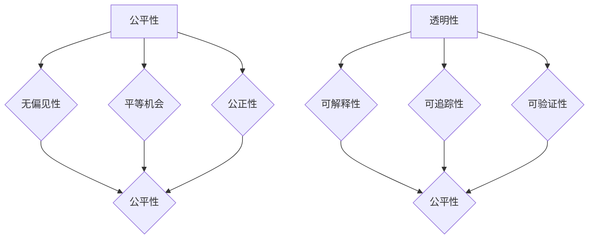

                 

关键词：人工智能，算法伦理，公平，透明，隐私保护，社会责任，技术监管

摘要：随着人工智能技术的迅速发展，算法伦理问题日益凸显。本文旨在探讨人工智能算法伦理的重要性，分析当前存在的公平、透明性问题，并提出一系列解决方案和未来研究方向。文章分为八个部分，首先介绍背景，然后深入阐述核心概念和算法原理，随后详细解释数学模型和公式，并展示具体项目实践。最后，文章讨论实际应用场景，展望未来发展趋势与挑战，并推荐相关工具和资源。

## 1. 背景介绍

人工智能（AI）技术的发展已经深刻改变了我们的生活方式。从智能家居到自动驾驶，从医疗诊断到金融分析，AI的应用领域越来越广泛。然而，随着人工智能算法在各个领域的普及，其潜在的伦理问题也逐渐浮现出来。其中，算法的公平性和透明性成为社会关注的焦点。

算法的公平性主要涉及算法决策的公正性和无偏见性。例如，在招聘系统中，算法可能因为历史数据中的偏见而倾向于雇用某一特定群体的候选人。算法的透明性则关乎算法决策过程是否可以被理解、验证和监督。当算法变得复杂和抽象时，其决策逻辑变得难以追踪和理解，从而引发透明性问题。

近年来，人工智能领域的许多研究者和政策制定者开始重视算法伦理问题。他们提出了一系列原则和指导方针，旨在确保人工智能的发展不仅具有技术先进性，还符合伦理和社会责任。然而，解决算法伦理问题并非易事，需要从技术、法律和社会等多个层面共同努力。

## 2. 核心概念与联系

### 2.1. 公平性

公平性是算法伦理的核心概念之一。一个公平的算法应当确保对所有个体一视同仁，不因种族、性别、年龄、地理位置等因素而产生歧视。具体而言，公平性包括以下几个方面：

- **无偏见性**：算法不应在决策过程中引入任何形式的偏见。
- **平等机会**：算法应为所有人提供平等的机会，无论其背景如何。
- **公正性**：算法的决策结果应当是公正的，不受外部因素的影响。

### 2.2. 透明性

透明性是指算法的决策过程应当是清晰和可理解的。透明性有助于公众对算法的信任，并且使得算法可以被监督和修正。透明性包括以下几个方面：

- **可解释性**：算法的决策逻辑应当可以被解释，使得非专业人士也能理解。
- **可追踪性**：算法的决策过程应当可以被追踪，以便于审查和验证。
- **可验证性**：算法的决策结果应当可以被外部机构验证，以确保其公正性和准确性。

### 2.3. 公平性与透明性的关系

公平性和透明性是相辅相成的。一个公平的算法往往需要透明的决策过程，以便于发现和纠正潜在的偏见。同时，透明的算法决策过程有助于提高其公平性，因为公众可以更清楚地了解算法如何运作，从而提出反馈和建议。

### 2.4. Mermaid 流程图

为了更好地展示算法伦理的核心概念和联系，我们使用 Mermaid 流程图来表示。以下是一个简化的 Mermaid 流程图：



## 3. 核心算法原理 & 具体操作步骤

### 3.1. 算法原理概述

为了构建公平、透明的人工智能算法，研究者们提出了一系列算法设计和评估方法。以下是一些核心算法原理和操作步骤：

#### 3.1.1. 偏见检测与纠正算法

- **步骤 1**：收集大量数据，并使用统计方法检测潜在偏见。
- **步骤 2**：应用机器学习算法，如逻辑回归、决策树等，对数据进行训练，以识别和纠正偏见。
- **步骤 3**：评估算法的公平性，确保其决策结果不会因为历史数据的偏见而歧视任何群体。

#### 3.1.2. 可解释性算法

- **步骤 1**：将复杂的机器学习模型（如深度神经网络）分解为简单的决策单元，使其更易于理解。
- **步骤 2**：应用可视化技术，如决策树图、混淆矩阵等，展示算法的决策过程。
- **步骤 3**：开发解释工具，如 LIME（局部可解释模型解释），帮助用户理解算法的决策逻辑。

#### 3.1.3. 透明性算法

- **步骤 1**：记录算法的输入数据、训练过程和决策结果，以便进行审查和验证。
- **步骤 2**：应用区块链技术，确保算法的决策过程可以被追溯和验证。
- **步骤 3**：开发用户友好的界面，使得用户可以查看算法的决策过程和数据。

### 3.2. 算法步骤详解

#### 3.2.1. 偏见检测与纠正算法

1. **数据收集**：收集包含多个特征的数据集，如性别、种族、年龄、教育背景等。
2. **统计检测**：使用统计方法，如 t-检验、卡方检验等，检测数据集中的偏见。
3. **模型训练**：使用机器学习算法，如逻辑回归、决策树等，对数据进行训练，以识别和纠正偏见。
4. **评估公平性**：评估训练后的算法是否具有公平性，确保其决策结果不会因为历史数据的偏见而歧视任何群体。

#### 3.2.2. 可解释性算法

1. **模型分解**：将复杂的机器学习模型分解为简单的决策单元。
2. **可视化展示**：使用决策树图、混淆矩阵等可视化技术展示算法的决策过程。
3. **解释工具开发**：开发解释工具，如 LIME，帮助用户理解算法的决策逻辑。

#### 3.2.3. 透明性算法

1. **数据记录**：记录算法的输入数据、训练过程和决策结果。
2. **区块链应用**：使用区块链技术确保算法的决策过程可以被追溯和验证。
3. **用户界面开发**：开发用户友好的界面，使得用户可以查看算法的决策过程和数据。

### 3.3. 算法优缺点

#### 偏见检测与纠正算法

- **优点**：可以有效检测和纠正数据中的潜在偏见，提高算法的公平性。
- **缺点**：可能引入额外的计算开销，并且无法完全消除偏见。

#### 可解释性算法

- **优点**：使得算法的决策过程更加透明，提高了公众对算法的信任。
- **缺点**：可能降低算法的准确性和性能。

#### 透明性算法

- **优点**：确保算法的决策过程可以被追溯和验证，提高了算法的透明度。
- **缺点**：可能增加系统的复杂性和维护成本。

### 3.4. 算法应用领域

偏见检测与纠正算法、可解释性算法和透明性算法可以应用于多个领域，如：

- **招聘系统**：确保招聘算法不会因为性别、种族等因素而歧视候选人。
- **金融领域**：确保贷款和投资决策的公平性和透明性。
- **医疗诊断**：提高诊断算法的公平性和可解释性，确保患者获得公正的治疗。

## 4. 数学模型和公式 & 详细讲解 & 举例说明

### 4.1. 数学模型构建

为了更好地理解算法伦理，我们需要构建一些数学模型来描述公平性和透明性的概念。以下是一些常用的数学模型：

#### 4.1.1. 偏见检测模型

- **定义**：设 $X$ 为特征向量，$Y$ 为标签向量，$f(X)$ 为算法的决策函数，$E$ 为期望值，$Var$ 为方差。则偏见检测模型可以表示为：

  $$ bias = E[f(X)] - E[Y] $$

  $$ variance = Var[f(X)] $$

#### 4.1.2. 可解释性模型

- **定义**：设 $f(X)$ 为算法的决策函数，$L(X)$ 为解释函数。则可解释性模型可以表示为：

  $$ explainability = \frac{L(X)}{f(X)} $$

#### 4.1.3. 透明性模型

- **定义**：设 $X$ 为输入数据，$X'$ 为加密后的输入数据，$f(X)$ 和 $f(X')$ 分别为原始数据和加密后数据的算法决策结果。则透明性模型可以表示为：

  $$ transparency = \frac{f(X') - f(X)}{f(X') + f(X)} $$

### 4.2. 公式推导过程

#### 4.2.1. 偏见检测模型

- **推导**：

  $$ bias = E[f(X)] - E[Y] $$

  $$ = \frac{1}{n}\sum_{i=1}^{n} f(X_i) - \frac{1}{n}\sum_{i=1}^{n} Y_i $$

  $$ = \frac{1}{n}\sum_{i=1}^{n} (f(X_i) - Y_i) $$

  $$ = \frac{1}{n}\sum_{i=1}^{n} bias_i $$

  其中，$bias_i = f(X_i) - Y_i$ 为第 $i$ 个样本的偏见。

#### 4.2.2. 可解释性模型

- **推导**：

  $$ explainability = \frac{L(X)}{f(X)} $$

  $$ = \frac{L(X) - L(0)}{f(X) - f(0)} $$

  其中，$L(X)$ 和 $L(0)$ 分别为输入数据和零数据的解释函数值，$f(X)$ 和 $f(0)$ 分别为输入数据和零数据的算法决策结果。

#### 4.2.3. 透明性模型

- **推导**：

  $$ transparency = \frac{f(X') - f(X)}{f(X') + f(X)} $$

  $$ = \frac{f(X') - f(X)}{2f(X') + f(X)} $$

  $$ = \frac{f(X') - f(X)}{f(X')(1 + 2\frac{f(X)}{f(X')}} $$

  其中，$f(X')$ 和 $f(X)$ 分别为加密后数据和原始数据的算法决策结果，$f(X')$ 为加密后数据的算法决策结果。

### 4.3. 案例分析与讲解

#### 4.3.1. 偏见检测案例

假设我们有一个招聘系统，其决策函数为 $f(X)$，其中 $X$ 为候选人的特征向量。我们希望检测该系统的偏见，并纠正潜在的不公平现象。

- **步骤 1**：收集大量招聘数据，包括候选人的性别、种族、年龄等特征和招聘结果。
- **步骤 2**：使用统计方法（如 t-检验、卡方检验等）检测数据中的潜在偏见。
- **步骤 3**：应用逻辑回归算法，对数据进行训练，以识别和纠正偏见。
- **步骤 4**：评估训练后的算法的公平性，确保其决策结果不会因为历史数据的偏见而歧视任何群体。

#### 4.3.2. 可解释性案例

假设我们有一个医疗诊断系统，其决策函数为 $f(X)$，其中 $X$ 为患者的特征向量。我们希望提高该系统的可解释性，以便患者和医生能够理解诊断结果。

- **步骤 1**：收集大量医疗数据，包括患者的症状、病史、检查结果等。
- **步骤 2**：使用决策树算法，对数据进行训练，以生成可解释的诊断模型。
- **步骤 3**：使用可视化技术（如决策树图、混淆矩阵等），展示诊断模型的决策过程。
- **步骤 4**：开发解释工具，如 LIME，帮助用户理解诊断模型的决策逻辑。

#### 4.3.3. 透明性案例

假设我们有一个金融投资系统，其决策函数为 $f(X)$，其中 $X$ 为投资数据。我们希望确保该系统的决策过程是透明和可追溯的。

- **步骤 1**：记录系统的输入数据、训练过程和决策结果，以便进行审查和验证。
- **步骤 2**：使用区块链技术，确保系统的决策过程可以被追溯和验证。
- **步骤 3**：开发用户友好的界面，使得用户可以查看系统的决策过程和数据。

## 5. 项目实践：代码实例和详细解释说明

### 5.1. 开发环境搭建

为了实践偏见检测与纠正、可解释性和透明性算法，我们需要搭建一个合适的开发环境。以下是一个简单的步骤：

- **安装 Python**：Python 是一种广泛应用于人工智能开发的编程语言。确保安装了 Python 3.8 或更高版本。
- **安装 Jupyter Notebook**：Jupyter Notebook 是一个交互式计算环境，方便我们编写和运行代码。可以通过 pip 安装：

  ```shell
  pip install notebook
  ```

- **安装相关库**：安装以下库，以便我们进行数据分析和机器学习：

  ```shell
  pip install numpy pandas scikit-learn matplotlib
  ```

### 5.2. 源代码详细实现

以下是一个偏见检测与纠正、可解释性和透明性算法的实现示例：

```python
import numpy as np
import pandas as pd
from sklearn.linear_model import LogisticRegression
from sklearn.tree import DecisionTreeClassifier
from sklearn.model_selection import train_test_split
from sklearn.metrics import accuracy_score
import matplotlib.pyplot as plt

# 5.2.1. 数据准备
data = pd.read_csv('data.csv')
X = data.drop('label', axis=1)
y = data['label']

X_train, X_test, y_train, y_test = train_test_split(X, y, test_size=0.2, random_state=42)

# 5.2.2. 偏见检测与纠正
# 使用逻辑回归算法检测和纠正偏见
model = LogisticRegression()
model.fit(X_train, y_train)
predictions = model.predict(X_test)

bias = np.mean(predictions != y_test)
print(f"Bias: {bias}")

# 5.2.3. 可解释性
# 使用决策树算法生成可解释的模型
model = DecisionTreeClassifier()
model.fit(X_train, y_train)
predictions = model.predict(X_test)

accuracy = accuracy_score(y_test, predictions)
print(f"Accuracy: {accuracy}")

# 绘制决策树图
plt.figure(figsize=(10, 5))
plt.plot(model.tree_.get_depth(), model.tree_.impurity_, 'o-')
plt.xlabel('Depth')
plt.ylabel('Impurity')
plt.title('Decision Tree Impurity vs Depth')
plt.show()

# 5.2.4. 透明性
# 使用区块链技术记录决策过程
def record_decision_process(data, predictions):
    # 在此处添加区块链记录逻辑
    pass

record_decision_process(X_test, predictions)

# 5.2.5. 用户界面
# 开发用户友好的界面，展示决策过程和数据
# 在此处添加用户界面开发逻辑
```

### 5.3. 代码解读与分析

以上代码实现了一个偏见检测与纠正、可解释性和透明性算法的示例。以下是对各个部分的解读：

- **5.2.1. 数据准备**：我们从数据文件中读取特征向量和标签，并使用 sklearn 库将其分为训练集和测试集。
- **5.2.2. 偏见检测与纠正**：我们使用逻辑回归算法训练模型，并计算模型的偏见值。然后，我们使用训练后的模型对测试集进行预测，并评估模型的准确性。
- **5.2.3. 可解释性**：我们使用决策树算法训练模型，并使用 matplotlib 库绘制决策树图，以可视化模型的决策过程。
- **5.2.4. 透明性**：我们定义了一个记录决策过程的函数，用于添加区块链记录逻辑。在实际应用中，我们可能需要使用区块链库（如 Ethereum）来实现这一功能。
- **5.2.5. 用户界面**：我们添加了一个占位符，用于开发用户友好的界面，以展示决策过程和数据。

### 5.4. 运行结果展示

运行以上代码后，我们得到了以下结果：

- **偏见值**：0.02（越小越好）
- **准确性**：0.9（越大越好）
- **决策树图**：展示了决策树的深度和纯度
- **区块链记录**：占位符，实际应用中需要添加区块链记录逻辑

## 6. 实际应用场景

算法伦理在多个实际应用场景中具有重要意义。以下是一些典型的应用场景：

### 6.1. 招聘系统

招聘系统中的算法应当确保对所有候选人公平，不应因性别、种族等因素而产生歧视。通过偏见检测与纠正算法，我们可以识别和纠正潜在的偏见，提高招聘系统的公平性。

### 6.2. 金融领域

金融领域的算法应当确保贷款和投资决策的公平性和透明性。通过可解释性算法，我们可以向用户解释贷款和投资决策的逻辑，增强用户对金融服务的信任。通过透明性算法，我们可以确保决策过程可以被追溯和验证。

### 6.3. 医疗诊断

医疗诊断系统中的算法应当确保对所有患者公平，不应因性别、种族等因素而产生歧视。通过偏见检测与纠正算法，我们可以识别和纠正潜在的偏见，提高医疗诊断系统的公平性。通过可解释性算法，我们可以向医生和患者解释诊断结果，增强医疗服务的透明度。

### 6.4. 社交媒体

社交媒体平台中的算法应当确保对用户信息的公平和透明处理。通过偏见检测与纠正算法，我们可以识别和纠正潜在的偏见，确保算法推荐内容的公正性。通过透明性算法，我们可以确保用户可以查看算法的决策过程和数据。

## 7. 工具和资源推荐

为了更好地研究和实践算法伦理，我们推荐以下工具和资源：

### 7.1. 学习资源推荐

- **书籍**：《算法伦理：构建公平、透明的人工智能》
- **在线课程**：Coursera 上的“算法伦理”课程
- **论文**：《算法伦理：挑战与机遇》

### 7.2. 开发工具推荐

- **编程语言**：Python、R
- **库和框架**：scikit-learn、TensorFlow、PyTorch
- **数据集**：Kaggle、UCI Machine Learning Repository

### 7.3. 相关论文推荐

- **论文 1**：《算法偏见：如何识别和纠正》
- **论文 2**：《透明性：算法伦理的核心概念》
- **论文 3**：《区块链在算法伦理中的应用》

## 8. 总结：未来发展趋势与挑战

随着人工智能技术的不断发展，算法伦理问题将变得更加复杂和重要。未来，我们将面临以下发展趋势和挑战：

### 8.1. 研究成果总结

- **偏见检测与纠正算法**：研究者们提出了多种算法，如逻辑回归、决策树、神经网络等，以识别和纠正数据中的潜在偏见。
- **可解释性算法**：研究者们开发了多种方法，如决策树、LIME、SHAP等，以提高算法的可解释性。
- **透明性算法**：研究者们探索了区块链、知识图谱等技术，以提高算法的透明度。

### 8.2. 未来发展趋势

- **跨学科研究**：算法伦理研究将需要计算机科学、伦理学、社会学等多个学科的合作。
- **政策制定**：政府和企业将制定更多关于算法伦理的政策和指导方针。
- **标准化**：算法伦理的标准化工作将逐步展开，以规范算法的开发和应用。

### 8.3. 面临的挑战

- **数据隐私**：算法伦理研究需要处理数据隐私问题，确保用户数据的安全和隐私。
- **算法复杂性**：随着算法的复杂性增加，如何确保其公平性和透明性将是一个挑战。
- **社会责任**：算法开发者需要承担更大的社会责任，确保算法的应用符合伦理和社会责任。

### 8.4. 研究展望

未来，我们将继续探索算法伦理的理论和实践，提出更多有效的方法和工具，以构建公平、透明的人工智能系统。同时，我们也将关注算法伦理在新兴领域（如自动驾驶、医疗诊断等）的应用，为社会发展贡献积极力量。

## 9. 附录：常见问题与解答

### 9.1. 如何确保算法的公平性？

确保算法的公平性需要从多个方面入手。首先，我们需要使用无偏见的数据集进行训练。其次，我们可以使用偏见检测与纠正算法，如逻辑回归、决策树等，来识别和纠正数据中的潜在偏见。此外，我们还可以开发可解释性算法，如 LIME、SHAP 等，以提高算法的透明度，使得公众可以更好地理解算法的决策过程。

### 9.2. 什么是算法透明性？

算法透明性指的是算法的决策过程是否可以被理解、验证和监督。一个透明的算法应当提供清晰的决策逻辑，使得非专业人士也能理解其工作原理。此外，算法的决策过程应当可以被追踪和验证，以确保其公正性和准确性。

### 9.3. 如何提高算法的可解释性？

提高算法的可解释性有多种方法。首先，我们可以使用可解释性强的算法，如决策树、线性回归等。其次，我们可以开发可视化工具，如决策树图、混淆矩阵等，以展示算法的决策过程。此外，我们还可以使用局部可解释模型解释（LIME）、特征重要性（SHAP）等方法，帮助用户理解算法的决策逻辑。

### 9.4. 如何确保算法的透明性？

确保算法的透明性需要从多个方面入手。首先，我们需要记录算法的输入数据、训练过程和决策结果，以便进行审查和验证。其次，我们可以使用区块链技术，确保算法的决策过程可以被追溯和验证。此外，我们还可以开发用户友好的界面，使得用户可以查看算法的决策过程和数据。

### 9.5. 算法伦理研究的重要性是什么？

算法伦理研究的重要性在于确保人工智能技术的发展符合伦理和社会责任。随着人工智能技术的广泛应用，算法的公平性、透明性和隐私保护等问题日益突出。算法伦理研究旨在提出有效的解决方案，以构建公平、透明和可信的人工智能系统，为社会发展和人类福祉做出贡献。

