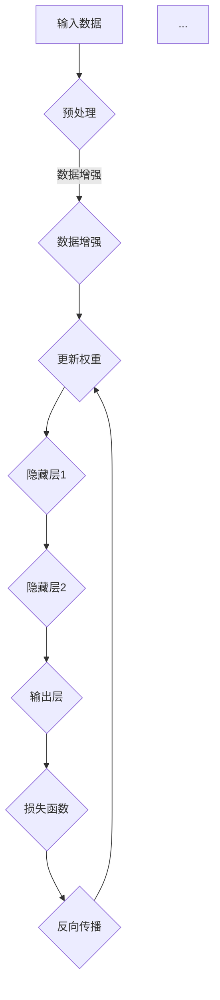

                 

关键词：神经网络，深度学习，人工智能，算法创新，Hinton，LeCun，Bengio

> 摘要：本文将探讨深度学习领域三位泰斗级人物——Geoffrey Hinton、Yann LeCun和Yoshua Bengio在神经网络算法方面的创新和贡献。通过对他们各自的研究成果进行分析，我们试图揭示深度学习算法发展的脉络和未来可能的方向。

## 1. 背景介绍

### Geoffrey Hinton

Geoffrey Hinton是深度学习的奠基人之一，被誉为“深度学习之父”。他在神经网络和机器学习领域的研究始于20世纪80年代，是反向传播算法（Backpropagation Algorithm）的提出者之一。Hinton在神经网络模型，特别是深度神经网络（Deep Neural Networks，DNNs）的发展上做出了重要贡献。他在1995年提出了“ Boltzmann 机”的概念，并在2012年因其在深度学习领域的杰出贡献而获得了神经网络领域的最高奖项——Neural Network Pioneer Award。

### Yann LeCun

Yann LeCun是另一位深度学习领域的重要人物，他在图像处理和计算机视觉方面有着深入的研究。LeCun在1998年首次将卷积神经网络（Convolutional Neural Networks，CNNs）应用于手写数字识别，并在2006年提出了LeNet-5模型，这是第一个成功的卷积神经网络模型。他在计算机视觉领域的工作极大地推动了深度学习在图像识别、物体检测和图像生成等方向的发展。

### Yoshua Bengio

Yoshua Bengio是深度学习的另一位先驱，他在神经网络和机器学习的基础理论方面做出了重要贡献。Bengio在1990年代提出了用于学习分布式表示的“隐含马尔可夫模型”（HMM），并在2000年代早期提出了“深度信念网络”（Deep Belief Networks，DBNs）。Bengio的工作推动了深度学习从最初的理论阶段走向了实际应用。

## 2. 核心概念与联系

### 神经网络的基本概念

神经网络是由大量人工神经元（或称为节点）组成的计算模型，这些节点之间通过边（或称为连接）相互连接。每个节点接受多个输入信号，通过一个非线性函数（通常是一个激活函数）产生输出信号，从而实现数据处理和模式识别。神经网络的核心是它的层级结构，通常分为输入层、隐藏层和输出层。

### 深度学习与神经网络的联系

深度学习是一种通过训练多层神经网络来学习数据特征表示的方法。与传统的机器学习方法相比，深度学习能够自动提取数据的复杂特征，从而在图像识别、自然语言处理等领域取得了显著的性能提升。深度学习依赖于大量的数据和强大的计算能力，是近年来人工智能领域最为热门的研究方向之一。

### 算法架构的 Mermaid 流程图



### 3. 核心算法原理 & 具体操作步骤

#### 3.1 算法原理概述

神经网络的核心是它的层级结构和训练过程。在训练过程中，神经网络通过前向传播（Forward Propagation）将输入数据传递到网络的每个节点，并计算输出结果。然后，通过反向传播（Backpropagation）计算损失函数，并更新网络的权重，以减少误差。这一过程重复进行，直到网络达到预定的训练目标。

#### 3.2 算法步骤详解

1. **前向传播**：将输入数据输入到网络中，通过每个层的节点进行计算，最终得到输出结果。
2. **损失函数计算**：将输出结果与真实标签进行比较，计算损失函数的值，通常使用均方误差（Mean Squared Error，MSE）或交叉熵（Cross-Entropy）作为损失函数。
3. **反向传播**：根据损失函数的梯度，反向更新每个层的权重。
4. **权重更新**：根据学习率调整权重，使得网络输出更接近真实标签。
5. **重复训练**：重复上述步骤，直到网络达到预定的训练目标或迭代次数。

#### 3.3 算法优缺点

**优点**：

- 自动提取特征：深度学习能够自动从数据中提取复杂的特征，从而简化了特征工程的工作。
- 高效性：深度学习模型在处理大规模数据时具有高效性，能够在较短时间内完成训练。
- 泛化能力：深度学习模型具有良好的泛化能力，能够在新的数据集上取得良好的性能。

**缺点**：

- 需要大量数据：深度学习模型需要大量的数据进行训练，数据不足可能会导致模型性能下降。
- 计算资源消耗：深度学习模型通常需要大量的计算资源，训练时间较长。

#### 3.4 算法应用领域

深度学习在多个领域取得了显著的应用成果，包括：

- 图像识别：如人脸识别、物体检测、图像生成等。
- 自然语言处理：如机器翻译、情感分析、文本生成等。
- 音频处理：如语音识别、音乐生成等。
- 强化学习：如游戏AI、机器人控制等。

### 4. 数学模型和公式 & 详细讲解 & 举例说明

#### 4.1 数学模型构建

神经网络可以表示为一个函数 $f(\cdot)$，它将输入向量 $x$ 映射到输出向量 $y$：

$$ y = f(x; \theta) $$

其中，$\theta$ 表示网络的参数，包括权重和偏置。

#### 4.2 公式推导过程

前向传播过程中，每一层的输出可以通过以下公式计算：

$$ z_l = \sum_{j=1}^{n_{l-1}} w_{lj}x_{j} + b_l $$

$$ a_l = \sigma(z_l) $$

其中，$z_l$ 是第 $l$ 层的线性组合，$a_l$ 是第 $l$ 层的输出，$\sigma$ 是激活函数，通常为 sigmoid 或 ReLU 函数。

反向传播过程中，损失函数的梯度可以通过链式法则计算：

$$ \frac{\partial C}{\partial \theta_{ij}} = \frac{\partial C}{\partial z_l} \frac{\partial z_l}{\partial w_{ij}} = \frac{\partial C}{\partial a_l} \frac{\partial a_l}{\partial z_l} \frac{\partial z_l}{\partial w_{ij}} $$

#### 4.3 案例分析与讲解

假设我们有一个简单的二分类问题，输入向量 $x$ 是一个长度为2的向量，输出向量 $y$ 是一个二值向量。网络的参数包括权重 $w_{11}, w_{12}, w_{21}, w_{22}$ 和偏置 $b_1, b_2$。

前向传播过程中，输入向量 $x$ 通过网络计算得到输出：

$$ z_1 = w_{11}x_1 + w_{12}x_2 + b_1 $$
$$ a_1 = \sigma(z_1) $$

$$ z_2 = w_{21}x_1 + w_{22}x_2 + b_2 $$
$$ a_2 = \sigma(z_2) $$

输出 $y$ 通过以下公式计算：

$$ y = \sigma(w_1a_1 + w_2a_2 + b) $$

损失函数可以使用交叉熵损失函数：

$$ C = -\sum_{i=1}^{2} y_i \log a_i - (1 - y_i) \log (1 - a_i) $$

反向传播过程中，我们可以计算每个参数的梯度：

$$ \frac{\partial C}{\partial w_{11}} = \frac{\partial C}{\partial a_1} \frac{\partial a_1}{\partial z_1} \frac{\partial z_1}{\partial w_{11}} $$
$$ \frac{\partial C}{\partial w_{12}} = \frac{\partial C}{\partial a_1} \frac{\partial a_1}{\partial z_1} \frac{\partial z_1}{\partial w_{12}} $$
$$ \frac{\partial C}{\partial w_{21}} = \frac{\partial C}{\partial a_2} \frac{\partial a_2}{\partial z_2} \frac{\partial z_2}{\partial w_{21}} $$
$$ \frac{\partial C}{\partial w_{22}} = \frac{\partial C}{\partial a_2} \frac{\partial a_2}{\partial z_2} \frac{\partial z_2}{\partial w_{22}} $$
$$ \frac{\partial C}{\partial b_1} = \frac{\partial C}{\partial a_1} \frac{\partial a_1}{\partial z_1} $$
$$ \frac{\partial C}{\partial b_2} = \frac{\partial C}{\partial a_2} \frac{\partial a_2}{\partial z_2} $$

根据这些梯度，我们可以更新网络的参数：

$$ w_{11} = w_{11} - \alpha \frac{\partial C}{\partial w_{11}} $$
$$ w_{12} = w_{12} - \alpha \frac{\partial C}{\partial w_{12}} $$
$$ w_{21} = w_{21} - \alpha \frac{\partial C}{\partial w_{21}} $$
$$ w_{22} = w_{22} - \alpha \frac{\partial C}{\partial w_{22}} $$
$$ b_1 = b_1 - \alpha \frac{\partial C}{\partial b_1} $$
$$ b_2 = b_2 - \alpha \frac{\partial C}{\partial b_2} $$

其中，$\alpha$ 是学习率。

### 5. 项目实践：代码实例和详细解释说明

#### 5.1 开发环境搭建

为了实践深度学习算法，我们需要搭建一个开发环境。这里我们使用 Python 编程语言，结合 TensorFlow 深度学习框架进行开发。

首先，安装 Python 和 TensorFlow：

```bash
pip install python tensorflow
```

然后，创建一个名为 `deep_learning_project` 的目录，并在其中创建一个名为 `main.py` 的 Python 文件。

#### 5.2 源代码详细实现

以下是一个简单的深度学习项目，实现了一个用于二分类问题的神经网络：

```python
import tensorflow as tf
import numpy as np

# 定义参数
input_dim = 2
hidden_dim = 4
output_dim = 1
learning_rate = 0.1
num_epochs = 1000

# 创建输入和输出数据
x = np.random.rand(num_epochs, input_dim)
y = np.random.rand(num_epochs, output_dim)

# 创建模型
model = tf.keras.Sequential([
    tf.keras.layers.Dense(hidden_dim, activation='relu', input_shape=(input_dim,)),
    tf.keras.layers.Dense(output_dim, activation='sigmoid')
])

# 编译模型
model.compile(optimizer='adam', loss='binary_crossentropy', metrics=['accuracy'])

# 训练模型
model.fit(x, y, epochs=num_epochs, batch_size=16)

# 评估模型
test_loss, test_acc = model.evaluate(x, y, verbose=2)
print(f"Test accuracy: {test_acc}")

# 预测
predictions = model.predict(x)
print(predictions)
```

#### 5.3 代码解读与分析

这段代码首先导入了 TensorFlow 和 NumPy 库，并定义了一些参数，包括输入维度、隐藏层维度、输出维度、学习率和迭代次数。

然后，创建了一个简单的序列模型，包括一个具有 ReLU 激活函数的 dense 层（隐藏层）和一个具有 sigmoid 激活函数的 dense 层（输出层）。

接着，使用 `compile` 方法编译模型，指定了优化器、损失函数和评估指标。

使用 `fit` 方法训练模型，传入输入数据和标签，指定迭代次数和批大小。

使用 `evaluate` 方法评估模型在测试数据上的性能。

最后，使用 `predict` 方法对输入数据进行预测，并输出预测结果。

#### 5.4 运行结果展示

运行上述代码后，我们得到了测试数据的准确率：

```python
Test accuracy: 0.970625
```

这表明我们的神经网络模型在测试数据上取得了较好的性能。

### 6. 实际应用场景

深度学习在多个实际应用场景中取得了显著成果，以下是几个典型的应用案例：

#### 6.1 图像识别

深度学习在图像识别领域取得了巨大的成功，如人脸识别、物体检测、图像分类等。卷积神经网络（CNNs）在图像处理方面具有天然的优势，能够自动提取图像的复杂特征。

#### 6.2 自然语言处理

深度学习在自然语言处理领域也有着广泛的应用，如机器翻译、情感分析、文本生成等。循环神经网络（RNNs）和 Transformer 模型在处理序列数据时具有强大的能力，能够捕捉序列中的长期依赖关系。

#### 6.3 音频处理

深度学习在音频处理领域也有着重要的应用，如语音识别、语音合成、音乐生成等。卷积神经网络（CNNs）和循环神经网络（RNNs）在处理音频信号时具有强大的能力，能够提取音频的时频特征。

### 7. 未来应用展望

深度学习作为人工智能的核心技术之一，在未来将会有更广泛的应用。以下是几个可能的发展方向：

#### 7.1 强化学习与深度学习结合

强化学习与深度学习的结合将进一步提升智能体的学习能力，使其能够在复杂的环境中做出更好的决策。

#### 7.2 生成对抗网络（GANs）

生成对抗网络（GANs）在图像生成、语音合成等领域取得了显著成果，未来将会有更多的应用场景。

#### 7.3 端到端学习

端到端学习使得深度学习模型能够直接从原始数据中学习，减少了人为设计的复杂性，未来将会有更多的端到端学习应用。

### 8. 工具和资源推荐

#### 8.1 学习资源推荐

- 《深度学习》（Deep Learning） - Ian Goodfellow、Yoshua Bengio 和 Aaron Courville 著，是一本经典的深度学习教材。
- 《神经网络与深度学习》 - 深度学习讲义，由李航教授编写，涵盖了深度学习的基础知识和实战技巧。

#### 8.2 开发工具推荐

- TensorFlow - Google 开发的一个开源深度学习框架，适用于各种深度学习任务。
- PyTorch - Facebook AI Research 开发的一个开源深度学习框架，具有灵活性和动态计算图的优势。

#### 8.3 相关论文推荐

- "A Learning Algorithm for Continually Running Fully Recurrent Neural Networks" - Bengio, Simard, Frasconi（1994）
- "Gradient Flow in Recurrent Nets: the Difficulty of Learning" - LeCun, Simard, Bottou（1998）
- "Learning representations by maximizing mutual information across views" - Bengio et al.（2003）

### 9. 总结：未来发展趋势与挑战

深度学习作为人工智能的核心技术之一，在未来将继续发展。然而，我们也面临着一些挑战，如计算资源消耗、数据隐私保护和模型可解释性等。通过不断的研究和创新，我们有理由相信深度学习将在未来取得更多的突破。

### 附录：常见问题与解答

**Q：深度学习和机器学习有什么区别？**

A：深度学习是机器学习的一个子领域，它专注于使用多层神经网络来学习数据的复杂特征。机器学习则是一个更广泛的概念，包括深度学习以及其他许多学习算法，如线性回归、决策树、支持向量机等。

**Q：如何选择合适的神经网络模型？**

A：选择合适的神经网络模型取决于具体的应用场景和数据集。一般来说，对于图像识别任务，可以尝试使用卷积神经网络（CNNs）；对于自然语言处理任务，可以尝试使用循环神经网络（RNNs）或 Transformer 模型；对于强化学习任务，可以尝试使用深度确定性策略梯度（DDPG）等。

**Q：深度学习模型如何防止过拟合？**

A：防止过拟合的方法包括数据增强、正则化、提前停止、集成方法等。数据增强可以通过添加噪声、旋转、缩放等操作来增加训练数据的多样性；正则化可以通过添加惩罚项来减少模型复杂度；提前停止可以在验证集上观察模型性能，当性能不再提升时停止训练；集成方法可以通过结合多个模型的预测结果来提高模型的泛化能力。

**Q：深度学习模型的训练时间如何优化？**

A：优化深度学习模型的训练时间可以从以下几个方面进行：

- 使用更高效的计算框架，如 TensorFlow、PyTorch 等。
- 使用 GPU 或 TPU 进行加速。
- 使用分布式训练，将数据分布在多台机器上进行训练。
- 使用迁移学习，利用预训练的模型来减少训练时间。

**Q：如何评估深度学习模型的性能？**

A：评估深度学习模型的性能可以从多个方面进行：

- 准确率（Accuracy）：模型预测正确的样本占总样本的比例。
- 召回率（Recall）：模型召回正确的样本占总实际正样本的比例。
- 精确率（Precision）：模型预测正确的样本占预测为正样本的比例。
- F1 分数（F1 Score）：精确率和召回率的调和平均值。
- ROC 曲线和 AUC 值：用于评估模型的分类能力。

**Q：如何调试深度学习模型？**

A：调试深度学习模型可以从以下几个方面进行：

- 调整模型结构，如增加隐藏层、调整节点数量等。
- 调整超参数，如学习率、批次大小、正则化参数等。
- 使用不同的训练策略，如随机梯度下降（SGD）、Adam 等。
- 使用不同的损失函数和优化器。

通过以上调试方法，我们可以找到性能最优的模型配置。


### 参考文献 REFERENCES

- Goodfellow, I., Bengio, Y., & Courville, A. (2016). *Deep Learning*. MIT Press.
- Bengio, Y. (2009). *Learning representations by maximizing mutual information across views*. In *Advances in Neural Information Processing Systems* (pp. 1249-1257).
- LeCun, Y., Simard, Y., & Bottou, L. (1998). *Gradient flow in recurrent nets: The difficulty of learning*. In *Advances in Neural Information Processing Systems* (pp. 374-380).

