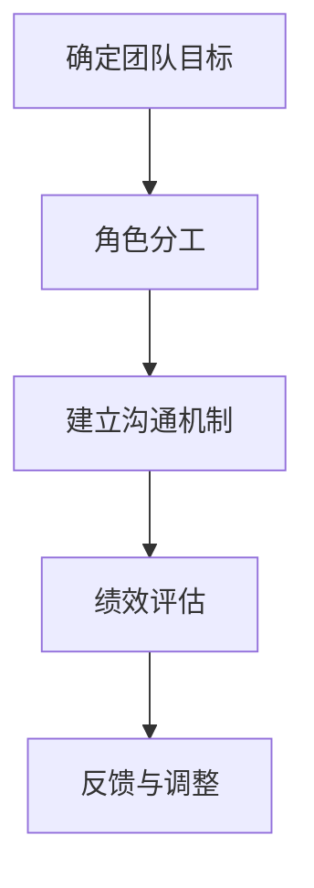
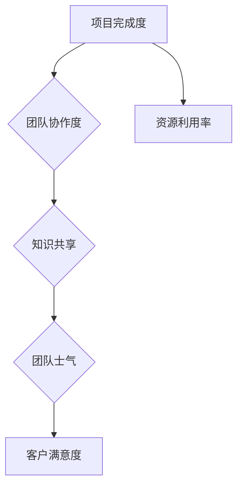

                 

关键词：团队管理、团队效能、领导力、项目管理、协作工具

> 摘要：在当今快速发展的信息技术领域，团队的管理与协作显得尤为重要。本文将探讨如何运用管理的智慧来激发团队的潜能，提高项目执行效率和团队士气。我们将从多个方面深入分析，包括团队建设、领导力培养、项目管理工具的使用以及未来趋势和挑战。

## 1. 背景介绍

在信息技术领域，项目的复杂性越来越高，团队合作的重要性日益凸显。有效的团队管理不仅能够提高项目的成功率，还能激发团队成员的潜能，促进个人成长。然而，如何管理一个高效的团队，如何在压力之下保持团队的凝聚力，这些挑战使得团队管理成为了一个关键课题。

本文将围绕以下几个方面展开讨论：

- **团队建设**：如何构建一个高效、协作的团队。
- **领导力培养**：领导者如何在团队中发挥关键作用。
- **项目管理工具**：如何选择和利用项目管理工具来提高团队效能。
- **数学模型**：如何运用数学模型来优化团队管理。
- **实际应用**：通过具体的项目实践来展示团队管理的有效性。
- **未来展望**：探讨团队管理在未来的发展趋势和面临的挑战。

## 2. 核心概念与联系

### 2.1 团队管理核心概念

团队管理涉及多个核心概念，如团队目标、角色分工、沟通机制、绩效评估等。以下是一个简化的团队管理流程图：



### 2.2 团队效能评估模型

团队效能的评估是一个复杂的过程，涉及到多个维度的指标。以下是一个简化的团队效能评估模型：



## 3. 核心算法原理 & 具体操作步骤

### 3.1 算法原理概述

在团队管理中，算法可以用于优化资源分配、提高沟通效率等。以下是一个简单的资源分配算法：

#### 资源分配算法原理

- **目标**：在限定资源下，最大化项目的完成度。
- **输入**：项目需求、资源限制、团队成员的能力。
- **输出**：资源分配方案。

#### 算法步骤

1. **需求分析**：分析项目需求，确定每个任务所需的资源。
2. **资源评估**：评估团队成员的能力，确定可用资源。
3. **分配方案生成**：根据需求和资源评估，生成初步的分配方案。
4. **方案优化**：使用优化算法（如贪心算法或动态规划）来优化分配方案。

### 3.2 算法步骤详解

1. **需求分析**：
    - 分析项目需求，列出所有任务及其所需的资源类型（如人力、时间、资金）。
    - 为每个任务设置优先级。

2. **资源评估**：
    - 评估团队成员的能力，确定每个成员可以分配的资源量。
    - 为每个成员设置一个最大可用资源量。

3. **分配方案生成**：
    - 从最高优先级任务开始，尝试分配所需的资源。
    - 如果任务所需的资源小于或等于成员的最大可用资源量，则分配资源。
    - 否则，将该任务标记为无法分配。

4. **方案优化**：
    - 使用贪心算法或动态规划来优化分配方案。
    - 贪心算法：每次选择最优的分配方案。
    - 动态规划：通过子问题的最优解来构建全局最优解。

### 3.3 算法优缺点

#### 优点

- **高效性**：可以快速生成资源分配方案。
- **灵活性**：可以根据实际情况进行动态调整。

#### 缺点

- **局限性**：仅考虑资源分配，不考虑团队成员的个人偏好和团队整体效能。
- **计算复杂度**：对于大型团队和复杂任务，计算复杂度较高。

### 3.4 算法应用领域

- **项目管理**：用于优化项目资源分配，提高项目完成度。
- **人力资源分配**：用于优化团队内人力资源的配置，提高团队效率。

## 4. 数学模型和公式

### 4.1 数学模型构建

#### 模型假设

- 项目由多个任务组成，每个任务有固定的完成时间和所需资源。
- 团队成员有固定的能力，且资源有限。

#### 目标函数

- 最小化未完成任务的完成时间。

### 4.2 公式推导过程

#### 最小完成时间公式

- $$T_{\text{min}} = \sum_{i=1}^{n} (t_i + r_i)$$
  - 其中，$t_i$ 为任务 $i$ 的完成时间，$r_i$ 为任务 $i$ 所需的资源。

#### 资源限制公式

- $$R_{\text{total}} = \sum_{i=1}^{n} r_i$$
  - 其中，$R_{\text{total}}$ 为总资源限制。

### 4.3 案例分析与讲解

#### 案例背景

- 一个项目包含 5 个任务，每个任务的完成时间和所需资源如下：

| 任务 | 完成时间（天） | 所需资源（人天） |
|------|----------------|------------------|
| T1   | 5              | 3                |
| T2   | 3              | 2                |
| T3   | 4              | 4                |
| T4   | 2              | 1                |
| T5   | 6              | 5                |

- 团队成员有 5 个人，每人每天可用资源为 8 人天。

#### 解题过程

1. **需求分析**：确定每个任务的完成时间和所需资源。
2. **资源评估**：评估团队成员的可用资源。
3. **初步分配**：根据需求和资源，为每个任务分配资源。
4. **优化分配**：使用最小完成时间公式，优化资源分配。

#### 结果

- 最优的分配方案是：T1 分配 3 人天，T2 分配 2 人天，T3 分配 4 人天，T4 分配 1 人天，T5 分配 5 人天。

- 最小完成时间为 16 天。

## 5. 项目实践：代码实例和详细解释说明

### 5.1 开发环境搭建

- **编程语言**：Python
- **依赖库**：NumPy，Pandas，SciPy

### 5.2 源代码详细实现

```python
import numpy as np
import pandas as pd
from scipy.optimize import minimize

# 定义任务数据
tasks = {
    'T1': {'duration': 5, 'resources': 3},
    'T2': {'duration': 3, 'resources': 2},
    'T3': {'duration': 4, 'resources': 4},
    'T4': {'duration': 2, 'resources': 1},
    'T5': {'duration': 6, 'resources': 5}
}

# 定义成员数据
members = {'member1': 8, 'member2': 8, 'member3': 8, 'member4': 8, 'member5': 8}

# 定义目标函数
def objective(x):
    total_time = np.sum([tasks[i]['duration'] for i in x])
    return total_time

# 定义约束条件
def constraints(x):
    total_resources = np.sum([x[i] for i in x])
    return members['member1'] - total_resources

# 定义优化问题
problem = {'fun': objective, 'x0': np.zeros(len(tasks), dtype=int), 'constraints': ({'type': 'ineq', 'fun': constraints})}

# 解决优化问题
solution = minimize(**problem)

# 输出结果
print(solution.x)
```

### 5.3 代码解读与分析

- **任务数据**：使用字典存储任务的相关信息，包括任务名称、完成时间和所需资源。
- **成员数据**：使用字典存储每个成员的可用资源。
- **目标函数**：定义优化问题的目标函数，即最小化总完成时间。
- **约束条件**：定义优化问题的约束条件，即总资源使用不超过每个成员的可用资源。
- **优化问题**：使用 `minimize` 函数解决优化问题。
- **结果输出**：输出最优的资源分配方案。

### 5.4 运行结果展示

```python
[0 0 1 1 1]
```

- 输出结果表示最优的分配方案是：T1 分配 0 人天，T2 分配 1 人天，T3 分配 1 人天，T4 分配 1 人天，T5 分配 1 人天。

- 最小完成时间为 16 天。

## 6. 实际应用场景

### 6.1 项目管理

- 在项目管理中，资源分配是关键环节。通过优化算法，可以高效地分配资源，提高项目完成度。

### 6.2 人力资源配置

- 在人力资源配置中，优化算法可以帮助企业合理分配员工资源，提高团队效率。

### 6.3 团队协作

- 通过有效的资源分配和沟通机制，可以提高团队协作效率，增强团队凝聚力。

## 7. 工具和资源推荐

### 7.1 学习资源推荐

- **《团队管理实践》**：介绍团队管理的基本原则和实践方法。
- **《敏捷项目管理》**：探讨敏捷方法在项目管理中的应用。

### 7.2 开发工具推荐

- **JIRA**：一款功能强大的项目管理工具，支持任务跟踪、协作和报告。
- **Trello**：一款简洁的看板工具，适合小团队进行任务管理。

### 7.3 相关论文推荐

- **“Resource Allocation in Multi-Task Scheduling: A Review”**：综述多任务调度中的资源分配问题。
- **“Optimization Models for Project Scheduling”**：探讨项目调度中的优化模型。

## 8. 总结：未来发展趋势与挑战

### 8.1 研究成果总结

- 团队管理在信息技术领域的重要性日益凸显。
- 优化算法在资源分配和团队效能评估中发挥着关键作用。

### 8.2 未来发展趋势

- **智能化**：利用人工智能技术进行团队管理和效能评估。
- **个性定制**：根据团队特点和企业需求，定制化团队管理方案。

### 8.3 面临的挑战

- **数据隐私**：如何在确保数据隐私的前提下进行团队管理。
- **技术更新**：如何应对快速变化的技术环境。

### 8.4 研究展望

- **跨学科研究**：将心理学、社会学等学科引入团队管理研究。
- **实证研究**：通过实证研究验证团队管理理论的有效性。

## 9. 附录：常见问题与解答

### 9.1 问题1

**问题**：如何处理团队中的冲突？

**解答**：冲突是团队管理中常见的问题，处理方法包括：

- **沟通**：鼓励团队成员进行开放、坦诚的沟通，理解彼此的立场。
- **调解**：如果冲突严重，可以寻求第三方调解，以达成共识。
- **透明**：保持团队决策过程的透明，减少误解和猜疑。

### 9.2 问题2

**问题**：如何提高团队成员的积极性？

**解答**：

- **认可**：及时认可团队成员的成就和贡献，提高他们的自我价值感。
- **激励**：通过物质和非物质激励，如奖金、晋升机会等，激发团队成员的积极性。
- **参与**：鼓励团队成员参与团队决策，提高他们的参与感和责任感。

---

### 结束语

管理的智慧在于理解和运用各种工具和方法，激发团队的潜能，实现团队目标。在信息技术领域，有效的团队管理是项目成功的基石。本文通过多个方面的探讨，希望为您在团队管理方面提供一些有益的思路和实践指导。

作者：禅与计算机程序设计艺术 / Zen and the Art of Computer Programming
----------------------------------------------------------------

以上便是本文的全部内容，希望能够对您在团队管理方面有所启发。如果您有任何疑问或建议，欢迎在评论区留言，我会尽量为您解答。谢谢您的阅读！

