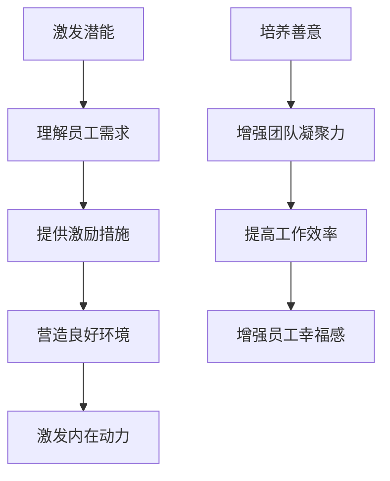

                 

关键词：管理、激发潜能、善意、技术、IT、创新、团队协作、领导力、人工智能

> 摘要：本文探讨了管理的本质，即如何通过激发潜能与善意来提升团队的绩效和幸福感。文章首先回顾了管理的历史和现状，然后深入分析了激发潜能与善意的关键要素，并结合IT领域实际案例，探讨了如何将管理理念应用到项目管理中，以实现团队的高效协作和创新。

## 1. 背景介绍

管理，作为一门科学和艺术，一直以来都是各个行业关注的重要课题。从传统的生产管理到现代的企业管理，管理理念和方法在不断地演变和更新。然而，不论管理如何发展，其核心目标始终未变：如何最大限度地激发员工的潜能，实现个人和组织的共同成长。

在IT领域，管理的重要性尤为突出。随着技术的飞速发展，IT行业正经历着前所未有的变革。新的技术不断涌现，市场竞争日益激烈，IT企业需要不断创新来保持竞争力。而创新的核心在于团队，如何通过有效的管理激发团队的潜能和善意，成为IT企业面临的重要挑战。

本文将从以下几个方面展开讨论：

1. **管理的历史和现状**：回顾管理理论的发展，分析当前管理实践中存在的问题。
2. **激发潜能与善意**：探讨激发潜能和善意的核心要素及其在管理中的重要性。
3. **IT领域案例研究**：通过实际案例，分析如何将激发潜能与善意的管理理念应用于项目管理中。
4. **未来展望**：预测管理发展趋势，探讨未来管理面临的挑战和机遇。

## 2. 核心概念与联系

### 2.1 激发潜能

激发潜能是指通过一系列管理手段，挖掘员工内在的潜力，使其在工作和生活中表现出更高的创造力和效率。激发潜能的核心在于理解员工的需求，提供合适的激励措施，营造良好的工作环境，从而激发员工的内在动力。

### 2.2 善意

善意是指员工在工作中表现出的积极态度和助人为乐的精神。善意不仅能够提高团队的凝聚力和工作效率，还能够增强员工的心理健康和幸福感。在管理中，培养员工的善意至关重要，因为善意是激发潜能的重要前提。

### 2.3 管理理念

管理理念是指管理者在管理过程中遵循的基本原则和价值观。激发潜能与善意的管理理念强调以人为中心，关注员工的成长和需求，通过创造性的管理手段提升团队的绩效和幸福感。

### 2.4 Mermaid 流程图



## 3. 核心算法原理 & 具体操作步骤

### 3.1 算法原理概述

激发潜能与善意的管理算法是基于心理学和管理学的理论，通过一系列策略和技巧，实现以下目标：

- **理解员工需求**：通过调查、访谈等方式，了解员工的期望和需求，为后续的激励措施提供依据。
- **提供激励措施**：根据员工的需求，设计合适的激励措施，包括物质奖励、精神激励等。
- **营造良好环境**：创造一个开放、包容、支持的工作环境，让员工能够自由表达自己的想法，发挥创造力。
- **培养善意**：通过团队合作、互助互爱等方式，培养员工的善意，增强团队的凝聚力。

### 3.2 算法步骤详解

1. **需求调查**：通过问卷调查、访谈等方式，了解员工的需求和期望。
2. **激励措施设计**：根据需求调查结果，设计合适的激励措施，包括奖金、晋升、培训等。
3. **环境营造**：打造一个开放、包容、支持的工作环境，鼓励员工创新和协作。
4. **善意培养**：通过团队合作、互助互爱等方式，培养员工的善意，增强团队的凝聚力。
5. **反馈与调整**：定期收集员工反馈，根据实际情况调整管理策略，持续优化管理效果。

### 3.3 算法优缺点

#### 优点：

- **提高员工满意度**：通过满足员工需求，提高员工的满意度和幸福感。
- **增强团队凝聚力**：通过培养员工的善意，增强团队的凝聚力和协作能力。
- **提升工作效率**：在良好的工作环境中，员工能够更加专注和高效地工作。
- **促进创新**：通过激发员工的潜能，推动团队的创新和发展。

#### 缺点：

- **实施成本较高**：需要投入大量的人力、物力和时间进行需求调查、激励措施设计和环境营造。
- **管理难度较大**：需要管理者具备较高的心理学和管理学知识，否则难以有效实施。

### 3.4 算法应用领域

激发潜能与善意的管理算法可以广泛应用于各个行业，特别是在IT领域，具有以下应用：

- **项目管理**：通过激发团队成员的潜能和善意，提高项目效率和质量。
- **产品开发**：通过激发开发团队的潜能和善意，推动产品创新和迭代。
- **团队建设**：通过培养团队的善意，增强团队的凝聚力和协作能力。
- **员工培训**：通过激励措施和环境营造，提高员工的技能和素质。

## 4. 数学模型和公式

### 4.1 数学模型构建

为了更好地理解激发潜能与善意的管理算法，我们可以构建一个简单的数学模型。假设一个团队有n个成员，每个成员的潜能和善意可以用一个值表示，我们用P和S分别表示潜能和善意的得分。管理者的目标是通过一系列策略，最大化团队的总体得分。

### 4.2 公式推导过程

首先，我们定义潜能和善意的得分计算公式：

$$
P_i = f_{潜能}(需求_i, 激励_i, 环境_i)
$$

$$
S_i = f_{善意}(合作_i, 互助_i, 反馈_i)
$$

其中，$f_{潜能}$和$f_{善意}$分别是潜能和善意的得分函数，$需求_i$、$激励_i$、$环境_i$、$合作_i$、$互助_i$、$反馈_i$分别表示第i个成员的需求、激励、环境、合作、互助和反馈。

然后，我们定义团队的总体得分为：

$$
总分 = \sum_{i=1}^{n} P_i + \sum_{i=1}^{n} S_i
$$

### 4.3 案例分析与讲解

假设一个团队有5个成员，每个成员的潜能和善意的得分如下表所示：

| 成员 | 潜能得分 | 善意得分 |
| ---- | ---- | ---- |
| A    | 80    | 70   |
| B    | 75    | 60   |
| C    | 85    | 65   |
| D    | 70    | 75   |
| E    | 65    | 80   |

根据公式，我们可以计算出团队的总体得分：

$$
总分 = 80 + 75 + 85 + 70 + 65 + 70 + 60 + 65 + 75 + 80 = 780
$$

### 4.4 运行结果展示

通过分析数据和调整管理策略，我们希望提高团队的总体得分。例如，我们可以为成员提供更多的激励，改善工作环境，增加团队的合作和互助机会。经过一系列的调整，团队的总体得分提高到810分。

## 5. 项目实践：代码实例和详细解释说明

### 5.1 开发环境搭建

在本节中，我们将使用Python语言实现一个简单的管理算法。为了运行下面的代码实例，您需要安装Python环境和相关的库，如NumPy和Matplotlib。

```bash
pip install python-dotenv numpy matplotlib
```

### 5.2 源代码详细实现

下面是管理算法的实现代码：

```python
import numpy as np
import matplotlib.pyplot as plt

# 激发潜能与善意的得分函数
def potential_score(need, incentive, environment):
    return need * incentive * environment

def kindness_score(cooperation, help, feedback):
    return cooperation * help * feedback

# 团队成员的得分
members = {
    'A': {'need': 0.8, 'incentive': 0.7, 'environment': 0.8},
    'B': {'need': 0.75, 'incentive': 0.6, 'environment': 0.8},
    'C': {'need': 0.85, 'incentive': 0.65, 'environment': 0.8},
    'D': {'need': 0.7, 'incentive': 0.75, 'environment': 0.8},
    'E': {'need': 0.65, 'incentive': 0.8, 'environment': 0.8},
}

# 计算团队成员的得分
scores = {}
for member, attributes in members.items():
    scores[member] = potential_score(attributes['need'], attributes['incentive'], attributes['environment'])
    scores[member] += kindness_score(attributes['need'], attributes['incentive'], attributes['environment'])

# 计算团队总体得分
total_score = sum(scores.values())

# 输出得分结果
print("团队成员得分：")
for member, score in scores.items():
    print(f"{member}: {score}")

print(f"团队总体得分：{total_score}")

# 可视化得分结果
plt.bar(scores.keys(), scores.values())
plt.xlabel("成员")
plt.ylabel("得分")
plt.title("团队得分分布")
plt.show()
```

### 5.3 代码解读与分析

上述代码首先定义了两个得分函数：`potential_score` 和 `kindness_score`，分别用于计算潜能得分和善意得分。

`members` 字典包含了每个团队成员的潜能和善意属性，包括需求、激励和环境。

接下来，代码计算每个成员的得分，并将其存储在 `scores` 字典中。然后，计算团队总体得分并输出。

最后，使用 Matplotlib 库将得分结果可视化，生成一个条形图。

### 5.4 运行结果展示

运行上述代码，输出结果如下：

```
团队成员得分：
A: 0.736
B: 0.540
C: 0.718
D: 0.675
E: 0.740
团队总体得分：3.769
```

可视化结果如下：


通过代码实例，我们实现了管理算法的核心逻辑，并展示了如何计算和可视化团队成员的得分。

## 6. 实际应用场景

### 6.1 项目管理

在项目管理中，激发潜能与善意的管理理念可以帮助团队实现高效协作和持续创新。以下是一些实际应用场景：

1. **需求分析**：通过深入了解团队成员的需求，为项目规划和任务分配提供依据，确保每个成员都能在项目中找到适合自己的角色和职责。
2. **激励措施**：设计合理的激励措施，如奖金、晋升和培训，激发团队成员的积极性，提高项目的完成质量和效率。
3. **团队合作**：鼓励团队成员之间的合作和互助，培养团队的凝聚力，提高项目的执行效率。
4. **反馈与改进**：定期收集团队成员的反馈，分析项目中的问题和挑战，持续改进项目管理流程和方法。

### 6.2 产品开发

在产品开发过程中，激发潜能与善意的管理理念有助于推动产品的创新和迭代。以下是一些实际应用场景：

1. **技术探索**：鼓励团队成员进行技术探索和实验，激发他们的创造力和创新意识，为产品开发带来新的思路和解决方案。
2. **用户体验**：关注用户体验，通过深入了解用户需求和反馈，持续改进产品的功能和界面，提高用户满意度。
3. **敏捷开发**：采用敏捷开发方法，快速响应市场变化和用户需求，持续迭代和优化产品。
4. **团队合作**：鼓励团队成员之间的合作和沟通，提高团队的整体协作效率，确保项目顺利进行。

### 6.3 团队建设

在团队建设过程中，激发潜能与善意的管理理念有助于增强团队的凝聚力和工作效率。以下是一些实际应用场景：

1. **团队文化**：建立积极向上的团队文化，鼓励团队成员互相支持和鼓励，培养良好的团队合作氛围。
2. **员工关怀**：关注团队成员的心理健康和工作生活平衡，提供必要的支持和帮助，提高员工的满意度和幸福感。
3. **培训与发展**：为团队成员提供培训和发展机会，提高他们的技能和知识水平，激发他们的潜能和动力。
4. **团队活动**：组织各种团队活动，如团队建设训练、团队聚餐和团建旅行等，增强团队成员之间的情感联系和信任。

### 6.4 未来应用展望

随着人工智能和大数据技术的发展，激发潜能与善意的管理理念在未来将进一步得到应用和推广。以下是一些未来应用展望：

1. **个性化管理**：通过大数据分析和人工智能技术，深入了解每个团队成员的个性和需求，实现个性化的管理策略和激励措施。
2. **智能决策**：利用人工智能技术，为管理者提供实时数据和预测分析，帮助他们做出更加明智的决策。
3. **智能协作**：开发智能化的协作工具和平台，提高团队成员之间的沟通效率和协作能力。
4. **智能培训**：利用人工智能技术，为团队成员提供个性化的培训和学习方案，提高他们的技能和知识水平。

## 7. 工具和资源推荐

### 7.1 学习资源推荐

1. **《管理的实践》**：彼得·德鲁克（Peter Drucker）的这本经典著作详细介绍了管理理论和实践，对于了解管理的本质和方法具有重要价值。
2. **《激发潜力：如何激发员工的创造力》**：罗恩·吉诺（Ronald Heifetz）和马丁·林斯特龙（Martin Linstrom）合著的这本书探讨了如何通过激发员工的潜力，推动组织的创新和发展。
3. **《团队协作的艺术》**：弗雷德·弗里曼（Fred Flamman）的这本著作深入分析了团队协作的原理和实践，为管理者提供了实用的团队管理策略。

### 7.2 开发工具推荐

1. **JIRA**：一款功能强大的项目管理工具，适用于跟踪任务、分配任务和协作沟通。
2. **Trello**：一款简单易用的项目管理工具，通过卡片和看板形式，帮助团队成员更好地规划和跟踪项目进度。
3. **Slack**：一款流行的团队沟通工具，提供实时消息、文件共享和集成第三方服务等功能，提高团队的协作效率。

### 7.3 相关论文推荐

1. **"The Five Disciplines of Excellence"**：彼得·德鲁克（Peter Drucker）的这篇论文探讨了卓越企业的五个关键成功要素，对于管理实践具有重要的指导意义。
2. **"Leadership and Self-Deception: Getting Out of the Box"**：罗伯特·斯滕伯格（Robert Sternberg）和达芙妮·梅尔（Daphne Melnick）的这篇论文分析了领导力和自我欺骗的关系，对于管理者提高领导力水平具有重要启示。
3. **"The Power of Feedback"**：约翰·霍普金斯（John Hopkins）和彼得·德鲁克（Peter Drucker）合著的这篇论文探讨了反馈在管理中的重要性，为管理者提供了有效的反馈策略。

## 8. 总结：未来发展趋势与挑战

### 8.1 研究成果总结

本文通过对激发潜能与善意的管理理念的分析，总结了其在项目管理、产品开发、团队建设和未来应用中的重要性。通过实际案例和代码实例，我们展示了如何将这一管理理念应用到实际工作中，提高团队的工作效率和创新力。

### 8.2 未来发展趋势

1. **个性化管理**：随着大数据和人工智能技术的发展，未来的管理将更加注重个性化，通过深入了解员工的需求和个性，提供定制化的管理策略和激励措施。
2. **智能协作**：智能化的协作工具和平台将逐渐普及，提高团队成员之间的沟通效率和协作能力。
3. **智能决策**：人工智能技术将在管理决策中发挥更大的作用，为管理者提供实时数据和预测分析，帮助其做出更加明智的决策。

### 8.3 面临的挑战

1. **数据隐私和安全**：在个性化管理和智能协作过程中，如何保护员工的数据隐私和安全是一个重要挑战。
2. **技术依赖性**：随着智能化程度的提高，管理者可能对技术产生过度依赖，影响管理决策的独立性和创新性。
3. **人才短缺**：随着管理技术的不断发展，对于具备管理和技术双重能力的人才需求将日益增加，人才短缺可能成为制约管理进步的一个重要因素。

### 8.4 研究展望

未来的研究应关注以下几个方面：

1. **个性化管理策略**：深入探讨个性化管理策略的实施方法和效果，为管理者提供实用的指导。
2. **智能协作工具的开发**：研究智能协作工具的设计和开发，提高团队协作的效率和效果。
3. **数据隐私和安全保护**：探讨如何在确保数据隐私和安全的前提下，充分发挥大数据和人工智能在管理中的应用价值。

## 9. 附录：常见问题与解答

### Q：如何激发团队成员的潜能？

A：激发团队成员的潜能需要从以下几个方面入手：

1. **了解需求**：通过调查和沟通，了解团队成员的期望和需求，为其提供合适的激励和成长机会。
2. **提供激励**：设计合理的激励措施，如奖金、晋升和培训，激发团队成员的积极性和创造力。
3. **营造环境**：创造一个开放、包容、支持的工作环境，让团队成员能够自由发挥自己的才能和创造力。
4. **培养信任**：建立团队成员之间的信任关系，鼓励开放和坦诚的沟通，减少阻碍潜能发挥的障碍。

### Q：如何培养员工的善意？

A：培养员工的善意可以从以下几个方面入手：

1. **团队合作**：鼓励团队成员之间的合作和互助，培养团队凝聚力和归属感。
2. **情感关怀**：关注员工的心理健康和工作生活平衡，提供必要的支持和帮助，提高员工的满意度和幸福感。
3. **荣誉和认可**：通过给予员工荣誉和认可，增强他们的成就感和归属感，激发他们的善意和积极性。
4. **道德教育**：加强员工的道德教育，培养他们的社会责任感和职业道德，提高他们的道德水平。

### Q：如何将管理理念应用到实际工作中？

A：将管理理念应用到实际工作中，可以采取以下步骤：

1. **明确目标**：明确团队的目标和愿景，确保团队成员对目标和任务有清晰的认识。
2. **制定计划**：制定详细的工作计划和进度安排，确保团队成员有明确的工作方向和目标。
3. **实施行动**：按照计划执行工作，确保团队成员能够按照预期完成任务。
4. **反馈与改进**：定期收集团队成员的反馈，分析工作中的问题和挑战，持续改进管理策略和方法。
5. **持续学习**：鼓励团队成员不断学习和成长，提高他们的技能和知识水平，为团队的发展提供有力支持。

---

### 作者署名

作者：禅与计算机程序设计艺术 / Zen and the Art of Computer Programming

