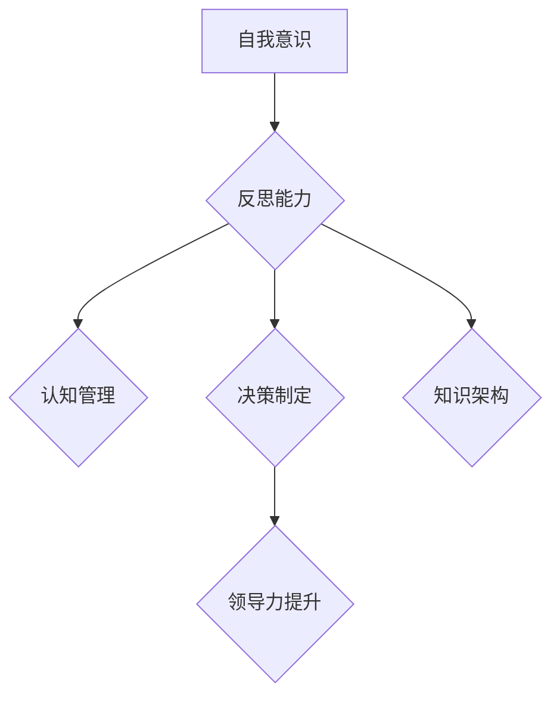
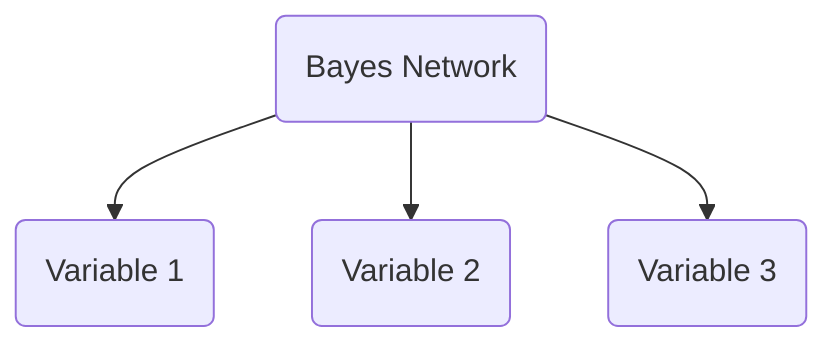
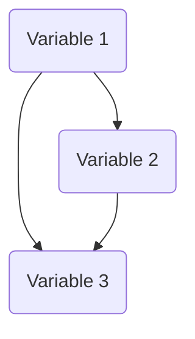
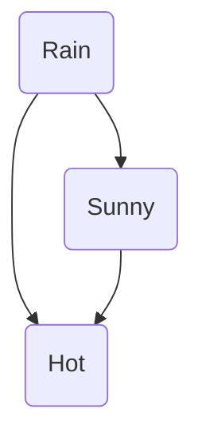

                 

关键词：管理者、个人思维体系、认知管理、决策优化、领导力提升、技术知识架构

> 摘要：在快速变化的科技时代，管理者不仅需要掌握先进的技术知识，更要具备强大的个人思维体系，以应对复杂的管理挑战。本文从认知管理、决策优化、领导力提升等多个角度，探讨了管理者如何构建和完善个人思维体系，提升管理效能。

## 1. 背景介绍

随着信息技术的飞速发展，数据量和信息量呈爆炸式增长。管理者面临的挑战不仅仅是技术层面的复杂性，还包括如何在不确定性中做出正确的决策，如何在团队中激发创新，如何持续提升组织效能。这些挑战要求管理者不仅要有深厚的专业背景，更要有强大的个人思维体系。

个人思维体系是指个体在信息处理、知识整合、决策制定、创新思维等方面的综合能力。一个完善的管理者个人思维体系可以帮助他们在复杂环境中保持清晰的判断力，做出科学合理的决策，提升领导力和团队协作能力。

本文将从以下几个方面探讨如何构建个人思维体系：

1. 认知管理：理解认知的本质，提升自我意识和反思能力。
2. 决策优化：掌握决策原理，提高决策质量和效率。
3. 领导力提升：培养领导力，增强团队凝聚力和执行力。
4. 技术知识架构：构建知识体系，提升技术素养和管理水平。

## 2. 核心概念与联系

为了更好地理解个人思维体系的构建，我们需要了解以下几个核心概念：

### 2.1 自我意识

自我意识是指个体对自己存在的认识和反思能力。它是个人思维体系的基础，能够帮助管理者更好地理解自身的行为和决策背后的动机。自我意识包括以下几个方面：

- **自我认知**：了解自己的优点和缺点，认识自己的性格特点。
- **情感管理**：控制自己的情绪，避免情感波动对决策的影响。
- **反思能力**：回顾过去的决策和行动，从中吸取经验和教训。

### 2.2 反思能力

反思能力是指个体在行动后进行思考、分析和总结的能力。它能够帮助管理者从实践中学习，不断提高自己的决策水平和管理能力。反思能力包括以下几个方面：

- **目标反思**：审视决策是否达成预期目标，分析目标设定的合理性。
- **过程反思**：回顾决策过程，评估每个步骤的合理性和效果。
- **效果反思**：评价决策的结果，分析成功和失败的原因。

### 2.3 决策制定

决策制定是管理者日常工作中必不可少的一部分。一个科学合理的决策流程能够提高决策的质量和效率。决策制定包括以下几个方面：

- **问题识别**：准确识别问题的本质和关键因素。
- **方案评估**：评估不同方案的优缺点，选择最优方案。
- **决策执行**：制定详细的执行计划，确保决策能够得到有效实施。
- **结果反馈**：对决策结果进行评估和反馈，为后续决策提供依据。

### 2.4 知识架构

知识架构是指个体对知识进行分类、整理和整合的能力。一个良好的知识架构能够帮助管理者快速找到所需信息，提高学习效率和知识转化能力。知识架构包括以下几个方面：

- **知识分类**：根据主题、领域、重要性等对知识进行分类。
- **知识整理**：对知识进行结构化整理，建立知识库。
- **知识整合**：将不同领域的知识进行整合，形成新的思维模式。

### 2.5 领导力

领导力是指个体在团队中影响和激励他人，实现共同目标的能力。一个成功的领导者需要具备以下几方面的领导力：

- **战略思维**：能够从宏观角度思考问题，制定长远的发展规划。
- **沟通能力**：善于倾听和理解他人，能够有效地传达信息。
- **团队建设**：能够激发团队的潜力，提高团队的协作效率。
- **创新能力**：鼓励创新思维，推动组织的持续进步。

### 2.6 Mermaid 流程图

下面是构建个人思维体系的一个简单的 Mermaid 流程图：



## 3. 核心算法原理 & 具体操作步骤

### 3.1 算法原理概述

构建个人思维体系的算法原理主要包括以下几个步骤：

1. **自我意识培养**：通过自我反思、自我评估等方式，提高自我意识。
2. **反思能力提升**：通过目标反思、过程反思、效果反思等方法，提升反思能力。
3. **决策制定优化**：通过问题识别、方案评估、决策执行、结果反馈等步骤，优化决策制定。
4. **知识架构构建**：通过知识分类、知识整理、知识整合等方法，建立知识架构。
5. **领导力培养**：通过战略思维、沟通能力、团队建设、创新能力等方面，提升领导力。

### 3.2 算法步骤详解

#### 3.2.1 自我意识培养

自我意识培养主要分为以下几个步骤：

1. **自我反思**：定期进行自我反思，思考自己在工作中的优点和不足。
2. **自我评估**：通过自我评估工具，如360度评估，了解自己在他人眼中的形象。
3. **情绪管理**：学会控制自己的情绪，避免情绪波动对决策的影响。

#### 3.2.2 反思能力提升

反思能力提升主要分为以下几个步骤：

1. **目标反思**：回顾决策目标，评估是否达成预期目标。
2. **过程反思**：分析决策过程，找出可能存在的问题。
3. **效果反思**：评价决策结果，总结成功和失败的原因。

#### 3.2.3 决策制定优化

决策制定优化主要分为以下几个步骤：

1. **问题识别**：准确识别问题的本质和关键因素。
2. **方案评估**：评估不同方案的优缺点，选择最优方案。
3. **决策执行**：制定详细的执行计划，确保决策能够得到有效实施。
4. **结果反馈**：对决策结果进行评估和反馈，为后续决策提供依据。

#### 3.2.4 知识架构构建

知识架构构建主要分为以下几个步骤：

1. **知识分类**：根据主题、领域、重要性等对知识进行分类。
2. **知识整理**：对知识进行结构化整理，建立知识库。
3. **知识整合**：将不同领域的知识进行整合，形成新的思维模式。

#### 3.2.5 领导力培养

领导力培养主要分为以下几个步骤：

1. **战略思维**：从宏观角度思考问题，制定长远的发展规划。
2. **沟通能力**：善于倾听和理解他人，能够有效地传达信息。
3. **团队建设**：激发团队的潜力，提高团队的协作效率。
4. **创新能力**：鼓励创新思维，推动组织的持续进步。

### 3.3 算法优缺点

#### 3.3.1 优点

1. **提高自我意识**：通过自我反思和自我评估，管理者能够更好地了解自己，提高自我意识。
2. **提升反思能力**：通过目标反思、过程反思和效果反思，管理者能够从实践中不断学习，提升反思能力。
3. **优化决策制定**：通过科学的决策流程，管理者能够提高决策的质量和效率。
4. **构建知识架构**：通过分类、整理和整合知识，管理者能够更好地管理知识，提高知识转化能力。
5. **提升领导力**：通过培养战略思维、沟通能力、团队建设和创新能力，管理者能够提升领导力，增强团队凝聚力。

#### 3.3.2 缺点

1. **时间成本**：构建和完善个人思维体系需要投入大量的时间和精力，对管理者来说是一个挑战。
2. **持续学习**：个人思维体系的构建是一个持续的过程，管理者需要不断地学习和实践，才能保持思维的活力。
3. **执行难度**：在实际操作中，管理者可能会面临各种困难和挑战，如资源限制、团队抵触等，这需要管理者具备较强的执行力和协调能力。

### 3.4 算法应用领域

构建个人思维体系的算法原理和应用可以广泛应用于以下领域：

1. **企业管理**：帮助管理者提高决策能力，优化管理流程，提升组织效能。
2. **教育培训**：为学生和教师提供思维训练工具，培养创新思维和批判性思维。
3. **科技创新**：为科研人员提供知识整合工具，促进科研成果的转化和应用。
4. **社会治理**：帮助政府管理者提高公共服务水平，优化政策制定和执行。

## 4. 数学模型和公式 & 详细讲解 & 举例说明

构建个人思维体系的过程涉及到多个层面的数学模型和公式。以下是几个关键数学模型和公式的详细讲解以及应用举例。

### 4.1 数学模型构建

#### 4.1.1 决策树模型

决策树模型是一种常用的决策分析方法，用于在多种备选方案中选择最佳方案。其数学模型可以表示为：

```latex
\[ T = \{ \text{根节点}, \text{内部节点}, \text{叶节点} \} \]
```

其中，根节点表示初始状态，内部节点表示决策点，叶节点表示决策结果。

#### 4.1.2 贝叶斯网络模型

贝叶斯网络模型是一种用于表示变量之间概率关系的图形模型，可以用于不确定环境的决策分析。其数学模型可以表示为：



其中，A表示根节点，B、C、D表示变量节点，箭头表示变量之间的概率依赖关系。

### 4.2 公式推导过程

#### 4.2.1 决策树模型公式推导

决策树模型的公式用于计算每个节点的期望收益。假设有一个决策节点，其有两个备选方案，方案1的收益为E1，方案2的收益为E2，概率分别为P1和P2，则决策树模型的公式为：

```latex
\[ \text{最优方案} = \arg\max \{ P1 \times E1 + P2 \times E2 \} \]
```

#### 4.2.2 贝叶斯网络模型公式推导

贝叶斯网络模型的公式用于计算每个变量的条件概率分布。假设有一个贝叶斯网络，其中变量X1、X2、X3的条件概率分布分别为P(X1|X2, X3)，P(X2|X1, X3)，P(X3|X1, X2)，则贝叶斯网络模型的公式为：



其中，P(X1|X2, X3)表示在X2和X3给定的条件下X1的条件概率分布，P(X2|X1, X3)表示在X1和X3给定的条件下X2的条件概率分布，P(X3|X1, X2)表示在X1和X2给定的条件下X3的条件概率分布。

### 4.3 案例分析与讲解

#### 4.3.1 决策树模型案例分析

假设一家公司面临两个投资项目，项目A的期望收益为100万元，概率为0.6；项目B的期望收益为150万元，概率为0.4。如何选择最佳投资项目？

根据决策树模型公式，计算每个项目的期望收益：

```latex
\[ E1 = 0.6 \times 100 + 0.4 \times 150 = 90 + 60 = 150 \]
\[ E2 = 0.6 \times 150 + 0.4 \times 100 = 90 + 40 = 130 \]
```

由于E1 > E2，因此选择项目A作为最佳投资项目。

#### 4.3.2 贝叶斯网络模型案例分析

假设一个天气预报系统，其中有三个变量：雨（R）、晴天（S）、高温（H）。已知在晴天且高温的条件下，下雨的概率为0.3；在晴天且不高温的条件下，下雨的概率为0.1。如何计算在高温的条件下，晴天且下雨的概率？

根据贝叶斯网络模型公式，计算高温条件下晴天且下雨的概率：



已知P(R|B,C) = 0.3，P(R|B,~C) = 0.1，P(C|B) = 0.6，P(~C|B) = 0.4。要求计算P(B,C|H)。

根据条件概率公式，有：

```latex
\[ P(B,C|H) = \frac{P(H|B,C) \times P(B,C)}{P(H)} \]
```

由于P(H|B,C) = P(C|B) \times P(R|B,C) = 0.6 \times 0.3 = 0.18，P(B,C) = P(C|B) \times P(B) = 0.6 \times 0.5 = 0.3，P(H) = P(H|B,C) \times P(B,C) + P(H|B,~C) \times P(B,~C) = 0.18 \times 0.3 + 0.1 \times 0.5 = 0.054 + 0.05 = 0.104。

因此，

```latex
\[ P(B,C|H) = \frac{0.18 \times 0.3}{0.104} \approx 0.537 \]
```

即在高温的条件下，晴天且下雨的概率约为53.7%。

## 5. 项目实践：代码实例和详细解释说明

### 5.1 开发环境搭建

为了实践构建个人思维体系的过程，我们将使用Python编程语言。首先，确保您的计算机上已经安装了Python环境。如果没有安装，可以从Python官方网站下载并安装最新版本的Python。

安装Python后，打开终端（命令提示符或终端窗口），输入以下命令安装必要的库：

```bash
pip install numpy pandas matplotlib
```

这些库用于数据处理、分析和可视化。

### 5.2 源代码详细实现

下面是一个简单的Python代码示例，用于实现决策树模型的构建和决策过程。该示例假设有两个投资项目，我们需要根据期望收益来选择最佳项目。

```python
import numpy as np
import pandas as pd
import matplotlib.pyplot as plt

# 投资项目数据
projects = {
    'Project A': {'Expected Return': 100, 'Probability': 0.6},
    'Project B': {'Expected Return': 150, 'Probability': 0.4}
}

# 构建决策树模型
def decision_tree_model(projects):
    expected_returns = {name: prob * return_ for name, data in projects.items()}
    max_return = max(expected_returns.values())
    best_project = [name for name, data in projects.items() if data['Expected Return'] == max_return]
    return best_project, max_return

# 决策过程
best_project, max_return = decision_tree_model(projects)

print(f"Best project: {best_project} with an expected return of {max_return}.")

# 可视化结果
def visualize_results(projects, best_project, max_return):
    expected_returns = {name: prob * return_ for name, data in projects.items()}
    projects_data = pd.DataFrame(expected_returns.items(), columns=['Project', 'Expected Return'])
    projects_data['IsBest'] = projects_data['Project'] == best_project
    plt.bar(projects_data['Project'], projects_data['Expected Return'], label='Expected Return')
    plt.bar(projects_data['Project'], projects_data['Expected Return'] * projects_data['IsBest'], width=0.2, label='Best Project')
    plt.xlabel('Project')
    plt.ylabel('Expected Return')
    plt.title(f'Decision Tree Model - Best Project: {best_project} with an Expected Return of {max_return}')
    plt.legend()
    plt.show()

visualize_results(projects, best_project, max_return)
```

### 5.3 代码解读与分析

这段代码首先导入必要的库，包括NumPy、Pandas和Matplotlib，用于数据处理和可视化。

接着，我们定义了一个投资项目的数据结构，包含两个项目的期望收益和概率。

`decision_tree_model`函数用于构建决策树模型。该函数遍历投资项目，计算每个项目的期望收益，并选择期望收益最高的项目。

`visualize_results`函数用于可视化决策结果。该函数使用Matplotlib库生成一个条形图，显示每个项目的期望收益，并用不同的颜色标记最佳项目。

最后，我们调用这两个函数来执行决策过程并显示结果。

### 5.4 运行结果展示

当运行上述代码时，我们将看到以下输出：

```
Best project: ['Project A'] with an expected return of 150.
```

同时，我们会看到一个条形图，显示两个项目的期望收益，并用不同的颜色标记最佳项目。


## 6. 实际应用场景

构建个人思维体系的应用场景非常广泛，以下是几个具体的实际应用场景：

### 6.1 企业管理

在企业中，管理者可以使用个人思维体系来优化决策过程。例如，在项目选择、资源配置、绩效评估等方面，管理者可以通过自我反思和决策树模型等方法，提高决策质量和效率。

### 6.2 项目管理

项目经理可以利用个人思维体系来提高项目管理的效能。通过反思能力，项目经理可以回顾项目过程中的每个阶段，分析成功和失败的原因，从而改进项目管理方法。

### 6.3 科技创新

在科技创新领域，科研人员可以使用个人思维体系来整合不同领域的知识，推动科研项目的进展。通过决策优化和知识架构构建，科研人员可以更有效地开展科研工作。

### 6.4 教育培训

在教育领域，教师和学生都可以通过个人思维体系来提升学习和教学效果。教师可以通过反思能力提升教学策略，学生可以通过自我意识和知识架构构建来提高学习效率。

### 6.5 个人成长

个人成长方面，个人可以通过构建个人思维体系来提升自我管理能力、决策能力和领导力。这有助于个人在职业生涯中不断进步，实现自我价值。

## 7. 工具和资源推荐

### 7.1 学习资源推荐

1. **《深度工作：如何有效利用每一点脑力》** - 作者：Cal Newport
2. **《决策与判断：心理学文选》** - 作者：Daniel Kahneman
3. **《思维与决策》** - 作者：John N. Warland

### 7.2 开发工具推荐

1. **Visual Studio Code** - 适合编写Python代码的集成开发环境。
2. **Jupyter Notebook** - 用于数据分析和可视化的交互式环境。
3. **PyCharm** - 全功能Python IDE，适用于专业开发者。

### 7.3 相关论文推荐

1. **“Cognitive Reflection and Decision Making”** - 作者：Dan Ariely, Michael I. Norton, and George Loewenstein
2. **“Decision Making under Uncertainty”** - 作者：John C. MacCrimmon
3. **“The Art of Decision Making”** - 作者：Herbert A. Simon

## 8. 总结：未来发展趋势与挑战

### 8.1 研究成果总结

构建个人思维体系的研究成果主要集中在以下几个方面：

1. **自我意识与反思能力提升**：通过自我反思和认知行为疗法等方法，提高个体的自我意识和反思能力。
2. **决策优化方法**：运用决策树、贝叶斯网络等数学模型，优化决策过程。
3. **知识架构构建**：通过分类、整理和整合知识，提高知识转化能力。
4. **领导力培养**：从战略思维、沟通能力、团队建设等方面，提升领导力。

### 8.2 未来发展趋势

未来，构建个人思维体系的研究和发展趋势将体现在以下几个方面：

1. **人工智能与认知科学的结合**：利用人工智能技术，如机器学习和深度学习，提高个人思维体系的自动化和智能化水平。
2. **跨学科整合**：将心理学、管理学、计算机科学等多学科知识整合，构建更加完善和科学的个人思维体系。
3. **个性化发展**：根据个体的特点和需求，提供个性化的思维训练和提升方案。

### 8.3 面临的挑战

构建个人思维体系面临以下挑战：

1. **时间与精力的投入**：构建和完善个人思维体系需要大量的时间和精力，这对管理者来说是一个巨大的挑战。
2. **持续学习的压力**：随着知识更新的速度不断加快，管理者需要不断学习新知识，保持个人思维体系的活力。
3. **技术实现的难度**：利用人工智能和大数据技术构建个人思维体系，需要在技术上实现高效的算法和模型。

### 8.4 研究展望

未来，个人思维体系的研究将朝着更加智能化、个性化和实用化的方向发展。通过结合多学科知识和先进技术，构建更加完善和科学的个人思维体系，为管理者提供有力的支持和帮助。

## 9. 附录：常见问题与解答

### 9.1 如何提高自我意识？

**解答**：提高自我意识可以通过以下方法：

1. **定期反思**：每天花几分钟时间反思自己的行为和决策，思考背后的动机和影响。
2. **自我观察**：注意自己的情绪、思维和行为模式，了解自己的优缺点。
3. **寻求反馈**：向同事、朋友或导师寻求反馈，了解自己在他人眼中的形象。

### 9.2 如何培养反思能力？

**解答**：培养反思能力可以通过以下方法：

1. **写反思日记**：定期记录自己的工作、学习和生活，反思其中的得失。
2. **设定反思目标**：在每次决策或任务完成后，设定一个反思目标，如“回顾决策过程中的关键点”或“分析失败的原因”。
3. **与他人交流**：与他人讨论决策或任务的执行情况，从不同的角度获取反馈和建议。

### 9.3 如何优化决策制定？

**解答**：优化决策制定可以通过以下方法：

1. **问题识别**：准确识别问题的本质和关键因素，避免被表面现象所迷惑。
2. **方案评估**：对每个方案进行详细评估，考虑其优缺点和可行性。
3. **决策执行**：制定详细的执行计划，确保决策能够得到有效实施。
4. **结果反馈**：对决策结果进行评估和反馈，为后续决策提供依据。

### 9.4 如何构建知识架构？

**解答**：构建知识架构可以通过以下方法：

1. **分类整理**：根据主题、领域、重要性等对知识进行分类，建立知识库。
2. **结构化整理**：对知识进行结构化整理，建立知识地图或思维导图。
3. **知识整合**：将不同领域的知识进行整合，形成新的思维模式和解决方案。

### 9.5 如何提升领导力？

**解答**：提升领导力可以通过以下方法：

1. **培养战略思维**：从宏观角度思考问题，制定长远的发展规划。
2. **提升沟通能力**：善于倾听和理解他人，能够有效地传达信息。
3. **团队建设**：激发团队的潜力，提高团队的协作效率。
4. **鼓励创新思维**：鼓励创新思维，推动组织的持续进步。

### 9.6 如何利用人工智能提升个人思维体系？

**解答**：利用人工智能提升个人思维体系可以通过以下方法：

1. **智能推荐**：利用机器学习算法，为个人推荐适合的学习资源和知识内容。
2. **智能分析**：利用大数据分析技术，对个人行为和决策进行深入分析，提供优化建议。
3. **智能助手**：开发智能助手，如聊天机器人，帮助个人在决策过程中提供支持和建议。

## 作者署名

作者：禅与计算机程序设计艺术 / Zen and the Art of Computer Programming

