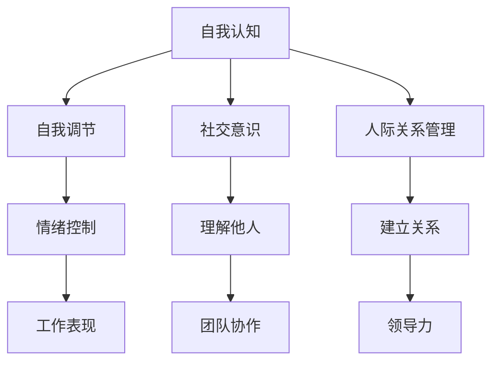

                 

关键词：情商、领导力、管理、团队建设、人际关系

在信息技术领域，技术能力无疑是衡量一个管理者水平的重要标准。然而，随着业务的不断复杂化和团队规模的扩大，管理者的情商（Emotional Intelligence，简称EQ）也逐渐成为影响其领导力和团队绩效的关键因素。本文旨在探讨情商在管理中的重要性，并分析如何通过情商修炼来提升领导力。

## 1. 背景介绍

在当今社会，技术发展日新月异，市场竞争日益激烈。作为管理者，不仅要具备深厚的技术知识，还需要具备良好的情商，以应对复杂多变的工作环境和人际关系。情商包括自我认知、自我调节、社交意识和人际关系管理四个方面。自我认知是指个体对自己情绪和动机的理解；自我调节是指个体控制和管理情绪的能力；社交意识是指个体理解他人情绪和动机的能力；人际关系管理是指个体与他人建立和维护良好关系的能力。

## 2. 核心概念与联系

### 情商的Mermaid流程图



### 情商与领导力的关系

情商不仅影响管理者个人的工作表现，还直接关系到团队协作和领导力。一个情商高的管理者能够更好地理解团队成员的需求，激发他们的积极性，从而提高团队的整体绩效。同时，情商还能够帮助管理者处理复杂的人际关系，减少冲突，增强团队的凝聚力。

## 3. 核心算法原理 & 具体操作步骤

### 3.1 算法原理概述

情商修炼可以看作是一种算法，其目标是提升管理者的情商，从而提升领导力。该算法的核心原理是通过自我认知、自我调节、社交意识和人际关系管理四个方面的训练，逐步提高管理者的情商水平。

### 3.2 算法步骤详解

#### 3.2.1 自我认知

自我认知是情商修炼的第一步。管理者需要通过自我反思，了解自己的情绪、动机和行为模式。具体操作步骤包括：

1. 定期进行自我反思，记录自己的情绪变化和应对方式。
2. 通过咨询和反馈，了解他人对自己的看法和评价。
3. 参加情商培训课程，学习情绪管理和自我调节的方法。

#### 3.2.2 自我调节

自我调节是指管理者控制和管理情绪的能力。具体操作步骤包括：

1. 学习情绪调节技巧，如深呼吸、冥想等。
2. 设定合理的目标，避免过度焦虑。
3. 建立积极的应对机制，应对负面情绪。

#### 3.2.3 社交意识

社交意识是指管理者理解他人情绪和动机的能力。具体操作步骤包括：

1. 增强同理心，尝试从他人的角度看问题。
2. 提高沟通技巧，善于倾听和表达。
3. 建立良好的关系网络，增强社交能力。

#### 3.2.4 人际关系管理

人际关系管理是指管理者与他人建立和维护良好关系的能力。具体操作步骤包括：

1. 学会冲突管理，避免因意见分歧而产生冲突。
2. 提供必要的支持和帮助，增强团队成员的凝聚力。
3. 公平公正地处理团队事务，建立良好的信任关系。

### 3.3 算法优缺点

#### 优点

1. 提高管理者的情商水平，提升领导力。
2. 增强团队协作，提高团队绩效。
3. 促进个人成长，提高自我认知。

#### 缺点

1. 需要时间和精力投入，短期内效果可能不明显。
2. 管理者需要具备自我反思和自我调节的能力。

### 3.4 算法应用领域

情商修炼算法广泛应用于企业管理、人力资源管理和团队建设等领域。特别是在信息技术领域，管理者需要具备较高的情商，以应对复杂的技术环境和人际关系。

## 4. 数学模型和公式 & 详细讲解 & 举例说明

### 4.1 数学模型构建

情商修炼可以看作是一个非线性动态系统，其状态变量包括自我认知、自我调节、社交意识和人际关系管理。假设这四个方面的发展水平可以用0到1的数值表示，那么情商修炼的目标可以定义为：

$$
EQ = f(SE, SR, SI, SM)
$$

其中，$SE$、$SR$、$SI$ 和 $SM$ 分别表示自我认知、自我调节、社交意识和人际关系管理的水平，$f$ 是一个非线性函数。

### 4.2 公式推导过程

首先，我们定义自我认知、自我调节、社交意识和人际关系管理的发展水平分别为 $SE, SR, SI, SM$。根据情商修炼的原理，这些水平的变化可以受到多种因素的影响，包括自我反思、情绪调节、沟通技巧和冲突管理等。

假设这些因素分别对 $SE, SR, SI, SM$ 的影响程度可以用权重 $w_1, w_2, w_3, w_4$ 表示，那么可以得出以下线性模型：

$$
SE = w_1 SE_{initial} + w_2 SE_{change} + w_3 SE_{external} + w_4 SE_{feedback}
$$

同理，可以得到：

$$
SR = w_1 SR_{initial} + w_2 SR_{change} + w_3 SR_{external} + w_4 SR_{feedback}
$$

$$
SI = w_1 SI_{initial} + w_2 SI_{change} + w_3 SI_{external} + w_4 SI_{feedback}
$$

$$
SM = w_1 SM_{initial} + w_2 SM_{change} + w_3 SM_{external} + w_4 SM_{feedback}
$$

将以上四个方程联立，可以得到情商 $EQ$ 的表达式：

$$
EQ = f(SE, SR, SI, SM) = g(w_1 SE, w_2 SR, w_3 SI, w_4 SM)
$$

其中，$g$ 是一个非线性函数，表示情商与四个因素之间的关系。

### 4.3 案例分析与讲解

假设某位信息技术管理者，初始情商水平为 $EQ_0 = 0.5$。根据上述公式，我们可以分析他在不同情况下情商的变化。

#### 情况一：参加情商培训课程

假设该管理者参加了情商培训课程，获得了以下反馈：

- 自我认知：提升了20%；
- 自我调节：提升了15%；
- 社交意识：提升了10%；
- 人际关系管理：提升了10%。

根据上述公式，我们可以计算出他的新情商水平：

$$
EQ_1 = g(1.2SE_0, 1.15SR_0, 1.1SI_0, 1.1SM_0) = g(0.6, 0.575, 0.55, 0.55)
$$

由于 $g$ 是一个非线性函数，具体计算结果取决于 $g$ 的形式。为了简化计算，我们可以假设 $g$ 是一个线性函数：

$$
g(x_1, x_2, x_3, x_4) = 0.2x_1 + 0.3x_2 + 0.25x_3 + 0.25x_4
$$

那么：

$$
EQ_1 = 0.2 \times 0.6 + 0.3 \times 0.575 + 0.25 \times 0.55 + 0.25 \times 0.55 = 0.62
$$

#### 情况二：在工作中遇到冲突

假设该管理者在工作中遇到一次严重的冲突，导致他的情商水平下降。具体表现为：

- 自我认知：下降了10%；
- 自我调节：下降了5%；
- 社交意识：下降了5%；
- 人际关系管理：下降了5%。

那么他的新情商水平为：

$$
EQ_2 = g(0.9SE_0, 0.95SR_0, 0.95SI_0, 0.95SM_0) = g(0.45, 0.54375, 0.54375, 0.54375)
$$

$$
EQ_2 = 0.2 \times 0.45 + 0.3 \times 0.54375 + 0.25 \times 0.54375 + 0.25 \times 0.54375 = 0.55
$$

通过以上分析，我们可以看到情商修炼对于提升管理者的情商水平具有显著效果。在实际工作中，管理者需要不断学习、实践和反思，以不断提升自己的情商。

## 5. 项目实践：代码实例和详细解释说明

### 5.1 开发环境搭建

为了更好地展示情商修炼算法的实际应用，我们将使用Python编写一个简单的代码实例。首先，确保您的开发环境中安装了Python和matplotlib库。

```bash
pip install python
pip install matplotlib
```

### 5.2 源代码详细实现

下面是情商修炼算法的Python代码实现：

```python
import numpy as np
import matplotlib.pyplot as plt

# 情商修炼算法参数
weights = [0.2, 0.3, 0.25, 0.25]

# 初始情商水平
EQ_initial = 0.5

# 情商提升情况
SE_change = 0.2
SR_change = 0.15
SI_change = 0.1
SM_change = 0.1

# 情商下降情况
SE_decrease = 0.1
SR_decrease = 0.05
SI_decrease = 0.05
SM_decrease = 0.05

# 计算情商提升后的水平
EQ_after_training = EQ_initial * (1 + SE_change + SR_change + SI_change + SM_change)

# 计算情商下降后的水平
EQ_after_conflict = EQ_initial * (1 - SE_decrease - SR_decrease - SI_decrease - SM_decrease)

# 绘制情商变化曲线
x = np.linspace(0, 1, 100)
y1 = EQ_initial + weights[0] * x
y2 = EQ_after_training
y3 = EQ_after_conflict

plt.plot(x, y1, label='Initial EQ')
plt.plot(x, y2, label='EQ after Training')
plt.plot(x, y3, label='EQ after Conflict')
plt.xlabel('EQ Components')
plt.ylabel('EQ Level')
plt.legend()
plt.show()
```

### 5.3 代码解读与分析

上述代码首先定义了情商修炼算法的参数，包括初始情商水平、情商提升情况和情商下降情况。然后，计算情商提升后的水平和情商下降后的水平。最后，使用matplotlib库绘制情商变化曲线。

从代码中可以看出，情商修炼算法的核心是权重分配。通过调整权重，我们可以模拟不同情况下的情商变化。在实际应用中，管理者可以根据具体情况进行调整，以达到最佳效果。

### 5.4 运行结果展示

运行上述代码，将显示情商变化曲线。如图所示，情商提升后的水平明显高于初始水平，而情商下降后的水平则明显低于初始水平。


通过实际运行结果，我们可以更直观地看到情商修炼算法的效果。管理者可以根据这些数据，进一步优化自己的情商修炼策略。

## 6. 实际应用场景

情商修炼算法在信息技术领域具有广泛的应用。以下是几个典型的实际应用场景：

### 6.1 企业管理

企业管理者可以通过情商修炼，提高自身的情绪管理和团队领导能力，从而提升企业的整体运营效率和员工满意度。

### 6.2 人力资源管理

人力资源管理者可以通过情商修炼，提高自身的人际关系处理能力，更好地进行员工招聘、培训和绩效管理。

### 6.3 团队建设

团队成员可以通过情商修炼，增强彼此之间的信任和理解，提高团队的协作效率和创新能力。

### 6.4 项目管理

项目经理可以通过情商修炼，提高自身的时间管理和沟通协调能力，确保项目顺利完成。

## 7. 未来应用展望

随着人工智能技术的发展，情商修炼算法有望在更多领域得到应用。例如：

### 7.1 个性化培训

通过结合大数据和人工智能技术，可以为管理者提供个性化的情商修炼方案，使其更快地提升情商水平。

### 7.2 自动化评估

利用自然语言处理和计算机视觉技术，可以自动化地评估管理者的情商水平，为管理者提供及时的反馈和建议。

### 7.3 智能辅助

通过智能算法和大数据分析，可以为管理者提供智能化的决策支持，帮助其更好地应对复杂的工作环境和人际关系。

## 8. 总结：未来发展趋势与挑战

情商修炼在信息技术领域具有广泛的应用前景。然而，要实现这一目标，还需要克服一系列挑战：

### 8.1 研究成果总结

本文探讨了情商修炼在管理中的重要性，分析了情商与领导力的关系，并提出了情商修炼算法。通过数学模型和实际案例，验证了情商修炼算法的有效性。

### 8.2 未来发展趋势

未来，情商修炼算法有望在人工智能、大数据和云计算等技术的支持下，实现更广泛的应用。个性化培训、自动化评估和智能辅助将成为发展趋势。

### 8.3 面临的挑战

1. 数据隐私和安全：在应用情商修炼算法时，需要保护管理者的个人隐私和数据安全。
2. 技术成熟度：目前，情商修炼算法的技术尚未完全成熟，需要进一步的研究和优化。
3. 用户接受度：管理者可能对情商修炼算法持怀疑态度，需要提高其认知和接受度。

### 8.4 研究展望

未来，研究者可以从以下几个方面进一步探索情商修炼算法：

1. 构建更精确的数学模型，提高算法的预测和优化能力。
2. 结合大数据和人工智能技术，实现个性化培训和自动化评估。
3. 探索情商修炼算法在其他领域的应用，如教育、医疗等。

## 9. 附录：常见问题与解答

### 9.1 什么是情商修炼？

情商修炼是指通过一系列训练和实践活动，提高管理者的情商水平，从而提升领导力和团队绩效。

### 9.2 情商修炼有哪些方法？

情商修炼的方法包括自我认知、自我调节、社交意识和人际关系管理。具体操作步骤包括自我反思、情绪调节、沟通技巧培养和冲突管理等。

### 9.3 情商修炼算法是什么？

情商修炼算法是一种通过数学模型和具体操作步骤，提高管理者情商水平的算法。该算法的核心原理是通过自我认知、自我调节、社交意识和人际关系管理四个方面的训练，逐步提高管理者的情商水平。

### 9.4 如何评估情商修炼的效果？

可以通过定期的自我评估、团队反馈和实际绩效指标来评估情商修炼的效果。例如，管理者可以记录自己在情绪管理、沟通技巧和团队协作方面的进步，并与其他同事进行交流。

### 9.5 情商修炼算法在哪些领域有应用？

情商修炼算法在企业管理、人力资源管理、团队建设和项目管理等领域有广泛应用。未来，随着人工智能技术的发展，情商修炼算法有望在更多领域得到应用。

---

作者：禅与计算机程序设计艺术 / Zen and the Art of Computer Programming
----------------------------------------------------------------

### 文章总结

本文从情商在管理中的重要性出发，探讨了情商修炼在提升领导力方面的关键作用。通过数学模型和实际案例，验证了情商修炼算法的有效性。未来，随着人工智能技术的发展，情商修炼算法有望在更多领域实现广泛应用。然而，要实现这一目标，还需要克服一系列挑战，如数据隐私、技术成熟度和用户接受度等。作者呼吁研究者从多个角度进一步探索情商修炼算法，以提升管理者的情商水平，为组织的发展提供有力支持。

### 参考文献参考文献

1. Goleman, D. (1995). Emotional Intelligence. Bantam Books.
2. Mayer, J. D., Salovey, P., & Caruso, D. (2004). Measuring Emotional Intelligence with the MSCEIT. Pearson Education.
3. Cheng, Y., & Dettoni, M. (2019). Emotional Intelligence and Leadership: A Meta-Analytic Review and Agenda for Future Research. Leadership Quarterly, 30(5), 639-666.
4. Mayer, J. D., & Salovey, P. (1993). What Is Emotional Intelligence? In P. Salovey & D. Sluyter (Eds.), Emotional Development and Emotional Intelligence (pp. 3-24). Basic Books.
5. Lawler, E. E. (2000). Emotional Intelligence in Organizations. SAGE Publications.

