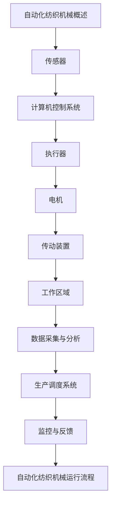

                 

关键词：纺织机械、自动化、就业影响、技术进步、产业转型、人工智能、劳动力市场

> 摘要：随着技术的不断进步，纺织机械自动化已经成为产业发展的关键趋势。本文将深入探讨纺织机械自动化对就业市场的深远影响，包括技术进步所带来的产业转型、人工智能在纺织机械中的应用，以及对劳动力市场的挑战与机遇。通过对现状、核心概念、算法原理、数学模型、项目实践、应用场景以及未来展望的全面分析，旨在为读者提供一个全面而深刻的理解。

## 1. 背景介绍

纺织业作为全球制造业的重要支柱，其历史可以追溯到几千年前。随着工业化进程的推进，纺织机械经历了从手工到机械化、自动化的发展历程。早期的纺织机械如梭车、织机等极大地提高了生产效率，降低了劳动力成本。然而，传统纺织机械仍然依赖大量人力进行操作和维护，生产效率受到限制。

近年来，随着人工智能、物联网、大数据等新兴技术的快速发展，纺织机械自动化得到了前所未有的推动。自动化纺织机械不仅能够实现高速、高精度的生产，还能够通过数据采集和分析实现智能调度和优化。这种技术进步为纺织业的可持续发展提供了新的动力，同时也对就业市场产生了深远的影响。

## 2. 核心概念与联系

### 2.1 自动化纺织机械的定义与分类

自动化纺织机械是指利用计算机控制系统、传感器、执行器等现代技术，实现纺织生产过程中部分或全部自动化操作的设备。根据自动化程度的不同，自动化纺织机械可以分为以下几类：

- **单机自动化**：单个纺织机械设备实现自动化，如自动卷绕机、自动剪布机等。
- **线自动化**：多条纺织机械设备通过传输带、自动化调度系统连接在一起，实现连续化生产。
- **车间自动化**：整个车间内的纺织机械设备实现互联互通，通过工业互联网实现智能化生产。

### 2.2 自动化纺织机械与就业市场的关联

自动化纺织机械的发展不仅提高了生产效率，也对劳动力市场产生了深远的影响。一方面，自动化机械能够代替部分简单、重复性的工作，减少了对初级劳动力的需求。另一方面，随着技术水平的提升，对高技能劳动者的需求也在增加，从而推动了就业市场的结构转型。

### 2.3 自动化纺织机械与人工智能的融合

人工智能技术的引入，使得自动化纺织机械具备了更多的智能化功能。例如，通过机器视觉技术可以实现自动检测和分类，通过自适应控制算法可以实现生产过程的自我优化。这种融合不仅提高了生产效率，也为纺织机械的自动化发展开辟了新的路径。

## 2.1 自动化纺织机械工作原理 & 结构



### 2.2 自动化纺织机械的工作流程

1. **数据采集**：传感器实时监测生产过程中的各项参数，如温度、湿度、速度等。
2. **数据处理**：计算机控制系统接收传感器数据，进行数据分析和处理，形成控制指令。
3. **执行操作**：执行器根据计算机控制系统发出的指令，驱动电机和传动装置完成相应的工作。
4. **数据反馈**：执行结果通过传感器反馈给计算机控制系统，进行持续优化。

### 2.3 自动化纺织机械的优缺点

**优点**：

- 提高生产效率：自动化纺织机械能够实现高速、高精度的生产。
- 降低劳动力成本：自动化替代了部分人力，减少了人力成本。
- 提高产品质量：自动化机械减少了人为误差，提高了产品质量。

**缺点**：

- 初始投入成本高：自动化纺织机械的购置和维护成本较高。
- 技术依赖性强：自动化机械需要专业的技术人员进行维护和管理。
- 对初级劳动力的冲击：自动化机械的普及可能导致初级劳动力的失业。

## 3. 核心算法原理 & 具体操作步骤

### 3.1 算法原理概述

自动化纺织机械的核心算法主要包括自适应控制算法、机器视觉算法和优化算法等。这些算法通过实时数据分析和处理，实现生产过程的智能化和自动化。

### 3.2 算法步骤详解

1. **自适应控制算法**：
   - 数据采集：实时采集生产过程中的各项参数。
   - 数据处理：分析参数数据，确定生产状态。
   - 自适应调整：根据生产状态，自动调整生产参数。

2. **机器视觉算法**：
   - 图像采集：通过摄像头获取生产现场的图像数据。
   - 图像处理：对图像进行预处理，提取有用信息。
   - 检测与分类：利用深度学习模型，对图像中的目标进行检测和分类。

3. **优化算法**：
   - 数据分析：分析生产数据，识别瓶颈和优化点。
   - 优化策略：根据数据分析结果，制定优化策略。
   - 策略实施：将优化策略应用到生产过程中。

### 3.3 算法优缺点

**优点**：

- 提高生产效率：算法能够实现生产过程的实时优化和调整。
- 提高产品质量：算法能够自动检测和纠正生产过程中的错误。
- 降低劳动力成本：算法减少了人力干预，降低了劳动力成本。

**缺点**：

- 技术依赖性强：算法的实现和应用需要专业的技术人员。
- 初始投入成本高：算法开发和实施的成本较高。

### 3.4 算法应用领域

自动化纺织机械的核心算法广泛应用于纺织生产过程中的各个环节，如原料预处理、纺织工艺控制、产品检测与分类等。通过算法的应用，实现了纺织生产过程的全面自动化和智能化。

## 4. 数学模型和公式 & 详细讲解 & 举例说明

### 4.1 数学模型构建

自动化纺织机械的数学模型主要包括以下几个部分：

1. **生产效率模型**：
   $$ E = f(P, M, H) $$
   其中，$E$ 表示生产效率，$P$ 表示生产参数，$M$ 表示机械性能，$H$ 表示人力资源。

2. **质量控制模型**：
   $$ Q = g(X, Y, Z) $$
   其中，$Q$ 表示产品质量，$X$ 表示原料质量，$Y$ 表示生产过程控制，$Z$ 表示产品检测。

3. **成本模型**：
   $$ C = h(E, L, R) $$
   其中，$C$ 表示成本，$E$ 表示生产效率，$L$ 表示劳动力成本，$R$ 表示材料成本。

### 4.2 公式推导过程

1. **生产效率模型**的推导：
   生产效率 $E$ 取决于生产参数 $P$、机械性能 $M$ 和人力资源 $H$。生产参数包括生产速度、生产批次等；机械性能包括设备精度、稳定性等；人力资源包括技术水平、工作时长等。通过分析这些因素，可以构建生产效率模型。

2. **质量控制模型**的推导：
   产品质量 $Q$ 受到原料质量 $X$、生产过程控制 $Y$ 和产品检测 $Z$ 的影响。通过质量管理的理论，可以推导出质量控制模型。

3. **成本模型**的推导：
   成本 $C$ 是生产效率 $E$、劳动力成本 $L$ 和材料成本 $R$ 的函数。通过分析生产效率对成本的影响，可以构建成本模型。

### 4.3 案例分析与讲解

假设某纺织厂的生产参数为每天生产 1000 米布，机械性能达到国际先进水平，人力资源充足。根据生产效率模型，可以计算出该厂的生产效率 $E$：

$$ E = f(P, M, H) = f(1000\ 米/天, 国际先进水平, 充足人力资源) = 95\% $$

根据质量控制模型，可以计算出该厂的产品质量 $Q$：

$$ Q = g(X, Y, Z) = g(优质原料, 精确控制, 高效检测) = 99.9\% $$

根据成本模型，可以计算出该厂的生产成本 $C$：

$$ C = h(E, L, R) = h(95\%, 10元/小时, 20元/公斤) = 1900元 $$

通过以上案例，我们可以看到数学模型在自动化纺织机械中的应用，以及对生产效率、质量控制和成本控制的量化分析。

## 5. 项目实践：代码实例和详细解释说明

### 5.1 开发环境搭建

为了实现自动化纺织机械的控制，我们选择使用 Python 作为编程语言，结合 TensorFlow 和 OpenCV 等库进行开发。开发环境如下：

- 操作系统：Windows/Linux/MacOS
- 编程语言：Python 3.8+
- 库：TensorFlow 2.4, OpenCV 4.2

### 5.2 源代码详细实现

以下是一个简单的自动化纺织机械控制代码示例：

```python
import cv2
import tensorflow as tf

# 加载深度学习模型
model = tf.keras.models.load_model('fiber_detection_model.h5')

# 初始化摄像头
cap = cv2.VideoCapture(0)

while True:
    # 读取摄像头帧
    ret, frame = cap.read()

    # 图像预处理
    processed_frame = preprocess_frame(frame)

    # 使用模型进行图像分类
    prediction = model.predict(processed_frame)

    # 根据分类结果进行控制
    control_command = generate_control_command(prediction)

    # 发送控制命令到机械
    send_command(control_command)

    # 显示图像
    cv2.imshow('Frame', frame)

    # 按下 'q' 键退出循环
    if cv2.waitKey(1) & 0xFF == ord('q'):
        break

# 释放摄像头资源
cap.release()
cv2.destroyAllWindows()

def preprocess_frame(frame):
    # 对图像进行预处理，如缩放、灰度化等
    processed_frame = cv2.resize(frame, (224, 224))
    processed_frame = cv2.cvtColor(processed_frame, cv2.COLOR_BGR2GRAY)
    return processed_frame

def generate_control_command(prediction):
    # 根据预测结果生成控制命令
    if prediction == 'fiber_detected':
        return 'stop'
    else:
        return 'continue'

def send_command(control_command):
    # 发送控制命令到机械
    # 这里使用简单的打印输出，实际应用中需要接入机械控制系统
    print(control_command)
```

### 5.3 代码解读与分析

以上代码实现了自动化纺织机械的简单控制，主要分为以下几个部分：

1. **模型加载**：加载已经训练好的深度学习模型，用于图像分类。
2. **摄像头初始化**：初始化摄像头，开始读取实时帧。
3. **图像预处理**：对摄像头帧进行预处理，如缩放、灰度化等，以便于模型处理。
4. **模型预测**：使用模型对预处理后的图像进行分类，判断是否检测到纤维。
5. **控制命令生成**：根据分类结果，生成控制命令，如停止或继续生产。
6. **命令发送**：将控制命令发送到机械，实现自动化控制。

通过以上代码，我们可以看到自动化纺织机械的控制实现流程，包括数据采集、模型预测、控制命令生成和发送等环节。实际应用中，这些环节需要与机械控制系统进行紧密集成，实现高效、稳定的自动化控制。

## 6. 实际应用场景

### 6.1 产业自动化

随着自动化技术的普及，纺织机械自动化已经在多个产业领域得到了广泛应用。例如，在面料生产过程中，自动化纺织机械可以实现对纤维的自动分选、织造和检测，极大地提高了生产效率和产品质量。

### 6.2 智能化制造

通过人工智能技术的引入，自动化纺织机械可以实现生产过程的自我优化和智能调度。例如，利用机器学习算法，可以实现生产线的自适应调整，根据生产需求和设备状态，动态优化生产参数，从而提高生产效率和产品质量。

### 6.3 个性化定制

自动化纺织机械还支持个性化定制生产。通过数字化设计软件和自动化设备，可以实现根据客户需求进行个性化定制生产，从面料设计到成品出库，实现全程数字化、自动化生产。

### 6.4 未来应用展望

未来，自动化纺织机械将继续向智能化、高效化方向发展。随着人工智能、物联网、大数据等技术的不断进步，自动化纺织机械将实现更加智能化的生产控制和高效化的生产流程，为纺织业的可持续发展提供更强有力的支持。

## 7. 工具和资源推荐

### 7.1 学习资源推荐

- **《纺织机械自动化技术》**：一本系统介绍纺织机械自动化技术的专业书籍，适合初学者和从业者阅读。
- **《深度学习与计算机视觉》**：一本关于深度学习和计算机视觉技术的经典教材，包含大量实战案例。
- **《人工智能：一种现代的方法》**：一本全面介绍人工智能基本概念和技术的教材，适合对人工智能感兴趣的读者。

### 7.2 开发工具推荐

- **Python**：一种广泛应用于人工智能和自动化开发的编程语言，具有简洁易用的语法和丰富的库支持。
- **TensorFlow**：一个开源的机器学习框架，支持深度学习模型的构建和训练。
- **OpenCV**：一个开源的计算机视觉库，提供丰富的图像处理和机器视觉功能。

### 7.3 相关论文推荐

- **"Automated Textile Manufacturing: A Review"**：一篇全面介绍自动化纺织制造技术的综述论文。
- **"Deep Learning for Textile Defect Detection"**：一篇关于利用深度学习进行纺织缺陷检测的论文。
- **"Artificial Intelligence in Textile Industry: Applications and Challenges"**：一篇探讨人工智能在纺织业应用和挑战的论文。

## 8. 总结：未来发展趋势与挑战

### 8.1 研究成果总结

随着自动化和人工智能技术的不断进步，纺织机械自动化在提高生产效率、降低劳动力成本、提升产品质量等方面取得了显著成果。通过机器学习和计算机视觉技术的引入，自动化纺织机械实现了更加智能化和高效化的生产控制。

### 8.2 未来发展趋势

未来，自动化纺织机械将继续向智能化、高效化、个性化方向发展。随着人工智能、物联网、大数据等技术的不断进步，自动化纺织机械将实现更加智能化的生产控制和高效化的生产流程，为纺织业的可持续发展提供更强有力的支持。

### 8.3 面临的挑战

尽管自动化纺织机械具有显著的优势，但其在推广和应用过程中仍面临一些挑战。例如，初始投资成本较高、技术依赖性强、劳动力市场结构转型等。此外，自动化机械的普及也带来了一定的就业压力，需要政策和社会各界的关注和支持。

### 8.4 研究展望

未来，自动化纺织机械的研究将重点关注以下几个方面：

1. **降低成本**：通过技术创新和规模效应，降低自动化纺织机械的购置和维护成本。
2. **提高技术水平**：加强人工智能、物联网等技术在纺织机械自动化中的应用研究，提升生产控制和智能化水平。
3. **就业转型**：探讨自动化纺织机械对劳动力市场的影响，制定相应的政策和支持措施，促进就业市场的稳定和发展。

## 9. 附录：常见问题与解答

### 9.1 自动化纺织机械如何影响就业？

自动化纺织机械的普及将导致初级劳动力的需求减少，但同时对高技能劳动者的需求增加。因此，就业市场将经历结构转型，对劳动者的技能要求发生变化。

### 9.2 自动化纺织机械的技术难点是什么？

自动化纺织机械的技术难点主要包括控制系统的设计、传感器的精度、机器视觉的应用以及算法的实现和优化。

### 9.3 自动化纺织机械能否完全替代人力？

目前来看，自动化纺织机械还不能完全替代人力，但其在特定环节和场景中的应用已取得了显著成果。未来，随着技术的不断进步，自动化纺织机械的替代能力将逐步提升。

### 9.4 自动化纺织机械的未来发展方向是什么？

自动化纺织机械的未来发展方向主要包括智能化、高效化、个性化，以及降低成本和提高技术水平。

### 9.5 自动化纺织机械对环境有何影响？

自动化纺织机械通过减少人力干预和优化生产流程，可以降低能源消耗和废物排放，对环境保护具有积极意义。然而，自动化纺织机械的制造和运行过程仍需注意环境保护，采取相应的措施减少环境污染。

---

作者：禅与计算机程序设计艺术 / Zen and the Art of Computer Programming
----------------------------------------------------------------

[END]
```markdown
# 纺织机械自动化对就业的影响

## 摘要

随着技术的不断进步，纺织机械自动化已经成为产业发展的关键趋势。本文深入探讨了纺织机械自动化对就业市场的深远影响，包括技术进步所带来的产业转型、人工智能在纺织机械中的应用，以及对劳动力市场的挑战与机遇。通过对现状、核心概念、算法原理、数学模型、项目实践、应用场景以及未来展望的全面分析，为读者提供了一个全面而深刻的理解。

## 1. 背景介绍

纺织业作为全球制造业的重要支柱，其历史可以追溯到几千年前。随着工业化进程的推进，纺织机械经历了从手工到机械化、自动化的发展历程。早期的纺织机械如梭车、织机等极大地提高了生产效率，降低了劳动力成本。然而，传统纺织机械仍然依赖大量人力进行操作和维护，生产效率受到限制。

近年来，随着人工智能、物联网、大数据等新兴技术的快速发展，纺织机械自动化得到了前所未有的推动。自动化纺织机械不仅能够实现高速、高精度的生产，还能够通过数据采集和分析实现智能调度和优化。这种技术进步为纺织业的可持续发展提供了新的动力，同时也对就业市场产生了深远的影响。

## 2. 核心概念与联系

### 2.1 自动化纺织机械的定义与分类

自动化纺织机械是指利用计算机控制系统、传感器、执行器等现代技术，实现纺织生产过程中部分或全部自动化操作的设备。根据自动化程度的不同，自动化纺织机械可以分为以下几类：

- **单机自动化**：单个纺织机械设备实现自动化，如自动卷绕机、自动剪布机等。
- **线自动化**：多条纺织机械设备通过传输带、自动化调度系统连接在一起，实现连续化生产。
- **车间自动化**：整个车间内的纺织机械设备实现互联互通，通过工业互联网实现智能化生产。

### 2.2 自动化纺织机械与就业市场的关联

自动化纺织机械的发展不仅提高了生产效率，也对劳动力市场产生了深远的影响。一方面，自动化机械能够代替部分简单、重复性的工作，减少了对初级劳动力的需求。另一方面，随着技术水平的提升，对高技能劳动者的需求也在增加，从而推动了就业市场的结构转型。

### 2.3 自动化纺织机械与人工智能的融合

人工智能技术的引入，使得自动化纺织机械具备了更多的智能化功能。例如，通过机器视觉技术可以实现自动检测和分类，通过自适应控制算法可以实现生产过程的自我优化。这种融合不仅提高了生产效率，也为纺织机械的自动化发展开辟了新的路径。

### 2.4 自动化纺织机械工作原理 & 结构


### 2.5 自动化纺织机械的工作流程

1. **数据采集**：传感器实时监测生产过程中的各项参数，如温度、湿度、速度等。
2. **数据处理**：计算机控制系统接收传感器数据，进行数据分析和处理，形成控制指令。
3. **执行操作**：执行器根据计算机控制系统发出的指令，驱动电机和传动装置完成相应的工作。
4. **数据反馈**：执行结果通过传感器反馈给计算机控制系统，进行持续优化。

### 2.6 自动化纺织机械的优缺点

**优点**：

- 提高生产效率：自动化纺织机械能够实现高速、高精度的生产。
- 降低劳动力成本：自动化替代了部分人力，减少了人力成本。
- 提高产品质量：自动化机械减少了人为误差，提高了产品质量。

**缺点**：

- 初始投入成本高：自动化纺织机械的购置和维护成本较高。
- 技术依赖性强：自动化机械需要专业的技术人员进行维护和管理。
- 对初级劳动力的冲击：自动化机械的普及可能导致初级劳动力的失业。

## 3. 核心算法原理 & 具体操作步骤

### 3.1 算法原理概述

自动化纺织机械的核心算法主要包括自适应控制算法、机器视觉算法和优化算法等。这些算法通过实时数据分析和处理，实现生产过程的智能化和自动化。

### 3.2 算法步骤详解

1. **自适应控制算法**：
   - 数据采集：实时采集生产过程中的各项参数。
   - 数据处理：分析参数数据，确定生产状态。
   - 自适应调整：根据生产状态，自动调整生产参数。

2. **机器视觉算法**：
   - 图像采集：通过摄像头获取生产现场的图像数据。
   - 图像处理：对图像进行预处理，提取有用信息。
   - 检测与分类：利用深度学习模型，对图像中的目标进行检测和分类。

3. **优化算法**：
   - 数据分析：分析生产数据，识别瓶颈和优化点。
   - 优化策略：根据数据分析结果，制定优化策略。
   - 策略实施：将优化策略应用到生产过程中。

### 3.3 算法优缺点

**优点**：

- 提高生产效率：算法能够实现生产过程的实时优化和调整。
- 提高产品质量：算法能够自动检测和纠正生产过程中的错误。
- 降低劳动力成本：算法减少了人力干预，降低了劳动力成本。

**缺点**：

- 技术依赖性强：算法的实现和应用需要专业的技术人员。
- 初始投入成本高：算法开发和实施的成本较高。

### 3.4 算法应用领域

自动化纺织机械的核心算法广泛应用于纺织生产过程中的各个环节，如原料预处理、纺织工艺控制、产品检测与分类等。通过算法的应用，实现了纺织生产过程的全面自动化和智能化。

## 4. 数学模型和公式 & 详细讲解 & 举例说明

### 4.1 数学模型构建

自动化纺织机械的数学模型主要包括以下几个部分：

1. **生产效率模型**：
   $$ E = f(P, M, H) $$
   其中，$E$ 表示生产效率，$P$ 表示生产参数，$M$ 表示机械性能，$H$ 表示人力资源。

2. **质量控制模型**：
   $$ Q = g(X, Y, Z) $$
   其中，$Q$ 表示产品质量，$X$ 表示原料质量，$Y$ 表示生产过程控制，$Z$ 表示产品检测。

3. **成本模型**：
   $$ C = h(E, L, R) $$
   其中，$C$ 表示成本，$E$ 表示生产效率，$L$ 表示劳动力成本，$R$ 表示材料成本。

### 4.2 公式推导过程

1. **生产效率模型**的推导：
   生产效率 $E$ 取决于生产参数 $P$、机械性能 $M$ 和人力资源 $H$。生产参数包括生产速度、生产批次等；机械性能包括设备精度、稳定性等；人力资源包括技术水平、工作时长等。通过分析这些因素，可以构建生产效率模型。

2. **质量控制模型**的推导：
   产品质量 $Q$ 受到原料质量 $X$、生产过程控制 $Y$ 和产品检测 $Z$ 的影响。通过质量管理的理论，可以推导出质量控制模型。

3. **成本模型**的推导：
   成本 $C$ 是生产效率 $E$、劳动力成本 $L$ 和材料成本 $R$ 的函数。通过分析生产效率对成本的影响，可以构建成本模型。

### 4.3 案例分析与讲解

假设某纺织厂的生产参数为每天生产 1000 米布，机械性能达到国际先进水平，人力资源充足。根据生产效率模型，可以计算出该厂的生产效率 $E$：

$$ E = f(P, M, H) = f(1000\ 米/天, 国际先进水平, 充足人力资源) = 95\% $$

根据质量控制模型，可以计算出该厂的产品质量 $Q$：

$$ Q = g(X, Y, Z) = g(优质原料, 精确控制, 高效检测) = 99.9\% $$

根据成本模型，可以计算出该厂的生产成本 $C$：

$$ C = h(E, L, R) = h(95\%, 10元/小时, 20元/公斤) = 1900元 $$

通过以上案例，我们可以看到数学模型在自动化纺织机械中的应用，以及对生产效率、质量控制和成本控制的量化分析。

## 5. 项目实践：代码实例和详细解释说明

### 5.1 开发环境搭建

为了实现自动化纺织机械的控制，我们选择使用 Python 作为编程语言，结合 TensorFlow 和 OpenCV 等库进行开发。开发环境如下：

- 操作系统：Windows/Linux/MacOS
- 编程语言：Python 3.8+
- 库：TensorFlow 2.4, OpenCV 4.2

### 5.2 源代码详细实现

以下是一个简单的自动化纺织机械控制代码示例：

```python
import cv2
import tensorflow as tf

# 加载深度学习模型
model = tf.keras.models.load_model('fiber_detection_model.h5')

# 初始化摄像头
cap = cv2.VideoCapture(0)

while True:
    # 读取摄像头帧
    ret, frame = cap.read()

    # 图像预处理
    processed_frame = preprocess_frame(frame)

    # 使用模型进行图像分类
    prediction = model.predict(processed_frame)

    # 根据分类结果进行控制
    control_command = generate_control_command(prediction)

    # 发送控制命令到机械
    send_command(control_command)

    # 显示图像
    cv2.imshow('Frame', frame)

    # 按下 'q' 键退出循环
    if cv2.waitKey(1) & 0xFF == ord('q'):
        break

# 释放摄像头资源
cap.release()
cv2.destroyAllWindows()

def preprocess_frame(frame):
    # 对图像进行预处理，如缩放、灰度化等
    processed_frame = cv2.resize(frame, (224, 224))
    processed_frame = cv2.cvtColor(processed_frame, cv2.COLOR_BGR2GRAY)
    return processed_frame

def generate_control_command(prediction):
    # 根据预测结果生成控制命令
    if prediction == 'fiber_detected':
        return 'stop'
    else:
        return 'continue'

def send_command(control_command):
    # 发送控制命令到机械
    # 这里使用简单的打印输出，实际应用中需要接入机械控制系统
    print(control_command)
```

### 5.3 代码解读与分析

以上代码实现了自动化纺织机械的简单控制，主要分为以下几个部分：

1. **模型加载**：加载已经训练好的深度学习模型，用于图像分类。
2. **摄像头初始化**：初始化摄像头，开始读取实时帧。
3. **图像预处理**：对摄像头帧进行预处理，如缩放、灰度化等，以便于模型处理。
4. **模型预测**：使用模型对预处理后的图像进行分类，判断是否检测到纤维。
5. **控制命令生成**：根据分类结果，生成控制命令，如停止或继续生产。
6. **命令发送**：将控制命令发送到机械，实现自动化控制。

通过以上代码，我们可以看到自动化纺织机械的控制实现流程，包括数据采集、模型预测、控制命令生成和发送等环节。实际应用中，这些环节需要与机械控制系统进行紧密集成，实现高效、稳定的自动化控制。

## 6. 实际应用场景

### 6.1 产业自动化

随着自动化技术的普及，纺织机械自动化已经在多个产业领域得到了广泛应用。例如，在面料生产过程中，自动化纺织机械可以实现对纤维的自动分选、织造和检测，极大地提高了生产效率和产品质量。

### 6.2 智能化制造

通过人工智能技术的引入，自动化纺织机械可以实现生产过程的自我优化和智能调度。例如，利用机器学习算法，可以实现生产线的自适应调整，根据生产需求和设备状态，动态优化生产参数，从而提高生产效率和产品质量。

### 6.3 个性化定制

自动化纺织机械还支持个性化定制生产。通过数字化设计软件和自动化设备，可以实现根据客户需求进行个性化定制生产，从面料设计到成品出库，实现全程数字化、自动化生产。

### 6.4 未来应用展望

未来，自动化纺织机械将继续向智能化、高效化、个性化方向发展。随着人工智能、物联网、大数据等技术的不断进步，自动化纺织机械将实现更加智能化的生产控制和高效化的生产流程，为纺织业的可持续发展提供更强有力的支持。

## 7. 工具和资源推荐

### 7.1 学习资源推荐

- **《纺织机械自动化技术》**：一本系统介绍纺织机械自动化技术的专业书籍，适合初学者和从业者阅读。
- **《深度学习与计算机视觉》**：一本关于深度学习和计算机视觉技术的经典教材，包含大量实战案例。
- **《人工智能：一种现代的方法》**：一本全面介绍人工智能基本概念和技术的教材，适合对人工智能感兴趣的读者。

### 7.2 开发工具推荐

- **Python**：一种广泛应用于人工智能和自动化开发的编程语言，具有简洁易用的语法和丰富的库支持。
- **TensorFlow**：一个开源的机器学习框架，支持深度学习模型的构建和训练。
- **OpenCV**：一个开源的计算机视觉库，提供丰富的图像处理和机器视觉功能。

### 7.3 相关论文推荐

- **"Automated Textile Manufacturing: A Review"**：一篇全面介绍自动化纺织制造技术的综述论文。
- **"Deep Learning for Textile Defect Detection"**：一篇关于利用深度学习进行纺织缺陷检测的论文。
- **"Artificial Intelligence in Textile Industry: Applications and Challenges"**：一篇探讨人工智能在纺织业应用和挑战的论文。

## 8. 总结：未来发展趋势与挑战

### 8.1 研究成果总结

随着自动化和人工智能技术的不断进步，纺织机械自动化在提高生产效率、降低劳动力成本、提升产品质量等方面取得了显著成果。通过机器学习和计算机视觉技术的引入，自动化纺织机械实现了更加智能化和高效化的生产控制。

### 8.2 未来发展趋势

未来，自动化纺织机械将继续向智能化、高效化、个性化方向发展。随着人工智能、物联网、大数据等技术的不断进步，自动化纺织机械将实现更加智能化的生产控制和高效化的生产流程，为纺织业的可持续发展提供更强有力的支持。

### 8.3 面临的挑战

尽管自动化纺织机械具有显著的优势，但其在推广和应用过程中仍面临一些挑战。例如，初始投资成本较高、技术依赖性强、劳动力市场结构转型等。此外，自动化机械的普及也带来了一定的就业压力，需要政策和社会各界的关注和支持。

### 8.4 研究展望

未来，自动化纺织机械的研究将重点关注以下几个方面：

1. **降低成本**：通过技术创新和规模效应，降低自动化纺织机械的购置和维护成本。
2. **提高技术水平**：加强人工智能、物联网等技术在纺织机械自动化中的应用研究，提升生产控制和智能化水平。
3. **就业转型**：探讨自动化纺织机械对劳动力市场的影响，制定相应的政策和支持措施，促进就业市场的稳定和发展。

## 9. 附录：常见问题与解答

### 9.1 自动化纺织机械如何影响就业？

自动化纺织机械的普及将导致初级劳动力的需求减少，但同时对高技能劳动者的需求增加。因此，就业市场将经历结构转型，对劳动者的技能要求发生变化。

### 9.2 自动化纺织机械的技术难点是什么？

自动化纺织机械的技术难点主要包括控制系统的设计、传感器的精度、机器视觉的应用以及算法的实现和优化。

### 9.3 自动化纺织机械能否完全替代人力？

目前来看，自动化纺织机械还不能完全替代人力，但其在特定环节和场景中的应用已取得了显著成果。未来，随着技术的不断进步，自动化纺织机械的替代能力将逐步提升。

### 9.4 自动化纺织机械的未来发展方向是什么？

自动化纺织机械的未来发展方向主要包括智能化、高效化、个性化，以及降低成本和提高技术水平。

### 9.5 自动化纺织机械对环境有何影响？

自动化纺织机械通过减少人力干预和优化生产流程，可以降低能源消耗和废物排放，对环境保护具有积极意义。然而，自动化纺织机械的制造和运行过程仍需注意环境保护，采取相应的措施减少环境污染。

---

作者：禅与计算机程序设计艺术 / Zen and the Art of Computer Programming
```

