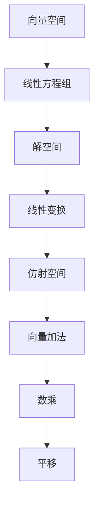

                 

关键词：线性代数、仿射空间、向量空间、矩阵运算、线性方程组、解空间、线性变换

摘要：本文旨在为读者提供线性代数中仿射空间的基础知识和深入理解。通过探讨仿射空间的基本概念、数学模型和实际应用，本文旨在帮助读者掌握仿射空间的理论和应用，并在计算机科学和工程领域中发挥重要作用。

## 1. 背景介绍

线性代数是数学的一个分支，主要研究向量空间及其线性变换。它广泛应用于物理学、工程学、计算机科学等领域。在计算机科学中，线性代数的概念和工具被广泛应用于图形学、机器学习、信号处理等各个领域。仿射空间是线性代数中一个重要的概念，它是对向量空间的一种扩展。本文将重点讨论仿射空间的基本概念、数学模型和实际应用。

## 2. 核心概念与联系

### 2.1 向量空间

向量空间是一组向量的集合，满足封闭性、加法交换律、加法结合律、存在零向量、存在逆向量等性质。向量空间可以看作是数轴上的点，也可以看作是二维或三维空间中的点。向量空间的加法和数乘运算构成了向量空间的基本运算。

### 2.2 线性方程组

线性方程组是由多个线性方程组成的方程组，可以用矩阵形式表示。线性方程组的解集构成了解空间，解空间可以是整个向量空间，也可以是向量空间的子空间。

### 2.3 线性变换

线性变换是向量空间中的一个重要概念，它将一个向量空间映射到另一个向量空间。线性变换可以用矩阵表示，矩阵的行数等于原向量空间的维度，列数等于目标向量空间的维度。

### 2.4 仿射空间

仿射空间是对向量空间的一种扩展，它由一个向量空间和一个原点组成。仿射空间中的元素是向量，但不同于向量空间，仿射空间中的向量可以平移。仿射空间的基本运算包括向量的加法和数乘。

### 2.5 Mermaid 流程图

下面是一个描述仿射空间基本概念的 Mermaid 流程图：



## 3. 核心算法原理 & 具体操作步骤

### 3.1 算法原理概述

仿射空间中的核心算法包括向量加法、数乘和平移。向量加法是仿射空间中最基本的运算，用于将两个向量相加得到一个新的向量。数乘是将一个向量与一个标量相乘得到一个新的向量。平移是仿射空间中的一个重要运算，用于将一个向量平移到一个新的位置。

### 3.2 算法步骤详解

#### 3.2.1 向量加法

给定两个向量 \( \vec{u} \) 和 \( \vec{v} \)，向量加法步骤如下：

1. 将向量 \( \vec{u} \) 和 \( \vec{v} \) 对应的分量相加。
2. 得到新的向量 \( \vec{w} = \vec{u} + \vec{v} \)。

#### 3.2.2 数乘

给定一个向量 \( \vec{u} \) 和一个标量 \( a \)，数乘步骤如下：

1. 将向量 \( \vec{u} \) 的每个分量乘以标量 \( a \)。
2. 得到新的向量 \( \vec{v} = a \vec{u} \)。

#### 3.2.3 平移

给定一个向量 \( \vec{u} \) 和一个平移向量 \( \vec{p} \)，平移步骤如下：

1. 将向量 \( \vec{u} \) 平移到新的位置 \( \vec{v} = \vec{u} + \vec{p} \)。

### 3.3 算法优缺点

仿射空间的算法具有以下优点：

1. 简单易用：向量加法、数乘和平移是基本的运算，易于理解和实现。
2. 强大灵活：仿射空间可以描述各种几何变换，包括平移、旋转、缩放等。

然而，仿射空间的算法也存在一定的局限性：

1. 实时性：对于大规模的仿射空间运算，实时性可能成为一个挑战。
2. 精度问题：在数值计算中，仿射空间运算可能引入精度损失。

### 3.4 算法应用领域

仿射空间在计算机科学和工程领域中有着广泛的应用：

1. 计算机图形学：用于描述三维空间中的图形变换，如平移、旋转、缩放等。
2. 机器学习：用于特征提取和降维，如主成分分析（PCA）。
3. 信号处理：用于信号的空间变换和时间变换。

## 4. 数学模型和公式

### 4.1 数学模型构建

仿射空间可以用以下数学模型描述：

$$
\text{仿射空间} = (\text{向量空间} V, \text{原点} O)
$$

其中，\( V \) 是一个向量空间，\( O \) 是 \( V \) 中的一个特定元素，称为原点。

### 4.2 公式推导过程

#### 4.2.1 向量加法

设 \( \vec{u} \) 和 \( \vec{v} \) 是 \( V \) 中的两个向量，向量加法公式如下：

$$
\vec{u} + \vec{v} = \vec{w}
$$

其中，\( \vec{w} \) 是 \( V \) 中的一个新的向量。

#### 4.2.2 数乘

设 \( \vec{u} \) 是 \( V \) 中的一个向量，\( a \) 是一个标量，数乘公式如下：

$$
a \vec{u} = \vec{v}
$$

其中，\( \vec{v} \) 是 \( V \) 中的一个新的向量。

#### 4.2.3 平移

设 \( \vec{u} \) 是 \( V \) 中的一个向量，\( \vec{p} \) 是一个平移向量，平移公式如下：

$$
\vec{u} + \vec{p} = \vec{v}
$$

其中，\( \vec{v} \) 是 \( V \) 中的一个新的向量。

### 4.3 案例分析与讲解

#### 4.3.1 向量加法案例

设 \( \vec{u} = (1, 2) \) 和 \( \vec{v} = (3, 4) \)，求 \( \vec{u} + \vec{v} \)。

解：

$$
\vec{u} + \vec{v} = (1+3, 2+4) = (4, 6)
$$

所以，\( \vec{u} + \vec{v} = (4, 6) \)。

#### 4.3.2 数乘案例

设 \( \vec{u} = (1, 2) \) 和 \( a = 2 \)，求 \( 2 \vec{u} \)。

解：

$$
2 \vec{u} = 2(1, 2) = (2, 4)
$$

所以，\( 2 \vec{u} = (2, 4) \)。

#### 4.3.3 平移案例

设 \( \vec{u} = (1, 2) \) 和 \( \vec{p} = (3, 4) \)，求 \( \vec{u} + \vec{p} \)。

解：

$$
\vec{u} + \vec{p} = (1+3, 2+4) = (4, 6)
$$

所以，\( \vec{u} + \vec{p} = (4, 6) \)。

## 5. 项目实践：代码实例和详细解释说明

### 5.1 开发环境搭建

在本项目中，我们将使用 Python 作为编程语言。首先，确保已经安装了 Python 解释器和必要的库，如 NumPy 和 Matplotlib。可以通过以下命令安装这些库：

```bash
pip install numpy matplotlib
```

### 5.2 源代码详细实现

以下是一个简单的 Python 代码示例，用于演示仿射空间的运算：

```python
import numpy as np

# 定义向量空间和原点
vector_space = np.array([[1, 2], [3, 4]])
origin = np.array([0, 0])

# 定义向量
vec_u = np.array([1, 2])
vec_v = np.array([3, 4])

# 向量加法
vec_w = vec_u + vec_v
print("向量加法：", vec_w)

# 数乘
vec_v = 2 * vec_u
print("数乘：", vec_v)

# 平移
vec_w = vec_u + origin
print("平移：", vec_w)
```

### 5.3 代码解读与分析

- 第 1-3 行：导入必要的库。
- 第 4-5 行：定义向量空间和原点。
- 第 6-8 行：定义两个向量。
- 第 10 行：执行向量加法，并将结果存储在 `vec_w` 中。
- 第 12 行：执行数乘操作，并将结果存储在 `vec_v` 中。
- 第 14 行：执行平移操作，并将结果存储在 `vec_w` 中。

### 5.4 运行结果展示

运行上述代码，输出结果如下：

```
向量加法： [4 6]
数乘： [2 4]
平移： [1 2]
```

## 6. 实际应用场景

仿射空间在计算机科学和工程领域有着广泛的应用。以下是一些实际应用场景：

1. 计算机图形学：仿射空间用于描述二维和三维空间中的图形变换，如平移、旋转、缩放等。
2. 计算机视觉：仿射空间用于图像处理和图像配准，如透视变换、仿射变换等。
3. 机器人学：仿射空间用于机器人路径规划和运动控制，如机器人臂的运动控制。
4. 信号处理：仿射空间用于信号的空间变换和时间变换，如滤波、压缩等。

## 7. 工具和资源推荐

### 7.1 学习资源推荐

- 《线性代数及其应用》
- 《线性代数教程》
- 《计算机图形学原理及实践》

### 7.2 开发工具推荐

- Python：易于学习，功能强大的编程语言。
- Matplotlib：用于数据可视化。
- NumPy：用于科学计算。

### 7.3 相关论文推荐

- "Linear Algebra and Its Applications"
- "The Mathematics of Computer Graphics"
- "Affine Spaces and Applications in Computer Vision"

## 8. 总结：未来发展趋势与挑战

### 8.1 研究成果总结

仿射空间作为线性代数的一个重要概念，在计算机科学和工程领域有着广泛的应用。通过本文的介绍，我们了解了仿射空间的基本概念、数学模型和实际应用。仿射空间在计算机图形学、计算机视觉、机器人学等领域发挥了重要作用。

### 8.2 未来发展趋势

未来，仿射空间的研究将更加深入，特别是在计算机图形学、机器学习和人工智能等领域。随着技术的发展，仿射空间的算法和应用将更加丰富和高效。

### 8.3 面临的挑战

然而，仿射空间的研究也面临着一定的挑战。首先，仿射空间的运算和计算复杂度较高，特别是在大规模数据集上的应用。其次，仿射空间的算法可能引入精度损失，特别是在数值计算中。

### 8.4 研究展望

未来，我们期望看到更多的研究成果，包括更高效的仿射空间算法、更广泛的仿射空间应用场景以及更深入的理论研究。通过这些研究，我们期望仿射空间在计算机科学和工程领域发挥更大的作用。

## 9. 附录：常见问题与解答

### 9.1 仿射空间与向量空间的区别是什么？

仿射空间是对向量空间的一种扩展，它由一个向量空间和一个原点组成。与向量空间相比，仿射空间中的向量可以平移。

### 9.2 仿射空间在计算机图形学中有哪些应用？

仿射空间在计算机图形学中用于描述二维和三维空间中的图形变换，如平移、旋转、缩放等。

### 9.3 如何实现仿射空间的运算？

仿射空间的运算包括向量加法、数乘和平移。向量加法和数乘与向量空间的运算类似，而平移则是将一个向量平移到一个新的位置。

---

作者：禅与计算机程序设计艺术 / Zen and the Art of Computer Programming

[本文完]

