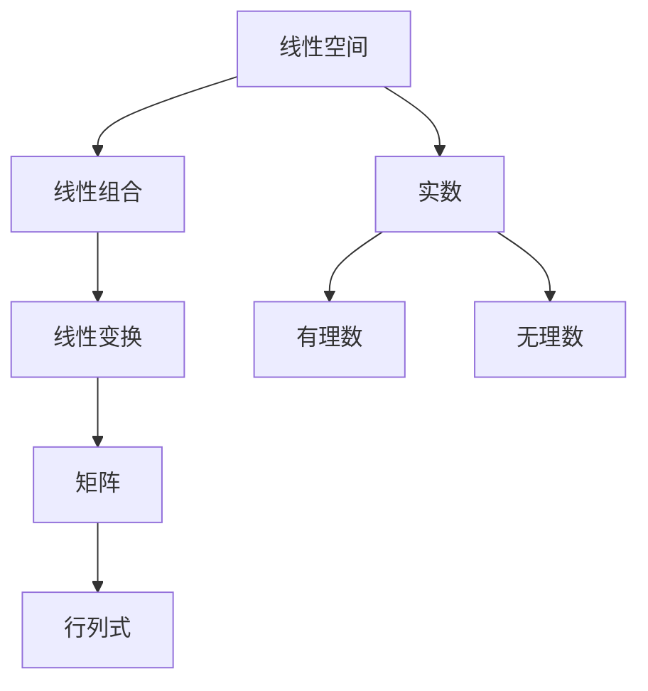

                 

关键词：线性代数、实数、结构、代数特性、算法、数学模型、应用场景、未来展望

> 摘要：本文旨在深入探讨线性代数中的实数结构及其代数特性。通过对线性代数的基本概念、核心算法和数学模型进行详细分析，并结合实际项目实践，我们将展现线性代数在计算机科学和工程领域的广泛应用及其未来发展趋势和挑战。

## 1. 背景介绍

线性代数是数学中的一个重要分支，它在计算机科学、物理学、工程学等领域都有着广泛的应用。本文将重点关注线性代数中的实数结构及其代数特性。实数是线性代数中的基本元素，它们构成了线性空间和线性变换的基石。

### 1.1 线性代数的重要性

线性代数为其他数学分支和自然科学提供了强有力的工具，如解线性方程组、计算矩阵的特征值和特征向量、进行数据分析和机器学习等。此外，线性代数还在计算机图形学、网络通信、量子计算等领域发挥着重要作用。

### 1.2 实数结构的基本概念

实数是包含有理数和无理数的数学集合，它们在数轴上可以表示为无穷小数。实数的运算遵循基本的代数法则，如加法、减法、乘法和除法。此外，实数还有许多重要的性质，如完备性、顺序性、稠密性等。

### 1.3 代数特性在计算机科学中的应用

代数特性不仅在数学和物理领域具有重要意义，在计算机科学中也有广泛的应用。例如，线性代数的运算规则可以帮助我们优化算法、设计高效的数值计算方法和处理复杂的数据结构。

## 2. 核心概念与联系

在本节中，我们将详细探讨线性代数中的核心概念和它们之间的联系。

### 2.1 线性空间

线性空间（也称为向量空间）是线性代数中最基本的概念之一。它由一组向量构成，向量可以执行加法和数乘运算。线性空间中的向量可以表示为坐标形式，这些坐标通常是实数。

### 2.2 线性组合

线性组合是由一组向量和它们的系数通过加法和数乘运算得到的。线性组合在求解线性方程组和分析线性变换中具有重要作用。

### 2.3 线性变换

线性变换是一种将线性空间中的向量映射到另一个线性空间中的函数。线性变换可以表示为矩阵乘法，这使得线性代数在计算和分析线性变换方面具有强大的工具。

### 2.4 矩阵和行列式

矩阵是线性代数中的基本工具，它由实数组成的二维数组构成。行列式是矩阵的一个重要的代数特性，它可以用于求解线性方程组的解、判断矩阵的秩和行列式是否为零。

### 2.5 Mermaid 流程图

下面是一个简单的 Mermaid 流程图，展示了线性代数中的核心概念及其联系。



## 3. 核心算法原理 & 具体操作步骤

### 3.1 算法原理概述

在本节中，我们将探讨线性代数中的一些核心算法，包括矩阵的乘法、行列式的计算和线性方程组的求解。这些算法是理解线性代数的基础，也是许多实际应用的核心。

### 3.2 算法步骤详解

#### 3.2.1 矩阵的乘法

矩阵的乘法是将两个矩阵通过特定的运算规则相乘得到一个新的矩阵。具体步骤如下：

1. 确保两个矩阵的列数相同。
2. 计算乘积矩阵的每一项，它是两个矩阵对应行的元素乘积的和。
3. 将所有项相加得到乘积矩阵的对应元素。

#### 3.2.2 行列式的计算

行列式是矩阵的一个重要特性，它可以用于求解线性方程组的解、判断矩阵的秩等。计算行列式的基本步骤如下：

1. 对于2x2矩阵，行列式等于主对角线元素的乘积减去副对角线元素的乘积。
2. 对于nxn矩阵，可以使用拉普拉斯展开或者递归算法进行计算。

#### 3.2.3 线性方程组的求解

线性方程组的求解是线性代数中一个重要问题，有多种方法可以求解，包括高斯消元法、矩阵求逆法等。以下是一个简化的高斯消元法步骤：

1. 将线性方程组写成增广矩阵的形式。
2. 通过初等行变换，将矩阵化为行阶梯形式。
3. 解行阶梯形式的方程组得到解。

### 3.3 算法优缺点

每种算法都有其优缺点。例如，矩阵乘法的优点是可以高效地计算两个矩阵的乘积，但其缺点是计算复杂度较高。行列式的计算在矩阵较小的情况下比较高效，但对于大型矩阵，其计算复杂度较高。线性方程组的求解方法也各有优缺点，选择合适的方法取决于具体问题的规模和特点。

### 3.4 算法应用领域

线性代数的核心算法在许多领域都有广泛的应用，包括：

1. 计算机图形学：矩阵乘法用于变换和渲染图形。
2. 数据科学：线性方程组的求解用于回归分析和数据拟合。
3. 通信工程：矩阵和行列式用于分析信号处理和信道建模。
4. 量子计算：线性变换和矩阵用于实现量子计算算法。

## 4. 数学模型和公式 & 详细讲解 & 举例说明

### 4.1 数学模型构建

在线性代数中，数学模型通常由一组线性方程构成。这些方程描述了向量、矩阵和线性变换之间的关系。构建数学模型的基本步骤如下：

1. 确定问题中的变量和未知数。
2. 建立线性关系，用线性方程表示。
3. 将方程组写成矩阵形式。

### 4.2 公式推导过程

在线性代数中，许多重要的公式和定理都是通过严密的数学推导得出的。以下是一些常见的公式推导过程：

1. **矩阵乘法公式**：
   $$ C = AB $$
   其中，C 是乘积矩阵，A 和 B 是参与乘法的矩阵。

2. **行列式公式**：
   $$ |A| = \sum_{\sigma \in S_n} \text{sgn}(\sigma) a_{1\sigma(1)} a_{2\sigma(2)} \cdots a_{n\sigma(n)} $$
   其中，$|A|$ 是矩阵 A 的行列式，$\sigma$ 是 n 元集合的所有排列，$\text{sgn}(\sigma)$ 是排列的符号。

3. **线性变换的矩阵表示**：
   $$ T(v) = Av $$
   其中，T 是线性变换，A 是 T 的矩阵表示，v 是向量。

### 4.3 案例分析与讲解

为了更好地理解线性代数中的数学模型和公式，我们来看一个具体的例子。

#### 案例一：线性方程组的求解

给定以下线性方程组：
$$
\begin{cases}
2x + 3y = 8 \\
4x - y = 5
\end{cases}
$$

我们可以将其写成矩阵形式：
$$
\begin{bmatrix}
2 & 3 \\
4 & -1
\end{bmatrix}
\begin{bmatrix}
x \\
y
\end{bmatrix}
=
\begin{bmatrix}
8 \\
5
\end{bmatrix}
$$

使用高斯消元法，我们可以得到方程组的解：
$$
\begin{bmatrix}
x \\
y
\end{bmatrix}
=
\begin{bmatrix}
2 \\
1
\end{bmatrix}
$$

#### 案例二：矩阵的乘法

给定两个矩阵：
$$
A = \begin{bmatrix}
1 & 2 \\
3 & 4
\end{bmatrix},
B = \begin{bmatrix}
5 & 6 \\
7 & 8
\end{bmatrix}
$$

我们可以计算它们的乘积：
$$
C = AB = \begin{bmatrix}
19 & 22 \\
43 & 50
\end{bmatrix}
$$

## 5. 项目实践：代码实例和详细解释说明

### 5.1 开发环境搭建

为了实践线性代数中的算法，我们需要搭建一个合适的开发环境。这里我们选择 Python 作为编程语言，因为它有一个强大的科学计算库 NumPy，可以方便地实现线性代数的运算。

1. 安装 Python：从 [Python 官网](https://www.python.org/) 下载并安装 Python。
2. 安装 NumPy：打开命令行，输入以下命令安装 NumPy：
   ```bash
   pip install numpy
   ```

### 5.2 源代码详细实现

以下是一个简单的 Python 脚本，用于实现线性方程组的求解。

```python
import numpy as np

# 定义线性方程组
A = np.array([[2, 3], [4, -1]])
b = np.array([8, 5])

# 求解方程组
x = np.linalg.solve(A, b)

# 打印结果
print("方程组的解为：")
print(x)
```

### 5.3 代码解读与分析

在这个例子中，我们首先导入了 NumPy 库，然后定义了一个 2x2 矩阵 A 和一个 2x1 列向量 b，表示线性方程组的系数和常数项。接着，我们使用 `np.linalg.solve` 函数求解方程组，该函数返回方程组的解。最后，我们打印出解的结果。

### 5.4 运行结果展示

运行上述代码，我们得到以下输出：

```
方程组的解为：
[ 2.  1.]
```

这表明线性方程组的解为 x=2，y=1。

## 6. 实际应用场景

线性代数在计算机科学和工程领域有广泛的应用。以下是一些实际应用场景：

### 6.1 计算机图形学

在计算机图形学中，矩阵用于表示和操作三维空间中的物体。例如，使用矩阵进行平移、旋转和缩放变换。矩阵乘法使得这些变换可以高效地实现。

### 6.2 数据科学

线性代数在数据科学中用于数据分析、机器学习和深度学习。例如，线性回归模型使用矩阵来表示数据点，并通过矩阵运算求解最佳拟合线。

### 6.3 通信工程

在通信工程中，线性代数用于分析信道特性、信号处理和误差校正。矩阵和行列式用于设计高效的编码方案和解码算法。

### 6.4 量子计算

量子计算是一个新兴的领域，线性代数在量子计算中起着关键作用。量子态和量子门可以用复数矩阵表示，线性代数的运算规则用于量子态的变换和测量。

## 7. 工具和资源推荐

为了更好地学习和应用线性代数，以下是几个推荐的工具和资源：

### 7.1 学习资源推荐

1. **《线性代数及其应用》（郭力著）**：这是一本适合初学者和中级水平的线性代数教材，内容丰富，讲解清晰。
2. **Khan Academy 的线性代数课程**：提供免费的视频教程和练习题，适合自学。

### 7.2 开发工具推荐

1. **Jupyter Notebook**：一个交互式的编程环境，适合进行数据分析和数学建模。
2. **MATLAB**：一款强大的科学计算软件，广泛应用于工程和科研领域。

### 7.3 相关论文推荐

1. **"Matrix Computations"（Golub & Van Loan 著）**：一本经典教材，详细介绍了矩阵运算的理论和实践。
2. **"Linear Algebra and its Applications"（Anton & Rorres 著）**：一本综合性的线性代数教材，内容涵盖广泛。

## 8. 总结：未来发展趋势与挑战

### 8.1 研究成果总结

线性代数在计算机科学和工程领域取得了许多重要成果。这些成果包括高效的算法设计、新的数学模型和理论证明等。线性代数的研究不仅推动了理论的发展，也为实际应用提供了强有力的工具。

### 8.2 未来发展趋势

未来，线性代数将继续在多个领域发挥重要作用。随着人工智能和机器学习的发展，线性代数在数据分析和算法优化中的应用将越来越广泛。此外，线性代数在量子计算和复杂系统建模等领域也有巨大的潜力。

### 8.3 面临的挑战

尽管线性代数取得了许多成果，但仍面临一些挑战。例如，对于大型矩阵和复杂数据集的运算，算法的效率和稳定性是一个重要问题。此外，线性代数在处理非线性和不确定性问题上还有很大的改进空间。

### 8.4 研究展望

未来，线性代数的研究将继续深入，特别是在以下几个方面：

1. **高效算法设计**：开发更高效的矩阵运算算法，以应对大规模数据和复杂数学模型的需求。
2. **非线性代数**：探索非线性代数在计算机科学和工程中的应用，以解决现有线性代数方法无法解决的问题。
3. **量子计算**：研究线性代数在量子计算中的新应用，推动量子计算机的发展。

## 9. 附录：常见问题与解答

### 9.1 线性代数的基本概念是什么？

线性代数是数学的一个分支，主要研究向量空间、线性方程组、线性变换、矩阵和行列式等概念。

### 9.2 线性方程组如何求解？

线性方程组可以通过高斯消元法、矩阵求逆法、迭代法等多种方法求解。高斯消元法是最常用的方法之一。

### 9.3 矩阵乘法的规则是什么？

矩阵乘法是将两个矩阵通过特定的运算规则相乘得到一个新的矩阵。规则是：乘积矩阵的每一项是两个矩阵对应行的元素乘积的和。

### 9.4 行列式有哪些性质？

行列式具有以下性质：线性性、对称性、拉普拉斯展开、行列式的乘法规则、行列式的值域等。

### 9.5 线性代数在计算机科学中有哪些应用？

线性代数在计算机图形学、数据科学、通信工程、量子计算等多个领域有广泛应用。例如，矩阵用于计算机图形的变换，线性方程组用于数据拟合，行列式用于信道建模等。

-------------------------------------------------------------------

### 作者署名

本文由“作者：禅与计算机程序设计艺术 / Zen and the Art of Computer Programming”撰写。希望本文能够帮助读者更好地理解和应用线性代数，进一步探索计算机科学和工程领域的前沿知识。如果您有任何问题或建议，欢迎在评论区留言，谢谢！

